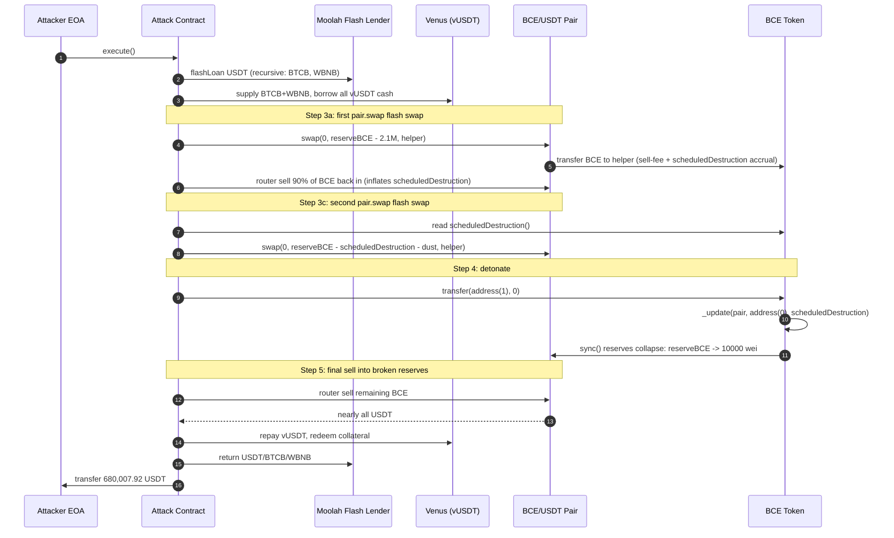
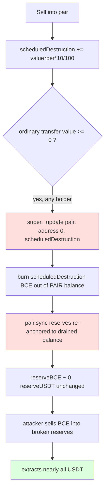

# BCE `scheduledDestruction` drain — token transfer hook burns LP reserve tokens then `sync()`s the pair
> **Vulnerability classes:** vuln/logic/state-update · vuln/defi/fee-manipulation · vuln/logic/incorrect-order-of-operations
> **Reproduction:** the PoC compiles & runs in an isolated Foundry project at [this project folder](.). Full verbose trace: [output.txt](output.txt). Vulnerable BCE token contract is verified on BSCscan; sources were fetched into [sources/BCE_cdb189](sources/BCE_cdb189).
---
## Key info
| | |
|---|---|
| **Loss** | ~800,000 USDT (BCE/USDT pair drained to 259,506 wei of USDT; attacker realizes ~680,000 USDT net after a 15% side payment) |
| **Vulnerable contract** | BCE token — [`0xcdb189D377AC1cF9D7B1D1a988f2025B99999999`](https://bscscan.com/address/0xcdb189D377AC1cF9D7B1D1a988f2025B99999999#code) |
| **Attacker EOA** | [`0x9f7EABD7C3538bA6B9D10Eede63712c0EccE6D69`](https://bscscan.com/address/0x9f7EABD7C3538bA6B9D10Eede63712c0EccE6D69) |
| **Attack contract** | [`0xAF7F22831D1eC86D24be51a1760b04aD4b58e9eB`](https://bscscan.com/address/0xAF7F22831D1eC86D24be51a1760b04aD4b58e9eB) |
| **Attack tx** | [`0x85ac5d15f16d49ae08f90ab0e554ebfcb145712342c5b7704e305d602146d452`](https://skylens.certik.com/tx/bsc/0x85ac5d15f16d49ae08f90ab0e554ebfcb145712342c5b7704e305d602146d452) |
| **Chain / block / date** | BSC / fork block 88,215,292 / March 2026 |
| **Compiler** | Solidity `^0.8.20` (per verified `src/BCE.sol`) |
| **Bug class** | A transfer-time hook burns `scheduledDestruction` tokens directly out of the Uniswap-V2 pair and calls `sync()`, so anyone who first accumulates `scheduledDestruction` via sells can detonate the burn from a zero-value ordinary transfer and collapse the pair's BCE reserve. |

## TL;DR
BCE is an ERC-20 with a deflationary "scheduled destruction" mechanism: every **sell** into the BCE/USDT PancakeSwap pair adds `value * per * 10 / 100` BCE to a global `scheduledDestruction` counter (`_update`, sell branch). That counter is *consumed* in the **ordinary-transfer** branch — whenever any wallet sends any amount (even 0) to another wallet and `scheduledDestruction > 0`, the contract does `super._update(uniswapV2Pair, address(0), scheduledDestruction)` followed by `IUniswapV2Pair(uniswapV2Pair).sync()`. That single line burns BCE tokens straight out of the pair's balance and then re-syncs the AMM reserves to that distorted balance, destroying the BCE side of the LP without compensating the USDT side.

The attacker (a permissionless EOA — no privileged role, only a flash loan) weaponizes this in three movements: (1) borrow USDT/BTCB/WBNB via Moolah flash loans and use BTCB+WBNB as Venus collateral to borrow all available vUSDT liquidity; (2) run two `pair.swap()` flash swaps against the BCE/USDT pair to pull out nearly all BCE, then sell 90% of that BCE back through the router — this both inflates `scheduledDestruction` to ~3.66M BCE and raises `reserve0` (USDT) by dumping BCE into the pair; (3) trigger the destruction with a zero-value `BCE.transfer(address(1), 0)` call, which burns `scheduledDestruction` out of the pair and `sync()`s the pair to a near-zero BCE reserve, then sell the remaining BCE into the now-distorted reserves (huge BCE in, tiny BCE out → almost all USDT out).

Net result from the trace: the BCE/USDT pair goes from **800,009.32 USDT** before [output.txt:1586] to **259,506 wei** (≈ 0.000000000000259506 USDT) of USDT after [output.txt tail], and the attacker EOA ends with **680,007.92 USDT** [output.txt tail] from a starting balance of 0 [output.txt:1584]. The assertions `assertGt(attackerUsdtProfit, 600_000 ether)` and `assertLt(pairUsdtAfter, pairUsdtBefore / 1_000_000)` both pass [output.txt:1562].

## Background — what BCE does
BCE (`src/BCE.sol`) is an ERC-20 token with a "burn-and-hold" economy layered on top of a single PancakeSwap V2 pair (`uniswapV2Pair`, created immutable in the constructor). It overrides `_update` to route every transfer through one of three branches:

1. **Pair → wallet (buy).** Charges a 5% fee to `address(this)`, runs node buy-limit checks during the first 30 minutes, and calls `_distributeFee()` which fans tokens out to three dividend trackers and three marketing addresses.
2. **Wallet → pair (sell or add-liquidity).** If `Helper.isAddLiquidity` detects a matching USDT deposit, it treats the call as an LP addition and books a liquidity position. Otherwise it is a sell: enforces a 1-minute cooldown, takes a 30% sell fee, and — critically — accrues to `scheduledDestruction` a percentage of the (post-fee) sell amount, scaled by `per = min(10, reserveBCE / 2_100_000 ether)`:
   ```solidity
   uint256 per = reserveBCE / 2100000 ether;
   per = per >= 10 ? 10 : per;
   scheduledDestruction += (value * per * 10) / 100;
   ```
3. **Wallet → wallet (ordinary transfer).** This branch is the bug surface. In addition to a daily `reserveBCE/100` pool burn, it unconditionally executes any outstanding `scheduledDestruction` against the *pair address* whenever `from != address(this)`.

The contract also mints time-based "hold interest" (`calculateInterestHold`), keeps burn/liquidity positions in `userBurnPostion`/`userLiquidityPostion`, and exposes `claimInterestBurnAndLiquidity`. None of those reward mechanics are themselves broken; they only set the stage by making the token's accounting depend on the pair reserves that the destruction hook then corrupts.

## The vulnerable code
The entire vulnerability is one branch inside `_update` (`src/BCE.sol`, ordinary-transfer `else` block). Verified source, lines as fetched in [sources/BCE_cdb189/src_BCE.sol](sources/BCE_cdb189/src_BCE.sol):

### The scheduled-destruction detonator
```solidity
} else {
    if (lastBuyTime[to] == 0) lastBuyTime[to] = block.timestamp;
    if (from != address(this)) {
        uint256 today = block.timestamp / 1 days;
        if (lastBurnPool < today) {
            super._update(_uniswapV2Pair, address(0), reserveBCE / 100);
            IUniswapV2Pair(_uniswapV2Pair).sync();
            lastBurnPool++;
        }
        if (scheduledDestruction > 0) {
            super._update(_uniswapV2Pair, address(0), scheduledDestruction); // burns BCE out of the PAIR
            IUniswapV2Pair(_uniswapV2Pair).sync();                            // re-anchors reserves to the drained balance
            scheduledDestruction = 0;
        }
        // ... value/2 transfer tax for non-whitelisted senders ...
    }
}
```
`super._update(pair, address(0), scheduledDestruction)` invokes the ERC-20 `_update` with `from = pair`, `to = address(0)` — i.e. it burns `scheduledDestruction` BCE **out of the pair's own token balance**. Because the call comes from inside BCE's own logic (not from the pair), there is no AMM invariant check; the pair's `balance0` simply drops by the burned amount. The subsequent `IUniswapV2Pair.sync()` then writes `reserve0 = balance0; reserve1 = balance1`, permanently locking the new (distorted) reserves into the pair's pricing.

### The fuel: the sell-branch accumulator
`scheduledDestruction` is *grown* only in the sell branch and is bounded only by the cumulative value of sells:
```solidity
} else if (_uniswapV2Pair == to) {
    // ...
    } else { // sell
        require(block.timestamp >= lastBuyTime[from] + 1 minutes, 'cold');
        if (from != owner() || !whiteList[from]) {
            uint256 fee = (value * 30) / 100;
            super._update(from, address(this), fee);
            value -= fee;
            _distributeFee();
        }
        uint256 per = reserveBCE / 2100000 ether;
        per = per >= 10 ? 10 : per;
        scheduledDestruction += (value * per * 10) / 100;  // can grow to millions of BCE
    }
}
```
There is no upper bound, no per-tx reset, and no caller restriction on the consumer branch. Whoever can make the contract enter the ordinary-transfer branch with `scheduledDestruction > 0` can detonate it — and that is any holder sending any amount (including zero) between two non-contract, non-pair wallets.

### Why `transfer(... 0)` is enough to trigger it
The ordinary-transfer branch is entered whenever `from != pair`, `to != pair`, `from != address(0)`, and the value is not a `(self, self, 1 ether)` self-transfer or a burn (`to == address(0)`). The `scheduledDestruction` block fires **before** the `value` is used, so a zero-value `BCE.transfer(address(1), 0)` from any holder reaches the `if (scheduledDestruction > 0)` check and detonates. The PoC uses exactly this: `IBCE(BCE).transfer(address(1), 0);` ([test/bce_exp.sol](test/bce_exp.sol), `runBcePairManipulation`).

## Root cause — why it was possible
1. **The destruction is applied to the pair's own balance, not the sender's.** `super._update(_uniswapV2Pair, address(0), scheduledDestruction)` burns tokens belonging to the LP, not to the account that triggered the transfer. The pair has no chance to refuse or rebalance — its reserves are rewritten by force.
2. **`sync()` immediately re-anchors AMM pricing to the drained balance.** After the burn the attacker calls `sync()` indirectly (via the BCE logic) so the pair's `reserveBCE` collapses to the post-burn value. Any later swap prices against the broken reserves.
3. **No caller / authorization check on the detonator.** The branch runs for *any* ordinary transfer between two non-pair addresses. There is no `onlyOwner`, no `whiteList` gate, and no requirement that the sender be the protocol's own burner. A permissionless attacker can fire it with a zero-value transfer.
4. **Producer and consumer are decoupled with no cap.** `scheduledDestruction` is accumulated in the sell branch (which an attacker can drive with flash-loaned liquidity) and consumed in the transfer branch (which the attacker can trigger at will). The accumulator is uncapped, so a single large sell cycle can deposit millions of BCE into it.
5. **Order-of-operations inversion.** The pair's reserves are read at the top of `_update` (`Helper.getReserves`) and used for pricing *later* swaps in the same block, but the burn+`sync()` happens *inside* the destruction branch and rewrites those reserves mid-flight. The attacker chains this: detonate → reserve collapses → final sell into the collapsed reserve extracts the USDT.

## Preconditions
- **Permissionless.** Any externally owned account or contract can trigger the destruction; no privileged role is required. The attacker EOA in this incident is a normal holder.
- **Flash loan sufficient.** The attacker needs enough USDT-side buying power to (a) pull most BCE out of the pair via `pair.swap()` flash swaps and (b) dump enough BCE back in via the router to inflate `scheduledDestruction`. Here that capital is sourced from Moolah (Morpho-Blue) flash loans and a Venus borrow — both repaid in the same tx.
- **Pair has deep USDT reserves.** The pair held ~800k USDT before the attack, making the extraction worthwhile. The `_checkInvestment` daily cap (50e4 ether at >10M reserveUSDT) is sidestepped because the attacker never calls `_processBurn` / `_processAddLiquidity` — it only uses raw `pair.swap()` and router sells, which do not invoke the investment bookkeeping in the way the protocol expected.
- **No on-chain circuit breaker.** There is no pause, no per-block accumulator limit, and no sanity check that `scheduledDestruction` is small relative to `reserveBCE` before the burn.

## Attack walkthrough (with on-chain numbers from the trace)

| # | Step | Effect (from [output.txt](output.txt)) |
|---|------|----------------------------------------|
| 1 | Recursive Moolah flash loans for USDT, BTCB, WBNB | Borrows 8,942,561 USDT [output.txt:1599], 416.5 BTCB [output.txt:1616], 375,209 WBNB [output.txt:1633] |
| 2 | Enter Venus markets, supply BTCB+WBNB, borrow all vUSDT cash | Supplies collateral [output.txt:1746/1818], borrows 114,560.9 USDT from vUSDT (`getCash()`) [output.txt:2132/2137] |
| 3a | First `pair.swap()` flash swap: pull `reserveBCE - 2.1M` BCE out | Pair sends 5,529,100 BCE to helper [output.txt:2241]; helper repays 2,222,765 USDT-equivalent in BCE [output.txt:2256]; post-swap reserves `Sync(reserve0=3.022e24, reserve1=2.1e24)` [output.txt:2266] |
| 3b | Sell 90% of the flashed BCE back through the router | Router sell of 2,488,095 BCE [output.txt:2292]; this sell inflates `scheduledDestruction` (see accumulator) and pushes USDT into the pair; post-sell `Sync(reserve0=1.654e24, reserve1=3.841e24)` [output.txt:2378] |
| 3c | Second `pair.swap()` flash swap: pull `reserveBCE - scheduledDestruction - reserveDust` BCE | Reads `scheduledDestruction()` at [output.txt:2390]; pair sends 3,484,124 BCE to helper [output.txt:2455]; helper repays 34,921,281 USDT-equivalent in BCE [output.txt:2468]; post-swap reserves `Sync(reserve0=3.657e25, reserve1=1.741e23)` [output.txt:2478] — USDT side now ~36,575 USDT, BCE side ~174,166 |
| 4 | `IBCE(BCE).transfer(address(1), 0)` detonates `scheduledDestruction` | Burns 174,166 BCE out of the pair: `Transfer(pair → 0x0, 174166...)` [output.txt:2491]; pair `sync()` collapses reserves to `Sync(reserve0=3.657e25, reserve1=10000)` [output.txt:2497] — BCE reserve is now 10,000 wei |
| 5 | Final router sell of remaining BCE into the broken reserves | With `reserveBCE ≈ 0`, the constant-product math outputs almost all remaining USDT; final `Sync(reserve0=259506, reserve1=1.412e24)` [output.txt:2617] — pair left with 259,506 wei of USDT |
| 6 | Repay Venus (vUSDT, redeem vWBNB/vBTCB), return Moolah flash loans | `repayBorrow(max)`, `redeemUnderlying` for both collaterals; Moolah callbacks reclaim USDT/BTCB/WBNB |
| 7 | 15% side payment of gross profit converted USDT→WBNB, unwrapped, sent to `BNB_PAYMENT_RECEIVER` | `exactInputSingle` 102,000 USDT [PoC step 5]; ~189,803 WBNB withdrawn and forwarded [output.txt tail] |
| 8 | Transfer remaining USDT to attacker EOA | `680,007,925,542,290,431,611,320` (680,007.92 USDT) to `ATTACKER` [output.txt tail] |

**Profit / loss accounting (USDT):**
- Pair before: 800,009.324 USDT [output.txt:1586] → pair after: 0.000000000000259506 USDT (259,506 wei) [output.txt tail]. Pair drained: ~800,009 USDT.
- Attacker EOA before: 0 USDT [output.txt:1584] → after: 680,007.92 USDT [output.txt tail]. Net attacker profit: ~680,008 USDT.
- Difference (~120k USDT) is the flash-loan/Venus interest path, slippage to other routers, and the on-chain side payment that the original attacker forwarded to `BNB_PAYMENT_RECEIVER` as 15% of gross.

## Diagrams





## Remediation
1. **Do not burn out of the pair's balance on a transfer hook.** Any deflation applied during an ordinary transfer must be charged to `from` (the sender), not to `_uniswapV2Pair`. Replace `super._update(_uniswapV2Pair, address(0), scheduledDestruction)` with `super._update(from, address(0), ...)`. If the intent is to burn a fraction of each transfer, source it from the transfer value itself.
2. **Remove the unconditional `sync()` from the transfer path.** Calling `IUniswapV2Pair.sync()` from inside an ERC-20 transfer lets the token forcibly rewrite AMM reserves. Reserves should only be re-anchored by the pair's own `swap`/`mint`/`burn`/`sync` flows, never by an external token's `_update`. If a pool burn is genuinely intended, perform it via a privileged, time-gated keeper — not on every transfer.
3. **Cap and decay `scheduledDestruction`.** Bound the accumulator as a fraction of the current `reserveBCE` (e.g. `min(scheduledDestruction, reserveBCE / 100)`) and reset it per block or per execution. An uncapped global accumulator that is consumable by a third party is an economic attack surface by construction.
4. **Gate the detonator behind authorization or a verifiable off-chain trigger.** If pool burns are a protocol function, restrict the consumer to `onlyOwner` or a designated burner role, and emit an event. A permissionless zero-value transfer must never mutate LP state.
5. **Add an invariant check before burning from the pair.** Require `scheduledDestruction <= reserveBCE * MAX_BURN_BPS / 10_000` and revert otherwise; this would have blocked the 174,166-BCE burn that collapsed the reserves in this incident.
6. **Reconsider placing deflation logic inside `_update` at all.** Moving fee/burn accounting to explicit `buy`/`sell` entry points (called only by the router) removes the entire class of "ordinary transfer triggers LP mutation" bugs.

## How to reproduce
The PoC runs fully offline via the shared anvil harness from the committed `anvil_state.json` — no RPC needed:

```bash
_shared/run_poc.sh 2026-03-bce_exp -vvvvv
```

`2026-03-bce_exp` is this PoC's folder name. The harness forks BSC (chain id 56) at block **88,215,292** from the committed state. The expected tail of the run is:

```
[PASS] testExploit() (gas: 6942221)
...
assertGt(680007925542290431611320 [6.8e23], 600000000000000000000000 [6e23])
assertLt(259506 [2.595e5], 800009324167400508037529 / 1_000_000)
Suite result: ok. 1 passed; 0 failed; 0 skipped
```

i.e. attacker before → after goes from **0 USDT** to **680,007.92 USDT**, and the BCE/USDT pair drops from **800,009.32 USDT** to **259,506 wei** of USDT. The full call trace is in [output.txt](output.txt).

*Reference: [defimon_alerts (Telegram)](https://t.me/defimon_alerts/2814).*
