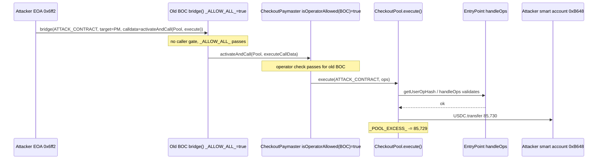
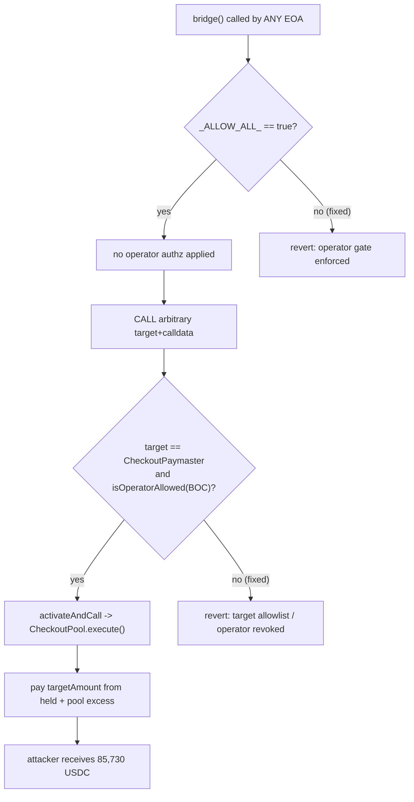

# Old CheckoutPool Bridge Operator (`_ALLOW_ALL_`) — permissionless bridge() routed an ERC-4337 paymaster into draining CheckoutPool's USDC excess
> **Vulnerability classes:** vuln/access-control/missing-auth · vuln/access-control/broken-logic · vuln/logic/missing-check
> **Reproduction:** the PoC compiles & runs in an isolated Foundry project at [this project folder](.). Full verbose trace: [output.txt](output.txt). The vulnerable contract (`Old CheckoutPool BOC`, `0x1304…c01A`) is **unverified on Polygonscan**; all vulnerable-code sections below are **RECONSTRUCTED from the foundry `-vvvvv` trace** of the on-chain transaction.
---

## Key info
| | |
|---|---|
| **Loss** | 85,730 USDC (85,729 from `CheckoutPool._POOL_EXCESS_` + 1 USDC held by the checkout) |
| **Vulnerable contract** | Old CheckoutPool Bridge Operator (BOC) — [`0x13046f513802de93f3fc48f0cdb2cb7df22ec01a`](https://polygonscan.com/address/0x13046f513802de93f3fc48f0cdb2cb7df22ec01a) (unverified) |
| **Attacker EOA** | [`0x6ff2be5d0e5b3974a818731e3ff6eeec8cd9d970`](https://polygonscan.com/address/0x6ff2be5d0e5b3974a818731e3ff6eeec8cd9d970) |
| **Attack contract** | [`0x9a5fe6e6a27f7eace0782b89e6b216849d871e4f`](https://polygonscan.com/address/0x9a5fe6e6a27f7eace0782b89e6b216849d871e4f) |
| **Attacker smart account** | [`0xb648db3bd2f7646d648570cf5765495d46011ae1`](https://polygonscan.com/address/0xb648db3bd2f7646d648570cf5765495d46011ae1) |
| **Attack tx** | [`0x957bcfa47657a198b683feb455f7957e8e6d912b5584a5af510f4ff8a41f4f5a`](https://polygonscan.com/tx/0x957bcfa47657a198b683feb455f7957e8e6d912b5584a5af510f4ff8a41f4f5a) |
| **Chain / block / date** | Polygon (chainId 137) / block 84,291,586 / 2026-03 |
| **Compiler** | Unverified on Polygonscan — unknown |
| **Bug class** | An abandoned bridge-operator contract left `_ALLOW_ALL_` enabled with no effective caller gate on `bridge()`, so any EOA could drive `bridge()` into the trusted CheckoutPaymaster, which called `CheckoutPool.execute()` and paid out a stored checkout's `targetAmount` from the pool's USDC balance/excess. |

## TL;DR
CheckoutPool is an ERC-4337 (account abstraction) payments pool: users register a "checkout" (a desired on-chain payment, e.g. pay 85,730 USDC to a recipient), lock up funds, and the pool later executes the payment via the EntryPoint under a CheckoutPaymaster that is allowed to spend pool **excess** to top up the portion above what the checkout holds. A separate, legacy "Bridge Operator Contract" (BOC) was used historically to relay deposits to the paymaster.

The bug is that the **old BOC** (`0x1304…c01A`) still had its `_ALLOW_ALL_` flag set to `true` and its `bridge(address depositAddress, BridgeParams calldata)` function enforced **no effective caller authorization** — anyone could call it. Worse, the CheckoutPaymaster still treated the old BOC as a whitelisted operator (`isOperatorAllowed(OLD_BOC) == true`). `bridge()` would take an arbitrary `BridgeParams.target` / `callData` and `CALL` it; the attacker pointed `target = CheckoutPaymaster` with `callData = activateAndCall(CheckoutPool, execute(depositAddress, userOp))`.

Because the old BOC is an accepted paymaster operator, `CheckoutPaymaster.activateAndCall` trusted the call, forwarded into `CheckoutPool.execute()`, which paid the checkout's full `targetAmount` (85,730 USDC) to the attacker-controlled smart account. The 1 USDC the checkout itself held was spent first; the remaining 85,729 USDC came straight out of `CheckoutPool._POOL_EXCESS_(USDC)`. The attacker started with 0 USDC and ended with **85,730 USDC** [output.txt:1564,1567,1732].

## Background — what CheckoutPool does
CheckoutPool is a paymaster-backed payment rail built on top of the ERC-4337 EntryPoint (`0x5FF137D4b0FDCD49DcA30c7CF57E578a026d2789`). A user (or an integrator on their behalf) creates a **checkout**: a structured record that says "on target chain 137, transfer `targetAmount` of `targetAsset` to `recipient`, gated on a specific ERC-4337 `userOpHash`, expiring at `expiration`." The checkout also tracks what has actually been **held** (`heldAsset` / `heldAmount`) inside the pool.

When the checkout is executed, `CheckoutPool.execute(depositAddress, ops)`:

1. Recomputes `userOpHash` via `EntryPoint.getUserOpHash(ops[0])` and checks it matches the stored checkout's hash.
2. Forwards the UserOperation bundle to `EntryPoint.handleOps(ops, beneficiary)`, which validates the account and paymaster signatures.
3. After execution, the pool pays out `params.targetAmount` of `params.targetAsset` to the recipient, and charges any shortfall (`targetAmount − heldAmount`) against a per-asset **excess** ledger `_POOL_EXCESS_(asset)`. This excess is the pool's working capital — funds it holds beyond what is earmarked by live checkouts — and is meant to be consumed only when the protocol itself (or a sanctioned bridge operator) drives a legitimate execution.

The **CheckoutPaymaster** (`0xD649…c586`) is the trusted paymaster that activates a checkout and performs the call into the pool. Crucially, it gates *who may ask it to activate* via `isOperatorAllowed(operator)`. The **Bridge Operator Contract** (BOC) is a relay/forwarder: an off-chain or on-chain component that moves a deposit through the paymaster. The BOC exposes `bridge(depositAddress, BridgeParams{target, spender, callData, bridgeReceivedAsset, minBridgeReceivedAmount})`, which performs a generic `CALL` to `BridgeParams.target` with `callData`, and is supposed to only be callable by authorized relayers. The deployment had two BOCs in play; the **old** one was supposed to be decommissioned but never had its operator status revoked on the paymaster or its `_ALLOW_ALL_` flag cleared.

## The vulnerable code
> The contracts at `0x1304…c01A` (old BOC), `0x1929…d215` (CheckoutPool), and `0xD649…c586` (CheckoutPaymaster) are **unverified on Polygonscan**. The snippets below are **RECONSTRUCTED from the decoded `-vvvvv` trace** in [output.txt](output.txt); signatures and control flow are grounded in the actual call sequence emitted by the on-chain code.

### Old BOC — `bridge()` (RECONSTRUCTED)
The `bridge()` function performs a fully attacker-controlled external call with no effective caller gate. The `_ALLOW_ALL_` flag being `true` means the operator whitelist is bypassed (or never checked).

```solidity
// RECONSTRUCTED from trace: OldBridgeOperator.bridge()
function bridge(address depositAddress, BridgeParams calldata bridgeParams) external {
    // BUG: no effective msg.sender check. _ALLOW_ALL_() == true disables the operator gate,
    // so ANY caller can reach this body.
    require(_ALLOW_ALL_(), "operator not allowed");

    // Generic, attacker-influenced external call: target + callData come straight from
    // bridgeParams with no restriction that target be a known/intended callee.
    (bool ok, bytes memory ret) = bridgeParams.target.call(bridgeParams.callData);
    if (!ok) revert(string(ret));

    // ...post-bridge bookkeeping, then:
    emit Bridged(
        depositAddress,
        targetChainDepositAddress,        // derived off the depositAddress/router
        bridgeParams.bridgeTarget,        // = CheckoutPaymaster in the exploit
        bridgeParams.bridgeReceivedAsset, // = USDC
        bridgeParams.minReceivedAmount    // = 0
    );
}
```

The trace confirms this shape directly: `vm.prank(TX_SENDER)` (the unprivileged attacker EOA) calling `oldBoc.bridge(...)` succeeds, and the very next internal call is `CheckoutPaymaster.activateAndCall(CheckoutPool, executeCallData)` — i.e. `bridgeParams.target` is the paymaster and `callData` is the `activateAndCall` selector [output.txt:1642].

### CheckoutPaymaster — operator gate (RECONSTRUCTED)
The paymaster trusts the old BOC, so the call from `bridge()` is treated as authorized:

```solidity
// RECONSTRUCTED from trace
function activateAndCall(address target, bytes calldata callData)
    external
    payable
    returns (bytes memory)
{
    // isOperatorAllowed(msg.sender) == true for OLD_BOC, so the check passes.
    require(isOperatorAllowed(msg.sender), "operator not allowed");
    emit BeforeExecution();
    return target.call(callData);   // forwards into CheckoutPool.execute(...)
}
```

The static call `CheckoutPaymaster.isOperatorAllowed(OLD_BOC)` returns `true` [output.txt:1621], proving the legacy operator was never revoked.

### CheckoutPool — `execute()` pays `targetAmount` from held + excess (RECONSTRUCTED)
```solidity
// RECONSTRUCTED from trace
function execute(address depositAddress, UserOperation[] calldata ops) external {
    CheckoutState memory c = getCheckout(depositAddress);
    require(EntryPoint.getUserOpHash(ops[0]) == c.params.userOpHash, "hash mismatch");
    // ... signature/paymaster validation delegated to EntryPoint.handleOps(ops, beneficiary)

    uint256 executionAmount = uint256(c.params.targetAmount); // 85,730 USDC
    IERC20(c.heldAsset).transfer(recipientOf(c.params.recipient), executionAmount);

    // Charge the shortfall against the pool's excess working capital.
    uint256 spend = executionAmount - c.heldAmount;          // 85,730 - 1 = 85,729
    _POOL_EXCESS_[c.heldAsset] -= spend;

    emit Executed(depositAddress, executionAmount);
}
```

The trace shows the canonical transfer and accounting: `USDC.transfer(Attacker smart account, 85,730,000,000)` from `CheckoutPool` [output.txt:1648], followed by `_POOL_EXCESS_(USDC)` dropping by exactly `85,729,000,000` [output.txt:1716,1719], and the final `Executed(depositAddress, executionAmount: 85,730,000,000)` event [output.txt:1679].

### Why the attacker controlled the recipient
The checkout whose `userOpHash` the attacker replayed was a **pre-existing, already-authorized checkout** registered against `depositAddress = ATTACK_CONTRACT` (`0x9A5fe…e4f`). The attacker simply observed it on-chain (its params, its recipient smart account `0xB648…ae1`, and the exact UserOperation that hashes to its `userOpHash`) and re-drove execution through the paymaster via the open `bridge()` door. No signature was forged: the UserOperation was already valid (the account's `validateUserOp` and the paymaster's `validatePaymasterUserOp` both returned success in the trace [output.txt:1655,1657]). The flaw was that an unprivileged party could *trigger* an execution the protocol intended only sanctioned operators to trigger — and that the pool's excess, not the checkout's own funds, covered most of the payout.

## Root cause — why it was possible
1. **No effective caller authorization on `bridge()` + `_ALLOW_ALL_ == true`.** The old BOC's `bridge()` reached its body for any `msg.sender` because the `_ALLOW_ALL_` flag bypassed operator whitelisting. There was no `onlyOwner` / `onlyOperator` modifier that survived the allow-all path. This is the primary access-control failure.
2. **Stale trust: the paymaster never revoked the old BOC.** Even after the new BOC was deployed, `CheckoutPaymaster.isOperatorAllowed(OLD_BOC)` still returned `true`. The decommissioned contract retained full paymaster-operator powers, so any capability the old BOC had (calling `activateAndCall`) remained weaponizable.
3. **Arbitrary-callee forwarding inside a trusted channel.** `bridge()` took `target` / `callData` from caller input and `CALL`'d them with no allowlist of permitted targets. Combined with the paymaster's blanket trust of the BOC, an attacker could route execution anywhere the paymaster could reach — most damagingly into `CheckoutPool.execute()`.
4. **Pool excess used as uncontrolled make-whole capital.** `CheckoutPool.execute()` covered any `targetAmount − heldAmount` shortfall out of `_POOL_EXCESS_`, which held 85,729 USDC more than the checkout had locked. With the authorization boundary broken at the BOC layer, this excess became directly extractable: the attacker only needed to point a valid (observed) checkout's execution at their own account.

## Preconditions
- **Permissionless trigger**: the attacker EOA (`0x6ff2…d970`) called `bridge()` directly with no special role, deposit, or allowance. `allowance(OLD_BOC → ATTACK_CONTRACT)` reads `0` in the trace, confirming the attacker funded nothing [output.txt: tail].
- **No flash loan required**: the exploit needed zero upfront capital; the pool paid out before any repayment was due.
- **A pre-existing valid checkout** against `depositAddress = ATTACK_CONTRACT`, with `userOpHash` reproducible from an on-chain-observable UserOperation and a recipient the attacker controlled. This is the only "setup" — and it was the attacker's own checkout, so it was trivially available.
- **`_ALLOW_ALL_() == true`** on the old BOC and **`isOperatorAllowed(OLD_BOC) == true`** on the paymaster — both confirmed as runtime `assertTrue` assertions in the PoC [output.txt:1617,1621].

## Attack walkthrough (with on-chain numbers from the trace)
All amounts in USDC (6 decimals). Fork block 84,291,586 on Polygon.

| Step | Actor | Action | Effect |
|------|-------|--------|--------|
| 0 | Attacker (off-chain) | Observe the checkout at `depositAddress = 0x9A5fe…e4f`: `targetAsset=USDC`, `targetAmount=85,730`, `heldAsset=USDC`, `heldAmount=1`, `recipient=0xB648…ae1`, `userOpHash` reproducible from a specific UserOperation. | Gains the inputs needed to satisfy `execute()`'s hash check. |
| 1 | Attacker EOA `0x6ff2…d970` | Call `oldBoc.bridge(ATTACK_CONTRACT, BridgeParams{ target: CheckoutPaymaster, spender: ATTACK_CONTRACT, callData: activateAndCall(CheckoutPool, execute(ATTACK_CONTRACT, ops)), bridgeReceivedAsset: USDC, minBridgeReceivedAmount: 0 })`. | `_ALLOW_ALL_()==true` lets the body run; `bridge()` `CALL`s the paymaster. |
| 2 | Old BOC → CheckoutPaymaster | `activateAndCall(CheckoutPool, executeCallData)`. `isOperatorAllowed(OLD_BOC)==true` → passes. | Paymaster forwards into `CheckoutPool.execute(ATTACK_CONTRACT, ops)`. |
| 3 | CheckoutPool | `EntryPoint.getUserOpHash(ops[0]) == checkout.userOpHash` → match. `EntryPoint.handleOps(ops, beneficiary)` validates account + paymaster (both succeed). | Checkout execution authorized. |
| 4 | CheckoutPool | `USDC.transfer(0xB648…ae1, 85,730 USDC)` from pool balance. | Attacker smart account: 0 → **85,730 USDC** [output.txt:1648,1732]. Pool balance: 85,737,269,319 → 7,269,319. |
| 5 | CheckoutPool | `_POOL_EXCESS_(USDC) -= (85,730 − 1) = 85,729 USDC`. | Excess: 416,864,931,356 → 331,365,931,356 (delta 85,729,000,000) [output.txt:1716,1719]. Emits `Executed(depositAddress, 85,730)` [output.txt:1679]. |
| 6 | Old BOC | Emits `Bridged(depositAddress, …, bridgeTarget=CheckoutPaymaster, receivedAsset=USDC, minReceivedAmount=0)` [output.txt:1693]. | Exploit complete. |

**Profit & loss accounting (attacker):**
- USDC in: 0
- USDC out (to attacker smart account): **+85,730 USDC**
- Net profit: **85,730 USDC**
- Source of funds: 1 USDC from the checkout's held balance + 85,729 USDC drained from `CheckoutPool._POOL_EXCESS_(USDC)`.

## Diagrams





## Remediation
1. **Enforce real caller authorization on `bridge()` and remove `_ALLOW_ALL_`.** Gate `bridge()` with an `onlyOperator` / `onlyOwner` modifier backed by a maintained allowlist; never ship a global allow-all flag on a function that performs arbitrary external calls.
2. **Revoke operator status for decommissioned contracts.** When a new BOC is deployed, immediately remove the old BOC from `CheckoutPaymaster`'s operator set (`isOperatorAllowed(OLD_BOC)` must return `false`) before — not after — the new one goes live. Treat key rotation as a paired set/unset operation.
3. **Allowlist `bridge()` targets.** `bridge()`'s `target`/`callData` forwarding should be constrained to a known set of permitted callees and selectors; do not let caller input reach a generic `CALL` inside a trusted channel.
4. **Bound pool-excess exposure in `execute()`.** Only charge `_POOL_EXCESS_` when execution is provably initiated by an authorized operator (not merely by *any* caller that reaches `execute` via the paymaster). Alternatively, refuse to spend excess on externally-triggered executions, requiring the checkout to be fully funded (`heldAmount == targetAmount`) before payout.
5. **Add kill-switch / pause to the old BOC.** Legacy relay contracts should carry a self-disable/pause that the team can flip the moment they are superseded, so a forgotten trust grant cannot be exercised later.

## How to reproduce
The PoC runs **fully offline** via the shared anvil harness from the committed fork state — no RPC needed. From the registry root:

```bash
_shared/run_poc.sh 2026-03-unverified_1304_exp -vvvvv
```

- **Chain / fork block**: Polygon (chainId 137) at block **84,291,586**, loaded from `anvil_state.json` on the per-chain port.
- **Expected result**: `[PASS] testExploit()` with the attacker smart account USDC balance going `0.000000 → 85,730.000000` and `USDC excess consumed: 85,729.000000` [output.txt:1562,1564,1566,1567,1732].
- The PoC reproduces the on-chain attack transaction exactly: it `vm.prank`s the attacker EOA and calls `oldBoc.bridge(...)` with the observed UserOperation. All runtime assertions (`_ALLOW_ALL_()==true`, `isOperatorAllowed(OLD_BOC)==true`, `userOpHash` match, `executionAmount > heldAmount`) pass against the real forked state.

*Reference: [DefimonAlerts on X](https://x.com/DefimonAlerts/status/2034532547191820390).*
