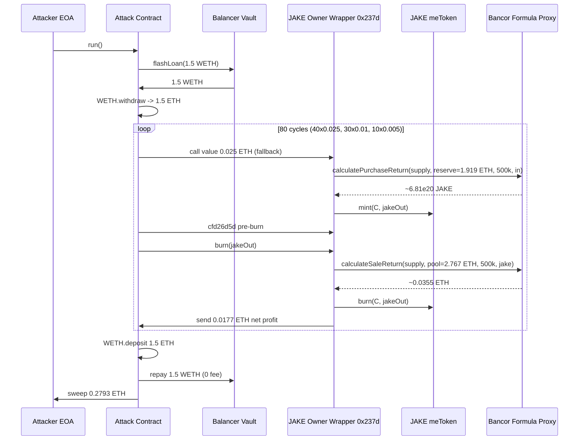
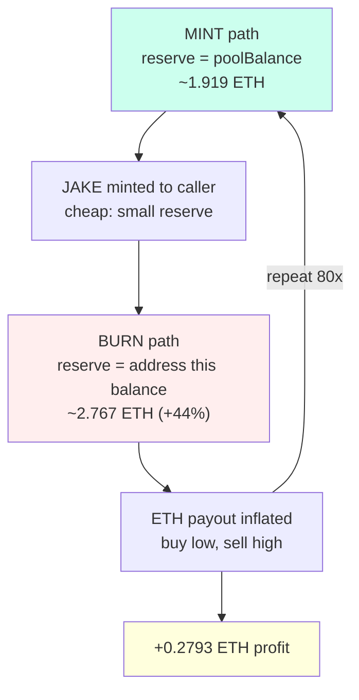

# StakeOnMe JAKE owner-wrapper reserve asymmetry — public owner-privileged mint vs. burn pays out against an inflated ETH reserve

> **Vulnerability classes:** vuln/logic/price-calculation · vuln/access-control/missing-auth · vuln/defi/fee-manipulation
> **Reproduction:** the PoC compiles & runs in an isolated Foundry project at [this project folder](.). Full verbose trace: [output.txt](output.txt). The vulnerable contract `0x237d…4b3f` is **unverified** on Etherscan; the exploit logic below is reconstructed from the `-vvvvv` trace and the JAKE meToken bonding-curve math.

---

## Key info

| | |
|---|---|
| **Loss** | 0.28 ETH (≈ 0.2793 ETH net to attacker; 1.919 ETH drained from the wrapper pool) |
| **Vulnerable contract** | StakeOnMe JAKE Owner Wrapper — [`0x237d59bF98Ec4f4F013bc35D66f22d2Bc9504b3f`](https://etherscan.io/address/0x237d59bF98Ec4f4F013bc35D66f22d2Bc9504b3f) (also the `owner()` of the JAKE meToken) |
| **Attacker EOA** | [`0xbDcdC1D072DFd2a1401e88959c31071FC585CE8E`](https://etherscan.io/address/0xbDcdC1D072DFd2a1401e88959c31071FC585CE8E) |
| **Attack contract** | [`0x8a9be1b19895798287a5a9b64db3d133e0297cda`](https://etherscan.io/address/0x8a9be1b19895798287a5a9b64db3d133e0297cda) |
| **Attack tx** | [`0xed71e72ba1be2cff06438fab558a79936414d24dd1f6d3e58ecadc2a8f673fe5`](https://etherscan.io/tx/0xed71e72ba1be2cff06438fab558a79936414d24dd1f6d3e58ecadc2a8f673fe5) |
| **Chain / block / date** | Ethereum mainnet / 24,664,322 / March 2026 |
| **Compiler** | Unverified contract — compiler/version unknown |
| **Bug class** | An unverified public wrapper that is the JAKE meToken `owner()` mints JAKE against a small bonding-curve reserve but burns (pays out ETH) against the wrapper's full and much larger ETH balance, letting anyone cycle the two to drain the wrapper. |

## TL;DR

The JAKE meToken (`0x277697FA…`, a Bancor-style bonding-curve token) is governed by an **unverified public contract** at `0x237d…4b3f` that the meToken reports as its `owner()` [output.txt:1591]. Because it is the owner, this wrapper can call the privileged `mint`/`burn` paths on the meToken on behalf of any caller. The wrapper exposes a payable `fallback` for minting and a public `burn(uint256)` for redeeming.

The fatal asymmetry is in which ETH reserve each side prices the curve against. The **mint** path computes JAKE output via `calculatePurchaseReturn(supply, reserve≈1.919 ETH, …)` — the JAKE token's own small reserve [output.txt:1628]. The **burn** path computes the ETH payout via `calculateSaleReturn(supply, poolBalance≈2.767 ETH, …)` — the wrapper's **full ETH balance**, which was ~44% larger because the wrapper had accumulated funding outside the JAKE curve's accounting [output.txt:1664].

Since burn pays out against a larger pool than mint debits, every mint→burn cycle returns more ETH than it cost. The attacker wrapped a Balancer WETH flash loan (1.5 ETH, zero-fee) into native ETH and ran 80 such cycles in three trace-supported groups (`40 × 0.025`, `30 × 0.01`, `10 × 0.005` ETH). Each 0.025 ETH cycle netted ~0.0177 ETH. Over 80 cycles the attacker netted **0.279304415608945825 ETH** of profit, drained the wrapper pool from **1.919478574233703186 ETH down to 0.000484739023893475 ETH** [output.txt:1565-1567], repaid the 1.5 WETH flash loan, and swept the profit to the EOA.

The protocol is "StakeOnMe" with a JAKE meToken — a Bancor-formula reversible token where minting should add to and burning should withdraw from the *same* ETH reserve at the *same* supply. The unverified owner wrapper broke that invariant by denominating mint and burn against two different balances, then made both operations callable by anyone.

## Background — what StakeOnMe / JAKE does

JAKE is a **Bancor-style bonding-curve token** (meToken). Its pricing is delegated to a `BancorFormula`-like library behind an `AdminUpgradeabilityProxy` at `0x8a2f6f66…BDE5`, exposed as `calculatePurchaseReturn` (buy JAKE with ETH) and `calculateSaleReturn` (sell JAKE for ETH). Both take `(tokenSupply, reserveBalance, reserveRatioPPM, amount)` and implement the constant-reserve-ratio curve:

- `calculatePurchaseReturn` → JAKE minted per ETH in
- `calculateSaleReturn` → ETH out per JAKE burned

In a correctly-designed reversible bonding-curve token, both calls use the *same* `reserveBalance` and `reserveRatioPPM`, so the same ETH that bought N JAKE is recovered (minus protocol fee) when those N JAKE are burned. The `reserveRatioPPM` here is `500000` (50%, PPM = parts-per-million) — a constant half-reserve curve.

The meToken has an **owner**: a privileged role that can mint and burn JAKE for arbitrary recipients without going through the standard user-facing entrypoints. The trace confirms `JAKE.meToken.owner() == 0x237d…4b3f` (the "StakeOnMe JAKE Owner Wrapper") [output.txt:1591].

That wrapper is the entire problem:

1. It is **unverified** on Etherscan — no audited source, no public spec for its mint/burn reserve accounting.
2. It is **publicly callable**: its payable `fallback` accepts ETH from anyone and performs an owner-privileged `mint` to `msg.sender`; its `burn(uint256)` performs an owner-privileged `burn` that pays ETH back to `msg.sender`.
3. It prices the two sides against **different** reserves.

## The vulnerable code

The contract at `0x237d…4b3f` is unverified; the following is **RECONSTRUCTED** from the on-chain `-vvvvv` trace in [output.txt](output.txt). Function selectors are inferred from the calldata.

### Mint path — payable `fallback` (any caller)

```solidity
// RECONSTRUCTED from trace output.txt:1622-1651
// Called as: address(wrapper).call{value: mintValue}("")
// i.e. the wrapper's receive()/fallback()

function _mintOnBehalf(address to, uint256 msgValue) internal {
    // 1. Take a 0.25% protocol fee off the top (5000 PPM = 0.25%)
    uint256 fee = msgValue * 5000 / 1_000_000;          // 0.025 ETH -> 0.0000625 ETH
    (bool okFee,) = MULTISIG.call{value: fee}("");       // output.txt:1623 (6.25e13 wei)
    uint256 intoCurve = msgValue - fee;                  // 0.0249375 ETH (2.49375e16)

    // 2. Price JAKE against the JAKE TOKEN's own reserve (SMALL pool, ~1.919 ETH)
    uint256 supply   = JAKE.totalSupply();               // 1.051e23  [output.txt:1626]
    uint256 reserve  = poolBalance();                    // 1.919e18  [output.txt:1628]
    uint256 jakeOut  = FORMULA.calculatePurchaseReturn(
        supply, reserve, 500_000, intoCurve              // output.txt:1628
    );                                                   // 6.807e20 JAKE [output.txt:1633]

    // 3. owner-privileged mint (the wrapper IS the owner)
    JAKE.mint(to, jakeOut);                              // output.txt:1634
}
```

### Burn path — `burn(uint256)` (any caller)

```solidity
// RECONSTRUCTED from trace output.txt:1658-1675
// Selector for burn is the standard; the wrapper exposes it publicly.

function burn(uint256 jakeAmount) external {
    address to = msg.sender;
    uint256 bal = JAKE.balanceOf(to);                    // output.txt:1659
    uint256 supply = JAKE.totalSupply();                 // 1.058e23  [output.txt:1662]

    // *** BUG: reserve = address(this).balance (the wrapper's FULL ETH balance) ***
    uint256 poolBalance = address(this).balance;         // 2.767e18  [output.txt:1664]

    uint256 ethOut = FORMULA.calculateSaleReturn(
        supply, poolBalance, 500_000, jakeAmount         // output.txt:1664
    );                                                   // 3.548e16 ETH

    // owner-privileged burn, then pay ETH from the wrapper's own balance
    JAKE.burn(to, jakeAmount);                           // output.txt:1670
    (bool okFee,) = MULTISIG.call{value: fee}("");       // output.txt:1675 (4.435e13)
    (bool ok,) = to.call{value: ethOut}("");             // output.txt:1676 (1.77e16 to attacker)
}
```

### The asymmetry

| Side | `reserveBalance` fed to the curve | Value (first cycle) |
|---|---|---|
| **Mint** (`calculatePurchaseReturn`) | `poolBalance()` — the JAKE token's tracked reserve | **1.919 ETH** [output.txt:1628] |
| **Burn** (`calculateSaleReturn`) | `address(this).balance` — the wrapper's full ETH balance | **2.767 ETH** [output.txt:1664] |

The burn reserve is **+0.847 ETH (+44%)** larger than the mint reserve because the wrapper contract held extra ETH (deposits, funding, prior meToken activity) that was never registered in the JAKE bonding curve's accounting. Burning pays out as if that extra ETH backs JAKE; minting prices JAKE as if it doesn't. Buying low (small reserve) and selling high (large reserve) is a guaranteed arbitrage the attacker can run at will.

A second enabler is the `cfd26d5d` pre-burn selector the attacker calls between mint and burn [output.txt:1651]. It emits the same owner-set-state event (`topic0 0x2f42…`) and writes to the same storage slot the mint touched (slot 1, the `poolBalance`-adjacent counter). This prepares/refreshes the burn accounting so each cycle sees the inflated full-balance reserve rather than a stale small one.

## Root cause — why it was possible

1. **Asymmetric reserve accounting between mint and burn.** Mint prices JAKE against `poolBalance()` (a tracked JAKE reserve of ~1.919 ETH); burn pays ETH out against `address(this).balance` (the wrapper's full balance of ~2.767 ETH). For a reversible bonding-curve token these MUST be the same variable, otherwise buy-low/sell-high is a guaranteed drain. The first cycle alone paid 0.0355 ETH for 0.025 ETH in [output.txt:1628 vs 1664].

2. **The owner role of the JAKE meToken is held by an unverified public contract.** `JAKE.owner() == 0x237d…4b3f` [output.txt:1591], and that wrapper has **no access control** on its payable `fallback` (mint) or `burn(uint256)`. Owner-privileged `mint`/`burn` on the meToken — which normally would be an admin-only escape hatch — is exposed to any caller. The owner key isn't even compromised; the owner itself is a public function with no auth.

3. **No invariant tying `address(this).balance` to the curve reserve.** A correct design would either (a) use a single accounting variable for both mint and burn, or (b) enforce `address(this).balance == trackedReserve + feesAccrued` before every payout. The wrapper instead let its live balance drift above the tracked reserve and then paid burns against the inflated balance.

4. **Flash-loan amplification with zero cost.** Balancer's `flashLoan` carries a 0% fee (`feeAmounts[0] == 0`, enforced in the PoC [test/unverified_237d_exp.sol]) [output.txt:1604], so the attacker could fund the entire 80-cycle run from 1.5 ETH of borrowed WETH, unwrap it once, and cycle the same ETH repeatedly — each cycle compounds because profit stays in the attacker contract and is reused as mint capital.

## Preconditions

- **Permissionless.** No privileged role is required. The mint path is the wrapper's payable `fallback` (any sender); the burn path is a public `burn(uint256)` (any sender). The attacker is an unrelated EOA.
- **Requires flash loan capital only** (~1.5 WETH from Balancer at 0% fee) to bootstrap the first mint; thereafter the cycle is self-funding from the ETH it recovers.
- **State precondition:** the wrapper's ETH balance must exceed the JAKE bonding-curve's tracked reserve (`address(this).balance > poolBalance()`). At block 24,664,322 this held by a wide margin: 2.767 ETH vs 1.919 ETH after the first mint.

## Attack walkthrough (with on-chain numbers from the trace)

All figures from [output.txt](output.txt). Attacker starts with 0 ETH [output.txt:1564].

| Step | Action | Effect |
|---|---|---|
| 1 | `BalancerVault.flashLoan(attack, [WETH], [1.5e18], "")` | Attack contract receives 1.5 WETH [output.txt:1601] |
| 2 | `WETH.withdraw(1.5e18)` | Unwrap to 1.5 native ETH on the attack contract [output.txt:1616] |
| 3 | **Group A: 40 × (mint 0.025 ETH → pre-burn → burn)** | Per cycle [output.txt:1622-1676]: mint sends 0.0000625 ETH fee to MultiSig, prices 0.0249375 ETH against the 1.919-ETH reserve → ~6.81e20 JAKE; burn prices that JAKE against the 2.767-ETH balance → ~0.0355 ETH out; attacker nets **+0.0177 ETH/cycle** |
| 4 | **Group B: 30 × (mint 0.01 ETH → burn)** | Same mechanic, smaller mint value, proportionally smaller curve slippage |
| 5 | **Group C: 10 × (mint 0.005 ETH → burn)** | Same mechanic |
| 6 | `WETH.deposit{value: 1.5e18}` + `transfer(Balancer, 1.5e18)` | Repay the zero-fee flash loan [output.txt: tail — `WETH::transfer(…, 1.5e18)`] |
| 7 | Sweep remaining native ETH to attacker EOA | `0.279304415608945825 ETH` delivered [output.txt:1565, tail] |

**Per-cycle accounting (Group A, first cycle):**
- Mint cost: `0.025 ETH` (of which `0.0000625` is fee, `0.0249375` enters the curve)
- JAKE minted: `6.80788e20`
- Burn payout: `0.035483 ETH` (curve) + attacker's share after burn-side `0.0000444 ETH` fee
- Net to attacker this cycle: `+0.017697 ETH` [output.txt:1676 — `receive{value: 17697355862930952}`]

**Final P/L:**
- Attacker ETH profit: **0.279304415608945825 ETH** [output.txt:1565]
- Wrapper pool balance: **1.919478574233703186 → 0.000484739023893475 ETH** (drained ~1.919 ETH) [output.txt:1566-1567]
- Flash-loan fee paid: **0** (Balancer 0% tier)
- Balancer fully repaid; attack contract left with 0 WETH, 0 JAKE, 0 ETH (all swept)

## Diagrams





## Remediation

1. **Unify the reserve.** Mint and burn MUST reference the same single accounting variable. If burns pay from `address(this).balance`, then mints must credit `address(this).balance` (and vice-versa). Never price the two sides of a reversible curve against two different pools.
2. **Add an invariant check on payout.** Before sending ETH in `burn`, assert `address(this).balance >= trackedReserve` and pay out only against `trackedReserve`. Reject or reconcile any balance drift (e.g. dust from direct transfers) rather than silently letting the payout pool inflate.
3. **Gate the owner-privileged paths.** The wrapper should not expose `mint`/`burn` (which are owner-only on the meToken) to arbitrary callers. Either remove the public payable `fallback`-mint and public `burn`, or restrict them with an access-control modifier (`onlyMinter` / `onlyOwner`) and require the user to be the actual JAKE holder burning their own balance through the standard meToken entrypoint.
4. **Verify and audit the wrapper contract.** An unverified contract holding the meToken `owner()` role is an unacceptable centralization/opacity risk. Publish the source and subject the reserve accounting to a formal invariant test (`mint→burn round-trips recover >= 99% of input minus declared fee`).
5. **Cap per-call / per-block drain.** As defense-in-depth, bound the ETH a single address can withdraw per block so that even a pricing asymmetry cannot be flash-loan-cascaded into a full drain.

## How to reproduce

The PoC runs fully **offline** via the shared anvil harness from the committed `anvil_state.json` — no RPC needed:

```bash
_shared/run_poc.sh 2026-03-unverified_237d_exp -vvvvv
```

- **Chain / fork:** Ethereum mainnet, fork block **24,664,322** (`vm.createSelectFork` at the local anvil RPC started from `anvil_state.json`).
- **Expected tail:** `[PASS] testExploit()` followed by:
  - `Attacker Before exploit ETH Balance: 0.000000000000000000` [output.txt:1564]
  - `Attacker ETH profit: 0.279304415608945825` [output.txt:1565]
  - `Wrapper pool balance before: 1.919478574233703186` [output.txt:1566]
  - `Wrapper pool balance after: 0.000484739023893475` [output.txt:1567]
  - `Attacker After exploit ETH Balance: 0.279304415608945825` [output.txt:1568]
- The local run **passed** (`1 passed; 0 failed`) in the recorded trace.

*Reference: https://x.com/DefimonAlerts/status/2034532549905580417*
