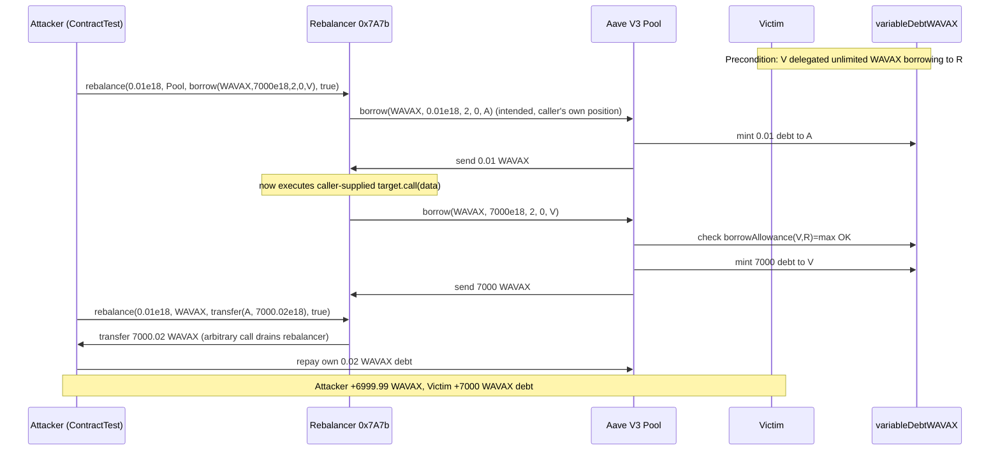
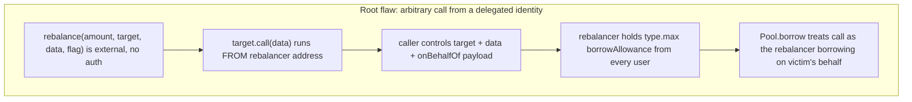

# sAVAX Rebalancer arbitrary-call drains victim credit delegation — permissionless `target`/`data` execution from a delegated Aave borrower
> **Vulnerability classes:** vuln/access-control/missing-auth · vuln/logic/missing-validation · vuln/dependency/unsafe-external-call
> **Reproduction:** the PoC compiles & runs in an isolated Foundry project at [this project folder](.). Full verbose trace: [output.txt](output.txt). The vulnerable rebalancer contract at `0x7A7b…a8C9` is **unverified** on snowscan; the analysis below reconstructs its externally-observable behavior from the `-vvvvv` trace. The Aave V3 Pool and VariableDebtToken contracts it manipulates are verified.
---
## Key info
| | |
|---|---|
| **Loss** | 6,999.99 WAVAX (~7,000 AVAX) [output.txt:1565] |
| **Vulnerable contract** | sAVAX Rebalancer — [`0x7A7bAB45363Efb0394Ff27bfA29bb7C0534cA8C9`](https://snowscan.xyz/address/0x7a7bab45363efb0394ff27bfa29bb7c0534ca8c9#code) |
| **Attacker EOA** | [`0xf59dc5521f191bcb53a9bcbd1654be81b72ee96f`](https://snowscan.xyz/address/0xf59dc5521f191bcb53a9bcbd1654be81b72ee96f) |
| **Attack contract** | [`0xe44EEa4C6C2085D590A4a6BeA01CF83E87A37bE5`](https://snowscan.xyz/address/0xe44eea4c6c2085d590a4a6bea01cf83e87a37be5) |
| **Attack tx** | [`0xaaa1b2e561738399af890dde2b18252b698e9b0ae7c8430fdd855f426835001b`](https://snowscan.xyz/tx/0xaaa1b2e561738399af890dde2b18252b698e9b0ae7c8430fdd855f426835001b) |
| **Chain / block / date** | Avalanche / 83,324,252 / 2026-04 |
| **Compiler** | Unverified (rebalancer bytecode not published to snowscan) |
| **Bug class** | The rebalancer forwards caller-supplied `(target, data)` as an arbitrary external call from its own address, while holding unlimited Aave V3 borrow delegation from a victim; an attacker points that call at `Pool.borrow(WAVAX, …, victim)` to mint debt against the victim and pull the proceeds out. |

## TL;DR

The "sAVAX Rebalancer" (`0x7A7b…a8C9`) is a contract that helps users grow their leveraged Aave V3 sAVAX position. To do so it borrows WAVAX from Aave **on behalf of** the user, swaps it to sAVAX, and re-supplies the sAVAX as collateral. Users authorize this by calling `approveDelegation(rebalancer, type(uint256).max)` on the WAVAX VariableDebtToken — i.e. they grant the rebalancer *unlimited* WAVAX borrowing power against their Aave account. This is the protocol's intended design and it is fine *if* the rebalancer only ever borrows on behalf of the caller.

The flaw is that the rebalancer exposes an entry point (selector `0xb2a13230`, decoded as `rebalance(uint256 amount, address target, bytes data, bool flag)`) that, after performing its own small borrow, executes `target.call(data)` verbatim from the rebalancer's own address — with **no access control** on `target`/`data` and **no constraint** that the call reference the caller's own Aave account. Because Aave's `Pool.borrow(asset, amount, mode, 0, onBehalfOf)` honors the *caller's* (here: the rebalancer's) delegation from *any* delegator, an attacker simply passes `target = Aave Pool` and `data = borrow(WAVAX, 7000e18, 2, 0, victim)`. Aave accepts it — the victim had delegated the rebalancer — mints 7,000 WAVAX of variable debt to the victim, and sends the WAVAX to the rebalancer's address.

A second call to the same arbitrary-call surface then transfers the freshly-acquired WAVAX (`WAVAX.transfer(attacker, 7,000.02)`) out of the rebalancer. The attacker repays only their own 0.01 WAVAX setup debt and walks away with **6,999.99 WAVAX** [output.txt:1565], leaving the victim with **7,000.000000000000000001 WAVAX** of new debt they never authorized for this attacker [output.txt:1564]. No flash loan is needed; the only on-chain precondition is that *some* victim had previously delegated borrow power to the rebalancer and not yet revoked it.

## Background — what the sAVAX Rebalancer does

Aave V3 supports **credit delegation**: a supplier (delegator) can let another address (delegatee) borrow against the supplier's collateral by calling `VariableDebtToken.approveDelegation(delegatee, amount)`. The delegatee then calls `Pool.borrow(asset, amount, mode, 0, delegator)`; Aave checks `borrowAllowance(delegator, delegatee)`, mints variable debt to the *delegator*, and sends the borrowed asset to the *caller* (the delegatee). Delegation is a powerful primitive: it hands the delegatee the ability to enlarge someone else's debt.

The sAVAX Rebalancer is a bot/operator contract built on top of this. A user who wants a self-repaying leveraged sAVAX position:

1. Supplies collateral to Aave (e.g. USDC, WAVAX, sAVAX).
2. Delegates WAVAX borrowing power to the rebalancer: `variableDebtWAVAX.approveDelegation(rebalancer, type(uint256).max)`.
3. Calls the rebalancer, which repeatedly: borrows WAVAX on the user's behalf, swaps WAVAX→sAVAX, and re-supplies the sAVAX as extra collateral ("rebalancing" the loop toward a target LTV).

The trace confirms this design. On entry, the rebalancer (selector `0xb2a13230`) for the attacker's own test position:

- calls `Pool.borrow(WAVAX, 0.01e18, 2, 0, ContractTest)` — borrowing on behalf of the *caller* (`ContractTest`) [output.txt:1842], which is the legitimate rebalancing borrow using the caller's own delegation;
- then executes the caller-supplied `target/data` payload [output.txt:1764].

That second step is the whole vulnerability: the payload is whatever the caller passed in, executed `from` the rebalancer's address. The rebalancer performs no validation that the payload address the caller's account, that the target is an expected swap venue, or that the call does not touch a third party's Aave position.

## The vulnerable code

> The rebalancer at `0x7A7b…a8C9` is **unverified** on snowscan. The function below is **RECONSTRUCTED** from the entry-call calldata and the `-vvvvv` call tree in [output.txt](output.txt). The selector `0xb2a13230` decodes as `rebalance(uint256 amount, address target, bytes data, bool flag)` — exactly the four words observed in the entry call at [output.txt:1764].

### The arbitrary-call entry point (RECONSTRUCTED)

```solidity
// 0x7A7bAB45363Efb0394Ff27bfA29bb7C0534cA8C9 — UNVERIFIED, reconstructed from trace
// Selector 0xb2a13230 = rebalance(uint256 amount, address target, bytes data, bool flag)
function rebalance(uint256 amount, address target, bytes calldata data, bool flag) external {
    // 1. (intended) borrow `amount` WAVAX from Aave on behalf of msg.sender,
    //    using the rebalancer's delegation from msg.sender.
    //    Observed in trace: Pool.borrow(WAVAX, amount, 2, 0, msg.sender)
    IPool(AAVE_POOL).borrow(WAVAX, amount, 2, 0, msg.sender);

    // 2. (VULNERABLE) execute whatever the caller handed us, from OUR address.
    //    No access control on `target`. No check that `data` touches only
    //    msg.sender's Aave account. This runs with the rebalancer's identity,
    //    i.e. with the rebalancer's borrow delegation from EVERY delegator.
    (bool ok, ) = target.call(data);
    require(ok, "call failed");

    // 3. (intended) continue the leverage loop: swap WAVAX->sAVAX, supply sAVAX, ...
    //    (seen in trace as sAVAX transfers + Supply events)
    emit RebalanceIncreased(msg.sender, amount, /* sAVAX deposited */);
}
```

Three things are observable in the trace that pin this reconstruction down:

1. **The entry call's decoded arguments** at [output.txt:1764] are exactly `(amount=0.01e18, target=AAVE_POOL, data=abi.encode(borrow.selector, WAVAX, 7000e18, 2, 0, VICTIM), flag=true)`. The contract accepted `target=AAVE_POOL` and arbitrary `data`.
2. **The internal call order**: the rebalancer first calls `Pool.borrow(WAVAX, 0.01e18, 2, 0, ContractTest)` (its own intended borrow, on behalf of the caller) [output.txt:1842], then immediately calls `Pool.borrow(WAVAX, 7000e18, 2, 0, Victim)` — the caller-supplied payload [output.txt:1961]. The second borrow is the attacker's `data` executed verbatim.
3. **The exit side**: after the borrow, the rebalancer performs the intended `sAVAX` deposit (`Supply(sAVAX, …, onBehalfOf: ContractTest, 0.001e18)` at [output.txt:2026]) and emits `RebalanceIncreased` [output.txt:2034]. The attacker funded this trivial sAVAX deposit themselves (step 2 in the PoC) so the rebalancer's post-borrow logic completes without reverting.

### Why Aave accepts it

Aave V3's `Pool.borrow` checks `borrowAllowance(onBehalfOf, msg.sender)` — the delegation from the *borrower-of-record* to the *caller*. Here `msg.sender` is the rebalancer and `onBehalfOf` is the victim. The victim had delegated the rebalancer, so the check passes:

```solidity
// Aave V3 Pool.borrow (verified) — the delegation check
function borrow(address asset, uint256 amount, uint256 interestRateMode, uint16 referralCode, address onBehalfOf) external {
    // ... require borrowAllowance(onBehalfOf, msg.sender) >= amount  (via BorrowLogic / debt token)
}
```

The PoC asserts this directly at the top of the test:

```solidity
uint256 delegatedBorrowAllowance =
    variableDebtWavax.borrowAllowance(VICTIM, VULNERABLE_REBALANCER);
assertEq(delegatedBorrowAllowance, type(uint256).max); // victim delegated unlimited WAVAX borrowing
```

So the rebalancer was, at fork block 83,324,252, holding `type(uint256).max` WAVAX borrow allowance from the victim. Anyone could direct it to spend that allowance.

## Root cause — why it was possible

1. **Unauthenticated arbitrary external call.** The rebalancer executes caller-supplied `(target, data)` from its own address with no `onlyOwner` / allowlist / target whitelist. Selector `0xb2a13230` is `external` and callable by anyone. This is the proximate cause.
2. **Caller-controlled `target`/`data` is never tied to the caller's account.** Even granting that the contract *wanted* to perform some external call as part of rebalancing (e.g. a swap), it never constrains that call to the caller's own position. The `onBehalfOf` field inside the attacker's `Pool.borrow` payload points at an arbitrary third party (`VICTIM`), and the rebalancer does not inspect it.
3. **The rebalancer is a universal delegatee with `type(uint256).max` allowances.** Because every user of the protocol grants the rebalancer *unlimited* standing WAVAX borrow delegation, the rebalancer's address is a high-value privileged identity. Any code path that lets a caller drive a call *from* that identity — even an otherwise-legitimate swap step — turns the rebalancer into a stolen-signature equivalent for Aave borrowing. The contract fails to treat its own address as a security-critical principal.
4. **No separation between "the rebalancer's intended borrow" and "the caller's payload."** Both run in the same call frame under the rebalancer's identity, so the caller's payload inherits all of the rebalancer's delegations.

## Preconditions

- **Permissionless attacker.** No privileged role, no flash loan, no governance. The attacker only needs gas and a tiny amount of sAVAX (0.002 sAVAX, ~$0.04) to grease the rebalancer's intended deposit path.
- **At least one victim has delegated WAVAX borrowing power to the rebalancer** (`approveDelegation(rebalancer, …)` with a nonzero allowance). This is the normal onboarding state for any user of the rebalancer — the trace shows the victim had delegated `type(uint256).max` [output.txt:1602-1604] and had not revoked it.
- **The victim must still be a healthy Aave account** (enough collateral to absorb the extra 7,000 WAVAX borrow without immediate liquidation). The attacker is otherwise indifferent to the victim's subsequent liquidation; they only need the borrow to succeed at execution time.
- The rebalancer's entry point (`0xb2a13230`) must be callable with arbitrary `target`/`data` — confirmed by the trace.

## Attack walkthrough (with on-chain numbers from the trace)

The PoC (`ContractTest`) forks Avalanche at block 83,324,252 and reproduces the full sequence. No assets are flash-loaned.

| Step | Action | Trace evidence |
|------|--------|----------------|
| 0 | Assert the victim delegated unlimited WAVAX borrowing to the rebalancer. | `borrowAllowance(VICTIM, REBALANCER) == type(uint256).max` [output.txt:1602-1604] |
| 1 | PoC creates its own micro Aave position so the rebalancer's *intended* borrow-on-behalf-of-caller path works: supplies 1 USDC and delegates WAVAX borrowing to the rebalancer. | `Supply(USDC, 1e6, ContractTest)`; `BorrowAllowanceDelegated(ContractTest, REBALANCER, WAVAX, max)` [output.txt:1740,1752] |
| 2 | Send 0.001 sAVAX to the rebalancer to satisfy its intended post-borrow sAVAX deposit. | `sAVAX.transfer(REBALANCER, 1e15)` [output.txt:1758] |
| 3 | **Call the rebalancer** with `rebalance(0.01e18, AAVE_POOL, borrow(WAVAX, 7000e18, 2, 0, VICTIM), true)`. Inside, the rebalancer (a) borrows 0.01 WAVAX on behalf of the PoC — its intended path — then (b) executes the payload: borrows **7,000 WAVAX on behalf of the victim**. The 7,000 WAVAX lands at the rebalancer's address; 7,000.000000000000000001 WAVAX of variable debt is minted to the victim. | First `Borrow(…, onBehalfOf: ContractTest, 0.01e18)` [output.txt:1842]; then `Borrow(…, onBehalfOf: Victim, 7000e18)` [output.txt:1961]; WAVAX sent to rebalancer [output.txt:1894] |
| 4 | Send another 0.001 sAVAX to the rebalancer and **call it again** with `rebalance(0.01e18, WAVAX, WAVAX.transfer(ContractTest, 7000.02e18), true)`. The rebalancer's arbitrary-call surface now transfers the stolen WAVAX out to the PoC. | `Transfer(REBALANCER → ContractTest, 7000.02e18)` [output.txt:2145] |
| 5 | Repay the PoC's own 0.01 + 0.01 WAVAX setup debt so only the victim-funded debt remains as impact. | `Pool.repay(WAVAX, localSetupDebt, 2, ContractTest)` |
| 6 | Forward the proceeds to the attacker EOA. | `Transfer(ContractTest → ATTACKER, 6999.999999999999999998e18)` [output.txt:1565 trace / final transfer] |

**Accounting:**

| Item | Amount |
|------|--------|
| WAVAX minted as debt to **victim** (impact) | 7,000.000000000000000001 [output.txt:1564] |
| WAVAX recovered by **attacker** (profit) | 6,999.999999999999999998 [output.txt:1565] |
| Attacker cost (sAVAX grease + gas) | ~0.002 sAVAX + gas |
| Net | attacker +6,999.99 WAVAX; victim +7,000 WAVAX debt they never authorized for this actor |

The ~0.02 WAVAX difference is the rebalancer's two intended 0.01 WAVAX setup borrows on the PoC's behalf, which the PoC repays in step 5 (and which therefore don't show in the attacker's net profit).

## Diagrams





## Remediation

1. **Remove the arbitrary-call surface entirely.** A leverage/rebalancing bot should never execute caller-supplied `target`/`data`. Replace it with a fixed set of internal operations (borrow → swap via a whitelisted router → supply) encoded as parameters (amounts, slippage bounds), not as raw calldata.
2. **If some external call is unavoidable, restrict it to an allowlist** of known swap routers, and **forbid `onBehalfOf != msg.sender`** in any payload that reaches Aave. Concretely: the rebalancer must only ever borrow on behalf of `msg.sender`, never an arbitrary address.
3. **Scope delegation.** Prefer per-call, exact-amount delegation (`approveDelegation(rebalancer, amount)` then revoke) over `type(uint256).max` standing allowances. Better: use Aave's flash-loan-style single-call delegation patterns or have the rebalancer act as a pure msg.sender-passed intermediary that never holds standing allowances from users who aren't actively rebalancing.
4. **Add a re-entrancy/role guard** so the rebalancer's privileged identity can only be exercised by its own intended code paths, not by a `call` whose destination is attacker-chosen.
5. **Revoke and re-deploy.** Because the contract is unverified and the flaw is structural, users should immediately call `revokeDelegate(rebalancer)` / `approveDelegation(rebalancer, 0)` on `variableDebtWAVAX`, and the operator should redeploy a fixed rebalancer and migrate.

## How to reproduce

The PoC runs **fully offline** via the shared anvil harness from the committed `anvil_state.json` — no RPC needed.

```bash
_shared/run_poc.sh 2026-04-AaveRebalancerCreditDelegation_exp -vvvvv
```

- **Chain / fork block:** Avalanche, block 83,324,252 (state pinned in `anvil_state.json`).
- **Expected tail:** `[PASS] testExploit()` followed by:
  - `Victim variable WAVAX debt increase: 7000.000000000000000001`
  - `Final WAVAX profit: 6999.999999999999999998`

The local run is confirmed green in [output.txt:1562] (`1 passed; 0 failed`). The two `assertGt` guards at the end of `testExploit()` verify both that the victim's debt grew by more than 7,000 WAVAX and that the attacker's profit exceeded 6,999 WAVAX.

*Reference: https://x.com/DefimonAlerts/status/2046504796463808991*
