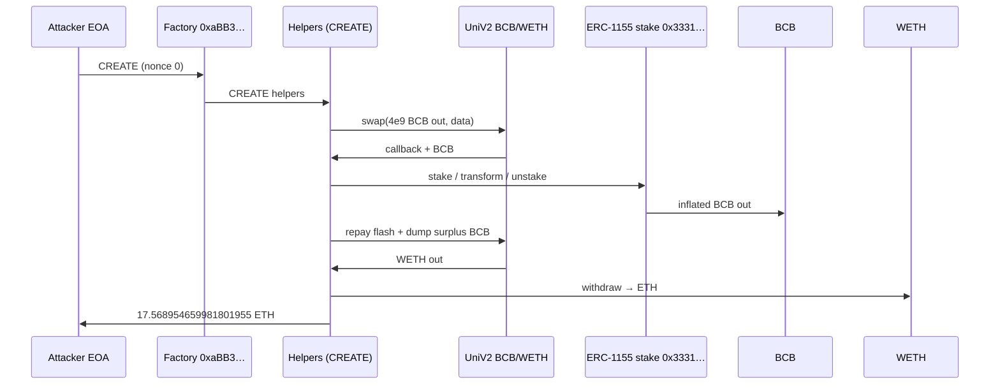

# Blockchain Bets ERC-1155 stake/transform inflates redeemable BCB → UniV2 dump

> **Vulnerability classes:** vuln/logic/incorrect-calculation · vuln/logic/missing-check · vuln/logic/reward-calculation

> **Reproduction:** the PoC compiles & runs in an isolated Foundry project at
> [this project folder](.). The fork is served offline from the bundled
> `anvil_state.json` (local anvil replays Ethereum state at block `24979555`), so no
> public RPC is required.
> Full verbose trace: [output.txt](output.txt).
> BCB token (verified): [BlockchainBets.sol](sources/BlockchainBets_2d8865/BlockchainBets.sol).
> ERC-1155 stake module is **unverified** on Etherscan (`0x3331F635…4f52`).

<!-- non-defihacklabs -->

---

## Key info

| | |
|---|---|
| **Loss** | **17.568954659981801955 ETH** (exact wei: `17568954659981801955`) |
| **Vulnerable contract** | BCB ERC-1155 stake / transform module — [`0x3331F6359Ff4B118Ee8a68Ed2A1edFF0238A4f52`](https://etherscan.io/address/0x3331F6359Ff4B118Ee8a68Ed2A1edFF0238A4f52) (**unverified**) |
| **BCB token** | [`0x2d886570A0dA04885bfD6eb48eD8b8ff01A0eb7e`](https://etherscan.io/address/0x2d886570A0dA04885bfD6eb48eD8b8ff01A0eb7e#code) (9 decimals) |
| **Victim pair** | [`0x3beEab9d5624e487045e01d12332975204a04a8A`](https://etherscan.io/address/0x3beEab9d5624e487045e01d12332975204a04a8A) (Uniswap V2 BCB/WETH) |
| **Attacker EOA** | [`0x1Cc99aaC09AB1Fe81cb71aA9BE8A84606c24544E`](https://etherscan.io/address/0x1Cc99aaC09AB1Fe81cb71aA9BE8A84606c24544E) |
| **Attack factory** | [`0xaBB388d3cf7166f01E9A91543e2FC29f626ff8f4`](https://etherscan.io/address/0xaBB388d3cf7166f01E9A91543e2FC29f626ff8f4) (CREATE, nonce 0) |
| **Helper / controller** | [`0x712e7Ba278A8D1baE3b6889895fc0483d2340D1A`](https://etherscan.io/address/0x712e7Ba278A8D1baE3b6889895fc0483d2340D1A), [`0x27e75E05Fe441717820e2cA136F5E3C637De2Fa4`](https://etherscan.io/address/0x27e75E05Fe441717820e2cA136F5E3C637De2Fa4) (CREATE in attack tx) |
| **Attack tx** | [`0x879b365b169dbf79c7f6fc7c2f7fd57eb1e53f0be8cf97ed817a7ff3d2e0ba69`](https://etherscan.io/tx/0x879b365b169dbf79c7f6fc7c2f7fd57eb1e53f0be8cf97ed817a7ff3d2e0ba69) |
| **Chain / block / date** | Ethereum mainnet / fork `24979555` (attack in `24979556`) / ~2026-04-28 |
| **Bug class** | ERC-1155 stake → transform → unstake path mints more redeemable BCB than deposited |
| **Alert** | [ExVul](https://x.com/exvulsec/status/2049158980946280878) |

---

## TL;DR

1. Attacker CREATE-deploys a nested factory at nonce 0 that flash-swaps **4_000_000_000 raw BCB** (9 decimals) from the UniV2 BCB/WETH pair.
2. Flash funds are split across helper contracts that call the **unverified ERC-1155 staking module**.
3. Each helper **stakes → transforms → unstakes**. The transform/unstake accounting **inflates redeemable BCB** far above the BCB locked in.
4. Inflated BCB is dumped back into the pair; the flash is repaid; leftover WETH is unwrapped to **17.568954659981801955 ETH** and forwarded to the attacker EOA.

---

## Background

**Blockchain Bets (BCB)** is an ERC-20 (9 decimals) with a Uniswap V2 BCB/WETH pool and an associated **ERC-1155 “stake / transform” module** at `0x3331…4f52`. The module is **not verified** on Etherscan. On-chain behavior and the attack trace show it:

- Accepts BCB deposits and mints ERC-1155 position ids (`stake`, selector `0x48c35d46`)
- Converts positions across ids (`transform`, selector `0x9a3c6467`)
- Redeems positions back to BCB (`unstake` / withdraw, selector `0xa2bc66be`)
- Tracks per-id supply via ERC-1155Supply-style `totalSupply(uint256)` (`0xbd85b039`)

The economic bug is that the **redeem path pays out more BCB than was economically deposited** for the transformed positions — classic share / accounting inflation on a staking wrapper.

---

## Root cause

### Inflated redeemable balance on stake / transform / unstake

The vulnerable surface is the **unverified** ERC-1155 module. From the historical attack bytecode and event log:

| Step | Observation |
|---|---|
| Stake | Helper deposits **1e9 raw BCB** and mints ERC-1155 id `0` for the same amount |
| Transform | Position is converted (id transitions; large secondary mint on another id) |
| Unstake | Module transfers **~1.8738e15 raw BCB** back to the helper (~**1.87e6×** the 1e9 deposited on that leg) |

So the redeemable BCB claim after transform is not conserved against the BCB escrowed by the module. The surplus is real transferable BCB (token balance increases), which the attacker sells into the UniV2 pool.

Because the module is unverified, the precise Solidity formula is not published; the PoC **reproduces the historical CREATE initcode** end-to-end so the bug is demonstrated against live pre-attack state without reverse-engineering a full source map.

```text
// Conceptual (RECONSTRUCTED surface — not verified source)
// stake(id0, amount)     → mint ERC1155 id0, pull `amount` BCB
// transform(id0 → id1)   → burn id0, mint id1 with *inflated* units
// unstake(id1, units)    → burn id1, push *inflated* BCB to caller
```

### Why a flash swap is enough

The pool holds deep enough BCB inventory for a **4e9 raw** flash (`swap(amount0Out=4e9, …, data)`). The inflate step turns that inventory into a much larger BCB balance **without** a matching BCB lock in the module, so after repaying the flash the attacker still holds a large BCB residual to sell for WETH.

---

## Preconditions

1. UniV2 pair `0x3beE…4a8A` has BCB (token0) and WETH (token1) reserves (pre-attack ~55.28 WETH).
2. ERC-1155 module at `0x3331…4f52` is live and accepts stake/transform/unstake for the chosen ids.
3. Attacker can deploy CREATE initcode that initiates a pair flash swap with a callback into attacker-controlled helpers.

No privileged roles, oracles, or governance actions are required.

---

## Attack walkthrough

Exact offline PoC numbers from [output.txt](output.txt):

1. **CREATE factory** at historical address `0xaBB388…f8f4` (attacker nonce 0). Nested helpers are CREATE’d inside the constructor path.
2. **Flash swap** `4_000_000_000` raw BCB from the pair into the helper tree (`UniswapV2Pair.swap` → callback).
3. **Split + stake/transform/unstake** across helpers (`0x3ea5…`, `0x9a59…`, `0x27e75…` pattern in the historical tx). ERC-1155 TransferSingle events show stake of `1e9` and unstake of inflated amounts (e.g. `0x06a840bdceb478` raw BCB on one leg).
4. **Repay flash** by returning BCB to the pair; **dump surplus BCB** for WETH (pair WETH: `55.2837` → `37.5449`).
5. **Unwrap WETH → ETH** (`WETH.withdraw`) and forward **17.568954659981801955 ETH** to the attacker EOA.



---

## Remediation

1. **Conserve value** across stake/transform/unstake: redeemable BCB must not exceed escrowed BCB (or a correctly accrued reward schedule with explicit funding).
2. **Invariant tests**: property tests that random stake/transform/unstake sequences never increase an account’s claimable BCB above deposits + funded rewards.
3. **Verify and publish** the ERC-1155 module source; pause stake/transform until the accounting is fixed.
4. Prefer battle-tested vault patterns (ERC-4626-style share math with explicit `totalAssets` checks) over ad-hoc multi-id transform multipliers.

---

## How to reproduce

```bash
cd /path/to/evm-hack-registry
_shared/run_poc.sh 2026-04-BlockchainBets_exp -vvvvv
# → [PASS] testExploit — Attacker ETH profit: 17.568954659981801955
```

PoC strategy: replay historical CREATE initcode at fork block `24979555` (see [test/BlockchainBets_exp.sol](test/BlockchainBets_exp.sol)).

---

*Reference: [ExVul alert](https://x.com/exvulsec/status/2049158980946280878) · attack tx [`0x879b365b…`](https://etherscan.io/tx/0x879b365b169dbf79c7f6fc7c2f7fd57eb1e53f0be8cf97ed817a7ff3d2e0ba69)*
