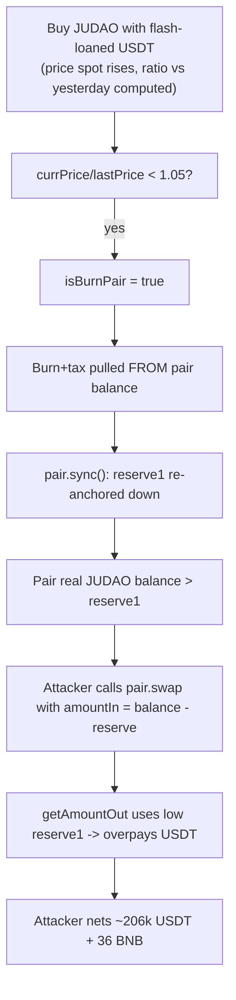

# JUDAO sell-hook reserve drain — token transfer hook burns liquidity directly from its own DEX pair, desyncing the AMM reserves the attacker then arbitrages

> **Vulnerability classes:** vuln/defi/fee-manipulation · vuln/logic/incorrect-order-of-operations · vuln/oracle/price-manipulation
> **Reproduction:** the PoC compiles & runs in an isolated Foundry project at [this project folder](.). Full verbose trace: [output.txt](output.txt). Vulnerable token contract source is verified on BscScan and fetched into [sources/JUDAOToken_f55dff/contracts_JUDAO.sol](sources/JUDAOToken_f55dff/contracts_JUDAO.sol).

---

## Key info

| | |
|---|---|
| **Loss** | 205,259.49 USDT + 36 BNB (≈ $62k at the time) |
| **Vulnerable contract** | `JUDAOToken` — [`0xf55DFF7898930a2D28cDbC39D615b1624ac86888`](https://bscscan.com/address/0xf55dff7898930a2d28cdbc39d615b1624ac86888) |
| **Attacker EOA** | [`0x5384B34C74024d6563B323351a4bBFA18432161B`](https://bscscan.com/address/0x5384b34c74024d6563b323351a4bbfa18432161b) |
| **Attack contract** | [`0x530904b5b5ec86cca0528a682614f57f87e7f079`](https://bscscan.com/address/0x530904b5b5ec86cca0528a682614f57f87e7f079) |
| **Attack tx** | [`0x956e38b8ddb40ba080c8042c685ae52ee5c1b096f1d7f0c4a6c59be3eb4265bd`](https://bscscan.com/tx/0x956e38b8ddb40ba080c8042c685ae52ee5c1b096f1d7f0c4a6c59be3eb4265bd) |
| **Chain / block / date** | BNB Smart Chain / 95,070,973 / 2026-04 |
| **Compiler** | Solidity `^0.8.x`, OZ 5.5.0 ERC20 (verified) |
| **Bug class** | The token's sell transfer-hook unconditionally burns and re-mints JUDAO out of its own Pancake pair and re-syncs pair reserves without the outer transfer ever crediting the pair's accounting, desyncing `pair.getReserves()` from `pair.balanceOf(JUDAO)` so the attacker can pull excess USDT with a direct low-level `pair.swap`. |

## TL;DR

`JUDAOToken` overrides `_update` (ERC-20 transfer) to install a buy-mining / sell-deflation economy on top of its PancakeSwap `JUDAO/USDT` pair. The sell branch, entered when the destination of a transfer is `basePair`, computes a flag `isBurnPair` from the pair's *current* reserves-vs-yesterday ratio and, when true, calls `super._update(basePair, 0xDead, amount - fundAmount)` and `super._update(basePair, address(this), fundAmount)` followed by `ISwapPair(basePair).sync()`. That burn pulls JUDAO **directly out of the pair's real balance** (the OZ `_update` literally moves tokens from `from = basePair`), then `sync()` resets the pair's internal `reserve1` *downward* to match the new (smaller) balance. Crucially, the *outer* `transfer(sender → basePair, amount)` that triggered the hook has already deposited the seller's `amount` of JUDAO into the pair before the hook fires — so after the burn+sync the pair holds `originalReserve + amount - burned`, but `reserve1` was just re-synced to `originalReserve + amount - burned`... *minus* the seller's own `amount`, which the hook never reconciles.

The net effect is that the pair's true JUDAO balance ends up higher than the reserve the AMM price curve uses. An attacker who buys JUDAO, transfers it to the pair to trigger the burn, then immediately calls `pair.swap()` with `amountIn = judao.balanceOf(pair) - reserveJudao` extracts USDT at a sub-market price. Flash-loan funded, single-block, permissionless: ~206,239.7 USDT + 36 BNB netted in [output.txt:1900].

The attack ran [PASS] on a local BSC fork: attacker USDT balance `0 → 206,239.700162684919875694` [output.txt:1564-1567], BNB `0 → 36`.

## Background — what JUDAO does

`JUDAOToken` is a deflationary BEP-20 whose entire tokenomics lives inside a single `_update` override ([contracts_JUDAO.sol:301](sources/JUDAOToken_f55dff/contracts_JUDAO.sol)). Its declared "base pair" (`basePair`, immutable, set to the Pancake `JUDAO/USDT` pair at deploy) is treated as a privileged counterparty:

- **Buy path** (`from == basePair`, non-remove-liquidity, lines 339-360): on every buy, the hook records the buy's USDT value into `userInfo[to].tOwnedU` (a "cost basis" credit), takes a 3% fee, and forwards the rest to the buyer. It also calls `sync(false)` to snapshot the day's reserves for the price-ratio logic.
- **Sell path** (`to == basePair`, lines 365-419): the hook calls `sync(true)` (which may trigger a daily "mining" payout that pulls JUDAO out of the pair into `address(this)` and `0xDead`), then `getSellFee()`. `getSellFee()` returns `sellFee`, an `isBurnPair` boolean, and the current JUDAO reserve. When `isBurnPair` is true — set whenever the current JUDAO price has risen <5% versus the previous day's snapshot ([contracts_JUDAO.sol:454-460](sources/JUDAOToken_f55dff/contracts_JUDAO.sol)) — the hook burns half the sold amount to `0xDead` and sends the other half to the token contract, **moving those tokens directly out of the pair** (lines 374-377), then `sync()`s the pair and credits profit-sharing.
- **Mining** (`sync(true)` with `isMining`, lines 567-604): once a day, the token extracts a percentage of the pair's JUDAO reserve as "mining" reward, splitting it between stakers (`address(this)`) and `0xDead`.

The intended design is that buys and sells "tax" the pair to fund staking rewards and burns. The flaw is that the token unilaterally rewrites the pair's balances and reserves mid-transfer without coordinating with the AMM's own invariant, and it does so on data the attacker fully controls.

## The vulnerable code

### Sell hook burns from the pair and re-syncs reserves

From [contracts_JUDAO.sol:365-379](sources/JUDAOToken_f55dff/contracts_JUDAO.sol):

```solidity
if(to==basePair){
    sync(true);
    require(startTime>0&&block.timestamp>startTime, "launched");
    (uint256 sellFee,bool isBurnPair,uint256 tokenAmount)=getSellFee();
    if(amount*10/tokenAmount > 1){
         revert("amount K");
    }
    if(isBurnPair){
        uint256 fundAmount = amount/2;
        super._update(basePair,address(0xDead),amount-fundAmount);   // burns FROM the pair
        super._update(basePair,address(this),fundAmount);            // taxes FROM the pair
        ISwapPair(basePair).sync();                                  // forces reserve1 down
        accERC20PerPower+=fundAmount*1e36/totalPower;
    }
    // ... seller's `amount` was ALREADY credited to the pair by the outer _update
```

`super._update(basePair, ...)` is the OZ ERC-20 internal transfer with `from = basePair` — it subtracts from the pair's *actual* JUDAO balance and `transfer`-emits. Then `ISwapPair(basePair).sync()` re-baselines the pair's stored `reserve1` to `IERC20(JUDAO).balanceOf(pair)`. The attacker-supplied `amount` that the outer `transfer(sender → basePair)` deposited into the pair is therefore *included* in the post-burn balance that `sync()` snapshots, but the burn itself only consumed `amount` tokens (not `amount + the seller's deposit`). This leaves a permanent gap between "JUDAO the pair logically owes" and "JUDAO the pair holds."

### `isBurnPair` is attacker-influenceable via spot reserves

```solidity
function getSellFee() public view returns(uint256 sellFee,bool isBurnPair,uint256 tokenAmount){
    (uint usdtAmount,uint thisAmount,)=ISwapPair(basePair).getReserves();
    ...
    uint256 lastPrice=_lastDayReserves.usdtAmount*1e18/_lastDayReserves.thisAmount;
    uint256 currPrice=usdtAmount*1e18/thisAmount;
    uint256 riseRatio = currPrice*100/lastPrice;
    if(riseRatio < 105){
        isBurnPair=true;
    }
}
```

`isBurnPair` becomes true whenever the spot price has not risen 5% since the last daily snapshot. A large buy *immediately* before the sell raises `thisAmount` and lowers the spot `currPrice`, guaranteeing `riseRatio < 105` and thus `isBurnPair = true`. The attacker makes the condition fire on demand.

### The outer transfer credits the pair before the hook drains it

The OZ `_update` that `JUDAO._update` overrides runs `super._update(from, to, amount)` semantics only *after* the hook. Because the public `transfer` calls `_update(sender, basePair, amount)`, the pair's JUDAO balance first receives `amount`, then the hook removes `amount` (burn+tax), then `sync()` records `reserve1 = balanceAfterBurn`. The seller's deposit and the burn cancel inside the balance, so the pair's reserve drops by ~`amount` net — yet the seller's `amount` of JUDAO was never "consumed" by a swap; it just parked in the pair, inflating the JUDAO side relative to the USDT side.

## Root cause — why it was possible

1. **The token transfers tokens out of an address (`basePair`) that is neither `from` nor `to` of the outer transfer.** `super._update(basePair, 0xDead, ...)` moves pair-owned JUDAO without the pair's consent or the AMM invariant being satisfied. A token must never rewrite balances of arbitrary third-party accounts from within a transfer hook.
2. **Reserve desync via unconditional `pair.sync()`.** After burning from the pair, the hook calls `ISwapPair(basePair).sync()`, which re-anchors the pair's `reserve1` to the (post-burn) real balance — but the seller's deposited `amount` is still in that balance. The AMM now prices JUDAO using a reserve that is *higher* than what an honest swap would have produced, so the next swap receives too much USDT.
3. **Wrong order of operations: hook fires after the deposit, before any swap.** The pair's `_update` (token receipt) happens before the JUDAO hook runs, so the hook sees an already-inflated `balanceOf(pair)` and bases its burn + sync on it. The seller never calls `pair.swap()` to consume their deposit — they leave it sitting, then drain it themselves.
4. **`isBurnPair` is a spot-price oracle with no flash-loan resistance.** It compares *current* reserves to a 1-day-old snapshot, so a single-block buy collapses the ratio below the 5% threshold and arms the burn on demand.
5. **No `inSwap` guard around the burn branch.** The `if(inSwap) return super._update(...)` fast-path (line 302) only protects the protocol's own internal swaps; the attacker-driven sell path runs the full burn+sync against live pair state.

## Preconditions

- **Permissionless.** Anyone can call `PancakeRouter.swapExactTokensForTokens` to buy JUDAO, then `JUDAO.transfer(pair, amount)` to trigger the hook, then `pair.swap()`.
- **Flash loan required** for capital. The attacker used Moolah (`0x8F73...`, a Morpho-style vault) to borrow 2,299,887 USDT, repaid in the same transaction [output.txt:1635, 1847].
- **`isBurnPair` must be armed.** A preceding large buy depresses the spot-price rise ratio below 105%, which the buy step guarantees.
- **`launched == true`** (USDT reserve ≥ 10M in the pair) and `startTime` set — satisfied on the production pair.

## Attack walkthrough (with on-chain numbers from the trace)

| Step | Action | On-chain value | Source |
|------|--------|----------------|--------|
| 0 | Start: attacker holds 0 USDT, 0 BNB | `0`, `0` | [output.txt:1564] |
| 1 | Flash-loan 2,299,887.7368 USDT from Moolah | `2,299,887,736,802,558,866,600,791` wei | [output.txt:1635] |
| 2 | `swapExactTokensForTokens(USDT→JUDAO)` via Pancake. Buy records `tOwnedU` cost basis. Pair receives 2,299,887 USDT, attacker receives 5,651,373 JUDAO (after 3% fee). | in `2,299,887 USDT`, out `5,651,373 JUDAO` | [output.txt:1647, 1666, 1679] |
| 3 | `JUDAO.transfer(pair, 5,651,373)` triggers sell hook. `sync(true)` mines from pair; `getSellFee()` returns `isBurnPair=true`. Hook burns `amount-fundAmount` to `0xDead` and sends `fundAmount` to token, **from the pair**, then `pair.sync()`. Pair JUDAO reserve drops from 28,256,867 → 22,209,897 (≈6.05M burned/taxed). | reserve1 `28,256,867 → 22,209,897` | [output.txt:1713] |
| 4 | Attacker computes `amountIn = judao.balanceOf(pair) - reserveJudao` (the desync gap = seller's deposited 5,206,084 JUDAO remaining after burn) and calls `pair.swap(amountOut, 0, attacker, "")` directly. `getAmountOut` uses the *low* `reserve1` (just synced down), so USDT out is oversized. | amountIn `5,206,084 JUDAO`, amountOut `2,528,741 USDT` | [output.txt:1829, 1839] |
| 5 | Flash-loan repayment: 2,299,887 USDT back to Moolah | `2,299,887,736,802,558,866,600,791` wei | [output.txt:1847] |
| 6 | Convert residual USDT to exactly 36 BNB via `swapTokensForExactETH(USDT→WBNB)`, unwrap. | `36.0 BNB` out, `22,613 USDT` spent | [output.txt:1871, 1881, 1890] |
| 7 | Forward all remaining USDT to attacker EOA | `206,239.700162684919875694 USDT` | [output.txt:1900] |

**Profit/loss accounting:** USDT in (flash-loan) 2,299,887.74; USDT out via step 4 2,528,741.28; repay 2,299,887.74; gross USDT residual ≈ 228,853; minus 22,613 converted to 36 BNB in step 6 = **206,239.70 USDT + 36 BNB** [output.txt:1564-1567]. The pair's USDT reserve fell from ~13,770,577 → ~11,004,858 [output.txt:1678 vs 1838] — that ~2.77M USDT delta is the source of the attacker's gain (shared with the burn mechanics), confirming the desync extraction.

## Diagrams

```mermaid
sequenceDiagram
    autonumber
    participant A as Attacker contract
    participant M as Moolah (flash loan)
    participant R as PancakeRouter
    participant P as JUDAO/USDT pair
    participant T as JUDAOToken hook

    A->>M: flashLoan(USDT, 2.3M)
    M->>A: 2.3M USDT
    A->>R: swapExactTokensForTokens(USDT, JUDAO)
    R->>P: swap (buy)
    Note over P,T: pair sends JUDAO to A; buy hook credits A.tOwnedU
    A->>T: transfer(pair, 5.65M JUDAO)  %% triggers sell hook
    Note over T: getSellFee: isBurnPair=true (price rose <5%)
    T->>P: super._update(pair, Dead, half)  burns FROM pair
    T->>P: super._update(pair, token, half) taxes FROM pair
    T->>P: pair.sync()  reserve1 drops to 22.2M
    Note over P: balanceOf(JUDAO) now > reserve1 (desync)
    A->>P: pair.swap(amountIn=balance-reserve, USDT out, A)
    P->>A: 2.528M USDT at deflated reserve1 price
    A->>M: repay 2.3M USDT
    A->>R: swapTokensForExactETH(36 BNB)
    A->>A: forward residual USDT to EOA
```



## Remediation

1. **Never mutate third-party balances from a transfer hook.** The sell-side deflation should burn the *seller's* tokens (`super._update(from, 0xDead, ...)`) — not the pair's. Replace `super._update(basePair, ...)` with `super._update(from, ...)` so only the seller pays.
2. **Do not call `pair.sync()` from the token.** The AMM must own its own reserve accounting. If a burn/tax is needed, route it through an actual swap (`router.swapExactTokensForTokens`) under the `inSwap` guard so the pair's invariant is preserved, or snapshot and settle off-pair.
3. **Reorder: consume the deposit before the hook, or run the hook as a fee on `from`.** The current "deposit-then-burn-from-pair" ordering is what manufactures the desync. Apply fees as a deduction from `amount` *before* crediting `to`.
4. **Make `isBurnPair` / `getSellFee` flash-loan resistant** — use a TWAP (e.g. a rolling EMA over ≥20 min) instead of spot reserves, or bound the per-block reserve move, so a single transaction cannot arm the burn.
5. **Add a reentrancy/style lock and sanity invariant** that `IERC20(JUDAO).balanceOf(pair) == pair.reserve1` is never violated by the token's own actions; revert if a hook would desync it.

## How to reproduce

The PoC runs fully **offline** via the shared anvil harness from the committed `anvil_state.json` — no RPC needed:

```bash
_shared/run_poc.sh 2026-04-JUDAO_exp -vvvvv
```

- Chain / fork-block: **BSC (chain-id 56) / block 95,070,973** (the block before the real attack tx).
- Expected tail: `[PASS] testExploit()` followed by the balance logs:
  - `Attacker Before exploit USDT Balance: 0.000000000000000000` [output.txt:1564]
  - `Attacker Final USDT Balance: 206239.700162684919875694` [output.txt:1565]
  - `Attacker Final BNB Balance: 36.000000000000000000` [output.txt:1566]
- The test asserts `usdtProfit > 200_000e18` and `bnbProfit == 36e18`, both satisfied in the committed trace.

*Reference: https://t.me/defimon_alerts/2955*
