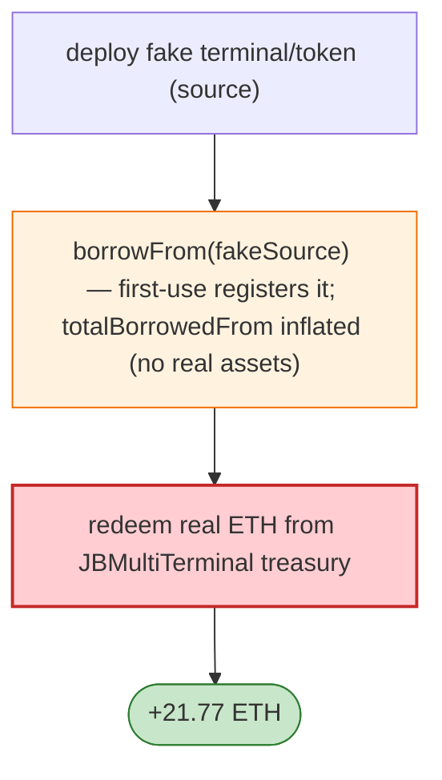

# Juicebox REVLoans Exploit — First-Use Trust of Caller-Supplied Loan Source

> **Reproduction:** the PoC compiles & runs in an isolated Foundry project at
> [this project folder](.). Full verbose trace: [output.txt](output.txt).
> Verified vulnerable source: [REVLoans](sources/REVLoans_1880D8).

---

## Key info

| | |
|---|---|
| **Loss** | 21.77 ETH; tx `0x9adbd623…` |
| **Vulnerable contract** | Juicebox `REVLoans` `0x1880D832…`; victim revnet #3 treasury in `JBMultiTerminal` |
| **Attacker** | `0x23245f62…` (EOA + fake source) |
| **Chain / block / date** | Ethereum mainnet / Apr 2026 |
| **Bug class** | Trust-on-first-use — `borrowFrom()` registers the caller-supplied loan **source** the first time it is used; a fake terminal/token inflates `totalBorrowedFrom` without paying real assets. |

---

## TL;DR

Per the embedded analysis: REVLoans registers the caller-supplied loan source the **first time**
`borrowFrom()` uses it. The attacker deploys a **fake terminal/token** that pretends to lend, calls
`borrowFrom` so REVLoans records `totalBorrowedFrom` as inflated (no real assets paid), then redeems
real ETH from the Juicebox treasury against the phantom loan accounting — netting 21.77 ETH.

---

## Root cause

A **trust-on-first-use** of an unverified caller-supplied source in a borrow path: the first caller
binds the source address, and a malicious source can falsify the "I lent X" bookkeeping that REVLoans
trusts for redemption.

---

## Diagrams



---

## Remediation

1. Whitelist/pre-register loan sources via governance; never bind a source on first caller use.
2. Verify the source actually transferred assets before crediting `totalBorrowedFrom`.
3. Reconciliation: real-asset-in must equal booked-borrow-in.

---

## How to reproduce

```bash
_shared/run_poc.sh 2026-04-JuiceboxREVLoans_exp -vvvvv
```

- RPC: mainnet archive. Result: `[PASS]` — 21.77 ETH drained via fake source.

---

*Reference: Juicebox REVLoans first-use source trust flaw, mainnet, Apr 2026 (21.77 ETH).*
