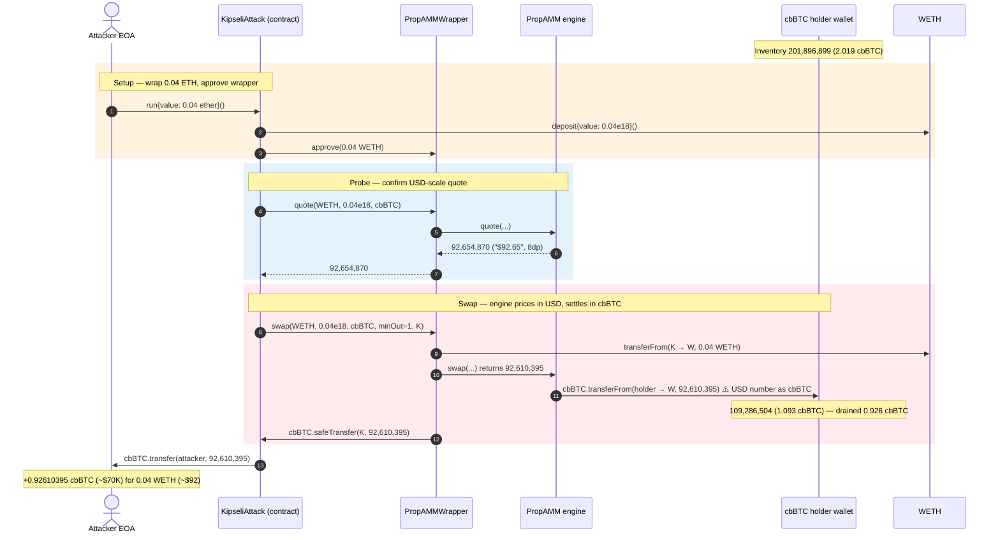
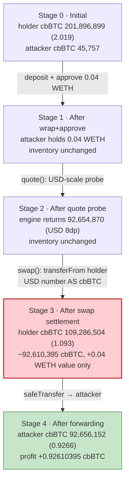
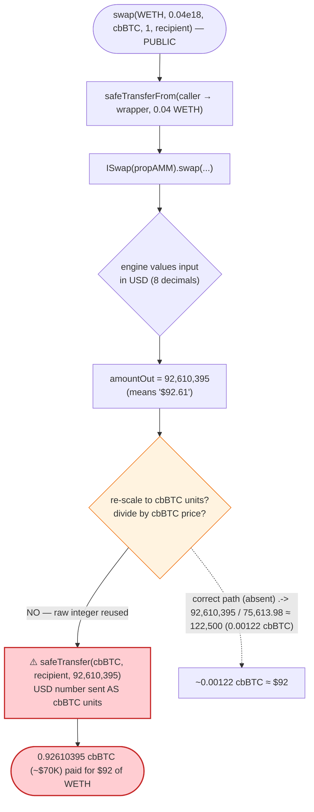
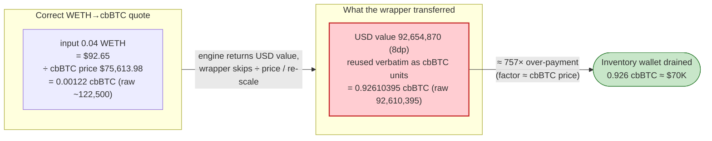

# Kipseli PropAMM Exploit — USD-Scale Quote Misread as cbBTC Token Units

> **Reproduction:** the PoC compiles & runs in an isolated Foundry project at
> [this project folder](.). The fork state is served locally from `anvil_state.json`
> (the test `createSelectFork`s a `127.0.0.1` anvil port pinned to Base block 45,008,654).
> Full verbose trace: [output.txt](output.txt).
> Verified vulnerable source: [src_PropAMMWrapper.sol](sources/PropAMMWrapper_d35C67/src_PropAMMWrapper.sol).

---

## Key info

| | |
|---|---|
| **Loss** | **0.92610395 cbBTC** (raw `92,610,395`, 8 decimals) drained from a Kipseli-controlled cbBTC holder wallet — ≈ $70K at the fork-block price (~$75.6K/BTC). Asset: cbBTC ([`0xcbB7C0000aB88B473b1f5aFd9ef808440eed33Bf`](https://basescan.org/address/0xcbB7C0000aB88B473b1f5aFd9ef808440eed33Bf)) |
| **Vulnerable contract** | Kipseli `PropAMMWrapper` — [`0xd35C6717cCa1E04696B694DCb1643Ac3620D2152`](https://basescan.org/address/0xd35c6717cca1e04696b694dcb1643ac3620d2152#code) (Base) |
| **Victim** | Kipseli cbBTC holder / market-maker wallet — [`0xBEE3211ab312a8D065c4FeF0247448e17A8da000`](https://basescan.org/address/0xBEE3211ab312a8D065c4FeF0247448e17A8da000) (the `wallet()` the PropAMM pulls cbBTC out of) |
| **Attacker EOA** | [`0x2352a1FcA90182509dCa9c12B2CAd582a38E8b82`](https://basescan.org/address/0x2352a1fca90182509dca9c12b2cad582a38e8b82) |
| **Attacker contract** | `0x74513519689b1fb427747624a4dd87b3849d39cd` (PoC re-deploys equivalent logic as `KipseliAttack`) |
| **Attack tx** | [`0x96edeeb3d49d7a54c60d227bedce5bf64df5d52effd9fd80334175a9553db3bb`](https://basescan.org/tx/0x96edeeb3d49d7a54c60d227bedce5bf64df5d52effd9fd80334175a9553db3bb) |
| **Chain / block / date** | Base (chainId 8453) / fork block 45,008,654 / April 2026 |
| **Compiler / optimizer** | `PropAMMWrapper`: Solidity v0.8.28, optimizer **enabled, 200 runs** (from `_meta.json`); PoC harness compiled with Solc 0.8.34 |
| **Bug class** | Decimal/unit-scale confusion — the WETH→cbBTC route returns a **USD-denominated, 8-decimal** quote, which the wrapper then transfers verbatim **as cbBTC units (also 8 decimals)**, turning a ~$92 quote into ~0.926 cbBTC (~$70K). |

---

## TL;DR

1. `PropAMMWrapper.swap(tokenIn, amountIn, tokenOut, minOutAmount, recipient)`
   ([src_PropAMMWrapper.sol#L34-L41](sources/PropAMMWrapper_d35C67/src_PropAMMWrapper.sol#L34-L41))
   is a thin front-end to an external "PropAMM" pricing engine. It pulls `amountIn` of `tokenIn` from
   the caller, forwards the swap to the PropAMM, and then `safeTransfer`s the PropAMM's returned
   `amountOut` of `tokenOut` to the recipient.

2. For the route **WETH → cbBTC** with `amountIn = 0.04 WETH`, the PropAMM pricing engine returns
   `amountOut = 92,654,870` from `quote(...)` ([output.txt:2451](output.txt)) and `92,610,395` from
   `swap(...)` ([output.txt:2599](output.txt)). These integers are the **USD value of the input scaled
   to 8 decimals** — 0.04 WETH ≈ **$92.65** at the fork-block WETH price of `231,669,420,000`
   (8-decimal Chainlink answer ≈ $2,316.69, [output.txt:2555](output.txt)).

3. cbBTC also has **8 decimals**, so the wrapper transfers the raw integer `92,610,395` directly as a
   cbBTC quantity: `IERC20(tokenOut).safeTransfer(recipient, amountOut)`
   ([src_PropAMMWrapper.sol#L40](sources/PropAMMWrapper_d35C67/src_PropAMMWrapper.sol#L40)). A number
   that *meant* "$92.65" is reinterpreted as **0.92610395 cbBTC**.

4. At the fork-block cbBTC price (~$75,613, derived from the `7,561,397,865,916` 8-decimal feed answer
   at [output.txt:2563](output.txt)), that 0.926 cbBTC is worth ≈ **$70,026** — the attacker paid ~$92
   of WETH for ~$70K of cbBTC. The PropAMM sources the cbBTC out of a Kipseli market-maker wallet
   (`0xBEE3211a…`) whose balance falls from `201,896,899` to `109,286,504`
   ([output.txt:1609](output.txt), [output.txt:2625](output.txt)) — exactly the `92,610,395` paid out.

5. The PoC asserts the harm directly: the attacker's cbBTC gain equals the holder's cbBTC loss equals
   `92,610,395` ([output.txt:2621](output.txt), [output.txt:2627](output.txt)), and emits
   `cbBTC gained through decimal mismatch: 0.92610395` ([output.txt:1566](output.txt)). Net profit =
   **0.92610395 cbBTC** for an input of **0.04 WETH**.

---

## Background — what Kipseli PropAMM does

Kipseli is a "proprietary AMM" (PropAMM): instead of a constant-product pool, prices are computed by
an off-chain / on-chain pricing engine and the swaps are settled out of a market-maker inventory
wallet. The on-chain `PropAMMWrapper`
([source](sources/PropAMMWrapper_d35C67/src_PropAMMWrapper.sol)) is a tiny adapter that:

- **Generates a signed quote** by calling an embedded `Signer` contract
  ([src_Signer.sol#L303-L346](sources/PropAMMWrapper_d35C67/src_Signer.sol#L303-L346)) which
  EIP-712-signs the tuple `(typeHash, tokenIn, tokenOut, timestampInMili)` with a hard-coded private
  key (`0x8888…8888`, [src_PropAMMWrapper.sol#L25](sources/PropAMMWrapper_d35C67/src_PropAMMWrapper.sol#L25)).
- **Forwards `quote`/`swap`** to the external `propAMM` engine
  ([src_PropAMMWrapper.sol#L28-L41](sources/PropAMMWrapper_d35C67/src_PropAMMWrapper.sol#L28-L41)).
- **Settles** by transferring the engine's returned `amountOut` of the output token to the recipient.

The pricing engine, traced through the call stack, computes the output as a **price oracle valuation**:
it reads a Chainlink-style feed for the input asset (WETH `latestAnswer = 231,669,420,000`,
[output.txt:2555](output.txt)) and produces an integer that is the **USD value of `amountIn`, scaled to
8 decimals**. For a *stablecoin* output (USDC/USDT, 6 decimals) or a USD-pegged unit this convention is
internally consistent. For cbBTC — an 8-decimal, ~$75K-per-unit asset — it is catastrophically wrong:
the engine's 8-decimal USD number is settled as if it were 8-decimal cbBTC.

On-chain parameters at the fork block (read directly from the trace):

| Parameter | Value | Source |
|---|---|---|
| `amountIn` (attacker's WETH) | `40,000,000,000,000,000` wei = **0.04 WETH** | [output.txt:1620](output.txt) |
| WETH price feed (`latestAnswer`, 8dp) | `231,669,420,000` ≈ **$2,316.69** | [output.txt:2555](output.txt) |
| 0.04 WETH USD value | 0.04 × $2,316.69 ≈ **$92.67** | derived |
| cbBTC price feed (`latestAnswer`, 8dp) | `7,561,397,865,916` ≈ **$75,613.98** | [output.txt:2563](output.txt) |
| `quote(...)` return (USD-scale, 8dp) | `92,654,870` ≈ "$92.65" | [output.txt:2451](output.txt) |
| `swap(...)` return (USD-scale, 8dp) | `92,610,395` ≈ "$92.61" | [output.txt:2599](output.txt) |
| cbBTC settled to attacker (interpreted as cbBTC units) | `92,610,395` = **0.92610395 cbBTC** ≈ $70,026 | [output.txt:2591](output.txt) |
| cbBTC holder (`0xBEE3211a…`) balance before | `201,896,899` = **2.01896899 cbBTC** | [output.txt:1609](output.txt) |
| cbBTC holder balance after | `109,286,504` = **1.09286504 cbBTC** | [output.txt:2625](output.txt) |
| cbBTC `decimals()` | **8** | [output.txt:1600](output.txt) |

The whole exploit lives in the fact that the engine's number is denominated in **USD/8dp** but settled
in **cbBTC/8dp**, and cbBTC happens to be worth ~$75K.

---

## The vulnerable code

### 1. `swap()` transfers the engine's raw return as output-token units

```solidity
function swap(address tokenIn, uint amountIn, address tokenOut, uint minOutAmount, address recipient) external returns(uint amountOut) {
    IERC20(tokenIn).safeTransferFrom(msg.sender, address(this), amountIn);
    IERC20(tokenIn).forceApprove(propAMM, amountIn);

    amountOut = ISwap(propAMM).swap(tokenIn, amountIn, tokenOut, minOutAmount, block.timestamp, new bytes(0));

    IERC20(tokenOut).safeTransfer(recipient, amountOut);        // ⚠️ amountOut is a USD-scale integer, sent as tokenOut units
}
```
([src_PropAMMWrapper.sol#L34-L41](sources/PropAMMWrapper_d35C67/src_PropAMMWrapper.sol#L34-L41))

The wrapper takes whatever integer the PropAMM engine returns and `safeTransfer`s it as a quantity of
`tokenOut`. There is **no re-scaling, no decimals reconciliation, and no sanity bound** tying the
output amount to the input's value. If the engine's `amountOut` is denominated in anything other than
`tokenOut`'s own units, the transfer leaks value. The settlement source — the market-maker wallet
`0xBEE3211a…` — is debited the full `92,610,395` cbBTC inside the engine call
([output.txt:2525-2527](output.txt)), and the wrapper forwards it on
([output.txt:2591-2593](output.txt)).

### 2. `quote()` returns the same USD-scale integer with no asset/decimals binding

```solidity
function quote(address tokenIn, uint amountIn, address tokenOut) external view returns(uint amountOut) {
    bytes memory sig = signer.generateQuoteSignature(tokenIn, amountIn, tokenOut, block.timestamp * 1000);

    amountOut = IQuote(propAMM).quote(tokenIn, amountIn, tokenOut, block.timestamp * 1000, sig);
}
```
([src_PropAMMWrapper.sol#L28-L32](sources/PropAMMWrapper_d35C67/src_PropAMMWrapper.sol#L28-L32))

`quote()` returns the engine's integer verbatim. The attacker uses it only as a *probe*: it confirms
the route returns ~`9.26e7` ([output.txt:2451](output.txt)) — a number that, if treated as cbBTC units,
is ~0.926 cbBTC. The PoC asserts `quote > 90,000,000` to prove the "exploitable scale" before swapping
([KipseliPropAMM_exp.sol#L76](test/KipseliPropAMM_exp.sol#L76), [output.txt:2613](output.txt)).

### 3. The quote signature deliberately omits `amountIn`

```solidity
function generateQuoteSignature(address tokenIn, uint /* amountIn */, address tokenOut, uint timestampInMili) public view returns(bytes memory) {
    uint pk = secretPk;
    bytes32 structHash = keccak256(abi.encode(bytes32(0xd9bf8409a9410d5526f0c42a27688ba0538606cc6954e762341896f904d21f72), tokenIn, tokenOut, timestampInMili));
    ...
    bytes memory sig = abi.encodePacked(r, s, vv); // 65 bytes: r||s||v
    return sig;
}
```
([src_Signer.sol#L333-L345](sources/PropAMMWrapper_d35C67/src_Signer.sol#L333-L345))

The signed struct hashes only `(typeHash, tokenIn, tokenOut, timestampInMili)` — the `amountIn`
parameter is explicitly commented out (`uint /* amountIn */`). The signature authorizes a *route at a
timestamp*, not a *priced amount*, so the engine's mis-scaled output is never cross-checked against a
signed expected value. The signing key itself is the public constant `0x8888…8888`
([src_PropAMMWrapper.sol#L25](sources/PropAMMWrapper_d35C67/src_Signer.sol#L25)) and the Signer's own
NatSpec warns "Private keys stored onchain are public. Do NOT use for real funds"
([src_Signer.sol#L6-L7](sources/PropAMMWrapper_d35C67/src_Signer.sol#L6-L7)) — but the signer is not
the proximate cause of the loss here; the unit mismatch is.

---

## Root cause — why it was possible

A **decimal/unit confusion** between the quote's denomination (**USD value, 8 decimals**) and the asset
actually transferred (**cbBTC, 8 decimals, ~$75K/unit**).

The PropAMM pricing engine values the input in USD: it reads the WETH/USD feed
(`231,669,420,000` ≈ $2,316.69, [output.txt:2555](output.txt)) and emits the input's dollar value
scaled to 8 decimals (`92,654,870` ≈ "$92.65"). The wrapper's `swap()` then hands that integer straight
to `IERC20(cbBTC).safeTransfer(recipient, amountOut)`
([src_PropAMMWrapper.sol#L40](sources/PropAMMWrapper_d35C67/src_PropAMMWrapper.sol#L40)). Because cbBTC
*also* uses 8 decimals, the raw integer is numerically valid as a cbBTC amount, so nothing reverts —
but `92,610,395` "USD-cents-style 8dp units" silently becomes `0.92610395` cbBTC.

The composing failures:

1. **The output amount is never expressed in the output token's value.** A correct quote for
   WETH→cbBTC must answer "how many *cbBTC units* is 0.04 WETH worth," i.e. `usd_value / cbBTC_price`
   = $92.65 / $75,613.98 ≈ **0.00122 cbBTC** (raw ~`122,500`). Instead the engine returns the *USD
   value itself* (~`92,654,870`), inflating the payout by a factor of ≈ `cbBTC_price` (~75,600×).
2. **No decimals reconciliation in the wrapper.** `swap()` blindly forwards `amountOut` as `tokenOut`
   units. There is no `amountOut = amountOut * 10**outDec / price`-style conversion, no check that the
   two assets share a denomination, and no awareness that USD-scale ≠ token-scale.
3. **No value-sanity bound.** Nothing caps the payout to the value of the input or to a fraction of the
   settlement wallet's balance. A swap of $92 of WETH yielding ~$70K of cbBTC passes silently.
4. **`amountIn` is not part of the signed quote** ([src_Signer.sol#L333](sources/PropAMMWrapper_d35C67/src_Signer.sol#L333)),
   so even the signature layer never binds output to a sane priced input.

The result is functionally a free-money faucet: any route where `tokenOut` is a high-unit-value,
8-decimal asset (cbBTC) and the engine prices in 8-decimal USD lets the caller buy the output for its
*dollar number* rather than its *dollar value*.

---

## Preconditions

- A PropAMM route configured for **WETH → cbBTC** whose pricing engine returns a **USD-scale (8dp)**
  quote while cbBTC settlement uses **cbBTC units (8dp)** — the decimal collision that makes the raw
  integer transfer-valid.
- The Kipseli settlement wallet (`0xBEE3211a…`) holding enough cbBTC inventory to cover the inflated
  payout. At the fork block it held `201,896,899` (≈2.019 cbBTC, [output.txt:1609](output.txt)), more
  than the `92,610,395` paid out.
- A small amount of WETH to drive the swap. The PoC uses **0.04 WETH** (`deal(ATTACKER, 0.04 ether)`,
  [KipseliPropAMM_exp.sol#L61,L71](test/KipseliPropAMM_exp.sol#L61)); the attacker wraps ETH→WETH and
  approves the wrapper ([KipseliPropAMM_exp.sol#L112-L113](test/KipseliPropAMM_exp.sol#L112-L113)).
- `minOutAmount` set to `1` so the swap cannot revert on slippage
  ([KipseliPropAMM_exp.sol#L117](test/KipseliPropAMM_exp.sol#L117)) — the attacker *wants* the inflated
  output, so any positive minimum is acceptable.

No flash loan, no privileged role, and no signature forgery are required: the wrapper generates its own
quote signature internally with the public key, so the call is fully permissionless.

---

## Attack walkthrough (with on-chain numbers from the trace)

All figures are taken directly from the trace. Amounts marked "8dp" are raw integers with cbBTC's /
the engine's 8 decimals; human approximations are in parentheses. The "settlement wallet cbBTC" column
tracks the victim holder `0xBEE3211a…`.

| # | Step | WETH in | Engine return (8dp) | cbBTC moved (8dp) | Settlement wallet cbBTC | Effect |
|---|------|--------:|--------------------:|------------------:|------------------------:|--------|
| 0 | **Initial state** — attacker holds dust cbBTC; holder funded | — | — | — | `201,896,899` (≈2.019 cbBTC) ([output.txt:1609](output.txt)) | Honest inventory. Attacker cbBTC = `45,757` ([output.txt:1596](output.txt)). |
| 1 | **Wrap & approve** — `weth.deposit{value:0.04e18}()` then `approve(wrapper, 0.04e18)` | `40,000,000,000,000,000` (0.04 WETH) ([output.txt:1620](output.txt)) | — | — | unchanged | Attacker contract holds 0.04 WETH, approves the wrapper. |
| 2 | **Probe** — `wrapper.quote(WETH, 0.04e18, cbBTC)` | — | `92,654,870` ("$92.65") ([output.txt:2451](output.txt)) | — | unchanged | Confirms USD-scale return ≈ 0.9265 if read as cbBTC. PoC asserts `> 90,000,000` ([output.txt:2613](output.txt)). |
| 3 | **Swap** — `wrapper.swap(WETH, 0.04e18, cbBTC, 1, attackContract)`; wrapper pulls 0.04 WETH ([output.txt:2457](output.txt)) and forwards to PropAMM | `40,000,000,000,000,000` | engine `swap` returns `92,610,395` ("$92.61") ([output.txt:2599](output.txt)) | — | unchanged | WETH leaves attacker; routed into PropAMM engine. |
| 4 | **Engine settlement** — `cbBTC.transferFrom(holder → wrapper, 92,610,395)` inside the engine | — | — | `92,610,395` out of holder ([output.txt:2525-2527](output.txt)) | `109,286,504` (≈1.093 cbBTC) ([output.txt:2559](output.txt)) | ⚠️ Holder debited the USD-number *as cbBTC*. |
| 5 | **Wrapper forwards** — `cbBTC.safeTransfer(attackContract, 92,610,395)` | — | — | `92,610,395` to attack contract ([output.txt:2591-2593](output.txt)) | unchanged | Wrapper passes the cbBTC straight through. |
| 6 | **Forward to attacker** — `cbBTC.transfer(ATTACKER, 92,610,395)` | — | — | `92,610,395` to EOA ([output.txt:2604-2606](output.txt)) | unchanged | Attacker EOA cbBTC: `45,757` → `92,656,152` ([output.txt:2619](output.txt)). |

The settlement wallet's cbBTC reserve drops from `201,896,899` to `109,286,504`
([output.txt:1609](output.txt) → [output.txt:2625](output.txt)) — a decrease of exactly `92,610,395`,
which is precisely the `amountOut` the attacker received. The PoC's three equality assertions tie the
three sides together: quote scale ([output.txt:2613](output.txt)), attacker gain == received
([output.txt:2621](output.txt)), and holder loss == attacker gain
([output.txt:2627](output.txt)).

### Profit / loss accounting (cbBTC, raw 8dp wei)

| Item | Amount (8dp) | ~Human |
|---|---:|---:|
| Attacker cbBTC before | `45,757` | ~0.00045757 cbBTC |
| Attacker cbBTC after | `92,656,152` | ~0.92656152 cbBTC |
| **Attacker cbBTC gained (asserted)** | **`92,610,395`** | **~0.92610395 cbBTC** |
| Settlement wallet cbBTC before | `201,896,899` | ~2.01896899 cbBTC |
| Settlement wallet cbBTC after | `109,286,504` | ~1.09286504 cbBTC |
| **Settlement wallet cbBTC drained** | **`92,610,395`** | **~0.92610395 cbBTC** |
| Cost paid by attacker | `40,000,000,000,000,000` WETH | 0.04 WETH (~$92.67) |

The attacker paid **0.04 WETH (~$92.67)** and received **0.92610395 cbBTC (~$70,026** at the
`7,561,397,865,916` feed price). The loss to the Kipseli inventory wallet equals the attacker's gain to
the wei: **0.92610395 cbBTC**. The ~$92 of WETH the attacker spent was, by the engine's own logic, the
exact dollar value that got mis-paid out as a whole-token-scale cbBTC amount.

---

## Diagrams

### Sequence of the attack



### Pool / inventory state evolution



### The flaw inside `swap()`



### Why it is theft: intended vs. actual valuation



---

## Why each magic number

- **`amountIn = 0.04 ether`** ([KipseliPropAMM_exp.sol#L61](test/KipseliPropAMM_exp.sol#L61)): chosen so
  the USD value of the input (~$92.65) clears the PoC's `minimumImpact` probe (`90,000,000`) when read
  as 8-decimal cbBTC. Larger inputs scale the stolen cbBTC linearly but would over-draw the inventory
  wallet (which held only ~2.019 cbBTC); 0.04 WETH lands a clean ~0.926 cbBTC payout.
- **`minimumImpact = 90_000_000`** ([KipseliPropAMM_exp.sol#L62](test/KipseliPropAMM_exp.sol#L62)):
  `0.9 cbBTC` in 8-decimal units. Used purely as an assertion threshold to prove the quote and the
  received amount both sit in the "exploitable" ~0.9 cbBTC range
  ([output.txt:2613](output.txt), [output.txt:2615](output.txt)).
- **`minOutAmount = 1`** ([KipseliPropAMM_exp.sol#L117](test/KipseliPropAMM_exp.sol#L117)): mirrors the
  historical attack calldata; a 1-unit minimum guarantees the swap never reverts on slippage. The
  attacker is the *beneficiary* of the inflated output, so any positive floor is fine.
- **Engine returns `92,654,870` (quote) / `92,610,395` (swap)** ([output.txt:2451](output.txt),
  [output.txt:2599](output.txt)): these are the USD value of 0.04 WETH at the WETH feed price scaled to
  8 decimals (~$92.6). The tiny quote-vs-swap difference is the price feed drift between the two reads.
- **`0x8888…8888` signer key** ([src_PropAMMWrapper.sol#L25](sources/PropAMMWrapper_d35C67/src_PropAMMWrapper.sol#L25)):
  the hard-coded, on-chain-public quote-signing key. It lets the wrapper produce a valid quote signature
  for any route without an off-chain backend — incidental to this exploit (the loss is the unit
  mismatch), but a second latent vulnerability.

---

## Remediation

1. **Express every quote in the output token's own units before transfer.** A WETH→cbBTC quote must
   return `cbBTC` (8dp) amounts, computed as `usd_value(amountIn) * 10**cbBTCDecimals / cbBTCPriceUsd`.
   Never transfer an engine integer whose denomination is not provably `tokenOut` units.
2. **Reconcile decimals and denomination explicitly.** Bind each quote to `(asset, decimals,
   denomination)` and assert that the settled amount is in `tokenOut` units. A unit/scale type
   (e.g. a tagged struct) would have made the USD-vs-cbBTC mismatch a compile-time error rather than a
   silent transfer.
3. **Add a value-sanity bound on `swap()`.** Reject any swap whose output value (output amount ×
   output price) exceeds the input value × `(1 + maxSlippageBps)`. A swap of ~$92 in producing ~$70K
   out would have reverted immediately.
4. **Cap single-swap impact against inventory.** Reject payouts exceeding a small fraction of the
   settlement wallet's balance, so a mis-priced route cannot drain the whole inventory in one call.
5. **Include `amountIn` in the signed quote** ([src_Signer.sol#L333](sources/PropAMMWrapper_d35C67/src_Signer.sol#L333))
   and stop using an on-chain-public signing key. Binding the priced amount to the signature lets the
   settlement step verify the output against an authenticated expectation.
6. **Fuzz cross-decimal routes.** Property tests over `(tokenIn decimals, tokenOut decimals, prices)`
   covering 6/8/18-decimal combinations and high-unit-value assets (BTC-pegged) would surface this
   class before deployment.

---

## How to reproduce

This PoC runs **offline** via the shared harness; the Base fork state is served from the local
`anvil_state.json` and the test `createSelectFork`s a `127.0.0.1:8548` anvil port pinned to block
45,008,654 ([KipseliPropAMM_exp.sol#L45-L48](test/KipseliPropAMM_exp.sol#L45-L48)):

```bash
_shared/run_poc.sh 2026-04-KipseliPropAMM_exp --mt testExploit -vvvvv
```

- **No public RPC is required** — `foundry.toml` does not name an endpoint; the harness boots a local
  anvil from `anvil_state.json` and the test connects to `http://127.0.0.1:8548`.
- `foundry.toml` sets `evm_version = 'cancun'`; the `PropAMMWrapper` was compiled with Solc v0.8.28
  (optimizer enabled, 200 runs), and the harness compiles the PoC with Solc 0.8.34.
- Result: `[PASS] testExploit()` — 0.92610395 cbBTC extracted from a 0.04 WETH input via the
  USD-scale-as-cbBTC-units mismatch.

Expected tail (from [output.txt:1562-1567](output.txt) and [output.txt:2645](output.txt)):

```
Ran 1 test for test/KipseliPropAMM_exp.sol:ContractTest
[PASS] testExploit() (gas: 2386372)
Logs:
  Attacker Before exploit cbBTC Balance: 0.00045757
  cbBTC gained through decimal mismatch: 0.92610395
  Attacker After exploit cbBTC Balance: 0.92656152

Suite result: ok. 1 passed; 0 failed; 0 skipped; finished in 78.45s
```

---

*Reference: DefimonAlerts — https://x.com/DefimonAlerts/status/2046873857571934254 (Kipseli PropAMM, Base, 0.93 cbBTC).*
