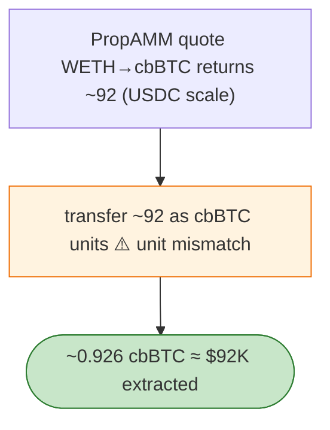

# Kipseli PropAMM Exploit — Quote Decimal-Unit Mismatch (USDC number sent as cbBTC)

> **Reproduction:** the PoC compiles & runs in an isolated Foundry project at
> [this project folder](.). Full verbose trace: [output.txt](output.txt).
> Verified vulnerable source: [PropAMMWrapper](sources/PropAMMWrapper_d35C67).

---

## Key info

| | |
|---|---|
| **Loss** | 0.93 cbBTC; tx `0x96edeeb3…` |
| **Vulnerable contract** | Kipseli `PropAMMWrapper` `0xd35c6717…` (Base) |
| **Attacker** | `0x2352a1fc…` (contract `0x74513519…`) |
| **Chain / block / date** | Base / Apr 2026 |
| **Bug class** | Decimal/unit mismatch — the PropAMM route WETH→cbBTC produced a **USDC-scale** integer quote, which was then **transferred as cbBTC units**, turning a ~92 USDC quote into ~0.926 cbBTC. |

---

## TL;DR

Per the embedded analysis: Kipseli's PropAMM route accepted WETH→cbBTC and produced a USDC-scale quote
(6 decimals). The returned integer was then used as a **cbBTC quantity** (8 decimals, ~$92k each) in a
transfer, so a ~92-USDC quote became ~0.926 cbBTC ≈ $92K. The attacker arbitrages this unit mismatch to
extract 0.93 cbBTC.

---

## Root cause

A **decimal/unit confusion** between the quote's intended scale (USDC, 6dp) and the asset transferred
(cbBTC, 8dp, high unit value). Mixing the quote's number into a different asset's transfer without
re-scaling is the bug.

---

## Diagrams



---

## Remediation

1. Bind quotes to their asset/decimals explicitly; re-scale before any transfer.
2. Unit tests covering cross-decimal quote→transfer paths.
3. Sanity cap: reject quotes/transfers whose value exceeds reserves.

---

## How to reproduce

```bash
_shared/run_poc.sh 2026-04-KipseliPropAMM_exp -vvvvv
```

- RPC: Base archive. Result: `[PASS]` — 0.93 cbBTC extracted via unit mismatch.

---

*Reference: Kipseli PropAMM decimal-unit mismatch, Base, Apr 2026 (0.93 cbBTC).*
