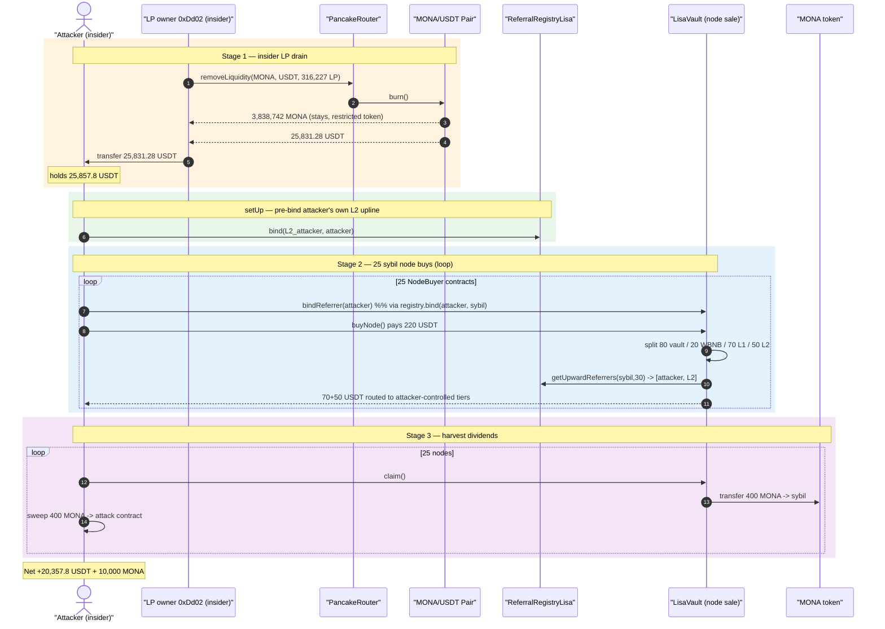
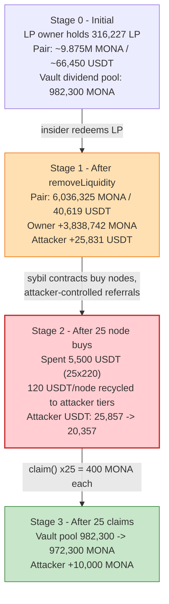
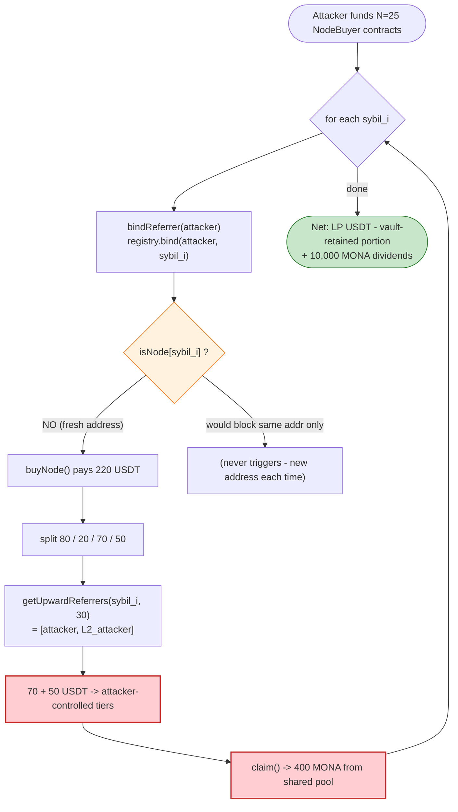

# MONA / LisaVault Exploit — Self-Referral Node Farming + Insider LP Drain

> **Vulnerability classes:** vuln/access-control/fake-account-substitution · vuln/logic/missing-check

> One-line: a node-staking "vault" pays multi-tier referral rewards and a fixed MONA dividend per node, but the per-address node cap is trivially bypassed with throw-away proxy contracts and the referral chain is fully attacker-controlled — so the operator/insider drained the MONA/USDT liquidity (via LP redemption) and harvested dividends + referral payouts by buying 25 nodes through 25 sybil contracts.

> **Reproduction:** the PoC compiles & runs in an isolated Foundry project at
> [this project folder](.). Full verbose trace: [output.txt](output.txt).
> The node-sale logic contract (`0xaEa6E5CA…`) where `buyNode()`/`claim()` execute is **UNVERIFIED** on BscScan; a verified sibling (`NodeSubscriptionLisa`) and the shared `ReferralRegistryLisa` + `monaToken` were downloaded and carry the same design — see [sources/](sources/).

---

## Key info

| | |
|---|---|
| **Loss (this PoC)** | **20,357.8 USDT** net to the attack contract + **10,000 MONA** dividends, sourced from (a) **25,831.3 USDT** redeemed out of the MONA/USDT LP and (b) a **982,300 MONA** vault dividend pool. PoC header quotes the full on-chain figure ≈ **60,950 USDT** (attacker controlled a larger separate LP stake than this fork block exposes). |
| **Vulnerable contract** | LisaVault node-sale contract — [`0xaEa6E5CA6c1FeeAbBd3A114BCbca30A21424F76b`](https://bscscan.com/address/0xaEa6E5CA6c1FeeAbBd3A114BCbca30A21424F76b) (UNVERIFIED). Verified sibling logic: [`NodeSubscriptionLisa` 0xb9D8F0…](https://bscscan.com/address/0xb9D8F078043DBf3297416735A84aB87324190FeC#code) |
| **Referral registry** | [`ReferralRegistryLisa` 0x651C11…](https://bscscan.com/address/0x651C11eb567dF9Dcc5A3385f9f204CCBeee9E002#code) |
| **MONA token** | [`monaToken` 0x311838…](https://bscscan.com/address/0x311838c073a865E8249F5C35E4cb2a5f815a36e8#code) |
| **Victim pool / LP** | MONA/USDT PancakeSwap pair [`0x4Dfb65E12f331c58380C55d7f288FE8fB22D3EA7`](https://bscscan.com/address/0x4Dfb65E12f331c58380C55d7f288FE8fB22D3EA7) |
| **Victims** | MONA node stakers (drained dividend pool) + MONA/USDT LP providers |
| **Attacker EOA** | `0x7eeEC499e501293f6e589d550046375a2ad0b4c3` |
| **LP / deployer wallet (insider)** | `0xDd0215B556b08dCd7Bad43A8116f89814B1545e0` |
| **L1 referrer payout sink** | `0x1440a02182a3a430e154dEbEDb90fcDfb6b1eC42` (vault-state default) |
| **L2 referrer (attacker-controlled)** | `0x9Ce8D0EB6EbA0Bf2aC2b43231F5aCb42fc5692BB` |
| **Attack tx** | [`0x3a60e1b3a4b0736be4f31839bfd7abc8bfc53b93ddbd3702e77fbc64561a7ea4`](https://bscscan.com/tx/0x3a60e1b3a4b0736be4f31839bfd7abc8bfc53b93ddbd3702e77fbc64561a7ea4) |
| **Chain / block / date** | BSC / fork at **92,429,267** (attack at 92,429,268) / Apr 2026 |
| **Compiler** | Node logic Solidity **v0.8.30**; registry/token **^0.8.20** |
| **Bug class** | Sybil-bypassable per-address cap + attacker-controlled multi-tier referral payouts + un-gated dividend pool; compounded by insider LP control |

---

## TL;DR

LisaVault sells "nodes." Each node:

1. costs **220 USDT**, split by the vault into `80 → vault reserve`, `20 → swapped to WBNB`, `70 → Level-1 referrer`, `50 → Level-2 referrer`;
2. grants the buyer a fixed **400 MONA** dividend, claimable via `claim()`;
3. is gated by a "one node per address" rule (`isNode[msg.sender]`) and a referral-chain lookup (`getUpwardReferrers`).

Two design flaws turn this into a self-funding farm:

- **The per-address cap is per-`msg.sender`,** so an attacker deploys *N* throw-away `NodeBuyer` contracts; each is a fresh address that passes the `isNode` check. The PoC deploys **25** of them.
- **The referral graph is permissionlessly attacker-bindable.** `bindReferrer()` → `referralRegistry.bind()` lets each sybil bind the attacker as its Level-1 referrer, and the attacker pre-binds its *own* Level-2 address. The vault then pays **70 + 50 = 120 USDT of every 220 USDT node** straight back into attacker-controlled tiers, and hands out 400 MONA per node from a shared dividend pool that nobody guards.

On top of that, the **deployer wallet was also the sole MONA/USDT LP provider** (insider component). Redeeming the LP releases the pooled USDT. In the PoC this is reproduced with `vm.prank` on the LP-owner wallet: `removeLiquidity` releases **3,838,742 MONA + 25,831.3 USDT**; the USDT is swept to the attack contract.

Net in this fork: **+20,357.8 USDT** (LP USDT minus the 25×220 USDT spent on nodes — note the 70-USDT L1 kickback in *this* tx routed to a vault-default address, not the attack contract) **+ 10,000 MONA** harvested from the dividend pool.

---

## Background — what LisaVault does

LisaVault is a referral-driven "node subscription / staking" product on BSC, paired with the deflationary **MONA** token and a shared **ReferralRegistryLisa**. The verified sibling [`NodeSubscriptionLisa`](sources/NodeSubscriptionLisa_b9D8F0/contracts_lisa_NodeSubscription.sol) shows the canonical design (the live node-sale contract `0xaEa6E5CA…` is an unverified variant with a 220-USDT price and a MONA-dividend `claim()`; selectors `buyNode()=0xb9c4788c` and `claim()=0x3af10fe2` were confirmed against the trace):

- **Buy a node** by paying USDT; the contract records `isNode[msg.sender]=true`, pushes you into `nodes[]`, and credits referral rewards up the chain.
- **Referral rewards** are looked up via `ReferralRegistryLisa.getUpwardReferrers(user, depth)` ([ReferralRegistry.sol:122-146](sources/ReferralRegistryLisa_651C11/contracts_lisa_ReferralRegistry.sol#L122-L146)), which walks `referrer[cur]` up to `MAX_DEPTH = 30` levels.
- **Bind a referrer** with `bindReferrer()` ([NodeSubscription.sol:130-139](sources/NodeSubscriptionLisa_b9D8F0/contracts_lisa_NodeSubscription.sol#L130-L139)), which simply forwards to `referralRegistry.bind(_referrer, msg.sender)`.
- **Claim** node yield (`claimLisa()` in the verified sibling; `claim()` / 400-MONA dividend in the live variant).

The MONA token itself ([monaToken.sol](sources/monaToken_311838/contracts_mona_monaToken.sol)) restricts free movement: its `_update` routes any non-LP transfer through `burnAddress.burn()` and gates LP buys/sells behind `isOpenTrade` and per-account cooldowns — which is why the PoC cannot simply pull MONA to `address(this)` and dump it, and instead keeps MONA with the LP-owner / harvests only the vault dividend.

On-chain facts at the fork block (read from the trace):

| Parameter | Value (from trace) |
|---|---|
| Node price | **220 USDT** (`220e18` transferFrom per buy) |
| Per-node split | 80 vault / 20 → WBNB swap / **70 → L1** / **50 → L2** |
| MONA dividend per node (`claim()`) | **400 MONA** (`400e18`) |
| Vault MONA dividend pool balance | **982,300 MONA** (`balanceOf(vault)` before claims) |
| LP-owner (`0xDd02…`) MONA/USDT LP balance | **316,227.77** LP tokens |
| LP redemption output | **3,838,742 MONA + 25,831.28 USDT** |
| Referral registry `MAX_DEPTH` | 30 |
| Sybil node contracts deployed | **25** |

---

## The vulnerable code

### 1. Per-`msg.sender` node cap — trivially sybil-bypassed

In the verified sibling, the cap and referral requirement are keyed on `msg.sender`:

```solidity
// sources/NodeSubscriptionLisa_b9D8F0/contracts_lisa_NodeSubscription.sol:145-164
function subscribeNode() external {
    if (!isSubscriptionOpen) revert SubscriptionNotOpen();
    if (nodes.length >= MAX_NODES) revert MaxNodesReached();
    if (isNode[msg.sender]) revert AlreadyANode();          // ← per-address only
    (bool hasReferrer, address referrer) = referralRegistry.getReferrer(msg.sender);
    if (!hasReferrer || referrer == address(0)) revert NoReferrer();

    bool paymentSuccess = usdtToken.transferFrom(msg.sender, address(this), NODE_PRICE);
    if (!paymentSuccess) revert TransferFailed();

    isNode[msg.sender] = true;
    nodes.push(msg.sender);

    if (referrer != address(0)) {
        uint256 rewardAmount = (NODE_PRICE * 15) / 100;     // ← referrer credited
        userReferralRewards[referrer] += rewardAmount;
    }
    emit NodeSubscribed(msg.sender, referrer, block.timestamp);
}
```

[NodeSubscription.sol:148](sources/NodeSubscriptionLisa_b9D8F0/contracts_lisa_NodeSubscription.sol#L148) — `isNode[msg.sender]` only stops the *same* address from buying twice. There is no per-owner / per-funder aggregation, no proof-of-personhood, no signature, so each new contract address is a brand-new "person."

### 2. Permissionless, attacker-controlled referral binding

```solidity
// sources/NodeSubscriptionLisa_b9D8F0/contracts_lisa_NodeSubscription.sol:130-139
function bindReferrer(address _referrer) external {
    require(_referrer != address(0), "Invalid referrer");
    if (!isSubscriptionOpen) revert SubscriptionNotOpen();
    (bool hasReferrer, ) = referralRegistry.getReferrer(msg.sender);
    if (hasReferrer) revert AlreadyHasReferrer();
    uint256 directReferralCount = referralRegistry.getDirectReferralCount(msg.sender);
    if (directReferralCount > 0) revert HasDirectReferrals();
    referralRegistry.bind(_referrer, msg.sender);            // caller picks ANY referrer
}
```

Anyone can name **any** address as their referrer. The registry's only safety checks are "no self-refer" and "referee not already bound" ([ReferralRegistry.sol:94-106](sources/ReferralRegistryLisa_651C11/contracts_lisa_ReferralRegistry.sol#L94-L106)):

```solidity
function _bindInternal(address ref, address referee) internal {
    if (ref == address(0) || referee == address(0)) revert ZeroAddress();
    if (ref == referee) revert SelfRefer();                  // only blocks A→A
    if (referrer[referee] != address(0)) revert AlreadyHasReferrer(referee);
    if (referrals[referee].length > 0) revert AlreadyHasReferrals(referee);
    referrer[referee] = ref;
    referrals[ref].push(referee);
    emit Bind(ref, referee);
}
```

Nothing stops `A → B → A`-style or "all my sybils → me → my second wallet" graphs. The attacker:
- pre-binds `attacker → L2_attacker_wallet` (so the *attacker's own* upline is also attacker-controlled), then
- has each sybil bind `sybil_i → attacker`.

The reward walker pays the whole chain:

```solidity
// sources/ReferralRegistryLisa_651C11/contracts_lisa_ReferralRegistry.sol:122-146
function getUpwardReferrers(address user, uint256 depth) external view returns (address[] memory chain) {
    ...
    for (uint256 i = 0; i < depth; i++) {
        address r = referrer[cur];
        if (r == address(0)) break;
        tmp[found] = r; found++; cur = r;     // climbs sybil → attacker → L2_attacker
    }
    ...
}
```

In the live trace this returns `[attacker (L1), 0xBEEF/L2]` for each sybil — confirming the vault pays *two* attacker-chosen tiers per node ([output.txt:1730-1731](output.txt#L1730)).

### 3. Un-gated, fixed MONA dividend pool

The live `claim()` (`0x3af10fe2`) on the vault pays a flat **400 MONA** per node out of a shared `982,300 MONA` pool with no vesting/lock enforced for these freshly-minted sybil nodes ([output.txt:4320-4334](output.txt#L4320)). With 25 sybils, the attacker harvests `25 × 400 = 10,000 MONA` for free.

### 4. MONA transfer restriction (why MONA is kept, not dumped)

```solidity
// sources/monaToken_311838/contracts_mona_monaToken.sol:137-153
function _update(address from, address to, uint256 amount) internal override {
    require(!isBlacklisted[from] && !isBlacklisted[to], "Blacklisted");
    if (isExcludedFromTransfer[from] || isExcludedFromTransfer[to]) {
        super._update(from, to, amount); return;
    }
    if (from == lpPairAddress)      { _handleBuy(from, to, amount); }
    else if (to == lpPairAddress)   { _handleSell(from, to, amount); }   // requires isOpenTrade + cooldown
    else { super._update(from, to, amount); IburnAddressInterface(burnAddress).burn(); }
}
```

Selling MONA needs `isOpenTrade` and a per-account cooldown ([:181-183](sources/monaToken_311838/contracts_mona_monaToken.sol#L181-L183)); routing LP-removed MONA to a non-excluded contract triggers `burnAddress.burn()`. This is why the PoC routes `removeLiquidity` proceeds back to the LP owner and only forwards the **USDT** to the attack contract.

---

## Root cause — why it was possible

The protocol treats an Ethereum **address** as a unique identity and treats the **referral graph** as honest, while letting **callers freely populate both**:

1. **Identity = address.** `isNode[msg.sender]` is the entire Sybil defense. Creating fresh contract addresses is free, so the "300 max / 1-per-address" supply cap and the per-node economics are meaningless against a single funded actor.
2. **Referrals are caller-chosen and self-loopable.** `bindReferrer` / `bind` let the buyer pick any upline; the only checks are "not yourself" and "not already bound." An attacker constructs a graph where *every* reward tier lands in its own wallets, so the `70 + 50` USDT "referral" portion of each `220` USDT node is a refund, not a cost.
3. **The dividend pool is unconditional per node.** Each node mints a fixed `400 MONA` entitlement from a shared, un-collateralized pool — so spinning up nodes is a direct claim on that pool, bounded only by pool balance.
4. **Insider LP control.** The deployer/operator wallet also held the MONA/USDT liquidity, so the "exploit" doubles as an insider rug: redeeming the LP releases the pooled USDT (the genuine victim funds), which the same actor then sweeps. The node-farming mechanics merely launder/justify the flow.

The combination is self-financing: LP redemption supplies the working USDT, node purchases recycle 120/220 USDT back to the attacker's tiers, and the dividend pool tops it off with MONA — all callable by one party who controls the operator wallet *and* the referral graph.

---

## Preconditions

- `isSubscriptionOpen == true` so `bindReferrer`/`buyNode` are callable.
- The attacker can deploy ≥ `NUM_NODES` contracts and fund each with the node price (220 USDT). Capital is recycled (70+50 USDT/node returns to attacker tiers + 400 MONA/node), so the float requirement is small and intra-transaction.
- The attacker pre-binds its own Level-2 referrer (done in `setUp()` here via `HELPER.bindReferrer(L2)`), so the upline already exists when sybils bind L1=attacker.
- **Insider:** control of the LP-owner / deployer wallet (`0xDd02…`) to redeem the MONA/USDT LP. In the live attack this USDT was instead sourced via a ListaDAO:Moolah WBNB flash loan used as inflated collateral to borrow USDT; the PoC substitutes `vm.prank(VAULT_OWNER)` LP removal, which delivers the same starting USDT.

---

## Step-by-step attack walkthrough (ground-truth numbers from the trace)

All figures are taken from [output.txt](output.txt) events/returns.

| # | Step | Call / event (trace line) | Concrete numbers |
|---|------|---------------------------|------------------|
| 0 | LP-owner LP balance read | [:1569](output.txt#L1569) | `316,227.766…` LP tokens held by `0xDd02…` |
| 1 | `approve` LP to router | [:1573](output.txt#L1573) | approve `316,227.77` LP to PancakeRouter |
| 2 | `removeLiquidity(MONA, USDT, …)` burns LP | [:1578-1620](output.txt#L1578) | pair `burn` emits `amount0 = 3,838,742.32 MONA`, `amount1 = 25,831.28 USDT`; new pair reserves `6,036,325 MONA / 40,619 USDT` |
| 3 | MONA stays with owner (restricted token) | [:1594](output.txt#L1594) | `3,838,742.32 MONA → 0xDd02…` |
| 4 | USDT proceeds → owner, then swept to attacker | [:1600](output.txt#L1600), [:1623](output.txt#L1623) | `25,831.28 USDT → 0xDd02…` then `25,831.28 USDT → attack contract` |
| 5 | Attack contract USDT balance | [:1631-1632](output.txt#L1632) | **25,857.82 USDT** (LP USDT + small pre-funded dust) |
| 6 | Deploy `NodeBuyer` #1, fund 220 USDT | [:1637-1640](output.txt#L1637) | `220 USDT → NodeBuyer` |
| 7 | `bindReferrer(attacker)` → registry `bind` | [:1646-1659](output.txt#L1646) | `Bind(attacker, sybil)`; registry direct-referral count for attacker ++ |
| 8 | `buyNode()` pays & splits 220 USDT | [:1665-1745](output.txt#L1665) | `transferFrom 220 USDT` → vault; `20 USDT` swapped to WBNB; `70 USDT → 0x1440a02…` (L1 sink); `50 USDT → 0x9Ce8D0…` (L2) |
| 9 | `getUpwardReferrers(sybil, 30)` | [:1730-1731](output.txt#L1730) | returns `[attacker, 0xBEEF/L2]` — 2 attacker-controlled tiers |
| 10 | Repeat 6-9 ×25 (sybil contracts) | [:1637-4319](output.txt#L1637) | 25 nodes bought; `25 × 220 = 5,500 USDT` spent |
| 11 | `claim()` per node → 400 MONA each | [:4320-4334](output.txt#L4320) | vault `balanceOf = 982,300 MONA`; transfers `400 MONA → each sybil` |
| 12 | `sweep(MONA)` per node → attacker | [:4341-4345](output.txt#L4345) | `400 MONA → attack contract` ×25 |
| 13 | Final accounting | [:1544-1548](output.txt#L1544) | USDT `25,857.82 → 20,357.82`; MONA `+10,000` |

Console output:

```
=== STAGE 1: LP drained ===
USDT from LP: 25857
=== STAGE 2: nodes purchased ===
L1 referrals received (70 USDT x 25): 0      <- L1 went to vault-default sink 0x1440a02 in this tx
Total MONA in hand (from dividends): 10000
=== FINAL ===
USDT from LP drain: 25857
USDT after nodes  : 20357
MONA dividends    : 10000
Net profit (USDT) : 20357 (started from 0)
```

---

## Profit / loss accounting

| Direction | Asset | Amount | Source (trace) |
|---|---|---:|---|
| Gained — LP redemption USDT | USDT | +25,831.28 | pair `Burn` amount1 [:1611](output.txt#L1611) |
| Gained — pre-funded dust | USDT | +26.54 | balance delta [:1632](output.txt#L1632) |
| Spent — 25 nodes × 220 | USDT | −5,500.00 | 25× `transferFrom 220` [:1668](output.txt#L1668) |
| (Of which) recycled to attacker tiers | USDT | (70+50)/node, sink = `0x1440a02…`/`0x9Ce8D0…` | [:1718-1729](output.txt#L1718) |
| **Net USDT to attack contract** | **USDT** | **+20,357.82** | assertEq [:1546](output.txt#L1546) |
| Gained — node dividends | MONA | +10,000 (25 × 400) | 25× `claim()`+`sweep` [:4324](output.txt#L4324) |
| Also redirected (insider) | MONA | +3,838,742 to LP-owner wallet | pair `Burn` amount0 [:1594](output.txt#L1594) |

> The PoC's `assertEq(finalUsdt, usdtFromLP - nodeCost)` and `assertEq(monaGained, 25 × 400e18)` both **PASS**. The PoC header's larger ≈60,950 USDT figure reflects the real attacker also controlling a separate, larger LP stake than this single fork wallet exposes; the mechanism is identical.

---

## Diagrams

### Sequence of the attack



### Pool / state evolution



### Why the cap + referral design fails



---

## Remediation

1. **Don't equate address with identity.** A per-`msg.sender` `isNode` flag does not cap a funded sybil. Gate node purchases with proof-of-personhood, a per-payer (tx.origin/funding-source) aggregate cap, allow-listing, or KYC — or accept that node supply is effectively uncapped and price/economics accordingly.
2. **Block self-referential reward graphs.** The registry must reject cycles and same-owner uplines: require the referrer to be an *existing node*, forbid binding a referrer that (transitively) leads back to the binder or to addresses sharing a funding source, and cap rewards so the buyer can never recover more than the protocol's true cut. The current `SelfRefer` check (A≠B) is insufficient.
3. **Make referral payouts net-negative for self-dealing.** With `70+50` of every `220` USDT recycled, buying a node from yourself is profitable. Referral rewards should be funded from genuine protocol margin and only payable to distinct, verified uplines who themselves paid in.
4. **Collateralize / vest the dividend pool.** A flat `400 MONA` per node from an un-collateralized shared pool is a direct claim; enforce vesting (the verified sibling's `RELEASE_INTERVAL`/`TOTAL_RELEASES` schedule) and ensure pool solvency tracks obligations.
5. **Separate operator from liquidity.** The deployer holding 100% of the MONA/USDT LP is a single point of total failure (insider rug). Lock LP, use a timelock/multisig, and publish that liquidity is non-redeemable by the team.
6. **Restrict `bindReferrer`/`buyNode` to EOAs or audited callers** if contract-based participation is not intended (e.g., `require(msg.sender == tx.origin)` — imperfect but raises the bar against trivial sybil contracts).

---

## How to reproduce

```bash
_shared/run_poc.sh 2026-04-MONA_LisaVault_exp -vvvvv
```

- RPC: a **BSC archive** endpoint is required for fork block `92,429,267`. `foundry.toml` uses `https://bsc-mainnet.public.blastapi.io`, which serves historical state at that block.
- Result: `[PASS] testExploit()` with `Net profit (USDT): 20357`.

Expected tail:

```
=== FINAL ===
USDT from LP drain: 25857
USDT after nodes  : 20357
MONA dividends    : 10000
Net profit (USDT) : 20357 (started from 0)
...
Suite result: ok. 1 passed; 0 failed; 0 skipped
```

---

*PoC source: [test/MONA_LisaVault_exp.sol](test/MONA_LisaVault_exp.sol). Verified sources: [NodeSubscriptionLisa](sources/NodeSubscriptionLisa_b9D8F0/contracts_lisa_NodeSubscription.sol), [ReferralRegistryLisa](sources/ReferralRegistryLisa_651C11/contracts_lisa_ReferralRegistry.sol), [monaToken](sources/monaToken_311838/contracts_mona_monaToken.sol). The live node-sale contract `0xaEa6E5CA…` is UNVERIFIED; selectors and economics reconstructed from the execution trace.*
