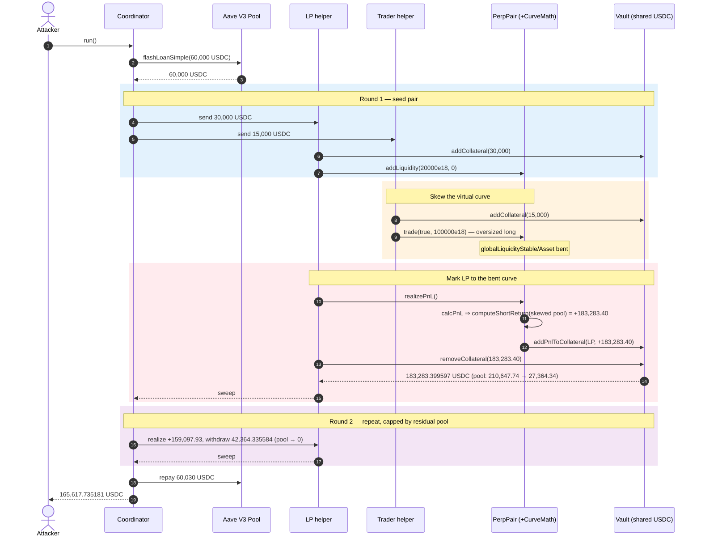
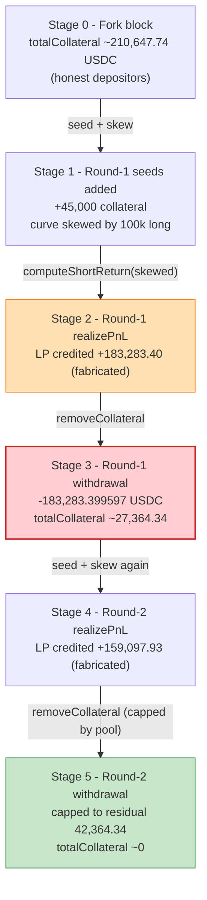
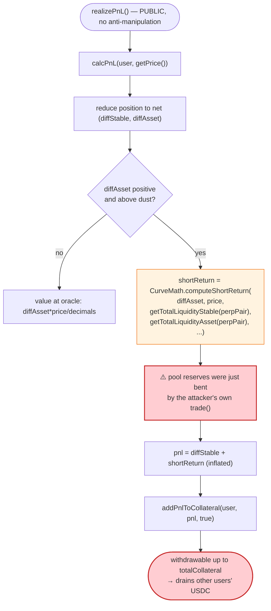
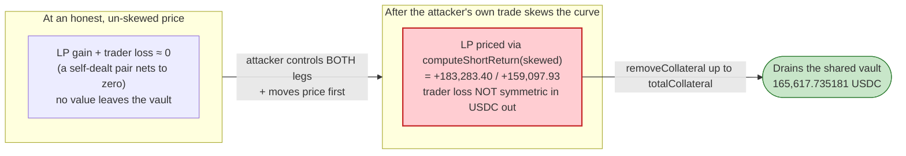

# PerpPair Exploit — Self-Dealt LP/Trader Pair Inflates Curve-Priced PnL out of the Shared Vault

> **Vulnerability classes:** vuln/oracle/price-manipulation · vuln/governance/flash-loan-attack

> **Reproduction:** the PoC compiles & runs in an isolated Foundry project at
> [this project folder](.) (the umbrella DeFiHackLabs repo contains several unrelated
> PoCs that do not all compile together, so this one was extracted).
> Full verbose trace: [output.txt](output.txt).
> Verified vulnerable sources (active implementations at the fork block):
> [PerpPair](sources/PerpPair_B68396/src_PerpPair.sol) +
> [CurveMath](sources/CurveMath_78197f/src_util_CurveMath.sol) +
> [Vault](sources/Vault_61cE9B/src_Vault.sol).

---

## Key info

| | |
|---|---|
| **Loss** | **165,617.735181 USDC** net profit asserted by the PoC (the real-world incident is quoted at ~165,647.74 USDC). USDC drained out of the shared [`Vault`](https://lineascan.build/address/0x61cE9B51010BA52F701444f0F3D1e563F6ae8d91) on Linea |
| **Vulnerable contract** | `PerpPair` — [`0xB68396dD4230253d27589e2004Ac37389836AE17`](https://lineascan.build/address/0xb68396dd4230253d27589e2004ac37389836ae17#code); pricing library `CurveMath` — [`0x78197FE93999e34D5A688E1819923c66DCf8F4DB`](https://lineascan.build/address/0x78197fe93999e34d5a688e1819923c66dcf8f4db#code) |
| **Victim** | `Vault` (shared collateral vault) — [`0x61cE9B51010BA52F701444f0F3D1e563F6ae8d91`](https://lineascan.build/address/0x61cE9B51010BA52F701444f0F3D1e563F6ae8d91) — the pooled USDC collateral of every PerpPair user |
| **Attacker EOA** | `0x8D6778d7FAe00aD2e0bc12194cF03B756FED9Db3` |
| **Attacker contract** | `0xb87275489272ce1c4be358fc5856ea3273093cf8` (coordinator; the PoC re-deploys an equivalent `PerpPairAttackCoordinator`) |
| **Attack tx** | [`0xcb0744a0d453e5556f162608fae8275dabd14292bffbfcd8394af4610c606447`](https://lineascan.build/tx/0xcb0744a0d453e5556f162608fae8275dabd14292bffbfcd8394af4610c606447) |
| **Chain / block / date** | Linea / fork block 30,067,820 / Apr 2026 |
| **Compiler** | Solidity v0.8.30 (verified `PerpPair`/`CurveMath`/`Vault`), optimizer **enabled, 1 run** |
| **Bug class** | Self-dealt market manipulation: an attacker-controlled trader skews the virtual AMM, an attacker-controlled LP is then priced as having a huge positive PnL through `CurveMath`, and that fabricated PnL is withdrawn from the *shared* collateral vault |

---

## TL;DR

`PerpPair` is a perpetuals AMM. Liquidity providers and traders both post USDC into one
shared `Vault`; profit and loss are settled against that single pool. A position's PnL is
computed by valuing its net virtual-asset balance through `CurveMath.computeShortReturn`
**over the pool's current liquidity state**, and the pool's current liquidity state is
freely movable by anyone who opens a trade.

1. The attacker takes a **60,000 USDC** Aave V3 flash loan
   ([PerpPair_exp.sol:110](test/PerpPair_exp.sol#L110), [output.txt:1612](output.txt)) and, inside
   `executeOperation`, spins up two throwaway helper contracts: a **LP helper** and a **trader
   helper** ([PerpPair_exp.sol:130-133](test/PerpPair_exp.sol#L130-L133)).

2. The LP helper deposits 30,000 USDC of collateral and calls `PerpPair.addLiquidity(20000e18, 0, …)`
   ([PerpPair_exp.sol:191](test/PerpPair_exp.sol#L191), [output.txt:1683](output.txt)) — giving itself
   a fresh liquidity position whose net asset exposure will be re-priced later.

3. The trader helper deposits 15,000 USDC and opens an **oversized 100,000-size long** with
   `PerpPair.trade(true, 100000e18, …)`
   ([PerpPair_exp.sol:137](test/PerpPair_exp.sol#L137), [output.txt:1792](output.txt)). This trade
   pushes the curve's `globalLiquidityStable`/`globalLiquidityAsset` far from their honest values.

4. The LP helper now calls `realizePnL()`
   ([internalPerpLogic.sol:99-123](sources/PerpPair_B68396/src_perpModules_internalPerpLogic.sol#L99-L123),
   [output.txt:1867](output.txt)). `calcPnL` values the LP's net virtual asset through
   `CurveMath.computeShortReturn` against the **skewed** pool, returning a **positive PnL of
   183,283.40** (18-dec) ([output.txt:1898](output.txt)). The PnL is credited to the LP's vault
   collateral, and the LP withdraws **183,283.399597 USDC** — far more than the 45,000 USDC the
   attacker seeded this round ([output.txt:1997](output.txt)).

5. Steps 2–4 are repeated with a smaller second LP/trader pair (10,000 + 5,000 USDC) while the
   AMM is still distorted, realizing another **159,097.93** PnL but capped by the vault's
   remaining balance to **42,364.335584 USDC** ([output.txt:2292-2376](output.txt)).

6. The attacker repays the flash loan principal **plus a 30 USDC premium** (60,030 USDC total,
   [PerpPair_exp.sol:156-158](test/PerpPair_exp.sol#L156-L158), [output.txt:2405](output.txt)) and
   walks away with **165,617.735181 USDC** ([output.txt:1566](output.txt)).

The PnL of an LP/trader pair that both belong to the same attacker is **always zero in
aggregate at honest prices** — but PerpPair lets the trader move the price first and then prices
the LP's gain at the moved price, against a collateral pool funded by honest third parties.

---

## Background — what PerpPair does

`PerpPair` ([source](sources/PerpPair_B68396/src_PerpPair.sol)) is a perpetual-futures AMM split
into modules (`perpTrade`, `perpLiquidity`, `perpFunding`, `perpLiquidation`,
`internalPerpLogic`) sharing one `PerpStorage` layout. It does **not** custody real reserves like
a Uniswap pair; instead it maintains a *virtual* curve with two scalar reserves,
`globalLiquidityStable` and `globalLiquidityAsset`, and prices trades by solving a cubic on that
curve via the external `CurveMath` library.

All economic value lives in a single external `Vault`
([source](sources/Vault_61cE9B/src_Vault.sol)):

- **One shared collateral pool.** Both LPs and traders post stablecoin collateral with
  `addCollateral`, tracked per-user in `userCollateral[user]` and in aggregate in
  `totalCollateral` ([Vault.sol:129-184](sources/Vault_61cE9B/src_Vault.sol#L129-L184)).
- **PnL is settled against that pool.** When a position realizes profit, `PerpPair` calls
  `Vault.addPnlToCollateral(user, pnl, true)`
  ([internalPerpLogic.sol:120](sources/PerpPair_B68396/src_perpModules_internalPerpLogic.sol#L120)),
  which *credits the winner's `userCollateral`*. The winner can then `removeCollateral` real
  USDC up to the lesser of `userCollateral[user]` and `totalCollateral`
  ([Vault.sol:189-219](sources/Vault_61cE9B/src_Vault.sol#L189-L219)).
- **PnL of a net position is curve-priced.** `calcPnL` reduces a position to a net stable
  balance plus a net asset balance, then converts the net asset back into stable by calling
  `CurveMath.computeShortReturn` over the pool's *current* liquidity
  ([UtilMath.sol:231-284](sources/PerpPair_B68396/src_util_UtilMath.sol#L231-L284)).

On-chain parameters and state observed at the fork block (read directly from the trace):

| Parameter | Value | Source |
|---|---|---|
| Oracle price (`getPrice`) | `0x0615706c3a01` = 6,689,150,220,801 (oracle decimals 1e8 ⇒ ≈ 66,891.50 USDC/asset) | [output.txt:1687](output.txt) |
| `oracleDecimals` | 1e8 (`0x05f5e100`) | [output.txt:1739](output.txt) |
| `curveParameterDecimals` | 1e8 | [output.txt:1797](output.txt) |
| `longCurveParameterA` / `shortCurveParameterA` | 1 (encoded `0x…01`) | [output.txt:1739](output.txt) |
| Pool asset liquidity passed to `CurveMath` (round 1 trade) | 6,689,150,220,801 (≈ 6.689e-6 vAsset, 18-dec) | [output.txt:1797](output.txt) |
| `totalCollateral` before round-1 withdrawal | 210,647,735,181,655,085,830,844 (≈ 210,647.74) | [output.txt:1911](output.txt) |
| `totalCollateral` before round-2 withdrawal | 42,364,335,584,518,986,788,674 (≈ 42,364.34) | [output.txt:2292](output.txt) |
| Aave flash premium | 30,000,000 (= 30 USDC) | [output.txt:1635](output.txt) |

The fork-block `totalCollateral` of ≈ 210,647 USDC (round 1) versus the ≈ 45,000 USDC the
attacker seeded that round is the whole game: the surplus is the honest collateral of other
PerpPair users, and the inflated PnL is the lever that converts it into a withdrawal.

---

## The vulnerable code

### 1. PnL values the net asset position through `CurveMath` over the *current* pool

```solidity
if (diffAsset > 1e13*oracleDecimals/price){
    if (useSpotPrice){
        shortReturn = diffAsset*price/oracleDecimals;
    }
    else if(diffAssetSign){
        shortReturn = CurveMath.computeShortReturn( diffAsset,
                                                        price,
                                                        oracleDecimals,
                                                        getTotalLiquidityStable(perpPair),
                                                        getTotalLiquidityStable(perpPair),
                                                        getTotalLiquidityAsset(perpPair),
                                                        sA,
                                                        sB,
                                                        1e8);
    }
    ...
}
(pnl, pnlSign) = signedSum(diffStable, diffStableSign, shortReturn, diffAssetSign);
```
([UtilMath.sol:253-283](sources/PerpPair_B68396/src_util_UtilMath.sol#L253-L283))

The value of an open position depends on `getTotalLiquidityStable(perpPair)` and
`getTotalLiquidityAsset(perpPair)` — the *live* virtual reserves. Anyone who can move those
reserves (i.e. anyone who can trade) can move the PnL that this function reports for a different
position in the same block.

### 2. `computeShortReturn` is a pure function of the pool state it is handed

```solidity
function computeShortReturn(
    uint256 size,
    uint256 spotPrice,
    uint256 oracleDecimals,
    uint256 initialGuess,
    uint256 globalLiquidityStable,
    uint256 globalLiquidityAsset,
    uint256 shortCurveParameterA,
    uint256 shortCurveParameterB,
    uint256 curveParameterDecimals
)
    public
    pure
    returns (uint256 outputSize)
{
    uint256 lambda = computeShortLambda(spotPrice, size, oracleDecimals, globalLiquidityStable); //1e18
    ...
    uint256 newStable = newtonMethodCubic(initialGuess, a, b, c, d, bSign, cSign, false);
    //return the amount of stable exchanged
    return (globalLiquidityStable - newStable);
}
```
([CurveMath.sol:864-913](sources/CurveMath_78197f/src_util_CurveMath.sol#L864-L913))

`CurveMath` faithfully solves the curve for whatever `globalLiquidityStable`/
`globalLiquidityAsset` it receives. It has no notion of "is this the honest pool state or a
state that an attacker just bent." It is the *caller's* responsibility to value PnL against an
unmanipulable reference price — and PerpPair does not.

### 3. `realizePnL` books the curve-priced PnL straight into the shared vault

```solidity
function realizePnL(bytes memory unverifiedReport) external nonReentrant returns(uint256, bool){
    IOracleMiddleware(oracle).verifyReportIfNecessary(unverifiedReport);
    address user = _msgSender();
    VirtualTraderPosition storage pos = userVirtualTraderPosition[user];
    (uint256 pnl, bool pnlSign) = calcPnL(user, getPrice());
    require(pnlSign || pnl<getCollateral(user), "R1");
    ...
    IVault(vault).addPnlToCollateral(user, pnl, pnlSign);   // ← positive PnL credited to vault collateral
    emit RealizedPnL(user, pnl, pnlSign);
    return (pnl, pnlSign);
}
```
([internalPerpLogic.sol:99-123](sources/PerpPair_B68396/src_perpModules_internalPerpLogic.sol#L99-L123))

`calcPnL` ([internalPerpLogic.sol:76-96](sources/PerpPair_B68396/src_perpModules_internalPerpLogic.sol#L76-L96))
sums the user's trader and liquidity legs and forwards them to `UtilMath._calcPnL` (snippet 1).
A positive result is credited to the user's vault balance with no check that the value was
produced at a manipulation-free price.

### 4. The vault pays positive PnL out of *everyone's* pooled collateral

```solidity
function removeCollateral(uint256 amount, bytes memory unverifiedReport) public nonReentrant {
    PerpPair(perpPair).updateFG(unverifiedReport);
    address user = _msgSender();
    require(amount <= userCollateral[user], "RC1");
    (uint256 pnl, bool pnlSign) = PerpPair(perpPair).calcPnL(user, ...);
    if (!pnlSign){
        require(amount + pnl <= userCollateral[user], "RC5");
    }
    ...
    require(amount <= totalCollateral, "RC3");          // ← only bound is the whole pool
    require(_checkMR(amount, user), "RC4");
    uint256[] memory removedCollateral = _removeCollateral(amount, user);
    ... transfer USDC to user ...
}
```
([Vault.sol:189-219](sources/Vault_61cE9B/src_Vault.sol#L189-L219))

After `addPnlToCollateral` inflates `userCollateral[winner]`, the only ceiling on a withdrawal
is `totalCollateral` — the pool's *entire* balance, including other users' deposits.

---

## Root cause — why it was possible

The single defect is that **PnL is marked-to-curve against a pool state the same actor can move
in the same transaction**, and the resulting "profit" is paid out of a shared collateral pool.

Decompose it into the design decisions that compose into the loss:

1. **Permissionless, self-composed price manipulation.** `trade` and `addLiquidity`/`realizePnL`
   are open to anyone, with no separation between the actor moving the curve and the actor being
   priced. The attacker simply *is* both the trader (who skews `globalLiquidityAsset/Stable` with
   a 100,000-size long, [output.txt:1792](output.txt)) and the LP (whose net asset is then
   re-priced high by `computeShortReturn`, [output.txt:1895-1898](output.txt)).
2. **PnL uses live virtual reserves, not an oracle, for the size→value conversion.** `_calcPnL`
   plugs `getTotalLiquidityStable/Asset(perpPair)` directly into `computeShortReturn`
   ([UtilMath.sol:258-266](sources/PerpPair_B68396/src_util_UtilMath.sol#L258-L266)). The oracle
   price is fed in, but the *quantity-to-stable* conversion is curve-based, so bending the curve
   bends the PnL. `CurveMath` is correct in isolation; it is simply being asked the wrong question.
3. **One shared, fungible collateral pool.** Because LPs and traders settle PnL against a single
   `Vault.totalCollateral`, a fabricated gain to the attacker's LP is a real loss to unrelated
   depositors. The withdrawal ceiling is the whole pool ([Vault.sol:200](sources/Vault_61cE9B/src_Vault.sol#L200)),
   so the attack drains until the vault is exhausted (round 2 is capped at the 42,364.34 USDC
   that remained, [output.txt:2292](output.txt)).
4. **No round-trip / netting invariant.** A trader+LP pair owned by one party nets to ~0 PnL at
   any single honest price. PerpPair never checks that the value extracted by `realizePnL` is
   consistent with value that was actually paid in, so the self-dealt pair extracts the
   difference between the manipulated and honest valuations.

The flash loan is **not** the root cause — it is convenience working capital (60,000 USDC) that
is repaid intra-transaction; the seed amounts (45,000 + 15,000 USDC across both rounds) are well
within reach without it.

---

## Preconditions

- **A funded shared vault.** The attack converts other users' collateral into a withdrawal, so
  `totalCollateral` must exceed the attacker's own seed. At the fork block the vault held
  ≈ 210,647.74 USDC ([output.txt:1911](output.txt)) against ≈ 45,000 USDC seeded in round 1.
- **Permissionless `trade` / `addLiquidity` / `realizePnL` / `removeCollateral`.** All four entry
  points are callable by the helper contracts with no allow-listing
  ([PerpPair_exp.sol:181-247](test/PerpPair_exp.sol#L181-L247)).
- **A `trade` large enough to skew the curve materially.** The 100,000-size long
  ([output.txt:1792](output.txt)) moves `globalLiquidityStable` from
  `0x…010ba52c3d0c01ef6d0e` to `0x…b20eecf3643734edd5` (storage slot 23,
  [output.txt:1847](output.txt)) — a large reserve shift in one call.
- **Working capital in USDC.** Peak intra-tx outlay is 60,000 USDC, fully recovered, hence
  **flash-loanable**. The PoC sources it from Aave V3 `flashLoanSimple`
  ([PerpPair_exp.sol:110](test/PerpPair_exp.sol#L110)).

---

## Attack walkthrough (with on-chain numbers from the trace)

All collateral/PnL figures inside the protocol are 18-decimal; USDC transfers are 6-decimal.
Raw integers are taken directly from the trace; human approximations are in parentheses.

| # | Step | Vault `totalCollateral` (18-dec) | USDC moved (6-dec) | Effect |
|---|------|------------------:|------------------:|--------|
| 0 | **Aave flash loan** of 60,000 USDC to the coordinator ([output.txt:1612](output.txt)) | — | 60,000,000,000 (60,000) in | Working capital acquired (premium 30 USDC, [output.txt:1635](output.txt)). |
| 1 | **Seed round-1 helpers**: 30,000 USDC → LP helper, 15,000 USDC → trader helper ([output.txt:1640-1650](output.txt)) | — | 45,000,000,000 (45,000) | Two throwaway contracts funded. |
| 2 | **LP `addLiquidity(20000e18,0,…)`** ([output.txt:1683](output.txt)); 30,000 USDC collateral first added to vault ([output.txt:1664](output.txt)) | rises by 30,000 | — | LP helper holds a fresh liquidity position. |
| 3 | **Trader `trade(true, 100000e18, …)`** ([output.txt:1792](output.txt)); `computeLongReturn(...)` solves the cubic ([output.txt:1797](output.txt)) | rises by 15,000 | — | Oversized long skews `globalLiquidityStable/Asset` (storage slot 23: `…010ba52c…` → `…b20eecf3…`, [output.txt:1847](output.txt)). |
| 4 | **LP `realizePnL()`** ([output.txt:1867](output.txt)); `computeShortReturn(...)` over skewed pool ([output.txt:1895](output.txt)) → `addPnlToCollateral(LP, 183283399597136099042170, true)` ([output.txt:1898](output.txt)) | — | — | LP `userCollateral` becomes 213,283,399,597,136,099,042,170 (≈ 213,283.40, [output.txt:1909](output.txt)); positive PnL fabricated. |
| 5 | **LP `removeCollateral(183283399597136099042170)`** ([output.txt:1912](output.txt)); bounded by `totalCollateral` = 210,647,735,181,655,085,830,844 (≈ 210,647.74, [output.txt:1911](output.txt)) | 210,647.74 → 27,364.34 | 183,283,399,597 (**183,283.399597**) out | Vault transfers 183,283.40 USDC to LP helper ([output.txt:1997](output.txt)); swept to coordinator ([output.txt:2015](output.txt)). |
| 6 | **Seed round-2 helpers**: 10,000 USDC → LP, 5,000 USDC → trader ([output.txt:2028-2036](output.txt)) | — | 15,000,000,000 (15,000) | Smaller second pair while AMM still distorted. |
| 7 | **LP `addLiquidity(8000e18)`** ([output.txt:2071](output.txt)) + **trader `trade(true, 30000e18)`** ([output.txt:2174](output.txt)) | rises by 15,000 | — | Curve skewed again. |
| 8 | **LP `realizePnL()`** ([output.txt:2248](output.txt)) → `addPnlToCollateral(LP, 159097926585344151800063, true)` ([output.txt:2279](output.txt)); LP `userCollateral` = 169,097,926,585,344,151,800,063 (≈ 169,097.93, [output.txt:2290](output.txt)) | — | — | Second fabricated PnL of ≈ 159,097.93. |
| 9 | **LP `removeCollateral(42364335584518986788674)`** ([output.txt:2293](output.txt)); withdrawal **capped to remaining** `totalCollateral` = 42,364,335,584,518,986,788,674 (≈ 42,364.34, [output.txt:2292](output.txt)) | 42,364.34 → 0 | 42,364,335,584 (**42,364.335584**) out | Vault drained to dust ([output.txt:2376](output.txt)); swept to coordinator ([output.txt:2396](output.txt)). |
| 10 | **Repay Aave** 60,030 USDC ([output.txt:2405](output.txt)); forward remainder to attacker ([output.txt:2446](output.txt)) | — | 60,030,000,000 (60,030) repaid | Net 165,617.735181 USDC to attacker EOA ([output.txt:1566](output.txt)). |

The round-2 PnL (≈ 159,097.93) is far larger than what is actually withdrawn (≈ 42,364.34) — the
PoC explicitly caps the request to the vault's residual balance
([PerpPair_exp.sol:202-204](test/PerpPair_exp.sol#L202-L204)), because by then the pool has nothing
more to give. The vault is the binding constraint, not the curve.

### Profit / loss accounting (USDC)

| Item | Amount (6-dec wei) | ~Human |
|---|---:|---:|
| Flash loan in | 60,000,000,000 | 60,000 |
| Seed round 1 (LP 30,000 + trader 15,000) | −45,000,000,000 | −45,000 |
| Seed round 2 (LP 10,000 + trader 5,000) | −15,000,000,000 | −15,000 |
| Round-1 LP withdrawal ([output.txt:1997](output.txt)) | +183,283,399,597 | +183,283.399597 |
| Round-2 LP withdrawal ([output.txt:2376](output.txt)) | +42,364,335,584 | +42,364.335584 |
| Flash repayment (principal + 30 premium, [output.txt:2405](output.txt)) | −60,030,000,000 | −60,030 |
| **Net profit (asserted in PoC)** | **165,617,735,181** | **165,617.735181** |

Reconciliation: `183,283.399597 + 42,364.335584 − 60,030 = 165,617.735181 USDC` — exactly the
attacker's final balance ([output.txt:1566](output.txt), [output.txt:2474](output.txt)) and above the
PoC's `assertGt(profit, 165_000e6)` floor ([PerpPair_exp.sol:90](test/PerpPair_exp.sol#L90)). The
two collateral seeds (60,000 USDC) net out against the flash loan; the profit is precisely the
honest vault collateral that the two fabricated PnLs converted into withdrawals.

---

## Diagrams

### Sequence of the attack



### Vault collateral evolution



### The flaw inside `calcPnL` / `_calcPnL`



### Why it is theft: honest vs. self-dealt valuation of one LP+trader pair



---

## Why each magic number

- **`60_000e6` Aave flash loan** ([PerpPair_exp.sol:110](test/PerpPair_exp.sol#L110)): matches the
  traced attacker's working capital. It only needs to cover the two collateral seeds
  (45,000 + 15,000 = 60,000 USDC) before any withdrawal arrives; everything is repaid the same tx.
- **Round-1 seeds `30_000e6` (LP) + `15_000e6` (trader)** ([PerpPair_exp.sol:132-133](test/PerpPair_exp.sol#L132-L133)):
  the LP collateral must be large enough to back the liquidity position whose asset leg is later
  re-priced; the trader collateral is the margin for the oversized long.
- **`addLiquidity(…, 20000e18, …)`** ([PerpPair_exp.sol:191](test/PerpPair_exp.sol#L191)): adds
  20,000 of virtual stable liquidity, giving the LP a position with a net virtual-asset exposure
  that `computeShortReturn` will value high once the curve is skewed.
- **`trade(true, 100000e18, …, leverage 10)`** ([PerpPair_exp.sol:137,246](test/PerpPair_exp.sol#L137)):
  a 100,000-size **long** (`direction = true`) at 10× leverage — large enough to move the curve's
  reserves far from honest values ([output.txt:1792-1847](output.txt)) so the subsequent LP
  valuation is grossly inflated.
- **Round-2 seeds `10_000e6` + `5_000e6`, `addLiquidity(8000e18)`, `trade(true, 30000e18)`**
  ([PerpPair_exp.sol:146-149](test/PerpPair_exp.sol#L146-L149)): a smaller repeat that squeezes the
  *residual* vault balance. The realized PnL (≈ 159,097.93) deliberately exceeds the pool, so the
  PoC caps the withdrawal to `min(pnl, userCollateral, totalCollateral)`
  ([PerpPair_exp.sol:201-205](test/PerpPair_exp.sol#L201-L205)).
- **`60_030e6` repayment** ([PerpPair_exp.sol:156-158](test/PerpPair_exp.sol#L156-L158)): principal
  60,000 + the **30 USDC** Aave premium recorded in `executeOperation`
  ([output.txt:1635](output.txt)); the PoC `require`s exactly this to assert the premium is correct.

---

## Remediation

1. **Never mark PnL to a price the position holder can move in the same context.** Value the
   net asset leg in `_calcPnL` against an independent oracle (with `useSpotPrice`/oracle path),
   not against the live `getTotalLiquidityStable/Asset(perpPair)` curve state. The curve should
   price *trades*, never *settlements*.
2. **Separate the actor that moves the curve from the actor being settled.** Require a time/price
   delay (or a TWAP) between a `trade` that moves the curve and any `realizePnL`/`removeCollateral`
   that prices against it, so a single transaction cannot both bend and harvest the curve.
3. **Enforce a conservation invariant on the shared vault.** No sequence of operations by a set of
   addresses should be able to remove more value than it net-deposited at honest prices. Track
   realized vs. paid-in value and revert when curve-priced PnL would exceed it.
4. **Isolate LP and trader collateral, or cap single-actor settlement.** Settling fabricated LP
   gains against traders' and other LPs' pooled collateral turns a self-dealt round-trip into a
   theft. Segregate solvency per cohort, or cap how much a single position can extract per block
   relative to its own posted collateral.
5. **Bound the per-transaction reserve impact of `trade`.** An order that shifts the virtual
   reserves by an outsized fraction in one call (as the 100,000-size long did) should be rejected
   or split, denying the attacker the large, instantaneous skew the valuation bug depends on.

---

## How to reproduce

The PoC was extracted into a standalone Foundry project and runs **fully offline** against a local
anvil fork served from the bundled `anvil_state.json` (the test's `createSelectFork` points at a
`127.0.0.1` anvil port — [PerpPair_exp.sol:68](test/PerpPair_exp.sol#L68)):

```bash
_shared/run_poc.sh 2026-04-PerpPair_exp --mt testExploit -vvvvv
```

- No public RPC is required: the shared harness boots anvil from the local state snapshot and the
  test forks `http://127.0.0.1:8554` at block 30,067,820, then `vm.roll`/`vm.warp` to the attack
  block/timestamp ([PerpPair_exp.sol:67-72](test/PerpPair_exp.sol#L67-L72)).
- `foundry.toml` sets `evm_version = 'cancun'`; the verified on-chain contracts were compiled with
  Solidity v0.8.30 (optimizer enabled, 1 run), while the harness recompiles the test sources with
  Solc 0.8.34 ([output.txt:2](output.txt)).
- Result: `[PASS] testExploit()` with `Attacker USDC profit: 165617.735181`.

Expected tail:

```
[PASS] testExploit() (gas: 7165571)
Logs:
  Attacker Before exploit USDC Balance: 0.000000
  Attacker USDC profit: 165617.735181
  Attacker After exploit USDC Balance: 165617.735181

Suite result: ok. 1 passed; 0 failed; 0 skipped; finished in 51.52s (49.99s CPU time)
```

---

*Reference: DefimonAlerts — https://x.com/DefimonAlerts/status/2041070927908126897 (PerpPair, Linea, ~165.6K USDC).*
