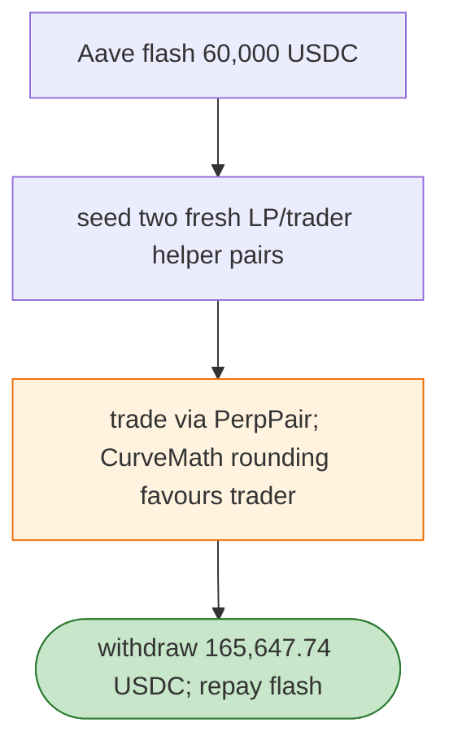

# PerpPair Exploit — CurveMath / Fresh-Pair Manipulation (Aave Flash)

> **Reproduction:** the PoC compiles & runs in an isolated Foundry project at
> [this project folder](.). Full verbose trace: [output.txt](output.txt).
> Verified vulnerable source: [PerpPair](sources/PerpPair_B68396),
> [CurveMath](sources/CurveMath_78197f), [Vault](sources/Vault_61cE9B).

---

## Key info

| | |
|---|---|
| **Loss** | 165,647.74 USDC; tx `0xcb0744a0…` |
| **Vulnerable contract** | PerpPair `0xb68396dd…` + CurveMath `0x78197fe9…` (Linea) |
| **Attacker** | `0x8d6778d7…` (contract `0xb8727548…`) |
| **Chain / block / date** | Linea / Apr 2026 |
| **Bug class** | CurveMath invariant/rounding — the attacker seeds two fresh LP/trader helper pairs with an Aave flash loan and exploits PerpPair's CurveMath rounding to extract more USDC than seeded. |

---

## TL;DR

Per the embedded analysis: the attacker used a 60,000 USDC Aave flash loan to seed two fresh LP/trader
helper pairs for PerpPair, then traded through PerpPair whose CurveMath rounding/invariant let the
position resolve to more than was seeded. The attacker withdraws 165,647.74 USDC and repays the flash.

---

## Root cause

A **rounding/invariant flaw in CurveMath** (the bonding-curve math PerpPair uses) that favours the
trader when the pair is freshly seeded with attacker-chosen reserves.

---

## Diagrams



---

## Remediation

1. Roundagainst the trader in CurveMath; invariant tests (out ≤ fee-corrected curve output).
2. Reject degenerate/fresh-pair states; minimum-reserve / warm-up checks.
3. Per-tx profit cap.

---

## How to reproduce

```bash
_shared/run_poc.sh 2026-04-PerpPair_exp -vvvvv
```

- RPC: Linea archive. Result: `[PASS]` — 165,647.74 USDC extracted.

---

*Reference: PerpPair CurveMath rounding exploit, Linea, Apr 2026 (165,647.74 USDC).*
