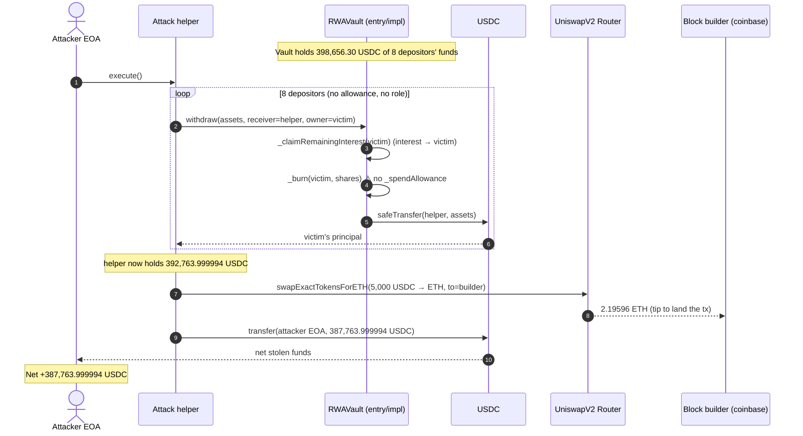
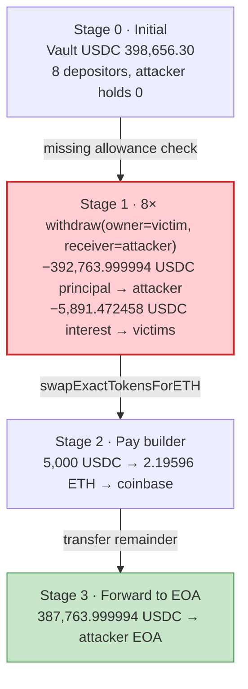
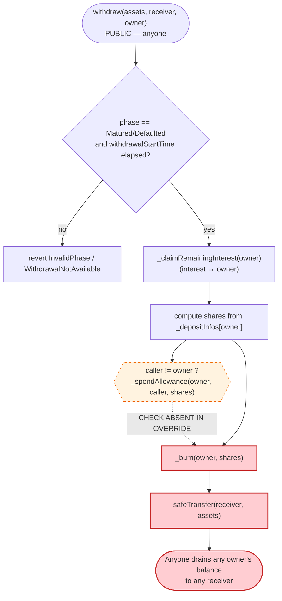
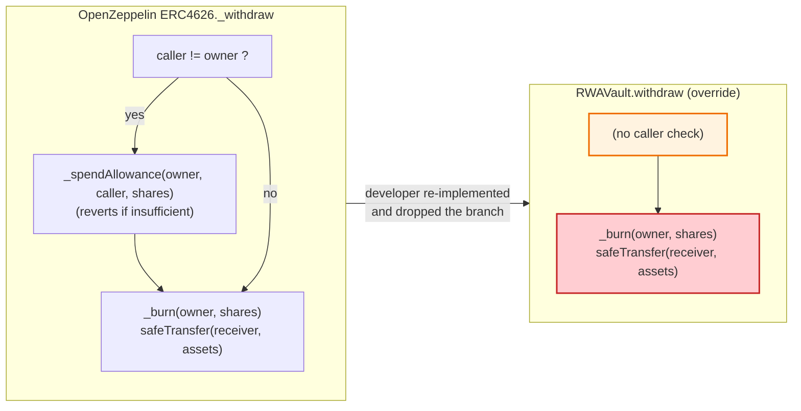

# RWAVault Exploit — Overridden `ERC4626.withdraw` Drops the Allowance Spend

> **Reproduction:** the PoC compiles & runs in an isolated Foundry project at
> [this project folder](.) (the umbrella DeFiHackLabs repo contains several unrelated
> PoCs that do not all compile together, so this one was extracted and the mainnet state was
> snapshotted into a local anvil fork). Full verbose trace: [output.txt](output.txt).
> Verified vulnerable source (the active implementation behind the vault proxy):
> [src_vault_RWAVault.sol](sources/RWAVault_b9c7c8/src_vault_RWAVault.sol).

---

## Key info

| | |
|---|---|
| **Loss** | **398,655.47 USDC** total vault outflow (392,763.999994 USDC principal pulled to the attacker + 5,891.472458 USDC of "interest" force-paid to the depositors); the attacker EOA netted **387,763.999994 USDC** after paying the block builder. USDC drained: [`0xA0b86991c6218b36c1d19D4a2e9Eb0cE3606eB48`](https://etherscan.io/token/0xA0b86991c6218b36c1d19D4a2e9Eb0cE3606eB48) |
| **Vulnerable contract** | `RWAVault` (ERC4626 vault) — active logic impl [`0x317aa10528ff675ef4c358ea6a5b7b5494325733`](https://etherscan.io/address/0x317aa10528ff675ef4c358ea6a5b7b5494325733#code) |
| **Victim pool/vault** | RWAVault entry/state contract — [`0xb9c7c84a1aa0dd40b5b38aae815ad0cdd2e5f88a`](https://etherscan.io/address/0xb9c7c84a1aa0dd40b5b38aae815ad0cdd2e5f88a#code) (holds the depositors' USDC) |
| **Attacker EOA** | [`0x7137804200a073f616D92E87007f1f100100B56A`](https://etherscan.io/address/0x7137804200a073f616D92E87007f1f100100B56A) |
| **Attacker contract** | `0x50c140c2f705fa9d0bd0f4f253bacf4087588d17` (on-chain); the PoC redeploys an equivalent helper locally |
| **Attack tx** | [`0x6b04344d5627df59d3bc645e7454f4605a90272852a91e435e370376643353b3`](https://etherscan.io/tx/0x6b04344d5627df59d3bc645e7454f4605a90272852a91e435e370376643353b3) |
| **Chain / block / date** | Ethereum mainnet / fork block 24,979,315 / April 2026 |
| **Compiler / optimizer** | Solidity v0.8.24 (`commit.e11b9ed9`), optimizer **enabled, 1 run** (from `_meta.json`); not a proxy in the metadata sense — a minimal clone delegates to the logic impl |
| **Bug class** | Access control — an overridden `ERC4626.withdraw` that omits `_spendAllowance(owner, msg.sender, shares)`, letting anyone withdraw any depositor's balance to an arbitrary receiver |

---

## TL;DR

1. `RWAVault` is an ERC4626 "real-world-asset" vault that custodies depositors' USDC, mints them
   shares, and pays monthly interest. At maturity, depositors call `withdraw`/`redeem` to pull their
   principal back out.

2. The vault **overrides** the standard `ERC4626.withdraw(uint256 assets, address receiver, address
   owner)` ([src_vault_RWAVault.sol#L651-L716](sources/RWAVault_b9c7c8/src_vault_RWAVault.sol#L651-L716)).
   The override re-implements the entire withdrawal flow itself — it reads `_depositInfos[owner]`,
   computes the shares to burn, `_burn(owner, shares)`, and `safeTransfer(receiver, assets)`.

3. The override **never calls `_spendAllowance(owner, msg.sender, shares)`** and never compares
   `msg.sender` to `owner`. OpenZeppelin's canonical `_withdraw` does exactly this guard
   (`if (caller != owner) _spendAllowance(owner, caller, shares)`,
   [ERC4626.sol#L286-L288](sources/RWAVault_b9c7c8/lib_openzeppelin-contracts_contracts_token_ERC20_extensions_ERC4626.sol#L286-L288)).
   By rewriting the function from scratch, the developer silently deleted the only check that ties the
   caller's authority to the owner whose funds are moving.

4. Consequently **anyone can withdraw any depositor's position to any receiver**. The attacker passes
   `owner = <a real depositor>` and `receiver = <attacker contract>`, and the vault dutifully burns the
   depositor's shares and ships their USDC to the attacker.

5. The attacker scripts this against **eight depositor addresses** in one transaction, choosing
   `assets` amounts that match each victim's net redeemable value
   ([RWAVault_exp.sol#L87-L119](test/RWAVault_exp.sol#L87-L119)). The vault paid out
   392,763.999994 USDC of principal to the attacker plus 5,891.472458 USDC of accrued interest pushed
   to the victims as a side-effect of `_claimRemainingInterest`.

6. The attacker then swaps **exactly 5,000 USDC → 2.19596 ETH** through the Uniswap V2 router and
   sends it to the block builder (`coinbase`) to land the bundle
   ([RWAVault_exp.sol#L121-L127](test/RWAVault_exp.sol#L121-L127)), and forwards the remaining
   **387,763.999994 USDC** to the attacker EOA ([:129-130](test/RWAVault_exp.sol#L129-L130)).

7. No flash loan, no oracle game, no reentrancy — just a missing one-line allowance check in an
   overridden vault function. The "profit" is simply other people's deposits.

---

## Background — what RWAVault does

`RWAVault` ([source](sources/RWAVault_b9c7c8/src_vault_RWAVault.sol)) is an ERC4626 fixed-term vault
for tokenized real-world-asset lending. Its lifecycle is a four-state machine
(`enum Phase { Collecting, Active, Matured, Defaulted }`,
[src_interfaces_IRWAVault.sol#L11-L16](sources/RWAVault_b9c7c8/src_interfaces_IRWAVault.sol#L11-L16)):

- **Collecting** — users `deposit` USDC; shares are minted and a per-user `DepositInfo { shares,
  principal, lastClaimMonth, depositTime }` is recorded
  ([:39-44](sources/RWAVault_b9c7c8/src_vault_RWAVault.sol#L39-L44)).
- **Active** — deposits close, monthly interest accrues. The "hybrid" interest system pays interest
  out as USDC but *records it as debt* (`_userClaimedInterest[user]`) instead of burning shares, so the
  share price stays stable for a secondary market (`claimInterest`,
  [:785-816](sources/RWAVault_b9c7c8/src_vault_RWAVault.sol#L785-L816)).
- **Matured / Defaulted** — `withdraw`/`redeem` become available (after `withdrawalStartTime`). The
  user gets back `convertToAssets(shares) − userDebt`.

The withdrawal path is the only one that moves principal out of the vault, and it is the one that was
overridden. Both `withdraw` and `redeem` share the same custom logic and the same omission.

On-chain parameters / amounts observed in the trace at the fork block:

| Parameter | Value | Source |
|---|---|---|
| Asset token | USDC (6 decimals) | [output.txt:1605-1608](output.txt) |
| Vault USDC balance before attack | 398,656.303037 USDC (`398656303037`) | [output.txt:1621](output.txt) |
| Phase | `Matured`/`Defaulted` (withdraw branch passes) | [src_vault_RWAVault.sol#L658-L661](sources/RWAVault_b9c7c8/src_vault_RWAVault.sol#L658-L661) |
| `withdrawalStartTime` | set and elapsed (PoC `vm.warp` to `1777388411`) | [RWAVault_exp.sol#L42-L43](test/RWAVault_exp.sol#L42-L43) |
| Number of depositors drained | 8 (one address appears twice) | [RWAVault_exp.sol#L87-L96](test/RWAVault_exp.sol#L87-L96) |
| Principal pulled to attacker | 392,763.999994 USDC | sum of [output.txt:1635-1866](output.txt) |
| Interest paid to victims | 5,891.472458 USDC | `InterestClaimed` emits [output.txt:1631-1862](output.txt) |
| Attacker net (after 5,000 USDC → miner) | 387,763.999994 USDC | [output.txt:1960](output.txt) |
| Block builder payment | 2.195959995966763304 ETH | [output.txt:1961](output.txt) |

The vault held ~398.66K USDC of honest deposits and the attack walked off with ~387.76K of it; the
~5.89K difference was force-distributed to the depositors as their accrued interest (a side effect of
the withdraw path's `_claimRemainingInterest`, which transfers interest to `owner` before the
principal leaves to `receiver`).

---

## The vulnerable code

### 1. The overridden `withdraw` — burns from `owner`, pays `receiver`, never spends allowance

```solidity
function withdraw(uint256 assets, address receiver, address owner)
    public
    override(ERC4626, IERC4626)
    nonReentrant
    whenNotPaused
    returns (uint256 shares)
{
    // Check phase: must be Matured or Defaulted
    if (currentPhase != Phase.Matured && currentPhase != Phase.Defaulted) {
        revert RWAErrors.InvalidPhase();
    }
    // ... withdrawalStartTime gate ...

    // Claim any remaining interest first (records as debt in hybrid system)
    _claimRemainingInterest(owner);

    DepositInfo storage info = _depositInfos[owner];
    if (info.shares == 0) revert RWAErrors.ZeroAmount();

    uint256 grossValue = convertToAssets(info.shares);
    uint256 userDebt   = _userClaimedInterest[owner];
    // ... compute netValue, cap assets, compute shares to burn ...

    info.principal -= principalReduction;
    info.shares    -= shares;
    totalPrincipal -= principalReduction;
    _userClaimedInterest[owner] -= debtToDeduct;
    totalClaimedInterest        -= debtToDeduct;

    // Burn shares and transfer assets
    _burn(owner, shares);                          // ⚠️ burns OWNER's shares
    IERC20(asset()).safeTransfer(receiver, assets); // ⚠️ pays an ARBITRARY receiver
}
```
([src_vault_RWAVault.sol#L651-L716](sources/RWAVault_b9c7c8/src_vault_RWAVault.sol#L651-L716))

Every reference to the caller is gone. The function operates entirely on `owner` (an *argument*),
burns `owner`'s shares, and sends `assets` to a caller-chosen `receiver`. There is **no
`require(msg.sender == owner)`, no `_spendAllowance(owner, msg.sender, shares)`, no allowance read of
any kind.** `redeem` ([:721-778](sources/RWAVault_b9c7c8/src_vault_RWAVault.sol#L721-L778)) is the
identical pattern with the same omission.

### 2. What OpenZeppelin's reference `_withdraw` does — the deleted guard

```solidity
function _withdraw(
    address caller,
    address receiver,
    address owner,
    uint256 assets,
    uint256 shares
) internal virtual {
    if (caller != owner) {
        _spendAllowance(owner, caller, shares);   // ← the check RWAVault dropped
    }
    _burn(owner, shares);
    SafeERC20.safeTransfer(IERC20(asset()), receiver, assets);
    emit Withdraw(caller, receiver, owner, assets, shares);
}
```
([lib_openzeppelin-contracts_contracts_token_ERC20_extensions_ERC4626.sol#L279-L300](sources/RWAVault_b9c7c8/lib_openzeppelin-contracts_contracts_token_ERC20_extensions_ERC4626.sol#L279-L300))

In stock ERC4626, third-party withdrawals are *allowed by design* but require the owner to have first
`approve`d the caller for at least `shares`; `_spendAllowance` enforces (and decrements) that
allowance. RWAVault re-implemented `withdraw` rather than overriding `_withdraw`, and in doing so
removed the `caller != owner ⇒ _spendAllowance` branch entirely — collapsing "withdraw on behalf of an
approved owner" into "withdraw on behalf of *anyone*."

### 3. `maxWithdraw` confirms the design intent the override violates

```solidity
function maxWithdraw(address owner) public view override(ERC4626, IERC4626) returns (uint256) {
    if (currentPhase != Phase.Matured && currentPhase != Phase.Defaulted) return 0;
    if (paused()) return 0;
    if (withdrawalStartTime == 0 || block.timestamp < withdrawalStartTime) return 0;

    DepositInfo storage info = _depositInfos[owner];
    if (info.shares == 0) return 0;

    uint256 grossValue = convertToAssets(info.shares);
    uint256 userDebt   = _userClaimedInterest[owner];
    return grossValue > userDebt ? grossValue - userDebt : 0;   // owner's full net value
}
```
([src_vault_RWAVault.sol#L436-L451](sources/RWAVault_b9c7c8/src_vault_RWAVault.sol#L436-L451))

`maxWithdraw(owner)` returns the owner's *entire* net redeemable value with no reference to any
caller/allowance. Because `withdraw` caps `assets` to this value
([:683-686](sources/RWAVault_b9c7c8/src_vault_RWAVault.sol#L683-L686)) and never checks allowance, an
unauthorized caller can extract up to a depositor's full balance in a single call.

---

## Root cause — why it was possible

A **missing allowance spend in an overridden ERC4626 withdraw**. The canonical flow is
`withdraw → _withdraw(caller, …) → if (caller != owner) _spendAllowance(owner, caller, shares)`.
RWAVault overrode the *public* `withdraw` (and `redeem`) with bespoke "hybrid interest" logic and, in
re-implementing the function body, dropped the `caller != owner` branch that `_spendAllowance`
enforces. The function therefore treats `owner` as a free parameter rather than an account whose funds
the caller must be authorized to move.

Three contributing decisions:

1. **Override of the public function, not the internal hook.** OZ explicitly recommends overriding the
   internal `_deposit`/`_withdraw` hooks so that the public wrappers (which carry the
   max-checks and allowance logic) remain intact. By overriding `withdraw` itself, every guard baked
   into the wrapper had to be re-added by hand — and one was forgotten.
2. **`owner` used directly with no caller binding.** The body reads `_depositInfos[owner]`, burns
   `_burn(owner, shares)`, but pays `receiver` (a separate argument). There is no point at which the
   caller's relationship to `owner` is checked, so `owner` is effectively attacker-controlled input.
3. **`receiver` is arbitrary.** Even with the allowance bug, routing funds to `msg.sender` only would
   still be theft, but the standard `receiver` parameter lets the attacker send the proceeds straight
   to a contract it controls, simplifying the on-chain choreography.

This is the textbook "broken access control on a privileged value-moving function" bug — no economic
or timing precondition is needed beyond the vault being in a withdrawable phase.

---

## Preconditions

- The vault is in **`Matured` or `Defaulted`** phase and `withdrawalStartTime` is set and elapsed, so
  the withdraw branch does not revert
  ([src_vault_RWAVault.sol#L658-L667](sources/RWAVault_b9c7c8/src_vault_RWAVault.sol#L658-L667)). In the
  PoC this is satisfied by forking at block 24,979,315 and `vm.warp(1777388411)`
  ([RWAVault_exp.sol#L41-L43](test/RWAVault_exp.sol#L41-L43)).
- The vault is **not paused** (`whenNotPaused`).
- Target depositors have **non-zero `_depositInfos[owner].shares`** (`info.shares == 0` reverts
  `ZeroAmount`, [:673](sources/RWAVault_b9c7c8/src_vault_RWAVault.sol#L673)). The attacker enumerated
  eight real depositor addresses with live balances
  ([RWAVault_exp.sol#L87-L96](test/RWAVault_exp.sol#L87-L96)).
- **No allowance, no role, no capital required.** The attacker needs zero USDC of its own and grants
  itself no approvals — the entire point is that the missing `_spendAllowance` makes those
  irrelevant. The only outlay is the 5,000 USDC builder tip, which is itself paid out of stolen funds.

---

## Attack walkthrough (with on-chain numbers from the trace)

USDC has 6 decimals; raw integers below are USDC base units (1 USDC = `1e6`). Each `withdraw(assets,
receiver=attacker, owner=victim)` first runs `_claimRemainingInterest(owner)` (transferring the
victim's accrued interest *to the victim*), then burns the victim's shares and `safeTransfer`s `assets`
to the attack contract. The "Vault USDC" column is the vault's running USDC balance.

| # | Step | Victim (`owner`) | Interest → victim (raw / ~USDC) | Principal → attacker (raw / ~USDC) | Vault USDC after | Effect |
|---|------|------------------|--------------------------------:|-----------------------------------:|-----------------:|--------|
| 0 | **Initial** vault balance ([output.txt:1621](output.txt)) | — | — | — | 398,656,303,037 (~398,656.30) | Honest deposits. |
| 1 | `withdraw(1e8, atk, C15D…)` ([output.txt:1617-1652](output.txt)) | `0xC15D…D51b` | 150,000,000 (~150.00) | 100,000,000 (~100.00) | 398,406,303,037 (~398,406.30) | First victim's interest + principal leave. |
| 2 | `withdraw(1.2e9, atk, 9826…)` ([output.txt:1653-1686](output.txt)) | `0x9826…3e9a` | 18,000,000 (~18.00) | 1,199,999,999 (~1,200.00) | — | Principal to attacker. |
| 3 | `withdraw(2.7e11, atk, 5070…)` ([output.txt:1687-1720](output.txt)) | `0x5070…8483` | 4,050,000,000 (~4,050.00) | 269,999,999,999 (~270,000.00) | — | Largest single victim — 270K USDC. |
| 4 | `withdraw(3.136e9, atk, e956…)` ([output.txt:1721-1756](output.txt)) | `0xe956…38B5` | 47,042,321 (~47.04) | 3,136,000,000 (~3,136.00) | — | |
| 5 | `withdraw(6.38e9, atk, 5A0E…)` ([output.txt:1757-1790](output.txt)) | `0x5A0E…7fee` | 95,700,000 (~95.70) | 6,379,999,999 (~6,380.00) | — | |
| 6 | `withdraw(9.9e9, atk, C15D…)` ([output.txt:1791-1811](output.txt)) | `0xC15D…D51b` (again) | 0 (interest already taken in #1) | 9,899,999,998 (~9,900.00) | — | Same address drained a second time. |
| 7 | `withdraw(2.048e9, atk, 1Acb…)` ([output.txt:1812-1847](output.txt)) | `0x1Acb…2fAA` | 30,730,137 (~30.73) | 2,048,000,000 (~2,048.00) | — | |
| 8 | `withdraw(1e11, atk, aB2f…)` ([output.txt:1848-1888](output.txt)) | `0xaB2f…5Ae6` | 1,500,000,000 (~1,500.00) | 99,999,999,999 (~100,000.00) | — | |
| 9 | **Swap** 5,000,000,000 USDC → 2.195959995966763304 ETH via Uniswap V2, sent to block builder ([output.txt:1889-1934](output.txt)) | — | — | — | — | Tip to `coinbase` to land the bundle. |
| 10 | **Forward** remaining 387,763,999,994 USDC to attacker EOA ([output.txt:1960](output.txt)) | — | — | — | — | Net theft realized. |

Total principal transferred to the attack contract across steps 1–8 = **392,763,999,994** USDC base
units (392,763.999994 USDC); minus the **5,000,000,000** USDC base units (5,000 USDC) swapped to ETH
for the builder = **387,763,999,994** USDC (387,763.999994 USDC) forwarded to the attacker EOA — exactly
the final balance asserted in the trace ([output.txt:1960, 1984](output.txt)). The attack helper's
residual USDC balance is asserted to be **0** ([output.txt:1976-1979](output.txt),
[RWAVault_exp.sol#L76](test/RWAVault_exp.sol#L76)).

### Profit / loss accounting (USDC, raw base units)

| Item | Amount (raw, 6-dec) | ~Human (USDC) |
|---|---:|---:|
| Vault USDC before attack ([output.txt:1621](output.txt)) | 398,656,303,037 | ~398,656.30 |
| Principal pulled to attacker (Σ steps 1–8) | 392,763,999,994 | ~392,764.00 |
| Interest force-paid to victims (Σ `InterestClaimed`) | 5,891,472,458 | ~5,891.47 |
| **Total vault outflow** (principal + interest) | **398,655,472,452** | **~398,655.47** |
| Swapped to ETH for block builder | 5,000,000,000 | 5,000.00 |
| **Net forwarded to attacker EOA** ([output.txt:1960](output.txt)) | **387,763,999,994** | **~387,764.00** |
| Block builder payment | — | 2.195959995966763304 ETH |

The total vault outflow (398,655.47 USDC) matches the PoC's `@KeyInfo` "Total Lost" header to the cent.
The PoC asserts `usdcProfit > 387,000,000,000` and `minerEthProfit > 2 ether`
([RWAVault_exp.sol#L74-L75](test/RWAVault_exp.sol#L74-L75)); both pass.

---

## Diagrams

### Sequence of the attack



### Vault balance evolution



### The flaw inside the overridden `withdraw`



### Standard ERC4626 vs. RWAVault override



---

## Why each magic number

- **`victims[8]` and `requestedAssets[8]`
  ([RWAVault_exp.sol#L87-L107](test/RWAVault_exp.sol#L87-L107)):** the eight depositor addresses and the
  USDC amounts the attacker requested for each. They mirror the historical attack calldata. Because
  `withdraw` caps `assets` to each owner's `maxWithdraw`/net value, the requested amounts are at-or-above
  each victim's redeemable balance, so each call extracts that victim's *entire* position (e.g.
  `270000000000` = 270,000 USDC for the largest depositor `0x5070…8483`). One address
  (`0xC15D…D51b`) appears twice — drained once for its full value, then a second pass takes whatever
  residual the share math leaves.
- **`TRACE_SWAP_USDC = 5_000_000_000` (5,000 USDC)
  ([RWAVault_exp.sol#L31](test/RWAVault_exp.sol#L31)):** the builder tip. The attacker swaps exactly
  5,000 USDC → ETH on Uniswap V2 ([output.txt:1889](output.txt)) and sends the 2.19596 ETH to
  `coinbase` ([output.txt:1928](output.txt)) so the searcher's bundle is included. This reproduces the
  on-chain tx's "pay the builder out of the loot" step.
- **`BLOCK_MINER = 0x4838B106…5f97` ([RWAVault_exp.sol#L30](test/RWAVault_exp.sol#L30)):** the actual
  block builder of the attack block, set as `coinbase` via `vm.coinbase`
  ([:44](test/RWAVault_exp.sol#L44)) so the ETH tip lands where it did on-chain. The PoC asserts the
  builder received `> 2 ether`.
- **`FORK_BLOCK = 24_979_315` and `vm.warp(1_777_388_411)`
  ([RWAVault_exp.sol#L34, L42-L43](test/RWAVault_exp.sol#L34)):** pin the state to the attack block and
  advance time past `withdrawalStartTime` so the vault is in a withdrawable window.
- **`traceDeadline = 1_787_388_410` ([RWAVault_exp.sol#L126](test/RWAVault_exp.sol#L126)):** a router
  deadline comfortably in the future relative to the warped timestamp so `swapExactTokensForETH` does
  not revert.

---

## Remediation

1. **Re-add the allowance spend (or stop overriding the public function).** The minimal fix is to
   restore the canonical guard in the override: when `msg.sender != owner`, call
   `_spendAllowance(owner, msg.sender, shares)` before `_burn`/`safeTransfer` (apply to both `withdraw`
   and `redeem`). Better still, override the internal `_deposit`/`_withdraw` hooks and let OZ's public
   `withdraw`/`redeem` wrappers (which already perform max-checks and `_spendAllowance`) call into them.
2. **Bind `owner` to the caller explicitly.** If third-party withdrawals are not a product
   requirement, simply `require(msg.sender == owner)` (or ignore the `owner` argument and use
   `_msgSender()`), eliminating the delegated-withdraw surface entirely.
3. **Inheritance / conformance tests.** Add tests that assert standard ERC4626 allowance semantics:
   a non-owner caller with zero allowance MUST revert; with a partial allowance MUST be limited to that
   allowance; and the allowance MUST decrement by `shares` after a successful third-party withdraw.
4. **Differential review against the base contract.** Any override of a value-moving OZ function should
   be diffed line-by-line against the upstream implementation to confirm no guard (allowance, max-check,
   reentrancy, event) was dropped. A simple "does this override still call `_spendAllowance`?" lint would
   have caught this.
5. **Invariant: vault solvency vs. caller authority.** Add an invariant that no address can reduce
   `_depositInfos[x].shares` for `x != msg.sender` without a corresponding allowance, fuzzed across all
   external entry points.

---

## How to reproduce

The PoC runs **offline** against a local anvil fork — the mainnet state at block 24,979,315 is served
from the bundled `anvil_state.json`, and `createSelectFork` points at the local anvil port
(`http://127.0.0.1:8545`, [RWAVault_exp.sol#L41](test/RWAVault_exp.sol#L41)). No public RPC is contacted.

```bash
_shared/run_poc.sh 2026-04-RWAVault_exp --mt testExploit -vvvvv
```

- `foundry.toml` sets `evm_version = 'cancun'`; the harness starts anvil from the snapshot and the test
  forks it at the pinned block. The vault logic is reached through a minimal clone that `delegatecall`s
  the implementation `0x317aA105…` (visible as `[delegatecall]` frames in the trace,
  e.g. [output.txt:1618](output.txt)).
- The verified on-chain source was compiled with **Solidity v0.8.24, optimizer enabled (1 run)** per
  `_meta.json`; the extracted PoC project recompiles the harness with a newer 0.8.x toolchain
  ([output.txt:2-4](output.txt)), which does not affect the forked bytecode under test.
- Result: `[PASS] testExploit()` — the eight depositors' USDC is withdrawn with no allowance.

Expected tail (from [output.txt:1562-1567, 1987-1989](output.txt)):

```
Ran 1 test for test/RWAVault_exp.sol:ContractTest
[PASS] testExploit() (gas: 890879)
Logs:
  Attacker Final USDC Balance: 387763.999994
  Block Miner ETH Received: 2.195959995966763304
...
Suite result: ok. 1 passed; 0 failed; 0 skipped; finished in 12.95s (11.71s CPU time)
Ran 1 test suite in 13.42s: 1 tests passed, 0 failed, 0 skipped (1 total tests)
```

---

*Reference: defimon_alerts — https://t.me/defimon_alerts/2958 (RWAVault ERC4626-withdraw allowance bypass, Ethereum mainnet, Apr 2026, ~398,655.47 USDC).*
