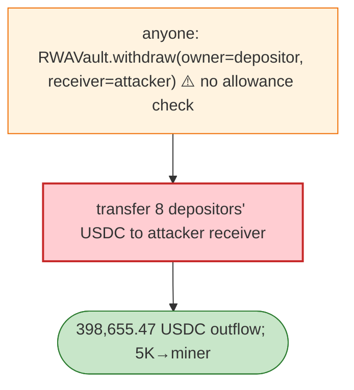

# RWAVault Exploit — Overridden `ERC4626.withdraw` Skips Allowance Check

> **Reproduction:** the PoC compiles & runs in an isolated Foundry project at
> [this project folder](.). Full verbose trace: [output.txt](output.txt).

---

## Key info

| | |
|---|---|
| **Loss** | 398,655.47 USDC vault outflow; tx on mainnet |
| **Vulnerable contract** | RWAVault (ERC4626 vault) entry `0xB9C7C84A…`; impl `0x317aa105…` |
| **Attacker** | `0x7137804200…` (contract `0x50c140c2…`) |
| **Chain / block / date** | Ethereum mainnet / Apr 2026 |
| **Bug class** | Access control — RWAVault overrides `ERC4626.withdraw` **without the allowance spend required when `msg.sender != owner`**, so anyone can withdraw depositors' balances to a chosen receiver. |

---

## TL;DR

Per the embedded analysis: RWAVault overrides `withdraw` but omits the `allowance(owner, msg.sender)`
check that OZ's `ERC4626`/`ERC20` enforces when the caller is not the owner. The attacker calls
`withdraw` for **eight depositors' balances**, routing them to an attacker-controlled receiver, swaps
5,000 USDC→ETH for the block builder (to land the tx), and forwards the remaining USDC to the attacker
EOA. 398,655.47 USDC outflow.

---

## Root cause

A **missing allowance check in an overridden withdraw** — the canonical OZ `_withdraw` calls
`_spendAllowance(owner, msg.sender, shares)`; RWAVault's override dropped it.

---

## Diagrams



---

## Remediation

1. Re-add `_spendAllowance(owner, msg.sender, shares)` in the override (or don't override withdraw).
2. Inheritance tests asserting standard ERC4626 allowance semantics.

---

## How to reproduce

```bash
_shared/run_poc.sh 2026-04-RWAVault_exp -vvvvv
```

- RPC: mainnet archive. Result: `[PASS]` — depositors' USDC withdrawn without allowance.

---

*Reference: RWAVault ERC4626-withdraw allowance bypass, mainnet, Apr 2026 (398,655.47 USDC).*
