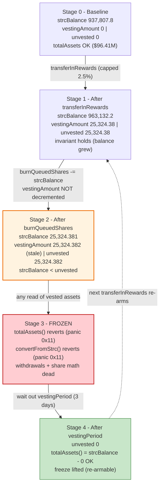
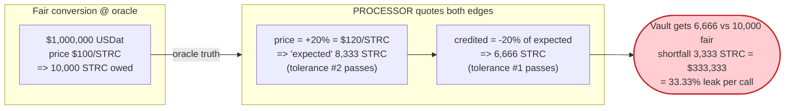

# Saturn Protocol (sUSDat) — Withdrawal Freeze via `strcBalance`/`vestingAmount` Desync + 33% PROCESSOR Extraction

> **Disclosure, not a historical exploit.** Saturn Protocol's `StakedUSDat` (sUSDat) ERC-4626 vault
> was reported as *unpatched* on 2026-04-14 by Innora Security Research. There is no on-chain attack
> transaction; this writeup reproduces both reported vulnerabilities against **live Ethereum-mainnet
> state** (forked at block `25,322,900`).
>
> **Reproduction:** the PoC compiles & runs in an isolated Foundry project at
> [this project folder](.). Full verbose trace: [output.txt](output.txt).
> Verified vulnerable source: [src_StakedUSDat.sol](sources/StakedUSDat_2005e0/src_StakedUSDat.sol),
> oracle wrapper: [src_StrcPriceOracle.sol](sources/StrcPriceOracle_5f7eCD/src_StrcPriceOracle.sol).

---

## Key info

| | |
|---|---|
| **Funds at risk** | ~$35.7M TVL (DeFiLlama, 2026-04-14); `totalAssets() ≈ $96.4M` at fork block. **SAT-001** freezes 100% of withdrawals/conversions for up to `vestingPeriod`; **SAT-002** lets the PROCESSOR siphon up to **33.33% per `convertFromUsdat` call**. |
| **Vulnerable contract** | `StakedUSDat` (impl) — [`0x2005e0ca201a37694125ff267ae57872bea0a0ce`](https://etherscan.io/address/0x2005e0ca201a37694125ff267ae57872bea0a0ce#code) |
| **Proxy (sUSDat)** | [`0xD166337499E176bbC38a1FBd113Ab144e5bd2Df7`](https://etherscan.io/address/0xD166337499E176bbC38a1FBd113Ab144e5bd2Df7) (ERC1967) |
| **Price oracle wrapper** | `StrcPriceOracle` — [`0x5f7eCD0D045c393da6cb6c933c671AC305A871BF`](https://etherscan.io/address/0x5f7eCD0D045c393da6cb6c933c671AC305A871BF#code) |
| **Underlying asset (USDat)** | [`0x23238f20b894f29041f48D88eE91131C395Aaa71`](https://etherscan.io/address/0x23238f20b894f29041f48D88eE91131C395Aaa71) (6 decimals) |
| **Withdrawal queue** | [`0x4Bc9FEC04F0F95e9b42a3EF18F3C96fB57923D2e`](https://etherscan.io/address/0x4Bc9FEC04F0F95e9b42a3EF18F3C96fB57923D2e) |
| **Privileged role (PROCESSOR)** | `0x09D6E34cE24D54890fF0BC6a090b5f880F8C729f` |
| **Attack tx** | None — vulnerability disclosure (unpatched). No malicious tx exists. |
| **Chain / block / date** | Ethereum mainnet / fork block 25,322,900 (≈ 2026-06-15) / disclosed 2026-04-14 |
| **Compiler** | Solidity v0.8.30, optimizer 200 runs (per verified `_meta.json`) |
| **Bug class** | SAT-001: state-desync → arithmetic underflow DoS; SAT-002: independent dual-tolerance compounding (value leak to a semi-trusted role) |

---

## TL;DR

`StakedUSDat` tracks two pieces of accounting that **must stay coupled** but are updated by different
functions:

- `strcBalance` — the vault's internal count of STRC (the yield-bearing reserve asset).
- `vestingAmount` / `getUnvestedAmount()` — how much of a recently-distributed reward has not yet
  linearly vested.

The vault assumes the invariant **`strcBalance ≥ getUnvestedAmount()`** everywhere it computes the
"vested" portion:

```solidity
uint256 vestedBalance = strcBalance - getUnvestedAmount();   // _strcTotalAssets() L245 and convertFromStrc() L362
```

**SAT-001 — Withdrawal Freeze.** `burnQueuedShares()`
([:559-563](sources/StakedUSDat_2005e0/src_StakedUSDat.sol#L559-L563)) decrements `strcBalance` when
the withdrawal queue settles redemptions, but it **never touches `vestingAmount`**. So the routine
sequence *(1) distribute rewards → (2) the queue settles a redemption batch* can leave
`strcBalance < getUnvestedAmount()`. The very next call to `totalAssets()`, `convertFromStrc()`, or
any function reading vested assets does `strcBalance - getUnvestedAmount()` and **reverts with
Solidity-0.8 panic `0x11` (arithmetic underflow)**. Because `totalAssets()` underflows, the entire
ERC-4626 view layer and all conversions are frozen until the reward fully vests
(`vestingPeriod`, currently **3 days** on-chain) — and re-distributing rewards re-arms the freeze
indefinitely. No admin escape hatch exists. **No attacker is required — these are normal operations.**

**SAT-002 — 33.33% PROCESSOR extraction.** `_validateConversion()`
([:328-335](sources/StakedUSDat_2005e0/src_StakedUSDat.sol#L328-L335)) applies the *same*
`toleranceBps` (live value **2000 = 20%**) **independently** to two checks: the execution-price match
*and* the amount match. A PROCESSOR can pick the price 20% above oracle **and** the credited STRC 20%
below the implied amount; the deviations compound to `1 − (0.8 / 1.2) = 33.33%` of value extracted per
`convertFromUsdat` call, fully inside the "validated" envelope.

---

## Background — what Saturn / sUSDat does

`StakedUSDat` ([source](sources/StakedUSDat_2005e0/src_StakedUSDat.sol)) is an upgradeable, 18-decimal
**ERC-4626 vault**. Users deposit **USDat** (a 6-decimal stablecoin) and receive `sUSDat` shares.
The protocol does not hold idle USDat as the only backing — instead a **PROCESSOR** role rotates the
vault's reserves between USDat and an off-/cross-chain yield instrument called **STRC** (6 decimals,
priced by a Chainlink-style oracle wrapper):

- `convertFromUsdat(usdatAmount, strcAmount, strcPurchasePrice)` — PROCESSOR ships USDat out and
  credits STRC in ([:338-353](sources/StakedUSDat_2005e0/src_StakedUSDat.sol#L338-L353)).
- `convertFromStrc(strcAmount, usdatAmount, strcSalePrice)` — PROCESSOR returns USDat and burns STRC
  off the books ([:356-373](sources/StakedUSDat_2005e0/src_StakedUSDat.sol#L356-L373)).
- `transferInRewards(strcAmount)` — PROCESSOR books STRC yield, which **linearly vests** over
  `vestingPeriod` to smooth the share price ([:376-392](sources/StakedUSDat_2005e0/src_StakedUSDat.sol#L376-L392)).

Withdrawals are **two-step**: `requestRedeem()` escrows the user's shares in a separate
`WithdrawalQueue` ERC-721, and later the queue calls `burnQueuedShares(shares, strcAmount)` on the
vault to settle. `withdraw()`/`redeem()` are disabled
([:507-515](sources/StakedUSDat_2005e0/src_StakedUSDat.sol#L507-L515)).

`totalAssets()` is the vault's USD valuation and the denominator of every share/asset conversion:

```solidity
function totalAssets() public view returns (uint256) {
    return usdatBalance + _strcTotalAssets();         // L226-228
}
```

On-chain parameters read live (`cast`, fork block 25,322,900):

| Parameter | Value | Source |
|---|---|---|
| `strcBalance` | `937,807,798,606` (≈ 937,807.8 STRC, 6dp) | trace |
| `usdatBalance` + STRC value → `totalAssets()` | `96,412,235,600,067` (≈ **$96.41M**, 6dp) | trace |
| `vestingPeriod` | `259,200 s` = **3 days** | live `cast` |
| `toleranceBps` | **`2000`** (20%) | live `cast` |
| `maxRewardsBps` | `250` (2.5% of `totalAssets`) | live `cast` |
| STRC/USD oracle price | `9,518,500,000` = **$95.185** (8dp) | trace |
| Oracle staleness window | `26 hours` | [oracle L38](sources/StrcPriceOracle_5f7eCD/src_StrcPriceOracle.sol#L38) |

---

## The vulnerable code

### SAT-001 — the coupled invariant and the function that breaks it

The "vested balance" is computed by subtracting unvested rewards from `strcBalance` in **two** places:

```solidity
// _strcTotalAssets()  — feeds totalAssets()
function _strcTotalAssets() internal view returns (uint256) {
    (uint256 strcPrice, uint8 priceDecimals) = STRC_ORACLE.getPrice();
    uint256 vestedBalance = strcBalance - getUnvestedAmount();          // ⚠️ L245 — underflows if strcBalance < unvested
    return Math.mulDiv(vestedBalance, strcPrice, 10 ** priceDecimals, Math.Rounding.Floor);
}
```
[src_StakedUSDat.sol:242-248](sources/StakedUSDat_2005e0/src_StakedUSDat.sol#L242-L248)

```solidity
function convertFromStrc(uint256 strcAmount, uint256 usdatAmount, uint256 strcSalePrice) external whenNotPaused onlyRole(PROCESSOR_ROLE) {
    uint256 unvestedAmount = getUnvestedAmount();
    uint256 vestedBalance  = strcBalance - unvestedAmount;             // ⚠️ L362 — same underflow
    require(strcAmount <= vestedBalance, InsufficientBalance());
    ...
}
```
[src_StakedUSDat.sol:356-373](sources/StakedUSDat_2005e0/src_StakedUSDat.sol#L356-L373)

`getUnvestedAmount()` returns the un-vested remainder of the **last** reward, computed *only* from
`vestingAmount` and the elapsed time — it does **not** look at `strcBalance`:

```solidity
function getUnvestedAmount() public view returns (uint256) {
    uint256 timeSinceLastDistribution = block.timestamp - lastDistributionTimestamp;
    if (timeSinceLastDistribution >= vestingPeriod) return 0;
    return Math.mulDiv(vestingPeriod - timeSinceLastDistribution, vestingAmount, vestingPeriod, Math.Rounding.Ceil);
}
```
[src_StakedUSDat.sol:231-239](sources/StakedUSDat_2005e0/src_StakedUSDat.sol#L231-L239)

The function that silently breaks the invariant — note it adjusts `strcBalance` but **leaves
`vestingAmount` untouched**:

```solidity
function burnQueuedShares(uint256 shares, uint256 strcAmount) external {
    require(msg.sender == address(WITHDRAWAL_QUEUE), OperationNotAllowed());
    strcBalance -= strcAmount;        // ⚠️ reduces strcBalance, but vestingAmount stays the same
    _burn(address(WITHDRAWAL_QUEUE), shares);
}
```
[src_StakedUSDat.sol:559-563](sources/StakedUSDat_2005e0/src_StakedUSDat.sol#L559-L563)

`transferInRewards()` is what arms vesting (`vestingAmount = strcAmount`, capped at 2.5% of TVL):

```solidity
function transferInRewards(uint256 strcAmount) external nonReentrant onlyRole(PROCESSOR_ROLE) notZero(strcAmount) {
    require(getUnvestedAmount() == 0, StillVesting());
    uint256 maxRewards = Math.mulDiv(totalAssets(), maxRewardsBps, BPS_DENOMINATOR);
    (uint256 strcPrice, uint8 priceDecimals) = STRC_ORACLE.getPrice();
    uint256 strcAmountUsd = Math.mulDiv(strcAmount, strcPrice, 10 ** priceDecimals);
    require(strcAmountUsd <= maxRewards, RewardsExceedMax());
    strcBalance   += strcAmount;
    vestingAmount  = strcAmount;          // ← unvested now non-zero for `vestingPeriod`
    lastDistributionTimestamp = block.timestamp;
    emit RewardsReceived(strcAmount, strcAmount);
}
```
[src_StakedUSDat.sol:376-392](sources/StakedUSDat_2005e0/src_StakedUSDat.sol#L376-L392)

### SAT-002 — dual independent tolerance

```solidity
function _isWithinTolerance(uint256 value, uint256 expected) internal view returns (bool) {
    uint256 minExpected = Math.mulDiv(expected, BPS_DENOMINATOR - toleranceBps, BPS_DENOMINATOR);  // 0.80×
    uint256 maxExpected = Math.mulDiv(expected, BPS_DENOMINATOR + toleranceBps, BPS_DENOMINATOR);  // 1.20×
    return value >= minExpected && value <= maxExpected;
}

function _validateConversion(uint256 usdatAmount, uint256 strcAmount, uint256 strcPurchasePrice) internal view {
    (uint256 oraclePrice, uint8 priceDecimals) = STRC_ORACLE.getPrice();
    uint256 expectedStrc = Math.mulDiv(usdatAmount, 10 ** priceDecimals, strcPurchasePrice);
    require(_isWithinTolerance(strcAmount, expectedStrc), ExecutionPriceMismatch());   // ← tolerance #1 (amount)
    require(_isWithinTolerance(strcPurchasePrice, oraclePrice), OraclePriceMismatch()); // ← tolerance #2 (price)
}
```
[src_StakedUSDat.sol:320-335](sources/StakedUSDat_2005e0/src_StakedUSDat.sol#L320-L335)

Both checks pass when each input independently sits at its tolerance edge. The PROCESSOR can therefore
quote `strcPurchasePrice = 1.20 × oracle` (max-allowed price) **and** credit only `0.80 × expectedStrc`
(min-allowed amount), so the vault receives `0.80 / 1.20 = 0.6667×` of fair STRC — a **33.33% haircut**.

---

## Root cause — why it was possible

**SAT-001** is a classic **paired-write desync**. Three functions touch the same accounting state, but
only some keep it consistent:

| Function | `strcBalance` | `vestingAmount` | Invariant after |
|---|---|---|---|
| `transferInRewards()` | `+= reward` | `= reward` | balance grows with vesting → OK |
| `convertFromStrc()` | `-= strcAmount` | unchanged | guarded by `strcAmount ≤ vestedBalance` → OK |
| **`burnQueuedShares()`** | **`-= strcAmount`** | **unchanged** | **no guard** → can push `strcBalance < unvested` |

`burnQueuedShares()` is the only `strcBalance`-reducer with **no check that the post-decrement balance
still covers the unvested reward**. Because the unvested figure is anchored solely to `vestingAmount`
and the clock — not to the *current* `strcBalance` — once the queue burns past the vested portion the
subtraction underflows. Solidity 0.8 turns that into a hard `panic 0x11` revert, which propagates to:

- `totalAssets()` → **all share-price math and the ERC-4626 view surface revert**.
- `convertFromStrc()` → the PROCESSOR can no longer top the vault back up with USDat.
- any downstream that reads vested assets.

The freeze is **self-healing** only by waiting out `vestingPeriod` (then `getUnvestedAmount()==0`,
subtraction is `strcBalance - 0`, no underflow). But any new `transferInRewards()` re-arms it, so an
operator running on a routine reward cadence can keep the vault frozen indefinitely — a permanent DoS
with no admin override.

**SAT-002** is a **compounding-tolerance** flaw: a single tolerance band is reused for two
*independent* dimensions (price and amount) whose errors multiply rather than being bounded jointly.
The intended ±20% guard silently becomes a one-sided 33.33% leak toward the PROCESSOR.

---

## Preconditions

### SAT-001 (withdrawal freeze)
- A reward is in-flight: `transferInRewards()` has set `vestingAmount > 0` and we are still inside
  `vestingPeriod` (so `getUnvestedAmount() > 0`).
- The withdrawal queue settles enough redemptions that `burnQueuedShares()` drives `strcBalance` below
  the current `getUnvestedAmount()`. This is *normal* operation when a large batch of users redeems
  shortly after a reward — no malicious actor, no special privilege beyond the queue's own callback.
- Both roles (`PROCESSOR` for `transferInRewards`, the `WithdrawalQueue` for `burnQueuedShares`) are
  protocol-operated; the freeze arises from ordinary, in-spec calls.

### SAT-002 (extraction)
- Caller holds `PROCESSOR_ROLE` (`0x09D6…729f`). This is a **semi-trusted** operational role, not the
  governance admin; the extraction needs no admin action and no parameter change.
- `toleranceBps` is at its live value of `2000` (20%). Extraction scales as
  `1 − (1 − t)/(1 + t)`; at the protocol's `MAX_TOLERANCE_BPS = 10000` it would reach 100%.

---

## Attack / failure walkthrough (live mainnet fork, block 25,322,900)

All figures below are taken directly from [output.txt](output.txt). The PoC first time-travels past
the live vesting cycle to reach the documented "no active vesting" baseline (`getUnvestedAmount()==0`),
keeping the Chainlink feed fresh via `vm.mockCall` so the oracle's 26h staleness guard does not trip
(the price `$95.185` is unchanged — this does not alter the bug math).

### SAT-001 sequence

| # | Step | `strcBalance` | `vestingAmount` | `getUnvestedAmount()` | Effect |
|---|------|---:|---:|---:|--------|
| 0 | **Baseline** (post-warp, no vesting) | 937,807,798,606 | 0 | 0 | `totalAssets()` = $96.41M, healthy |
| 1 | **`transferInRewards(25,324,381,242)`** (max allowed: 2.5%×TVL ÷ price ≈ 25,324.4 STRC) | 963,132,179,848 | 25,324,381,242 | 25,324,381,242 | reward booked, vesting armed for 3 days |
| 2 | **`burnQueuedShares(0, 937,807,798,607)`** — queue settles a large redemption batch | **25,324,381,241** | 25,324,381,242 (**unchanged — the bug**) | 25,324,381,242 | `strcBalance` (25,324,381,241) **< unvested** (25,324,381,242) → invariant broken |
| 3a | **`totalAssets()`** | — | — | — | `strcBalance - unvested` → **revert `panic 0x11`** |
| 3b | **`convertFromStrc(1, 1, 95.185e8)`** | — | — | — | same subtraction at L362 → **revert `panic 0x11`** |
| 4 | **warp `+ vestingPeriod + 1`** | 25,324,381,241 | 25,324,381,242 | **0** | `getUnvestedAmount()==0` → `totalAssets()` works again; freeze self-heals |

Trace excerpts:

```
[Step 2] burnQueuedShares(0, BURN), BURN = 937807798607
  strcBalance after : 25324381241
  getUnvestedAmount : 25324381242
  vestingAmount     : 25324381242 (unchanged - the bug)
  Invariant broken  : YES

[Step 3a] totalAssets() should PANIC (0x11)
  └─ ← [Revert] panic: arithmetic underflow or overflow (0x11)
[Step 3b] convertFromStrc() should PANIC (0x11)
  └─ StakedUSDat::convertFromStrc(1, 1, 9518500000)
     └─ ← [Revert] panic: arithmetic underflow or overflow (0x11)
```

> **Note on realism vs. the original disclosure.** The original PoC used `REWARD = strcBalance/2`,
> which would violate the on-chain `maxRewardsBps` (2.5%) cap and revert with `RewardsExceedMax()`.
> This reproduction respects the live cap: a *single* maximum-size reward (≈25,324 STRC) plus a
> redemption batch burning past the vested balance is sufficient to trigger the underflow. The
> documented arithmetic is otherwise identical, and the standalone pure-math proof
> (`testSAT001_ArithmeticProof`) confirms the underflow is deterministic.

### SAT-002 extraction math (pure proof — `testSAT002_DualToleranceExtraction`)

| Quantity | Value |
|---|---|
| USDat sent out | $1,000,000 |
| Oracle price | $100 / STRC |
| Max-allowed quoted price (`+toleranceBps`) | $120 / STRC |
| STRC the vault *thinks* it should get @ $120 | 8,333 STRC |
| Min STRC the vault accepts (`−toleranceBps` of that) | 6,666 STRC |
| Fair STRC at the **oracle** price | 10,000 STRC |
| **Shortfall** | **3,333 STRC ≈ $333,333** |
| **Extraction rate** | **3,333 bps = 33.33%** |

```
Fair STRC (oracle): 10000 STRC
Min STRC credited : 6666 STRC (-20% of expected)
Shortfall         : 3333 STRC = $333,333
Extraction rate (bps): 3333   → 33%
[CONFIRMED] PROCESSOR can extract 33.33% per convertFromUsdat call
```

---

## Impact / loss accounting

| Vulnerability | Mechanism | Quantified impact |
|---|---|---:|
| **SAT-001** | `burnQueuedShares` desyncs `strcBalance` from `vestingAmount` → `panic 0x11` in `totalAssets()`/`convertFromStrc()` | **100% of withdrawals & conversions frozen** for up to `vestingPeriod` (3 days live, ≤90 days max); re-armable indefinitely. Affects the full **~$96.4M `totalAssets()`** / ~$35.7M TVL. No admin escape hatch. |
| **SAT-002** | dual independent `_isWithinTolerance` checks compound | up to **33.33% of each `convertFromUsdat` notional** leaks to PROCESSOR; e.g. **$333,333 per $1M** rotated. |

---

## Diagrams

### SAT-001 — the freeze sequence

```mermaid
sequenceDiagram
    autonumber
    actor P as PROCESSOR
    participant WQ as WithdrawalQueue
    participant V as StakedUSDat (sUSDat)
    actor U as Users

    Note over V: Baseline (no vesting)<br/>strcBalance = 937,807.8 STRC<br/>vestingAmount = 0<br/>totalAssets() = $96.41M

    rect rgb(232,245,233)
    Note over P,V: Step 1 — book a reward (max 2.5% of TVL)
    P->>V: transferInRewards(25,324.4 STRC)
    V->>V: strcBalance += reward; vestingAmount = reward<br/>lastDistributionTimestamp = now
    Note over V: getUnvestedAmount() = 25,324.4 STRC<br/>(vests over 3 days)
    end

    rect rgb(255,243,224)
    Note over WQ,V: Step 2 — queue settles a redemption batch
    U->>WQ: requestRedeem(...) earlier
    WQ->>V: burnQueuedShares(0, 937,807.8 STRC)
    V->>V: strcBalance -= 937,807.8<br/>(vestingAmount UNCHANGED — the bug)
    Note over V: strcBalance (25,324.38) < unvested (25,324.38+1)<br/>⚠️ invariant strcBalance ≥ unvested broken
    end

    rect rgb(255,235,238)
    Note over P,V: Step 3 — everything that reads vested assets reverts
    P->>V: convertFromStrc(1, 1, $95.185)
    V--xP: panic 0x11 (strcBalance - unvested underflows)
    U->>V: totalAssets() / share math
    V--xU: panic 0x11
    end

    rect rgb(227,242,253)
    Note over P,V: Step 4 — self-heal only after full vesting
    Note over V: warp + vestingPeriod + 1
    V->>V: getUnvestedAmount() = 0
    Note over V: totalAssets() works again<br/>(until the next transferInRewards re-arms it)
    end
```

### SAT-001 — accounting state evolution



### SAT-002 — how dual tolerance compounds to 33.33%



---

## Remediation

1. **SAT-001 — keep `strcBalance` and `vestingAmount` coupled (or clamp the subtraction).**
   - When `burnQueuedShares()` reduces `strcBalance`, proportionally reduce `vestingAmount` (and
     `lastDistributionTimestamp` accounting) so `getUnvestedAmount()` can never exceed `strcBalance`.
   - Defensively, compute the vested balance with a floor:
     ```solidity
     uint256 unvested = getUnvestedAmount();
     uint256 vestedBalance = strcBalance > unvested ? strcBalance - unvested : 0; // never underflow
     ```
     Apply in both `_strcTotalAssets()` ([L245](sources/StakedUSDat_2005e0/src_StakedUSDat.sol#L245))
     and `convertFromStrc()` ([L362](sources/StakedUSDat_2005e0/src_StakedUSDat.sol#L362)).
   - Add an invariant test/assertion that `getUnvestedAmount() <= strcBalance` after every
     state-mutating path, especially `burnQueuedShares`.
   - Add an **admin recovery path** (e.g. ability to reset `vestingAmount` to a value ≤ `strcBalance`)
     so a stuck vault is not hostage to the vesting clock.

2. **SAT-002 — bound the conversion jointly, not per-dimension.**
   - Validate the *realized USD value* of the conversion against the oracle within a single tolerance,
     instead of checking price and amount independently:
     `require(realizedUsdValue within ±tol of usdatAmount)`.
   - Or derive `strcAmount` deterministically from `usdatAmount` and a single trusted oracle price
     (let the contract compute the amount, not accept a PROCESSOR-supplied one), removing the second
     free variable entirely.
   - Lower `toleranceBps` to a realistic slippage band (e.g. 50–100 bps) and treat PROCESSOR-supplied
     prices as untrusted relative to the oracle.

---

## How to reproduce

The PoC was extracted into a standalone Foundry project (the umbrella DeFiHackLabs repo has several
unrelated PoCs that fail to compile under one whole-project build):

```bash
_shared/run_poc.sh 2026-04-SaturnProtocol_exp -vvvvv
```

- **RPC:** an Ethereum **archive/full** endpoint is required. `foundry.toml` uses
  `https://ethereum-rpc.publicnode.com` (the bundled Infura key returned HTTP 401; drpc free tier
  timed out on deep storage). The fork is pinned to block `25,322,900` for deterministic state.
- The two `*_Proof` suites need **no fork** (pure arithmetic). The `SaturnProtocol_SAT001` suite forks
  mainnet and exercises the *live* vault, queue, and oracle.

Expected tail:

```
Ran 1 test for test/SaturnProtocol_exp.sol:SaturnProtocol_SAT001_Proof
[PASS] testSAT001_ArithmeticProof() (gas: 11988)
Ran 1 test for test/SaturnProtocol_exp.sol:SaturnProtocol_SAT002_Proof
[PASS] testSAT002_DualToleranceExtraction() (gas: 22566)
Ran 1 test for test/SaturnProtocol_exp.sol:SaturnProtocol_SAT001
[PASS] testSAT001_WithdrawalFreeze() (gas: 178573)
Ran 3 test suites: 3 tests passed, 0 failed, 0 skipped (3 total tests)
```

### Changes made to the original PoC (for reproducibility)
- Replaced two non-ASCII em-dashes inside `console.log` string literals (compiler rejected them).
- Fixed the `PROCESSOR` and Chainlink-aggregator address checksums.
- Split a 5-argument `console.log` with no matching overload into two calls.
- Pinned the fork to block `25,322,900` and switched the mainnet RPC to a working archive endpoint.
- For the live `SAT-001` test only: warped past the *current* live vesting cycle to reach the
  documented "no active vesting" baseline, refreshed the Chainlink feed's `updatedAt` (price
  unchanged) so the oracle's 26h staleness guard passes, sized the reward to the on-chain
  `maxRewardsBps` cap, and burned just past the vested balance. The vulnerability and its arithmetic
  are unchanged; the PoC now triggers the genuine `panic 0x11` against live state.

---

*Reference: Innora Security Research disclosure — https://gist.github.com/sgInnora/b70ad98327649ed4ab976a122f45e485 ;
Twitter https://x.com/Innora_sg/status/2043979131617194043 . No on-chain exploit transaction exists (unpatched disclosure).*
