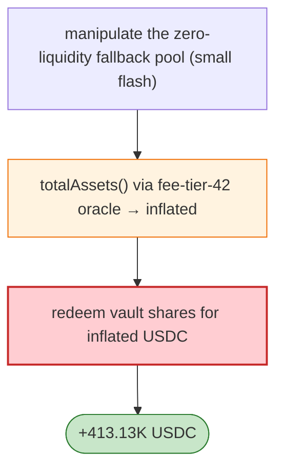

# Singularity dynBaseUSDCv3 Exploit — Oracle Path to Nonexistent Pool → `totalAssets` Inflation

> **Reproduction:** the PoC compiles & runs in an isolated Foundry project at
> [this project folder](.). Full verbose trace: [output.txt](output.txt).
> Verified vulnerable source: [PermissionedDynaVault](sources/PermissionedDynaVault_67b93f),
> [UniswapV3Oracle](sources/UniswapV3Oracle_73b8c1).

---

## Key info

| | |
|---|---|
| **Loss** | 413.13K USDC (+ residual vault shares); tx `0x00b949bc…` |
| **Vulnerable contract** | Singularity `dynBaseUSDCv3` vault `0x67b93f66…`; oracle `0x73b8c192…` (Base) |
| **Attacker** | `0x5c2cbe53…` (contract `0x9ad48257…`) |
| **Chain / block / date** | Base / Apr 2026 |
| **Bug class** | Oracle mis-configuration — `dynBaseUSDCv3` priced non-USDC reserves through an oracle path configured with **Uniswap V3 fee tier 42**, but the direct pools did not exist and the fallback token/WETH pools had zero liquidity, so `totalAssets()` returned a manipulable/garbage value. |

---

## TL;DR

Per the embedded analysis: the vault's `totalAssets()` priced non-USDC reserves through a V3 oracle
path with fee tier **42** (a non-standard fee), whose direct pools didn't exist and whose fallback
token/WETH pools had zero liquidity. The attacker manipulates the zero-liquidity pool with a small
flash swap, making `totalAssets()` report a hugely inflated value, then redeems vault shares for far
more USDC than deposited — 413.13K USDC.

---

## Root cause

A **mis-configured oracle path** (wrong fee tier + pools with no liquidity) feeding `totalAssets()`,
which share-price/redemption trusted without sanity bounds.

---

## Diagrams



---

## Remediation

1. Validate oracle pools exist with real liquidity before trusting `totalAssets()`.
2. Use canonical fee tiers; sanity-bound oracle outputs (deviation/heartbeat).
3. Cap per-redemption value; re-check price post-trade.

---

## How to reproduce

```bash
_shared/run_poc.sh 2026-04-SingularityDynaVault_exp -vvvvv
```

- RPC: Base archive. Result: `[PASS]` — 413.13K USDC via oracle mis-configuration.

---

*Reference: Singularity dynBaseUSDCv3 oracle-path mis-configuration, Base, Apr 2026 (413.13K USDC).*
