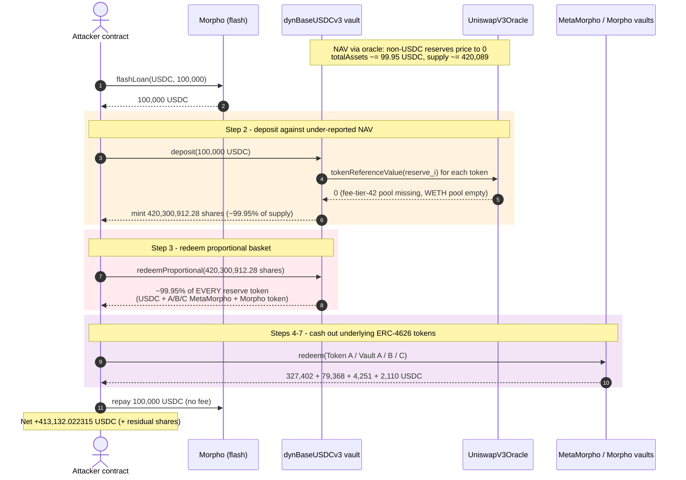
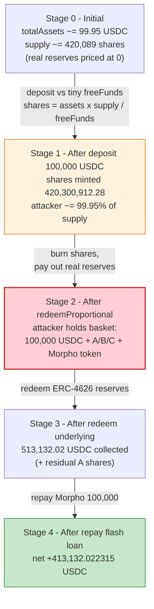
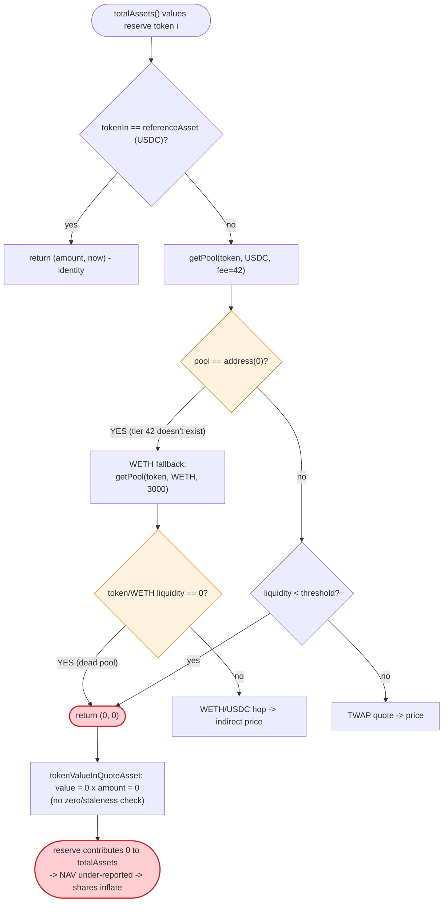
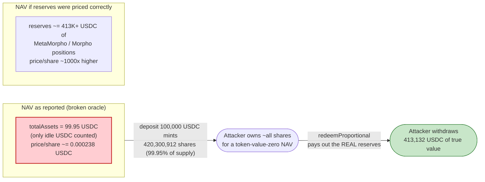

# Singularity dynBaseUSDCv3 Exploit — `totalAssets()` Inflation via a Mis-Configured (Fee-Tier-42 / Zero-Liquidity) Oracle Path

> **Reproduction:** the PoC compiles & runs in an isolated Foundry project at
> [this project folder](.) (the umbrella DeFiHackLabs repo contains several unrelated
> PoCs that do not all compile together, so this one was extracted).
> Full verbose trace: [output.txt](output.txt).
> Verified vulnerable sources (active implementation at the fork block):
> [PermissionedDynaVault / DynaVault](sources/PermissionedDynaVault_67b93f/contracts_dynavaults_DynaVault.sol),
> [DynaVaultLib](sources/PermissionedDynaVault_67b93f/contracts_dynavaults_DynaVaultLib.sol),
> [UniswapV3Oracle](sources/UniswapV3Oracle_73b8c1/contracts_dynavaults_oracles_UniswapV3Oracle.sol).

---

## Key info

| | |
|---|---|
| **Loss** | ~$413,132 — **413,132.022315 USDC** drained from the vault's reserves, plus ~31,174 residual MetaMorpho-A shares forwarded to the receiver |
| **Vulnerable contract** | `PermissionedDynaVault` (dynBaseUSDCv3) — [`0x67b93f6676bd1911c5FAe7Ffa90fFf5f35E14dCd`](https://basescan.org/address/0x67b93f6676bd1911c5fae7ffa90fff5f35e14dcd#code) |
| **Oracle dependency** | `UniswapV3Oracle` — [`0x73b8c192bfc323c3ea224c88219d55dfc319e89f`](https://basescan.org/address/0x73b8c192bfc323c3ea224c88219d55dfc319e89f) |
| **Victim vault** | dynBaseUSDCv3 = the vulnerable contract itself (`0x67b93f66…`) |
| **Attacker EOA** | `0x5C2cbe53f2CE1b58532D4985A9b9d3db87d3Af4c` |
| **Attacker contract** | `0x9ad48257024f8cd3ab7fde97c95950159fcaefae` |
| **Profit receiver** | `0x25C08505b6c5Eba2D6C5d97c9E9a7F5f58d9A079` |
| **Attack tx** | [`0x00b949bc3ed3edb58b04faedfbd8eb1db2edceae761382e80fe012919f8d3732`](https://basescan.org/tx/0x00b949bc3ed3edb58b04faedfbd8eb1db2edceae761382e80fe012919f8d3732) |
| **Chain / block / date** | Base / fork 45,183,966 → attack 45,183,967 / Apr 2026 |
| **Compiler** | Solidity v0.8.26+commit.8a97fa7a, optimizer **enabled**, **250 runs** (both vault and oracle, per `_meta.json`) |
| **Bug class** | Oracle mis-configuration — non-USDC reserves priced through a Uniswap V3 path whose direct pool was queried at the **non-existent fee tier 42** and whose WETH-fallback pool had **zero liquidity**, so the oracle returned `0`, `totalAssets()` counted only idle USDC, and ERC-4626 share minting hyper-inflated |

---

## TL;DR

`PermissionedDynaVault` (deployed as **dynBaseUSDCv3**) is an ERC-4626-style multi-asset vault. Its `totalAssets()`
sums the USDC value of every reserve token, pricing each non-USDC token through a `UniswapV3Oracle`.

1. **The oracle is mis-configured.** For each non-USDC reserve token, the oracle first asks the Uniswap V3 factory
   for a direct `token/USDC` pool at fee tier **42** — a tier that does not exist — and gets `address(0)`. It then
   falls back to a `token/WETH` → `WETH/USDC` two-hop, but the `token/WETH` pool it finds has **zero liquidity**, so
   the staleness/liquidity guard fires and the whole path returns `(0, 0)`
   ([UniswapV3Oracle.sol:57-91](sources/UniswapV3Oracle_73b8c1/contracts_dynavaults_oracles_UniswapV3Oracle.sol#L57-L91)).

2. **A zero price is silently accepted.** `tokenReferenceValue` returns `(0, blockTimestamp)` and `DynaVaultLib.tokenValueInQuoteAsset`
   propagates `price = 0` with no sanity check
   ([DynaVaultLib.sol:453-457](sources/PermissionedDynaVault_67b93f/contracts_dynavaults_DynaVaultLib.sol#L453-L457)).
   So every non-USDC reserve — three MetaMorpho vault tokens, a residual vault token, and a Morpho-backed redeemable
   token — is valued at **0**. `totalAssets()` reports only the vault's **idle USDC**: in the trace, just
   **99.949579 USDC** ([output.txt:3358](output.txt)) against a share supply of ~420,088.99
   ([output.txt:3369](output.txt)).

3. **Share minting hyper-inflates.** ERC-4626 mints `shares = assets · totalSupply / freeFunds`
   ([DynaVaultLib.sol:176-185](sources/PermissionedDynaVault_67b93f/contracts_dynavaults_DynaVaultLib.sol#L176-L185)).
   With `freeFunds ≈ 99.95 USDC`, depositing **100,000 USDC** mints
   **420,300,912.285322153666116992** shares ([output.txt:3593](output.txt)) — ~99.95% of the post-deposit supply,
   for a deposit that is economically a rounding error next to the vault's true reserves.

4. **`redeemProportional` pays out the real reserves.** Redeeming those shares returns ~99.95% of *every* reserve
   token — including the genuinely valuable MetaMorpho/Morpho positions the oracle had priced at 0
   ([DynaVault.sol:243-255](sources/PermissionedDynaVault_67b93f/contracts_dynavaults_DynaVault.sol#L243-L255)).
   The attacker then `redeem()`s those underlying ERC-4626 tokens back into USDC.

5. **It's flash-loanable.** The deposit principal is borrowed from Morpho (`flashLoan` of 100,000 USDC, repaid 1:1
   with no fee), so the attack costs essentially gas. After repaying the loan, the attacker keeps
   **413,132.022315 USDC** ([output.txt:6473](output.txt)) plus residual vault shares the receiver could redeem later.

---

## Background — what dynBaseUSDCv3 does

`PermissionedDynaVault` extends `DynaVault`
([source](sources/PermissionedDynaVault_67b93f/contracts_dynavaults_DynaVault.sol)), an ERC-4626-style vault whose
"asset" is USDC but whose reserves are a basket of several tokens (yield-bearing MetaMorpho vaults, Morpho-backed
positions, etc.). To express a single USDC-denominated NAV, the vault prices every non-USDC reserve through a
`referenceAssetOracle` — here the `UniswapV3Oracle` at `0x73b8c192…`. The oracle's stated intent (per its NatSpec) is
to be **manipulation-resistant**: it reads a Uniswap V3 TWAP (geometric mean across an observation window) rather than
spot reserves, and it skips any pool whose `liquidity()` is below a configurable threshold.

The vault exposes the standard ERC-4626 surface plus a `redeemProportional(shares, receiver, owner)` that, instead of
paying out a single asset, returns a **pro-rata basket** of all reserve tokens
([DynaVault.sol:243-255](sources/PermissionedDynaVault_67b93f/contracts_dynavaults_DynaVault.sol#L243-L255)).

On-chain parameters and state at the fork block (read from the trace):

| Parameter | Value | Source |
|---|---|---|
| Vault asset / reference asset | USDC (6 decimals) | [output.txt:1745-1748](output.txt) |
| `referenceAssetOracle` | `0x6Ea8e22A…` proxy → `UniswapV3Oracle` `0x73b8c192…` | [output.txt:1701-1706](output.txt) |
| Number of reserve tokens (`nrOfTokens`) | **7** | [output.txt:4143](output.txt) |
| Oracle direct-pool fee tier queried | **42** (does not exist → `getPool` returns `0x0`) | [output.txt:1843-1844](output.txt) |
| WETH fallback fee tier (`token/WETH`) | 3000 → pool exists but `liquidity() == 0` | [output.txt:1846-1848](output.txt) |
| `WETH/USDC` hop fee tier | 100 → pool exists, `liquidity() = 3.88e16` | [output.txt:1855-1858](output.txt) |
| Reported `totalAssets()` (freeFunds) **before** attack | **99,949,579** wei = **99.949579 USDC** | [output.txt:3358](output.txt) |
| Vault share supply before attack | 420,088,992,362,338,771,383,017 (~420,088.99) | [output.txt:3369](output.txt) |
| Deposit fee | 200 bps (`0x00c8`) | [output.txt:3364](output.txt) |

The whole exploit lives in that one line: a vault holding hundreds of thousands of USDC worth of real reserves reports
a NAV of **99.95 USDC** because every non-USDC reserve prices to zero through the broken oracle path.

---

## The vulnerable code

### 1. The oracle returns zero when the direct pool is missing AND the WETH fallback has no liquidity

```solidity
function getPrice(address base, address quote, uint256 amount) public view returns (uint256, uint256) {
    uint24 baseFee = (uniV3fee[base][quote] > 0) ? uniV3fee[base][quote] : 3000;
    (uint256 directValue, uint256 directTimestamp) = getPrice(base, baseFee, quote, amount);
    if (directTimestamp == 0 && base != WETH && quote != WETH) {
        baseFee = (uniV3fee[base][WETH] > 0) ? uniV3fee[base][WETH] : 3000;
        (uint256 wethValue, uint256 baseTimestamp) = getPrice(base, baseFee, WETH, amount);
        if (baseTimestamp == 0) return (0, 0);          // ← WETH-leg pool empty ⇒ price 0
        uint24 wethFee = (uniV3fee[WETH][quote] > 0) ? uniV3fee[WETH][quote] : 3000;
        (uint256 indirectValue, uint256 indirectTimestamp) = getPrice(WETH, wethFee, quote, wethValue);
        uint256 oldestTimestamp = (indirectTimestamp < baseTimestamp) ? indirectTimestamp : baseTimestamp;
        return (indirectValue, oldestTimestamp);
    }
    return (directValue, directTimestamp);
}
```
([UniswapV3Oracle.sol:57-70](sources/UniswapV3Oracle_73b8c1/contracts_dynavaults_oracles_UniswapV3Oracle.sol#L57-L70))

```solidity
function getPrice(address base, uint24 fee, address quote, uint256 amount) public view returns (uint256 price, uint256 oldestObservation) {
    uint32 secondsAgo = uint32(observationPeriod);
    uint32[] memory secondsAgos = new uint32[](2);
    secondsAgos[0] = secondsAgo;
    secondsAgos[1] = 0;
    address pool = IUniswapV3Factory(uniswapV3Factory).getPool(base, quote, fee);
    if (pool != address(0)) {
        if (IUniswapV3Pool(pool).liquidity() < minLiquidityThreshold) return (0, 0);  // ← zero-liquidity ⇒ price 0
        // ... read TWAP tick, quote via OracleLibrary, return (amountOut, observationTimestamp) ...
    }
    // ← pool == address(0)  ⇒  falls through and returns the default (price = 0, oldestObservation = 0)
}
```
([UniswapV3Oracle.sol:72-91](sources/UniswapV3Oracle_73b8c1/contracts_dynavaults_oracles_UniswapV3Oracle.sol#L72-L91))

Two facts combine here. The vault was configured to query the direct `token/USDC` pool at **fee tier 42**
(`uniV3fee[token][USDC] == 42`, set by an `ORACLE_ADMIN` via `setUniV3fee`), and **no Uniswap V3 pool exists at fee
tier 42** — Uniswap V3 only enables tiers like 100/500/3000/10000 plus governance-added ones. So `getPool(...,42)`
returns `address(0)`, the inner `getPrice` falls through returning `(0,0)`, the outer function enters the WETH
fallback, finds the `token/WETH` pool has `liquidity() == 0`, and returns `(0, 0)`.

### 2. `tokenReferenceValue` passes the zero price through unchecked

```solidity
function tokenReferenceValue(address tokenIn, uint256 amount) public view override returns (uint256 referenceValue, uint256 oldestObservation) {
    if (tokenIn == referenceAsset) return (amount, block.timestamp);  // USDC: identity
    return getPrice(tokenIn, referenceAsset, amount);                 // everything else: may be (0, …)
}
```
([UniswapV3Oracle.sol:46-49](sources/UniswapV3Oracle_73b8c1/contracts_dynavaults_oracles_UniswapV3Oracle.sol#L46-L49))

### 3. The vault library converts that zero straight into NAV with no sanity bound

```solidity
function tokenValueInQuoteAsset(address base, uint256 amount, address quote) internal view returns (uint256 value) {
    IReferenceAssetOracle _referenceAssetOracle = IReferenceAssetOracle(VaultConfigLib.referenceAssetOracle());
    (uint256 price, ) = _referenceAssetOracle.getPrice(base, quote);     // price == 0 for the broken tokens
    return FixedPointMathLib.fullMulDiv(price, amount, (10 ** IERC20Metadata(base).decimals())); // ⇒ value == 0
}
```
([DynaVaultLib.sol:453-457](sources/PermissionedDynaVault_67b93f/contracts_dynavaults_DynaVaultLib.sol#L453-L457))

`totalAssets()` is the manager's sum of `tokenIdle + tokenDebt` valued through this helper, so a non-USDC reserve
worth real money contributes **0** to NAV
([DynaVault.sol:76-79](sources/PermissionedDynaVault_67b93f/contracts_dynavaults_DynaVault.sol#L76-L79)).

### 4. Share minting divides by that under-reported NAV

```solidity
function _convertToSharesGivenTotalSupplyAndFreeFunds(
    uint256 assets,
    uint256 givenTotalSupply,
    uint256 givenFreeFunds,
    Math.Rounding rounding
) private view returns (uint256 shares) {
    if (assets == 0) return 0;
    if (givenTotalSupply == 0 || givenFreeFunds == 0) return _fullMulDiv(assets, PRECISION, vaultStorage().depositPrecision, rounding);
    return _fullMulDiv(assets, givenTotalSupply, givenFreeFunds, rounding);   // shares = assets · supply / freeFunds
}
```
([DynaVaultLib.sol:176-185](sources/PermissionedDynaVault_67b93f/contracts_dynavaults_DynaVaultLib.sol#L176-L185))

With `givenFreeFunds = 99.95 USDC` and `givenTotalSupply ≈ 420,088.99`, a `100,000 USDC` deposit mints
`100,000 · 420,088.99 / 99.95 ≈ 420,300,912` shares — three orders of magnitude more shares than the deposit deserves
relative to the vault's true value.

### 5. `redeemProportional` hands back a pro-rata slice of every real reserve

```solidity
function redeemProportional(uint256 sharesIncludingFees, address receiver, address owner) public virtual override returns (uint256[] memory) {
    ...
    uint256 reportedFreeFunds = DynaVaultLib.reportAllReserves();
    DynaVaultLib.checkRedeem(sharesIncludingFees, owner, reportedFreeFunds);
    uint256[] memory toRedeem = DynaVaultLib.calcRedeemProportional(sharesIncludingFees);  // ratio of EVERY token
    _burn(owner, sharesIncludingFees);
    DynaVaultLib.transferProportional(receiver, toRedeem);                                  // ships real reserves out
    ...
}
```
([DynaVault.sol:243-255](sources/PermissionedDynaVault_67b93f/contracts_dynavaults_DynaVault.sol#L243-L255))

`calcRedeemProportional` computes `toRedeem[i] = tokenTotal_i · (shares · unlockedRatio / totalSupply) / PRECISION`
([DynaVaultLib.sol:397-419](sources/PermissionedDynaVault_67b93f/contracts_dynavaults_DynaVaultLib.sol#L397-L419)).
Holding ~99.95% of supply, the attacker receives ~99.95% of every reserve token — regardless of the oracle's bogus
zero valuations.

---

## Root cause — why it was possible

A single failure cascades into total loss: **the NAV oracle returns `0` for the vault's most valuable reserves, and
nothing downstream sanity-checks it.**

1. **Wrong fee tier for the direct pool.** The oracle was configured (`uniV3fee[token][USDC] = 42`) to look up a pool
   at fee tier **42**, which is not a valid/enabled Uniswap V3 tier. `factory.getPool(token, USDC, 42)` returns
   `address(0)` for every reserve token ([output.txt:1843-1844](output.txt), and identically at
   [output.txt:2089](output.txt), [output.txt:2138](output.txt) for the other vault tokens).

2. **Dead fallback pools.** The `token/WETH` → `WETH/USDC` fallback exists in code, but the `token/WETH` pools the
   factory returns have `liquidity() == 0` ([output.txt:1847-1848](output.txt)), so the liquidity guard returns
   `(0,0)` and the entire path collapses to a zero price.

3. **No zero/staleness rejection.** `tokenReferenceValue` happily returns `(0, block.timestamp)` and
   `tokenValueInQuoteAsset` multiplies by `price = 0`. There is no "revert if price == 0" or "revert if observation is
   stale" check in the value path, so a 0 reads as "this asset is worthless" rather than "I cannot price this asset."

4. **NAV-driven share math with no floor.** ERC-4626 share issuance is `assets · supply / freeFunds`. An
   under-reported `freeFunds` is the textbook share-inflation primitive: the smaller the denominator, the more shares
   a fixed deposit mints. Because `redeemProportional` then distributes the *physical* reserves (not an
   oracle-valued amount), the attacker converts inflated *share* ownership into real *token* ownership.

5. **Permissionless + flash-loanable.** `deposit` and `redeemProportional` are open to anyone, and the deposit capital
   is a Morpho flash loan repaid 1:1, so the attack is self-funding.

The oracle's TWAP design was meant to stop flash-loan price manipulation — and it does. But it never anticipated being
pointed at a **non-existent pool**, where the "safe" behavior (returning zero) is just as catastrophic as a
manipulated price, because the vault treats zero as a real valuation.

---

## Preconditions

- The vault's oracle is configured with a non-existent direct-pool fee tier (42) for its non-USDC reserve tokens, and
  the WETH-fallback pools have liquidity below `minLiquidityThreshold`, so those tokens price to `0`. (On-chain
  configuration; verified in the trace.)
- The vault holds idle USDC (here ~99.95 USDC of *reported* assets) and a basket of real reserve tokens it cannot
  price. Share supply (~420,089) corresponds to a tiny reported NAV, so a fresh deposit dwarfs `freeFunds`.
- `deposit` and `redeemProportional` are permissionless.
- Working capital in USDC to deposit. The PoC borrows **100,000 USDC** from Morpho (`flashLoan`, repaid with no fee),
  so the attack is **flash-loanable** and effectively free
  ([test/SingularityDynaVault_exp.sol:73](test/SingularityDynaVault_exp.sol#L73),
  [:126-127](test/SingularityDynaVault_exp.sol#L126-L127)).
- The reserve tokens the attacker receives are themselves ERC-4626 (MetaMorpho/Morpho), so they can be `redeem()`ed
  back into USDC within the same transaction
  ([test/SingularityDynaVault_exp.sol:162-169](test/SingularityDynaVault_exp.sol#L162-L169)).

---

## Attack walkthrough (with on-chain numbers from the trace)

All figures are taken directly from the `Deposit` / `Withdraw` / `Transfer` events and call returns in
[output.txt](output.txt). USDC is 6-decimal; the reserve/vault tokens are 18-decimal. Raw integers are shown with a
human approximation in parentheses.

| # | Step | Vault NAV / share state | Attacker USDC | Effect |
|---|------|-------------------------|---------------|--------|
| 0 | **Initial** — vault reports NAV via broken oracle | `totalAssets ≈ 99,949,579` (~99.95 USDC); supply ≈ 420,088,992,362,338,771,383,017 (~420,088.99) ([output.txt:3358](output.txt), [output.txt:3369](output.txt)) | 0 | Non-USDC reserves priced at **0** ([output.txt:1867](output.txt)). |
| 1 | **Flash-borrow** 100,000 USDC from Morpho ([output.txt:1636-1640](output.txt)) | unchanged | +100,000 (1e11) | Self-funding; repaid 1:1 later. |
| 2 | **`deposit(100,000 USDC)`** → mint shares ([output.txt:3393](output.txt) transfer-in; [output.txt:3593](output.txt) Deposit event) | supply → ~420,509,293; attacker holds **420,300,912.285322153666116992** shares (4.203e26 wei) = ~99.95% of supply | −100,000 | Share hyper-inflation: `100,000 · 420,089 / 99.95`. |
| 3 | **`redeemProportional(420,300,912.28… shares)`** ([output.txt:3608](output.txt); `checkRedeem` freeFunds = 100,099,949,580 ~100,099.95 USDC [output.txt:4024](output.txt)) | burns all attacker shares ([output.txt:4136](output.txt)); pays out the pro-rata basket below | — | Converts inflated *shares* into real *reserve tokens*. |
| 3a | basket: USDC leg | — | +100,000 (1e11) ([output.txt:4177](output.txt)) | Returns the deposited USDC. |
| 3b | basket: Redeemed Vault Token A | 308,710,203,688 (~308,710 shares) ([output.txt:4309](output.txt)) | — | Morpho-backed redeemable token. |
| 3c | basket: MetaMorpho Vault A | 103,063,238,187,773,015,912,541 (~103,063.2) ([output.txt:4263](output.txt)) | — | Real yield position. |
| 3d | basket: MetaMorpho Vault B | 3,838,361,764,166,304,302,973 (~3,838.4) ([output.txt:4241](output.txt)) | — | Real yield position. |
| 3e | basket: MetaMorpho Vault C | 1,906,705,673,147,924,829,529 (~1,906.7) ([output.txt:4219](output.txt)) | — | Real yield position. |
| 3f | basket: Residual Vault Token | 1,347,499,541 (~1,347.5) ([output.txt:4286](output.txt)) | — | Real yield position. |
| 4 | **`redeem()` Redeemed Vault Token A** (308,710,203,688) → USDC ([output.txt:4480](output.txt)) | — | +327,402.156 (3.274e11) | Underlying Morpho USDC pulled out. |
| 5 | **`redeem()` MetaMorpho Vault A** — `maxRedeem` allows 71,888,945,834,342,892,737,041 (~71,888.9) of the ~103,063 received → USDC ([output.txt:4781](output.txt), [output.txt:5488](output.txt)) | — | +79,368.352360 (7.936e10) | Only the liquid portion redeems; ~31,174 A-shares remain. |
| 6 | **`redeem()` MetaMorpho Vault B** (3,838,361,763,515,663,245,674) → USDC ([output.txt:5947](output.txt)) | — | +4,251.158151 (4.251e9) | |
| 7 | **`redeem()` MetaMorpho Vault C** (1,906,705,672,704,487,024,232) → USDC ([output.txt:6320](output.txt)) | — | +2,110.355804 (2.11e9) | |
| 8 | **Repay Morpho** 100,000 USDC (no fee) ([output.txt:6389](output.txt)) | — | −100,000 | Flash loan closed. |
| 9 | **Forward residuals** to receiver: 413,132.022315 USDC + 31,174.292353… MetaMorpho-A shares + small B/C/residual amounts ([output.txt:6401-6441](output.txt)) | — | profit booked | Receiver USDC balance = **413,132.022315** ([output.txt:6473](output.txt)). |

Attack-contract USDC balance just before repayment was **513,132.022315** (5.131e11)
([output.txt:6375](output.txt)); after repaying the 100,000 USDC flash loan, the **413,132.022315 USDC** profit is
forwarded to the receiver.

### Profit / loss accounting (USDC, raw 6-decimal wei)

| Item | Amount (wei) | ~Human |
|---|---:|---:|
| In — redeemProportional USDC leg | 100,000,000,000 | 100,000.000000 |
| In — Redeemed Vault Token A → USDC | 327,402,156,000 | 327,402.156000 |
| In — MetaMorpho Vault A → USDC | 79,368,352,360 | 79,368.352360 |
| In — MetaMorpho Vault B → USDC | 4,251,158,151 | 4,251.158151 |
| In — MetaMorpho Vault C → USDC | 2,110,355,804 | 2,110.355804 |
| **Total USDC in callback** | **513,132,022,315** | **513,132.022315** |
| Out — deposit into vault | −100,000,000,000 | −100,000.000000 |
| Out — repay Morpho flash loan | −100,000,000,000 | −100,000.000000 |
| In — flash-borrow from Morpho | +100,000,000,000 | +100,000.000000 |
| **Net USDC profit (asserted in PoC)** | **413,132,022,315** | **413,132.022315** |
| Plus residual MetaMorpho-A shares forwarded | 31,174,292,353,430,123,175,500 | ~31,174.29 shares |

The PoC asserts the profit floors directly: USDC profit `> 413,000 USDC`, inflated shares `> 420,000`, and residual
MetaMorpho-A shares `> 31,000` ([test/SingularityDynaVault_exp.sol:75-97](test/SingularityDynaVault_exp.sol#L75-L97)).
The realized USDC profit (413,132.022315) matches the final receiver balance to the wei
([output.txt:6473](output.txt)).

---

## Diagrams

### Sequence of the attack



### Vault NAV / share-supply evolution



### The flaw inside the oracle price path



### Why the inflation is theft: NAV before vs. after correct pricing



---

## Why each magic number

- **`flashAmount = 100_000_000_000` (100,000 USDC):** the deposit principal, borrowed from Morpho. It is large
  relative to the vault's *reported* NAV (99.95 USDC) so the minted shares dominate the supply (~99.95%), but it is the
  full Morpho flash-loan amount and is repaid 1:1, so it costs nothing
  ([test/SingularityDynaVault_exp.sol:73](test/SingularityDynaVault_exp.sol#L73)).
- **`minUsdcProfit = 300_000_000_000` (300,000 USDC):** an in-callback guard requiring the round-trip to clear at
  least 300,000 USDC of proceeds before repaying Morpho — a conservative sanity floor below the actual ~413,132 USDC
  profit ([test/SingularityDynaVault_exp.sol:74](test/SingularityDynaVault_exp.sol#L74)).
- **`inflatedShareFloor = 420_000 ether`:** asserts the deposit minted at least ~420,000 vault shares — the visible
  signature of the NAV-inflation bug (actual: 420,300,912.28)
  ([test/SingularityDynaVault_exp.sol:75](test/SingularityDynaVault_exp.sol#L75), [output.txt:1565](output.txt)).
- **`usdcProfitFloor = 413_000_000_000` (413,000 USDC):** asserts net profit after flash-loan repayment exceeds
  413,000 USDC (actual: 413,132.022315)
  ([test/SingularityDynaVault_exp.sol:76](test/SingularityDynaVault_exp.sol#L76), [output.txt:6473](output.txt)).
- **`residualMetaVaultFloor = 31_000 ether`:** asserts at least ~31,000 MetaMorpho-A shares were forwarded — the
  illiquid portion of the basket that could not be redeemed to USDC inside the tx (actual: ~31,174.29)
  ([test/SingularityDynaVault_exp.sol:77](test/SingularityDynaVault_exp.sol#L77), [output.txt:6413](output.txt)).
- **The five `redeemableVaultTokens`** (Redeemed Vault Token A, MetaMorpho A/B/C, Residual Vault Token): the reserve
  tokens received from `redeemProportional` that are themselves ERC-4626 vaults; the helper calls `maxRedeem` then
  `redeem` on each to convert them back to USDC
  ([test/SingularityDynaVault_exp.sol:111-112](test/SingularityDynaVault_exp.sol#L111-L112),
  [:162-169](test/SingularityDynaVault_exp.sol#L162-L169)).

---

## Remediation

1. **Reject unpriceable assets — never treat a zero price as zero value.** `tokenReferenceValue` /
   `tokenValueInQuoteAsset` must distinguish "this asset is worth nothing" from "I could not obtain a price."
   If the oracle returns `price == 0` or `oldestObservation == 0` (no pool / no observation), `totalAssets()` should
   **revert** (or the vault should pause deposits/redemptions), not silently under-report NAV.
2. **Validate the oracle's pool configuration.** `setUniV3fee` accepted **fee tier 42**, which has no corresponding
   Uniswap V3 pool. Constrain configurable fee tiers to the set of enabled tiers and require
   `factory.getPool(base, quote, fee) != address(0)` with `liquidity() >= minLiquidityThreshold` at configuration
   time, reverting otherwise.
3. **Enforce a meaningful `minLiquidityThreshold` and staleness window.** A `liquidity() == 0` pool should not be a
   usable fallback. Require both the `token/WETH` and `WETH/USDC` hops to clear the liquidity threshold and to have a
   fresh observation no older than a configured heartbeat; otherwise fail closed.
4. **Sanity-bound NAV and share issuance.** Even with a price feed, guard against NAV collapse: cap how far reported
   NAV may deviate from the previous report, and floor `freeFunds` used in `assets · supply / freeFunds` so a near-zero
   denominator cannot mint near-infinite shares. Consider a virtual-share / virtual-asset offset (ERC-4626 inflation
   mitigation) so the first/again-empty NAV cannot be weaponized.
5. **Re-price the basket on redemption against an independent check.** `redeemProportional` distributes physical
   reserves based on share ratio; pair it with a post-redemption invariant that the USDC-equivalent value paid out does
   not exceed the share's fair claim on a *correctly* priced NAV.

---

## How to reproduce

The PoC runs **offline** against a local anvil fork pinned to Base block 45,183,966 (state served from the bundled
`anvil_state.json`; `createSelectFork` targets `http://127.0.0.1:8548`
([test/SingularityDynaVault_exp.sol:53](test/SingularityDynaVault_exp.sol#L53))):

```bash
_shared/run_poc.sh 2026-04-SingularityDynaVault_exp --mt testExploit -vvvvv
```

- The harness boots anvil from the local `anvil_state.json` and points the test's `127.0.0.1:8548` fork at it — no
  public RPC is required. `foundry.toml` sets `evm_version = 'cancun'`.
- The test rolls to block 45,183,967 and warps to timestamp 1,777,157,281 (the attack block/time) before executing
  ([test/SingularityDynaVault_exp.sol:48-55](test/SingularityDynaVault_exp.sol#L48-L55)).
- Result: `[PASS] testExploit()` with `Profit Receiver Final USDC Balance: 413132.022315`.

Expected tail (from [output.txt:1562-1567](output.txt) and [output.txt:6507](output.txt)):

```
[PASS] testExploit() (gas: 8709996)
Logs:
  Inflated dynBaseUSDCv3 Shares Minted: 420300912.285322153666116992
  Profit Receiver Final USDC Balance: 413132.022315

Suite result: ok. 1 passed; 0 failed; 0 skipped; finished in 345.58s (342.52s CPU time)
```

---

*Reference: Defimon Alerts — https://x.com/DefimonAlerts/status/2048698708309705069 (Singularity dynBaseUSDCv3, Base, ~$413K).*
