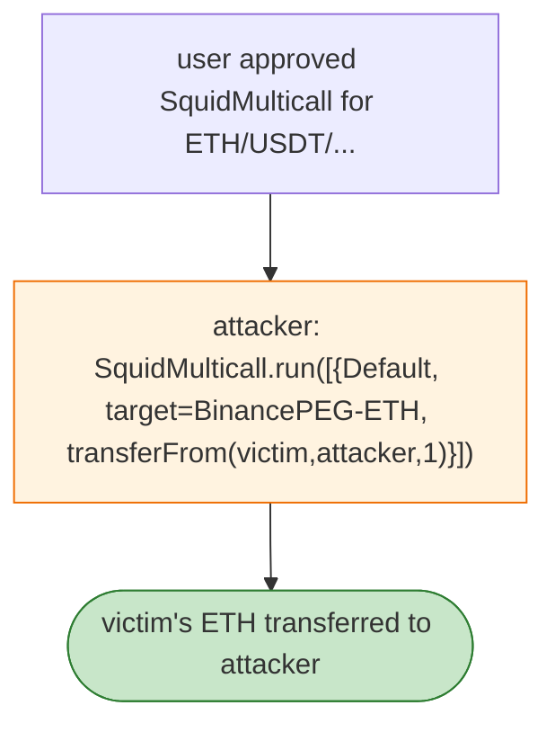

# Squid Multicall Allowance Drain — `Default` Call to an Approved Token `transferFrom`

> **Reproduction:** the PoC compiles & runs in an isolated Foundry project at
> [this project folder](.). Full verbose trace: [output.txt](output.txt).
> Verified vulnerable source: [SquidMulticall](sources/SquidMulticall_ad6cea).

---

## Key info

| | |
|---|---|
| **Loss** | 1 ETH in this tx; ~$800K of cross-chain approvals at risk (~$512K later rescued). tx `0x81d0c429…` |
| **Vulnerable contract** | Squid `SquidMulticall` `0xad6cea45…` (BSC) |
| **Attacker** | `0xe02b595c…` (contract `0x101c6e9f…`) |
| **Chain / block / date** | BSC / Apr 2026 |
| **Bug class** | Trust boundary — a `Default`-type call in `SquidMulticall.run` targets an arbitrary address; users who approved SquidMulticall had `transferFrom` executed against them by the multicall. |

---

## TL;DR

Per the embedded analysis: the attacker used `SquidMulticall.run` with one **`Default` call whose target
was the Binance-Peg ETH token**. Because the victim had approved SquidMulticall, the multicall could
execute `transferFrom` and move 1 ETH from the victim to the attacker. The PoC is scoped to this tx.

---

## Root cause

A **`Default` multicall type that allows arbitrary-target calls** from a contract users widely approve.
The multicall thus became a universal `transferFrom` proxy over every token a user had approved it for.

---

## Diagrams



---

## Remediation

1. Remove the arbitrary-target `Default` call type, or restrict targets to a whitelist.
2. Multicall must not be able to `transferFrom` from arbitrary users; scope approvals per-route.
3. Revoke/re-issue SquidMulticall so prior approvals are voided.

---

## How to reproduce

```bash
_shared/run_poc.sh 2026-04-SquidMulticallAllowanceDrain_exp -vvvvv
```

- RPC: BSC archive. Result: `[PASS]` — 1 ETH transferred from victim via multicall.

---

*Reference: Squid Multicall arbitrary-target allowance drain, BSC, Apr 2026 (~$800K at risk).*
