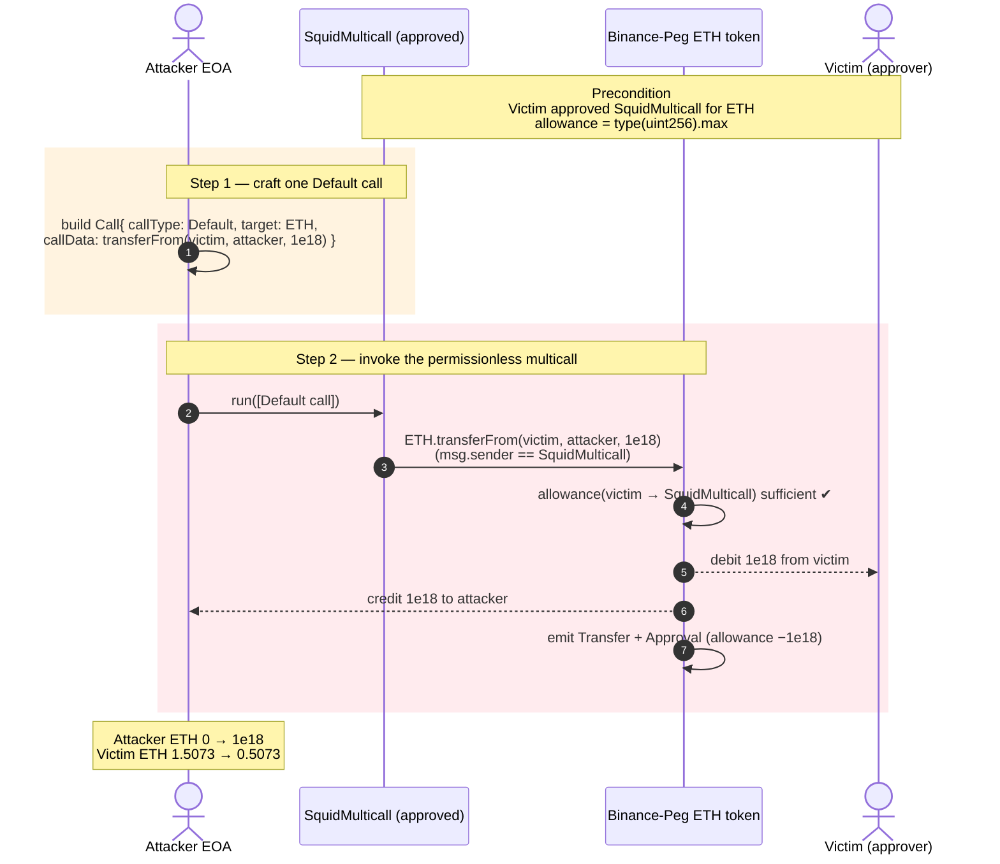
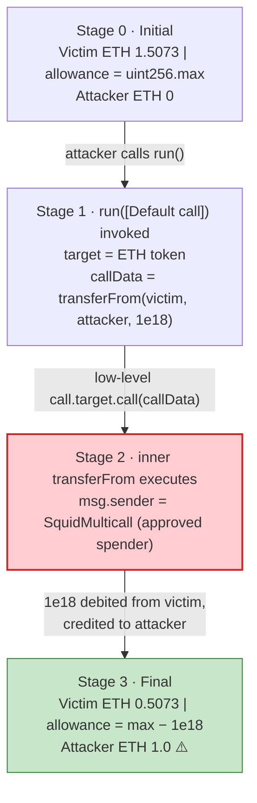
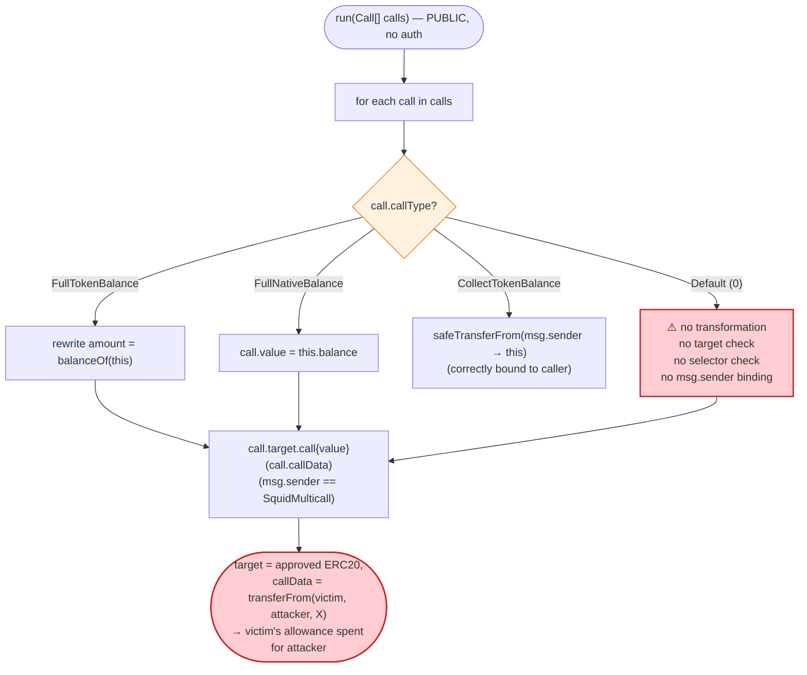
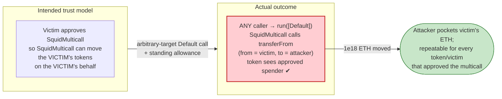

# Squid `SquidMulticall` Exploit — Arbitrary-Target `Default` Call Turns an Approved Multicall into a Universal `transferFrom` Proxy

> **Reproduction:** the PoC compiles & runs in an isolated Foundry project at
> [this project folder](.) (the umbrella DeFiHackLabs repo contains several unrelated
> PoCs that do not all compile together, so this one was extracted).
> Full verbose trace: [output.txt](output.txt).
> Verified vulnerable source:
> [contracts_router_SquidMulticall.sol](sources/SquidMulticall_ad6cea/contracts_router_SquidMulticall.sol).

---

## Key info

| | |
|---|---|
| **Loss** | **1.0 ETH** (Binance-Peg ETH, `0x2170…33F8`) drained from the victim in the reproduced transaction; per the public report ~$800K of cross-chain approvals were at risk and ~$512K was later rescued. Drained asset: [Binance-Peg Ethereum Token](https://bscscan.com/address/0x2170Ed0880ac9A755fd29B2688956BD959F933F8) |
| **Vulnerable contract** | `SquidMulticall` — [`0xaD6Cea45f98444a922a2b4fE96b8C90F0862D2F4`](https://bscscan.com/address/0xad6cea45f98444a922a2b4fe96b8c90f0862d2f4#code) (BSC) |
| **Victim** | Approver EOA `0xaCc0c1f672B03B9a5fED4535f840f09B85f40E98` — granted `type(uint256).max` ETH allowance to `SquidMulticall` |
| **Attacker EOA** | `0xe02b595ca69d8d3e120043536e6e76caea385a82` |
| **Attacker contract** | `0x101c6e9f62554ddd3a32f395c655e20512ab321d` |
| **Attack tx** | [`0x81d0c429ee7eae19d8c4d9d797dbd3828279060096e703b11cca739c9b1301e9`](https://bscscan.com/tx/0x81d0c429ee7eae19d8c4d9d797dbd3828279060096e703b11cca739c9b1301e9) |
| **Chain / block / date** | BSC (chainId 56) / fork block 91,122,249 / April 2026 |
| **Compiler / optimizer** | Solidity v0.8.23+commit.f704f362, optimizer **enabled, 99,999 runs**, non-proxy (from [`_meta.json`](sources/SquidMulticall_ad6cea/_meta.json)) |
| **Bug class** | Trust-boundary / arbitrary external call — a permissionless `Default`-type multicall call lets anyone make the widely-approved `SquidMulticall` invoke `transferFrom` against any user who approved it |

---

## TL;DR

1. `SquidMulticall.run(Call[] calls)`
   ([contracts_router_SquidMulticall.sol#L18-L48](sources/SquidMulticall_ad6cea/contracts_router_SquidMulticall.sol#L18-L48))
   is a **fully permissionless** entry point: it iterates over a caller-supplied array of `Call`
   structs and, for each one, executes `call.target.call{value: call.value}(call.callData)`
   ([#L45](sources/SquidMulticall_ad6cea/contracts_router_SquidMulticall.sol#L45)) with **no
   restriction on `target` and no restriction on `callData`.**

2. The `CallType.Default` branch performs **no transformation at all** on the call — it does not
   prepend `msg.sender`, does not rewrite the calldata, and does not validate the target. Whatever
   bytes the caller hands in are forwarded verbatim to whatever address the caller names.

3. `SquidMulticall` is an aggregator router that countless users approve with **unlimited
   allowances** so it can move their ERC-20 tokens during cross-chain swaps. The victim here had set
   the ETH allowance to `type(uint256).max`
   ([output.txt:37-38](output.txt)).

4. The attacker therefore submitted a single `Default` call whose `target` is the **Binance-Peg ETH
   token** and whose `callData` is `transferFrom(victim, attacker, 1e18)`
   (selector `0x23b872dd`, [output.txt:45](output.txt)). Because the *caller of `transferFrom` is
   `SquidMulticall` itself* — the very address the victim approved — the token sees a fully
   authorized spender and moves the funds.

5. The exact reproduced impact: **1.000000000000000000 ETH** (`1e18` wei) moved from victim to
   attacker, the victim's allowance decremented by exactly `1e18`, attacker balance `0 → 1e18`
   ([output.txt:46-53](output.txt), [output.txt:67](output.txt)). The multicall becomes a universal
   `transferFrom` proxy over every token, for every user, that ever approved it.

---

## Background — what `SquidMulticall` does

`SquidMulticall`
([source](sources/SquidMulticall_ad6cea/contracts_router_SquidMulticall.sol)) is the on-chain
"execution glue" of the Squid cross-chain router. Its job is to chain together several arbitrary
contract calls in a single transaction (swap on a DEX, then bridge, then transfer, etc.), with the
special ability to splice **runtime token/native balances** into the calldata of a later call. The
interface NatSpec describes the contract's purpose as *"Multicall logic specific to Squid calls
format … mainly to enable ERC20 and native token amounts in calldata between two calls"*
([contracts_interfaces_ISquidMulticall.sol#L4-L7](sources/SquidMulticall_ad6cea/contracts_interfaces_ISquidMulticall.sol#L4-L7)).

The single public function is `run(Call[] calls)`. Each `Call` carries a `CallType` that selects one
of four behaviours
([contracts_interfaces_ISquidMulticall.sol#L10-L19](sources/SquidMulticall_ad6cea/contracts_interfaces_ISquidMulticall.sol#L10-L19)):

| `CallType` | Documented behaviour |
|---|---|
| `Default` (0) | *"Will simply run calldata"* — forward `callData` to `target` unchanged. |
| `FullTokenBalance` (1) | Rewrite an amount field in `callData` with the multicall's own ERC-20 balance. |
| `FullNativeBalance` (2) | Set `call.value` to the multicall's native balance. |
| `CollectTokenBalance` (3) | `safeTransferFrom(msg.sender → multicall)` the caller's full balance of a token. |

Because routers like this need to pull a user's tokens mid-route, **users grant `SquidMulticall`
large (typically infinite) ERC-20 allowances**. That standing approval is the only "asset" the
exploit needs.

The on-chain parameters at the fork block (read directly from the trace):

| Parameter | Value | Source |
|---|---|---|
| Drained token | Binance-Peg ETH `0x2170Ed0880ac9A755fd29B2688956BD959F933F8`, symbol `"ETH"`, 18 decimals | [output.txt:21](output.txt), [output.txt:26-31](output.txt) |
| Victim ETH balance (before) | 1,507,274,710,552,108,619 wei (~1.5073 ETH) | [output.txt:36](output.txt) |
| Victim → `SquidMulticall` ETH allowance (before) | 115,792,089,237,316,195,423,570,985,008,687,907,853,269,984,665,640,564,039,457,584,007,913,129,639,935 = `type(uint256).max` (~1.157e77) | [output.txt:37-38](output.txt) |
| Attacker ETH balance (before) | 0 | [output.txt:28-29](output.txt) |
| Amount drained in this tx | 1,000,000,000,000,000,000 wei (1.0 ETH) | [output.txt:46](output.txt) |

The infinite allowance is the whole game: with `allowance == 2²⁵⁶−1`, an attacker can move *any*
amount of the victim's ETH up to the victim's balance, repeatedly, simply by asking the approved
multicall to do it for them.

---

## The vulnerable code

### 1. `run()` forwards arbitrary calldata to an arbitrary target with no access control

```solidity
/// @inheritdoc ISquidMulticall
function run(Call[] calldata calls) external payable {
    for (uint256 i = 0; i < calls.length; i++) {
        Call memory call = calls[i];

        if (call.callType == CallType.FullTokenBalance) {
            (address token, uint256 amountParameterPosition) = abi.decode(
                call.payload,
                (address, uint256)
            );
            uint256 amount = IERC20(token).balanceOf(address(this));
            // Deduct 1 from amount to keep hot balances and reduce gas cost
            if (amount > 0) {
                // Cannot underflow because amount > 0
                unchecked {
                    amount -= 1;
                }
            }
            _setCallDataParameter(call.callData, amountParameterPosition, amount);
        } else if (call.callType == CallType.FullNativeBalance) {
            call.value = address(this).balance;
        } else if (call.callType == CallType.CollectTokenBalance) {
            address token = abi.decode(call.payload, (address));
            uint256 senderBalance = IERC20(token).balanceOf(msg.sender);
            IERC20(token).safeTransferFrom(msg.sender, address(this), senderBalance);
            continue;
        }

        (bool success, bytes memory data) = call.target.call{value: call.value}(call.callData);
        if (!success) revert CallFailed(i, data);
    }
}
```
([contracts_router_SquidMulticall.sol#L17-L48](sources/SquidMulticall_ad6cea/contracts_router_SquidMulticall.sol#L17-L48))

There is **no `onlyOwner`, no allow-list of targets, no allow-list of selectors, and no caller
authorization.** Anyone can call `run()` with anything. The `Default` (0) case is not even a labelled
branch — it is simply "none of the above," so execution falls straight through to the low-level
`call` at line 45 with the attacker's raw `callData`.

### 2. The interface confirms `Default` means "run calldata unchanged"

```solidity
enum CallType {
    // Will simply run calldata
    Default,
    // Will update amount field in calldata with ERC20 token balance of the multicall contract.
    FullTokenBalance,
    // Will update amount field in calldata with native token balance of the multicall contract.
    FullNativeBalance,
    // Will run a safeTransferFrom to get full ERC20 token balance of the caller.
    CollectTokenBalance
}
```
([contracts_interfaces_ISquidMulticall.sol#L10-L19](sources/SquidMulticall_ad6cea/contracts_interfaces_ISquidMulticall.sol#L10-L19))

The `payload` field for a `Default` call is documented as *"unused (provide 0x)"*
([contracts_interfaces_ISquidMulticall.sol#L32-L33](sources/SquidMulticall_ad6cea/contracts_interfaces_ISquidMulticall.sol#L32-L33)) — exactly matching the empty `payload: 0x` the attacker
supplied in the trace ([output.txt:45](output.txt)).

### 3. The low-level call executes with `SquidMulticall` as `msg.sender`

The single line that does the damage is:

```solidity
(bool success, bytes memory data) = call.target.call{value: call.value}(call.callData);
```
([contracts_router_SquidMulticall.sol#L45](sources/SquidMulticall_ad6cea/contracts_router_SquidMulticall.sol#L45))

When `target` is an ERC-20 and `callData` is a `transferFrom(victim, attacker, amount)`, the token's
`transferFrom` runs with `msg.sender == SquidMulticall`. The ERC-20 checks the allowance of
`(victim → SquidMulticall)` — which is infinite — finds it sufficient, and transfers the victim's
tokens. The multicall has effectively "lent" its own privileged spender identity to the attacker.

---

## Root cause — why it was possible

The vulnerability is a classic **confused-deputy / arbitrary-external-call** flaw, compounded by the
contract's role as a standing-allowance spender:

1. **Unrestricted arbitrary call.** `run()` forwards attacker-controlled `callData` to an
   attacker-controlled `target` with no validation
   ([#L45](sources/SquidMulticall_ad6cea/contracts_router_SquidMulticall.sol#L45)). The contract is,
   by construction, a programmable proxy for *whatever bytes you give it.*

2. **The proxy holds privilege users granted to it, not to the caller.** Every user who interacts
   with the Squid router approves `SquidMulticall` (here, an **infinite** ETH allowance,
   [output.txt:37-38](output.txt)). A token's `transferFrom` authorizes based on `msg.sender`. Since
   the deputy (`SquidMulticall`) makes the call, the token cannot tell that the *real* instigator is
   an unrelated attacker. The privilege the victim delegated to the deputy is silently usable by
   anyone who can steer the deputy — and `run()` lets anyone steer it.

3. **No binding between `msg.sender` and the spent allowance.** A safe router pulls tokens only from
   `msg.sender` (note that the `CollectTokenBalance` branch *does* correctly use
   `safeTransferFrom(msg.sender, …)`,
   [#L41](sources/SquidMulticall_ad6cea/contracts_router_SquidMulticall.sol#L41)). The `Default`
   branch enforces no such binding: the attacker freely specified `from = victim` inside the
   `transferFrom` calldata, so the spent allowance belongs to a third party rather than to the
   transaction's caller.

In short: a contract that (a) accepts arbitrary calls and (b) is approved by users for their tokens
is a universal allowance-draining machine. The two properties are individually common (multicalls
are useful; allowances are necessary) but catastrophic in combination.

---

## Preconditions

- **A standing ERC-20 allowance from the victim to `SquidMulticall`.** Here it is the maximum
  `type(uint256).max` ETH allowance ([output.txt:37-38](output.txt)); the PoC even asserts this
  precondition (`"victim did not approve SquidMulticall"`,
  [SquidMulticallAllowanceDrain_exp.sol#L71](test/SquidMulticallAllowanceDrain_exp.sol#L71)).
- **The victim holds enough of the approved token.** Victim held ~1.5073 ETH, ≥ the 1 ETH drained
  (asserted `"victim did not hold enough ETH"`,
  [SquidMulticallAllowanceDrain_exp.sol#L72](test/SquidMulticallAllowanceDrain_exp.sol#L72), value at
  [output.txt:36](output.txt)).
- **No special capital or timing.** The attack needs no flash loan, no price manipulation, and no
  privileged role. Any externally-owned account can call `run()`; the PoC simply pranks the attacker
  EOA ([SquidMulticallAllowanceDrain_exp.sol#L85](test/SquidMulticallAllowanceDrain_exp.sol#L85)).
  The drain is repeatable across every token and every victim that approved the multicall, which is
  why ~$800K of cross-chain approvals were at risk per the public report.

---

## Attack walkthrough (with on-chain numbers from the trace)

The reproduced transaction is a single `SquidMulticall.run([...])` carrying one `Default` call.
Amounts are raw 18-decimal wei with human approximations in parentheses. The "Victim ETH balance"
column tracks the victim's drainable position as the exploit proceeds.

| # | Step | Victim ETH balance | Victim→Squid allowance | Attacker ETH balance | Source |
|---|------|-------------------:|-----------------------:|---------------------:|--------|
| 0 | **Initial state** — victim holds ETH and has an infinite allowance to `SquidMulticall`; attacker has nothing | 1,507,274,710,552,108,619 (~1.5073) | 1.157e77 (`type(uint256).max`) | 0 | [output.txt:36-38](output.txt), [output.txt:28-29](output.txt) |
| 1 | **Precondition asserts** — PoC confirms allowance == `uint256.max` and victim balance ≥ 1 ETH | 1,507,274,710,552,108,619 | 1.157e77 | 0 | [output.txt:39-42](output.txt) |
| 2 | **`run([Default call])`** — attacker pranks as EOA and calls `SquidMulticall.run` with one `Call{ callType:0 (Default), target: ETH token, value:0, callData: transferFrom(victim, attacker, 1e18), payload: 0x }` | (pending) | (pending) | 0 | [output.txt:43-45](output.txt) |
| 3 | **Inner `ETH.transferFrom(victim, attacker, 1e18)`** — runs with `msg.sender == SquidMulticall`; emits `Transfer(victim → attacker, 1e18)` and `Approval(victim, Squid, …456…)` (allowance −1e18) | 507,274,710,552,108,619 (~0.5073) | 1.157e77 − 1e18 | 1,000,000,000,000,000,000 (1.0) | [output.txt:46-53](output.txt) |
| 4 | **Post-checks** — attacker balance read back as `1e18`; victim balance `5.072e17`; allowance decreased by exactly `1e18` | 507,274,710,552,108,619 (~0.5073) | 115,792,089,…,456,584,007,913,129,639,935 (max − 1e18) | 1,000,000,000,000,000,000 (1.0) | [output.txt:55-60](output.txt) |
| 5 | **Assertions pass** — `attackerGain == 1e18`, `victimLoss == 1e18`, `allowanceSpent == 1e18` | 507,274,710,552,108,619 | max − 1e18 | 1,000,000,000,000,000,000 | [output.txt:61-66](output.txt) |

The storage diff at [output.txt:49-52](output.txt) makes the movement concrete: the victim's ETH
balance slot drops from `0x14eaea5d05635e4b` (1,507,274,710,552,108,619) to `0x070a33a95dff5e4b`
(507,274,710,552,108,619), the attacker's balance slot rises from `0` to `0x0de0b6b3a7640000`
(1e18), and the allowance slot decrements from `0xffff…ffff` (`uint256.max`) to
`0xf21f494c589bffff` form (`max − 1e18`).

### Profit / loss accounting (Binance-Peg ETH, raw wei)

| Item | Amount (wei) | ~Human |
|---|---:|---:|
| Attacker ETH before attack | 0 | 0 |
| Attacker ETH after attack | 1,000,000,000,000,000,000 | 1.0 |
| **Net attacker gain (asserted in PoC)** | **1,000,000,000,000,000,000** | **1.0 ETH** |
| Victim ETH before attack | 1,507,274,710,552,108,619 | ~1.5073 |
| Victim ETH after attack | 507,274,710,552,108,619 | ~0.5073 |
| **Victim ETH drained** | **1,000,000,000,000,000,000** | **1.0 ETH** |
| Allowance spent | 1,000,000,000,000,000,000 | 1.0 ETH |

The reproduced transaction is scoped to exactly the **1 ETH** moved by the real exploit tx
(`0x81d0c429…`). The drained amount equals the victim's loss equals the allowance consumed — a clean
1:1 transfer with no fees, slippage, or intermediate hops. Because the allowance was infinite and the
mechanism is repeatable, the structural exposure spanned every token approval the multicall held
(reported ~$800K cross-chain, ~$512K later rescued).

---

## Diagrams

### Sequence of the attack



### Pool / victim-state evolution



### The flaw inside `run()` / the `Default` branch



### Why the call is theft: who really authorized the transfer



---

## Why each magic number

- **`target = 0x2170Ed0880ac9A755fd29B2688956BD959F933F8`** — the Binance-Peg ETH token contract on
  BSC. It is the ERC-20 the victim had approved `SquidMulticall` for, so it is the token whose
  `transferFrom` the multicall is authorized to call. (Trace label `"ETH Token"`,
  [output.txt:21](output.txt).)
- **`callType = 0 (Default)`** — selects the "simply run calldata" path that forwards the attacker's
  bytes unchanged. The other three types would have rewritten the amount or pulled from `msg.sender`
  and thus would not let the attacker target a third party's balance.
- **`callData = 0x23b872dd…` (`transferFrom(victim, attacker, 1e18)`)** — selector `0x23b872dd` is
  `transferFrom(address,address,uint256)`. The three ABI-encoded words are the victim
  (`…acc0c1f6…`), the attacker (`…e02b595c…`), and `0x0de0b6b3a7640000` = `1e18`
  ([output.txt:45-46](output.txt)). The `from` field being the victim (not the caller) is the entire
  exploit.
- **`value = 0` and `payload = 0x`** — no native value is needed (the asset is an ERC-20), and the
  `payload` is unused for `Default` calls per the interface NatSpec
  ([contracts_interfaces_ISquidMulticall.sol#L32-L33](sources/SquidMulticall_ad6cea/contracts_interfaces_ISquidMulticall.sol#L32-L33)).
- **`drainAmount = 1 ether` (`1e18`)** — the PoC mirrors the exact amount moved by the real exploit
  transaction. With an infinite allowance the attacker could have taken up to the victim's full
  balance (~1.5073 ETH); 1 ETH is what the on-chain tx actually moved
  ([SquidMulticallAllowanceDrain_exp.sol#L69](test/SquidMulticallAllowanceDrain_exp.sol#L69),
  [output.txt:46](output.txt)).
- **`forkBlock = 91_122_249`** — the BSC block at which the victim's approval and balance exist in
  the forked state, immediately around the real exploit
  ([SquidMulticallAllowanceDrain_exp.sol#L53](test/SquidMulticallAllowanceDrain_exp.sol#L53)).

---

## Remediation

1. **Eliminate the arbitrary-target `Default` call type, or restrict targets to a vetted allow-list.**
   A general-purpose multicall that any unprivileged caller can point at any contract is inherently a
   confused deputy. If arbitrary calls are unavoidable, gate them behind an allow-list of approved
   target contracts and approved selectors.
2. **Never let the multicall spend an allowance on behalf of a third party.** Any token movement must
   be bound to `msg.sender` — e.g. only permit `transferFrom(msg.sender, …)` (as the
   `CollectTokenBalance` branch already does at
   [#L41](sources/SquidMulticall_ad6cea/contracts_router_SquidMulticall.sol#L41)), and reject
   calldata where the decoded `from` is anyone other than the caller.
3. **Do not require standing/infinite allowances to a shared multicall.** Scope approvals per route
   and per execution (e.g. Permit2 with exact amounts and short deadlines, or pull-then-call within a
   single user-authorized transaction) so that a compromised execution path cannot drain pre-existing
   approvals.
4. **Add access control to `run()`** for any path that can move tokens — e.g. restrict it to the
   Squid router/relayer, or require an on-chain attestation that the caller is the owner of the funds
   being moved.
5. **Operational response: revoke and re-issue.** Because the flaw weaponizes pre-existing approvals,
   the only complete fix for already-deployed approvals is to have users revoke their allowances to
   the vulnerable `SquidMulticall` and migrate to a patched contract — which is exactly what the
   rescue effort did to recover the remaining funds.

---

## How to reproduce

The PoC was extracted into a standalone Foundry project and runs **offline** against a local
`anvil` fork served from the checked-in `anvil_state.json` (the test's `createSelectFork` points at
`http://127.0.0.1:8546`,
[SquidMulticallAllowanceDrain_exp.sol#L54](test/SquidMulticallAllowanceDrain_exp.sol#L54)):

```bash
_shared/run_poc.sh 2026-04-SquidMulticallAllowanceDrain_exp --mt testExploit -vvvvv
```

- The shared harness starts a local anvil from `anvil_state.json` and exposes it on a 127.0.0.1
  port; `vm.createSelectFork("http://127.0.0.1:8546", 91_122_249)` selects the forked BSC state. No
  public RPC endpoint is contacted.
- `foundry.toml` sets `evm_version = 'cancun'`; the test uses only `vm.prank`/`vm.label` and standard
  ERC-20 calls, so no special EVM features are required beyond the configured Cancun target.
- Result: `[PASS] testExploit()` — 1 ETH transferred from the victim through the approved multicall.

Expected tail (from [output.txt:4-9](output.txt) and [output.txt:77-79](output.txt)):

```
Ran 1 test for test/SquidMulticallAllowanceDrain_exp.sol:ContractTest
[PASS] testExploit() (gas: 98514)
Logs:
  Attacker Before exploit ETH Balance: 0.000000000000000000
  ETH drained through SquidMulticall: 1.000000000000000000
  Attacker After exploit ETH Balance: 1.000000000000000000

Suite result: ok. 1 passed; 0 failed; 0 skipped; finished in 3.20s (1.97s CPU time)
```

---

*Reference: Defimon Alerts — https://x.com/DefimonAlerts/status/2041530294369386806 (Squid `SquidMulticall` arbitrary-target allowance drain, BSC, Apr 2026; ~$800K of approvals at risk, ~$512K rescued).*
