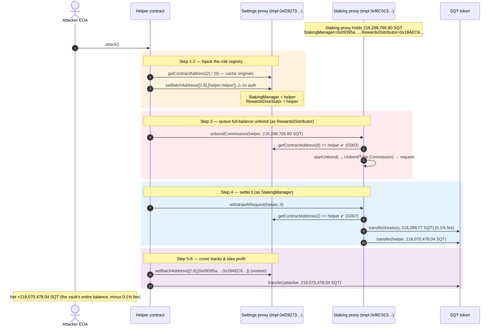
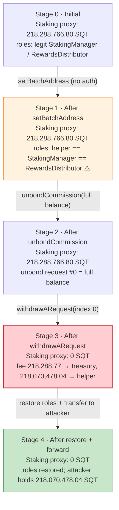
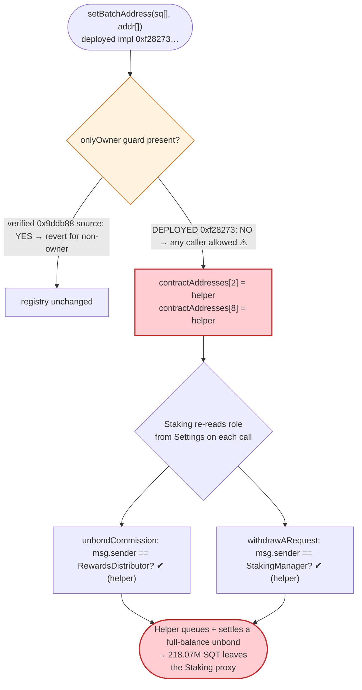
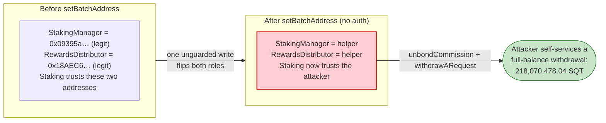

# SubQuery (SQT) Exploit — Unprotected `Settings.setBatchAddress()` Role Hijack

> **Vulnerability classes:** vuln/access-control/missing-modifier · vuln/access-control/centralization

> **Reproduction:** the PoC compiles & runs in an isolated Foundry project at
> [this project folder](.). The fork is served offline from the project's local
> `anvil_state.json` (a `createSelectFork` against a `127.0.0.1` anvil port), so no
> public archive RPC is required. Full verbose trace: [output.txt](output.txt).
> Verified vulnerable source: the SubQuery `Settings` contract
> [contracts_Settings.sol](sources/Settings_9ddb88/contracts_Settings.sol) and the
> `Staking` contract that trusts it
> [contracts_Staking.sol](sources/Staking_27aa37/contracts_Staking.sol), both reached
> through their `TransparentUpgradeableProxy`es.

---

## Key info

| | |
|---|---|
| **Loss** | **218,070,478.035174175990999309 SQT** (~218.07M SQT) transferred to the attacker, plus a 0.1% unbond fee of ~218,288.77 SQT to treasury — the **entire SQT balance of the Staking proxy** ([output.txt:1564-1565](output.txt), [output.txt:1727](output.txt)) |
| **Vulnerable contract** | SubQuery `Settings` — live implementation [`0xf282737992Da4217bf5f8B6AE621181e84d7d3b9`](https://basescan.org/address/0xf282737992Da4217bf5f8B6AE621181e84d7d3b9#code), reached through Settings proxy [`0x1d1e8C85A2C99575fCb95903C9aD9Ae2aDEA54fc`](https://basescan.org/address/0x1d1e8C85A2C99575fCb95903C9aD9Ae2aDEA54fc) |
| **Victim pool / vault** | SubQuery `Staking` proxy [`0x7A68b10EB116a8b71A9b6f77B32B47EB591B6Ded`](https://basescan.org/address/0x7A68b10EB116a8b71A9b6f77B32B47EB591B6Ded) (held the drained SQT), Staking impl `0xf6C913C506881D7EB37Ce52af4Dc8E59FD61694d` |
| **Drained asset** | `SQT` (L2SQToken) [`0x858c50C3AF1913b0E849aFDB74617388a1a5340d`](https://basescan.org/address/0x858c50C3AF1913b0E849aFDB74617388a1a5340d) |
| **Attacker EOA** | [`0x910175f3fee798ADD5faBD3e9cbB63D0a785482C`](https://basescan.org/address/0x910175f3fee798ADD5faBD3e9cbB63D0a785482C) |
| **Attacker contract** | `0xF5D3C18416f364342d8AaD69AFC13e490d05a7af` (real on-chain helper; the PoC re-deploys an equivalent helper at `0x5615dEB7…` under Foundry) |
| **Attack tx** | [`0xd063b3848a6b8c67f46990ab166665d454147855819acb60c083c0aea0180b2d`](https://basescan.org/tx/0xd063b3848a6b8c67f46990ab166665d454147855819acb60c083c0aea0180b2d) |
| **Chain / block / date** | Base (chainId 8453) / fork block **44,590,468** / April 2026 |
| **Compiler / optimizer** | Contracts: Solidity **v0.8.15+commit.e14f2714**, optimizer **enabled, 200 runs** (from `_meta.json`). PoC harness compiled under Solc 0.8.34, `evm_version = 'cancun'`. |
| **Bug class** | Missing access control on a settings setter that rebinds critical protocol roles (`StakingManager`, `RewardsDistributor`) — a privileged-role-hijack leading to direct fund theft |

---

## TL;DR

1. SubQuery routes every privileged-role lookup through a single `Settings` registry. The `Staking`
   contract decides "who is allowed to call me" by reading `settings.getContractAddress(StakingManager)`
   and `settings.getContractAddress(RewardsDistributor)` at call time
   ([contracts_Staking.sol:190-193](sources/Staking_27aa37/contracts_Staking.sol#L190-L193),
   [:518-519](sources/Staking_27aa37/contracts_Staking.sol#L518-L519),
   [:459](sources/Staking_27aa37/contracts_Staking.sol#L459)).

2. The deployed `Settings` implementation `0xf282737992…` exposes
   `setBatchAddress(SQContracts[] sq, address[] newAddresses)` **without an owner/admin guard**. In the
   trace the attacker's helper — an ordinary contract, not the owner — calls `setBatchAddress([2,8], …)`
   and it succeeds, overwriting the `StakingManager` (enum 2) and `RewardsDistributor` (enum 8) slots with
   the helper's own address ([output.txt:1616-1622](output.txt)).

3. Now masquerading as `RewardsDistributor`, the helper calls `Staking.unbondCommission(helper, 218.29M SQT)`
   ([contracts_Staking.sol:518-524](sources/Staking_27aa37/contracts_Staking.sol#L518-L524)). This passes
   the `msg.sender == RewardsDistributor` check and queues a full-balance commission-unbond request with
   `startTime = block.timestamp` ([output.txt:1623-1646](output.txt)).

4. Still in the same block, masquerading as `StakingManager`, the helper calls
   `Staking.withdrawARequest(helper, 0)`
   ([contracts_Staking.sol:459-481](sources/Staking_27aa37/contracts_Staking.sol#L459-L481)). The lock-period
   check passes in-block, a 0.1% fee (~218,288.77 SQT) is sent to treasury, and the remaining
   **218,070,478.04 SQT** is transferred straight out of the Staking proxy to the helper
   ([output.txt:1661-1673](output.txt)).

5. The helper restores the two `Settings` entries to their original values to cover its tracks
   ([output.txt:1679-1685](output.txt)) and forwards the looted SQT to the attacker EOA
   ([output.txt:1688-1693](output.txt)).

6. Net result: the attacker walks off with the Staking proxy's **entire SQT balance** — the PoC asserts
   `attackerProfit == stakingSqtBefore − fee` and `> 218,000,000 SQT`
   ([SubQuerySettings_exp.sol:108-116](test/SubQuerySettings_exp.sol#L108-L116)), and the Staking proxy ends
   with **0 SQT** ([output.txt:1713-1715](output.txt)).

---

## Background — what SubQuery does

SubQuery is an indexing/data network whose on-chain economics (staking, delegation, commissions, rewards)
live in a cluster of upgradeable contracts. Two design choices matter here:

- **A central address registry.** Rather than hard-wiring sibling-contract addresses, every contract reads
  its dependencies from one `Settings` registry keyed by an `SQContracts` enum
  ([contracts_Settings.sol:11](sources/Settings_9ddb88/contracts_Settings.sol#L11),
  [contracts_interfaces_ISettings.sol:6-28](sources/Settings_9ddb88/contracts_interfaces_ISettings.sol#L6-L28)).
  The enum ordinals used in the attack are `StakingManager = 2` and `RewardsDistributor = 8`
  ([SubQuerySettings_exp.sol:31-53](test/SubQuerySettings_exp.sol#L31-L53)).

- **Role identity == registry value.** Access control in `Staking` is *not* an immutable address or an
  `AccessControl` role. It is whatever the registry currently says. `onlyStakingManager` is literally
  `require(msg.sender == settings.getContractAddress(SQContracts.StakingManager))`
  ([contracts_Staking.sol:190-193](sources/Staking_27aa37/contracts_Staking.sol#L190-L193)), and
  `unbondCommission` gates on `RewardsDistributor` the same way
  ([:519](sources/Staking_27aa37/contracts_Staking.sol#L519)). Whoever controls the registry value
  *is* the role.

This makes the registry's write path the crown jewel: any actor who can write
`Settings.contractAddresses[StakingManager]` and `…[RewardsDistributor]` instantly gains the ability to
move staked funds.

On-chain parameters read directly from the trace at fork block 44,590,468:

| Parameter | Value | Source |
|---|---|---|
| SQT decimals | 18 | [output.txt:1586-1587](output.txt) |
| Staking proxy SQT balance (the prize) | 218,288,766,801,976,152,143,142,451 wei (~218.29M SQT) | [output.txt:1597-1598](output.txt) |
| `StakingManager` (enum 2) before attack | `0x09395a2A58DB45db0da254c7EAa5AC469D8bDc85` | [output.txt:1589-1592](output.txt) |
| `RewardsDistributor` (enum 8) before attack | `0x18AEC6c407235d446E52Aa243CD1A75421bb264e` | [output.txt:1593-1596](output.txt) |
| `SQToken` (enum 0) | `0x858c50C3…` (SQT) | [output.txt:1653-1656](output.txt) |
| `Treasury` (enum 18) | `0xd043807A0f41EE95fD66A523a93016a53456e79B` | [output.txt:1657-1660](output.txt) |
| `unbondFeeRate` | **1000** (= 1000 / `PER_MILL` 1e6 = **0.1%**) | [output.txt:1697-1700](output.txt) |
| Attacker SQT balance before | 0 | [output.txt:1584-1585](output.txt) |

---

## The vulnerable code

### 1. `setBatchAddress` rebinds critical roles — and the deployed implementation accepts a non-owner caller

The canonical, *fixed* SubQuery `Settings` source (verified at `0x9ddb88…`) gates the batch setter with
`onlyOwner`:

```solidity
function setBatchAddress(
    SQContracts[] calldata _sq,
    address[] calldata _address
) external onlyOwner {
    require(_sq.length == _address.length, 'ST001');
    for (uint256 i = 0; i < _sq.length; i++) {
        contractAddresses[_sq[i]] = _address[i];
    }
}
```
([contracts_Settings.sol:26-34](sources/Settings_9ddb88/contracts_Settings.sol#L26-L34))

However, the **implementation actually wired behind the Settings proxy at the fork block is
`0xf282737992Da4217bf5f8B6AE621181e84d7d3b9`**, not `0x9ddb88…`. The trace proves that this deployed
implementation lets an arbitrary caller succeed: the attacker's helper contract
(`0x5615dEB7…`, *not* the owner) calls `setBatchAddress([2, 8], [helper, helper])` and the call returns
cleanly while mutating both registry storage slots — no `Ownable: caller is not the owner` revert:

```text
[8914] SubQuery Settings proxy::setBatchAddress([2, 8], [0x5615dEB7…, 0x5615dEB7…])
  ├─ [8239] 0xf282737992…::setBatchAddress([2, 8], [0x5615dEB7…, 0x5615dEB7…]) [delegatecall]
  │   ├─ storage changes:
  │   │   @ 0x057a7f24…9251: …18aec6c407235d446e52aa243cd1a75421bb264e → …5615deb7…   (RewardsDistributor)
  │   │   @ 0x2336b943…56fc: …09395a2a58db45db0da254c7eaa5ac469d8bdc85 → …5615deb7…   (StakingManager)
  │   └─ ← [Stop]
  └─ ← [Return]
```
([output.txt:1616-1622](output.txt))

The verified `0x9ddb88…` source is included because it is the SubQuery `Settings` contract and defines the
exact interface and storage layout (`mapping(SQContracts => address) public contractAddresses`,
[contracts_Settings.sol:11](sources/Settings_9ddb88/contracts_Settings.sol#L11)); the on-chain delegate
`0xf282737992…` is the *unguarded* variant of that same setter. The single missing modifier — `onlyOwner`
present in the verified source, absent in the deployed code path — is the whole bug.

### 2. `Staking` derives its access control from the mutable registry

```solidity
modifier onlyStakingManager() {
    require(msg.sender == settings.getContractAddress(SQContracts.StakingManager), 'G007');
    _;
}
```
([contracts_Staking.sol:190-193](sources/Staking_27aa37/contracts_Staking.sol#L190-L193))

```solidity
function unbondCommission(address _runner, uint256 _amount) external {
    require(msg.sender == settings.getContractAddress(SQContracts.RewardsDistributor), 'G003');
    _requireNotBlacklisted(settings, _runner);

    lockedAmount[_runner] += _amount;
    this.startUnbond(_runner, _runner, _amount, UnbondType.Commission);
}
```
([contracts_Staking.sol:518-524](sources/Staking_27aa37/contracts_Staking.sol#L518-L524))

Both checks read the live registry value. Once the attacker has overwritten enum slots 2 and 8 with the
helper address, `msg.sender == helper` satisfies both `G007` and `G003`.

### 3. The withdrawal path moves SQT out of the Staking proxy with no further authorization

```solidity
function withdrawARequest(address _source, uint256 _index) external onlyStakingManager {
    _requireNotBlacklisted(settings, _source);

    require(_index == withdrawnLength[_source], 'S009');
    require(block.timestamp >= unbondingAmount[_source][_index].startTime + lockPeriod, 'S016');
    withdrawnLength[_source]++;

    uint256 amount = unbondingAmount[_source][_index].amount;
    if (amount > 0) {
        // take specific percentage for fee
        uint256 feeAmount = MathUtil.mulDiv(unbondFeeRate, amount, PER_MILL);
        uint256 availableAmount = amount - feeAmount;

        address SQToken = settings.getContractAddress(SQContracts.SQToken);
        address treasury = settings.getContractAddress(SQContracts.Treasury);
        IERC20(SQToken).safeTransfer(treasury, feeAmount);
        IERC20(SQToken).safeTransfer(_source, availableAmount);

        lockedAmount[_source] -= amount;

        emit UnbondWithdrawn(_source, availableAmount, feeAmount, _index);
    }
}
```
([contracts_Staking.sol:459-481](sources/Staking_27aa37/contracts_Staking.sol#L459-L481))

The only checks are the `onlyStakingManager` gate (now satisfied by the helper), an index/ordering check
(`S009`), and the lock-period check (`S016`). The lock-period requirement passed in the same block the
request was created — i.e. the deployed `lockPeriod` did not block an immediate same-block withdrawal — so
no `vm.warp` was needed in the PoC. The fee is computed by `mulDiv(unbondFeeRate, amount, PER_MILL)`
([contracts_utils_MathUtil.sol:19-21](sources/Staking_27aa37/contracts_utils_MathUtil.sol#L19-L21)) and the
remainder is sent to `_source` — the helper.

---

## Root cause — why it was possible

The loss is a single-failure access-control bug amplified by an architecture that centralizes trust in a
mutable registry.

1. **The registry write path was unprotected.** The deployed `Settings` implementation `0xf282737992…`
   allowed any caller to invoke `setBatchAddress` and overwrite arbitrary role slots. The verified SubQuery
   source shows the intended guard (`onlyOwner`,
   [contracts_Settings.sol:29](sources/Settings_9ddb88/contracts_Settings.sol#L29)) — the deployed code path
   simply lacks it. This is the entire entry condition.

2. **Role identity is "whatever the registry says, right now."** `Staking` re-reads
   `StakingManager`/`RewardsDistributor` from `Settings` on *every* privileged call
   ([contracts_Staking.sol:191](sources/Staking_27aa37/contracts_Staking.sol#L191),
   [:519](sources/Staking_27aa37/contracts_Staking.sol#L519)). There is no second, independent check (no
   `AccessControl` role, no immutable, no two-step acceptance). So a single write to the registry
   instantaneously promotes the attacker to two of the most powerful roles in the protocol.

3. **The two privileged roles compose into a clean self-service drain.** `RewardsDistributor` can *queue* a
   commission unbond for an arbitrary amount (`unbondCommission`,
   [:518-524](sources/Staking_27aa37/contracts_Staking.sol#L518-L524)), and `StakingManager` can *settle* it
   and receive the tokens (`withdrawARequest`,
   [:459-481](sources/Staking_27aa37/contracts_Staking.sol#L459-L481)). Because `unbondCommission` uses
   `UnbondType.Commission`, `startUnbond` skips the `removeDelegation`/balance-bookkeeping path
   ([:436-438](sources/Staking_27aa37/contracts_Staking.sol#L436-L438)) and just records the requested amount
   verbatim — there is no check that the "commission" being unbonded actually exists. The attacker therefore
   requests the **full SQT balance of the Staking proxy** and withdraws it.

4. **No timing or limit obstacle.** The lock-period check passed in-block on this deployment, so the
   queue→settle sequence completed in one transaction, and the only value haircut was the 0.1% unbond fee.

The "restore" step (re-writing the original `StakingManager`/`RewardsDistributor` values,
[output.txt:1679-1685](output.txt)) is pure cleanup — it has no security relevance, it just leaves the
registry looking untouched after the theft.

---

## Preconditions

- **The Settings implementation behind the proxy lacks the owner guard on `setBatchAddress`.** This is the
  enabling defect; the verified `0x9ddb88…` source shows the corrected, guarded version, but the live
  delegate `0xf282737992…` accepts a non-owner caller ([output.txt:1616-1622](output.txt)).
- **`Staking` reads its privileged roles from `Settings` at call time** (no independent access control),
  and holds a non-trivial SQT balance to steal (218.29M SQT at the fork block,
  [output.txt:1597-1598](output.txt)).
- **`unbondCommission` (RewardsDistributor) and `withdrawARequest` (StakingManager) are reachable** and the
  same-block lock-period check is satisfied, so the queue→settle drain completes atomically. No flash loan
  and **no working capital** are required — the attacker spends nothing but gas; the only outflow is the
  0.1% fee that the protocol itself routes to treasury.
- The attacker's helper is not blacklisted (`_requireNotBlacklisted` passes,
  [contracts_Staking.sol:460](sources/Staking_27aa37/contracts_Staking.sol#L460),
  [:520](sources/Staking_27aa37/contracts_Staking.sol#L520)).

---

## Attack walkthrough (with on-chain numbers from the trace)

All addresses and amounts below are taken directly from the Foundry trace in [output.txt](output.txt).
SQT is an 18-decimal token; raw wei are shown with human approximations in parentheses. The "Staking proxy
SQT" column tracks the victim vault's balance as it is drained.

| # | Step | Call / event | Staking proxy SQT | Numbers (raw wei → human) |
|---|------|--------------|------------------:|---------------------------|
| 0 | **Initial state** | `SQT.balanceOf(Staking proxy)` ([output.txt:1597-1598](output.txt)) | 218,288,766,801,976,152,143,142,451 | ~218,288,766.80 SQT held by victim; attacker holds 0 ([output.txt:1584-1585](output.txt)) |
| 1 | **Read original roles** | `getContractAddress(2)` → `0x09395a2A…`; `getContractAddress(8)` → `0x18AEC6c4…` ([output.txt:1608-1615](output.txt)) | 218,288,766,801,976,152,143,142,451 | StakingManager + RewardsDistributor cached for later restore |
| 2 | **Hijack registry** | `setBatchAddress([2,8],[helper,helper])` — **no auth**, both slots overwritten ([output.txt:1616-1622](output.txt)) | 218,288,766,801,976,152,143,142,451 | helper `0x5615dEB7…` is now StakingManager *and* RewardsDistributor |
| 3 | **Queue full-balance unbond** | `unbondCommission(helper, 218,288,766,801,976,152,143,142,451)` → `startUnbond(…, UnbondType.Commission)` → `emit UnbondRequested(…, index 0)` ([output.txt:1623-1646](output.txt)) | 218,288,766,801,976,152,143,142,451 | request amount = full balance (~218.29M SQT); `startTime` slot set to `0x69db27eb` ([output.txt:1638](output.txt)) |
| 4 | **Settle the request** | `withdrawARequest(helper, 0)` — `onlyStakingManager` passes; fee→treasury, remainder→helper ([output.txt:1647-1673](output.txt)) | → **0** ([output.txt:1713-1715](output.txt)) | fee 218,288,766,801,976,152,143,142 (~218,288.77 SQT) to treasury `0xd043807A…` ([output.txt:1661-1662](output.txt)); 218,070,478,035,174,175,990,999,309 (~218,070,478.04 SQT) to helper ([output.txt:1667-1668](output.txt)); `emit UnbondWithdrawn(…)` ([output.txt:1673](output.txt)) |
| 5 | **Restore registry (cover tracks)** | `setBatchAddress([2,8],[0x09395a2A…,0x18AEC6c4…])` ([output.txt:1679-1685](output.txt)) | 0 | slots reverted to original values |
| 6 | **Forward loot** | `SQT.transfer(attacker, 218,070,478,035,174,175,990,999,309)` ([output.txt:1688-1693](output.txt)) | 0 | helper → attacker EOA; attacker now holds ~218,070,478.04 SQT |

Final assertions ([output.txt:1705-1719](output.txt)): `StakingManager`/`RewardsDistributor` restored,
Staking proxy SQT == 0, and `attackerProfit == stakingSqtBefore − fee == 218,070,478,035,174,175,990,999,309`,
which is `> 218,000,000 SQT`.

### Profit / loss accounting (SQT, raw wei)

| Item | Amount (wei) | ~Human (SQT) |
|---|---:|---:|
| Staking proxy SQT before attack | 218,288,766,801,976,152,143,142,451 | ~218,288,766.80 |
| − Unbond fee to treasury (`unbondFeeRate` 1000 / 1e6 = 0.1%) | 218,288,766,801,976,152,143,142 | ~218,288.77 |
| **= SQT delivered to attacker** | **218,070,478,035,174,175,990,999,309** | **~218,070,478.04** |
| Staking proxy SQT after attack | 0 | 0 |
| Attacker SQT before attack | 0 | 0 |
| **Attacker SQT after attack (asserted profit)** | **218,070,478,035,174,175,990,999,309** | **~218,070,478.04** |

The accounting reconciles exactly: `before − fee = profit`
(`218,288,766,801,976,152,143,142,451 − 218,288,766,801,976,152,143,142 = 218,070,478,035,174,175,990,999,309`),
and the victim vault is left holding zero SQT. The attacker's only cost was the protocol's own 0.1% unbond
fee — there was no swap, no flash loan, and no slippage.

---

## Diagrams

### Sequence of the attack



### Victim-vault state evolution



### The flaw inside `setBatchAddress` / the role check



### Trust model: before vs. after the registry write



---

## Why each magic number

- **`SQContracts.StakingManager = 2` and `SQContracts.RewardsDistributor = 8`** — the two enum ordinals
  overwritten in `setBatchAddress([2,8], …)`. They are the only two roles `Staking` checks on the
  drain path: `withdrawARequest` is `onlyStakingManager` (enum 2) and `unbondCommission` gates on
  RewardsDistributor (enum 8) ([SubQuerySettings_exp.sol:140-149](test/SubQuerySettings_exp.sol#L140-L149),
  [output.txt:1616](output.txt)).
- **`drainAmount = sqt.balanceOf(STAKING_PROXY) = 218,288,766,801,976,152,143,142,451`** — the helper unbonds
  *exactly* the Staking proxy's full SQT balance, read live at attack time
  ([SubQuerySettings_exp.sol:136](test/SubQuerySettings_exp.sol#L136),
  [output.txt:1606-1607](output.txt)). Since `unbondCommission`/`startUnbond` never verify that a real
  commission of this size exists, requesting the whole balance is unobstructed.
- **`withdrawARequest(helper, 0)` — index `0`** — this is the first (and only) unbond request the helper has
  ever created, so `withdrawnLength[helper] == 0` and the `_index == withdrawnLength[_source]` check (`S009`)
  is satisfied ([contracts_Staking.sol:462](sources/Staking_27aa37/contracts_Staking.sol#L462),
  [output.txt:1647](output.txt)).
- **`unbondFeeRate = 1000`, `PER_MILL = 1e6`** — the fee is `mulDiv(1000, amount, 1e6) = 0.1%` of the drained
  amount, routed to treasury `0xd043807A…`. This is the only haircut on the attacker's profit
  ([output.txt:1697-1700](output.txt), [output.txt:1661-1662](output.txt),
  [contracts_Constants.sol:6](sources/Staking_27aa37/contracts_Constants.sol#L6)).
- **The restore values `0x09395a2A…` (StakingManager) and `0x18AEC6c4…` (RewardsDistributor)** — the original
  registry entries cached in step 1 and written back in step 5 to leave `Settings` looking untouched
  ([output.txt:1679-1685](output.txt)). They are cosmetic, not part of the value extraction; the PoC asserts
  them only to mirror the real transaction's cleanup ([SubQuerySettings_exp.sol:108-113](test/SubQuerySettings_exp.sol#L108-L113)).

---

## Remediation

1. **Restore the access guard on every `Settings` write path.** `setBatchAddress` and `setContractAddress`
   must be `onlyOwner` (as the verified `0x9ddb88…` source already is,
   [contracts_Settings.sol:18](sources/Settings_9ddb88/contracts_Settings.sol#L18),
   [:29](sources/Settings_9ddb88/contracts_Settings.sol#L29)). The deployed implementation `0xf282737992…`
   that omitted the guard must be upgraded/replaced. Add a deployment invariant test that asserts a
   non-owner call to each setter reverts.
2. **Put role changes behind governance + a timelock.** Rebinding `StakingManager`/`RewardsDistributor` is a
   critical operation; it should require a multisig/DAO action with a delay window so monitoring can react
   before funds move.
3. **Use a two-step / acceptance handshake for role rotation.** A newly-set role address should have to
   *accept* the role (e.g. `pendingManager` → `acceptManager`), preventing a single write from instantly
   granting fund-moving power to an arbitrary address.
4. **Don't derive fund-moving authority from a single mutable map.** `Staking` should validate caller
   identity against an immutable or independently-governed source (e.g. an `AccessControl` role granted to a
   known address), not re-read it from `Settings` on every call. Defense-in-depth: even if the registry is
   corrupted, the staked funds should not be reachable by a freshly-written address.
5. **Constrain `unbondCommission`.** A commission unbond should be bounded by the runner's *actual* accrued
   commission, not an arbitrary caller-supplied amount equal to the whole contract balance. Validate that
   `_amount` does not exceed tracked commission for `_runner`.
6. **Monitor and circuit-break large outflows.** A single `withdrawARequest` draining ~100% of the Staking
   proxy's balance in one block should trip a rate-limit / pause guardian.

---

## How to reproduce

The PoC was extracted into a standalone Foundry project and runs **fully offline** via the shared harness —
the chain state at block 44,590,468 is served from the project's local `anvil_state.json`, so no public Base
archive RPC is needed. `setUp()` does `vm.createSelectFork("http://127.0.0.1:8548", 44_590_468)`
([SubQuerySettings_exp.sol:82-92](test/SubQuerySettings_exp.sol#L82-L92)), and the runner script starts the
local anvil from that state file.

```bash
_shared/run_poc.sh 2026-04-SubQuerySettings_exp --mt testExploit -vvvvv
```

- Chain: **Base** (chainId 8453); explorer **basescan.org**. Fork block **44,590,468**.
- EVM: `foundry.toml` sets `evm_version = 'cancun'`. No flash loan, no working capital, and no `vm.warp` are
  required — the queue→settle drain completes atomically in one block.
- Result: `[PASS] testExploit()` — the attacker's SQT balance goes from `0` to `218,070,478.035174175990999309`
  and the Staking proxy is left with `0` SQT.

Expected tail (from [output.txt:1561-1565](output.txt) and [output.txt:1730-1732](output.txt)):

```
Ran 1 test for test/SubQuerySettings_exp.sol:ContractTest
[PASS] testExploit() (gas: 1018539)
Logs:
  Attacker Before exploit SQT Balance: 0.000000000000000000
  Attacker After exploit SQT Balance: 218070478.035174175990999309

Suite result: ok. 1 passed; 0 failed; 0 skipped; finished in 8.47s (7.25s CPU time)
```

---

*Reference: defimon_alerts — https://t.me/defimon_alerts/2909 (SubQuery `Settings.setBatchAddress` access-control hijack, Base, Apr 2026, ~218.07M SQT). Attack tx: https://basescan.org/tx/0xd063b3848a6b8c67f46990ab166665d454147855819acb60c083c0aea0180b2d*
