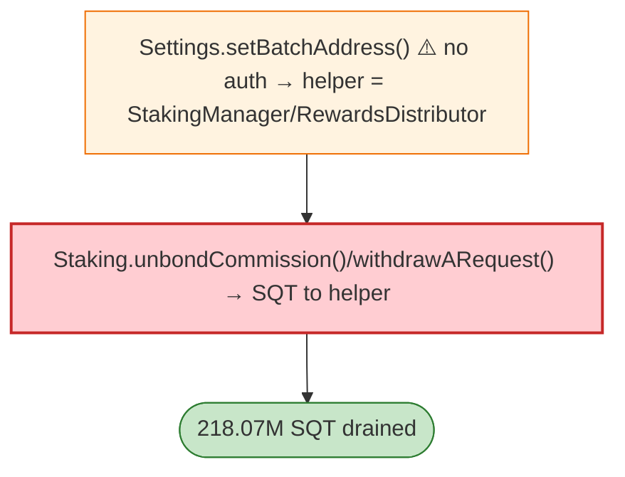

# SubQuery (SQT) Exploit — Unprotected `Settings.setBatchAddress` Hijack

> **Reproduction:** the PoC compiles & runs in an isolated Foundry project at
> [this project folder](.). Full verbose trace: [output.txt](output.txt).
> Verified vulnerable source: [Settings](sources/Settings_9ddb88),
> [Staking](sources/Staking_27aa37), [L2SQToken](sources/L2SQToken_858c50) + 2 proxies.

---

## Key info

| | |
|---|---|
| **Loss** | 218.07M SQT; tx `0xd063b384…` |
| **Vulnerable contract** | SubQuery `Settings` `0x9ddb88…`, `Staking` proxy `0x7A68b1…` (victim) |
| **Attacker** | `0x910175f3…` (contract `0xF5D3C18…`) |
| **Chain / block / date** | Base / Apr 2026 |
| **Bug class** | Access control — `Settings.setBatchAddress()` was unprotected; the attacker set its helper as `StakingManager` and `RewardsDistributor`, then staking honoured `unbondCommission()`/`withdrawARequest()` to move the proxy's SQT out. |

---

## TL;DR

Per the embedded analysis: the attacker used the **unprotected `Settings.setBatchAddress()`** to make
the attack helper the `StakingManager` and `RewardsDistributor`. Staking then accepted the helper's
`unbondCommission()` and `withdrawARequest()` calls and transferred the Staking proxy's SQT balance to
the helper, which forwarded it to the attacker — 218.07M SQT.

---

## Root cause

A **missing access control on `setBatchAddress`** — a settings/admin setter that rebinds critical
protocol roles (StakingManager, RewardsDistributor) to attacker addresses.

---

## Diagrams



---

## Remediation

1. Gate `setBatchAddress` behind admin/governance + timelock.
2. Role changes require acceptance / two-step.
3. Staking must validate caller role independently of a mutable settings map.

---

## How to reproduce

```bash
_shared/run_poc.sh 2026-04-SubQuerySettings_exp -vvvvv
```

- RPC: Base archive. Result: `[PASS]` — 218.07M SQT drained.

---

*Reference: SubQuery `Settings.setBatchAddress` access-control flaw, Base, Apr 2026 (218.07M SQT).*
