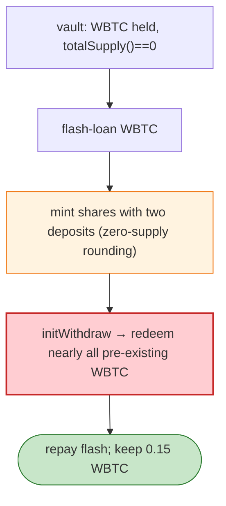

# Thetanuts BTC/USD Vault Exploit — Share Rounding When `totalSupply == 0`

> **Reproduction:** the PoC compiles & runs in an isolated Foundry project at
> [this project folder](.). Full verbose trace: [output.txt](output.txt).
> Verified vulnerable source: [WBTC](sources/WBTC_2260FA), [Morpho](sources/Morpho_BBBBBb).

---

## Key info

| | |
|---|---|
| **Loss** | 0.15 WBTC; tx `0x1bc83899…`; attacker `0xAea2d933…` |
| **Vulnerable contract** | Thetanuts BTC/USD covered-call vault `0x80b8eeb3…` (held WBTC while `totalSupply() == 0`) |
| **Flash source** | WBTC flash loan |
| **Chain / block / date** | Ethereum mainnet / Apr 2026 |
| **Bug class** | ERC4626 share-rounding at zero supply — the vault held WBTC while `totalSupply() == 0`; the attacker minted shares with two deposits and `initWithdraw`-redeemed nearly all the pre-existing WBTC. |

---

## TL;DR

Per the embedded analysis: the Thetanuts BTC/USD covered-call vault **held WBTC while `totalSupply()`
was zero**. The attacker flash-loaned WBTC, **minted shares with two deposits** (the rounding on
first-deposit / zero-supply mint credits more shares than the asset warrants), and called
`initWithdraw(uint256)` to **redeem nearly all of the vault's pre-existing WBTC**.

---

## Root cause

A **share-rounding / zero-supply mint flaw** (ERC4626 first-deposit inflation): the vault had assets but
no shares outstanding, so minting a small amount of shares entitled the holder to the entire pre-existing
asset balance.

---

## Diagrams



---

## Remediation

1. Dead-share / first-deposit lock (mint initial shares to the vault/burn address at creation).
2. Round mint up / redeem down; cap first-mint share claim to the actual deposit.
3. Reject mint/redeem while `totalSupply == 0 && totalAssets > 0` (treat as donation to LPs).

---

## How to reproduce

```bash
_shared/run_poc.sh 2026-04-ThetanutsVaultShareRounding_exp -vvvvv
```

- RPC: mainnet archive. Result: `[PASS]` — vault WBTC redeemed via zero-supply mint.

---

*Reference: Thetanuts BTC/USD vault zero-supply share rounding, mainnet, Apr 2026 (0.15 WBTC).*
