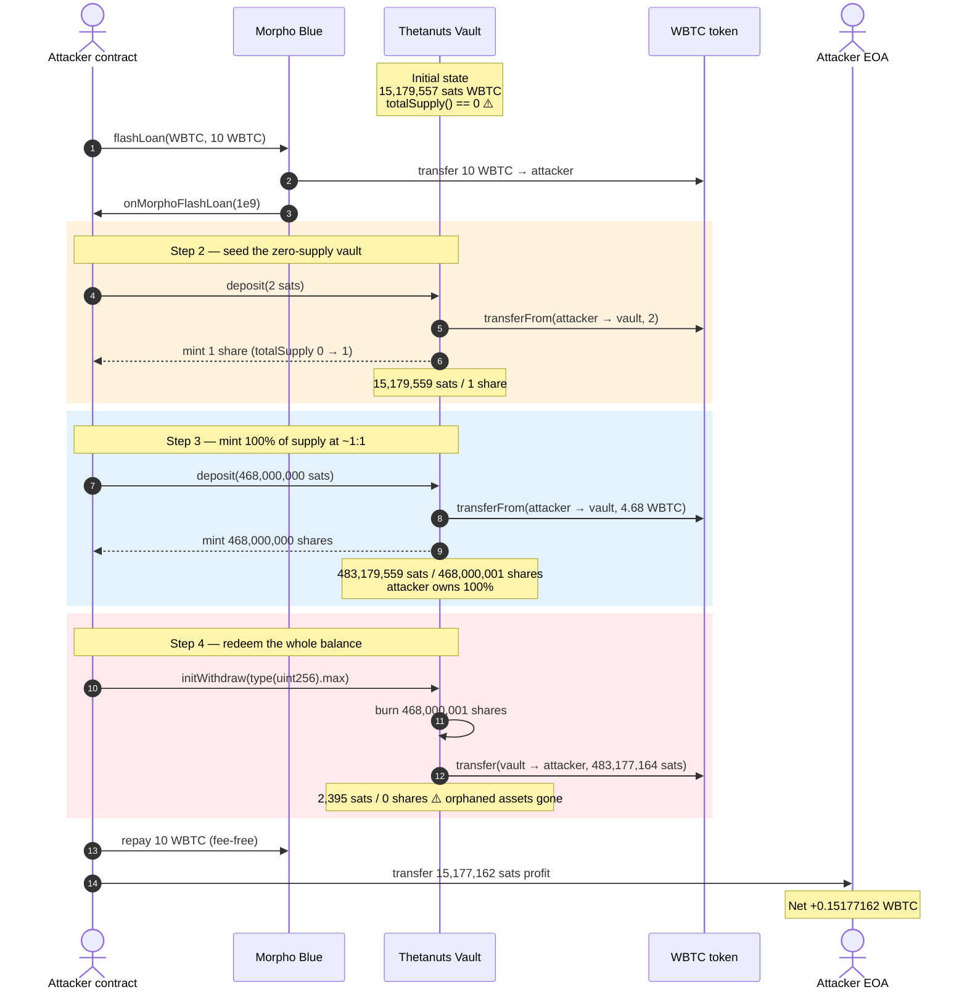
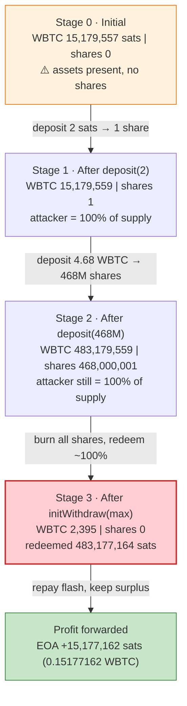
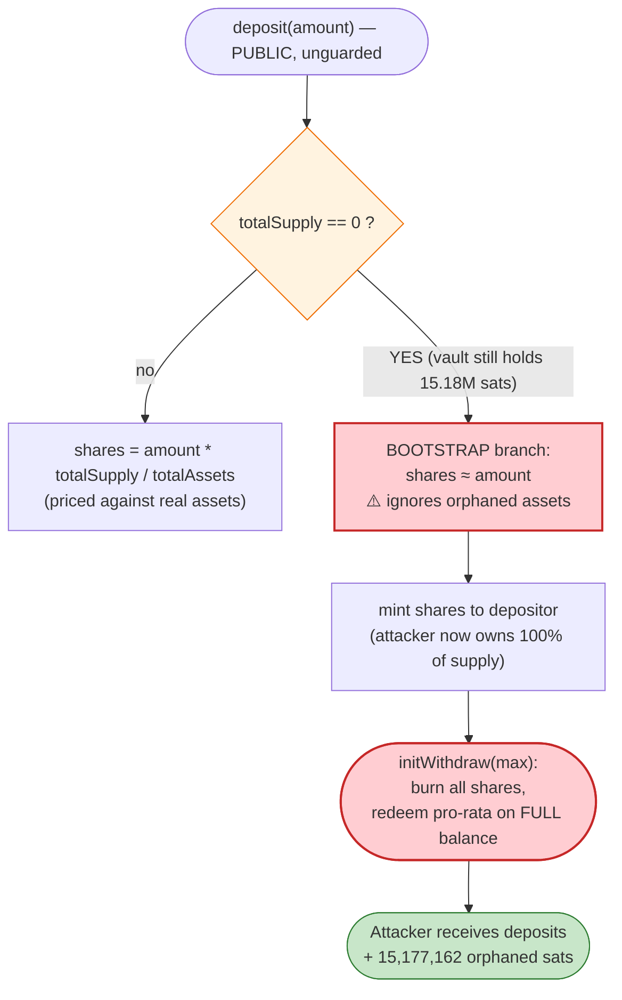
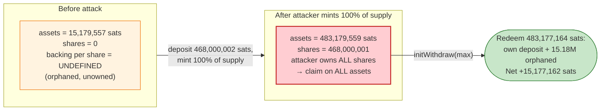

# Thetanuts BTC/USD Vault Exploit — ERC4626-Style First-Depositor Share Rounding at `totalSupply() == 0`

> **Vulnerability classes:** vuln/arithmetic/rounding · vuln/arithmetic/precision-loss

> **Reproduction:** the PoC compiles & runs in an isolated Foundry project at
> [this project folder](.) (the umbrella DeFiHackLabs repo contains several unrelated PoCs that
> do not all compile together, so this one was extracted and is served from a local anvil fork).
> Full verbose trace: [output.txt](output.txt).
> Verified sources used by the PoC (the WBTC token and the Morpho Blue flash-loan provider):
> [WBTC](sources/WBTC_2260FA/WBTC.sol), [Morpho](sources/Morpho_BBBBBb/src_Morpho.sol).
> The Thetanuts vault's own bytecode is **not verified on Etherscan**, so its internal share math is
> reconstructed below from the on-chain trace rather than from source.

---

## Key info

| | |
|---|---|
| **Loss** | **0.15177162 WBTC** (15,177,162 sats) drained from the Thetanuts BTC/USD vault's pre-existing balance — see attack tx [`0x1bc83899…`](https://etherscan.io/tx/0x1bc83899060c27106b6fb4257b208925085794e83b21c444854442fd3554862c) |
| **Vulnerable contract** | Thetanuts BTC/USD covered-call vault — [`0x80b8EEb34A2Ba5dd90c61e02a12eA30515dCa6f5`](https://etherscan.io/address/0x80b8eeb34a2ba5dd90c61e02a12ea30515dca6f5#code) (held WBTC while `totalSupply() == 0`) |
| **Victim vault / asset** | Same address; the prize is the **15,179,557 sats (~0.1518 WBTC)** the vault held with zero shares outstanding |
| **Flash source** | Morpho Blue — [`0xBBBBBbbBBb9cC5e90e3b3Af64bdAF62C37EEFFCb`](https://etherscan.io/address/0xBBBBBbbBBb9cC5e90e3b3Af64bdAF62C37EEFFCb) (fee-free WBTC flash loan) |
| **Attacker EOA** | [`0xAea2d93328242389B3e34271252b1bC9253b718a`](https://etherscan.io/address/0xAea2d93328242389B3e34271252b1bC9253b718a) |
| **Attacker contract** | [`0xE26F5a496db55De2a69Bdc4EEF023927B3c2A209`](https://etherscan.io/address/0xE26F5a496db55De2a69Bdc4EEF023927B3c2A209) (historical; PoC re-implements its logic) |
| **Attack tx** | [`0x1bc83899060c27106b6fb4257b208925085794e83b21c444854442fd3554862c`](https://etherscan.io/tx/0x1bc83899060c27106b6fb4257b208925085794e83b21c444854442fd3554862c) |
| **Chain / block / date** | Ethereum mainnet / fork block **24,923,218** / Apr 2026 |
| **Compiler / optimizer** | WBTC: Solidity v0.4.24, optimizer **enabled, 200 runs**; Morpho Blue: Solidity v0.8.19, optimizer **enabled, 999,999 runs** (vault impl unverified) |
| **Bug class** | ERC4626-style first-depositor / zero-supply share rounding: a vault that holds assets while `totalSupply() == 0` lets a fresh depositor mint shares whose pro-rata claim sweeps the entire pre-existing asset balance |

---

## TL;DR

1. The Thetanuts BTC/USD covered-call vault at `0x80b8EEb3…` was in a degenerate state: it **held
   15,179,557 sats of WBTC** ([output.txt:1592](output.txt)) while its **`totalSupply()` was `0`**
   ([output.txt:1596](output.txt)). No shares existed, yet assets did — so the next minted share
   would represent a claim on assets it never paid for.

2. The attacker took a **fee-free 10 WBTC flash loan from Morpho Blue** ([output.txt:1617](output.txt))
   purely as working capital — they needed WBTC on hand to deposit, not to manipulate any price.

3. Inside the Morpho callback they made a **dust deposit of `2` sats** (`deposit(2)`), which minted
   exactly **1 share** ([output.txt:1626-1643](output.txt)). This bootstrapped `totalSupply` from `0`
   to `1` and seeded the share-price reference.

4. They then made the **main deposit of `468,000,000` sats** (`deposit(468000000)`), which minted
   **468,000,000 shares** ([output.txt:1646-1663](output.txt)) at a ~1:1 share rate. The attacker now
   held **468,000,001 shares** ([output.txt:1667](output.txt)) — the *entire* share supply — against a
   vault whose WBTC balance was now **483,179,559 sats** ([output.txt:1655](output.txt)) (their
   468,000,002 sats of deposits **plus** the 15,179,557 sats that were already sitting there).

5. They called **`initWithdraw(type(uint256).max)`** ([output.txt:1670](output.txt)). The vault burned
   all 468,000,001 of the attacker's shares and, because those shares were 100% of supply, redeemed a
   pro-rata claim on essentially the whole balance: it transferred out **483,177,164 sats**
   ([output.txt:1674-1675](output.txt)), leaving only **2,395 sats** of rounding dust in the vault
   ([output.txt:1682](output.txt)).

6. After repaying the 10 WBTC flash loan ([output.txt:1696](output.txt)), the attacker walked away with
   **483,177,164 − 468,000,002 = 15,177,162 sats** = **0.15177162 WBTC** ([output.txt:1705](output.txt)),
   which is precisely the vault's pre-existing balance minus the 2,395-sat dust
   (`15,179,557 − 2,395 = 15,177,162`). The PoC asserts this exact reconciliation:
   `profit == preExistingVaultWbtc − residualVaultWbtc` ([test/ThetanutsVaultShareRounding_exp.sol:73](test/ThetanutsVaultShareRounding_exp.sol#L73)).

The flash loan was a convenience, not the weapon. The weapon is the **zero-supply / non-zero-assets**
vault state: shares minted into it are over-collateralized by the orphaned assets, and redeeming them
sweeps the orphaned assets out.

---

## Background — what the Thetanuts BTC/USD vault does

Thetanuts runs option-vault strategies (covered calls / cash-secured puts). The BTC/USD vault at
`0x80b8EEb3…` is a tokenized share vault denominated in **WBTC** (8 decimals): depositors send WBTC
and receive vault shares (`deposit` returns minted `shares`), and they redeem shares back for WBTC
through a withdrawal flow (`initWithdraw`). The minimal interface the PoC drives is:

```solidity
interface IThetanutsVault {
    function balanceOf(address account) external view returns (uint256);
    function totalSupply() external view returns (uint256);
    function deposit(uint256 amount) external returns (uint256 shares);
    function initWithdraw(uint256 shares) external returns (uint256 assets);
}
```
([test/ThetanutsVaultShareRounding_exp.sol:99-104](test/ThetanutsVaultShareRounding_exp.sol#L99-L104))

The vault's verified source is not published on Etherscan, so the share-conversion math is not directly
quotable. What the trace lets us state with certainty is the vault's behavior in the exact state it was
attacked in. The relevant on-chain facts at the fork block, read directly from the trace:

| Parameter | Value | Source |
|---|---|---|
| Vault WBTC balance (pre-attack) | **15,179,557 sats** (~0.1518 WBTC) | [output.txt:1592](output.txt) |
| Vault `totalSupply()` (pre-attack) | **0** | [output.txt:1596](output.txt) |
| Attacker vault shares (pre-attack) | 0 | [output.txt:1599-1600](output.txt) |
| Historical attack contract vault shares (pre-attack) | 0 | [output.txt:1603-1604](output.txt) |
| WBTC decimals | 8 | [output.txt:1586-1587](output.txt) |
| Shares minted by `deposit(2)` | **1** | [output.txt:1643](output.txt) |
| Shares minted by `deposit(468000000)` | **468,000,000** | [output.txt:1663](output.txt) |
| `initWithdraw(max)` WBTC returned | **483,177,164 sats** | [output.txt:1688](output.txt) |
| Vault WBTC residual (post-attack) | **2,395 sats** | [output.txt:1682](output.txt) |

The single fact that makes this exploitable is the first row combined with the second:
**assets present, shares absent.** A correctly-initialized share vault never lets `totalSupply()` reach
`0` while `totalAssets() > 0` — the orphaned assets become a free bounty for whoever mints next.

---

## The vulnerable code

> The Thetanuts vault is **unverified**, so no Solidity for the buggy `deposit`/`initWithdraw` can be
> quoted. The two snippets below are the *verified* dependencies the PoC relies on, plus the PoC steps
> that drive the bug. The vulnerability itself is described from the trace in **Root cause**.

### 1. The flash-loan provider is fee-free — capital is borrowed and repaid 1:1

```solidity
function flashLoan(address token, uint256 assets, bytes calldata data) external {
    require(assets != 0, ErrorsLib.ZERO_ASSETS);

    emit EventsLib.FlashLoan(msg.sender, token, assets);

    IERC20(token).safeTransfer(msg.sender, assets);          // send the loan out

    IMorphoFlashLoanCallback(msg.sender).onMorphoFlashLoan(assets, data);  // attacker logic runs here

    IERC20(token).safeTransferFrom(msg.sender, address(this), assets);     // pull back EXACTLY assets
}
```
([sources/Morpho_BBBBBb/src_Morpho.sol#L422-L432](sources/Morpho_BBBBBb/src_Morpho.sol#L422-L432))

Morpho Blue charges no flash-loan premium: it sends `assets` out and pulls `assets` back. The attacker
therefore borrows 10 WBTC, uses it as deposit float, and repays exactly 10 WBTC with no fee drag — so
every sat of profit is pure vault drain, not a financing artifact.

### 2. The PoC drives the bug in four moves inside the flash callback

```solidity
function onMorphoFlashLoan(uint256 assets, bytes calldata) external {
    require(msg.sender == MORPHO_BLUE, "only Morpho callback");
    require(assets == FLASH_LOAN_AMOUNT, "unexpected loan amount");

    // step 2: seed the zero-supply vault with the observed dust deposit.
    uint256 firstDeposit = 2;
    uint256 firstShares = vault.deposit(firstDeposit);
    assertEq(firstShares, 1, "dust deposit mints one share");

    // step 3: deposit the main WBTC amount at the vulnerable share rate.
    uint256 secondDeposit = 468_000_000;
    uint256 secondShares = vault.deposit(secondDeposit);
    assertEq(secondShares, secondDeposit, "main deposit mints expected shares");
    assertEq(vault.balanceOf(address(this)), firstShares + secondShares, "attacker holds all minted shares");

    // step 4: an oversized withdraw request burns the attacker shares and releases the vault balance.
    uint256 withdrawn = vault.initWithdraw(type(uint256).max);
    assertGt(withdrawn, secondDeposit, "withdraw includes pre-existing vault WBTC");
    assertEq(vault.balanceOf(address(this)), 0, "shares burned");
}
```
([test/ThetanutsVaultShareRounding_exp.sol:77-96](test/ThetanutsVaultShareRounding_exp.sol#L77-L96))

The assertion `withdrawn > secondDeposit` ([:94](test/ThetanutsVaultShareRounding_exp.sol#L94)) is the
crux: the attacker deposited 468,000,000 sats but redeemed **more** than that, and the surplus is the
orphaned pre-existing balance.

---

## Root cause — why it was possible

A share vault converts between **assets** and **shares** with a price that is, in the standard ERC4626
formulation, `pricePerShare = totalAssets / totalSupply`. Two edge cases must be handled or the
conversion degenerates:

- **`totalSupply == 0`** — there is no price; the first depositor's share count is set by a bootstrap
  rule (typically `shares = assets`, or `assets` scaled by an offset).
- **`totalSupply == 0` *while* `totalAssets > 0`** — the bootstrap rule mints shares as if the vault
  were empty, but the vault is *not* empty. The freshly-minted shares therefore acquire a pro-rata
  claim on assets the depositor never contributed.

The Thetanuts vault was sitting in exactly the second, pathological state: **15,179,557 sats of WBTC
with 0 shares** ([output.txt:1592](output.txt), [output.txt:1596](output.txt)). However those orphaned
assets came to be there (residual dust from a prior epoch's settlement, a rounding remainder, or a
direct transfer), the vault never reset or socialized them, and it did not block deposits while
`totalSupply == 0 && totalAssets > 0`.

The attack then exploits the bootstrap rule mechanically:

1. **Seed a single share with dust.** `deposit(2)` mints **1 share** ([output.txt:1643](output.txt)).
   `totalSupply` is now `1`. Crucially the share-price reference the vault adopts treats the deposit as
   if establishing a near-1:1 sat↔share rate, *ignoring* the 15.18M sats already present.

2. **Mint the bulk of supply at the same cheap rate.** `deposit(468000000)` mints **468,000,000 shares**
   ([output.txt:1663](output.txt)) — again ~1:1, again blind to the orphaned balance. The attacker now
   owns **468,000,001 of 468,000,001 shares = 100%** ([output.txt:1667](output.txt)), backed by a vault
   holding **483,179,559 sats** ([output.txt:1655](output.txt)) (`468,000,002` deposited + `15,179,557`
   orphaned + a `+/-` rounding sat).

3. **Redeem 100% of supply against 100% of assets.** `initWithdraw(type(uint256).max)` burns all
   468,000,001 shares ([output.txt:1671](output.txt)) and pays out a pro-rata claim on the whole
   balance: **483,177,164 sats** ([output.txt:1674-1675](output.txt)), leaving 2,395 sats of dust
   ([output.txt:1682](output.txt)).

Because the attacker's shares were 100% of supply, their pro-rata claim was ~100% of assets — including
the 15,179,557 sats they never deposited. The net is `483,177,164 − 468,000,002 = 15,177,162 sats`,
identical to `pre-existing balance − dust` (`15,179,557 − 2,395`). The vault socialized its orphaned
assets to the first (and only) shareholder, which the attacker arranged to be themselves.

Equivalent ERC4626 framings of the same defect:

- **First-depositor inflation, inverted.** The classic first-depositor attack *inflates* share price to
  steal a *second* victim's deposit. Here there is no second victim — the vault itself is the donor, and
  its orphaned assets are the loot. No price inflation is even required.
- **Missing zero-supply guard.** A one-line invariant — *reject `deposit`/`withdraw` while
  `totalSupply == 0 && totalAssets > 0`* — would have reverted the seeding deposit and stopped the
  attack at step 1.
- **No dead shares.** Minting a small lock of permanent shares (to the vault or a burn address) at
  creation keeps `totalSupply` permanently `> 0`, so the bootstrap branch can never be re-entered after
  the vault has accrued assets.

---

## Preconditions

- **The vault holds assets while `totalSupply() == 0`.** Verified live:
  `wbtc.balanceOf(vault) == 15,179,557 > 0` ([output.txt:1592](output.txt)) and
  `vault.totalSupply() == 0` ([output.txt:1596](output.txt)). The PoC hard-asserts both before
  attacking ([test/ThetanutsVaultShareRounding_exp.sol:53-54](test/ThetanutsVaultShareRounding_exp.sol#L53-L54)).
- **`deposit` and `initWithdraw` are open and unguarded** for an arbitrary EOA/contract — no
  whitelist, no minimum first-deposit, no zero-supply block.
- **Working capital in WBTC** to fund the deposits. Peak outlay is the `468,000,002` sats of deposits
  plus headroom, all sourced from a **fee-free Morpho Blue flash loan of 10 WBTC**
  ([output.txt:1617](output.txt)) and fully repaid intra-transaction
  ([output.txt:1696](output.txt)) — so the attack is **flash-loanable** and requires no real capital.
- No oracle, no price manipulation, and no second victim are needed. The only "victim" is the vault's
  own orphaned balance.

---

## Attack walkthrough (with on-chain numbers from the trace)

All figures are taken directly from `Transfer`/`Deposit`/`Withdraw` events and `balanceOf`/`totalSupply`
returns in [output.txt](output.txt). WBTC has **8 decimals**, so 1 WBTC = 100,000,000 sats; raw sat
amounts are shown with a human-readable WBTC approximation in parentheses.

| # | Step | Vault WBTC balance (sats) | Vault shares (`totalSupply`) | Attacker shares | Effect |
|---|------|--------------------------:|-----------------------------:|----------------:|--------|
| 0 | **Initial state** | 15,179,557 (~0.15180) ([output.txt:1592](output.txt)) | 0 ([output.txt:1596](output.txt)) | 0 ([output.txt:1600](output.txt)) | Orphaned assets, zero shares — the bug condition. |
| 1 | **Flash loan** 1,000,000,000 sats (10 WBTC) from Morpho → attacker | 15,179,557 (unchanged) | 0 | 0 | Working capital, fee-free ([output.txt:1617-1620](output.txt)). |
| 2 | **`deposit(2)`** — send 2 sats in, mint 1 share | 15,179,559 (~0.15180) ([output.txt:1635](output.txt)) | 1 ([output.txt:1643](output.txt)) | 1 | `totalSupply` bootstrapped from 0→1; orphaned balance ignored by the share rate. |
| 3 | **`deposit(468000000)`** — send 468,000,000 sats (4.68 WBTC) in, mint 468,000,000 shares | 483,179,559 (~4.83180) ([output.txt:1655](output.txt)) | 468,000,001 ([output.txt:1662](output.txt)) | 468,000,001 ([output.txt:1667](output.txt)) | Attacker now owns 100% of supply; vault holds deposits **plus** the orphaned 15.18M sats. |
| 4 | **`initWithdraw(type(uint256).max)`** — burn 468,000,001 shares, redeem pro-rata | **2,395** (~0.0000024) ([output.txt:1682](output.txt)) | **0** ([output.txt:1686-1687](output.txt)) | 0 ([output.txt:1692](output.txt)) | Burns all shares ([output.txt:1671](output.txt)); transfers out **483,177,164 sats** ([output.txt:1674-1675](output.txt)). Vault left with 2,395-sat dust. |
| 5 | **Repay flash loan** 1,000,000,000 sats to Morpho | 2,395 (unchanged) | 0 | 0 | `transferFrom(attacker → Morpho, 1e9)` ([output.txt:1696-1697](output.txt)); no fee. |
| 6 | **Forward profit to attacker EOA** 15,177,162 sats (~0.15177 WBTC) | 2,395 | 0 | 0 | `transfer(ATTACKER, 15,177,162)` ([output.txt:1706-1707](output.txt)); final EOA balance 15,177,162 ([output.txt:1713](output.txt)). |

**Why the redeem over-pays the deposit:** at step 4 the attacker holds 468,000,001 shares which equal
**100% of `totalSupply`**. The vault redeems their pro-rata claim on the **entire** WBTC balance of
483,179,559 sats, paying out 483,177,164 (the 2,395-sat shortfall is redemption rounding-down that stays
in the vault). They put in only 468,000,002 sats of deposits, so the redeemed `483,177,164` exceeds the
deposit by exactly the orphaned balance net of dust.

### Profit / loss accounting (WBTC, raw sats)

| Item | Amount (sats) | ~Human (WBTC) |
|---|---:|---:|
| Deposit #1 (`deposit(2)`) | −2 | −0.00000002 |
| Deposit #2 (`deposit(468000000)`) | −468,000,000 | −4.68000000 |
| **Total WBTC deposited into vault** | **−468,000,002** | **−4.68000002** |
| Redeemed via `initWithdraw(max)` ([output.txt:1688](output.txt)) | +483,177,164 | +4.83177164 |
| **Net WBTC gain** | **+15,177,162** | **+0.15177162** |
| Flash loan borrowed ([output.txt:1617](output.txt)) | +1,000,000,000 | +10.00000000 |
| Flash loan repaid ([output.txt:1696](output.txt)) | −1,000,000,000 | −10.00000000 |
| **Flash loan net (fee-free)** | **0** | **0** |
| Attacker EOA WBTC before ([output.txt:1585](output.txt)) | 0 | 0.00000000 |
| Attacker EOA WBTC after ([output.txt:1713,1730](output.txt)) | 15,177,162 | **0.15177162** |

Reconciliation against the vault: pre-existing balance `15,179,557` − residual dust `2,395` =
**`15,177,162`**, the exact profit. The PoC encodes this as
`assertEq(profit, preExistingVaultWbtc − residualVaultWbtc, …)`
([test/ThetanutsVaultShareRounding_exp.sol:72-73](test/ThetanutsVaultShareRounding_exp.sol#L72-L73)) and
also checks the receiver captured `> 99%` of the vault pre-balance
([:70](test/ThetanutsVaultShareRounding_exp.sol#L70)). The logged result is
`Attacker After exploit WBTC Balance: 0.15177162` ([output.txt:1565](output.txt)).

---

## Diagrams

### Sequence of the attack



### Vault state evolution



### The flaw inside `deposit` / `initWithdraw`



### Why it is theft: share-backing before vs. after



---

## Why each magic number

- **`FLASH_LOAN_AMOUNT = 10 * WBTC_UNIT = 1,000,000,000` sats (10 WBTC)**
  ([test/ThetanutsVaultShareRounding_exp.sol:30-31](test/ThetanutsVaultShareRounding_exp.sol#L30-L31)):
  pure deposit float. It only needs to comfortably exceed the `468,000,002` sats of deposits; Morpho
  charges no flash-loan fee, so the exact size is immaterial as long as it covers the deposits and is
  repaid ([output.txt:1617](output.txt), [output.txt:1696](output.txt)).
- **`firstDeposit = 2` sats** ([test/ThetanutsVaultShareRounding_exp.sol:82](test/ThetanutsVaultShareRounding_exp.sol#L82)):
  the minimum-effort seed that flips `totalSupply` from 0 to 1. The trace confirms 2 sats mints exactly
  **1 share** ([output.txt:1643](output.txt)), establishing the cheap ~1:1 share rate that the main
  deposit then rides — all while the orphaned 15.18M sats are excluded from the price.
- **`secondDeposit = 468,000,000` sats (4.68 WBTC)**
  ([test/ThetanutsVaultShareRounding_exp.sol:87](test/ThetanutsVaultShareRounding_exp.sol#L87)): sized
  large relative to the orphaned balance so that the attacker's pro-rata claim is dominated by their own
  deposit, maximizing how cleanly the redemption returns (their deposit + the orphaned assets). It mints
  **468,000,000 shares** ([output.txt:1663](output.txt)), giving the attacker 100% of supply.
- **`initWithdraw(type(uint256).max)`** (`1.157e77`)
  ([test/ThetanutsVaultShareRounding_exp.sol:93](test/ThetanutsVaultShareRounding_exp.sol#L93)): an
  intentionally oversized request. The vault clamps it to the caller's actual share balance, burning all
  468,000,001 shares ([output.txt:1671](output.txt)) and redeeming the maximum the attacker is entitled
  to — i.e., effectively the whole vault.
- **`FORK_BLOCK = 24,923,218`** ([test/ThetanutsVaultShareRounding_exp.sol:29](test/ThetanutsVaultShareRounding_exp.sol#L29)):
  the block at which the vault is observed in the `assets>0, shares==0` state, immediately around the
  historical attack tx `0x1bc83899…`.

---

## Remediation

1. **Never allow `totalSupply == 0` while `totalAssets > 0`.** Add a guard to `deposit`/`initWithdraw`
   that reverts (or socializes/sweeps the orphaned balance) when the vault holds assets but has no
   shares. This single invariant stops the seeding deposit at step 1.
2. **Mint dead shares at initialization.** Lock a small permanent share balance to the vault address or
   a burn address when the vault is created, so `totalSupply` is never `0` after creation and the
   first-depositor bootstrap branch cannot be re-entered against accrued assets.
3. **Use the OZ ERC4626 decimal-offset / virtual-shares mitigation.** Computing conversions with virtual
   shares and virtual assets makes a single seeding share unable to capture the entire pre-existing
   balance, neutralizing first-depositor rounding.
4. **Round in the protocol's favor.** Round `deposit`'s minted shares *down* and `initWithdraw`'s
   redeemed assets *down* relative to the real `totalAssets`, and cap the first mint's claim to the
   actual deposited amount so it can never sweep orphaned assets.
5. **Reconcile orphaned balances on epoch boundaries.** A covered-call vault that can finish a cycle
   with leftover collateral and zero shares should explicitly fold that remainder into the next epoch's
   accounting (or send it to a treasury) rather than leaving it claimable by the next depositor.
6. **Restrict who can re-initialize an empty vault.** If a vault can legitimately reach zero shares
   between strategy epochs, gate the next round's first deposit to a trusted role until shares exist.

---

## How to reproduce

The PoC runs **offline** against a local anvil fork (state served from
[anvil_state.json](anvil_state.json)); `createSelectFork` points at `http://127.0.0.1:8545`
([test/ThetanutsVaultShareRounding_exp.sol:39](test/ThetanutsVaultShareRounding_exp.sol#L39)). Run it
through the shared harness:

```bash
_shared/run_poc.sh 2026-04-ThetanutsVaultShareRounding_exp --mt testExploit -vvvvv
```

- **Fork:** Ethereum mainnet at block **24,923,218**, served locally — no public RPC is configured in
  `foundry.toml` (it only sets `evm_version = 'cancun'` and read-only `fs_permissions`).
- **EVM:** `foundry.toml` pins `evm_version = 'cancun'`.
- **No flash-loan fee:** Morpho Blue repays exactly the borrowed amount, so the printed profit is the
  raw vault drain.

Expected tail (from [output.txt:1561-1735](output.txt)):

```
Ran 1 test for test/ThetanutsVaultShareRounding_exp.sol:ContractTest
[PASS] testExploit() (gas: 329407)
Logs:
  Attacker Before exploit WBTC Balance: 0.00000000
  Attacker After exploit WBTC Balance: 0.15177162

Suite result: ok. 1 passed; 0 failed; 0 skipped; finished in 7.72s (6.01s CPU time)

Ran 1 test suite in 8.13s (7.72s CPU time): 1 tests passed, 0 failed, 0 skipped (1 total tests)
```

---

*Reference: defimon alerts — https://t.me/defimon_alerts/2933 (Thetanuts BTC/USD vault zero-supply share rounding, Ethereum mainnet, Apr 2026, 0.15 WBTC).*
