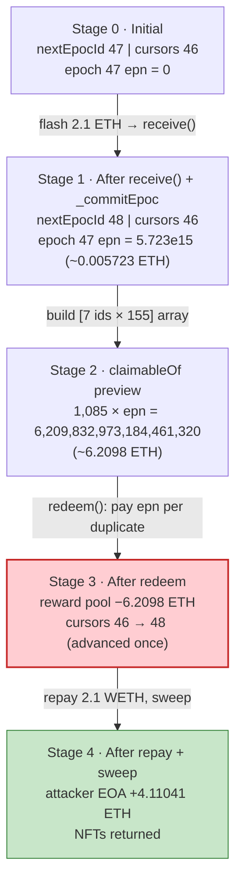
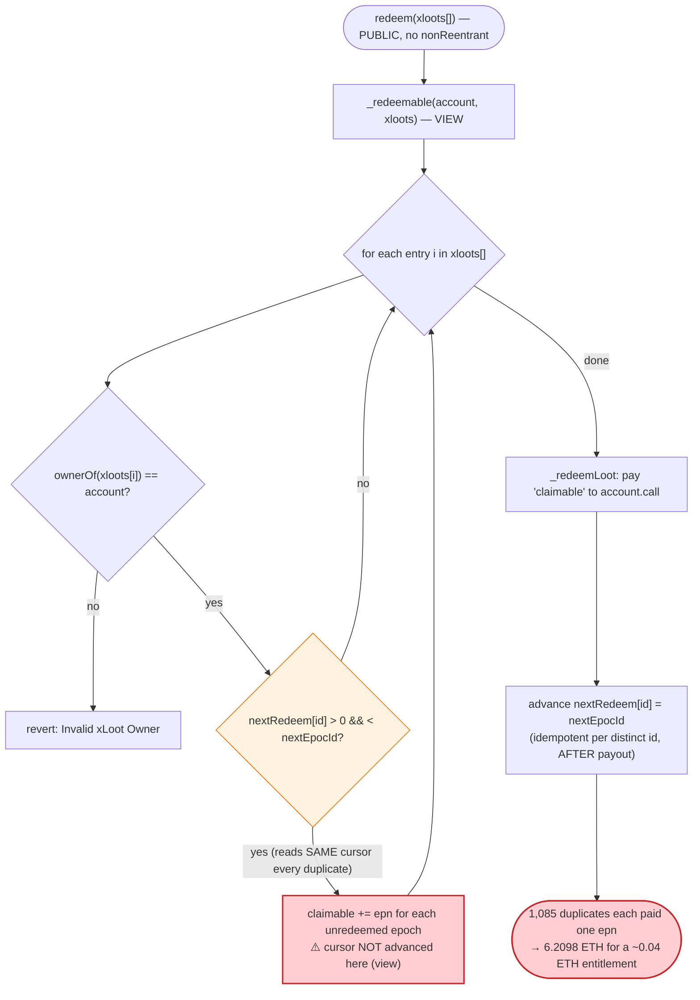
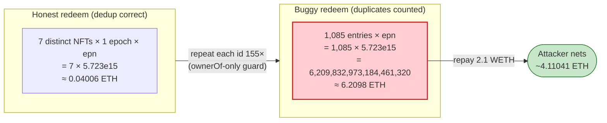

# xLOOT Staking Exploit — Duplicate NFT IDs in `redeem(uint256[])` Claim the Same Epoch Reward Repeatedly

> **Vulnerability classes:** vuln/logic/reward-calculation · vuln/logic/missing-check

> **Reproduction:** the PoC compiles & runs in an isolated Foundry project at
> [this project folder](.). The umbrella DeFiHackLabs repo contains several unrelated PoCs that do not
> all compile together, so this one was extracted into a standalone project.
> Full verbose trace: [output.txt](output.txt).
> Verified vulnerable source (active implementation behind the proxy):
> [contracts_Staking.sol](sources/Staking_f3A364/contracts_Staking.sol).

---

## Key info

| | |
|---|---|
| **Loss** | **6.21 ETH** total in the live incident; the extracted PoC nets **4.110409994732514492 ETH** profit ([output.txt:8](output.txt)) — `redeem` paid out **6.209832973184461320 ETH** ([output.txt:4562](output.txt)) against a 2.1 WETH flash-loan repayment |
| **Vulnerable contract** | `Staking` implementation — [`0xf3A3648bB1Da9D3aeA107da77E6f5bA9Cf313127`](https://etherscan.io/address/0xf3A3648bB1Da9D3aeA107da77E6f5bA9Cf313127#code) |
| **Victim (proxy / pool of ETH rewards)** | xLOOT Staking `TransparentUpgradeableProxy` — [`0x9d87Ff196646A99BDdb16876066aA863900118b4`](https://etherscan.io/address/0x9d87Ff196646A99BDdb16876066aA863900118b4) |
| **xLOOT NFT** | [`0x9237DfD3Ff86710bfD16Ee6172F184a2bB4de10A`](https://etherscan.io/address/0x9237DfD3Ff86710bfD16Ee6172F184a2bB4de10A) |
| **Attacker EOA** | [`0xAcDcD2e9787E889305200900d6Cf6C0548578630`](https://etherscan.io/address/0xAcDcD2e9787E889305200900d6Cf6C0548578630) |
| **Attacker contract** | `0xd8A948b2ee03165a3c6b8940837bab664BC5CF4d` (PoC redeploys an equivalent helper) |
| **Flash source** | Balancer Vault `0xBA12222222228d8Ba445958a75a0704d566BF2C8` (2.1 WETH, 0 fee) |
| **Attack tx** | [`0xab19752a450a205ccaca9afb8505e2d8b79593ee2edab1f67bdec27a4f14871f`](https://etherscan.io/tx/0xab19752a450a205ccaca9afb8505e2d8b79593ee2edab1f67bdec27a4f14871f) |
| **Chain / block / date** | Ethereum mainnet / fork block 24,885,767 / Apr 2026 |
| **Compiler / optimizer** | impl `v0.8.20+commit.a1b79de6`, optimizer **enabled, 200 runs** (`_meta.json`); proxy `v0.8.9`, optimizer enabled 200 runs |
| **Bug class** | Reward-accounting / per-call deduplication failure — `redeem(uint256[])` computes the full claimable amount **before** it advances the per-NFT `nextRedeem` cursor, and only gates each entry on `ownerOf(id)`, so the same owned NFT supplied N times in one call is paid N times. |

---

## TL;DR

1. xLOOT stakers earn a weekly **epoch** reward. Each xLOOT NFT can claim a fixed
   *earning-per-NFT* (`epn`) for every epoch it has not yet redeemed. A per-NFT cursor
   `xloot.nextRedeem[id]` records the last epoch each token already claimed, so an NFT cannot
   double-claim the same epoch across separate calls.

2. The flaw is that the cursor is only written **after** the reward total is fully computed.
   `Staking.redeem(uint256[])` → `_redeemLoot` → `_redeemable`
   ([contracts_Staking.sol:234-431](sources/Staking_f3A364/contracts_Staking.sol#L234-L431)) loops over
   the entire supplied id array, accumulating `epn` for each entry, and **only checks
   `ownerOf(id) == account`**. The cursor `nextRedeem[id]` is advanced in a *separate* loop in
   `_redeemLoot` ([:317-321](sources/Staking_f3A364/contracts_Staking.sol#L317-L321)) that runs *after*
   the payout — and only once per id list, not once per array entry.

3. Consequently the same owned NFT can appear many times in a single `redeem` call. Every duplicate
   entry reads the *same un-advanced* `nextRedeem[id]` and adds the full epoch reward again. There is no
   `nonReentrant`, no in-call dedup, and no per-id claimed-this-epoch flag.

4. To make the reward worth stealing, the attacker first commits a fresh epoch. The staking proxy's
   `receive()` ([:159-167](sources/Staking_f3A364/contracts_Staking.sol#L159-L167)) finalizes the
   pending epoch once `block.timestamp >= epoc.time`. A **2.1 ETH Balancer flash loan**, unwrapped to
   raw ETH and sent into the proxy, both funds and triggers `_commitEpoc()`, producing
   `epoch 47` with `epn = 5,723,348,362,381,992 wei` (~0.005723 ETH per NFT)
   ([output.txt:201](output.txt)).

5. The attacker owns **7 xLOOT IDs** (`128,144,145,195,49,51,52`), each with cursor `46`
   ([output.txt:52-56](output.txt)) — one epoch behind. They build a `redeem` array of those 7 ids
   **repeated 155 times each = 1,085 entries** and call `redeem`.

6. `claimableOf` previews the payout as **6,209,832,973,184,461,320 wei (~6.2098 ETH)**
   ([output.txt:2388](output.txt)), exactly `1,085 × 5,723,348,362,381,992`. `redeem` then transfers that
   ETH to the attacker contract ([output.txt:4562](output.txt)) while advancing each id's cursor only
   once (`46 → 48`, [output.txt:4570-4576](output.txt)).

7. The attacker repays the 2.1 WETH flash loan ([output.txt:4583](output.txt)), returns the 7 NFTs to
   the EOA, and sweeps the remainder. Net PoC profit: **4.110409994732514492 ETH**
   ([output.txt:4637](output.txt), [output.txt:8](output.txt)).

---

## Background — what xLOOT Staking does

The `Staking` contract is a UUPS-style upgradeable revenue-share system deployed behind a
`TransparentUpgradeableProxy`. ETH revenue is pushed into the contract over time and distributed in
weekly **epochs**. Two earner classes exist:

- **$LOOT stakers** accrue *points* per token-per-day and share an epoch's ETH pro-rata
  (`_stake`/`unstake`/`_redeemable`).
- **xLOOT NFT holders** each earn a flat *earning-per-NFT* (`epn`) per epoch, regardless of staking.
  Each NFT has its own redemption cursor `xloot.nextRedeem[id]` recording the last epoch it claimed.

Epoch lifecycle:

- ETH arrives via the proxy's `receive()`; the value is added to the *pending* epoch's `value`. When
  the pending epoch's scheduled `time` has elapsed, `_commitEpoc()` finalizes it: it computes
  `epp` (earning-per-point) and `epn` (earning-per-NFT) from that epoch's `value`, then opens the next
  epoch ([:159-232](sources/Staking_f3A364/contracts_Staking.sol#L159-L232)).
- Holders later pull their accumulated rewards with `redeem(uint256[] xloots)`, passing the NFT ids
  they own.

On-chain parameters / state at the fork block (read from the trace):

| Parameter / state | Value | Source |
|---|---|---|
| `nextEpocId` (pending epoch) before attack | **47** | [output.txt:46](output.txt) |
| `xLootNextReem(id)` for each attacker NFT | **46** (one epoch behind) | [output.txt:54](output.txt) |
| Pending epoch `nextEpoc()` = (time, ppt, epp, epn, value) | `(1776262763, 40282439093, 0, 0, 1e16)` | [output.txt:173](output.txt) |
| `MAX_REDEEM_EPOC` | 50 | [:64](sources/Staking_f3A364/contracts_Staking.sol#L64) |
| `EPOC_DURATION` | 7 days | [:67](sources/Staking_f3A364/contracts_Staking.sol#L67) |
| Committed epoch 47 `value` | 2,110,000,000,000,000,000 (2.11 ETH) | [output.txt:201](output.txt) |
| Committed epoch 47 `epp` | 48,699,394 | [output.txt:201](output.txt) |
| Committed epoch 47 `epn` (per-NFT reward) | **5,723,348,362,381,992 (~0.005723 ETH)** | [output.txt:201](output.txt) |
| Attacker's 7 owned NFT ids | 128, 144, 145, 195, 49, 51, 52 | [XLootStaking_exp.sol:110-116](test/XLootStaking_exp.sol#L110-L116) |
| Per-id repeat count | **155** → 7 × 155 = **1,085** entries | [XLootStaking_exp.sol:32](test/XLootStaking_exp.sol#L32) |

The whole game is the last few rows: each of the attacker's NFTs is owed exactly one epoch's `epn`
(epoch 47). Supplying each id 155 times turns a 7-NFT, ~0.04 ETH claim into a 1,085-entry,
**6.21 ETH** claim, because every duplicate re-reads the same `nextRedeem` cursor.

---

## The vulnerable code

### 1. `redeem` → `_redeemLoot`: the cursor is advanced *after* the payout is computed

```solidity
function redeem(uint256[] memory xloots) external {
    _redeemLoot(msg.sender, xloots);
}
```
([contracts_Staking.sol:234-236](sources/Staking_f3A364/contracts_Staking.sol#L234-L236))

```solidity
function _redeemLoot(address account, uint256[] memory xloots) internal {
    StakingStorage storage $ = _getOwnStorage();
    User storage _user = $.users[account];

    (
        uint256 claimable,
        uint256 bonusAmount,
        uint256 time,
        uint256 duration,
        uint256 points
    ) = _redeemable(account, xloots);          // ← computes FULL payout first

    // ... user point bookkeeping ...
    _user.epoc = $.nextEpocId - 1;
    if (xloots.length > 0) {
        for (uint256 i = 0; i < xloots.length; i++) {
            $.xloot.nextRedeem[xloots[i]] = $.nextEpocId;   // ← cursor advanced AFTER, idempotent per id
        }
    }

    if (claimable > 0) {
        _user.totalClaimed += claimable;
        (bool success, ) = account.call{value: claimable}("");   // ← pays the inflated amount
        require(success, "Transfer Fail");
        emit Redeem(account, xloots, claimable, $.nextEpocId - 1, block.timestamp, duration);
    }
    // ...
}
```
([contracts_Staking.sol:297-341](sources/Staking_f3A364/contracts_Staking.sol#L297-L341))

The cursor loop at lines 317-321 writes `nextRedeem[id] = nextEpocId` once for each *distinct array
slot*, but because all 1,085 slots that share id `128` write the same value, the result is identical to
writing it once. The eligibility check has already happened — and inflated the total — in
`_redeemable`, which ran *before* any cursor was touched.

### 2. `_redeemable`: per-entry accumulation gated only by `ownerOf(id)`

```solidity
if (xloots.length > 0) {
    for (uint256 i = 0; i < xloots.length; i++) {
        uint256 id = xloots[i];
        IERC721 _xloot = IERC721($.xloot.token);
        require(_xloot.ownerOf(id) == account, "Invalid xLoot Owner");   // ← ONLY guard
        if (
            $.xloot.nextRedeem[id] > 0 &&
            $.xloot.nextRedeem[id] < $.nextEpocId
        ) {
            uint256 fromEpoc = $.xloot.nextRedeem[id];                   // ← same value every duplicate
            if (fromEpoc + $.config.maxRedeemEpoc < $.nextEpocId) {
                fromEpoc = $.nextEpocId - $.config.maxRedeemEpoc;
            }
            // ...
            // redeem all epoc
            for (uint256 j = fromEpoc; j < $.nextEpocId; j++) {
                claimable += $.epocs[j].epn;                            // ← adds epn AGAIN per duplicate
                BonusLoot memory bonusLoot = $.bonus[j];
                if (bonusLoot.amount > 0) {
                    bonusAmount += bonusLoot.epn;
                }
            }
        }
    }
}
```
([contracts_Staking.sol:393-426](sources/Staking_f3A364/contracts_Staking.sol#L393-L426))

This is a `view` function (it never writes), so `nextRedeem[id]` cannot change between iterations of the
`i` loop. Each duplicate of id `128` therefore enters the `if`, reads `fromEpoc = nextRedeem[128] = 46`,
loops `j = 46 → 47` (`< nextEpocId = 48`), and adds `epocs[47].epn` to `claimable`. With epoch 46's `epn`
already 0, the net effect is `+epn(47)` per duplicate.

### 3. `claimableOf` exposes the same broken math (used by the PoC to size the attack)

```solidity
function claimableOf(address account, uint256[] memory xloots)
    external view
    returns (uint256 claimable, uint256 bonusAmount, uint256 duration)
{
    (claimable, bonusAmount, , duration, ) = _redeemable(account, xloots);
}
```
([contracts_Staking.sol:556-565](sources/Staking_f3A364/contracts_Staking.sol#L556-L565))

### 4. `receive()` / `_commitEpoc`: a permissionless way to mint a fresh epoch to drain

```solidity
receive() external payable {
    StakingStorage storage $ = _getOwnStorage();
    Epoc storage _nextEpoc = $.epocs[$.nextEpocId];
    _nextEpoc.value += msg.value;

    if (_nextEpoc.time <= block.timestamp) {   // ← any sender can finalize once the timer elapsed
        _commitEpoc();
    }
}
```
([contracts_Staking.sol:159-167](sources/Staking_f3A364/contracts_Staking.sol#L159-L167))

`_commitEpoc()` computes `epn` for the just-closed epoch and advances `nextEpocId` (storage change
`47 → 48`, [output.txt:206](output.txt)). The attacker uses this to guarantee there is exactly one fresh,
unredeemed epoch worth `epn` for each of their NFTs at attack time.

---

## Root cause — why it was possible

The defect is a classic **read-all-then-write-all** ordering bug combined with a **missing per-call
deduplication**:

1. **Eligibility and payout are computed in a `view` pass that cannot mutate the cursor.**
   `_redeemable` accumulates `claimable += epn` for every array entry, but the only state that gates
   the addition — `xloot.nextRedeem[id]` — is never updated inside that pass. It is a `view` function.

2. **The cursor is advanced only afterwards, and idempotently per distinct id.** The write loop in
   `_redeemLoot` (lines 317-321) sets `nextRedeem[id] = nextEpocId`. Writing the same value 155 times
   for id `128` is indistinguishable from writing it once. By the time it runs, the inflated `claimable`
   total is already fixed.

3. **The per-entry guard is `ownerOf(id) == account`, which is duplicate-insensitive.** Owning an NFT
   once lets it appear arbitrarily many times in the array; `ownerOf` returns the same owner for every
   occurrence.

4. **No reentrancy guard, no "claimed this epoch" set, no input dedup.** Nothing in the call path
   collapses repeated ids, caps array length meaningfully (1,085 entries is well within gas), or marks an
   `(id, epoch)` pair as consumed mid-call.

The correct invariant — *"each NFT can claim each epoch at most once"* — is enforced *across* calls (via
the cursor) but **not within a single call**. The flash loan is merely a convenience: it lets the
attacker create a fresh, fully-funded epoch and pay the gas with borrowed capital, then repay it in the
same transaction. The reward inflation itself requires no borrowed capital at all — it is a pure logic
bug.

---

## Preconditions

- **Own at least one xLOOT NFT** whose cursor `nextRedeem[id]` is behind `nextEpocId` (i.e. it has at
  least one unredeemed epoch). The attacker owned 7, all at cursor `46` vs `nextEpocId 47`
  ([output.txt:52-56](output.txt)). Profit scales linearly with `(#owned NFTs) × (repeat count) ×
  epn × (#unredeemed epochs)`.
- **A committable epoch.** The pending epoch's scheduled `time` must have elapsed so that sending ETH
  into `receive()` finalizes it and produces a non-zero `epn`. The PoC reads `nextEpoc().time`
  (`1776262763`) and `vm.warp`s to it ([XLootStaking_exp.sol:90-91](test/XLootStaking_exp.sol#L90-L91)).
- **Enough ETH to seed the new epoch's `value`** so `epn > 0`. The PoC flash-borrows 2.1 WETH from
  Balancer (fee 0, [output.txt:185-186](output.txt)), unwraps it, and sends it into the proxy — this is
  recovered intra-transaction, hence flash-loanable.
- **No reentrancy or per-call dedup protection** on `redeem` — satisfied by the deployed code.

---

## Attack walkthrough (with on-chain numbers from the trace)

All figures are taken directly from the trace; raw wei first, human approximation in parentheses. The
"reward pool" column is the proxy's ETH that backs the per-NFT `epn`.

| # | Step | Key on-chain values | Reward-accounting state | Effect |
|---|------|---------------------|------------------------|--------|
| 0 | **Initial read.** `nextEpocId = 47`; each owned NFT `nextRedeem = 46` | `nextEpocId` 47 ([output.txt:46](output.txt)); cursor 46 ([output.txt:54](output.txt)) | Pending epoch 47 has `epn = 0` (not yet committed) | Each of the 7 NFTs is one epoch behind. |
| 1 | **Warp to epoch time** `1776262763` | `nextEpoc()=(1776262763,…,value 1e16)` ([output.txt:173](output.txt)); `VM::warp(1776262763)` ([output.txt:175](output.txt)) | Pending epoch's timer now elapsed | Enables `receive()` to commit. |
| 2 | **Balancer flash loan** 2,100,000,000,000,000,000 WETH (2.1) | flashLoan 2.1e18, fee 0 ([output.txt:178](output.txt), [output.txt:185-186](output.txt)) | — | Working capital, repaid in-tx. |
| 3 | **Unwrap & seed epoch.** `WETH.withdraw(2.1)`; send 2.1 ETH into proxy `receive()` → `_commitEpoc()` | `Withdrawal 2.1e18` ([output.txt:195](output.txt)); `fallback{value: 2.1e18}` ([output.txt:197](output.txt)); `CommitEpoc(47, value 2.11e18, epp 48699394, epn 5723348362381992, …)` ([output.txt:201](output.txt)); `nextEpocId 47 → 48` ([output.txt:206](output.txt)) | **Epoch 47 committed with `epn = 5,723,348,362,381,992`** (~0.005723 ETH); `nextEpocId = 48`; cursors still 46 | One fresh, unredeemed epoch now exists for each NFT. |
| 4 | **Preview the inflated claim.** `claimableOf(helper, [7 ids × 155])` | returns `claimable = 6,209,832,973,184,461,320` (~6.2098), bonus 0, duration 1,209,600 ([output.txt:2388](output.txt)) | `1,085 × 5,723,348,362,381,992 = 6,209,832,973,184,461,320` exactly | Confirms duplicates amplify the claim 1,085×. |
| 5 | **`redeem([7 ids × 155])`.** Loop pays `epn` per entry; cursor advanced once per id | `redeem(...)` ([output.txt:2390](output.txt)); helper `receive{value: 6,209,832,973,184,461,320}` (~6.2098) ([output.txt:4562](output.txt)); `emit Redeem(…, 6209832973184461320, 47, …, duration 1209600)` ([output.txt:4564](output.txt)) | Each id cursor `46 → 48` ([output.txt:4570-4576](output.txt)); reward pool debited 6.2098 ETH | **The bug fires:** 1,085 duplicate entries each paid one epoch's `epn`. |
| 6 | **Repay flash loan.** `WETH.deposit{value: 2.1}` then `transfer(BalancerVault, 2.1)` | Deposit 2.1e18 ([output.txt:4577](output.txt)); Transfer 2.1e18 to Balancer ([output.txt:4583](output.txt)) | — | Flash loan settled (0 fee). |
| 7 | **Return NFTs + sweep.** 7× `transferFrom(helper → attacker)`; sweep ETH to EOA | NFT transfers ([output.txt:4595-4634](output.txt)); `Attacker::fallback{value: 4,110,409,994,732,514,492}` ([output.txt:4637](output.txt)) | Attacker EOA +4.1104 ETH | Clean exit; NFTs back, profit booked. |

### Profit / loss accounting (ETH)

| Item | Amount (wei) | ~Human |
|---|---:|---:|
| Reward paid out by `redeem` to helper | 6,209,832,973,184,461,320 | ~6.20983 |
| — equals `1,085 × epn` where `epn = 5,723,348,362,381,992` | 6,209,832,973,184,461,320 | exact |
| Less: Balancer flash-loan repayment (WETH) | 2,100,000,000,000,000,000 | 2.10000 |
| Less: Balancer flash-loan fee | 0 | 0 |
| **Net swept to attacker EOA** ([output.txt:4637](output.txt)) | **4,110,409,994,732,514,492** | **~4.11041** |
| Attacker EOA balance before | 0 | 0 ([output.txt:7](output.txt)) |
| **Attacker EOA balance after (asserted)** | **4,110,409,994,732,514,492** | **~4.11041** ([output.txt:9](output.txt)) |

The PoC asserts `attackerProfit > 4 ether` ([XLootStaking_exp.sol:99](test/XLootStaking_exp.sol#L99),
[output.txt:4646](output.txt)) and that each NFT's cursor advanced exactly once
(`startingNextEpoch + 1`, [XLootStaking_exp.sol:102-105](test/XLootStaking_exp.sol#L102-L105)). The
honest claim for 7 NFTs over one epoch would have been `7 × epn ≈ 0.04006 ETH`; the duplicate-id attack
multiplied that by 155 to ~6.21 ETH, of which ~4.11 ETH is pure profit after returning the borrowed 2.1.

> Note: the live incident's headline loss is **6.21 ETH** (the gross amount drained from the reward
> pool, per the PoC `@KeyInfo` header). The PoC's asserted figure is the **net attacker profit
> (~4.11 ETH)** after the flash-loan repayment.

---

## Diagrams

### Sequence of the attack

```mermaid
sequenceDiagram
    autonumber
    actor A as "Attacker / helper"
    participant B as "Balancer Vault"
    participant W as "WETH"
    participant P as "xLOOT Staking Proxy"
    participant N as "xLOOT NFT"

    Note over P: nextEpocId = 47<br/>each owned NFT nextRedeem = 46<br/>pending epoch epn = 0

    A->>P: warp to epoch.time (1776262763)

    rect rgb(255,243,224)
    Note over A,W: Step 1 — borrow working capital
    A->>B: flashLoan(2.1 WETH, fee 0)
    B-->>A: 2.1 WETH
    end

    rect rgb(232,245,233)
    Note over A,P: Step 2 — commit a fresh epoch
    A->>W: withdraw(2.1) → 2.1 ETH
    A->>P: send 2.1 ETH (receive())
    P->>P: _commitEpoc(): epoch 47 epn = 5,723,348,362,381,992
    Note over P: nextEpocId 47 → 48 (cursors still 46)
    end

    rect rgb(255,235,238)
    Note over A,N: Step 3 — the exploit
    A->>P: claimableOf([7 ids × 155]) ⇒ 6.2098 ETH
    A->>P: redeem([7 ids × 155])
    P->>N: ownerOf(id) == helper ✔ (1,085×)
    P->>P: claimable += epn per duplicate (1,085×)
    P-->>A: 6,209,832,973,184,461,320 wei (~6.2098 ETH)
    Note over P: each id cursor 46 → 48 (advanced once)
    end

    rect rgb(243,229,245)
    Note over A,B: Step 4 — settle & profit
    A->>W: deposit{2.1}; transfer 2.1 WETH → Balancer (repay)
    A->>N: return 7 NFTs to EOA
    A->>A: sweep +4.110409994732514492 ETH
    end
```

### Reward-pool / cursor state evolution



### The flaw inside `redeem` / `_redeemable` / `_redeemLoot`



### Why it is theft: entitlement vs. paid-out



---

## Why each magic number

- **`WETH_FLASH_AMOUNT = 2.1 ether`** ([XLootStaking_exp.sol:31](test/XLootStaking_exp.sol#L31)): the ETH
  sent into `receive()` to seed the pending epoch's `value`. It produces `epoch 47.value = 2.11e18`
  (2.1 borrowed + 0.01 pre-existing pending value) and `epn = 5,723,348,362,381,992`
  ([output.txt:201](output.txt)). It is fully repaid to Balancer (fee 0), so it is working capital, not
  cost. Any amount large enough to make `epn` worth more than gas would do.
- **`TRACE_REPEAT_COUNT = 155`** ([XLootStaking_exp.sol:32](test/XLootStaking_exp.sol#L32)): the number
  of times each owned id is repeated. `7 ids × 155 = 1,085` entries, the exact count needed to reproduce
  the live attack's `6,209,832,973,184,461,320 wei` payout (`1,085 × epn`). It must stay under the gas
  ceiling (the `redeem` call costs ~7.2M gas, [output.txt:2390](output.txt)); 155 is the value the live
  attacker chose, not a hard maximum.
- **The 7 ids `128,144,145,195,49,51,52`** ([XLootStaking_exp.sol:110-116](test/XLootStaking_exp.sol#L110-L116)):
  the xLOOT NFTs the attacker EOA actually owned at the fork block, each with cursor `46`
  (one unredeemed epoch). The PoC asserts ownership and cursor before attacking
  ([XLootStaking_exp.sol:78-79](test/XLootStaking_exp.sol#L78-L79)).
- **`forkBlock = 24_885_767`** ([XLootStaking_exp.sol:60](test/XLootStaking_exp.sol#L60)): the block at
  which the attacker owns the NFTs and `nextEpocId == 47`, immediately before the live exploit.
- **The 2.1 WETH repayment** ([output.txt:4577-4583](output.txt)): exactly the borrowed principal; the
  Balancer fee was `0` ([output.txt:185-186](output.txt)), so no surplus repayment was needed.

---

## Remediation

1. **Deduplicate ids within a `redeem` call.** Reject or collapse repeated ids before computing rewards
   (e.g. require strictly increasing ids, or track a `seen` set / bitmap per call). A single owned NFT
   must contribute to `claimable` at most once per epoch per call.
2. **Advance the cursor before (or atomically with) crediting the reward.** Restructure
   `_redeemable`/`_redeemLoot` so that processing id `x` sets `nextRedeem[x] = nextEpocId` *before* the
   next array entry is read. Then a second occurrence of `x` finds `nextRedeem[x] == nextEpocId`, fails
   the `nextRedeem[id] < nextEpocId` test, and contributes nothing. (This requires moving the reward
   accumulation out of a pure `view` function into the state-mutating path, or marking `(id, epoch)`
   pairs consumed as they are counted.)
3. **Add `nonReentrant` and pay last.** Mark `redeem` `nonReentrant` and follow checks-effects-interactions:
   update all cursors and `totalClaimed`, then perform the single ETH `call`.
4. **Track claimed-per-epoch explicitly.** Maintain a `claimed[id][epoch]` flag (or a `lastClaimedEpoch`
   that the inner loop checks and writes per iteration) so the same `(id, epoch)` can never be paid twice
   regardless of array shape.
5. **Bound the per-call array and gate epoch creation.** Cap the `xloots` array length to a sane maximum
   and consider restricting `receive()`-driven `_commitEpoc()` so a fresh epoch cannot be conjured by an
   arbitrary caller in the same transaction as a claim.

---

## How to reproduce

The PoC runs **offline** against a local anvil fork served from `anvil_state.json` (the test's
`createSelectFork` points at `http://127.0.0.1:8545`,
[XLootStaking_exp.sol:61](test/XLootStaking_exp.sol#L61)); no public RPC is contacted.

```bash
_shared/run_poc.sh 2026-04-XLootStaking_exp --mt testExploit -vvvvv
```

- `foundry.toml` sets `evm_version = 'cancun'` and `fs_permissions = read ./` so the harness can load
  the local fork state.
- The harness boots anvil from the bundled `anvil_state.json` and serves historical state at fork block
  `24,885,767`; the test forks `127.0.0.1:8545`. No mainnet archive endpoint is required.
- Result: `[PASS] testExploit()` with `Attacker profit ETH Balance: 4.110409994732514492`.

Expected tail (from [output.txt:4-9](output.txt) and [output.txt:4724-4727](output.txt)):

```
Ran 1 test for test/XLootStaking_exp.sol:ContractTest
[PASS] testExploit() (gas: 16539049)
Logs:
  Attacker Before exploit ETH Balance: 0.000000000000000000
  Attacker profit ETH Balance: 4.110409994732514492
  Attacker After exploit ETH Balance: 4.110409994732514492

Suite result: ok. 1 passed; 0 failed; 0 skipped; finished in 20.33s (19.04s CPU time)
```

---

*Reference: DefimonAlerts — https://x.com/DefimonAlerts/status/2044709964091187660 (xLOOT Staking, Ethereum mainnet, Apr 2026, 6.21 ETH).*
