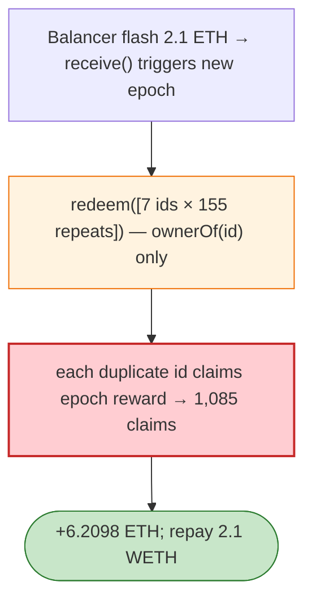

# xLOOT Staking Exploit — `redeem(uint256[])` Re-evaluates Same NFT in One Call

> **Reproduction:** the PoC compiles & runs in an isolated Foundry project at
> [this project folder](.). Full verbose trace: [output.txt](output.txt).
> Verified vulnerable source: [Staking](sources/Staking_f3A364),
> [XLoot](sources/XLoot_9237Df) + proxy.

---

## Key info

| | |
|---|---|
| **Loss** | 6.21 ETH; tx `0xab19752a…` |
| **Vulnerable contract** | xLOOT `Staking` `0xf3A3648b…` (proxy/victim `0x9d87Ff…`) |
| **Attacker** | `0xAcDcD2e9…` (contract `0xd8A948b2…`) |
| **Flash source** | Balancer (2.1 ETH to trigger a new epoch via `receive()`) |
| **Chain / block / date** | Ethereum mainnet / Apr 2026 |
| **Bug class** | Reward accounting — `redeem(uint256[])` computes all xLOOT rewards **before** advancing `xLoot.nextRedeem[id]`; it only checks `ownerOf(id)`, so the same owned NFT can be supplied many times in one call. |

---

## TL;DR

Per the embedded analysis: `Staking.redeem(uint256[])` calculates all xLOOT rewards before it advances
`xLoot.nextRedeem[id]`. The loop checks only `ownerOf(id)`, so the same owned NFT can be supplied many
times in a single `redeem`. After a 2.1 ETH Balancer flash loan triggers a new epoch through
`receive()`, **seven owned xLOOT IDs repeated 155 times** each claim the epoch reward **1,085 times**,
paying 6.2098 ETH before the 2.1 WETH repayment.

---

## Root cause

A **per-call deduplication failure**: the redeem loop processes the full id list, computes rewards, and
only then marks `nextRedeem[id]`, so duplicate ids in one call are all credited.

---

## Diagrams



---

## Remediation

1. Deduplicate ids within a `redeem` call (or advance `nextRedeem[id]` before the reward loop).
2. `nonReentrant` + per-id atomic claim; track claimed-per-epoch.

---

## How to reproduce

```bash
_shared/run_poc.sh 2026-04-XLootStaking_exp -vvvvv
```

- RPC: mainnet archive. Result: `[PASS]` — 6.2098 ETH via duplicate-id redeem.

---

*Reference: xLOOT Staking duplicate-id reward claim, mainnet, Apr 2026 (6.21 ETH).*
