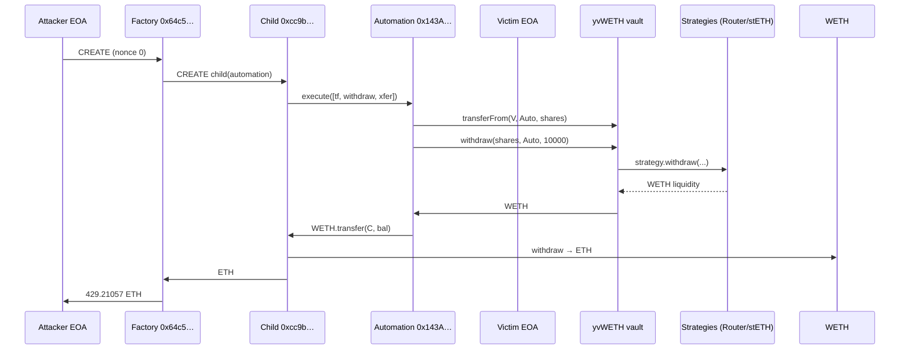

# Victim automation `execute()` missing auth drains yvWETH via Yearn withdrawal path

> **Vulnerability classes:** vuln/access-control/missing-modifier · vuln/logic/missing-check · vuln/dependency/approval

> **Reproduction:** the PoC compiles & runs in an isolated Foundry project at
> [this project folder](.). The fork is served offline from the bundled
> `anvil_state.json` (local anvil replays Ethereum state at block `24981716`), so no
> public RPC is required.
> Full verbose trace: [output.txt](output.txt).
> Vulnerable automation is **unverified**; reconstructed surface in
> [VictimAutomation_reconstructed.sol](sources/VictimAutomation_reconstructed.sol).
> Yearn strategy sources (withdrawal path only, not the bug):
> [StrategystETHAccumulatorV3](sources/StrategystETHAccumulatorV3_740e59/),
> [StrategyRouterV3](sources/StrategyRouterV3_85907b/).

<!-- non-defihacklabs -->

---

## Key info

| | |
|---|---|
| **Loss** | **429.210570004163139903 ETH** (exact internal transfer / PoC profit) |
| **Vulnerable contract** | Victim personal automation — [`0x143A737bfFC6414b61134F513CEED1a64390181A`](https://etherscan.io/address/0x143A737bfFC6414b61134F513CEED1a64390181A) (**unverified**) |
| **Victim EOA (yvWETH holder)** | [`0x98289E90d6fC92a8769bC892D006A2Baa7705aFE`](https://etherscan.io/address/0x98289E90d6fC92a8769bC892D006A2Baa7705aFE) |
| **Yearn v2 yvWETH (asset, not bug)** | [`0xa258C4606Ca8206D8aA700cE2143D7db854D168c`](https://etherscan.io/address/0xa258C4606Ca8206D8aA700cE2143D7db854D168c) |
| **StrategystETHAccumulatorV3 (path)** | [`0x740E59f165706f5c94cd52683c62ad8Ad0124A97`](https://etherscan.io/address/0x740E59f165706f5c94cd52683c62ad8Ad0124A97#code) |
| **StrategyRouterV3 (path)** | [`0x85907b1aF27Fd04a5EFaBC0Fb7162f8690a6B82F`](https://etherscan.io/address/0x85907b1aF27Fd04a5EFaBC0Fb7162f8690a6B82F#code) |
| **Attacker EOA** | [`0x6A818c673B098621e9BfB2AdC80060906cf7B327`](https://etherscan.io/address/0x6A818c673B098621e9BfB2AdC80060906cf7B327) |
| **Attack factory** | [`0x64c589F3EF894678e46AF3b851aa08be3F40A674`](https://etherscan.io/address/0x64c589F3EF894678e46AF3b851aa08be3F40A674) (CREATE, nonce 0) |
| **Child exploit** | [`0xcC9Be93051E8ad00a70ebA3Df2571A18f94d5856`](https://etherscan.io/address/0xcC9Be93051E8ad00a70ebA3Df2571A18f94d5856) |
| **Attack tx** | [`0xebaaab69baa3cd2543eb80ecfb8e3ed226b9e5a6f5694891a8adf4edbcbd8107`](https://etherscan.io/tx/0xebaaab69baa3cd2543eb80ecfb8e3ed226b9e5a6f5694891a8adf4edbcbd8107) |
| **Chain / block / date** | Ethereum mainnet / fork `24981716` (attack in `24981717`) / 2026-04-29 |
| **Bug class** | Permissionless `execute((uint8,bytes)[])` on a personal automation that held the victim's **infinite yvWETH allowance** |

---

## Naming / Yearn scope (important)

**This is not an official Yearn core or strategy vulnerability.**

- **ExVul** labeled the incident around `StrategystETHAccumulatorV3` / `StrategyRouterV3` because those Yearn-style strategy contracts appear on the **withdrawal fund path** when yvWETH shares are redeemed (vault pulls liquidity from strategies, including stETH accumulator → Curve).
- **banteg (Yearn)** clarified on X: the root cause is the **victim's personal automation contract** (meant to convert yvWETH on another platform). Its `execute()` lacked an owner check, so anyone could spend the approved tokens.
- **PeckShield** similarly framed it as a user yvWETH position stolen via approval to an unverified buggy contract — not Alchemix/Yearn protocol insolvency.

Official components touched as **dependencies of a normal vault withdraw**, not as the buggy surface:

| Contract | Role in incident |
|---|---|
| Yearn v2 `yvWETH` | ERC-20 vault shares the victim held and approved |
| `StrategyRouterV3` | Vault strategy; `withdraw` during share redemption |
| `StrategystETHAccumulatorV3` | stETH strategy; unwinds via Curve stETH pool as part of vault liquidity |

---

## TL;DR

1. Victim EOA holds **~384.667 yvWETH** and grants **max allowance** to a personal automation at `0x143A…181A`.
2. Automation exposes **`execute((uint8,bytes)[])`** (selector `0x49650044`) **without** `msg.sender == owner` checks. `rescueERC20` / `rescueETH` correctly gate on the hardcoded victim owner.
3. Attacker CREATE-deploys a factory+child that calls `execute` with three ops: `transferFrom` yvWETH from victim → automation, `withdraw` shares to WETH (vault → strategies → WETH), then transfer WETH out.
4. Child unwraps WETH → ETH and forwards **429.210570004163139903 ETH** to the attacker EOA.

---

## Root cause

### Permissionless multicall with a live token approval

The automation is an unverified contract. From runtime bytecode / 4byte:

| Selector | Signature | Auth |
|---|---|---|
| `0x49650044` | `execute((uint8,bytes)[])` | **None** |
| `0xb2118a8d` | `rescueERC20(address,address,uint256)` | `msg.sender == OWNER` |
| `0x099a04e5` | `rescueETH(address,uint256)` | `msg.sender == OWNER` |
| `0x8da5cb5b` | `owner()` | view |

`OWNER` is immutably the victim EOA `0x9828…5aFE`. Rescue paths are gated; **`execute` is not**. Combined with the victim's infinite `yvWETH.approve(automation, type(uint256).max)`, any caller can:

1. `transferFrom` the victim's vault shares into the automation
2. Redeem them via Yearn's standard `withdraw(shares, recipient, maxLoss)`
3. Move the resulting WETH wherever they want

```solidity
// sources/VictimAutomation_reconstructed.sol (illustrative)
function execute(Call[] calldata calls) external {
    // BUG: no require(msg.sender == OWNER)
    for (uint256 i = 0; i < calls.length; i++) {
        _run(calls[i]);
    }
}
```

### Why strategies show up in the trace

Yearn v2 `withdraw` burns shares and returns underlying WETH. When idle WETH is insufficient, the vault calls into attached strategies. On this vault that includes **StrategyRouterV3** and **StrategystETHAccumulatorV3**, which exit stETH via the Curve stETH/ETH pool — hence the ExVul "stETH strategy / StrategyRouterV3 withdrawal-path" framing. Those contracts behave as designed; they are not the access-control bug.

---

## Attack path



### Historical `execute` payload (decoded)

| # | kind | Effect |
|---|---|---|
| 0 | `2` | `yvWETH.transferFrom(victim, automation, 384667252984919210375)` |
| 1 | `2` | `yvWETH.withdraw(shares, automation, 10000)` |
| 2 | `3` | `WETH.transfer(child, full automation balance)` |

Exact profit after WETH unwrap: **`429210570004163139903` wei**.

---

## PoC

### CREATE replay (primary)

`test/YearnStETHAccumulator_exp.sol` replays the full historical CREATE initcode at fork block `24981716` (attacker nonce forced to 0 → address `0x64c589…`). Constructor tree performs the entire drain.

### Clean `execute` path

`test/2026-04-YearnStETHAccumulator.sol` / playground synthetic deploys a small exploit that builds the same three `execute` calls without historical bytecode — same exact ETH profit.

```bash
# Offline (bundled anvil_state.json)
../../_shared/run-poc/run_poc.sh 2026-04-YearnStETHAccumulator_exp --match-test testExploit -vv
```

---

## Preconditions

1. Victim holds yvWETH shares and has approved the automation for at least that balance (here: max uint).
2. Automation code is live with permissionless `execute`.
3. Yearn vault + strategies have liquidity to honor `withdraw` (normal protocol operation).

---

## Mitigations

1. **Never** leave a privileged multicall / `execute` without `onlyOwner` (or stricter auth).
2. Prefer **Permit2 / session keys / least-privilege allowances** over infinite ERC-20 approve to automation contracts.
3. Verify automation source before approving large vault positions.
4. Yearn vaults/strategies need no change for this class of bug — user-side approval hygiene.

---

## References

- ExVul alert: https://x.com/exvulsec/status/2049294937108381759
- banteg clarification (not a Yearn bug; missing owner on execute): https://x.com/banteg/status/2049409177185894909
- Attack tx: https://etherscan.io/tx/0xebaaab69baa3cd2543eb80ecfb8e3ed226b9e5a6f5694891a8adf4edbcbd8107
