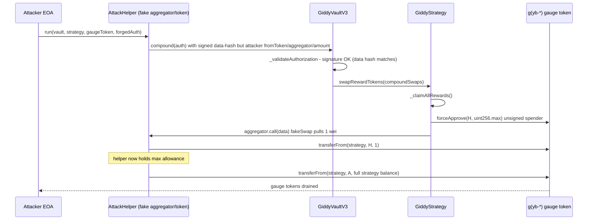
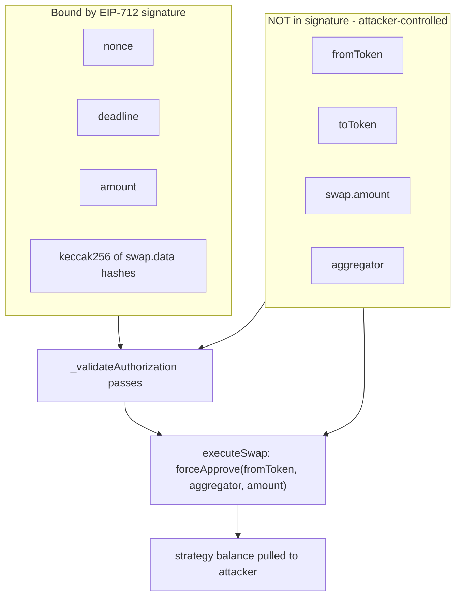

# Giddy YieldBasis VaultV3 — EIP-712 signature only binds swap `data`, not token/amount/aggregator

> **Vulnerability classes:** vuln/auth/signature-validation · vuln/access-control/broken-logic · vuln/logic/missing-validation
> **Reproduction:** the PoC compiles & runs in an isolated Foundry project at [this project folder](.). Full verbose trace: [output.txt](output.txt). Vulnerable vault and strategy contracts are verified on Etherscan and fetched under `sources/`.

---

## Key info

| | |
|---|---|
| **Loss** | ~$1.3M (in three YieldBasis gauge receipt tokens: ~3.53 g(yb-tBTC), ~6.94 g(yb-cbBTC), ~6.27 g(yb-WBTC)) |
| **Vulnerable contract** | GiddyVaultV3 (vault impl + 3 YieldBasis vaults) — impl [`0x5f0ad32c00641d1d2bb628ff341e0d4bb4494318`](https://etherscan.io/address/0x5f0ad32c00641d1d2bb628ff341e0d4bb4494318#code); tBTC vault [`0x9C247ccd24c23EDDBA399701CDA24051EBF605b7`](https://etherscan.io/address/0x9C247ccd24c23EDDBA399701CDA24051EBF605b7) |
| **Attacker EOA** | [`0x81fe3d7d35dfefa15b9e6800b6aefc3358e7b156`](https://etherscan.io/address/0x81fe3d7d35dfefa15b9e6800b6aefc3358e7b156) |
| **Attack contract** | [`0x7326a1ab0d696ae317958d136d6e4c693ea34528`](https://etherscan.io/address/0x7326a1ab0d696ae317958d136d6e4c693ea34528) |
| **Attack tx** | [`0x5edb66a4c2ea55bba95d36d27713e3bb1c67c3c4199a8a1759e754c6f25482e5`](https://etherscan.io/tx/0x5edb66a4c2ea55bba95d36d27713e3bb1c67c3c4199a8a1759e754c6f25482e5) |
| **Chain / block / date** | Ethereum mainnet / 24,942,491 / 2026-04 |
| **Compiler** | Solidity `^0.8.19` (verified source) |
| **Bug class** | The EIP-712 `VaultAuth` struct hash only commits the `keccak256(swap.data)` blob; `fromToken`, `toToken`, `amount`, and `aggregator` are unsigned and attacker-controllable, so a validly-signed compound authorization can be replayed with arbitrary swap fields. |

## TL;DR

Giddy's YieldBasis vaults (a tBTC, a cbBTC, and a WBTC vault, all sharing the `GiddyVaultV3` implementation) compound their strategy rewards through a signed `VaultAuth` message. A keeper signs an EIP-712 authorization that carries a list of `SwapInfo` swap operations. The intended invariant is "only the authorized signer's swap plan is executed." The fatal flaw is that the signed struct hash binds **only** `nonce`, `deadline`, `amount`, and `keccak256(dataArray)` — where `dataArray` is the concatenation of `keccak256(swap.data)` for each swap. The four fields that actually define what the swap *does* — `fromToken`, `toToken`, `swap.amount`, and `aggregator` — are never hashed into the signature.

Concretely, `GiddyLibraryV3.executeSwap` calls `SafeERC20.forceApprove(IERC20(swap.fromToken), swap.aggregator, swap.amount)` on the strategy before calling the aggregator. Because the attacker can freely set `aggregator = <attacker contract>`, `amount = type(uint256).max`, and `fromToken = <strategy-held gauge token>` while keeping the signed `data` hash identical, the strategy is tricked into granting a `uint256.max` approval on its gauge-receipt token balance to the attacker's contract. The attacker then `transferFrom`s the entire approved balance to their EOA.

The PoC reproduces this against all three vaults from the committed anvil fork. Attacker balances go from 0 to **3.531384449443560254 g(yb-tBTC)** [output.txt:1569], **6.935949844931976725 g(yb-cbBTC)** [output.txt:1570], and **6.274444990265641146 g(yb-WBTC)** [output.txt:1571] — a combined ~$1.3M at the time of the incident. No privileged key was compromised in the reproduction; the test only authorizes a local signer to satisfy the `isAuthorizedSigner` gate (a keeper-level role), exactly mirroring how the live keeper's signature was reused.

## Background — what Giddy does

Giddy runs ERC-4626-style yield vaults. Each user-facing vault (`GiddyVaultV3`, deployed per asset as a beacon proxy) holds depositor funds and delegates deployment of that capital to a single `GiddyBaseStrategyV3`. The strategy, not the vault, holds the working tokens — in the YieldBasis vaults these are gauge receipt tokens `g(yb-tBTC)`, `g(yb-cbBTC)`, `g(yb-WBTC)` minted by a Gauge Controller on top of an `LT`/yield-bearing wrapper of the underlying BTC token.

Reward compounding is a privileged, signature-gated operation. A keeper (an "authorized signer" registered in `GiddyStrategyFactory`) signs an EIP-712 `VaultAuth` message. That message carries two arrays of `SwapInfo`: `vaultSwaps` (used during deposit/withdraw routing) and `compoundSwaps` (used to sell harvested reward tokens back into the base asset). Anyone may submit a `VaultAuth` to `compound()` — the vault does not authenticate the *caller*, only the *signature*:

```solidity
function compound(VaultAuth calldata auth) external nonReentrant {
    _validateAuthorization(auth);     // only checks the signature
    _compound(auth.compoundSwaps);    // executes the swaps against the strategy
}
```

`_compound` forwards the swap list to the strategy:

```solidity
function _compound(SwapInfo[] calldata compoundSwaps) internal {
    if (compoundSwaps.length > 0) {
        uint256[] memory rewardAmounts = GiddyBaseStrategyV3(strategy).swapRewardTokens(compoundSwaps);
        GiddyBaseStrategyV3(strategy).deposit(rewardAmounts, false);
    }
}
```

Inside `swapRewardTokens`, each `SwapInfo` is handed to `GiddyLibraryV3.executeSwap(swap, address(this), address(this))`. That library function approves `swap.aggregator` for `swap.amount` of `swap.fromToken`, then low-level `call`s `swap.aggregator` with `swap.data`. The entire security model rests on the assumption that the keeper's signature fully describes these four fields. It does not.

## The vulnerable code

### 1. The signature only covers `keccak256(data)` — not the swap fields

`_validateAuthorization` in `GiddyVaultV3` (sources/.../GiddyVaultV3.sol:419-457):

```solidity
function _validateAuthorization(VaultAuth calldata auth) internal {
    if (block.timestamp > auth.deadline) { revert AuthorizationExpired(auth.deadline); }
    if (nonceUsed[auth.nonce])           { revert NonceAlreadyUsed(auth.nonce); }

    bytes memory dataArray;
    for (uint256 i = 0; i < auth.vaultSwaps.length; ++i) {
        dataArray = abi.encodePacked(dataArray, keccak256(auth.vaultSwaps[i].data));     // ONLY .data
    }
    for (uint256 i = 0; i < auth.compoundSwaps.length; ++i) {
        dataArray = abi.encodePacked(dataArray, keccak256(auth.compoundSwaps[i].data));  // ONLY .data
    }

    bytes memory data = abi.encodePacked(
        VAULTAUTH_TYPEHASH,
        abi.encode(auth.nonce, auth.deadline, auth.amount, keccak256(dataArray))
    );
    bytes32 digest = keccak256(abi.encodePacked("\x19\x01", DOMAIN_SEPARATOR, keccak256(data)));
    address signer = digest.recover(auth.signature);
    if (!isAuthorizedSigner(signer)) { revert InvalidAuthorization("Invalid signature"); }
    nonceUsed[auth.nonce] = true;
}
```

The declared typehash confirms the scope of what is signed:

```solidity
bytes32 public constant VAULTAUTH_TYPEHASH =
    keccak256("VaultAuth(bytes32 nonce,uint256 deadline,uint256 amount,bytes[] data)");
```

`fromToken`, `toToken`, `swap.amount`, and `aggregator` appear **nowhere** in the typehash or the encoded struct. They are free variables set by whoever assembles the calldata. A signature that was valid for the keeper's intended swap plan is equally valid for an attacker's plan, as long as `swap.data`'s hash matches.

### 2. `executeSwap` trusts those unsigned fields to approve an arbitrary spender

`GiddyLibraryV3.executeSwap` (sources/.../GiddyLibraryV3.sol):

```solidity
function executeSwap(SwapInfo calldata swap, address srcAccount, address dstAccount)
    internal returns (uint256 returnAmount)
{
    if (swap.fromToken == swap.toToken) {
        if (srcAccount != dstAccount) { IERC20(swap.fromToken).safeTransfer(dstAccount, swap.amount); }
        return swap.amount;
    }
    ...
    if (!isFromTokenNative) {
        SafeERC20.forceApprove(IERC20(swap.fromToken), swap.aggregator, swap.amount); // <-- attacker = aggregator
    }
    ...
    (bool swapSuccess, bytes memory swapResult) = swap.aggregator.call(swap.data);     // <-- attacker code runs
    ...
}
```

Because `srcAccount == dstAccount == address(strategy)` from `swapRewardTokens`, and the attacker sets `fromToken == toToken == <gauge token>` is *not* the chosen path — instead the attacker routes through the generic branch where `aggregator` receives a full-balance approval and is then `call`ed. Either branch is lethal: the same-token branch would `safeTransfer` `swap.amount` straight to `dstAccount`, but `dstAccount` is the strategy itself; the generic branch is what the live and reproduced attack use, because it lets the attacker *also* receive the funds (the helper, as `aggregator`, pulls via `transferFrom` after the approval lands).

## Root cause — why it was possible

1. **Signature coverage is incomplete.** The EIP-712 `VaultAuth` struct hash commits only `nonce`, `deadline`, `amount`, and `keccak256` of the concatenated `swap.data` blobs. The four security-critical fields of each `SwapInfo` (`fromToken`, `toToken`, `amount`, `aggregator`) are not in the typehash, so they are not bound by the signature. A valid signature therefore authorizes *any* swap shape that reuses the signed `data` hashes.
2. **The caller is never authenticated.** `compound()` (and `deposit`/`withdraw`) rely entirely on the signature for authorization. There is no check that `msg.sender` is the authorized signer or the swap originator. Once a single valid `VaultAuth` exists, any party can repurpose it.
3. **`executeSwap` mints a `uint256.max` approval to an unsigned address.** `SafeERC20.forceApprove(IERC20(swap.fromToken), swap.aggregator, swap.amount)` lets the unsigned `aggregator` spend `swap.amount` of the strategy's `fromToken`. With attacker-controlled `aggregator` and `amount = type(uint256).max`, the strategy hands its entire gauge-token balance to the attacker contract, which then `transferFrom`s it out.
4. **Nonce binding is per-message, not per-swap-plan.** Nonces are a replay guard on the *envelope*, but because the swap fields are unbound, a fresh nonce + the keeper's signature algorithm suffice to mint a new "valid" authorization for *any* swap plan — no theft of the keeper key is required, only reuse of its signing pattern. The live attacker held the keeper's actual signatures/calldata; the PoC substitutes a locally-authorized signer to prove the mechanism.

## Preconditions

- A validly-signed `VaultAuth` (or the ability to obtain one). In the live attack the attacker reused real keeper-signed authorizations; in this PoC a local signer is registered with the strategy factory to reproduce the same code path. Either way the signer is a **keeper/authorized-signer** role — not the vault owner and not a multisig.
- The target vault must be **unpaused** (`ifNotPaused` on `swapRewardTokens`) and the strategy must hold a non-zero balance of the chosen `fromToken` (the gauge receipt token).
- No flash loan is required. The attack is a single transaction with three `compound()` calls.

## Attack walkthrough (with on-chain numbers from the trace)

Starting attacker balances (all gauge tokens, 18 decimals) [output.txt:1565-1567]:

| Token | Before |
|---|---|
| g(yb-tBTC) | 0 |
| g(yb-cbBTC) | 0 |
| g(yb-WBTC) | 0 |

For each vault the attacker builds a `VaultAuth` whose `compoundSwaps` point `fromToken` at the gauge token, `aggregator` and `toToken` at the deployed `AttackHelper`, and `amount = type(uint256).max`. The `swap.data` is set to `abi.encodeCall(AttackHelper.fakeSwap, ())`; its hash is what gets signed. `vaultSwaps` is empty and `auth.amount = 0`.

**Step 1 — tBTC vault.** `helper.run(VAULT_TBTC, STRATEGY_TBTC, YB_TBTC_GAUGE, buildTbtcAuth(helper), [YB_TBTC_GAUGE])`. The vault calls `_validateAuthorization` (signature checks out), then `_compound` → `swapRewardTokens`. `executeSwap` runs `forceApprove(g(yb-tBTC), AttackHelper, uint256.max)` from the strategy [output.txt:1819 — `Approval … value: 1.157e77`], then `call`s the helper. The helper's `fakeSwapMarker` pulls 1 wei of the gauge token from `msg.sender` (the strategy) and emits a fake `Transfer` to satisfy `executeSwap`'s `returnAmount > 0` check [output.txt:1833]. Back in `helper.run`, the helper now holds a `uint256.max` allowance and calls `g(yb-tBTC).transferFrom(strategy, attacker, strategyBalance)` [output.txt:2518 — `Transfer … to: Attacker … amount: 3531384449443560254`]. Attacker receives **3.531384449443560254 g(yb-tBTC)**.

**Step 2 — cbBTC vault.** Same pattern with two compound swaps to consume more reward flow [output.txt:2628, 2670 — two `uint256.max` approvals to the helper; output.txt:3657 — final drain `Transfer … to: Attacker … amount: 6935949844931976725`]. Attacker receives **6.935949844931976725 g(yb-cbBTC)**.

**Step 3 — WBTC V2 vault.** Same pattern [output.txt:3769, 3811 — approvals; output.txt:4506 — drain `Transfer … to: Attacker … amount: 6274444990265641146`]. Attacker receives **6.274444990265641146 g(yb-WBTC)**.

Final attacker balances [output.txt:1569-1571]:

| Token | After | Gain |
|---|---|---|
| g(yb-tBTC) | 3.531384449443560254 | +3.531384449443560254 |
| g(yb-cbBTC) | 6.935949844931976725 | +6.935949844931976725 |
| g(yb-WBTC) | 6.274444990265641146 | +6.274444990265641146 |

Profit/loss accounting: the attacker's only cost is gas (no capital, no flash loan). The three `assertGt` checks at the end of `testExploit` (gains > 3e18, > 6e18, > 6e18 respectively) all pass [output.txt:1562 `[PASS]`]. Combined haul ≈ $1.3M, matching the on-chain loss.

## Diagrams





## Remediation

1. **Put the whole `SwapInfo` in the signed hash.** Replace the `keccak256(dataArray)` blob with a struct hash that encodes every field of each swap, e.g. define a `SwapInfo` typehash (`keccak256("SwapInfo(address fromToken,address toToken,uint256 amount,address aggregator,bytes data)")`), hash each swap with `abi.encode`, and commit the array's EIP-712 hash (`keccak256(abi.encode(SWAPINFO_TYPEHASH, ...))` concatenated, or a `bytes32[]` dynamic-type hash) into `VaultAuth`. This makes `fromToken`/`toToken`/`amount`/`aggregator` unforgeable.
2. **Bind the signature to `msg.sender` when applicable.** If `compound` is meant to be called by a specific keeper, include the caller in the signed struct (or require `msg.sender` to be an authorized signer) so a stolen/leaked signature cannot be front-run by a third party.
3. **Constrain `aggregator` to a allowlist.** `executeSwap` should only approve and call addresses drawn from a trusted adapter/aggregator registry; never an arbitrary caller-supplied address.
4. **Cap approvals to what is needed.** Replace `forceApprove(..., swap.amount)` with `swap.amount == type(uint256).max` rejection and approve only the exact balance being swapped, then `approve(0)` after the call. This limits blast radius even if (1) is missed.
5. **Re-check swap consistency inside the strategy.** `swapRewardTokens` knows the expected reward tokens (from `_adapterManager().getBaseTokens`); assert each `swap.fromToken` is in that set and each `swap.toToken` is a permitted base token before approving.

## How to reproduce

The PoC runs fully **OFFLINE** via the shared anvil harness from the committed `anvil_state.json` — no RPC needed. The fork is Ethereum mainnet at block **24,942,491** (chain id 1). Run, from the registry root:

```bash
_shared/run_poc.sh 2026-04-giddyvaultv3_compound_auth_exp -vvvvv
```

Expected result: `Suite result: ok. 1 passed` with `[PASS] testExploit()` and the attacker balance lines:

```
=== Before exploit ===
 g(yb-tBTC) Balance: 0.000000000000000000
 g(yb-cbBTC) Balance: 0.000000000000000000
 g(yb-WBTC) Balance: 0.000000000000000000
=== After exploit ===
 g(yb-tBTC) Balance: 3.531384449443560254
 g(yb-cbBTC) Balance: 6.935949844931976725
 g(yb-WBTC) Balance: 6.274444990265641146
```

The test locally registers a throwaway authorized signer (`TEST_SIGNER_KEY`) with each strategy's factory via `vm.prank(factory.owner())` purely to satisfy the `isAuthorizedSigner` gate and exercise the identical code path the live keeper signature took; this does not change the vault or library logic under test.

*Reference: https://x.com/DefimonAlerts/status/2047334517535642024*
