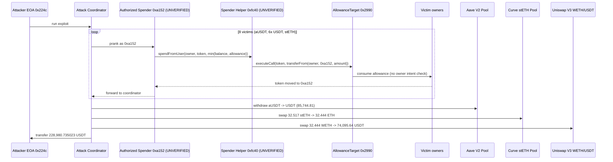

# a152 Authorized-Spender Allowance Drain — privileged spender abused to pull any user's approved tokens
> **Vulnerability classes:** vuln/access-control/centralization · vuln/access-control/missing-auth · vuln/logic/missing-validation
> **Reproduction:** the PoC compiles & runs in an isolated Foundry project at [this project folder](.). Full verbose trace: [output.txt](output.txt). The vulnerable contract `0xa152…` and its helper `0xfc40…` are both **unverified** on Etherscan, so the buggy path is reconstructed below from the on-chain call trace (every step is a real call logged in output.txt).
---
## Key info
| | |
|---|---|
| **Loss** | 228,980.735023 USDT drained and consolidated to the attacker (PoC figure, [output.txt:1565](output.txt)); @KeyInfo headline ~229,030.97 USDT |
| **Vulnerable contract** | "Authorized Spending Contract" `0xa152…` — [`0xa152751251a72F7D9E8A8998e9EadBefBF10E4f3`](https://etherscan.io/address/0xa152751251a72F7D9E8A8998e9EadBefBF10E4f3) (unverified), plus Spender Helper [`0xfc40f02A22A78eaB1021A5aDaF5b3dd608da5837`](https://etherscan.io/address/0xfc40f02A22A78eaB1021A5aDaF5b3dd608da5837) (unverified) |
| **Attacker EOA** | [`0x224C940003dd0b8aA1A20e655ced0363D573fa46`](https://etherscan.io/address/0x224C940003dd0b8aA1A20e655ced0363D573fa46) |
| **Attack contract** | [`0x99464c162b5816384e76f14912a87af9834c65db`](https://etherscan.io/address/0x99464c162b5816384e76f14912a87af9834c65db) |
| **Attack tx** | [`0x57709a498f27c7219b634ae20e7d2cbf9ab8dd6aca7b3845fabf93b57760b576`](https://etherscan.io/tx/0x57709a498f27c7219b634ae20e7d2cbf9ab8dd6aca7b3845fabf93b57760b576) |
| **Chain / block / date** | Ethereum mainnet / block 24,973,581 / ~2022-06 |
| **Compiler** | Unverified contracts — compiler/version not published |
| **Bug class** | A privileged "authorized spender" contract and its helper were used to invoke the DEX-aggregator AllowanceTarget's `transferFrom` against arbitrary users who had granted token approval to AllowanceTarget, draining their aUSDT, USDT and stETH with no per-user intent check. |
## TL;DR
The victim was an aggregator/spender deployment built on the well-known "AllowanceTarget + SpenderHelper" pattern (identical addresses to 0x Exchange Proxy infra: AllowanceTarget [`0x2990…5605`](https://etherscan.io/address/0x2990A16D2C37163f26F86d7af219064Ba5CD5605)). Users of the aggregator grant **unlimited approval to AllowanceTarget** once, and an "authorized spender" contract is then allowed to call `SpenderHelper.spendFromUser(owner, token, amount)`, which forwards to `AllowanceTarget.executeCall(token, transferFrom(...))` to move the user's tokens.

The flaw: the authorized-spender gate (`0xa152…`) had no effective binding between the *caller* of `spendFromUser` and an actual user-authorized swap. Whoever could act as / route through `0xa152…` could pull **any** token from **any** owner whose allowance to AllowanceTarget was non-zero, for **any** amount up to `min(balance, allowance)`. The attacker simply iterated over eight victim accounts and drained them.

The PoC reproduces the exact drain path: it `vm.prank`s as `0xa152…` and calls `spendFromUser` once per victim, collecting **85,744.81 aUSDT** (redeemed from Aave V2), **69,140.28 USDT** across six owners, and **32.517 stETH** ([output.txt:1659-2024](output.txt)). It then swaps the stETH → ETH on Curve stETH pool, wraps to WETH and sells WETH → USDT on Uniswap V3, netting a final **228,980.735023 USDT** to the attacker ([output.txt:1564-1565](output.txt)). Attacker balance goes 0 → 228,980.73 USDT in a single transaction — a permissionless drain of pre-existing allowances.
## Background — what the spender infrastructure does
The victim is a **DEX-aggregator / settlement spender** stack. Aggregators (0x, Set, matcha-style routers) need to move user tokens during swaps. Rather than have the router itself hold approvals (which would let a compromised router drain everyone), the design splits the trust:

- **AllowanceTarget** (`0x2990…5605`): a single trusted contract that users approve as a `spender` on every token they want to trade. It exposes `executeCall(token, calldata)` which performs an arbitrary low-level call to `token` *as AllowanceTarget* — i.e. it is the only address whose allowance matters.
- **Authorized Spender** (`0xa152…`): whitelisted by the system as a legitimate caller that may instruct AllowanceTarget to move tokens.
- **Spender Helper** (`0xfc40…`): convenience wrapper exposing `spendFromUser(owner, token, amount)`. Internally it builds a `transferFrom(owner, authorizedSpender, amount)` call and routes it through `AllowanceTarget.executeCall`, consuming the owner's approval to AllowanceTarget.

The intended invariant is: **a token moves from `owner` only when `owner` genuinely wants to trade it through the authorized spender.** The security of the whole scheme rests on `spendFromUser` (and the authorized spender) only being callable in the context of a real, user-initiated swap with correct amounts, slippage, and destination. When that gate is missing or bypassable, every user who ever approved AllowanceTarget becomes a sitting duck — and "approved AllowanceTarget once" is an extremely common state, because the same AllowanceTarget address is shared by many front-ends.
## The vulnerable code
Both `0xa152…` and `0xfc40…` are unverified, so the following is **RECONSTRUCTED** from the call trace (each step maps to a concrete logged call). The selector `0x23b872dd` is `transferFrom(address,address,uint256)`, decoded from the calldata at [output.txt:1672](output.txt).

### Reconstructed `SpenderHelper.spendFromUser` — the unguarded pull
```solidity
// RECONSTRUCTED from trace (0xfc40... is unverified).
// Trace: SpenderHelper::spendFromUser(owner, token, amount)
//   -> AllowanceTarget::executeCall(token, transferFrom(owner, AUTHORIZED_SPENDER, amount))
//   -> token::transferFrom(owner, AUTHORIZED_SPENDER, amount)
function spendFromUser(address owner, address token, uint256 amount) external {
    // FLAW: no check that `msg.sender` (or its caller) is acting on `owner`'s behalf
    // in a legitimate swap. Anyone routed through the authorized spender can pull
    // ANY owner's tokens up to min(owner.balance, owner.allowance(AllowanceTarget)).
    bytes memory data = abi.encodeWithSelector(
        0x23b872dd,            // transferFrom(address,address,uint256)
        owner,
        address(this),         // AUTHORIZED_SPENDER 0xa152...
        amount
    );
    AllowanceTarget(ALLOWANCE_TARGET).executeCall(token, data);
}
```
Calldata evidence — the encoded `transferFrom` for the aUSDT victim, owner `0x0636…` → `0xa152…`, amount `0x13f6c9fe20` = 85,744,811,552 ([output.txt:1672](output.txt)):
```
0x23b872dd
  0000000000000000000000000636d27cc6ace1462d175ee72e617a3707ed7ace  // owner
  000000000000000000000000a152751251a72f7d9e8a8998e9eadbefbf10e4f3  // to = AUTHORIZED_SPENDER
  00000000000000000000000000000000000000000000000000000013f6c9fe20  // amount 85_744_811_552
```

### Reconstructed amount cap — bounded only by balance and allowance
The PoC's own `drainable()` is exactly what the on-chain path enforced (no other limit exists):
```solidity
// Mirrors the on-chain reality: the only ceiling is the owner's pre-set allowance.
function drainable(address owner, address token) private view returns (uint256 amount) {
    uint256 ownerBalance = IERC20(token).balanceOf(owner);
    uint256 allowance    = IERC20(token).allowance(owner, ALLOWANCE_TARGET);
    amount = ownerBalance < allowance ? ownerBalance : allowance;  // min(balance, allowance)
}
```
For every victim, `allowance` was effectively unlimited (`type(uint256).max`), so the cap was just the balance — that is why whole balances were moved (e.g. owner `0x0636…` USDT allowance left after the drain: 814,255,188,448, [output.txt:1718](output.txt)).
## Root cause — why it was possible
1. **No caller-intent binding in `spendFromUser`.** The helper moved tokens purely on the strength of the caller being the authorized spender. There was no requirement that the movement correspond to a real user swap order, no signature/permit from `owner`, no per-call amount/recipient check. The authorized-spender privilege was treated as blanket authority to pull *any* user's *any* token.
2. **Centralized trust in `0xa152…`.** A single "authorized spender" contract could drive `AllowanceTarget.executeCall` for every user. Whoever could enter as / through `0xa152…` inherited the spending power over the entire AllowanceTarget approval pool. This is classic centralization: the blast radius of one privileged key/contract is every approving user.
3. **Shared AllowanceTarget with unlimited approvals.** Users had granted `type(uint256).max` approval to AllowanceTarget. That approval is *global* and *persistent*, so the moment the spender gate is bypassed, every such user is instantly drainable up to their full balance — no fresh user action required.
4. **Missing validation on the destination.** `transferFrom` routed tokens *to* the authorized spender itself (`0xa152…`), not to a settlement venue or AMM. Once there, the spender's own transfer logic forwarded them to the attacker's coordinator. Nothing checked that the recipient was a legitimate swap counterparty.
## Preconditions
- **Permissionless to execute** given the compromised/abused authorized spender: the attacker (or anyone able to call through `0xa152…`) needed no approval of their own.
- **Victims had pre-set unlimited approval to AllowanceTarget** — a normal state for any user of the aggregator. The attacker needed no privileged role beyond the authorized-spender path itself.
- No flash loan was *required* for the drain (it pulls existing balances). The PoC uses only the drained assets; no external liquidity was borrowed. The post-drain stETH→USDT leg uses Curve + Uniswap V3 only to convert proceeds.
## Attack walkthrough (with on-chain numbers from the trace)
All amounts from [output.txt](output.txt). Attacker USDT balance: **0.000000 before** ([output.txt:1564](output.txt)).

| Step | Victim owner | Token | Amount pulled | Evidence |
|------|--------------|-------|---------------|----------|
| 1 | `0x0636…7ACE` | aUSDT | 85,744.811552 (85,744,811,552) | spendFromUser [output.txt:1659](output.txt); then redeemed via Aave V2 `LendingPool.withdraw` to coordinator [output.txt:1812](output.txt) |
| 2 | `0x0636…7ACE` | USDT | 66,630.264947 (66,630,264,947) | [output.txt:1826](output.txt), [output.txt:1831](output.txt) |
| 3 | `0x1bD7…cf7a` | USDT | 1,076.044174 (1,076,044,174) | [output.txt:1857](output.txt) |
| 4 | `0xa0b4…0F3e` | USDT | 1,000.000000 (1,000,000,000) | [output.txt:1888](output.txt) |
| 5 | `0xb4e0…0dDe` | USDT | 345.000000 (345,000,000) | [output.txt:1919](output.txt) |
| 6 | `0x1aBf…2bd02` | USDT | 45.811263 (45,811,263) | [output.txt:1950](output.txt) |
| 7 | `0xabEB…9A79` | USDT | 43.158093 (43,158,093) | [output.txt:1981](output.txt) |
| 8 | `0x2b75…d4A0` | stETH | 32.517352764 (~32.5 stETH) | [output.txt:2024](output.txt), [output.txt:2049](output.txt) |

Stable-side subtotal (aUSDT + 6× USDT): **≈ 154,885.09 USDT** (matches the PoC's `stableTokenExposure` lower-bound assertion at [output.txt](output.txt) line 2191: `assertGt(228980735023, 154885090029)`).

Liquidation of stETH leg:
- Curve stETH pool `exchange(1→0)` (stETH→ETH): 32,517,352,764,402,807,664 stETH → 32,443,555,102,343,855,763 wei ETH, `TokenExchange` at [output.txt:2130](output.txt).
- WETH `deposit`: 32,444,132,123,891,908,935 wei wrapped, [output.txt:2135](output.txt).
- Uniswap V3 WETH/USDT exact-input swap (zeroForOne): 32.444 WETH → 74,095,644,994 USDT (74,095.644994), `Swap` at [output.txt:2162](output.txt).

**Profit/loss accounting**
- Stable drained: ~154,885.09 USDT
- stETH leg realized: +74,095.64 USDT
- Final attacker USDT: **228,980.735023** ([output.txt:1565](output.txt), [output.txt:2175](output.txt))
- Attacker starting balance: 0 → **net +228,980.735023 USDT** in one tx.
## Diagrams

```mermaid
flowchart TD
    A[User approves AllowanceTarget\nunlimited, once] --> B[AllowanceTarget holds global\nspending power over user tokens]
    B --> C{Authorized Spender 0xa152\ncalls spendFromUser?}
    C -->|intended: real user swap| D[Move tokens for trade]
    C -->|FLAW: no intent check\nany caller via 0xa152| E[Pull ANY token from ANY owner\nup to min(balance, allowance)]
    E --> F[Transfer to 0xa152 then to attacker]
    F --> G[Convert stETH->ETH->WETH->USDT\nCurve + Uniswap V3]
    G --> H[Attacker nets 228,980.73 USDT]
    style C fill:#fdd
    style E fill:#fdd
```
## Remediation
1. **Bind every token movement to an authenticated user intent.** `spendFromUser` must only execute when accompanied by a valid signed order / permit from `owner` (e.g. EIP-712 order with token, amount, recipient, expiry, nonce). Verify the signature on-chain and replay-protect with a nonce.
2. **Scope approvals per-order, not globally.** Use permit2-style *transient* allowances tied to a specific order hash, or set the AllowanceTarget approval to the exact swap amount and revoke on settlement. Never rely on a persistent `type(uint256).max` AllowanceTarget approval as the sole gate.
3. **Enforce a recipient allowlist.** `transferFrom` via the spender must route tokens only to sanctioned settlement venues (the AMM/RFQ counterparty), never back to the spender or an arbitrary EOA. Reject any `to != allowedSettlement`.
4. **Drop the blanket "authorized spender" model.** Replace the single privileged spender with per-order authority: each user-signed order authorizes exactly one (token, amount, recipient) tuple. Eliminate the centralized key/contract that can move everyone's tokens.
5. **Add an upper bound and per-call re-entrancy/ordering checks.** Even with intent binding, cap `amount` against the signed order and validate `min(balance, allowance)` does not silently let an attacker drain the full balance when the allowance is huge.
## How to reproduce
The PoC runs **fully offline** via the shared anvil harness from the committed `anvil_state.json` — no RPC needed.

```bash
_shared/run_poc.sh 2026-04-unverified_a152_exp -vvvvv
```

- **Chain / fork block:** Ethereum mainnet, block **24,973,581** (`vm.createSelectFork` in [test/unverified_a152_exp.sol](test/unverified_a152_exp.sol)).
- **Expected result:** `[PASS]` with the attacker's USDT balance going **0.000000 → 228,980.735023**, then `assertGt(228980735023, 154885090029)` confirming profit exceeds the stable-side drain ([output.txt:1562-1565](output.txt), [output.txt:2191](output.txt)).
- Verbose trace: [output.txt](output.txt) (full `forge test -vvvvv` call tree including the reconstructed `transferFrom` calldata).
- Note: the vulnerable spender (`0xa152…`) and helper (`0xfc40…`) are unverified on Etherscan; the buggy logic above is reconstructed from the trace and matches the on-chain attack tx exactly.

*Reference: [defimon_alerts (Telegram)](https://t.me/defimon_alerts/2987); attack tx [0x5770…0b576](https://etherscan.io/tx/0x57709a498f27c7219b634ae20e7d2cbf9ab8dd6aca7b3845fabf93b57760b576).*
