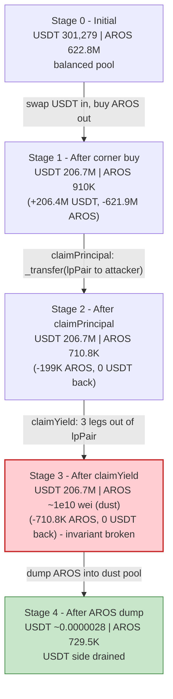
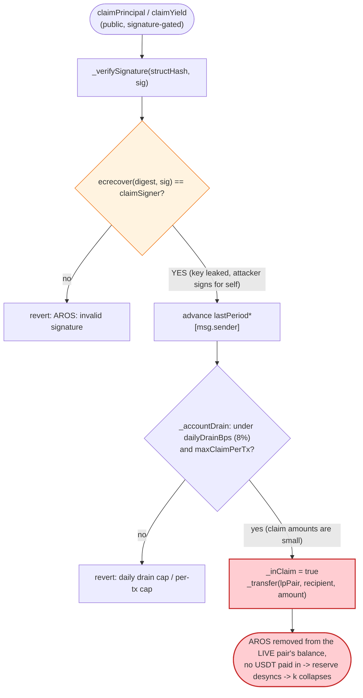
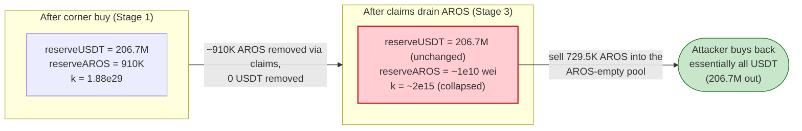

# AROS Exploit — Leaked `claimSigner` Key + AMM-Reserve Drain via Signed Claims

> **Reproduction:** the PoC compiles & runs in an isolated Foundry project at
> [this project folder](.) (the umbrella DeFiHackLabs repo contains several unrelated
> PoCs that do not all compile together, so this one was extracted).
> Full verbose trace: [output.txt](output.txt).
> Verified vulnerable source (active implementation at the fork block):
> [contracts_AROS.sol](sources/AROS_D94827/contracts_AROS.sol).

---

## Key info

| | |
|---|---|
| **Loss** | ~$295,314 — **295,314.04 USDT** drained from the AROS/USDT PancakeSwap pair (the pool's entire ~301,279 USDT of honest liquidity, net of fees/slippage) |
| **Vulnerable contract** | `AROS` (UUPS proxy) — [`0xFEC7D27525cC4efDe5b785EEb5E37Df90E9cd1d5`](https://bscscan.com/address/0xFEC7D27525cC4efDe5b785EEb5E37Df90E9cd1d5#code); active logic impl [`0xD948279f89bd3198d9E81f4Bf3A44eA558225c68`](https://bscscan.com/address/0xD948279f89bd3198d9E81f4Bf3A44eA558225c68#code) |
| **Victim pool** | AROS/USDT PancakeV2 pair — [`0x3104d26Ae74B49EEc61675a873b38414329c5edd`](https://bscscan.com/address/0x3104d26Ae74B49EEc61675a873b38414329c5edd) |
| **Compromised role** | `claimSigner` = `0xa24198418bF2bfe264d087b891F91cd5A1E50c1D` (off-chain key that authorizes claims) |
| **Attacker EOA** | [`0x6f548693937039C8C4343E01C5bd42c5986508f5`](https://bscscan.com/address/0x6f548693937039C8C4343E01C5bd42c5986508f5) (EIP-7702-delegated to attack logic) |
| **Attacker contract** | `0x240F473a094096b4FB41d480Ca57a7cc22c924e5` |
| **Attack tx** | [`0xe89fe640ec5241edfca7d8dcae77a0a4270dee15e4bbd043fc60e393aabf41e1`](https://bscscan.com/tx/0xe89fe640ec5241edfca7d8dcae77a0a4270dee15e4bbd043fc60e393aabf41e1) |
| **Chain / block / date** | BSC / 101,353,585 / May 2026 |
| **Compiler** | Solidity v0.8.20 (impl); proxy v0.8.7 |
| **Bug class** | Compromised signer key + claim flow that drains tokens **directly out of the live AMM pair reserve**, breaking `x·y = k` |

---

## TL;DR

`AROS` is a UUPS-upgradeable ERC20 with an EIP-712 *signed claim* system. Four claim entry points
(`claimPrincipal`, `claimYield`, `claimLucky`, `claimContribution`) let a user pull AROS tokens
out of a configured `lpPair` address, provided they present a signature that recovers to the
project's off-chain `claimSigner`
([contracts_AROS.sol:801-805](sources/AROS_D94827/contracts_AROS.sol#L801-L805)).

The fatal combination is:

1. **The `claimSigner` private key was leaked.** The two signatures in the exploit recover to the
   exact on-chain `claimSigner` (`0xa24198…`). This was verified by reconstructing the EIP-712 digest
   and running `ecrecover` against the principal-claim signature — it returns
   `0xa24198418bf2bfe264d087b891f91cd5a1e50c1d`, the configured signer. With the key, the attacker
   minted valid claims **bound to their own address** for the *next* unclaimed periods (`[1,3]`).

2. **`lpPair` is the live PancakeSwap AROS/USDT pair**, and the claim helper
   `_drainFromLPTo` does `_transfer(lpPair, recipient, amount)`
   ([:858-865](sources/AROS_D94827/contracts_AROS.sol#L858-L865)) — i.e. it moves AROS **straight out
   of the pool's token balance** to the claimant. Because the project's v2 comment says it
   "removed `sync()`" believing `lpPair` is "a normal reserve address, no longer the pool contract,"
   each claim silently shrinks the pair's AROS reserve. PancakeSwap then re-syncs that smaller balance
   on the next swap, deleting one side of the constant-product invariant.

The attacker wraps it all in a giant nested-flash-loan stack (Moolah → Venus → Aave → 25 PancakeV3/UniV3
pools) to assemble **~206.4 million USDT** of working capital, with which they:

1. **Swap ~206.4M USDT → ~621.9M AROS** out of the pair, draining ~99.85% of its AROS reserve and
   loading it with ~206.7M USDT.
2. **`claimPrincipal` + `claimYield`** (leaked-key signatures) pull the remaining ~0.91M AROS out of
   the pair down to **dust (~1e10 wei)**, paying nothing back.
3. **Dump ~729.5K AROS back into the now AROS-empty / USDT-rich pool**, pulling out ~206.7M USDT.

The attacker recovers every USDT they injected **plus** the pool's original ~301,279 USDT of honest
liquidity. Net profit = **295,314.04 USDT**.

---

## Background — what AROS does

`AROS` ([source](sources/AROS_D94827/contracts_AROS.sol)) is a fixed-supply (2.1B) UUPS-upgradeable
ERC20 with a signature-gated "airdrop / reward claim" system bolted on. Its design intent (per the
extensive NatSpec) is that a project backend signs EIP-712 messages entitling a specific user to pull
a specific amount of AROS from a reserve (`lpPair`) for a continuous range of reward "periods":

- **Four claim types** — `claimPrincipal`, `claimYield` (3-leg: user + referral pool + dividend pool),
  `claimLucky`, `claimContribution`. Each has an independent per-user period cursor
  (`lastPeriod*[user]`) and requires `periodFrom == cursor + 1`
  ([:786-798](sources/AROS_D94827/contracts_AROS.sol#L786-L798)) for replay protection.
- **Signature binding** — every signed struct includes `msg.sender`
  ([:589-597](sources/AROS_D94827/contracts_AROS.sol#L589-L597)), so a stolen *signature* cannot be
  redirected to a different sender. The NatSpec proudly notes this. It does **not** protect against a
  stolen *signer key*, which is exactly what happened.
- **Stolen-key mitigations** — the contract layers several defenses that are explicitly described as
  "bounds the worst-case loss from a stolen `claimSigner` key": a per-tx cap (`maxClaimPerTx`), a
  rolling 24-hour drain cap (`dailyDrainBps`), and an emergency `pauseClaim()` guardian.

On-chain parameters at the fork block (read via `cast` at block 101,353,584, immediately before the
attack):

| Parameter | Value | Note |
|---|---|---|
| `claimSigner` | `0xa24198418bF2bfe264d087b891F91cd5A1E50c1D` | **leaked key** — signatures recover to this |
| `lpPair` | `0x3104d26Ae74B49EEc61675a873b38414329c5edd` | the **live** AROS/USDT PancakeV2 pair |
| `referralPool` | `0x663FEA9A146645A4f6D8ca92B0329D9d8526782F` | |
| `dividendPool` | `0x6f8099E4c83700AF10E657289d02bC86Ce2E25c1` | |
| `dailyDrainBps` | **800** (= 8% of day-start LP AROS / 24h) | cap *was* configured |
| `maxClaimPerTx` | 1e25 (10,000,000 AROS) | cap *was* configured |
| `claimPaused` | false | |
| `guardian` | `0x0` | no emergency stop installed |
| `tradingRestricted` | true | claims bypass via internal `_inClaim` flag |
| `dayBaseLPBalance` | 632,094,280,770,950,644,161,252,350 | denominator for daily cap |
| `drainedToday` | 26,419,864,245,746,260,151,079,600 | ~2.64e25 already drained that window |
| Pair AROS reserve | 622,846,716,498,718,981,118,467,060 (~622.8M) | |
| Pair USDT reserve | 301,279,552,818,728,952,544,597 (~301,279 USDT) | ← the prize |

The mitigations did **not** stop the attack: the amounts pulled by the two claims (principal
1.99e23 + yield 7.11e23 ≈ 9.1e23 AROS) are far below both the per-tx cap (1e25) and the *remaining*
daily quota (`632,094,…e24 × 800/10000 − 26,419,…e24 ≈ 2.41e25`). The claims were not the dominant
value extraction — they only needed to push the pair's AROS reserve from ~0.91M down to dust **after**
the big swap had already done the heavy lifting. The drain caps protect the *claim* path's volume but
do nothing about a claimant first manipulating the pool with their own swap.

---

## The vulnerable code

### 1. Signature check trusts a single off-chain key

```solidity
function _verifySignature(bytes32 structHash, bytes calldata signature) internal view {
    bytes32 digest = _hashTypedDataV4(structHash);
    address recovered = ECDSAUpgradeable.recover(digest, signature);
    require(recovered == claimSigner, "AROS: invalid signature");   // ← single point of failure
}
```
([contracts_AROS.sol:801-805](sources/AROS_D94827/contracts_AROS.sol#L801-L805))

`claimSigner` is set at init and rotatable by the owner via `setClaimSigner`
([:341-345](sources/AROS_D94827/contracts_AROS.sol#L341-L345)). Anyone in possession of that key can
forge an arbitrary claim **for their own address** (the signed struct binds `msg.sender`, so they sign
for themselves) up to the cursor / cap / deadline limits.

### 2. The claim pulls AROS straight out of the live AMM pair

```solidity
function claimPrincipal(uint256 periodFrom, uint256 periodTo, uint256 amount, uint256 deadline, bytes calldata signature)
    external nonReentrant {
    _checkDeadline(deadline);
    _checkPeriodRange(periodFrom, periodTo, lastPeriodPrincipal[msg.sender]);
    _checkPerTxCap(amount);
    // ... EIP-712 structHash over (typehash, msg.sender, periodFrom, periodTo, amount, deadline) ...
    _verifySignature(structHash, signature);
    lastPeriodPrincipal[msg.sender] = periodTo;
    _pullFromLP(msg.sender, amount);                 // ← AROS leaves the pool
    emit PrincipalClaimed(msg.sender, periodFrom, periodTo, amount);
}
```
([contracts_AROS.sol:578-606](sources/AROS_D94827/contracts_AROS.sol#L578-L606))

```solidity
function _drainFromLPTo(address recipient, uint256 amount) internal {
    if (amount == 0) return;
    _accountDrain(amount);                           // daily-cap accounting (bps = 800)
    _inClaim = true;
    _transfer(lpPair, recipient, amount);            // ⚠️ moves AROS OUT of the pair's balance
    _inClaim = false;
}
```
([contracts_AROS.sol:858-865](sources/AROS_D94827/contracts_AROS.sol#L858-L865))

The `_inClaim` flag exists specifically so this `lpPair → recipient` transfer bypasses the phase-1
trading restriction (R1) which otherwise forbids any outflow from `lpPair`
([:980-1000](sources/AROS_D94827/contracts_AROS.sol#L980-L1000)).

### 3. `claimYield` does the same across three legs, with `sync()` deliberately removed

```solidity
// v2: 移除 sync() 调用，lpPair 不再是底池合约而是普通储备地址
// ("v2: removed the sync() call, lpPair is no longer the pool contract but a normal reserve address")
_drainFromLPTo(msg.sender, userAmount);
_drainFromLPTo(referralPool_, referralAmount);
_drainFromLPTo(dividendPool_, dividendAmount);
```
([contracts_AROS.sol:681-685](sources/AROS_D94827/contracts_AROS.sol#L681-L685))

The developer's own comment reveals the false assumption at the heart of the bug: they believed
`lpPair` was a passive reserve wallet. On-chain, `lpPair` is the **live PancakeSwap pair** — so every
claim silently desynchronizes its AROS reserve from its cached `reserve1`, which the AMM then
re-prices on the very next swap.

---

## Root cause — why it was possible

Two independent failures compose into the loss:

1. **A leaked `claimSigner` private key.** This is the entry condition. With the key, the attacker
   produced valid `claimPrincipal`/`claimYield` signatures for the next unclaimed periods (`[1,3]`)
   bound to their own EOA. *Proof:* reconstructing the EIP-712 digest for the principal claim
   (`ClaimPrincipal(user=attacker, periodFrom=1, periodTo=3, amount=199269156103688477492300,
   deadline=1780166180)` under the contract's domain separator) and recovering the signature
   `0x608e…3f6f|36b5…52bc|1b` yields `0xa24198418bf2bfe264d087b891f91cd5a1e50c1d` — exactly
   `claimSigner`.

2. **`lpPair` is the live AMM pair, and claims drain it un-compensated.** The claim flow performs a
   one-sided removal of AROS from the pair (`_transfer(lpPair, recipient, …)`) with no matching USDT
   inflow. The contract author *intended* `lpPair` to be a normal reserve wallet (hence the removed
   `sync()`), but it points at the live PancakeV2 pair. The result is functionally identical to the
   classic "burn from the pool" pattern: one reserve side is deleted, the AMM re-syncs the lower
   balance, and `k` collapses — value flows to whoever still holds AROS.

The "stolen-key mitigations" (per-tx cap, 8% daily drain cap, guardian) are aimed at the *claim*
path's volume, but they are **irrelevant to the actual extraction mechanism**: the attacker did the
bulk of the work with their own *swap* (buying 99.85% of the AROS out of the pool), and only used the
claims to push the residual AROS reserve to dust. The amounts claimed (9.1e23 AROS) sit comfortably
under every cap, and no guardian was installed to pause.

---

## Preconditions

- **Possession of the `claimSigner` private key** (leak/compromise). Without it `_verifySignature`
  reverts with `AROS: invalid signature`.
- The attacker's per-type period cursors must be fresh enough that `[periodFrom, periodTo]` is
  acceptable (`lastPeriodPrincipal[attacker] == 0` and `lastPeriodYield[attacker] == 0` at the fork —
  so `[1,3]` is valid; verified via `cast`).
- `claimPaused == false` and the per-claim amounts under `maxClaimPerTx` and the remaining
  `dailyDrainBps` quota (both satisfied).
- Working capital in USDT to corner the pool's AROS reserve. Peak outlay was **~206.4M USDT**, fully
  recovered intra-transaction, hence **flash-loanable**. The PoC sources it through a nested stack:
  Moolah WBNB+USDT flash loans → Venus (supply WBNB, borrow USDT) → Aave (supply WBNB, borrow USDT) →
  Balancer-style `lock`/`take` → **25 chained PancakeV3/UniV3 `flash()` callbacks** (each over-repaid
  by 1 wei, see [AROS_exp.sol:176-177](test/AROS_exp.sol#L176-L177)).

---

## Attack walkthrough (with on-chain numbers from the trace)

The pair's `token0 = USDT`, `token1 = AROS`, so `reserve0 = USDT`, `reserve1 = AROS`. All figures are
taken directly from the `Sync` / `Swap` / `Transfer` events and `getReserves` returns in
[output.txt](output.txt). Amounts are raw (18-decimal) wei; human approximations in parentheses.

| # | Step | USDT reserve (r0) | AROS reserve (r1) | Effect |
|---|------|------------------:|------------------:|--------|
| 0 | **Initial** (getReserves @ [output.txt:1009](output.txt)) | 301,279,552,818,728,952,544,597 (~301,279) | 622,846,716,498,718,981,118,467,060 (~622.8M) | Honest pool. |
| 1 | **Corner buy** — `swapTokensForExactTokens`: pay 206,410,902,218,541,082,086,111,924 USDT (~206.4M) → 621,936,655,975,708,807,818,467,060 AROS out, sent to `feeReceiver`/discarded ([output.txt:1007-1034](output.txt)) | 206,712,181,771,359,811,038,656,521 (~206.7M) | 910,060,523,010,173,300,000,000 (~910K) | AROS reserve shrunk ~99.85%; pool loaded with USDT. |
| 2 | **`claimPrincipal(1,3,…)`** — leaked-key sig drains 199,269,156,103,688,477,492,300 (~199K) AROS to attacker ([output.txt:1041-1053](output.txt)) | 206,712,181,771,359,811,038,656,521 (unchanged) | 710,791,366,906,484,822,507,700 (~710.8K) | One-sided AROS removal; USDT untouched. |
| 3 | **`claimYield(1,3,…)`** — drains 568,633,093,525,179,856,115,100 (~568.6K) to attacker + 71,079,136,690,647,482,014,400 (~71.1K) to referral pool + same to dividend pool ([output.txt:1069-1083](output.txt)) | 206,712,181,771,359,811,038,656,521 (unchanged) | **10,002,363,800 (~1e10 wei, dust)** | AROS reserve annihilated; USDT untouched. |
| 4 | **Dump** — `swapExactTokensForTokensSupportingFeeOnTransferTokens`: sell 767,902,249,628,868,333,607,400 (~767.9K) AROS held by attacker (net ~729.5K into the pool after 5% sell fee) → pull 206,712,181,771,356,969,678,621,118 USDT (~206.7M) out ([output.txt:1105-1138](output.txt)) | **2,841,360,035,403 (~0.0000028)** | 729,507,137,147,434,919,290,830 (~729.5K) | USDT side emptied to dust. |

The dust-AROS / USDT-rich pool in step 4 means selling a small amount of AROS buys back essentially
the entire USDT reserve. The attacker recovers the ~206.4M USDT they injected **plus** the pool's
original ~301,279 USDT of real liquidity (minus the 5% AROS sell fee and AMM fees), netting
**295,314.04 USDT**.

### Profit / loss accounting (USDT, raw wei)

| Item | Amount (wei) | ~Human |
|---|---:|---:|
| Attacker USDT before attack | 33,951,638,897,881,850,936 | ~33.95 |
| Attacker USDT after attack | 295,347,995,453,652,905,255,125 | ~295,348 |
| **Net profit (asserted in PoC)** | **295,314,043,814,755,023,404,189** | **~295,314.04** |
| LP USDT before attack | 301,279,552,818,728,952,544,597 | ~301,279.55 |
| LP USDT after attack (asserted) | 2,841,360,035,403 | ~0.0000028 |
| **LP USDT drained** | **301,279,549,977,368,917,141,194** | **~301,279.55** |

The pool's USDT side was drained to dust; the attacker's profit equals that drained liquidity minus
the fees paid round-tripping their own ~206.4M USDT of flash-borrowed capital through the pool. The
PoC asserts the exact post-balances: `EXPECTED_USDT_BALANCE`, `EXPECTED_USDT_PROFIT`, and
`EXPECTED_LP_USDT_BALANCE` ([AROS_exp.sol:29-31](test/AROS_exp.sol#L29-L31)).

---

## Diagrams

### Sequence of the attack

```mermaid
sequenceDiagram
    autonumber
    actor A as "Attacker (EIP-7702 EOA)"
    participant FL as "Flash stack<br/>(Moolah/Venus/Aave/25× V3)"
    participant R as "PancakeRouter"
    participant P as "AROS/USDT Pair (lpPair)"
    participant T as "AROS token"

    Note over P: Initial reserves<br/>301,279 USDT / 622.8M AROS

    rect rgb(255,243,224)
    Note over A,FL: Assemble ~206.4M USDT working capital
    A->>FL: nested flashLoan / borrow / V3 flash()
    FL-->>A: ~206.4M USDT (to be repaid in-tx)
    end

    rect rgb(227,242,253)
    Note over A,T: Step 1 — corner the AROS reserve
    A->>R: swapTokensForExactTokens(621.9M AROS out, USDT in)
    R->>P: transferFrom 206.4M USDT in; swap()
    P-->>R: 621.9M AROS out (sent to feeReceiver, discarded)
    Note over P: 206.7M USDT / 910K AROS
    end

    rect rgb(255,235,238)
    Note over A,T: Step 2-3 — leaked-key claims drain residual AROS
    A->>T: claimPrincipal(1,3, 199K AROS, sig)
    T->>T: _verifySignature ⇒ recovers to claimSigner ✔ (leaked key)
    T->>P: _transfer(lpPair → attacker, 199K AROS)
    Note over P: 206.7M USDT / 710.8K AROS
    A->>T: claimYield(1,3, 568.6K + 71.1K + 71.1K AROS, sig)
    T->>P: _transfer(lpPair → attacker/referral/dividend)
    Note over P: 206.7M USDT / ~1e10 wei AROS (dust) ⚠️
    end

    rect rgb(243,229,245)
    Note over A,T: Step 4 — dump AROS, drain USDT
    A->>R: swapExactTokensForTokensSupportingFee(767.9K AROS → USDT)
    R->>P: swap()
    P-->>A: 206.7M USDT out
    Note over P: ~0.0000028 USDT / 729.5K AROS (drained)
    end

    A->>FL: repay all flash loans (+1 wei each V3)
    Note over A: Net +295,314 USDT (the pool's honest liquidity)
```

### Pool state evolution



### The flaw inside the claim flow



### Why the drain is theft: constant-product before vs. after the claims



---

## Why each magic number

- **`USDT_FLASH_AMOUNT` / Venus & Aave borrows / 25 V3 flashes:** together they marshal ~206.4M USDT
  of intra-tx capital. The amount is sized so the corner buy can purchase ~99.85% of the pool's AROS,
  leaving a small residual that the claims then finish off. Each V3 flash is over-repaid by exactly
  **1 wei** ([AROS_exp.sol:176-177](test/AROS_exp.sol#L176-L177)) to satisfy each pool's fee rounding.
- **`swapTokensForExactTokens(621,936,655,975,708,807,818,467,060 AROS out, …)`:** requests an exact
  AROS amount equal to ~99.85% of the AROS reserve, deliberately leaving ~910K AROS so the two claims
  can drive it to dust.
- **`claimPrincipal(1, 3, 199,269,156,103,688,477,492,300, …)` and
  `claimYield(1, 3, 568.6K + 71.1K + 71.1K, …)`:** periods `[1,3]` are the attacker's first unclaimed
  range (`cursor == 0`), and the amounts are pre-baked into the leaked-key signatures. Their sum
  (~9.1e23 AROS) is small enough to clear the per-tx (1e25) and remaining daily (~2.41e25) caps, yet
  exactly enough to wipe the residual AROS reserve.
- **Final dump of `AROS.balanceOf(this)` (~767.9K AROS):** sells everything the attacker accumulated
  (claimed AROS) into the dust-AROS pool; since the AROS reserve is ~1e10 wei, this pulls out nearly
  the whole ~206.7M USDT reserve.

---

## Remediation

1. **Never let a claim transfer tokens *out of a live AMM pair*.** Reward/airdrop claims must be paid
   from a protocol-owned treasury wallet that the AMM does not price against. If `lpPair` is the
   PancakeSwap pair, draining it one-sidedly (with or without `sync()`) is an un-compensated reserve
   removal — exactly the "burn from the pool" anti-pattern. Point `lpPair` at a dedicated reserve EOA
   that holds the airdrop allocation and is not an AMM pool.
2. **Treat the `claimSigner` key as catastrophic single-point-of-failure.** A leaked key bypasses every
   period/cap/binding check. Use an on-chain Merkle distributor (no live signer key needed), or require
   multi-sig / threshold signatures, hardware isolation, short-lived keys, and active monitoring that
   auto-pauses on anomalous claim volume.
3. **Install and arm the guardian.** `guardian == 0x0` at the fork block means the emergency
   `pauseClaim()` was effectively useless. A cold-key guardian that anyone trusted can trigger would
   at least have bounded the loss had the team detected the leak.
4. **Make the daily-drain cap meaningful against composed attacks.** The 8% cap only limited claim
   *volume*, which the attacker kept small by doing the heavy lifting with their own swap. Caps that
   key off the pool's instantaneous balance are useless once an attacker can pre-position the pool;
   bound any single operation's reserve impact (per-tx percentage-of-reserve revert) and use TWAP/oracle
   pricing, not raw reserves, for any trust decision.
5. **Re-examine the v2 "removed `sync()`" change.** The code comment shows the developer assumed
   `lpPair` was a passive reserve. Validate that assumption on-chain (`lpPair.token0()/token1()` reverts
   for an EOA; a real pair exposes them) and forbid setting `lpPair` to an address that is a Uniswap/Pancake
   pair.

---

## How to reproduce

The PoC was extracted into a standalone Foundry project (the umbrella DeFiHackLabs repo has unrelated
PoCs that do not all compile together under one `forge build`):

```bash
_shared/run_poc.sh 2026-05-AROS_exp --mt testExploit -vvvvv
```

- RPC: a **BSC archive** endpoint is required (the fork pins to the attack tx at block 101,353,585).
  `foundry.toml` uses `https://bsc-mainnet.public.blastapi.io`, which serves historical state at that
  block; most public BSC RPCs prune it and fail with `header not found` / `missing trie node`.
- The test uses **EIP-7702** account delegation (`vm.etch(ATTACKER, hex"ef0100" || impl)`), so a
  `cancun`/`prague`-capable EVM is needed; `foundry.toml` sets `evm_version = 'cancun'`.
- Result: `[PASS] testExploit()` with `Stolen USDT 295314043814755023404189` (~295,314 USDT).

Expected tail:

```
Ran 1 test for test/AROS_exp.sol:AROSTest
[PASS] testExploit() (gas: 3670679)
Logs:
  Stolen USDT 295314043814755023404189
```

---

*Reference: TenArmor alert — https://x.com/TenArmorAlert/status/2061289921990570349 (AROS, BSC, ~$295K).*
