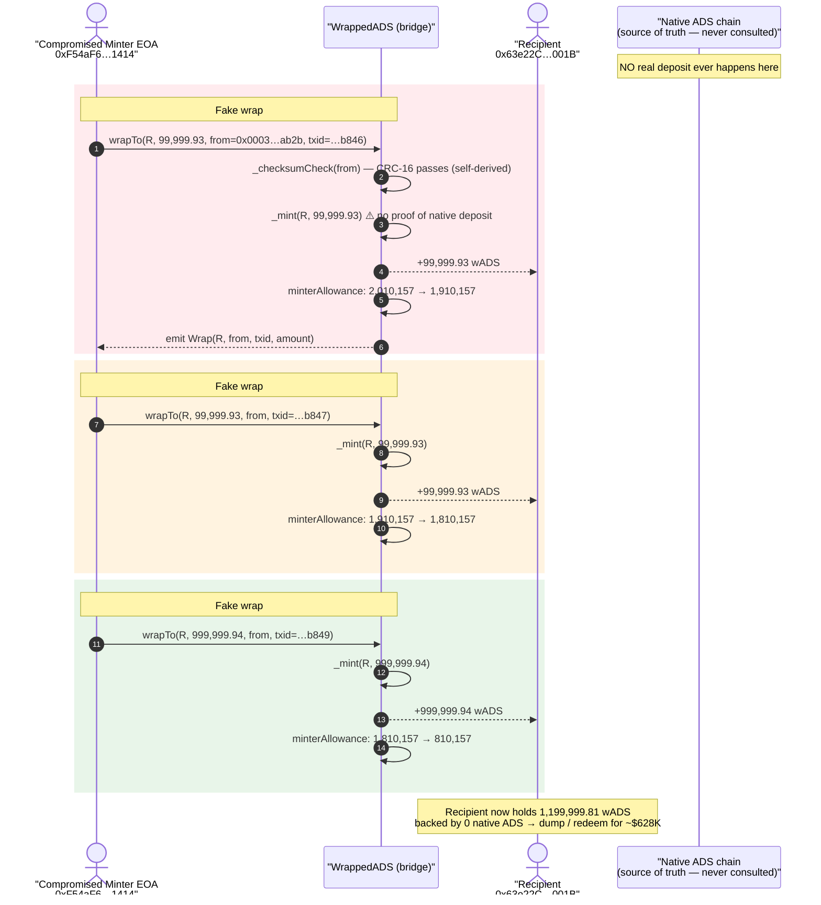
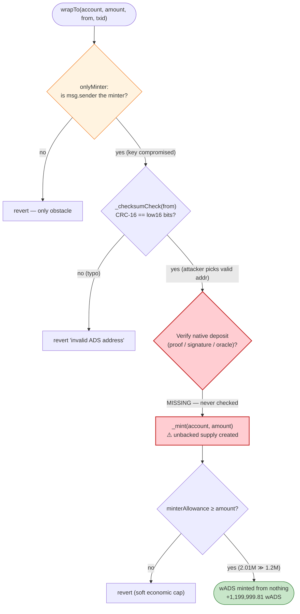
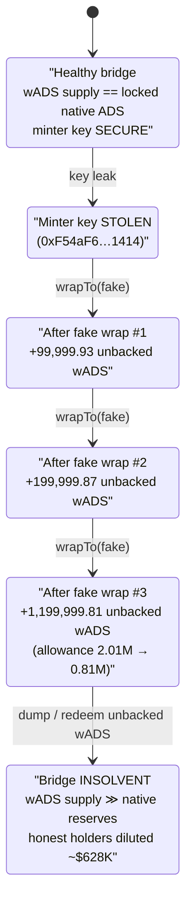

# Adshares Bridge Exploit — Compromised Minter Key Fabricates Cross-Chain Mints

> **Vulnerability classes:** vuln/access-control/secret-exposure · vuln/bridge/missing-validation

> **One-line summary:** The Adshares `WrappedADS` bridge mints wrapped ADS purely on the say-so of a
> privileged "minter" role; once the minter key was compromised, the attacker called `wrapTo()` with
> entirely fabricated native-chain deposit data and minted ~1.2M wADS (~$628K) out of thin air.

> **Reproduction:** the PoC compiles & runs in an isolated Foundry project at
> [this project folder](.) (the umbrella DeFiHackLabs repo contains many unrelated PoCs that do not
> compile together, so this one was extracted). Full verbose trace:
> [output.txt](output.txt). Verified vulnerable source:
> [sources/WrappedADS_cfcEcF/WrappedADS.sol](sources/WrappedADS_cfcEcF/WrappedADS.sol).

---

## Key info

| | |
|---|---|
| **Loss** | ~$628K — **1,199,999.81 wADS** minted from nothing (3 fake "wrap" mints) |
| **Vulnerable contract** | `WrappedADS` (ADS) — [`0xcfcEcFe2bD2FED07A9145222E8a7ad9Cf1Ccd22A`](https://etherscan.io/address/0xcfcEcFe2bD2FED07A9145222E8a7ad9Cf1Ccd22A#code) |
| **Victim / source of value** | The wADS bridge itself — every honest wADS holder is diluted; redemption pressure falls on the bridge's native-chain ADS reserves |
| **Attacker EOA = compromised Minter** | `0xF54aF6D4d18C8d61F504E530C127eaa05E011414` (the legitimate bridge minter; its key was stolen) |
| **Beneficiary account (mint recipient)** | `0x63e22Ce9Bde9bb8892a447258abfCaa4142f001B` |
| **Attack contract** | N/A — calls came directly from the compromised minter EOA |
| **Attack tx (1 of 3)** | [`0x8844…8789`](https://etherscan.io/tx/0x8844b4ec371c4b13d7fac701b5d546a7c2fba12621a9596dd14b662b14408789) |
| **Attack tx 2** | [`0xfba8…3509`](https://etherscan.io/tx/0xfba82bb34515d7aefbf0c89582b71d915ec8861c96babaafdc882743dbc23509) |
| **Attack tx 3** | [`0xa347…9ca3`](https://etherscan.io/tx/0xa3476575183204b4a662dd6ee56f6499d806e4f41ce83d98366752d31e9e9ca3) |
| **Chain / block / date** | Ethereum mainnet / 25,102,963 / **2026-05-15** (block ts 1778877131 UTC) |
| **Compiler** | Solidity **v0.5.17**, optimizer enabled (100,000 runs) |
| **Bug class** | Trusted bridge mint authority with **no on-chain proof of the native deposit** — a single key compromise = unlimited mint |

---

## TL;DR

`WrappedADS` is the Ethereum side of the Adshares cross-chain bridge. The native ADS chain is supposed
to be the source of truth: a user locks ADS natively, an off-chain relayer (the **minter**) observes
that deposit and calls `wrapTo(recipient, amount, from, txid)` on Ethereum to mint the matching wADS.

The fatal design choice is that **`wrapTo()` does not verify the native deposit at all.** The only check
applied to the bridge inputs is `_checksumCheck(from)` — a CRC-16 over the native-address bytes
([WrappedADS.sol:1101-1112](sources/WrappedADS_cfcEcF/WrappedADS.sol#L1101-L1112)) — which the caller can
satisfy trivially because the checksum is computed from the address itself. There is **no Merkle proof,
no signature over the native transaction, no light-client attestation, no oracle**. The `txid` and
`from` parameters are pure event-logging metadata; the contract mints regardless of whether the deposit
ever happened.

That means the entire security of the mint reduces to "do you hold the minter key?". When the minter EOA
`0xF54aF6…1414` was compromised, the attacker simply called `wrapTo()` three times with **fabricated
native-chain addresses and transaction IDs**, directing the freshly minted wADS to a fresh account
`0x63e22C…001B`:

1. `wrapTo(0x63e22C…, 99,999.93 ADS, fakeFrom, fakeTxid#1)` → 99,999.93 wADS minted from nothing.
2. `wrapTo(0x63e22C…, 99,999.93 ADS, fakeFrom, fakeTxid#2)` → another 99,999.93 wADS.
3. `wrapTo(0x63e22C…, 999,999.94 ADS, fakeFrom, fakeTxid#3)` → 999,999.94 wADS.

Total: **1,199,999.81 wADS** conjured into existence, fully backed by *nothing*. The minter's
pre-existing allowance (≈2,010,157 ADS) was the only ceiling, and it was 1.7× larger than the amount
stolen, so it was never a constraint. The stolen wADS was then dumped/bridged elsewhere for ~$628K.

---

## Background — what the Adshares bridge does

[Adshares](https://adshares.net/) (ADS) is a blockchain advertising protocol that runs its own native
L1. `WrappedADS` ([source](sources/WrappedADS_cfcEcF/WrappedADS.sol)) is the ERC-20 representation of ADS
on Ethereum, with **11 decimals** (unusual — matching native ADS precision).

The intended bridge flow is a classic **lock-and-mint** with a trusted relayer:

| Side | Action |
|------|--------|
| **Native ADS chain** | User sends ADS to the bridge's native deposit address. The transaction has a native sender address (`from`, a 64-bit `node:user` identifier) and a native transaction id (`txid`). |
| **Off-chain relayer (the "minter")** | Watches the native chain. When it sees a confirmed deposit, it calls `wrapTo(recipient, amount, from, txid)` on Ethereum to mint the matching wADS to the user, logging the native `from`/`txid` for traceability. |
| **Ethereum (`WrappedADS`)** | Mints wADS to `recipient`, emits `Wrap(to, from, txid, amount)`, and decrements the minter's `minterAllowance`. |

To unwrap, a holder calls `unwrap(amount, to)` which burns wADS and emits an `Unwrap` event that the
native chain relayer honors by releasing native ADS.

The role model (read directly from the source):

| Role | Powers |
|------|--------|
| **Owner** (`OwnerRole`) | `minterApprove` / `increaseMinterAllowance` / `decreaseMinterAllowance`, add/remove minters, pause, reclaim funds. Owner is implicitly a minter & pauser ([:1066-1068](sources/WrappedADS_cfcEcF/WrappedADS.sol#L1066-L1068)). |
| **Minter** (`MinterRole`) | The only role that can call `wrapTo()` and mint wADS, bounded by `minterAllowance`. |
| **Pauser** | Can pause/unpause all transfers (the attack tx ran while *unpaused*). |

The on-chain facts at the fork block (read from the trace):

| Fact | Value |
|---|---|
| Minter under attack | `0xF54aF6…1414` |
| Minter's `minterAllowance` before | `201,015,711,563,668,775` raw = **2,010,157.12 ADS** |
| Minter's `minterAllowance` after | `81,015,730,609,403,391` raw = **810,157.31 ADS** |
| Allowance consumed | **1,199,999.81 ADS** (= total minted) |
| Recipient balance before | `5,044,540` raw = 0.00005 ADS (a fresh account) |
| Recipient balance after | `119,999,980,959,309,924` raw = **1,199,999.81 wADS** |

The allowance was the *only* limit on the mint, and the attacker stayed comfortably under it.

---

## The vulnerable code

### 1. `wrapTo()` mints on the minter's word alone

[WrappedADS.sol:987-993](sources/WrappedADS_cfcEcF/WrappedADS.sol#L987-L993):

```solidity
function wrapTo(address account, uint256 amount, uint64 from, uint64 txid)
    public onlyMinter whenNotPaused returns (bool)
{
    _checksumCheck(from);                 // ← only "validation": a self-checkable CRC-16
    emit Wrap(account, from, txid, amount); // ← from / txid are pure log metadata
    _mint(account, amount);               // ← unconditional mint of `amount` wADS
    _minterApprove(
        _msgSender(),
        _minterAllowances[_msgSender()].sub(amount, "WrappedADS: minted amount exceeds minterAllowance")
    );                                    // ← only ceiling: the minter's own allowance
    return true;
}
```

There is **no parameter that ties the mint to a real native deposit.** `from` and `txid` exist solely
to populate the `Wrap` event for off-chain bookkeeping; the contract never checks them against anything.
`_mint` ([:433-439](sources/WrappedADS_cfcEcF/WrappedADS.sol#L433-L439)) is the stock OpenZeppelin mint —
it simply increases `totalSupply` and credits `account`.

### 2. The "checksum" is not authentication

[WrappedADS.sol:1101-1112](sources/WrappedADS_cfcEcF/WrappedADS.sol#L1101-L1112):

```solidity
function _checksumCheck(uint64 adsAddress) pure internal {
    uint8 x;
    uint16 crc = 0x1D0F;
    for (uint8 i = 7; i >= 2; i--) {
        x = (uint8)(crc >> 8) ^ ((uint8)(adsAddress >> i*8));
        x ^= x >> 4;
        crc = (crc << 8) ^ ((uint16)(x) << 12) ^ ((uint16)(x) << 5) ^ ((uint16)(x));
    }
    require(crc == (adsAddress & 0xFFFF), "WrappedADS: invalid ADS address");
}
```

This is a CRC-16/XMODEM-style checksum over the high bytes of the 64-bit native address, asserting that
the **last 16 bits equal the CRC of the preceding bits**. It only confirms the `from` value is a
*well-formed* Adshares address — it says nothing about whether that address actually deposited anything.
An attacker computes a valid address offline and the check passes. In this incident the fabricated
`from = 0x000300000025ab2b` passes cleanly: the CRC of `0x000300000025` is `0xab2b`, exactly the low 16
bits (verified independently — `crc == adsAddress & 0xFFFF == 43819`).

### 3. The mint authority is a single hot key

[WrappedADS.sol:900-901](sources/WrappedADS_cfcEcF/WrappedADS.sol#L900-L901) and
[:1066-1068](sources/WrappedADS_cfcEcF/WrappedADS.sol#L1066-L1068):

```solidity
modifier onlyMinter() {
    require(isMinter(_msgSender()), "MinterRole: caller does not have the Minter role");
    _;
}
// ...
function isMinter(address account) public view returns (bool) {
    return MinterRole.isMinter(account) || isOwner(account);
}
```

`wrapTo` is gated only by `onlyMinter`. The minter is a normal externally-owned account whose private
key is held by the off-chain relayer infrastructure. There is no multisig, no per-mint co-signature, no
challenge/dispute window. Possession of that one key is equivalent to an uncapped mint (subject only to
the `minterAllowance` the owner has pre-granted).

---

## Root cause — why it was possible

A trustworthy lock-and-mint bridge must make the Ethereum mint **conditional on cryptographic evidence
that the native lock happened** — typically a relayer signature over `(recipient, amount, srcTxid)`
verified on-chain, a Merkle/SPV proof of the native transaction, or an oracle/light-client attestation
with a quorum. `WrappedADS` does none of this. It collapses the bridge's trust model down to a single
unauthenticated boolean: *"is `msg.sender` the minter?"*

Concretely, three design decisions compose into a critical, unlimited-mint bug:

1. **No proof of deposit.** `wrapTo()` accepts `amount`, `from`, `txid` and mints `amount` immediately.
   The native `from`/`txid` are logged, never validated. The contract cannot tell a real wrap from a fake
   one, so a compromised (or malicious) minter can mint arbitrary supply to any address.
2. **Checksum mistaken for authentication.** The one input check, `_checksumCheck`, is a *format*
   validator (CRC-16). Because the checksum is derived from the address bytes, the caller can always
   produce a passing value. It provides zero security against fabricated deposits — it merely guards
   against typos.
3. **Single-key, non-quorum mint role with a large standing allowance.** The minter is one EOA; its key
   compromise is catastrophic and instant. The `minterAllowance` (≈2.01M ADS) was a soft economic cap,
   not a real safeguard — it was 1.7× the amount actually stolen, so it never triggered. There is no
   per-transaction rate limit, no timelock, no second signer.

Because the mint is unconditional, the attack required **no flash loan, no market manipulation, no
victim interaction** — just the stolen key and three ordinary transactions. The PoC reproduces this by
impersonating the minter with `vm.startPrank(BRIDGE_MINTER, BRIDGE_MINTER)` and replaying the exact
amounts and fabricated `from`/`txid` values from the three on-chain attack transactions.

---

## Preconditions

- **Control of a minter key.** In the live incident the legitimate relayer minter `0xF54aF6…1414` was
  compromised (the txs originate directly from it). Any account with the `Minter` (or `Owner`) role can
  reproduce the mint.
- **Contract not paused.** `wrapTo` is `whenNotPaused`; the bridge was live and unpaused at block
  25,102,963.
- **Sufficient `minterAllowance`.** The minter must have a standing allowance ≥ the amount to mint. Here
  the allowance was 2,010,157 ADS and the attacker minted 1,199,999.81 ADS — well within budget. (An
  Owner has no allowance limit at all and could mint without this constraint.)
- **A CRC-valid `from`.** Trivially satisfiable offline; not a real obstacle.

No market state, liquidity, or timing condition is required — this is a pure authorization/trust failure.

---

## Attack walkthrough (with on-chain numbers from the trace)

The PoC bundles the three real on-chain attack transactions into a single Foundry test by pranking as the
compromised minter. All figures are taken directly from the `Wrap` / `Transfer` / `MinterApproval` events
in [output.txt](output.txt) (token has 11 decimals; ADS = raw / 1e11).

| # | Action (caller = compromised minter `0xF54aF6…1414`) | `from` (fake native addr) | `txid` (fake) | wADS minted | Recipient cumulative | Minter allowance after |
|---|------------------------------------------------------|---------------------------|---------------|------------:|---------------------:|-----------------------:|
| 0 | **Initial state** | — | — | — | 0.00005 ADS | 2,010,157.12 ADS |
| 1 | `wrapTo(0x63e22C…, amount, from, txid#1)` → `_mint` + `Wrap` | `0x0003_00000025ab2b` | `0x0003_0000b8460001` | **99,999.93** | 99,999.93 | 1,910,157.18 |
| 2 | `wrapTo(0x63e22C…, amount, from, txid#2)` → `_mint` + `Wrap` | `0x0003_00000025ab2b` | `0x0003_0000b8470001` | **99,999.93** | 199,999.87 | 1,810,157.25 |
| 3 | `wrapTo(0x63e22C…, amount, from, txid#3)` → `_mint` + `Wrap` | `0x0003_00000025ab2b` | `0x0003_0000b8490001` | **999,999.94** | 1,199,999.81 | **810,157.31** |
| 4 | **Result** — assertions confirm the fabricated supply | — | — | — | **+1,199,999.81 wADS** | 1,199,999.81 consumed |

Raw values for precision (from the trace):

- Mint #1 & #2 amount: `9,999,993,317,172,301` raw each = 99,999.933171723 ADS.
- Mint #3 amount: `99,999,994,319,920,782` raw = 999,999.94319920782 ADS.
- Total minted: `119,999,980,954,265,384` raw = **1,199,999.8095426538 wADS** (matches the PoC assertion
  and the allowance consumed to the wei).

Note the three fake `txid`s are **sequential and self-chosen** (`…b846`, `…b847`, `…b849`) — a tell-tale
sign they were never observed on the native chain; a real relayer would carry the actual native tx ids.
The single `from` is reused across all three "deposits", which a genuine bridge audit trail would never
show for distinct deposits.

### Profit / loss accounting

| Item | Amount |
|---|---:|
| wADS conjured (no backing) | **+1,199,999.81 wADS** |
| Native ADS actually locked to back it | **0** |
| Attacker capital required | ~0 (gas only; ~50k gas/tx) |
| Approx. USD value extracted (per DeFiHackLabs header) | **~$628,000** |

Every minted wADS is unbacked: the bridge's native-chain ADS reserves do not cover it, so the loss is
borne by honest wADS holders (dilution) and ultimately by whoever the unbacked wADS is dumped on or
redeemed against.

---

## Diagrams

### Sequence of the attack



### Trust-model failure inside `wrapTo`



### Bridge backing / supply state evolution



---

## Why each value matters

- **`from = 0x000300000025ab2b`** — a fabricated native ADS address whose CRC-16 checksum (`0xab2b`)
  equals its low 16 bits, so `_checksumCheck` passes. Reused identically across all three "deposits".
- **`txid`s `…b8460001`, `…b8470001`, `…b8490001`** — sequential, attacker-chosen identifiers. They look
  like Adshares native tx ids but correspond to no real native transaction; the contract never checks them.
- **Amounts `99,999.93`, `99,999.93`, `999,999.94` ADS** — the exact amounts from the three real on-chain
  attack txs. Split likely to stay well under the standing `minterAllowance` and to mirror plausible
  bridge volumes.
- **`minterAllowance` 2,010,157 ADS** — the only ceiling on the mint, set by the owner for normal relayer
  operation. At 1.7× the stolen amount it was never a real constraint; an owner-level compromise would
  have had no ceiling at all.

---

## Remediation

1. **Authenticate every mint against the source chain.** `wrapTo` must require cryptographic proof that
   the native deposit occurred — e.g. a relayer signature (ideally a multisig / threshold signature) over
   `keccak256(recipient, amount, srcChainId, srcTxid)`, verified on-chain with `ecrecover`/BLS, or an SPV
   / light-client / Merkle proof of the native transaction. The current contract verifies *nothing* about
   the deposit.
2. **Make `txid` a real anti-replay key, not a log field.** Persist consumed `txid`s in a
   `mapping(uint64 => bool)` and `require(!used[txid])` before minting, then mark it used. This both
   prevents double-mint replays and forces each mint to reference a unique source transaction. (Today the
   same `from`/`txid` could be reused indefinitely.)
3. **Eliminate single-key mint authority.** Replace the single hot minter EOA with a multisig or a
   threshold-signature quorum of independent relayers, so one stolen key cannot mint. Add a per-window
   rate limit and a timelock/guardian veto on large or anomalous mints.
4. **Stop treating the CRC checksum as security.** `_checksumCheck` is fine as a typo guard but must never
   be the gate to minting. Document it as a format check only.
5. **Add solvency invariants & monitoring.** Track `totalSupply` against attested native reserves and
   auto-pause (or block mints) if a single mint or a short window would push wADS supply beyond backed
   reserves. Off-chain monitoring should alarm on mints whose `from`/`txid` don't match observed native
   deposits — exactly the sequential, reused metadata seen here.

---

## How to reproduce

The PoC was extracted into a standalone Foundry project (the umbrella DeFiHackLabs repo has many unrelated
PoCs that fail to compile together under a single `forge build`):

```bash
_shared/run_poc.sh 2026-05-AdsharesBridge_exp -vvvvv
```

- RPC: an **Ethereum mainnet archive** endpoint is required (the fork is pinned to the attack tx, block
  25,102,963). `foundry.toml` uses an Infura archive endpoint, which serves historical state at that block.
- The test impersonates the compromised minter (`vm.startPrank(BRIDGE_MINTER, BRIDGE_MINTER)`) and replays
  the three fabricated `wrapTo` calls, then asserts that exactly `1,199,999.81 wADS` were minted and that
  the same amount was deducted from the minter's allowance.
- Result: `[PASS] testExploit()` with `Stolen wADS 119999980954265384`.

Expected tail:

```
Ran 1 test for test/AdsharesBridge_exp.sol:AdsharesBridgeTest
[PASS] testExploit() (gas: 66339)
Logs:
  Stolen wADS 119999980954265384

Suite result: ok. 1 passed; 0 failed; 0 skipped
```

---

*References: PoC header — total lost ~$628K; alert thread
https://x.com/DefimonAlerts/status/2055751467579936770. Vulnerable source verified on Etherscan:
[0xcfcEcFe2bD2FED07A9145222E8a7ad9Cf1Ccd22A](https://etherscan.io/address/0xcfcEcFe2bD2FED07A9145222E8a7ad9Cf1Ccd22A#code).*
