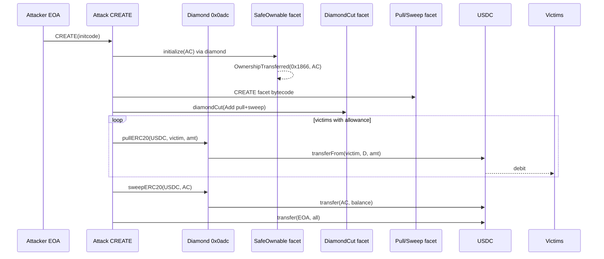

<!-- non-defihacklabs -->
# Aurellion Labs Diamond Re-Init Drain — Unprotected `initialize` → `diamondCut` pull/sweep

> **Vulnerability classes:** vuln/access-control/uninitialized-proxy · vuln/access-control/missing-auth · vuln/dependency/upgradeable-contract · vuln/access-control/missing-owner-check

> **Reproduction:** the PoC compiles & runs in an isolated Foundry project at
> [this project folder](.). The fork is served offline from the bundled
> `anvil_state.json` (local anvil replays Arbitrum state at block `462014666`), so no
> public RPC is required.
> Full verbose trace: [output.txt](output.txt).
> Historical CREATE initcode: [sources/attack_create_input.hex](sources/attack_create_input.hex).

---

## Key info

| | |
|---|---|
| **Loss** | **456,442.536622 USDC** (~$456K) to attacker EOA |
| **Vulnerable contract** | Aurellion EIP-2535 diamond — [`0x0Adc63e71B035d5c7FDB1B4593999FA1F296f1B2`](https://arbiscan.io/address/0x0Adc63e71B035d5c7FDB1B4593999FA1F296f1B2) |
| **SafeOwnable facet** | [`0x3CA79C1cf29B8d19F7c643bB6E6bc9c49762E70f`](https://arbiscan.io/address/0x3CA79C1cf29B8d19F7c643bB6E6bc9c49762E70f) (`owner()` / re-init surface) |
| **DiamondCut facet** | [`0x4415c7a891c2e53015f7A9E3818c366962C0f1C1`](https://arbiscan.io/address/0x4415c7a891c2e53015f7A9E3818c366962C0f1C1) |
| **Malicious pull/sweep facet (CREATE)** | [`0x8e31A0be6b02098939167E4392064136AB5C738D`](https://arbiscan.io/address/0x8e31A0be6b02098939167E4392064136AB5C738D) |
| **Attacker EOA** | [`0x9F49591a3bf95B49cD8d9477b4481Ce9da68d5Ca`](https://arbiscan.io/address/0x9F49591a3bf95B49cD8d9477b4481Ce9da68d5Ca) |
| **Attack contract (CREATE)** | [`0x4D7759e69cC973D338a1ea2fDB125C2b818F4d7e`](https://arbiscan.io/address/0x4D7759e69cC973D338a1ea2fDB125C2b818F4d7e) |
| **Attack tx** | [`0x19cbafae517791e7e73403313d70440abf60558350e419df05c04f816998fe0a`](https://arbiscan.io/tx/0x19cbafae517791e7e73403313d70440abf60558350e419df05c04f816998fe0a) |
| **Asset** | Native USDC on Arbitrum — [`0xaf88d065e77c8cC2239327C5EDb3A432268e5831`](https://arbiscan.io/token/0xaf88d065e77c8cC2239327C5EDb3A432268e5831) |
| **Chain / block / date** | Arbitrum One / fork `462014666` (attack in `462014667`) / 2026-05-12 |
| **Bug class** | Diamond owner set without locking the OZ-style `_initialized` version → unprivileged `initialize(address)` re-seizes owner → `diamondCut` installs `pullERC20`/`sweepERC20` → drains pre-existing USDC allowances |

---

## TL;DR

1. Users had granted **unlimited USDC allowances** to the Aurellion diamond
   `0x0adc…`. That alone is normal; the bug is that the diamond’s **ownership /
   init surface remained open**.

2. The SafeOwnable facet still accepted **`initialize(address)`** because the
   initialization version slot (bytes 0–7 of the ERC-7201 /
   `0xf0c57e…` layout, per SlowMist) was still **0** even though ownership had
   already been assigned via a non-`initialize` path.

3. The attacker’s **CREATE** contract atomically:
   - re-inits the diamond → owner becomes the attack contract
     (`0x1866…` → `0x4D77…`);
   - deploys a tiny facet with `pullERC20` / `sweepERC20`;
   - `diamondCut`s those selectors onto the diamond;
   - `pullERC20`s from four allowance holders (incl. ~451K from `0x2e93…`);
   - sweeps diamond USDC (incl. ~5.4K already sitting on the diamond) to the
     attack contract, then to the attacker EOA.

4. Offline PoC profit matches history exactly: **456,442.536622 USDC**.

This is **Hypothesis A** (protocol diamond hijack via open re-init), **not** pure
approval phishing: victims approved a live protocol diamond that later lost its
owner to re-initialization.

---

## Background

Aurellion Labs operated an EIP-2535 diamond on Arbitrum. Ownership and facet
management were meant to be admin-only. Users interacted with the diamond and
approved it for USDC (and possibly other ERC-20s).

EIP-2535 `diamondCut` is extremely powerful: whoever owns the diamond can replace
any function selector’s implementation. If ownership can be stolen, every past
`approve(diamond, type(uint256).max)` becomes a free `transferFrom` oracle for
the attacker.

OpenZeppelin-style initializers gate with an `_initialized` version. If owner is
written without bumping that version, a later public `initialize` call can
overwrite owner — classic **uninitialized / re-initializable proxy** class,
applied to a diamond facet rather than a UUPS/Transparent proxy.

---

## The vulnerable pattern

### Re-init surface (SafeOwnable facet)

```text
// Conceptual — diamond routes owner()/initialize to facet 0x3CA7…
// SlowMist: initialize(address) was still callable because the
// initializer version in the 0xf0c57e… ERC-7201 slot stayed 0.

function initialize(address newOwner) external {
    // missing: onlyInitializing / reinitializer guard that was already "spent"
    // when owner was first set via a different code path
    _transferOwnership(newOwner);
}
```

Observed on-chain at the moment of attack ([output.txt:1595](output.txt)):

```text
OwnershipTransferred(
  previousOwner: 0x1866Fd4a9e15E0005480b5171B63b43d2d507698,
  newOwner:      0x4D7759e69cC973D338a1ea2fDB125C2b818F4d7e
)
```

### Malicious facet selectors (CREATE runtime)

| Selector | Signature | Behavior |
|----------|-----------|----------|
| `0xe4e832fe` | `pullERC20(address,address,uint256)` | `token.transferFrom(from, diamond, amount)` |
| `0x582515c7` | `sweepERC20(address,address)` | `token.transfer(to, token.balanceOf(diamond))` |

Installed via ([output.txt:1604](output.txt)):

```text
diamondCut(
  [(0x8e31A0be…C738D, Add, [0x582515c7, 0xe4e832fe])],
  address(0),
  ""
)
```

Facet address `0x8e31…` is itself **CREATE**d inside the attack constructor
before the cut.

---

## Root cause

Two conditions were necessary and jointly sufficient:

1. **Initializer not locked.** Ownership existed (`owner() == 0x1866…`) but the
   initializer version remained open, so an unprivileged CREATE could call
   `initialize(address(this))` and become owner.

2. **DiamondCut privilege = full code authority.** Once owner, the attacker
   installed unrestricted ERC-20 pull/sweep functions that trust the diamond’s
   existing allowances — no per-user auth beyond what ERC-20 already granted.

User unlimited approvals amplified impact but are not the root bug. The root
bug is **upgrade/init authority not locked**.

---

## Preconditions

- Diamond already live with SafeOwnable + DiamondCut facets.
- At least one victim holds USDC with `allowance(victim, diamond) > 0`
  (historical: four addresses, one with ~451K USDC).
- Diamond may also hold residual USDC (historical: **5,438.532001**).
- Attacker EOA funded for gas; **nonce 0** at fork block (CREATE address =
  historical attack contract).
- Fork at block **462014666** (one before attack).

---

## Attack walkthrough

Numbers from offline [output.txt](output.txt) replaying the historical CREATE
initcode at block `462014666`.

### Step 0 — Pre-state

| Account | USDC balance | Allowance → diamond |
|---------|-------------:|---------------------|
| Attacker EOA | 0 | 0 |
| Diamond | 5,438.532001 | — |
| `0x2e93…6048` (V1) | 450,999.723188 | max |
| `0xa907…589A` (V2) | 3.0 | max |
| `0xEceD…793E` (V3) | 1.281433 | max |
| `0x4ce0…87C7` (V4) | 0 | max |
| Owner | `0x1866…7698` | — |

([output.txt:1566-1568](output.txt) for pre-owner via SafeOwnable facet.)

### Step 1 — CREATE attack contract

Attacker deploys the historical initcode (constructor args: USDC, diamond).
CREATE address with nonce 0 is exactly `0x4D77…4d7e`
([output.txt:1541](output.txt), [1729](output.txt)).

### Step 2 — Re-init diamond → seize owner

Constructor calls into the diamond’s still-open `initialize` path. SafeOwnable
facet emits `OwnershipTransferred` to the attack contract
([output.txt:1595](output.txt)).

### Step 3 — CREATE malicious facet + `diamondCut`

Constructor deploys facet `0x8e31…` and cuts in `sweepERC20` + `pullERC20`
([output.txt:1604-1608](output.txt)). Storage slot for the selector map is
updated to pack both selectors.

### Step 4 — `pullERC20` victims via `transferFrom`

| Victim | Amount (USDC) | Trace |
|--------|---------------:|-------|
| V1 `0x2e93…` | 450,999.723188 | [output.txt:1622](output.txt) |
| V2 `0xa907…` | 3.0 | [output.txt:1643](output.txt) |
| V3 `0xEceD…` | 1.281433 | [output.txt:1660](output.txt) |
| V4 `0x4ce0…` | 0 (skip) | allowance present, balance 0 |

Each pull is `USDC.transferFrom(victim, diamond, amount)` — authorized solely by
the pre-existing allowance.

### Step 5 — Sweep diamond → attack contract → EOA

- Diamond total after pulls ≈ 450,999.723188 + 3 + 1.281433 + 5,438.532001 =
  **456,442.536622** USDC.
- `sweepERC20` / internal transfer moves that balance to the attack contract
  ([output.txt:1677](output.txt)).
- Attack contract `transfer`s the full amount to the attacker EOA
  ([output.txt:1691](output.txt)).

### Step 6 — Result

```text
Attacker USDC profit: 456442.536622
CREATE deployed:      0x4D7759e69cC973D338a1ea2fDB125C2b818F4d7e
Diamond owner after:  0x4D7759e69cC973D338a1ea2fDB125C2b818F4d7e
```

([output.txt:1537-1543](output.txt))

Exact historical match: `assertEq(profit, 456_442_536_622)`.

---

## Diagrams




---

## Remediation

1. **Lock initialization permanently** after first owner set — use
   `reinitializer` / `_disableInitializers` consistently; never set owner
   through a path that skips the version bump.
2. **Timelock + multisig on `diamondCut`** — diamond upgrades are full code
   authority; treat them like proxy upgrades.
3. **No silent residual balances** — protocol-held ERC-20 should sit in a vault
   with explicit withdraw roles, not on a cuttable diamond address that users
   also approve.
4. **Users:** prefer permit/allowance amount caps; revoke approvals to diamonds
   / routers after use; watch for ownership / facet-change events.

---

## How to reproduce

```bash
cd ~/RustroverProjects/audits/evm-hack-registry
_shared/run_poc.sh 2026-05-AurellionLabs_exp -vvvvv
# → [PASS] testExploit — Attacker USDC profit: 456442.536622
```

PoC strategy ([test/AurellionLabs_exp.sol](test/AurellionLabs_exp.sol)): fork
Arbitrum at `462014666`, prank the historical attacker, `CREATE` the original
initcode (nonce 0 → same address), assert exact USDC profit and owner seizure.

---

*Reference: [ExVul](https://x.com/exvulsec/status/2054151310245851483) ·
[SlowMist TI](https://x.com/SlowMist_Team/status/2054163700035289446) ·
[Aurellion Labs](https://x.com/Aurellion_Labs)*
