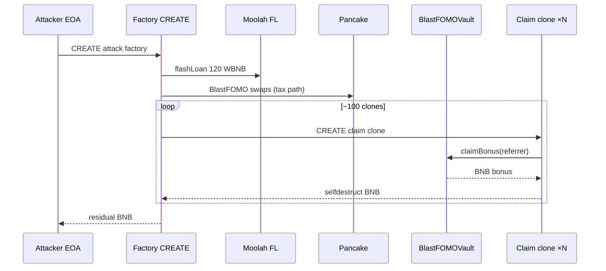

# BlastFOMOVault `claimBonus` clone-churn drains BNB bonus pool

> **Vulnerability classes:** vuln/logic/missing-check · vuln/access-control/broken-logic · vuln/logic/reward-manipulation

> **Reproduction:** the PoC compiles & runs in an isolated Foundry project at
> [this project folder](.). The fork is served offline from the bundled
> `anvil_state.json` (local anvil replays **BSC** state at block `97306496`), so no
> public RPC is required.
> Full verbose trace: [output.txt](output.txt).
> Verified vault source: [src_BlastFOMOVault.sol](sources/BlastFOMOVault_bFb18B/BlastFOMOVault_bFb18B/src_BlastFOMOVault.sol).

<!-- non-defihacklabs -->

---

## Key info

| | |
|---|---|
| **Loss (PoC)** | **1.289508079648543283 BNB** offline (historical on-chain ~**1.288418562948543283 BNB**) |
| **Vulnerable contract** | BlastFOMOVault — [`0xbFb18B2C1c1B6B099F0E2b1E962c03210f24900E`](https://bscscan.com/address/0xbfb18b2c1c1b6b099f0e2b1e962c03210f24900e#code) |
| **BlastFOMO token** | [`0xA7f1d4a9bca6884F464CCD2407909D504e407777`](https://bscscan.com/address/0xa7f1d4a9bca6884f464ccd2407909d504e407777) |
| **Attacker EOA** | [`0xAEA29218262dc6b0904Ca077f6527C49dfd426D9`](https://bscscan.com/address/0xaea29218262dc6b0904ca077f6527c49dfd426d9) |
| **Attack tx** | [`0x0e37a1ba8ae064a10286abbe6bc9c7f89078c252f5db9d3e78115be8d4f189f3`](https://bscscan.com/tx/0x0e37a1ba8ae064a10286abbe6bc9c7f89078c252f5db9d3e78115be8d4f189f3) |
| **Chain / block / date** | BSC / fork `97306496` (attack `97306497`) / ~2026-05-09 |
| **Bug class** | `claimBonus` anti-double-claim is only `lastClaimedRound[msg.sender]` — CREATE clones re-enter each round |
| **Alert** | [ExVul](https://x.com/exvulsec/status/2053176958880747994) |

---

## TL;DR

1. When “Blast Mode” is active, `claimBonus(referrer)` pays a BNB bonus from `bonusPool` to `msg.sender` and records `lastClaimedRound[msg.sender] = blastRound`.
2. That lock is **address-identity only**. A new CREATE contract is a new `msg.sender` and can claim again for the same `blastRound`.
3. Attacker flash-borrows **120 WBNB** (ListaDAO Moolah), routes BlastFOMO via Pancake (tax/processor accounting keeps blast mode/hype live), then spins **~100** minimal clones that each call `claimBonus` and **selfdestruct** BNB back to the helper/EOA path.
4. Net attacker profit ≈ **1.29 BNB**. Vault BNB drops by ~1.86 BNB in the offline run (bonus pool + related payouts).

---

## Root cause (line-level)

```solidity
// src_BlastFOMOVault.sol — claimBonus
require(lastClaimedRound[msg.sender] < blastRound, unicode"Already claimed / 当前轮次已领取");
// ...
lastClaimedRound[msg.sender] = blastRound;
(bool claimerOk,) = payable(msg.sender).call{value: claimerReward}("");
```

There is no durable binding of eligibility to a user key, stake receipt, or non-transferable ID — only the **ephemeral CREATE address**.

---

## Attack path



---

## PoC

- `test/BlastFOMOVault_exp.sol` — historical CREATE initcode replay at block `97306496`.
- Offline: `_shared/run_poc.sh 2026-05-BlastFOMOVault_exp -vvvvv` → `[PASS] testExploit`.
- Profit log: **Attacker BNB profit: 1.289508079648543283**.

---

## Remediation

1. Bind claim eligibility to a **non-CREATE-ephemeral identity** (EOA-only + signed claim, NFT stake id, or Merkle allowlist).
2. Cap total claims per `blastRound` globally and per economic actor.
3. Prefer pull-payment accounting with a single claim accounting entry that cannot be reset by identity churn.
