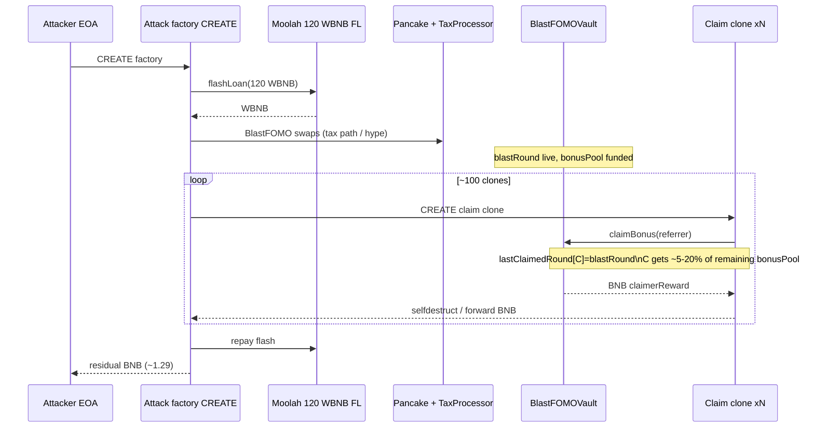
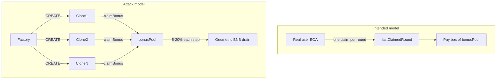

# BlastFOMOVault `claimBonus` clone-churn drains BNB bonus pool

> **Vulnerability classes:** vuln/logic/missing-check · vuln/access-control/broken-logic · vuln/logic/reward-calculation

> **Reproduction:** the PoC compiles & runs in an isolated Foundry project at
> [this project folder](.). The fork is served offline from the bundled
> `anvil_state.json` (local anvil replays **BSC** state at block `97306496`), so no
> public RPC is required.
> Full verbose trace: [output.txt](output.txt).
> Verified vault source: [src_BlastFOMOVault.sol](sources/BlastFOMOVault_bFb18B/BlastFOMOVault_bFb18B/src_BlastFOMOVault.sol).

<!-- non-defihacklabs -->

---

## Key info

| | |
|---|---|
| **Loss (PoC)** | **1.289508079648543283 BNB** offline (historical on-chain ~**1.288418562948543283 BNB**) |
| **Vault drain (PoC)** | **1.855679916799198330 BNB** (`3.665…` → `1.809…`) |
| **Vulnerable contract** | BlastFOMOVault — [`0xbFb18B2C1c1B6B099F0E2b1E962c03210f24900E`](https://bscscan.com/address/0xbfb18b2c1c1b6b099f0e2b1e962c03210f24900e#code) |
| **BlastFOMO token** | [`0xA7f1d4a9bca6884F464CCD2407909D504e407777`](https://bscscan.com/address/0xa7f1d4a9bca6884f464ccd2407909d504e407777) |
| **Flash lender** | ListaDAO Moolah — [`0x8F73b65B4caAf64FBA2aF91cC5D4a2A1318E5D8C`](https://bscscan.com/address/0x8f73b65b4caaf64fba2af91cc5d4a2a1318e5d8c) |
| **Attacker EOA** | [`0xAEA29218262dc6b0904Ca077f6527C49dfd426D9`](https://bscscan.com/address/0xaea29218262dc6b0904ca077f6527c49dfd426d9) |
| **Attack tx** | [`0x0e37a1ba8ae064a10286abbe6bc9c7f89078c252f5db9d3e78115be8d4f189f3`](https://bscscan.com/tx/0x0e37a1ba8ae064a10286abbe6bc9c7f89078c252f5db9d3e78115be8d4f189f3) |
| **Chain / block / date** | BSC / fork `97306496` (attack `97306497`) / ~2026-05-09 |
| **Compiler** | Solidity (Flap Vault V2 stack; verified on BscScan) |
| **Bug class** | `claimBonus` anti-double-claim is only `lastClaimedRound[msg.sender]` — CREATE clones re-claim each round; reward is a live % of `bonusPool` with **no stake / identity binding** |
| **Alert** | [ExVul](https://x.com/exvulsec/status/2053176958880747994) |

---

## TL;DR

1. BlastFOMOVault turns buy-tax BNB into a decaying **hype** meter. When hype crosses `threshold`, **Blast Mode** opens and anyone can call `claimBonus(referrer)`.
2. Each successful claim pays `(bonusPool * bonusBps) / 10_000` BNB (5–20% of the **current** pool) and sets `lastClaimedRound[msg.sender] = blastRound`.
3. That lock is **address-identity only**. A fresh CREATE contract is a new `msg.sender` and can claim again in the same `blastRound`. There is **no stake, no signature, no durable ID**.
4. Attacker flash-borrows **120 WBNB** (ListaDAO Moolah), routes BlastFOMO via Pancake so tax/processor accounting keeps blast mode/hype live, then spins **~100** minimal clones that each `claimBonus` and **selfdestruct** BNB home.
5. Offline PoC: attacker keeps **1.289508079648543283 BNB**; vault native balance drops by **~1.86 BNB**.

---

## Background

**BlastFOMOVault** is a Flap tax-vault product (inherits `VaultBaseV2` + `ReentrancyGuard`). The intended loop:

1. The BlastFOMO token’s **TaxProcessor** routes a share of buy-tax BNB into the vault’s `receive()` path.
2. Incoming BNB updates a stored **hype score** (`HYPE_PER_BNB_WEI = 100` per wei received), after marketing / commission reserves.
3. Hype **decays** every block (`decayPerBlock`).
4. When decayed hype crosses `threshold` from below, `blastRound` increments and Blast Mode is “on” while `hypeScoreStored >= threshold`.
5. In Blast Mode, **any address** may claim once per round from `bonusPool`.

The product NatSpec is explicit ([src_BlastFOMOVault.sol:29–32](sources/BlastFOMOVault_bFb18B/BlastFOMOVault_bFb18B/src_BlastFOMOVault.sol)):

> In each blast round, every address may claim once. Bonus payout is a live percentage of the current `bonusPool` balance: 5% at threshold, scaling linearly up to 20%.

That design is economically unsafe when “address” is free to manufacture via CREATE.

---

## The vulnerable code

### Per-caller round lock (the only double-claim gate)

```solidity
// sources/…/src_BlastFOMOVault.sol:320-347
function claimBonus(address referrer) external nonReentrant {
    _syncHypeScore();

    require(hypeScoreStored >= threshold, unicode"Blast mode inactive / Blast Mode 未开启");
    require(blastRound > 0, unicode"No blast round / 尚未进入爆发轮次");
    require(lastClaimedRound[msg.sender] < blastRound, unicode"Already claimed / 当前轮次已领取");

    uint256 bonusBps = _previewCurrentBonusBps(hypeScoreStored);
    require(bonusBps >= MIN_BONUS_BPS, unicode"Bonus unavailable / 当前无可领奖金");

    uint256 totalReward = _previewClaimableBonus(msg.sender, hypeScoreStored, bonusPool, blastRound);
    // …
    lastClaimedRound[msg.sender] = blastRound;
    bonusPool -= totalPayout;

    (bool claimerOk,) = payable(msg.sender).call{value: claimerReward}("");
    require(claimerOk, unicode"Bonus transfer failed / 奖金转账失败");
    // optional referrer carve-out…
}
```

### Reward = live % of remaining pool (no stake weight)

```solidity
// sources/…/src_BlastFOMOVault.sol:519-539
function _previewClaimableBonus(
    address user, uint256 liveHype, uint256 liveBonusPool, uint256 liveBlastRound
) internal view returns (uint256) {
    if (user == address(0)) return 0;
    if (liveHype < threshold || liveBlastRound == 0) return 0;
    if (lastClaimedRound[user] >= liveBlastRound) return 0;

    uint256 bonusBps = _previewCurrentBonusBps(liveHype);
    if (bonusBps == 0 || liveBonusPool == 0) return 0;

    return (liveBonusPool * bonusBps) / BPS_DENOMINATOR; // 5–20% of *current* pool
}
```

`bonusBps` scales from `MIN_BONUS_BPS = 500` (5%) at threshold to `MAX_BONUS_BPS = 2000` (20%) at `threshold * 4` ([`:503-515`](sources/BlastFOMOVault_bFb18B/BlastFOMOVault_bFb18B/src_BlastFOMOVault.sol)).

There is **no** binding to:

- a prior deposit / stake receipt,
- an EOA-only check,
- a signature over a unique claim id,
- a global claim-count or pool-drain cap beyond `totalPayout <= bonusPool`.

---

## Root cause

Two design choices compose into a drain:

| Layer | Intended intent | Failure |
|---|---|---|
| **Identity** | “One claim per address per `blastRound`” | CREATE makes addresses free → unlimited identities per round |
| **Economics** | Fair share of `bonusPool` via live bps | Every claimer is equal; each takes 5–20% of **remaining** pool → geometric drain under identity churn |

`nonReentrant` only prevents reentrancy into `claimBonus` on the **same** call frame; it does **not** stop sequential claims from distinct clones.

The flash loan + Pancake leg is operational scaffolding (keep hype/blast mode live and fund temporary paths); the **invariant break** is entirely in `claimBonus` + `_previewClaimableBonus`.

---

## Preconditions

1. Vault is in Blast Mode: `hypeScoreStored >= threshold` and `blastRound > 0`.
2. `bonusPool` holds a non-trivial BNB balance (pre-attack vault native ~**3.665 BNB** in the offline fork).
3. Attacker can:
   - Flash-borrow WBNB (Moolah),
   - Trade BlastFOMO on Pancake so tax/processor continues to feed / maintain hype if needed,
   - Deploy many CREATE contracts that each call `claimBonus` and forward BNB (selfdestruct or call).

No guardian / owner privileges required for the drain path.

---

## Attack walkthrough

Exact offline numbers from [output.txt](output.txt):

| Step | Observation |
|---|---|
| Pre | Attacker BNB = `0`; vault BNB = **3.665312255337861049** ([output.txt:1539-1541](output.txt)) |
| 1 | CREATE historical attack factory (attacker nonce path) |
| 2 | Flash-borrow **120 WBNB** from ListaDAO Moolah |
| 3 | Pancake / tax-processor routing keeps Blast Mode / hype conditions satisfied for the claim loop |
| 4 | Spin **~100** claim clones: each is a new `msg.sender` → `lastClaimedRound[clone] < blastRound` |
| 5 | Each clone: `claimBonus(referrer)` → receives `(bonusPool * bonusBps)/1e4` BNB → selfdestruct / forward |
| 6 | Repay flash; residual native to attacker EOA |
| Post | Attacker BNB = **1.289508079648543283**; vault BNB = **1.809632338538662719**; drained **1.855679916799198330** ([output.txt:1540-1544](output.txt)) |





---

## Remediation

1. **Bind claims to a non-ephemeral identity** — EOA-only + signed EIP-712 claim ticket, NFT stake id, or Merkle allowlist tied to a deposit receipt. Never treat bare `msg.sender` as Sybil-resistant.
2. **Require economic stake** before claim eligibility (e.g. hold/lock BlastFOMO or vault shares with a snapshot at round open).
3. **Cap drain per round** — global max payout per `blastRound`, fixed per-claim amount funded at round open (not live % of shrinking pool for unbounded claimers).
4. **Prefer pull accounting** with a single claim accounting entry that cannot be reset by identity churn; emit and index claim ids immutably.
5. If CREATE clones must never be eligible, reject `msg.sender.code.length > 0` **only as a soft mitigation** (contracts can still claim in constructors) — do not rely on this alone.

---

## How to reproduce

```bash
cd /path/to/evm-hack-registry
_shared/run_poc.sh 2026-05-BlastFOMOVault_exp -vvvvv
# → [PASS] testExploit
# → Attacker BNB profit: 1.289508079648543283
```

PoC strategy: replay historical CREATE initcode at fork block `97306496` (see [test/BlastFOMOVault_exp.sol](test/BlastFOMOVault_exp.sol)).

---

*Reference: [ExVul alert](https://x.com/exvulsec/status/2053176958880747994) · attack tx [`0x0e37a1ba…`](https://bscscan.com/tx/0x0e37a1ba8ae064a10286abbe6bc9c7f89078c252f5db9d3e78115be8d4f189f3)*
