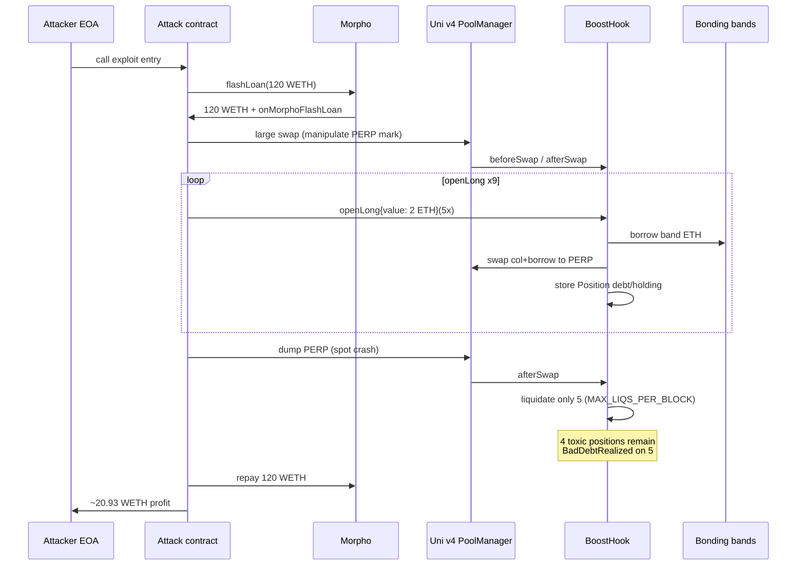
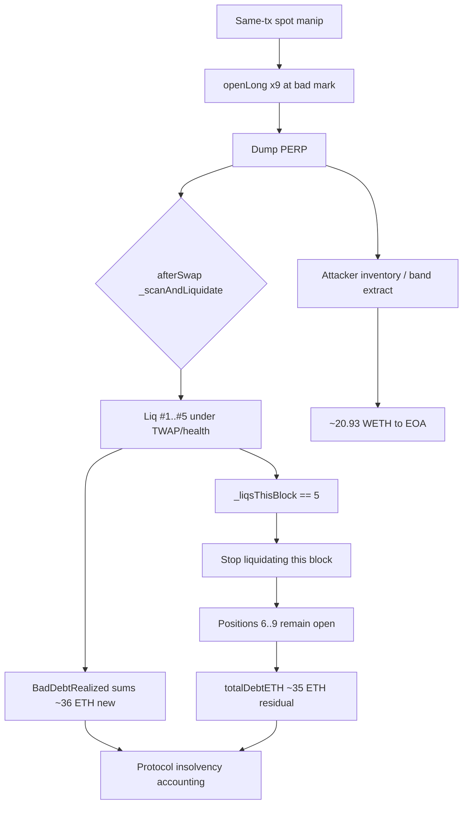
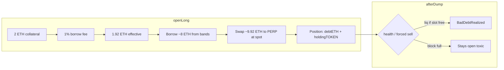

# BoostHook Leveraged Long Exploit — Spot open without post-open solvency + `MAX_LIQS_PER_BLOCK` cascade cap

> **Vulnerability classes:** vuln/oracle/spot-price · vuln/oracle/price-manipulation · vuln/logic/missing-check · vuln/logic/liquidation-logic

> **Reproduction:** the PoC compiles & runs in an isolated Foundry project at
> [this project folder](.). The fork is served offline from the bundled
> `anvil_state.json` (local anvil replays Ethereum state at block `25080847`), so no
> public RPC is required.
> Full verbose trace: [output.txt](output.txt).
> Verified vulnerable source: [src_hook_BoostHook.sol](sources/BoostHook_3db1eb/src_hook_BoostHook.sol).

---

## Key info

| | |
|---|---|
| **Loss** | **~20.9329 WETH** attacker profit; **≥38.327 ETH** realized `totalBadDebtETH`; **~34.9 ETH** residual open `totalDebtETH` after the attack |
| **Vulnerable contract** | `BoostHook` — [`0x3DB1ebB71C735980D12422f153987d89f4d7EacC`](https://etherscan.io/address/0x3DB1ebB71C735980D12422f153987d89f4d7EacC#code) (Uniswap v4 hook) |
| **BoostToken (PERP)** | [`0x6C6bE583c45075A5A3dA03f81c2874607AC111F8`](https://etherscan.io/address/0x6C6bE583c45075A5A3dA03f81c2874607AC111F8) |
| **PoolManager** | [`0x000000000004444c5dc75cB358380D2e3dE08A90`](https://etherscan.io/address/0x000000000004444c5dc75cB358380D2e3dE08A90) |
| **Attacker EOA** | [`0xB0A019Dd22c363e82fA4f96AE1E4b993341f5104`](https://etherscan.io/address/0xB0A019Dd22c363e82fA4f96AE1E4b993341f5104) |
| **Attack contract** | [`0xB64bFf7B5199aBCBb98fEe2Bf4014265fcA85a6D`](https://etherscan.io/address/0xB64bFf7B5199aBCBb98fEe2Bf4014265fcA85a6D) |
| **Attack tx** | [`0xb45cc4d9c13c2c24b4bbf71db9e6f52ed24d174ad23ed2622a290289cebd3811`](https://etherscan.io/tx/0xb45cc4d9c13c2c24b4bbf71db9e6f52ed24d174ad23ed2622a290289cebd3811) |
| **Chain / block / date** | Ethereum mainnet / fork `25080847` (attack in `25080848`) / 2026-05-13 |
| **Compiler** | Solidity `0.8.26` (BoostHook) |
| **Bug class** | Same-transaction spot price manip + leveraged `openLong` records debt/holding without post-open solvency; auto-liq capped at `MAX_LIQS_PER_BLOCK = 5` so 9 toxic positions leave residual protocol bad debt |

---

## TL;DR

1. `BoostHook` is a Uniswap v4 hook that lets users open **leveraged long** positions:
   user posts ETH collateral, the hook borrows more ETH from bonding-curve bands,
   swaps `collateral + borrow` → PERP, and stores `debtETH` / `holdingTOKEN`.

2. `openLong()` records the position from the **spot** swap output and the spot
   `sqrtPriceX96` **without** a post-open solvency / debt-coverage check that would
   reject openings under same-tx manipulated marks
   ([BoostHook.sol:479-531](sources/BoostHook_3db1eb/src_hook_BoostHook.sol)).

3. Auto-liquidation in `afterSwap` uses a **TWAP** health check (good against single
   dumps) but is hard-capped at **`MAX_LIQS_PER_BLOCK = 5`**
   ([BoostHook.sol:42](sources/BoostHook_3db1eb/src_hook_BoostHook.sol),
   [614-635](sources/BoostHook_3db1eb/src_hook_BoostHook.sol)).

4. The attacker flash-loans **120 WETH** from Morpho, manipulates the ETH/PERP v4
   pool, opens **nine** 5× longs (ids 200–208), dumps PERP, and lets `afterSwap`
   liquidate **only five**. Four toxic positions remain; liquidations realize
   **~36.4 ETH** new bad debt (floor **38.33 ETH** total). The attacker keeps
   **~20.93 WETH** after repaying Morpho.

---

## Background

BoostHook is a Uniswap v4 hook for leveraged longs on a bonding-curve token
(PERP / BoostToken). Liquidity is organized as “bands”; opens borrow ETH from
fully-passed bands (capped at 40% of each band’s capacity) and buy PERP on the
hook’s pool (`currency0 = ETH`, `currency1 = PERP`, `hooks = BoostHook`).

Closing / liquidating sells PERP back for ETH, refills bands, and writes any
shortfall into `totalBadDebtETH` (an accounting write-off, not a free ETH mint).

Defense intended by the authors (comments in source):

- (A) liquidation health uses **TWAP**, not spot, so a single dump cannot
  flip health against the same swap’s observation;
- (B) liquidations per block are **capped** to bound cascades.

Defense (A) is correct. Defense (B) is the lever the attacker uses after opening
more toxic positions than the block cap can clear.

---

## The vulnerable code

### `MAX_LIQS_PER_BLOCK` and open entry

```solidity
// sources/BoostHook_3db1eb/src_hook_BoostHook.sol
uint16  public constant MAX_LIQS_PER_BLOCK = 5; // bounds cross-swap liquidation cascades
uint16  public constant MAX_LEVERAGE      = 5;
uint256 public constant LIQUIDATION_HEALTH_BPS = 10_500; // liquidate below 105%
```

### `openLong` — records position from spot path, no post-open solvency

```solidity
function openLong(uint256 leverage, uint256 minHoldingOut, uint256 deadline)
    external payable nonReentrant
    returns (uint256 positionId, uint256 holdingOut)
{
    // ... leverage / collateral checks ...
    uint256 collateral = msg.value;
    uint256 borrowEth  = collateral * (leverage - 1);
    // unlock → walk bands, swap effectiveCol + borrow → TOKEN at *current spot*
    (uint256 actualBorrowed, uint256 swapTokensOut) = abi.decode(ret, (uint256, uint256));
    if (swapTokensOut < minHoldingOut) revert SlippageExceeded();

    _positions[positionId] = Position({
        owner: msg.sender,
        collateralETH: effectiveCol,
        debtETH: actualBorrowed,       // no health check vs post-open mark
        holdingTOKEN: swapTokensOut,
        openSqrtPriceX96: sqrtP,       // spot at open
        // ...
    });
    // no post-open require(healthBps >= LIQUIDATION_HEALTH_BPS)
}
```

### `_scanAndLiquidate` — TWAP health + hard per-block cap

```solidity
function _scanAndLiquidate() internal {
    (int24 twapTick, bool twapOk) = _twapTick(TWAP_SECONDS);
    if (!twapOk) return;
    // ...
    if (_liqsThisBlock >= MAX_LIQS_PER_BLOCK) return;
    uint256 blockRemaining = MAX_LIQS_PER_BLOCK - _liqsThisBlock;
    // liquidates at most min(scanBudget, MAX_LIQS_PER_SWAP, blockRemaining)
}
```

---

## Root cause

Two independent design choices combine:

1. **Open path trusts spot.** Leveraged buys settle against the live Uni v4
   pool. An atomic flash loan can reprice PERP before `openLong`, so the
   debt/holding pair stored on the position is not guaranteed to be solvent at
   a non-manipulated mark after the same transaction unwinds the manip.

2. **Liquidation throughput is intentionally rate-limited.** Even when TWAP
   eventually marks positions liquidatable (or forced sells during the dump
   path realize losses), only **five** liquidations may run per block. Opening
   **nine** underwater positions guarantees residual open debt and large
   `BadDebtRealized` on the five that do clear.

The exploit is not a missing access control; it is a **missing post-open
solvency invariant** plus a **liquidation capacity bound** that turns multi-position
same-block toxicity into permanent protocol bad debt and attacker PnL.

---

## Preconditions

- Pool is initialized and `tradingEnabled` / staking set.
- Morpho has ≥120 WETH available for flash loan.
- Attacker contract already deployed with the multi-leg Morpho callback logic
  (present on-chain before the exploit block).
- Fork at `25080847` (one block before the historical attack).

---

## Attack walkthrough

Numbers below are from the offline `output.txt` replay of the historical attack
contract at block `25080847`.

### Step 0 — Setup

- Attacker EOA `0xb0a0…5104` holds **~0.00274 WETH** before the attack
  ([output.txt:1539](output.txt)).
- `MAX_LIQS_PER_BLOCK() == 5` ([output.txt:1560](output.txt)).
- `totalBadDebtETH` already **~1.889 ETH** from prior activity; residual after
  attack rises to **38.327 ETH**.

### Step 1 — Morpho flash loan 120 WETH

```
Morpho::flashLoan(WETH, 120e18, …)
  → transfer 120 WETH to attack contract
  → onMorphoFlashLoan(120e18, …)
```

([output.txt:1571-1579](output.txt))

### Step 2 — Manipulate ETH/PERP Uni v4 spot

The attack contract routes large ETH→PERP / PERP→ETH flow through the hook’s pool
via a helper router (`0x9c65…6c07`, labeled Sat1SwapRouter in the trace). Example
pre-open dump/pump leg:

- `BoostHook::beforeSwap` / `afterSwap` on pool key
  `{currency0: ETH, currency1: PERP, fee: 0, tickSpacing: 60, hooks: BoostHook}`
  ([output.txt:1598-1607](output.txt)).

This reprices the spot mark used by subsequent `openLong` swaps.

### Step 3 — Open nine 5× longs

Nine calls of the form:

```text
BoostHook.openLong{value: 2 ether}(leverage=5, minHoldingOut=1, deadline=…)
```

Each open:

- Posts **2 ETH** collateral; fee leaves **1.92 ETH** effective collateral.
- Borrows **~8 ETH** of band ETH (`debtETH ≈ 8e18`).
- Buys PERP at the manipulated mark (`holdingTOKEN` decreases as later opens
  face a worse curve after prior buys).

| Position id | Trace | debtETH | holdingTOKEN (approx) |
|-------------|-------|---------|------------------------|
| 200 | [output.txt:1721](output.txt) | ~8e18 | ~3.50e21 |
| 201 | [output.txt:1834](output.txt) | ~8e18 | ~3.12e21 |
| 202 | [output.txt:1948](output.txt) | ~8e18 | ~2.80e21 |
| 203 | [output.txt:2062](output.txt) | ~8e18 | ~2.53e21 |
| 204 | [output.txt:2176](output.txt) | ~8e18 | ~2.30e21 |
| 205–208 | further `PositionOpened` | ~8e18 each | declining |

**Nine** `PositionOpened` events total — more than `MAX_LIQS_PER_BLOCK`.

### Step 4 — Dump PERP; afterSwap liquidates only five

A large reverse swap drives spot down. `afterSwap` runs `_scanAndLiquidate`:

| Liquidated id | Bad debt realized | ethFromSell | Trace |
|---------------|-------------------|-------------|-------|
| 200 | ~7.05 ETH | ~0.95 ETH | [output.txt:2708-2709](output.txt) |
| 201 | ~7.20 ETH | ~0.80 ETH | [output.txt:2745-2746](output.txt) |
| 202 | ~7.31 ETH | ~0.69 ETH | [output.txt:2782-2783](output.txt) |
| 203 | ~7.40 ETH | ~0.60 ETH | [output.txt:2827-2828](output.txt) |
| 204 | ~7.47 ETH | ~0.53 ETH | [output.txt:2863-2864](output.txt) |

After the fifth liquidation, `_liqsThisBlock == 5` and further liquidations in
this block are skipped. Positions **205–208** remain open with toxic debt
(`totalDebtETH ≈ 34.91 ETH` after the attack — [output.txt:1542](output.txt)).

`totalBadDebtETH` ends at **38.327 ETH** ([output.txt:1541](output.txt)).

### Step 5 — Repay Morpho; keep profit

- Attack contract approves Morpho and returns the 120 WETH flash principal.
- Transfers **20.932897159743546561 WETH** to the EOA
  ([output.txt:2988](output.txt)).
- PoC asserts: profit > 20 ETH, bad debt > 38 ETH, residual open debt > 30 ETH.

---

## Diagrams

### High-level attack flow



### Why the liquidation cap matters



### Position accounting (simplified)



---

## Remediation

1. **Post-open solvency invariant.** After the leveraged buy, require
   `tokenValue(holding, safeMark) * 10_000 / debtETH >= OPEN_MIN_HEALTH_BPS`
   using a **manipulation-resistant mark** (TWAP or external oracle), not the
   just-traded spot alone. Revert and roll back the open if the check fails.

2. **Do not allow multi-open cascades that exceed liq capacity.** Either:
   - remove `MAX_LIQS_PER_BLOCK` for same-tx opened debt, or
   - cap the number of new opens per block / per address so it cannot exceed
     remaining liquidation budget, or
   - force liquidations of the opener’s positions before the transaction ends
     if health fails at a safe mark.

3. **Separate manip surface from borrow surface.** Prefer delaying borrow
   against TWAP/oracle and settling leveraged size over multiple blocks if the
   product must keep a per-block liq cap.

4. **Invariant tests.** Foundry invariants: for any sequence of swaps + opens in
   one block, `sum(solvent positions at TWAP) + reserve >= totalDebtETH` or an
   explicit, bounded bad-debt policy with insurance.

---

## How to reproduce

```bash
cd ~/RustroverProjects/audits/evm-hack-registry
_shared/run_poc.sh 2026-05-BoostHook_exp -vvvvv
# expects [PASS] testExploit
```

Online warm (archive RPC; one-time):

```bash
python3 _shared/run-poc/exhaustive_warm.py 2026-05-BoostHook_exp mainnet "$ETH_RPC" --block=25080847
```

---

*Reference: [ExVul security alert — BoostHook Leveraged Long Exploit](https://x.com/exvulsec/status/2054386744435589505)*

<!-- non-defihacklabs: original research PoC; not from SunWeb3Sec/DeFiHackLabs -->
