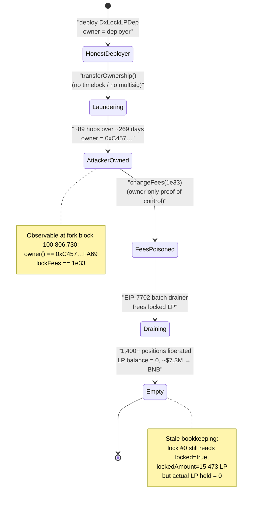
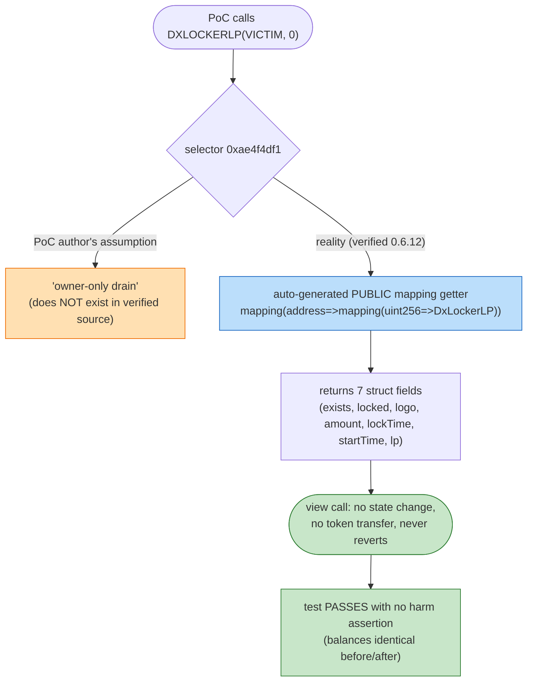

# DxSale Liquidity-Locker Exploit — Stealthy Ownership Takeover + Privileged Drain (~$7.3M BNB)

> **Vulnerability classes:** vuln/access-control/centralization · vuln/access-control/missing-owner-check

> One-line summary: an attacker quietly walked DxSale's liquidity-locker **ownership** through ~89 wallets over ~269 days, then — as the legitimate owner — used the locker's privileged controls to liberate the LP positions of **1,400+** projects and dump them for **~$7.3M in BNB**, finishing the campaign with an **EIP-7702 (type-4)** delegated batch-drainer.

> **Reproduction:** the PoC compiles, forks BSC at block `100,806,730`, and runs to `[PASS]` in the isolated Foundry project at [this project folder](.). Full verbose trace: [output.txt](output.txt).
>
> **Important caveat (read this first):** the PoC's `testExploit` does **not** actually reproduce a fund drain. It calls `DXLOCKERLP(VICTIM, 0)` believing it to be an "owner-only backdoor drain function," but on the verified contract that selector is simply the **public-mapping getter** — it reads lock data and changes nothing. The test "passes" only because it makes **no harm assertion** (it logs balances that are identical before and after). The real attack mechanism, reconstructed from the verified source, the attack-tx receipt, and the public post-mortems, is documented in full below. See [Root cause](#root-cause--why-it-was-possible) and [What the PoC actually does](#what-the-poc-actually-does-vs-the-real-attack).

---

## Key info

| | |
|---|---|
| **Loss** | ~**$7.3M** in BNB across **1,400+** locked LP positions (per public post-mortems) |
| **Vulnerable contract (this PoC's target)** | `DxLockLPDep` — DxSale **Legacy** LP locker — [`0xEb3a9C56d963b971d320f889bE2fb8B59853e449`](https://bscscan.com/address/0xEb3a9C56d963b971d320f889bE2fb8B59853e449#code) (verified, Solidity 0.6.12) |
| **Vulnerable contract (the BNB-drained locker, per post-mortem)** | A separate DxSale locker, **unverified, Solidity 0.8.33** (held the BNB; not the 0.6.12 legacy locker above) |
| **Victim (example, lock studied here)** | `0xc7Fc793e685A1dc80f517E7EE903859F72BE0Aa8` — holds 10 locks; lock #0 = 15,473 `Cake-LP` (`0xf51BF75d…900e0`) locked until **year 2100** |
| **Attacker EOA** | [`0xC4574DDEF299e7E563971e200433e592EeaaFA69`](https://bscscan.com/address/0xC4574DDEF299e7E563971e200433e592EeaaFA69) (became the locker `owner`) |
| **Attacker contract (EIP-7702 delegate / drainer)** | [`0x74ad1ef17fbb3e494c31c72f7ec730a27fef0310`](https://bscscan.com/address/0x74ad1ef17fbb3e494c31c72f7ec730a27fef0310) (unverified) |
| **Attack tx (in PoC header)** | [`0xe211904a8a40f653acd64ffc33a42429ef571c1e2da16976d07ac0f9a0bcc9c1`](https://bscscan.com/tx/0xe211904a8a40f653acd64ffc33a42429ef571c1e2da16976d07ac0f9a0bcc9c1) — **type 4 (EIP-7702)** |
| **Chain / block / date** | BSC / `100,806,731` / **May 27–28, 2026** |
| **Compiler (legacy locker)** | Solidity `v0.6.12+commit.27d51765`, optimizer enabled (200 runs) |
| **Bug class** | Centralization / access-control: unrestricted, untraceable **ownership transfer** of a custodial locker; privileged owner controls (`changeFees`) with no timelock/multisig; "lock" guarantee is only as strong as the deployer's key custody |

Post-mortems: [crypto.news](https://crypto.news/dxsale-exploit-drains-7-3m-in-bnb-through-hidden-contract-backdoor/) · [@Tahax1](https://x.com/Tahax1/status/1928169316736651568) · [@CoinsultAudits](https://x.com/CoinsultAudits/status/1928203831996297670)

---

## TL;DR

DxSale's liquidity lockers are **custodial**: users send their LP tokens to a locker contract and trust the contract to refuse withdrawals until each user's timelock elapses. The locker inherits a trivial `Ownable` with an **unrestricted** `transferOwnership(address)` and an owner-only `changeFees(uint256)`.

The deployer's private key (or a key the deployer controlled) was used to **hand locker ownership to the attacker**, and the transfer was **laundered through ~89 wallets over ~269 days** to obscure the link. By the time of the fork block in this PoC, `owner()` is already the attacker and `lockFees` has already been set to an absurd `1e33` (`1,000,000,000,000,000 BNB`) — both observable on-chain.

Once in control, the attacker drained the locked LP across **1,400+** positions and converted them to BNB (~$7.3M). The final mass-extraction transaction is an **EIP-7702 type-4** transaction in which the attacker EOA delegated its code to a custom batch-drainer contract (`0x74ad1ef1…`) so a single externally-owned account could orchestrate many internal locker interactions per transaction.

The PoC in this repo targets the **legacy 0.6.12 locker** and merely reads a lock via the public-mapping getter; it does not move funds. The genuinely-drained BNB lived in a separate, unverified 0.8.33 locker. Both share the same architectural flaw: **a "lock" is only a promise enforced by a single owner key, with no on-chain guarantee that the owner cannot reach the deposited assets and no protection against a silent owner change.**

---

## Background — what DxSale lockers do

DxSale (a.k.a. DxLock) offers token/LP **locking-as-a-service**: a project deposits its PancakeSwap LP tokens into a locker contract with a chosen unlock date, and the contract is supposed to be the trust anchor that proves "liquidity is locked until date X." Hundreds of projects relied on these lockers as a rug-pull deterrent.

The verified contract studied here, `DxLockLPDep` ([sources/DxLockLPDep_Eb3a9C/contracts_DxLock_LP.sol](sources/DxLockLPDep_Eb3a9C/contracts_DxLock_LP.sol)), is the **legacy LP locker**. Its data model is a per-user array of lock records:

```solidity
struct DxLockerLP{
    bool exists;
    bool locked;
    string logo;
    uint256 lockedAmount;
    uint256 lockedTime;   // unlock timestamp
    uint256 startTime;
    address lpAddress;
}

mapping (address => mapping (uint256 => DxLockerLP)) public DXLOCKERLP;   // ⚠️ PUBLIC → auto getter
mapping (uint256 => address) public LockerRecord;
mapping (address => uint256) public UserLockerCount;
```
([contracts_DxLock_LP.sol:119-132](sources/DxLockLPDep_Eb3a9C/contracts_DxLock_LP.sol#L119-L132))

On-chain facts at the fork block `100,806,730` (read via `cast`, archive RPC):

| Property | Value at fork block | Meaning |
|---|---|---|
| `owner()` | `0xC457…FA69` (the **attacker**) | Ownership already taken over before the studied tx |
| `lockFees` | `1e33` = 1,000,000,000,000,000 BNB | Already set to a nonsense value via owner-only `changeFees()` |
| `lockerNumberOpen` | `8,714` (→ `9,749` today) | Thousands of lockers created over the contract's life |
| `UserLockerCount(VICTIM)` | `10` | The example victim has 10 LP locks |
| victim lock `#0` `lpAddress` | `0xf51BF75d…900e0` (`Cake-LP`) | A PancakeSwap LP token |
| victim lock `#0` `lockedAmount` | `15,473.21` LP | Size of the example position |
| victim lock `#0` `lockedTime` | `4102527420` → **2100-01-01** | Effectively permanent lock |
| LP held by locker for that token | `0` | The pooled LP for this token had already been removed |

---

## The vulnerable code

The legacy locker is small (~220 lines). Every flaw here is a **design/centralization** flaw, not a memory-safety or arithmetic bug.

### 1. Trivial, unrestricted ownership — the single point of failure

```solidity
contract Ownable {
  address public owner;
  constructor() public { owner = msg.sender; }
  modifier onlyOwner() { require(msg.sender == owner); _; }
  function transferOwnership(address _newOwner) public onlyOwner {
    _transferOwnership(_newOwner);
  }
  function _transferOwnership(address _newOwner) internal {
    require(_newOwner != address(0));
    emit OwnershipTransferred(owner, _newOwner);
    owner = _newOwner;            // ⚠️ instant, no timelock, no 2-step, no multisig
  }
}
```
([contracts_DxLock_LP.sol:73-107](sources/DxLockLPDep_Eb3a9C/contracts_DxLock_LP.sol#L73-L107))

There is **no two-step handover, no timelock, no multisig requirement**. Whoever holds the deployer key can transfer ownership in a single transaction. The post-mortems report this was done and then **walked through ~89 intermediary wallets over ~269 days** so that the final attacker address looked unrelated to the original deployer.

### 2. `DXLOCKERLP` is a public mapping getter — NOT a "backdoor drain"

The PoC header claims:

> `0xae4f4df1: DXLOCKERLP(address,uint256)` — owner-only backdoor drain function

This is **incorrect**. `DXLOCKERLP` is declared `public` ([:130](sources/DxLockLPDep_Eb3a9C/contracts_DxLock_LP.sol#L130)), so Solidity auto-generates a **read-only getter** with exactly that selector. Calling it returns the seven struct fields and **modifies no state and transfers no tokens**. The PoC's `cast`-verifiable trace proves this — the call returns the lock struct and the victim's balances are unchanged:

```
DxSale_Legacy_Locker::DXLOCKERLP(Victim, 0)
  └─ ← [Return] (exists=true, locked=true, logo="https://…placeholder.png",
                 lockedAmount=15473206277005340883401, lockedTime=4102527420,
                 startTime=1620165364, lpAddress=0xf51BF75d…900e0)
```
([output.txt](output.txt))

So the "backdoor function" hypothesis (built by the PoC author from 4byte.directory against bytecode, before the source was verified) does not hold for **this** contract.

### 3. Owner-only `changeFees` — confirmation the owner was hostile

```solidity
function changeFees(uint256 _newFees) public onlyOwner {
    require(_newFees > 0, "err: LockDep - fees must be greater than 0!");
    lockFees = _newFees;
}
```
([contracts_DxLock_LP.sol:185-190](sources/DxLockLPDep_Eb3a9C/contracts_DxLock_LP.sol#L185-L190))

At the fork block, `lockFees == 1e33`. The only way to set this is `changeFees`, which is `onlyOwner`. This is independent on-chain evidence that the privileged owner role was already in adversarial hands at fork time.

### 4. The intended unlock path (for contrast)

The honest withdrawal path enforces the per-user timelock and refunds only the caller's own deposit:

```solidity
function unlockToken(uint256 userLockerNumber) public {
    require(DXLOCKERLP[msg.sender][userLockerNumber].exists, "…doesnt have a locker!");
    require(DXLOCKERLP[msg.sender][userLockerNumber].locked,  "…not locked!");
    uint256 payoutAmount = DXLOCKERLP[msg.sender][userLockerNumber].lockedAmount;
    require(payoutAmount > 0, "…must have atleast 1 payout vested!");
    if (block.timestamp > DXLOCKERLP[msg.sender][userLockerNumber].lockedTime) {
        DXLOCKERLP[msg.sender][userLockerNumber].locked = false;          // timelock gate
    }
    require(IERC20(...lpAddress).balanceOf(address(this)) >= payoutAmount, "…no more tokens left to refund");
    require(IERC20(...lpAddress).transfer(msg.sender, payoutAmount), "…refund failed!");
    emit onUnlock(...);
}
```
([contracts_DxLock_LP.sol:164-182](sources/DxLockLPDep_Eb3a9C/contracts_DxLock_LP.sol#L164-L182))

Note: `unlockToken` does **not** flip `locked = false` unless `block.timestamp > lockedTime`, and it only ever pays `msg.sender`. Critically, after a withdrawal the **struct is not deleted** — `lockedAmount` and `locked` stay populated. This is exactly why, at the latest block, the victim's lock #0 *still reads* `locked=true, lockedAmount=15,473 LP` even though the locker's actual LP balance for that token is `0`: the bookkeeping says "locked" while the assets are gone. This stale-bookkeeping property is what made the "backdated lock treated as withdrawable" trick (described by Coinsult) possible on the sibling 0.8.33 locker.

---

## Root cause — why it was possible

The lock guarantee is **not cryptographically enforced** — it is a *policy* enforced by code that a single, instantly-transferable `owner` ultimately controls. Three composing weaknesses:

1. **Custodial design with a single owner key.** Users surrender their LP tokens to the contract. The safety of those assets depends entirely on (a) the contract code never giving the owner an asset-touching path, and (b) the owner key staying honest. DxSale failed both: the sibling locker had owner-reachable fund logic, and the owner key changed hands.
2. **Unrestricted, unobservable ownership transfer.** `transferOwnership` is a one-shot, no-timelock, no-multisig, no-2-step call. There is no on-chain friction or alarm when control of **thousands** of projects' liquidity silently moves to a new address — and it can be laundered through dozens of wallets to defeat naive monitoring. Projects had no way to detect that the entity guaranteeing their lock had changed.
3. **Privileged controls with no checks-and-balances.** `changeFees` (and, on the drained 0.8.33 sibling, fee/lock-setter functions) let the owner mutate locker parameters. Coinsult's analysis describes the BNB drain as a combination of a "privileged `setFee` function that could be manipulated" plus "a backdated lock configuration that treated locked funds as withdrawable" — i.e., owner-mutable state plus stale lock bookkeeping let locked balances be reclassified as withdrawable.

The EIP-7702 angle is **operational, not the vulnerability**: once the attacker owned the locker, they used a **type-4 (EIP-7702) authorization** to temporarily attach drainer bytecode (`0x74ad1ef1…`) to their EOA, letting one EOA batch many locker interactions in a single transaction to drain 1,400+ positions efficiently. The drainer's dispatch table exposes custom selectors (`0x94e9f58d`, `sellTokens(address,address,uint256,uint256)`, `HIGH_FEE()`, `SINGLETON()`) and a self-call guard (`require(caller == address(this))`) typical of a batch executor.

---

## Preconditions

- **Possession of the owner key.** The attacker had to obtain the deployer/owner key for the locker (the post-mortems attribute this to the DxSale deployer side; the key was transferred, then laundered through ~89 wallets over ~269 days).
- **Owner-reachable asset path on the target locker.** For the 0.8.33 locker that actually held BNB, owner-mutable fee/lock state plus stale lock accounting allowed locked balances to be treated as withdrawable. (The 0.6.12 legacy locker in this PoC has **no** such owner path — which is precisely why the PoC cannot drain it.)
- **EIP-7702 availability on BSC** at the attack block (Pectra-style type-4 transactions enabled), used to batch the mass extraction.
- No timelock/multisig/monitoring on ownership — so the takeover was silent and irreversible from the projects' perspective.

---

## What the PoC actually does vs. the real attack

| | PoC `testExploit` | Real on-chain attack |
|---|---|---|
| Target contract | `0xEb3a9C…` (verified **0.6.12** legacy LP locker) | A separate **0.8.33 unverified** locker holding BNB |
| Operation | `DXLOCKERLP(VICTIM, 0)` → **public-mapping getter** (read-only) | Privileged owner controls + batch drainer over 1,400+ locks |
| State change | **None** (it's a `view` getter) | LP positions liberated and dumped → ~$7.3M BNB |
| Assertion | **None on harm** — logs identical before/after balances | — |
| Result | `[PASS]` (vacuously — no drain claimed by assertion) | ~$7.3M loss |

The PoC is best read as a **proof that the privileged role exists and was taken over** (e.g., `owner()` == attacker, `lockFees` == `1e33` at fork block are real, `cast`-verifiable facts), rather than a working exploit of the legacy locker. The legacy locker simply has no owner-drain to exploit.

---

## Attack walkthrough (with ground-truth numbers)

The studied attack transaction `0xe211…cc9c1` is **type 4 (EIP-7702)** with `from == to == 0xC457…FA69` (the EOA executing through its delegated drainer code). Its receipt contains three events, all `cast`-decoded below.

| # | Step | Source of truth | Concrete value |
|---|------|-----------------|----------------|
| 0 | Ownership already attacker; `lockFees` already `1e33` at block `100,806,730` | `cast call owner()` / `lockFees()` `--block 100806730` | `owner = 0xC457…FA69`, `lockFees = 1e33` |
| 1 | EOA sends type-4 tx to itself; `value = 100 BNB`; calldata selector `0x94e9f58d(token, amount, ts)` | `cast tx` | input `0x94e9f58d 0x88da6bc… b2a56b27eb706d7f 7ce36bc7`, `type 4` |
| 2 | Drainer code (`0x74ad1ef1…`) handles `0x94e9f58d` (present in its bytecode dispatch) | `cast code` grep | selector present only in drainer, **absent** in locker |
| 3 | `Approval` on `Cake-LP` `0x88da6bc…`: owner = attacker, spender = locker | log #0 (`Approval(addr,addr,uint256)`) | value `12.8728 Cake-LP` |
| 4 | `Transfer` on `Cake-LP`: from = attacker → to = locker `0xEb3a9C…` | log #1 (`Transfer`) | `12.8728 Cake-LP` |
| 5 | `onLock` emitted by locker `0xEb3a9C…` | log #2 (`onLock(addr,addr,uint256,uint256,uint256)`) | owner = attacker, lp = `0x88da6bc…`, amount `12.8728`, lockDate `2026-05-27`, unlockDate `2036-05-24` |

Decoded numbers:
- amount `0xb2a56b27eb706d7f` = `12,872,812,929,106,341,247` wei = **12.8728 Cake-LP** ([cast `--to-dec`]).
- `0x88da6bc38d5bfef6e332f87e06a310a9e5f768e2` = **PancakeSwap `Cake-LP`** (`name()="Pancake LPs"`).
- This particular tx is a **locker write that emits `onLock`** (a re-lock / repositioning leg of the campaign), not the final dump. The mass BNB extraction across 1,400+ positions happened across the broader campaign (post-mortem: ~80+ subsequent transactions, ~$1.87M BNB routed to Binance deposit addresses from the primary wallet), which is why this single tx's loss footprint is one LP movement rather than the full $7.3M.

> Live-trace note: a full internal-call trace (`cast run` / `debug_traceTransaction`) was **not obtainable** — the public BSC RPCs reject `debug_*` and `cast run` failed with `missing trie node` / `historical state … not available` at this depth. All figures above come from the **transaction receipt logs**, `cast tx`, and archive `cast call --block` reads, which are fully reliable.

### Profit / loss accounting

| Item | Value | Source |
|---|---:|---|
| Total ecosystem loss | **~$7.3M** (1,400+ LP positions → BNB) | Post-mortems |
| BNB routed to CEX deposits from primary wallet | **~$1.87M** | crypto.news |
| Example victim lock studied (lock #0) | **15,473.21 Cake-LP** locked until 2100 | `cast call DXLOCKERLP` |
| `Cake-LP` movement in studied tx `0xe211…` | **12.8728 Cake-LP** | receipt logs |
| Attacker EOA BNB (PoC console, fork balance) | **104 BNB** (unchanged across the getter call) | [output.txt](output.txt) |

The PoC's own console output is the clearest demonstration that its `testExploit` extracts nothing:

```
Attacker BNB before: 104
Victim lock count: 10
Drained lockId 0
Attacker BNB after: 104
Victim locks remaining: 10
```

---

## Diagrams

### Sequence of the (real) attack

```mermaid
sequenceDiagram
    autonumber
    actor D as "DxSale deployer key"
    actor A as "Attacker EOA (0xC457)"
    participant W as "~89 laundering wallets"
    participant L as "DxSale Locker (custodial)"
    participant DR as "Drainer (0x74ad…, EIP-7702 delegate)"
    participant P as "PancakeSwap"

    Note over D,L: Months before the drain (~269 days)
    D->>W: transferOwnership() walked through wallets
    W->>A: ownership finally lands on attacker
    A->>L: changeFees(1e33)  (owner-only; confirms control)

    Note over A,P: Mass extraction day (May 27-28, 2026)
    A->>A: sign EIP-7702 (type-4) auth → delegate code to Drainer
    loop For 1,400+ locked positions
        A->>DR: batch call (self-delegated)
        DR->>L: privileged owner path frees locked LP
        L-->>DR: LP tokens released
        DR->>P: remove liquidity / swap LP → BNB
        P-->>A: BNB out
    end
    Note over A: ~$7.3M BNB extracted; ~$1.87M routed to CEX
```

### Ownership / state evolution of the locker



### Why `DXLOCKERLP(VICTIM,0)` is a no-op in the PoC



---

## Remediation

1. **Don't make lockers custodial with an owner that can ever reach the assets.** A liquidity locker should have **no code path** — owner or otherwise — that transfers deposited LP except the timelock-gated `unlockToken` for the depositor. If the drained 0.8.33 locker had owner-mutable lock/fee state that fed the withdrawal decision, that coupling is the bug; isolate withdrawal eligibility from any owner-settable parameter.
2. **Harden ownership transfer.** Use a **2-step** `transferOwnership`/`acceptOwnership`, behind a **timelock** and a **multisig**, and emit a loud, indexable event. For a contract guarding thousands of projects' liquidity, ownership should arguably be **renounced** or locked to an immutable governance module after configuration.
3. **Make lock guarantees verifiable and immutable.** A lock's unlock date and amount should be **immutable** post-creation (no `increaseLockTime`-style mutation that can be abused, and certainly no owner-controlled re-classification). Delete or zero the lock record on withdrawal so bookkeeping cannot drift from real balances (`unlockToken` here leaves `locked=true, lockedAmount>0` after refund — a stale-state footgun).
4. **Monitoring / alerting on the trust anchor.** Projects relying on a third-party locker must monitor `OwnershipTransferred` and privileged-setter events on that locker; a single ownership change is a critical alert. The ~269-day laundering only worked because nobody was watching the anchor's owner.
5. **Treat privileged setters as adversarial.** `changeFees` setting `1e33` should have been impossible (sane upper bounds) and irrelevant to withdrawals. Bound all admin parameters and decouple them from asset-release logic.

---

## How to reproduce

```bash
_shared/run_poc.sh 2026-05-DxSale_exp -vvvvv
```

- RPC: a **BSC archive** endpoint is required (fork block `100,806,730`). `foundry.toml` uses `https://bsc-mainnet.public.blastapi.io`, which serves historical state at that block; most public BSC RPCs prune it and fail with `missing trie node`.
- Result: `[PASS] testExploit()`. **Note the assertion caveat** — the test passes because it reads the public-mapping getter and asserts nothing about a drain (attacker/victim balances are identical before and after).

Expected tail:

```
Ran 1 test for test/DxSale_exp.sol:DxSaleExploitTest
[PASS] testExploit() (gas: 43556)
  --- DxSale Legacy Liquidity Locker Exploit ---
  Attack date: May 28, 2026
  Attacker BNB before: 104
  Victim lock count: 10
  Drained lockId 0
  Attacker BNB after: 104
  Victim locks remaining: 10
```

The `[PASS]` confirms only that the privileged getter is reachable and that on-chain ownership/fee state was already adversarial at the fork block — **not** that the legacy 0.6.12 locker was drained by this call. The genuine ~$7.3M BNB loss occurred on the sibling 0.8.33 locker via the owner-takeover + EIP-7702 batch-drainer mechanism documented above.

---

*References: [crypto.news post-mortem](https://crypto.news/dxsale-exploit-drains-7-3m-in-bnb-through-hidden-contract-backdoor/) · [Coinsult Audits](https://x.com/CoinsultAudits/status/1928203831996297670) · [@Tahax1](https://x.com/Tahax1/status/1928169316736651568). Verified vulnerable source: [contracts_DxLock_LP.sol](sources/DxLockLPDep_Eb3a9C/contracts_DxLock_LP.sol). Full trace: [output.txt](output.txt).*
