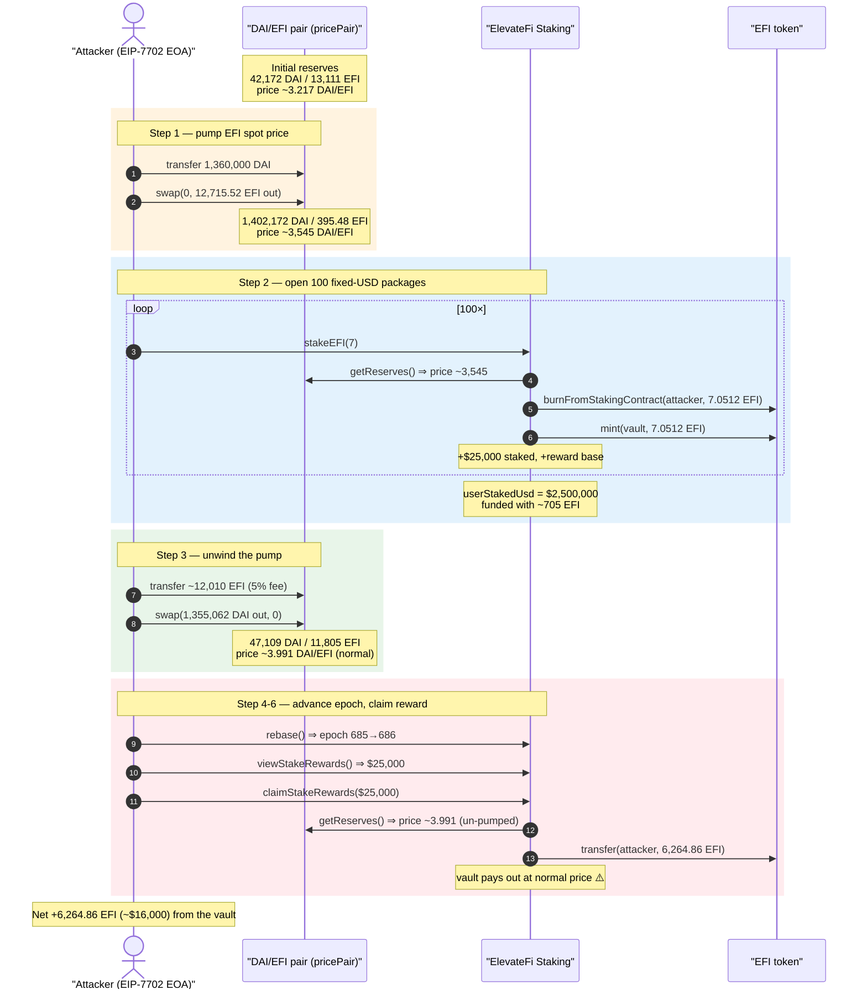
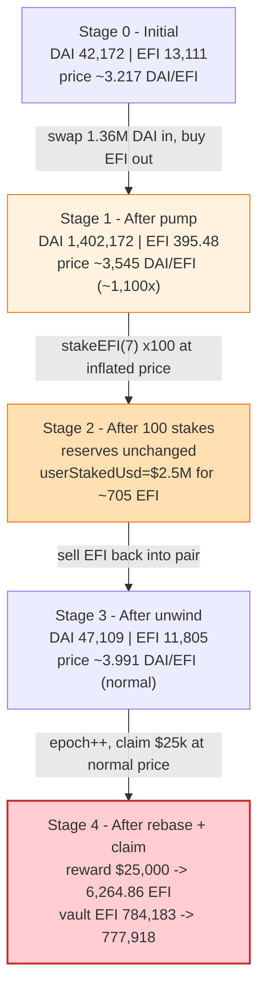
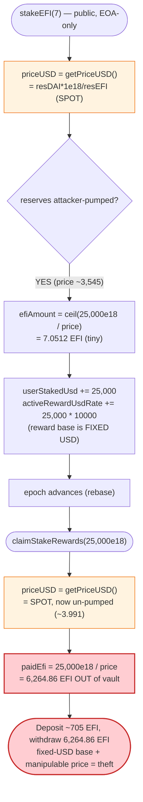
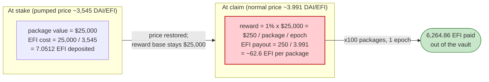

# ElevateFi Exploit — Fixed-USD Staking Packages Priced from Spot DAI/EFI Reserves

> **Reproduction:** the PoC compiles & runs in an isolated Foundry project at
> [this project folder](.) (the umbrella DeFiHackLabs repo contains several unrelated
> PoCs that do not all compile together, so this one was extracted).
> Full verbose trace: [output.txt](output.txt).
> Verified vulnerable source (active staking implementation at the fork block):
> [Staking_Implementation.sol](sources/Staking_Implementation_cDdc83/Staking_Implementation.sol).
> Related sources: [EFI token](sources/EFI_ae840d/EFI.sol),
> [staking vault proxy](sources/efiStakingVaultProxy_816EC9/efiStakingVaultProxy.sol).

---

## Key info

| | |
|---|---|
| **Loss** | ~$16,000 — **6,264.86 EFI** paid out of the ElevateFi staking vault (asserted profit `6264864558928525376422` wei) |
| **Vulnerable contract** | `Staking_Implementation` — [`0xcDdc83A34FC9A7B9e6b1dF7c14B585cf73283174`](https://polygonscan.com/address/0xcddc83a34fc9a7b9e6b1df7c14b585cf73283174#code) |
| **Victim pool / vault** | ElevateFi staking vault proxy — [`0x816EC92012e61269dcFe72188fe6d2352dEFCe74`](https://polygonscan.com/address/0x816ec92012e61269dcfe72188fe6d2352defce74) (impl `0x13fe99b0889472ccd4ca5e414e69900ac4614e50`) |
| **Price source (manipulated)** | DAI/EFI PancakeSwap-style V2 pair — `0xAec86dc2a08CD7cF8d90eE71d0E4864F25BA497B` |
| **EFI token** | [`0xae840dEab9916d80FADF42E218119a6051468169`](https://polygonscan.com/address/0xae840dEab9916d80FADF42E218119a6051468169) |
| **DAI token** | `0x8f3Cf7ad23Cd3CaDbD9735AFf958023239c6A063` |
| **Attacker EOA** | `0x7abD3f84E28f49f8F3d64Fa21981fA36E4Fb37f0` |
| **Attacker contract** | EIP-7702 authorised code `0x0511889ef593412386a889a3b7e3327cbc81f19e` (execution from the attacker EOA itself) |
| **Attack tx** | [`0x2bd7213a764dd93d18dedeca7f4e0cf5c3cdce1739d79b53e41b72ec9efed87e`](https://polygonscan.com/tx/0x2bd7213a764dd93d18dedeca7f4e0cf5c3cdce1739d79b53e41b72ec9efed87e) |
| **Chain / block / date** | Polygon / fork at 87,132,216 (claim at 87,132,251) / May 2026 |
| **Compiler / optimizer** | Solidity v0.8.30+commit.73712a01, optimizer **enabled, 200 runs** (from `sources/*/_meta.json`) |
| **Bug class** | Spot-AMM price oracle manipulation — fixed-USD staking packages priced from raw `getReserves()`; reward USD is fixed but EFI converts at a manipulable price both ways |

---

## TL;DR

1. `ElevateFi`'s staking implementation lets a user open a *fixed-USD* package (e.g. package 7 = **$25,000**)
   by calling `stakeEFI(packageId)` ([Staking_Implementation.sol#L1575-L1610](sources/Staking_Implementation_cDdc83/Staking_Implementation.sol#L1575-L1610)). The contract reads the
   *current* EFI price from a Uniswap-V2 pair and burns `ceil(packageUsd / price)` EFI from the staker,
   then mints the same EFI into the vault as principal.

2. The price comes from `getPriceUSD()` ([#L1471-L1479](sources/Staking_Implementation_cDdc83/Staking_Implementation.sol#L1471-L1479)),
   which is **raw spot**: `resD * 1e18 / resE` straight off `pricePair.getReserves()`. No TWAP, no
   sanity bound, no oracle. Whoever controls the pair's instantaneous reserves controls the EFI price
   the staking contract believes.

3. The reward accounting is denominated in the **fixed USD** value of the package, *not* in the EFI
   deposited. `_createV4StakeEntry` credits `activeRewardUsdRate[user] += stakeUsd * ratePpm`
   ([#L1641](sources/Staking_Implementation_cDdc83/Staking_Implementation.sol#L1641)). Package 7 pays
   `ratePpm = 10000` = **1% of $25,000 per epoch = $250/epoch/package**, regardless of how little EFI was actually deposited.

4. So the attack is a two-sided price game. With the EFI spot price **pumped ~1,100×**, $25,000 of
   "package value" costs only **7.0512 EFI** ([output.txt:120](output.txt)). The attacker opens **100**
   such packages — depositing only ~705 EFI total while being credited **$2,500,000** of staked value.

5. The attacker then **unwinds the pump** (sells the EFI back), restoring a near-normal price, advances
   one epoch, and claims the accrued reward. One epoch of 100 × $25,000 packages at 1%/epoch =
   **$25,000** reward ([output.txt:5178](output.txt)). At the now-normal price that $25,000 settles to
   **6,264.86 EFI** out of the vault ([output.txt:5180-5198](output.txt)) — far more EFI than the ~705 deposited.

6. Net result: the attacker walks off with **6,264.86 EFI (~$16,000)** of vault funds. The vault's EFI
   balance drops by exactly that amount, asserted by the PoC (`vaultEfiLoss == efiProfit`,
   [ElevateFi_exp.sol:98-101](test/ElevateFi_exp.sol#L98-L101)).

---

## Background — what ElevateFi does

ElevateFi is a Polygon EFI-token staking / MLM-reward platform. Its V4 "package" model lets a user lock
a **fixed dollar amount** of value (one of eight package tiers) and earn a fixed daily (per-epoch) reward
rate on that dollar value. Internally everything is denominated in EFI, but the *price* that bridges
USD ⇄ EFI is read live from a Uniswap-V2-style DAI/EFI pair.

- **Package tiers (fixed USD).** `simplePackageUsd[0..7] = {100, 250, 500, 1000, 2500, 5000, 10000, 25000}` × 1e18 USD
  ([#L1342-L1349](sources/Staking_Implementation_cDdc83/Staking_Implementation.sol#L1342-L1349)).
  Package 7 is the **$25,000** tier.
- **Per-epoch reward rate.** `simplePackageRatePpm[0..7] = {3000,4000,5000,6000,7000,8000,9000,10000}`
  ([#L1351-L1358](sources/Staking_Implementation_cDdc83/Staking_Implementation.sol#L1351-L1358)).
  Package 7 pays **10000 ppm = 1% of its USD value per epoch**.
- **Epochs.** `rebase()` advances `epochNumber` once `block.number >= epochEnd`, with `EPOCH_LENGTH = 43,200` blocks (~24h)
  ([#L1380-L1389](sources/Staking_Implementation_cDdc83/Staking_Implementation.sol#L1380-L1389), [#L919](sources/Staking_Implementation_cDdc83/Staking_Implementation.sol#L919)).
- **Price.** `getPriceUSD()` returns DAI-per-EFI from the pair's instantaneous reserves
  ([#L1471-L1479](sources/Staking_Implementation_cDdc83/Staking_Implementation.sol#L1471-L1479)).

On-chain parameters at the fork block (read from the trace / source):

| Parameter | Value | Source |
|---|---|---|
| `simplePackageUsd[7]` | 25,000e18 USD | [#L1349](sources/Staking_Implementation_cDdc83/Staking_Implementation.sol#L1349) |
| `simplePackageRatePpm[7]` | 10000 ppm (1%/epoch) | [#L1358](sources/Staking_Implementation_cDdc83/Staking_Implementation.sol#L1358) |
| `EPOCH_LENGTH` | 43,200 blocks (~24h) | [#L919](sources/Staking_Implementation_cDdc83/Staking_Implementation.sol#L919) |
| `pricePair` | DAI/EFI V2 pair `0xAec86dc2…497B` | [output.txt:90-92](output.txt) |
| pair `token0` | DAI | [output.txt:92](output.txt) |
| DAI reserve (pre-attack) | 42,172,012,884,861,914,018,312 (~42,172 DAI) | [output.txt:91](output.txt) |
| EFI reserve (pre-attack) | 13,110,999,083,987,396,476,745 (~13,111 EFI) | [output.txt:91](output.txt) |
| implied spot price (pre-attack) | ~3.217 DAI/EFI | derived from [output.txt:91](output.txt) |
| Vault EFI balance (before claim) | 784,183,170,107,560,800,718,567 (~784,183 EFI) | [output.txt:5132](output.txt) |

The attack hinges on the asymmetry: the **price** in/out is manipulable, but the **reward** is pinned to
the fixed $25,000 face value of the package. Stake when EFI is artificially expensive (cheap to fund a
$25k package), claim when EFI is normal-priced (the $25k reward buys back a lot of EFI).

---

## The vulnerable code

### 1. Spot price straight off the pair reserves

```solidity
/// @notice Get the current DAI-per-EFI price from Uniswap (×1e18)
/// @return      Price in DAI per EFI
function getPriceUSD() public view returns (uint256) {
    (uint112 r0, uint112 r1,) = pricePair.getReserves();
    (uint256 resE, uint256 resD) = pricePair.token0()==address(efi)
        ? (r0, r1) : (r1, r0);
    if(resE == 0 || resD == 0){
        return 0;
    }
    return resD * 1e18 / resE;
}
```
([Staking_Implementation.sol#L1471-L1479](sources/Staking_Implementation_cDdc83/Staking_Implementation.sol#L1471-L1479))

This is the entire oracle. It reads `getReserves()` and divides — the textbook spot-price-from-an-AMM
anti-pattern. Any actor who can move the pair's reserves within a single transaction (a swap, a flash
loan, or here just a big DAI buy) sets the price `getPriceUSD()` returns.

### 2. Staking funds a fixed-USD package at the manipulable price

```solidity
function stakeEFI(uint8 packageId) external {
    require(v4FinalInitialized, "v4 not initialized");
    require(msg.sender == tx.origin, "only EOA");
    require(!walletFrozen[msg.sender], "Wallet frozen");
    require(packageId < 8, "bad package");

    require(userStakedUsd[msg.sender] != 0 || stakeBalance[msg.sender] == 0, "init required");

    uint256 packageUsd = simplePackageUsd[packageId];   // 25,000e18 for pkg 7
    uint32 ratePpm = simplePackageRatePpm[packageId];   // 10000 for pkg 7

    require(packageUsd > 0, "package not set");
    require(ratePpm > 0, "rate not set");

    rebase();

    uint256 priceUSD = getPriceUSD();                   // ⚠️ spot price, attacker-controlled
    require(priceUSD > 0, "bad price");

    _bankStakingReward(msg.sender);

    uint256 efiAmount = _usdToEfiCeil(packageUsd, priceUSD);  // ⚠️ inflated price ⇒ tiny EFI cost
    require(efiAmount > 0, "zero EFI");

    efi.burnFromStakingContract(msg.sender, efiAmount); // burn the (tiny) EFI from staker
    efi.mint(address(this), efiAmount);                 // mint same EFI into the vault as principal

    _createV4StakeEntry(msg.sender, efiAmount, packageUsd, ratePpm, packageId, true);
}
```
([Staking_Implementation.sol#L1575-L1610](sources/Staking_Implementation_cDdc83/Staking_Implementation.sol#L1575-L1610))

`_usdToEfiCeil` is just `ceil(usdAmount * 1e18 / priceUSD)`
([#L1530-L1537](sources/Staking_Implementation_cDdc83/Staking_Implementation.sol#L1530-L1537)). With the
price pumped to ~3,545 DAI/EFI, `ceil(25000e18 * 1e18 / 3545e18) ≈ 7.0512 EFI` — and indeed the trace
burns exactly `7051200714694578136` wei per stake ([output.txt:120](output.txt)).

### 3. Reward is credited against the FIXED USD value, not the EFI deposited

```solidity
function _createV4StakeEntry(
    address user, uint256 efiAmount, uint256 stakeUsd, uint32 ratePpm,
    uint8 eventPackageId, bool updateTeamBusiness
) internal {
    ...
    userStakedUsd[user] += stakeUsd;                          // +25,000 USD per package
    totalActiveStakedUsd += stakeUsd;
    activeRewardUsdRate[user] += stakeUsd * uint256(ratePpm); // ⚠️ 25,000 × 10000 per package
    ...
}
```
([Staking_Implementation.sol#L1626-L1661](sources/Staking_Implementation_cDdc83/Staking_Implementation.sol#L1626-L1661))

The reward rate accumulator is `stakeUsd * ratePpm` — completely decoupled from `efiAmount`. The attacker
paid ~7 EFI but is credited a full $25,000 of reward base.

### 4. Reward banking and settlement convert USD → EFI at claim-time price

```solidity
function _bankStakingReward(address user) internal {
    uint256 last = lastStakeRewardEpoch[user];
    if (last == 0) { lastStakeRewardEpoch[user] = epochNumber; return; }
    if (epochNumber <= last) return;
    uint256 weightedRate = activeRewardUsdRate[user];
    if (weightedRate > 0) {
        uint256 epochs = epochNumber - last;
        unclaimedStakingRewardUsd[user] += (weightedRate * epochs) / 1_000_000; // USD reward
    }
    lastStakeRewardEpoch[user] = epochNumber;
}
```
([Staking_Implementation.sol#L1966-L1984](sources/Staking_Implementation_cDdc83/Staking_Implementation.sol#L1966-L1984))

```solidity
function claimStakeRewards(uint256 usdAmount) external returns (uint256 paidEfi, uint256 burnedEfi) {
    ...
    rebase();
    _bankStakingReward(msg.sender);
    uint256 availableUsd = unclaimedStakingRewardUsd[msg.sender];
    require(usdAmount > 0 && usdAmount <= availableUsd, "Amount too large");
    unclaimedStakingRewardUsd[msg.sender] = availableUsd - usdAmount;

    uint256 priceUSD = getPriceUSD();                         // ⚠️ spot again, now un-pumped
    require(priceUSD > 0, "bad price");
    (paidEfi, burnedEfi, ) = _settleRewardUsd(msg.sender, usdAmount, priceUSD);
    ...
}
```
([Staking_Implementation.sol#L2102-L2127](sources/Staking_Implementation_cDdc83/Staking_Implementation.sol#L2102-L2127))

`_settleRewardUsd` pays `paidEfi = usdAmount * 1e18 / priceUSD` EFI out of the vault
([#L2080-L2086](sources/Staking_Implementation_cDdc83/Staking_Implementation.sol#L2080-L2086)). Because
`priceUSD` here is read **after the pump has been unwound**, the fixed $25,000 reward converts to a large
EFI amount (6,264.86 EFI in the trace).

---

## Root cause — why it was possible

The protocol mixes a **fixed-USD reward base** with a **manipulable spot price** on both the deposit and
the withdrawal side. Three design decisions compose into the loss:

1. **Spot AMM reserves used as the USD oracle.** `getPriceUSD()` divides `getReserves()` directly
   ([#L1471-L1479](sources/Staking_Implementation_cDdc83/Staking_Implementation.sol#L1471-L1479)). The
   DAI/EFI pair is thin (~13,111 EFI / ~42,172 DAI at the fork, [output.txt:91](output.txt)), so a
   1.36M-DAI buy moves the EFI price ~1,100×. There is no TWAP, no deviation cap, no second source.

2. **Reward base is the package's fixed USD value, not the EFI actually deposited.** `activeRewardUsdRate`
   accumulates `stakeUsd * ratePpm`
   ([#L1641](sources/Staking_Implementation_cDdc83/Staking_Implementation.sol#L1641)). So the reward you
   earn is independent of how cheaply (in EFI) you funded the package. Pumping the price makes the
   package nearly free to open while preserving its full $25,000 reward entitlement.

3. **The price is sampled independently at stake-time and at claim-time.** Nothing pins the claim price to
   the stake price, so the attacker can deposit at an inflated price and withdraw at a deflated (normal)
   price, harvesting the spread. The 1% per-epoch rate on $2,500,000 of "value" produces $25,000 of reward
   in a single epoch, which the vault dutifully pays in real EFI.

There is no cap on how much "USD value" a single transaction can register, no minimum-EFI-per-USD floor,
and no link between the EFI a staker contributes and the EFI the vault later disburses. The vault's EFI is
effectively sold to the attacker at the manipulated exchange rate.

---

## Preconditions

- The DAI/EFI pair is the configured `pricePair` and is thin enough to move ~1,100× with available
  capital (~1.36M DAI in the PoC; the real attacker sourced this via nested DAI flash loans).
- `v4FinalInitialized == true` and the staker passes the trivial gates in `stakeEFI`
  (`msg.sender == tx.origin`, not frozen, valid package) — satisfied by a fresh EOA.
- At least one `EPOCH_LENGTH` (~24h, 43,200 blocks) must elapse between staking and claiming so `rebase()`
  advances `epochNumber` and `_bankStakingReward` credits a full epoch of reward. The PoC reproduces this
  with `vm.roll(87_132_251)` + `vm.warp(...)` ([ElevateFi_exp.sol:89-90](test/ElevateFi_exp.sol#L89-L90));
  the on-chain `Rebased` event shows the epoch ticking from 685 → 686 ([output.txt:5171-5173](output.txt)).
- Working capital in DAI to pump the pair, fully recovered intra-flow by selling the EFI back — hence
  flash-loanable. The PoC simply `deal`s 1,360,000 DAI as headroom
  ([ElevateFi_exp.sol:67-68](test/ElevateFi_exp.sol#L67-L68)).
- The vault must hold enough EFI to settle the claim (`require(efi.balanceOf(this) >= totalNeeded)`,
  [#L2084](sources/Staking_Implementation_cDdc83/Staking_Implementation.sol#L2084)); it held ~784,183 EFI
  ([output.txt:5132](output.txt)).

---

## Attack walkthrough (with on-chain numbers from the trace)

The pair's `token0 = DAI`, `token1 = EFI`, so `reserve0 = DAI`, `reserve1 = EFI`
([output.txt:92](output.txt)). All figures are taken directly from the `getReserves` returns, `Sync`/`Swap`
events, and `balanceOf` calls in [output.txt](output.txt). Amounts are raw (18-decimal) wei; human
approximations in parentheses.

| # | Step | DAI reserve (r0) | EFI reserve (r1) | Vault / reward state | Effect |
|---|------|----------------:|----------------:|---|--------|
| 0 | **Initial** (getReserves @ [output.txt:91](output.txt)) | 42,172,012,884,861,914,018,312 (~42,172) | 13,110,999,083,987,396,476,745 (~13,111) | price ~3.217 DAI/EFI | Honest pool. |
| 1 | **Pump** — transfer 1,360,000 DAI to pair ([output.txt:82](output.txt)) then `swap(0, 12,715.52 EFI out, attacker)` ([output.txt:94](output.txt)); `Sync` @ [output.txt:107](output.txt) | 1,402,172,012,884,861,914,018,312 (~1,402,172) | 395,479,851,975,138,942,030 (~395.48) | price ~3,545 DAI/EFI (≈1,100× pump) | Attacker buys 12,715.52 EFI out; EFI made artificially expensive. |
| 2 | **Stake ×100** — `stakeEFI(7)` each reads pumped `getReserves()` ([output.txt:116-118](output.txt)) and burns `7.0512` EFI / mint into vault ([output.txt:120-126](output.txt)) | 1,402,172 (unchanged) | 395.48 (unchanged) | `userStakedUsd += 100 × 25,000 = 2,500,000`; `activeRewardUsdRate += 100 × 25,000 × 10000` | 100 packages funded for ~705.12 EFI total, credited $2.5M of stake. |
| 3 | **Unwind pump** — transfer remaining 12,010.40 EFI to pair (5% token fee → 600.52 EFI to dead, 11,409.88 net in) ([output.txt:5122-5128](output.txt)); `swap(1,355,062.62 DAI out, 0, attacker)`; `Sync` @ [output.txt:5153](output.txt) | 47,109,394,558,522,824,278,328 (~47,109) | 11,805,359,054,490,798,677,090 (~11,805) | price ~3.991 DAI/EFI (≈ normal) | Price restored; attacker recovers most of its DAI. |
| 4 | **Advance epoch** — `vm.roll/warp` then `rebase()`; `Rebased(epoch 686, …)` ([output.txt:5171](output.txt)) | 47,109 | 11,805 | `epochNumber` 685 → 686 | One epoch of reward now accrues. |
| 5 | **viewStakeRewards** — returns accrued reward ([output.txt:5178](output.txt)) | 47,109 | 11,805 | reward = (2,500,000 × 10000 × 1) / 1e6 = **25,000 USD** | Pending reward = $25,000 for one epoch. |
| 6 | **claimStakeRewards(25,000e18)** — reads near-normal `getReserves()` ([output.txt:5191](output.txt)); vault `transfer` 6,264.86 EFI to attacker ([output.txt:5195](output.txt)) | 47,109 | 11,805 | vault EFI 784,183.17 → 777,918.31 ([output.txt:5132](output.txt) → tail) | $25,000 settles to **6,264.86 EFI** out of the vault. |

**Why the spread is profit:** in step 2 the attacker funds $25,000 of package value for ~7.05 EFI because
EFI is priced at ~3,545 DAI/EFI. In step 6 the protocol pays out that package's reward valuing EFI at the
restored ~3.991 DAI/EFI — so the same $25,000 of reward base buys ~888× more EFI than was deposited per
package. The reward rate (1%/epoch × one epoch) and the price spread together net 6,264.86 EFI.

### Profit / loss accounting (EFI, raw wei)

| Item | Amount (wei) | ~Human |
|---|---:|---:|
| Attacker EFI before exploit | 0 | 0 ([output.txt:6](output.txt)) |
| EFI bought out of pair during pump | 12,715,519,232,012,257,534,715 | ~12,715.52 ([output.txt:94](output.txt)) |
| EFI burned to fund 100 packages | 705,120,071,469,457,813,600 | ~705.12 (100 × `7051200714694578136`, [output.txt:120](output.txt)) |
| EFI sold back into pair to unwind | 12,010,399,160,542,799,721,115 | ~12,010.40 ([output.txt:5122](output.txt)) |
| **EFI paid out by vault on claim** | **6,264,864,558,928,525,376,422** | **~6,264.86** ([output.txt:5195](output.txt)) |
| Vault EFI before claim | 784,183,170,107,560,800,718,567 | ~784,183.17 ([output.txt:5132](output.txt)) |
| Vault EFI after claim | 777,918,305,548,632,275,342,145 | ~777,918.31 (tail) |
| **Vault EFI drained = attacker EFI profit** | **6,264,864,558,928,525,376,422** | **~6,264.86 (~$16,000)** |

The PoC asserts `efiProfit > 6200 ether` and `vaultEfiLoss == efiProfit`
([ElevateFi_exp.sol:100-101](test/ElevateFi_exp.sol#L100-L101)) — the vault's EFI loss equals the
attacker's gain to the wei. The DAI used to pump is recovered by the unwind swap (it is not the prize); the
prize is the vault's EFI, paid against a fixed-USD reward base mispriced by the spot oracle.

---

## Diagrams

### Sequence of the attack



### Pool / reward state evolution



### The flaw inside `stakeEFI` / `claimStakeRewards`



### Why it is theft: EFI cost vs. EFI payout per package



---

## Why each magic number

- **`daiSeed = 1_360_000 ether` ([ElevateFi_exp.sol:67](test/ElevateFi_exp.sol#L67)):** the DAI used to pump
  the thin pair. Sized so the buy moves EFI from ~3.217 to ~3,545 DAI/EFI (~1,100×), making each $25,000
  package cost only ~7.05 EFI. In the real attack this came from nested DAI flash loans; the PoC `deal`s it
  to isolate the victim bug. It is fully recovered by the unwind swap, so it is working capital, not cost.
- **`swap(0, 12,715,519,232,012,257,534,715 EFI out, …)` ([output.txt:94](output.txt)):** the EFI bought
  with the 1.36M DAI (computed by the PoC's local `getAmountOut`, [ElevateFi_exp.sol:110-111](test/ElevateFi_exp.sol#L110-L111)).
  It both pumps the price and hands the attacker the EFI it later needs (a few EFI to fund the stakes; the
  rest is sold back during the unwind).
- **`stakeEFI(7)` × `stakeCount = 100` ([ElevateFi_exp.sol:76-79](test/ElevateFi_exp.sol#L76-L79)):**
  package 7 is the **$25,000** tier with the highest reward rate (10000 ppm = 1%/epoch). Opening 100 of them
  registers **$2,500,000** of staked value for ~705 EFI, so one epoch yields a $25,000 reward — the largest
  reward base reachable per package, repeated to scale the loot to the vault's available EFI.
- **`7051200714694578136` EFI per stake ([output.txt:120](output.txt)):** `ceil(25,000e18 / priceUSD)` at the
  pumped price ~3,545 DAI/EFI. This is the *only* EFI the attacker actually puts up per $25,000 package.
- **`claimStakeRewards(25_000e18)` ([output.txt:5180](output.txt)):** exactly the one-epoch reward returned by
  `viewStakeRewards` ([output.txt:5178](output.txt)) = `(2,500,000 × 10000 × 1) / 1e6 = 25,000` USD. Claimed
  after the price is restored so the fixed-USD reward converts to the maximum EFI.
- **`vm.roll(87_132_251)` / `vm.warp(1_779_221_148)` ([ElevateFi_exp.sol:89-90](test/ElevateFi_exp.sol#L89-L90)):**
  advances past `epochEnd` so `rebase()` ticks `epochNumber` 685 → 686 ([output.txt:5171](output.txt)),
  letting `_bankStakingReward` credit one full epoch of reward.

---

## Remediation

1. **Never price fixed-USD packages from spot AMM reserves.** Replace `getPriceUSD()`'s
   `getReserves()`-divide with a manipulation-resistant source: a Chainlink/robust oracle, or at minimum a
   time-weighted average price (TWAP) over a window long enough that a single-tx pump cannot move it.
2. **Bind the claim price to the stake price.** Either denominate the reward and the principal in the *same*
   EFI units captured at stake time, or store the stake-time price and disallow claiming at a materially
   different price. The exploitable spread comes entirely from sampling the price independently at deposit
   and withdrawal.
3. **Decouple "value credited" from a manipulable conversion.** If packages must be fixed-USD, require the
   staker to deposit an EFI amount that is itself sanity-checked against a robust price, and cap the
   USD-value any single transaction (or block) can register.
4. **Add deviation guards.** Reject `stakeEFI`/`claimStakeRewards` when `getPriceUSD()` deviates from a
   trusted reference (oracle/TWAP) by more than a small bound; this neutralises both the pump-to-stake and
   the unwind-to-claim legs.
5. **Cap per-epoch payout against deposited principal.** A vault that can pay out far more EFI than was ever
   deposited for a position is structurally unsafe; bound payouts to a function of the real EFI principal,
   not a fiat face value converted at a live price.

---

## How to reproduce

The PoC was extracted into a standalone Foundry project and runs **offline** against a local fork served
from the bundled anvil state (the harness points `createSelectFork` at a `127.0.0.1` anvil port, so no
public RPC is contacted):

```bash
_shared/run_poc.sh 2026-05-ElevateFi_exp --mt testExploit -vvvvv
```

- Fork: Polygon at block **87,132,216** (`vm.createSelectFork("http://127.0.0.1:8549", 87_132_216)`,
  [ElevateFi_exp.sol:47-48](test/ElevateFi_exp.sol#L47-L48)); the claim block is **87,132,251**. The shared
  harness serves this state from the local `anvil_state.json` — no archive endpoint needed.
- EVM: `foundry.toml` sets `evm_version = 'cancun'` (the real attack executed from the EOA via EIP-7702
  authorised code; the PoC reproduces the value flow directly from the attacker EOA).
- Runtime: the test takes a few minutes (the trace reports `finished in 280.05s`).
- Result: `[PASS] testExploit()` with the attacker EFI balance going `0 → 6,264.86 EFI`.

Expected tail:

```
Ran 1 test for test/ElevateFi_exp.sol:ContractTest
[PASS] testExploit() (gas: 13386947)
Logs:
  Attacker Before exploit EFI Balance: 0.000000000000000000
  Attacker After exploit EFI Balance: 6264.864558928525376422

Suite result: ok. 1 passed; 0 failed; 0 skipped; finished in 280.05s (277.00s CPU time)
```

---

*Reference: Defimon Alerts — https://t.me/defimon_alerts/3040 (ElevateFi, Polygon, ~$16K).*
