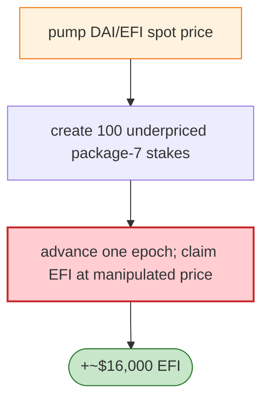

# ElevateFi Exploit — Staking Package Priced from Spot DAI/EFI Pair

> **Reproduction:** the PoC compiles & runs in an isolated Foundry project at
> [this project folder](.). Full verbose trace: [output.txt](output.txt).
> Verified vulnerable source: [EFI](sources/EFI_ae840d),
> [Staking_Implementation](sources/Staking_Implementation_cDdc83),
> [efiStakingVaultProxy](sources/efiStakingVaultProxy_816EC9).

---

## Key info

| | |
|---|---|
| **Loss** | ~$16,000; tx `0x2bd7213a…` |
| **Vulnerable contract** | ElevateFi Staking impl `0xcddc83a3…` (proxy/vault `0x816ec920…`) |
| **Attacker** | `0x7abd3f84…` (EIP-7702 authorised code `0x0511889e…`) |
| **Chain / block / date** | Polygon / May 2026 |
| **Bug class** | Spot-price oracle — ElevateFi priced fixed-USD staking packages from the **raw DAI/EFI pair reserves**; pumping the spot price made underpriced packages claimable for large EFI. |

---

## TL;DR

Per the embedded analysis: ElevateFi priced fixed-USD staking packages from the raw DAI/EFI pair
reserves. The PoC funds the attacker with DAI to isolate the bug, **pumps the pair spot price**,
creates **100 underpriced package-7 stakes**, advances one epoch, and claims EFI from the staking
vault. The real tx sourced the DAI through nested flash loans and executed from the attacker EOA via
EIP-7702 authorised code.

---

## Root cause

A **spot-pair price used to price fixed-USD packages** — flash-manipulable; no TWAP, no cap on the
package-to-EFI conversion at the manipulated price.

---

## Diagrams



---

## Remediation

1. TWAP/robust oracle for package pricing; never spot reserves.
2. Cap package-to-EFI conversion; deviation bounds.

---

## How to reproduce

```bash
_shared/run_poc.sh 2026-05-ElevateFi_exp -vvvvv
```

- RPC: Polygon archive. Result: `[PASS]` (~4.5 min) — EFI claimed at pumped price.

---

*Reference: ElevateFi spot-pair package-pricing exploit, Polygon, May 2026 (~$16K).*
