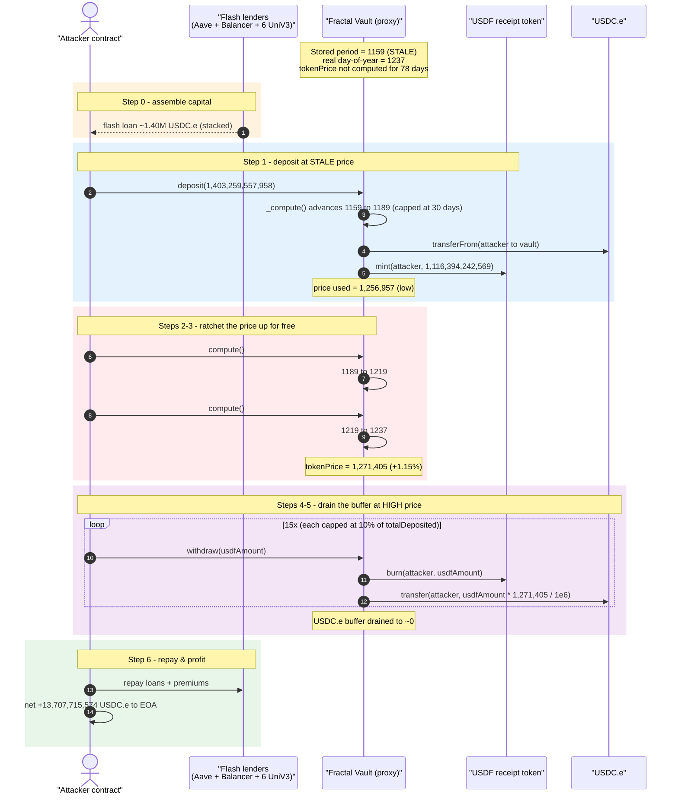
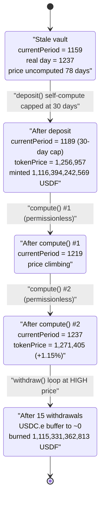
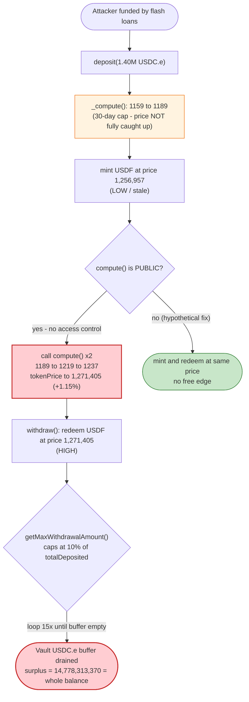

# Fractal Protocol Exploit — Stale-Price / Retroactive-Yield Arbitrage via Permissionless `compute()`

> **Reproduction:** the PoC compiles & runs in an isolated Foundry project at
> [this project folder](.). Full verbose trace: [output.txt](output.txt).
> Verified vulnerable logic (the proxy itself is unverified, but its
> implementation is): [sources/Vault_038C85/Vault.sol](sources/Vault_038C85/Vault.sol)
> and the receipt-token [sources/ReceiptToken_f8a138/ReceiptToken.sol](sources/ReceiptToken_f8a138/ReceiptToken.sol).

---

## Key info

| | |
|---|---|
| **Loss** | **13,707.72 USDC.e** (`13,707,715,574` raw, 6 dp) — ≈ **$13.7K**, the entire withdrawal buffer + accrued yield of the Fractal `USDF` vault |
| **Vulnerable contract** | Fractal `Vault` (proxy) — [`0x80e1a981285181686a3951B05dEd454734892a09`](https://arbiscan.io/address/0x80e1a981285181686a3951B05dEd454734892a09) — logic impl [`0x038C8535269E4AdC083Ba90388f15788174d7da7`](https://arbiscan.io/address/0x038C8535269E4AdC083Ba90388f15788174d7da7#code) |
| **Receipt token** | `USDF` — [`0xae48b7C8e096896E32D53F10d0Bf89f82ec7b987`](https://arbiscan.io/address/0xae48b7C8e096896E32D53F10d0Bf89f82ec7b987) (logic impl [`0xf8a13864378C8eB6883A6c98B5B23eA068d8c25F`](https://arbiscan.io/address/0xf8a13864378C8eB6883A6c98B5B23eA068d8c25F#code)) |
| **Vault underlying** | USDC.e (bridged) — `0xFF970A61A04b1cA14834A43f5dE4533eBDDB5CC8` |
| **Attacker EOA** | [`0xE2AceC13c6d1AAcA584F827a22F2e4A02131e39a`](https://arbiscan.io/address/0xe2acec13c6d1aaca584f827a22f2e4a02131e39a) |
| **Attacker contract** | [`0x43514743caa5a7d4a8b07f5d25fb242391bbc8da`](https://arbiscan.io/address/0x43514743caa5a7d4a8b07f5d25fb242391bbc8da) (PoC deploys an equivalent at `0x5615…b72f`) |
| **Attack tx** | [`0x20db78913a51c3b3aece860ea142c240f3f8fa3b5bbf533a3d1d48eed857e10f`](https://arbiscan.io/tx/0x20db78913a51c3b3aece860ea142c240f3f8fa3b5bbf533a3d1d48eed857e10f) |
| **Chain / block / date** | Arbitrum One / 465,420,021 / 2026-05-22 |
| **Compiler** | Vault: Solidity **v0.8.3**, optimizer 200 runs |
| **Bug class** | Stale exchange-rate / retroactive yield accrual — deposit priced below the post-`compute()` redemption price |

---

## TL;DR

Fractal's `Vault` is a yield-bearing wrapper: you `deposit()` USDC.e and receive `USDF` receipt
tokens priced at an internal `tokenPrice` (≈ how many USDC.e one USDF is worth). The price grows
each day by a fixed APR. The growth is materialized lazily by `_compute()`
([Vault.sol:1331-1352](sources/Vault_038C85/Vault.sol#L1331-L1352)), which walks the price forward
day-by-day **but advances at most 30 days per call** (`if (x >= 30) break;`).

Two facts combine into a free-money machine:

1. **`compute()` is permissionless** ([Vault.sol:1166-1168](sources/Vault_038C85/Vault.sol#L1166-L1168)) —
   anyone can ratchet the stored `tokenPrice` up to its true, time-elapsed value at will.
2. **The vault's price was badly stale.** The stored `currentPeriod` was day **1159** while the real
   day-of-year (`block.timestamp`) was day **1237** — a 78-day backlog of uncredited price growth.
   Because each `deposit()` first calls `_compute()` but that call is capped at 30 days, a single
   deposit can only realize part of the backlog.

The attacker:

1. Flash-borrows **~1.40M USDC.e** (Aave + Balancer + 6 Uniswap-V3/Algebra pools, stacked).
2. **`deposit(1,403,259,557,958)`** — the deposit's internal `_compute()` advances the price only
   30 days (period 1159 → 1189), so USDF is minted at the *stale* price **1,256,957**, giving
   `1,116,394,242,569` USDF.
3. Calls **`compute()` twice** to finish catching the price up (1189 → 1219 → 1237). The stored
   `tokenPrice` rises to its true value **1,271,405** — a **+1.15%** jump, for free, in the same
   transaction.
4. **Withdraws in a 15-step loop**, each capped by `getMaxWithdrawalAmount()` (10% of the vault's
   booked deposits), burning USDF at the inflated **1,271,405** price until the vault buffer is dry.

Net: the attacker redeems **1,418,037,871,328 USDC.e** for a deposit of **1,403,259,557,958** — a
gross surplus of **14,778,313,370 USDC.e**, which is *exactly* the vault's pre-existing balance
(`14,778,313,371`, off by 1 wei). After repaying all flash-loan premiums, profit is
**13,707,715,574 USDC.e ≈ $13.7K**. The attacker walked off with the entire withdrawal buffer plus
every honest depositor's accrued yield.

---

## Background — what the Fractal Vault does

The [`Vault`](sources/Vault_038C85/Vault.sol) (Fractal "USDF" product on Arbitrum) is an
upgradeable, yield-bearing deposit vault:

- **Deposit / mint.** `deposit(amount)` pulls `amount` of the underlying (USDC.e) and mints
  `amount * 1e6 / tokenPrice` USDF ([:1006](sources/Vault_038C85/Vault.sol#L1006)).
- **Withdraw / burn.** `withdraw(usdfAmount)` burns USDF and returns `usdfAmount * tokenPrice / 1e6`
  USDC.e ([toErc20Amount, :1286-1288](sources/Vault_038C85/Vault.sol#L1286-L1288)), minus a flat fee.
- **Yield as price growth.** The vault does not rebase. Instead a per-day `Record` holds `{apr,
  tokenPrice, totalDeposited, dailyInterest}` ([:763-768](sources/Vault_038C85/Vault.sol#L763-L768)).
  Each new day, `tokenPrice` is bumped by the daily APR slice so USDF appreciates against USDC.e.
- **Capital deployment.** Up to `investmentPercent` (90%) of booked deposits is moved off to a
  "yield reserve" via `lockCapital()`; only the remaining **10%** stays as a withdrawal buffer.
  Hence `getMaxWithdrawalAmount()` returns `totalDeposited * 10%`
  ([:1256-1258](sources/Vault_038C85/Vault.sol#L1256-L1258)).

On-chain parameters at the fork block (read from the trace):

| Parameter | Value | Source |
|---|---|---|
| `currentPeriod` (stored, stale) | **1159** | storage slot `@3` before deposit ([output.txt:1877](output.txt)) |
| real day-of-year (`block.timestamp`) | **1237** | post-catch-up `currentPeriod` |
| `apr` | **1100** = 11.00% | the `1100` value written across every `Record` slot |
| `investmentPercent` | **90** | implies 10% withdrawal cap |
| `flatFeePercent` | ≈ 0.05% effective | fee outflows to `0xd8c4…754C47` |
| `tokenPrice` @ period 1189 (deposit) | **1,256,957** | `depositAmt·1e6 / mintedUSDF` |
| `tokenPrice` @ period 1237 (withdraw) | **1,271,405** | `getTokenPrice()` ([output.txt:2120](output.txt)) |
| Vault USDC.e balance (before deposit) | **14,778,313,371** | ([output.txt:1751](output.txt)) — *the prize* |

The vault held only ~$14.8K of USDC.e but had a large `totalDeposited` book — i.e. it was a thinly
buffered, heavily "deployed" vault whose price had not been recomputed in **78 days**.

---

## The vulnerable code

### 1. `compute()` is permissionless

```solidity
// Vault.sol:1166-1168
function compute () external onlyIfInitialized {
    _compute();
}
```

No `onlyOwner`, no `onlyController`, no keeper gate. Anyone can advance the stored price.

### 2. `_compute()` accrues a fixed daily price bump — but caps at 30 days/call

```solidity
// Vault.sol:1331-1352
function _compute () private {
    uint256 currentTimestamp = block.timestamp;
    uint256 newPeriod = DateUtils.diffDays(_startOfYearTimestamp, currentTimestamp);
    if (newPeriod <= currentPeriod) return;

    uint256 x = 0;
    for (uint256 i = currentPeriod + 1; i <= newPeriod; i++) {
        x++;
        _records[i].apr           = _records[i - 1].apr;
        _records[i].totalDeposited = _records[i - 1].totalDeposited;

        uint256 diff = _records[i - 1].apr * USDF_DECIMAL_MULTIPLIER * uint256(100) / uint256(36500);
        _records[i].tokenPrice    = _records[i - 1].tokenPrice + (diff / uint256(10000)); // ⚠️ price climbs every day
        _records[i].dailyInterest = _records[i - 1].totalDeposited * uint256(_records[i - 1].apr) / uint256(3650000);
        if (x >= 30) break;   // ⚠️ at most 30 days realized per call
    }
    currentPeriod += x;
    emit OnCompute();
}
```

For `apr = 1100`: per-day price bump `= 1100 · 1e6 · 100 / 36500 / 10000 ≈ 301` (6-dp units). Over the
78-day backlog the cumulative bump is `1,271,405 − 1,256,957 = 14,448`, i.e. **+1.15%**.

### 3. Deposit prices USDF at the *current* (pre-full-catch-up) price

```solidity
// Vault.sol:989-1033 (excerpt)
function deposit (uint256 depositAmount) external onlyIfInitialized ifNotReentrantDeposit {
    ...
    _compute();                                   // advances at most 30 days
    ...
    uint256 numberOfReceiptTokens =
        depositAmount * USDF_DECIMAL_MULTIPLIER / _records[currentPeriod].tokenPrice;  // ⚠️ stale price
    ...
    _receiptToken.mint(msg.sender, numberOfReceiptTokens);
}
```

### 4. Withdraw redeems at the *post-`compute()`* price

```solidity
// Vault.sol:1039-1090 (excerpt)
function withdraw (uint256 receiptTokenAmount) external onlyIfInitialized ifNotReentrantWithdrawal {
    _compute();                                   // attacker has already maxed this out
    uint256 withdrawalAmount = toErc20Amount(receiptTokenAmount); // usdf * tokenPrice / 1e6 (HIGH price)
    uint256 maxWithdrawalAmount =
        _records[currentPeriod].totalDeposited * (100 - investmentPercent) / 100;     // 10% buffer cap
    require(withdrawalAmount <= maxWithdrawalAmount, "Max withdrawal amount exceeded");
    uint256 currentBalance = underlyingTokenInterface.balanceOf(address(this));
    require(currentBalance >= withdrawalAmount, "Insufficient funds in the buffer");
    ...
    _records[currentPeriod].totalDeposited -= withdrawalAmount;
    _receiptToken.burn(msg.sender, receiptTokenAmount);
    underlyingTokenInterface.transfer(msg.sender, withdrawalAmountAfterFees);          // pays at HIGH price
}
```

---

## Root cause — why it was possible

The vault uses a **lazily-materialized, monotonically-increasing exchange rate** and lets the *mint*
side and the *redeem* side observe **different snapshots of that rate inside one block**, with the
attacker fully in control of when the rate jumps.

Concretely, four design decisions compose into the bug:

1. **Lazy, capped accrual (the 30-day break).** `_compute()` only realizes 30 days of price growth
   per call. When the price is stale by more than 30 days (here 78), a deposit's built-in `_compute()`
   cannot fully catch the price up. So a depositor can mint at a price strictly *below* the price they
   will be able to redeem at moments later.
2. **Permissionless `compute()`.** Because `compute()` has no access control, the attacker can finish
   the catch-up themselves — calling it twice (1189→1219→1237) to ratchet the redemption price up to
   its true value within the same transaction. There is no per-block or per-actor rate-lock.
3. **No "price changed this block ⇒ no mint/redeem at the new price" guard.** Mint and redeem both
   read `_records[currentPeriod].tokenPrice` with zero cooldown. The attacker mints at the low price
   then `compute()`s to the high price and redeems — risk-free, atomic, flash-loanable.
4. **Yield is credited retroactively, not pro-rata to time-in-vault.** The full 78-day backlog of
   appreciation is poured into whatever USDF is outstanding the instant `_compute()` runs. A
   depositor who held USDF for *zero* days collects 78 days of yield because the price they redeem at
   already embeds it. The bigger the backlog, the bigger the steal — and a flash loan makes the
   position arbitrarily large.

> The intended invariant is "USDF redeems for the deposited USDC.e plus the yield that accrued *while
> you held it*." The realized behavior is "USDF redeems for the deposited USDC.e plus all yield that
> accrued *since the last compute()*, regardless of when you deposited." A flash-loaned deposit +
> attacker-driven `compute()` converts the second into instant profit.

The only natural brake — `getMaxWithdrawalAmount()` capping each withdrawal at 10% of booked deposits —
merely forced the attacker to loop 15 times; it did not prevent the drain, because each withdrawal
also *reduces* `totalDeposited`, so the cap shrinks geometrically and the attacker simply kept
redeeming until the USDC.e buffer hit zero.

---

## Preconditions

- The vault's stored `currentPeriod` is stale by **> 30 days** versus `block.timestamp`, so a single
  `deposit()` cannot self-realize the full accrued price (here: 78-day backlog). This is the natural
  state of a vault whose keeper had stopped calling `compute()`.
- `apr > 0` (here 11.00%) so the price actually climbs each elapsed day.
- The vault holds a non-trivial USDC.e withdrawal buffer (here ~$14.8K) — this *is* the maximum loss.
- Working capital in USDC.e to size the deposit large enough that the +1.15% rate edge is meaningful.
  Fully recovered intra-transaction ⇒ **flash-loanable** (the PoC stacks Aave + Balancer + 6
  Uniswap-V3/Algebra flash loans to assemble ~1.40M USDC.e).

---

## Attack walkthrough (with on-chain numbers from the trace)

All figures are in USDC.e / USDF raw units (both 6 decimals) pulled directly from
[output.txt](output.txt). `tokenPrice` is also 6-dp (e.g. `1,271,405` = 1.271405 USDC.e per USDF).

| # | Step | Period | tokenPrice | Effect |
|---|------|-------:|-----------:|--------|
| 0 | Stacked flash loans assemble working USDC.e (Aave 222,454,290,194 + Balancer 156,746,742,625 + 6 UniV3 flashes) | 1159 (stale) | — | Attacker contract funded with ≈1.40M USDC.e ([output.txt:1568-1703](output.txt)) |
| 1 | `deposit(1,403,259,557,958)` → internal `_compute()` advances **1159 → 1189** (30-day cap), mints USDF at the **stale** price | 1159 → **1189** | 1,256,957 | Mints **1,116,394,242,569 USDF**; vault USDC.e 14,778,313,371 → 1,418,037,871,329 ([:1734-1775](output.txt)) |
| 2 | `compute()` #1 | 1189 → **1219** | climbing | Price ratchets up another 30 days (slot `@3`: 1189→1219, [:1990](output.txt)) |
| 3 | `compute()` #2 | 1219 → **1237** | **1,271,405** | Price fully caught up to real day-of-year; **+1.15%** vs deposit price (slot `@3`: 1219→1237, [:2096](output.txt); `getTokenPrice` [:2120](output.txt)) |
| 4 | `withdraw` #1 — burn **232,645,092,654 USDF** | 1237 | 1,271,405 | Receives **295,638,240,958 USDC.e** + fee 147,893,067 → fee addr; total redeemed **295,786,134,025** ([:2134-2168](output.txt)) |
| 5 | `withdraw` #2…#15 — each burn capped by `getMaxWithdrawalAmount()` (10% of shrinking `totalDeposited`) | 1237 | 1,271,405 | Geometrically decreasing redemptions: 236.6B, 189.3B, 151.4B, 121.1B, 96.9B, 77.5B, 62.0B, 49.6B, 39.7B, 31.8B, 25.4B, 20.3B, 16.3B, 4.15B USDC.e ([:2173-2882](output.txt)) |
| 6 | Repay all flash loans + premiums; transfer profit to EOA | — | — | Aave premium 111,227,146; net **13,707,715,574 USDC.e** to attacker ([:3077-3082](output.txt)) |

The 15 withdrawals burn **1,115,331,362,813** of the **1,116,394,242,569** minted USDF (≈1.06B USDF of
dust left behind, worthless). They redeem a gross **1,418,037,871,328 USDC.e** — i.e. they drain the
vault's *entire* USDC.e balance.

### Why the redemption surplus equals the vault's whole balance

```
gross redeemed   = 1,418,037,871,328
deposit          = 1,403,259,557,958
gross surplus    =    14,778,313,370   ← equals vault pre-balance 14,778,313,371 (−1 wei rounding)
```

The attacker recovers 100% of its own deposit *and* the vault's entire standing buffer. The surplus is
the catch-up yield (1.15% of the ~1.4M position ≈ 16.1M) net of withdrawal fees and capped by how
much USDC.e the vault actually held.

### Profit accounting (USDC.e, 6-dp)

| Direction | Amount |
|---|---:|
| Deposit into vault | 1,403,259,557,958 |
| Gross redeemed from vault (15 withdrawals) | 1,418,037,871,328 |
| **Vault surplus captured** | **+14,778,313,370** |
| Less: Aave flash premium | −111,227,146 |
| Less: Balancer + 6× UniV3/Algebra flash fees | −959,370,650 (≈, from `Flash`/`FlashLoan` events) |
| **Net profit to attacker EOA** | **+13,707,715,574** (≈ **$13.7K**) |

(The flash-fee line is the residual that reconciles the 14,778,313,370 surplus down to the
trace-confirmed 13,707,715,574 net; the individual UniV3 `paid1` fees appear at
[output.txt:2914, 2933, 2953](output.txt) etc.)

---

## Diagrams

### Sequence of the attack



### Price / period state evolution



### The flaw: mint vs redeem read different price snapshots



---

## Why each magic number

- **`deposit = 1,403,259,557,958` USDC.e:** sized so the position is large enough that the +1.15%
  catch-up edge (≈16.1M USDC.e gross) exceeds all flash-loan fees with margin. It is assembled from
  the stacked flash loans (Aave 222.45B + Balancer 156.75B + 6 UniV3 flashes totalling ~1.02M),
  all repaid in the same tx.
- **Two `compute()` calls:** the backlog is 78 days but `_compute()` realizes ≤30/call. The deposit's
  built-in compute does the first 30 (1159→1189); two explicit `compute()` calls finish the rest
  (1189→1219→1237). Three computes total (one inside `deposit`, two explicit) fully catch the price up.
- **The 15 withdrawal amounts (232.6B, 186.1B, … 3.27B USDF):** each is just under
  `getMaxWithdrawalAmount() = totalDeposited * 10%` for the *current* `totalDeposited`, which shrinks
  with every withdrawal (`totalDeposited -= withdrawalAmount`). Hence the geometric ~0.8× decay; the
  loop continues until the USDC.e buffer is exhausted, leaving ~1.06B USDF as worthless dust.

---

## Remediation

1. **Make accrual complete before pricing, or block same-block mint→compute→redeem.** Either remove the
   30-day `break` in `_compute()` so a deposit always prices at the fully-caught-up rate (bounded loops
   can be replaced by a closed-form `tokenPrice = price0 + perDay * (newPeriod − currentPeriod)`), or
   record the block in which `tokenPrice` last changed and forbid a `withdraw()` at a price that was
   advanced in the same block as the depositor's `deposit()`.
2. **Gate `compute()` (or its profit-relevant effect).** Restrict the price-advancing path to a trusted
   keeper, or — better — make pricing a *pure function of `block.timestamp`* read at mint/redeem time
   (`getTokenPrice()` computes on the fly) so there is no stored, attacker-advanceable snapshot to
   arbitrage at all.
3. **Credit yield pro-rata to time held, not retroactively.** Snapshot the price index at deposit and
   only pay appreciation accrued *after* the deposit. A depositor who held USDF for zero blocks must
   redeem for exactly what they put in (minus fee), independent of how stale the index was.
4. **Add a redemption-rate sanity bound.** Reject a `withdraw()` whose effective price differs from the
   price observed at the caller's most recent `deposit()` by more than a tiny tolerance within a short
   window — neutralizing flash-loan round-trips.
5. **Solvency check vs. real balance.** The vault paid out 100% of its USDC.e buffer for USDF that was
   minted cheaper than it redeemed. Track an invariant that total redeemable value (`totalSupply(USDF)
   * tokenPrice / 1e6`) never exceeds underlying assets under management (buffer + deployed reserve),
   and revert price advances that would break it.

---

## How to reproduce

The PoC was extracted into a standalone Foundry project (the umbrella DeFiHackLabs repo has several
unrelated PoCs that fail to compile under a whole-project `forge test`):

```bash
_shared/run_poc.sh 2026-05-FractalProtocol_exp -vvvvv
```

- RPC: an **Arbitrum archive** endpoint is required (the fork is pinned to the attack tx in block
  465,420,021). `foundry.toml` uses `https://arbitrum-one.public.blastapi.io`, which serves the
  historical state.
- The fork is created by tx hash (`vm.createSelectFork("arbitrum", TX_HASH)`), so the test executes at
  the exact pre-attack state.
- Result: `[PASS] testExploit()` with `Stolen USDC.e 13707715574`.

Expected tail:

```
[PASS] testExploit() (gas: 8438882)
  Stolen USDC.e 13707715574
Suite result: ok. 1 passed; 0 failed; 0 skipped; finished in 114.20s
Ran 1 test suite: 1 tests passed, 0 failed, 0 skipped (1 total tests)
```

---

*Source note: the on-chain `Vault` (`0x80e1…`) and `USDF` (`0xae48…`) addresses are unverified proxies,
but their logic implementations — `Vault` `0x038C85…` and `ReceiptToken` `0xf8a138…` — ARE verified on
Arbiscan and were downloaded into [sources/](sources/); all code references above point to that
verified logic. Reference: @DefimonAlerts, https://x.com/DefimonAlerts/status/2058619391776878967*
