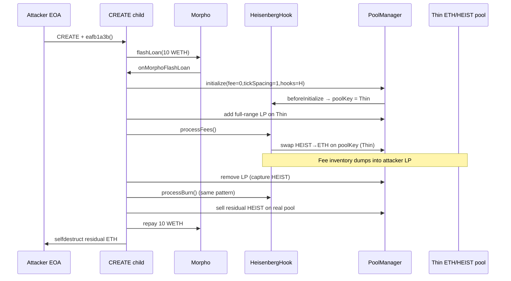
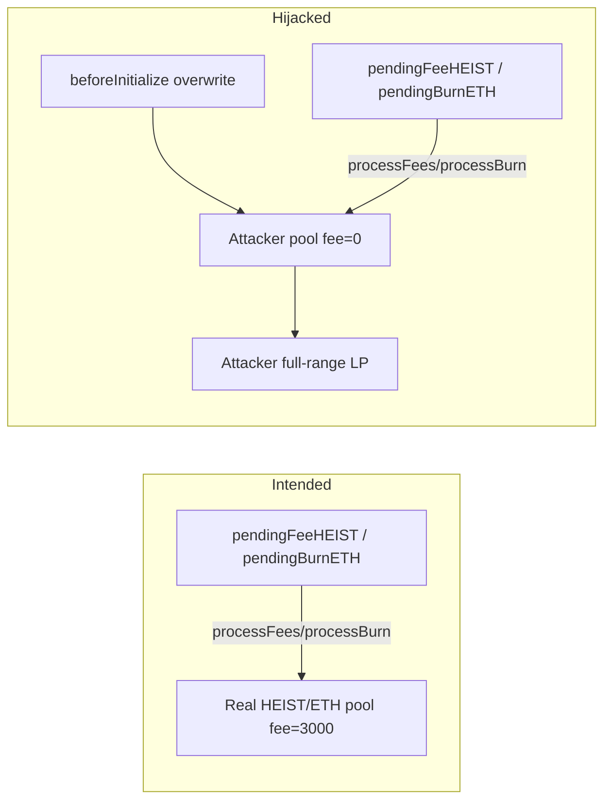

<!-- non-defihacklabs -->
# HeisenbergHook Fee Path Hijack — Unrestricted `poolKey` overwrite + permissionless `processFees`/`processBurn`

> **Vulnerability classes:** vuln/logic/incorrect-state-transition · vuln/defi/fee-manipulation · vuln/logic/missing-check · vuln/input-validation/missing

> **Reproduction:** the PoC compiles & runs in an isolated Foundry project at
> [this project folder](.). The fork is served offline from the bundled
> `anvil_state.json` (local anvil replays Ethereum state at block `25059345`), so no
> public RPC is required.
> Full verbose trace: [output.txt](output.txt).
> Verified vulnerable source: [src_HeisenbergHook.sol](sources/HeisenbergHook_bea90e/src_HeisenbergHook.sol).

---

## Key info

| | |
|---|---|
| **Loss** | **0.425919592403168892 ETH** attacker profit (gas-free PoC; on-chain net after ~0.0044 ETH gas ≈ **0.421519 ETH**) |
| **Vulnerable contract** | `HeisenbergHook` — [`0xBea90Eed6B2d07e8D66894969ed6D0A5ba242ac8`](https://etherscan.io/address/0xBea90Eed6B2d07e8D66894969ed6D0A5ba242ac8#code) (Uniswap v4 HEIST/ETH hook) |
| **HEIST token** | [`0x126A14f135f9b102813976f8D2a1206C0Cf66e01`](https://etherscan.io/address/0x126A14f135f9b102813976f8D2a1206C0Cf66e01) |
| **PoolManager** | [`0x000000000004444c5dc75cB358380D2e3dE08A90`](https://etherscan.io/address/0x000000000004444c5dc75cB358380D2e3dE08A90) |
| **Attacker EOA** | [`0x0F6a119567dC162ED343B28A7506A5764741B665`](https://etherscan.io/address/0x0F6a119567dC162ED343B28A7506A5764741B665) |
| **Attack contract** | CREATE outer [`0xA993e7c9eFD119030117dE548402a2cD73646Bc4`](https://etherscan.io/address/0xA993e7c9eFD119030117dE548402a2cD73646Bc4) → child Morpho callback [`0x471a75D97D9118A275FaBBAAff6463462C39E65a`](https://etherscan.io/address/0x471a75D97D9118A275FaBBAAff6463462C39E65a) (both selfdestruct) |
| **Attack tx** | [`0x938216ea42de19146d7bb073df71085b0b59ee200ba892f731a517af14d74789`](https://etherscan.io/tx/0x938216ea42de19146d7bb073df71085b0b59ee200ba892f731a517af14d74789) |
| **Chain / block / date** | Ethereum mainnet / fork `25059345` (attack in `25059346`) / 2026-05-09 |
| **Compiler** | Solidity `0.8.30` (HeisenbergHook) |
| **Bug class** | `beforeInitialize` overwrites `poolKey` for any ETH/HEIST pool (no one-shot guard); permissionless `processFees`/`processBurn` then dump fee inventory through the hijacked thin pool |

---

## TL;DR

1. `HeisenbergHook` is a Uniswap v4 hook for the **$HEIST / ETH** pool. Sell-side fees
   accumulate as `pendingFeeHEIST` (~**5,261 HEIST** pre-attack); buy-side fees split into
   treasury / platform / `pendingBurnETH` (~**0.158 ETH** earmarked for buy-and-burn).

2. `_beforeInitialize` validates `currency0 == ETH` and `currency1 == HEIST`, then **always**
   writes `poolKey = key` and sets `poolInitialized = true`
   ([src_HeisenbergHook.sol:282-289](sources/HeisenbergHook_bea90e/src_HeisenbergHook.sol)).
   The `poolInitialized` flag is **never** used to reject a second initialize.

3. `processFees()` / `processBurn()` are **permissionless** and swap the entire fee inventory
   against **`poolKey`** with **no slippage bounds**
   ([:679-703](sources/HeisenbergHook_bea90e/src_HeisenbergHook.sol)).

4. The attacker CREATE-deploys a Morpho **10 WETH** flash-loan contract that:
   - initializes a new thin ETH/HEIST pool **with the same hook** but `fee=0` / different `tickSpacing`
     (overwriting `poolKey`),
   - adds full-range liquidity,
   - calls `processFees` / `processBurn` so the hook dumps inventory through the attacker's LP,
   - removes liquidity + sells residual HEIST, repays Morpho, keeps **0.425919592403168892 ETH**.

---

## Background

HeisenbergHook implements a "windowed heist" game on Uniswap v4:

- 2% input-side hook fee (50% treasury / 40% platform / 10% buy-and-burn),
- sell fees taken in HEIST and deferred via `pendingFeeHEIST` until someone calls `processFees()`,
- buy-and-burn ETH deferred via `pendingBurnETH` until `processBurn()`,
- crew membership / heat / LOOT minting on heist windows.

Fee conversion is deliberately public ("anyone can call") so inventory does not sit idle.
That design is only safe if the **target pool** for the conversion is immutable and deep.
Here the target is a **mutable `poolKey`** set by the first (and every subsequent)
`beforeInitialize` callback.

Uniswap v4 allows many pools that share the same hook address as long as
`(currency0, currency1, fee, tickSpacing, hooks)` differs. The hook is therefore
invoked on **every** such pool's lifecycle events — including initialize of attacker-created
sibling pools.

---

## The vulnerable code

### Unrestricted `poolKey` overwrite

```solidity
// sources/HeisenbergHook_bea90e/src_HeisenbergHook.sol:282-289
function _beforeInitialize(address, PoolKey calldata key, uint160) internal override returns (bytes4) {
    if (Currency.unwrap(key.currency0) != address(0)) revert PoolNotSupported();
    if (Currency.unwrap(key.currency1) != address(HEIST)) revert PoolNotSupported();
    poolKey = key;           // always overwrites — no `if (poolInitialized) revert`
    poolInitialized = true;
    emit PoolKeySet(key.toId());
    return BaseHook.beforeInitialize.selector;
}
```

### Permissionless fee dumps against `poolKey`

```solidity
// sources/HeisenbergHook_bea90e/src_HeisenbergHook.sol:679-703
function processFees() external {
    if (pendingFeeHEIST == 0 || !poolInitialized) return;
    uint256 amount = pendingFeeHEIST;
    pendingFeeHEIST = 0;
    bytes memory data = abi.encode(uint256(1), amount); // HEIST -> ETH
    bytes memory result = poolManager.unlock(data);
    uint256 ethReceived = abi.decode(result, (uint256));
    _splitEthFee(ethReceived);
}

function processBurn() external {
    if (pendingBurnETH == 0 || !poolInitialized) return;
    uint256 amount = pendingBurnETH;
    pendingBurnETH = 0;
    bytes memory data = abi.encode(uint256(2), amount); // ETH -> HEIST then burn
    bytes memory result = poolManager.unlock(data);
    uint256 heistReceived = abi.decode(result, (uint256));
    cumulativeBurnedHEIST += heistReceived;
    if (heistReceived > 0) IERC20(address(HEIST)).transfer(DEAD, heistReceived);
}
```

`unlockCallback` then performs an exact-input swap on **`poolKey`** at the extreme
sqrt-price limits (no minOut):

```solidity
// sources/HeisenbergHook_bea90e/src_HeisenbergHook.sol:712-728 (op == 1)
BalanceDelta delta = poolManager.swap(
    poolKey,
    SwapParams({
        zeroForOne: false,
        amountSpecified: -int256(amount),
        sqrtPriceLimitX96: TickMath.MAX_SQRT_PRICE - 1
    }),
    ""
);
```

---

## Root cause

Two composition failures:

1. **Mutable fee-routing state.** `poolKey` is the sole routing target for fee conversion,
   but any address can cause PoolManager to call `beforeInitialize` on a new ETH/HEIST
   pool that uses this hook — and the hook **trusts** that call to rebind routing.

2. **Permissionless, slippageless conversion.** Once `poolKey` points at a thin attacker
   pool, `processFees`/`processBurn` dump multi-thousand-HEIST inventory through it.
   Full-range LP on that pool captures the flow; the real deep pool is bypassed.

Neither bug alone is as severe: a fixed `poolKey` would make public processFees a
standard sandwich surface (bounded by real liquidity); a gated processFees would
leave overwrite mostly cosmetic. Together they turn fee inventory into attacker
extractable value.

---

## Preconditions

- Hook already holds large `pendingFeeHEIST` (~5,261 HEIST) and some `pendingBurnETH`
  from organic trading ([output.txt:1541-1542](output.txt)).
- Attacker can flash-loan WETH (Morpho) and create new Uni v4 pools referencing the hook.
- HEIST is transferable so the attacker can seed / receive LP amounts.

---

## Attack walkthrough

All line refs are from the offline `-vvvvv` [output.txt](output.txt).

| Step | Trace | What happens |
|------|-------|--------------|
| 0 | [1563-1567](output.txt) | Pre-checks: `pendingFeeHEIST ≈ 5.261e21`, `pendingBurnETH ≈ 0.158e18` |
| 1 | [1577-1585](output.txt) | Morpho flash-loans **10 WETH** to child `0x471a…`; `onMorphoFlashLoan` begins |
| 2 | [1598-1608](output.txt) | Small ETH→HEIST swap on the **real** pool (`fee=3000`, `tickSpacing=60`) |
| 3 | [1647](output.txt) | `beforeInitialize` for a **new** pool `fee=0`, `tickSpacing=1` → **`poolKey` hijacked** |
| 4 | [1672-1673](output.txt) | Full-range LP add (`liquidityDelta = 1e17`) on the thin pool via PositionManager |
| 5 | [1726-1749](output.txt) | **`processFees()`** unlocks and dumps the entire HEIST fee inventory through the thin pool; hook receives a tiny ETH amount (`≈9.8e13 wei`) that is re-split |
| 6 | [1768-1769](output.txt) | Remove the thin-pool LP — attacker receives the HEIST that processFees just sold into the pool |
| 7 | [1804](output.txt) | Second initialize (`fee=0`, `tickSpacing=10`) rebinds `poolKey` again |
| 8 | [1816-1820](output.txt) | Seed smaller full-range LP on the second thin pool |
| 9 | [1865](output.txt) | **`processBurn()`** spends `pendingBurnETH` buying HEIST through the attacker's pool, then burns received HEIST |
| 10 | [1903-1904](output.txt) | Remove second LP |
| 11 | [1940-1954](output.txt) | Sell residual HEIST → ETH on the real `fee=3000` pool |
| 12 | [1991-1999](output.txt) | Repay Morpho 10 WETH; outer CREATE **selfdestructs**; attacker keeps **0.425919592403168892 ETH** ([1540](output.txt), [2005](output.txt)) |

---

## Diagrams





---

## Remediation

1. **One-shot `poolKey`.** In `_beforeInitialize`, if `poolInitialized` revert (or require
   `msg.sender` / a governance-set expected pool id). Never overwrite after first set.
2. **Bind fee processing to an immutable pool id** computed at deploy (or passed once in
   a privileged `setPoolKey` gated by owner/timelock).
3. **Slippage / minOut on fee conversion.** Even with a fixed pool, sandwiching large
   inventory dumps is a real risk — require TWAP bounds or a keeper-only path.
4. **Access-control processFees/processBurn** (keeper role) if public conversion is not
   required for product reasons.

---

## How to reproduce

```bash
# Offline (no RPC) — canonical
_shared/run_poc.sh 2026-05-HeisenbergHook_exp -vvvvv

# Online warm (if rebuilding anvil_state)
python3 _shared/run-poc/exhaustive_warm.py 2026-05-HeisenbergHook_exp mainnet "$ETH_RPC" --block=25059345
```

*Reference: [ExVul security alert — Heisenberg HEIST HeisenbergHook Uniswap V4 hook](https://x.com/exvulsec/status/2053184363182047697)*

---

## Links

- Standalone PoC + full trace: [2026-05-HeisenbergHook_exp](.) (this folder).
- Attack tx: [0x938216ea…](https://etherscan.io/tx/0x938216ea42de19146d7bb073df71085b0b59ee200ba892f731a517af14d74789).
- Victim: [HeisenbergHook 0xBea9…2ac8](https://etherscan.io/address/0xBea90Eed6B2d07e8D66894969ed6D0A5ba242ac8#code).
