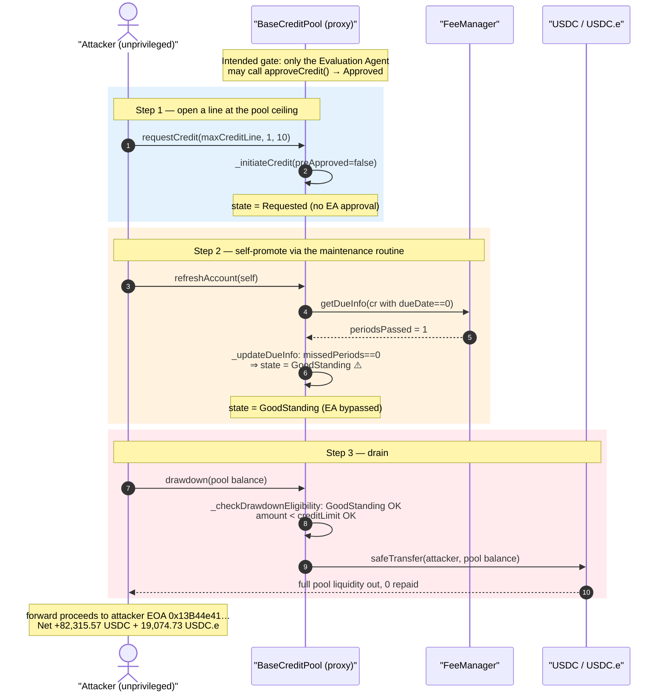
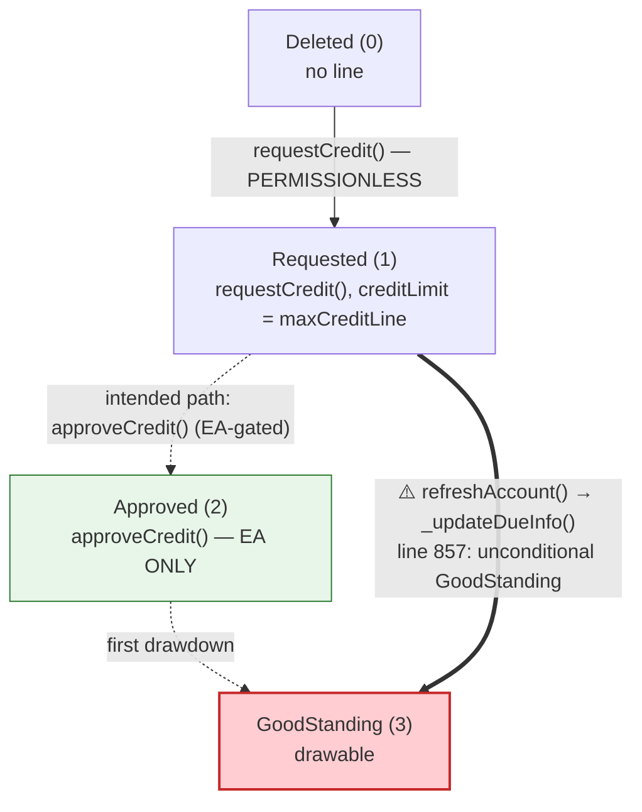
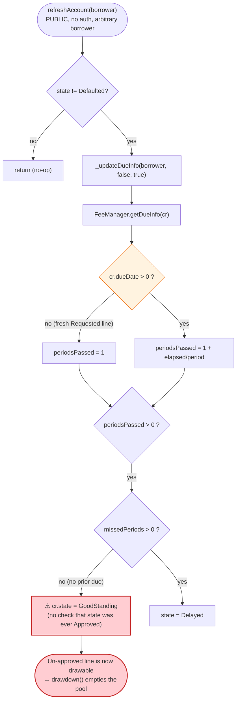
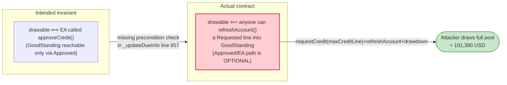

# Huma Finance Exploit — Evaluation-Agent Approval Bypass via `refreshAccount()`

> **Vulnerability classes:** vuln/access-control/missing-auth · vuln/logic/incorrect-state-transition · vuln/logic/missing-check

> **Reproduction:** the PoC compiles & runs in an isolated Foundry project at
> [this project folder](.). Full verbose trace: [output.txt](output.txt).
> Verified vulnerable source (the `BaseCreditPool` implementation that backs all three
> looted proxies): [contracts_BaseCreditPool.sol](sources/BaseCreditPool_57107d/contracts_BaseCreditPool.sol).

---

## Key info

| | |
|---|---|
| **Loss** | ~$101,390 — **82,315.571243 USDC** + **19,074.730601 USDC.e** drained from three Huma credit pools on Polygon |
| **Vulnerable contract** | Huma `BaseCreditPool` implementation [`0x57107d02c2b70e09ad77240dbde7ad77fe91ea1c`](https://polygonscan.com/address/0x57107d02c2b70e09ad77240dbde7ad77fe91ea1c#code) (a second, code-identical impl `0x2cffaaf7885530e1c5a9684ebbe397d6f1de48d8` backs one of the pools) |
| **Victim pools** | Native-USDC pool (proxy [`0x3EBc1f0644A69c565957EF7cEb5AEafE94Eb6FcE`](https://polygonscan.com/address/0x3EBc1f0644A69c565957EF7cEb5AEafE94Eb6FcE)); USDC.e pool A [`0x95533e56f397152B0013A39586bC97309e9A00a7`](https://polygonscan.com/address/0x95533e56f397152B0013A39586bC97309e9A00a7); USDC.e pool B [`0xe8926aDbFADb5DA91CD56A7d5aCC31AA3FDF47E5`](https://polygonscan.com/address/0xe8926aDbFADb5DA91CD56A7d5aCC31AA3FDF47E5) |
| **Attacker EOA** | [`0x13B44e416e0f66359502E843AF2e1191f1260DaF`](https://polygonscan.com/address/0x13B44e416e0f66359502E843AF2e1191f1260DaF) |
| **Attacker contract** | `0x44d4a434ae1529106e4b801315e22721978022a3` |
| **Attack tx** | [`0x7b8d641d76affcc029fd0e0f06ab81ad675b1da21ef79b82e1343016040ba359`](https://polygonscan.com/tx/0x7b8d641d76affcc029fd0e0f06ab81ad675b1da21ef79b82e1343016040ba359) |
| **Chain / block / date** | Polygon (chainId 137) / fork block 86,725,403 / May 2026 |
| **Compiler / optimizer** | Solidity v0.8.4 (impl `0x57107d…`) and v0.8.11 (proxy `0x95533e…`), optimizer **enabled**, **200 runs** (from `_meta.json`) |
| **Bug class** | Access-control / state-machine authorization gap — `_updateDueInfo()` promotes a never-approved credit line to `GoodStanding`, letting anyone bypass the Evaluation Agent and drain the pool |

---

## TL;DR

1. Huma Finance runs on-chain credit pools where large credit lines are supposed to be gated behind a
   privileged off-chain underwriter, the **Evaluation Agent (EA)**. Only the EA may call
   `approveCredit()`, which is the function that moves a line into the `Approved` state
   ([contracts_BaseCreditPool.sol#L129-L150](sources/BaseCreditPool_57107d/contracts_BaseCreditPool.sol#L129-L150)).

2. But two adjacent entry points are **permissionless**: `requestCredit()`
   ([#L285-L299](sources/BaseCreditPool_57107d/contracts_BaseCreditPool.sol#L285-L299)) lets anyone open a
   line in the `Requested` state with any `creditLimit` up to the pool's `maxCreditLine`, and
   `refreshAccount()` ([#L267-L277](sources/BaseCreditPool_57107d/contracts_BaseCreditPool.sol#L267-L277))
   lets anyone "bring an account current" for an arbitrary borrower.

3. The fatal line lives inside `_updateDueInfo()`: when a billing period has elapsed and no payment was
   missed, it **unconditionally** executes `cr.state = BS.CreditState.GoodStanding`
   ([#L855-L857](sources/BaseCreditPool_57107d/contracts_BaseCreditPool.sol#L855-L857)) — it never checks
   that the line was ever EA-approved.

4. For a freshly-`Requested` line, `dueDate == 0`, so the fee manager's `getDueInfo()` returns
   `periodsPassed = 1` on the very first call
   ([contracts_BaseFeeManager.sol#L223-L233](sources/BaseCreditPool_57107d/contracts_BaseFeeManager.sol#L223-L233)).
   That is enough to trip the `GoodStanding` promotion. A single `refreshAccount()` call thus turns a
   `Requested` line straight into `GoodStanding`, skipping `Approved` and the EA entirely.

5. Once in `GoodStanding`, `drawdown()` ([#L200-L209](sources/BaseCreditPool_57107d/contracts_BaseCreditPool.sol#L200-L209))
   takes the "return drawdown" path in `_drawdown()`, whose only sizing check is
   `borrowAmount > creditLimit − unbilledPrincipal − …`
   ([#L468-L473](sources/BaseCreditPool_57107d/contracts_BaseCreditPool.sol#L468-L473)). Because the
   attacker set `creditLimit` to the pool's `maxCreditLine` (10,000,000 in the native-USDC pool), the
   pool's entire on-hand liquidity is well under the limit and the transfer goes out.

6. The PoC repeats the three-call sequence (`requestCredit` → `refreshAccount` → `drawdown`) against each
   of three Polygon pools from a single unprivileged contract, draining whatever balance each pool holds
   and forwarding it to the attacker EOA.

7. Net theft, asserted by the PoC and printed in the trace: **82,315.571243 USDC**
   ([output.txt:1564](output.txt)) plus **19,074.730601 USDC.e** ([output.txt:1565](output.txt)),
   i.e. **~101,390 USD** of pool liquidity, with no EA signature, no collateral, and no repayment.

---

## Background — what Huma does

`BaseCreditPool` ([source](sources/BaseCreditPool_57107d/contracts_BaseCreditPool.sol)) is the core
lending contract of Huma Finance's "income-backed" credit pools. Liquidity providers deposit a stablecoin
(USDC / USDC.e on Polygon) into a pool; borrowers receive **uncollateralized** revolving credit lines that
are supposed to be underwritten off-chain. The underwriting decision is enforced on-chain by a single
privileged role, the **Evaluation Agent (EA)**, whose service account is the only address allowed to
`approveCredit()`.

The intended lifecycle of a credit line is a strict state machine
([contracts_libraries_BaseStructs.sol#L48-L55](sources/BaseCreditPool_57107d/contracts_libraries_BaseStructs.sol#L48-L55)):

```solidity
enum CreditState {
    Deleted,      // 0
    Requested,    // 1  ← anyone can reach this via requestCredit()
    Approved,     // 2  ← ONLY the EA can move a line here (approveCredit)
    GoodStanding, // 3  ← drawable
    Delayed,      // 4
    Defaulted     // 5
}
```

The design intent is: `Requested → (EA) → Approved → (first drawdown) → GoodStanding`. A line should only
ever become drawable *after* the EA has approved it. The bug is that a second, unguarded path exists into
`GoodStanding` that does not pass through `Approved` at all.

On-chain parameters read in the trace at the fork block (block 86,725,403):

| Parameter | Native-USDC pool | USDC.e pool A | USDC.e pool B | Note |
|---|---|---|---|---|
| Proxy address | `0x3EBc1f…` | `0x95533e…` | `0xe8926a…` | TransparentUpgradeableProxy |
| `maxCreditLine` | 10,000,000 (`1e13`) [output.txt:1599](output.txt) | 60,000 (`6e10`) [output.txt:1733](output.txt) | 500,000 (`5e11`) [output.txt:1666](output.txt) | per-pool ceiling, 6 decimals |
| `poolAprInBps` | 1300 (13%) [output.txt:1603](output.txt) | 1300 (13%) [output.txt:1737](output.txt) | 1000 (10%) [output.txt:1670](output.txt) | annual rate |
| `paused()` | false [output.txt:1604](output.txt) | false [output.txt:1739](output.txt) | false [output.txt:1672](output.txt) | protocol live |
| Pool stablecoin balance | 82,315.571243 USDC [output.txt:1630](output.txt) | 17,290.759930 USDC.e [output.txt:1764](output.txt) | 1,783.970671 USDC.e [output.txt:1697](output.txt) | ← the prize per pool |

The whole point of the attack is the gap between `maxCreditLine` (millions) and each pool's actual
liquidity (thousands): the attacker only needs a `creditLimit` large enough to clear the drawdown sizing
check, and `maxCreditLine` is permissionlessly available to anyone via `requestCredit()`.

---

## The vulnerable code

### 1. `approveCredit()` — the only intended path into a drawable state, EA-gated

```solidity
function approveCredit(
    address borrower,
    uint256 creditLimit,
    uint256 intervalInDays,
    uint256 remainingPeriods,
    uint256 aprInBps
) public virtual override {
    _protocolAndPoolOn();
    onlyEAServiceAccount();                 // ← privileged: only the Evaluation Agent
    _maxCreditLineCheck(creditLimit);
    ...
    _setCreditRecord(borrower, _approveCredit(cr));   // ← moves state to Approved
    emit CreditApproved(borrower, creditLimit, intervalInDays, remainingPeriods, aprInBps);
}
```
([contracts_BaseCreditPool.sol#L129-L150](sources/BaseCreditPool_57107d/contracts_BaseCreditPool.sol#L129-L150))

`onlyEAServiceAccount()` ([#L900](sources/BaseCreditPool_57107d/contracts_BaseCreditPool.sol#L900)) is the
guard the attacker is supposed to be unable to satisfy. The exploit never calls this function.

### 2. `requestCredit()` — permissionless, sets state = `Requested`

```solidity
function requestCredit(
    uint256 creditLimit,
    uint256 intervalInDays,
    uint256 numOfPayments
) external virtual override {
    // Open access to the borrower. Data validation happens in _initiateCredit()
    _initiateCredit(
        msg.sender,
        creditLimit,
        _poolConfig.poolAprInBps(),
        intervalInDays,
        numOfPayments,
        false                               // ← preApproved = false ⇒ state = Requested
    );
}
```
([contracts_BaseCreditPool.sol#L285-L299](sources/BaseCreditPool_57107d/contracts_BaseCreditPool.sol#L285-L299))

In `_initiateCredit()`, `preApproved == false` makes the new record land in `Requested`, and the only cap on
`creditLimit` is `_maxCreditLineCheck()` against the pool ceiling:

```solidity
if (preApproved) {
    ncr = _approveCredit(ncr);
    emit CreditApproved(borrower, creditLimit, intervalInDays, remainingPeriods, aprInBps);
} else ncr.state = BS.CreditState.Requested;     // ← attacker's path
```
([contracts_BaseCreditPool.sol#L559-L562](sources/BaseCreditPool_57107d/contracts_BaseCreditPool.sol#L559-L562))

### 3. `refreshAccount()` — permissionless, routes into `_updateDueInfo()`

```solidity
function refreshAccount(address borrower)
    external
    virtual
    override
    returns (BS.CreditRecord memory cr)
{
    if (_creditRecordMapping[borrower].state != BS.CreditState.Defaulted) {
        if (isDefaultReady(borrower)) return _updateDueInfo(borrower, false, false);
        else return _updateDueInfo(borrower, false, true);     // ← attacker's path
    }
}
```
([contracts_BaseCreditPool.sol#L267-L277](sources/BaseCreditPool_57107d/contracts_BaseCreditPool.sol#L267-L277))

There is **no access control** here, and it accepts an arbitrary `borrower` argument — so anyone can refresh
their own freshly-`Requested` line.

### 4. `_updateDueInfo()` — the unconditional `GoodStanding` promotion (the bug)

```solidity
// Sets the right missedPeriods and state for the credit record
if (alreadyLate) cr.missedPeriods = uint16(cr.missedPeriods + periodsPassed);
else cr.missedPeriods = 0;

if (cr.missedPeriods > 0) {
    if (cr.state != BS.CreditState.Defaulted) cr.state = BS.CreditState.Delayed;
} else cr.state = BS.CreditState.GoodStanding;     // ⚠️ no check that state was ever Approved
```
([contracts_BaseCreditPool.sol#L851-L857](sources/BaseCreditPool_57107d/contracts_BaseCreditPool.sol#L851-L857))

This branch fires whenever `periodsPassed > 0` and `missedPeriods == 0`. It assumes the only way a line can
reach `_updateDueInfo()` with `periodsPassed > 0` is if it was already an active (`Approved`/`GoodStanding`)
line being brought current. That assumption is false: a brand-new `Requested` line has `dueDate == 0`, which
the fee manager treats as "one period has passed":

```solidity
if (_cr.dueDate > 0) {
    periodsPassed = 1 + (block.timestamp - _cr.dueDate) / (_crStatic.intervalInDays * SECONDS_IN_A_DAY);
    assert(periodsPassed <= MAX_PERIODS);
} else {
    periodsPassed = 1;                              // ← dueDate == 0 (fresh line) ⇒ periodsPassed = 1
}
```
([contracts_BaseFeeManager.sol#L223-L233](sources/BaseCreditPool_57107d/contracts_BaseFeeManager.sol#L223-L233))

So a single `refreshAccount()` on a `Requested` line returns `periodsPassed = 1`, `missedPeriods = 0`, and
line 857 flips the state straight to `GoodStanding`.

### 5. `drawdown()` / `_drawdown()` — `GoodStanding` is drawable, sized only against `creditLimit`

```solidity
function _checkDrawdownEligibility(address borrower, BS.CreditRecord memory cr, uint256 borrowAmount) internal view {
    _protocolAndPoolOn();
    if (cr.state != BS.CreditState.GoodStanding && cr.state != BS.CreditState.Approved)
        revert Errors.creditLineNotInStateForDrawdown();   // ← GoodStanding passes
    else if (cr.state == BS.CreditState.Approved) { ... }   // creditLimit check ONLY for Approved
}
```
([contracts_BaseCreditPool.sol#L415-L436](sources/BaseCreditPool_57107d/contracts_BaseCreditPool.sol#L415-L436))

Because the attacker's line is `GoodStanding` (not `Approved`), `_drawdown()` takes the "return drawdown"
branch, whose only sizing guard compares the requested amount to the remaining headroom under `creditLimit`:

```solidity
if (
    borrowAmount >
    (_creditRecordStaticMapping[borrower].creditLimit -
        cr.unbilledPrincipal -
        (cr.totalDue - cr.feesAndInterestDue))
) revert Errors.creditLineExceeded();
...
_underlyingToken.safeTransfer(borrower, netAmountToBorrower);   // ← liquidity leaves the pool
```
([contracts_BaseCreditPool.sol#L459-L507](sources/BaseCreditPool_57107d/contracts_BaseCreditPool.sol#L459-L507))

With `creditLimit = maxCreditLine` (10,000,000 in the native-USDC pool) and the pool holding only
82,315.571243 USDC, the requested draw is trivially under the limit and the full pool balance is transferred
out.

---

## Root cause — why it was possible

The root cause is a **state-machine authorization gap**: there are two distinct paths into the drawable
`GoodStanding` state, and only one of them is EA-gated.

1. **Intended path:** `requestCredit` (`Requested`) → `approveCredit` (`Approved`, EA only) → `drawdown`
   first-draw (`GoodStanding`).
2. **Exploit path:** `requestCredit` (`Requested`) → `refreshAccount` → `_updateDueInfo` → `GoodStanding`
   — **the EA is never consulted.**

`_updateDueInfo()` was written as a maintenance routine for *already-active* lines ("bring the account
current"). Its final state assignment, `else cr.state = BS.CreditState.GoodStanding`
([#L857](sources/BaseCreditPool_57107d/contracts_BaseCreditPool.sol#L857)), implicitly trusts that the line
was already `Approved` or `GoodStanding`. Nothing enforces that precondition. Combined with three other
permissionless facts:

- `requestCredit()` is open and lets the attacker pick `creditLimit` up to `maxCreditLine`.
- `refreshAccount()` is open and accepts an arbitrary `borrower`.
- A fresh `Requested` line has `dueDate == 0`, which the fee manager interprets as `periodsPassed = 1` — the
  exact condition that triggers the promotion.

…the attacker can self-promote an un-approved line to `GoodStanding` and immediately draw the pool dry.
`_checkDrawdownEligibility()` does not re-assert approval, and the only volume cap in the `GoodStanding`
branch is against the attacker-chosen `creditLimit`, so it is no obstacle.

---

## Preconditions

- The pool is live (`_protocolAndPoolOn()` passes — `paused() == false`, confirmed at
  [output.txt:1604](output.txt) / [:1672](output.txt) / [:1739](output.txt)).
- The attacker has no existing credit line in the pool (so `_initiateCredit` does not revert with
  `creditLineAlreadyExists`). A fresh address / fresh contract satisfies this; the PoC uses the test
  contract itself.
- `requestCredit(creditLimit, …)` with `creditLimit ≤ maxCreditLine` (the PoC reads `maxCreditLine` and
  requests exactly that — `1e13` / `6e10` / `5e11`).
- At least the implicit "one period passed" condition holds for a fresh line, which is *always* true because
  `dueDate == 0` ⇒ `periodsPassed = 1`. No time-warp is even required (the PoC does not warp).
- The pool holds liquidity to steal. No flash loan, no collateral, and no capital outlay are needed — this is
  a pure authorization bypass, not an economic/AMM manipulation.

---

## Attack walkthrough (with on-chain numbers from the trace)

The PoC drains three pools with the identical three-call sequence. The CreditRecord state is encoded in
storage slot `…5f52d50`, whose leading bytes are `state(1 byte)‖remainingPeriods(2 bytes)`; the trace shows
it transition `01 000a` (Requested, 10 periods) → `03 0009` (GoodStanding, 9 periods) on each
`refreshAccount`. All token amounts are raw 6-decimal integers; human approximations in parentheses.

| # | Step | On-chain evidence | Credit-line state / pool effect |
|---|------|------------------|---------------------------------|
| 0 | **Read `maxCreditLine`** for the native-USDC pool | returns 10000000000000 (`1e13` = 10,000,000 USDC) [output.txt:1599](output.txt) | Ceiling the attacker will claim as `creditLimit`. |
| 1 | **`requestCredit(1e13, 1, 10)`** | `CreditInitiated(... creditLimit=1e13, apr=1300, interval=1, periods=10, preApproved=false)` [output.txt:1608](output.txt); storage slot set to `01 000a…` (state=Requested, 10 periods) [output.txt:1610](output.txt) | Line opened in **Requested** — no EA approval. |
| 2 | **`refreshAccount(this)`** | `getDueInfo(...)` returns `periodsPassed = 1` [output.txt:1618-1619](output.txt); `BillRefreshed` emitted [output.txt:1620-1622](output.txt); state slot `01 000a → 03 0009` [output.txt:1624](output.txt) | Line flipped **Requested → GoodStanding** ⚠️ (skips Approved). |
| 3 | **Read pool USDC balance** | `USDC.balanceOf(pool)` = 82315571243 (~82,315.57 USDC) [output.txt:1630](output.txt) | The full drawable amount. |
| 4 | **`drawdown(82315571243)`** | `DrawdownMade(82315571243, 82315571243)` [output.txt:1652](output.txt); `Transfer(pool → attacker contract, 82315571243)` [output.txt:1646](output.txt) | **Native-USDC pool emptied**: 82,315.571243 USDC out, 0 repaid. |
| 5 | **Pool B: `requestCredit(5e11,1,10)` → `refreshAccount` → `drawdown(1783970671)`** | `maxCreditLine`=5e11 [output.txt:1666](output.txt); state `01 000a → 03 0009` [output.txt:1692](output.txt); pool balance 1783970671 (~1,783.97 USDC.e) [output.txt:1697](output.txt); `Transfer(poolB → attacker, 1783970671)` [output.txt:1713](output.txt) | **USDC.e pool B emptied**: 1,783.970671 USDC.e out. |
| 6 | **Pool A: `requestCredit(6e10,1,10)` → `refreshAccount` → `drawdown(17290759930)`** | `maxCreditLine`=6e10 [output.txt:1733](output.txt); state `01 000a → 03 0009` [output.txt:1759](output.txt); pool balance 17290759930 (~17,290.76 USDC.e) [output.txt:1764](output.txt); `Transfer(poolA → attacker, 17290759930)` [output.txt:1780](output.txt) | **USDC.e pool A emptied**: 17,290.759930 USDC.e out. |
| 7 | **Forward proceeds to attacker EOA** | `Transfer(this → attacker EOA, 82315571243)` USDC [output.txt:1801](output.txt); `Transfer(this → attacker EOA, 19074730601)` USDC.e [output.txt:1813](output.txt) | Mirrors the real-tx sweep to `0x13B44e41…`. |
| 8 | **Profit logged & asserted** | `Attacker USDC profit: 82315.571243` [output.txt:1564](output.txt); `Attacker USDC.e profit: 19074.730601` [output.txt:1565](output.txt) | Total ≈ **101,390.30 USD**. |

The two USDC.e draws (1,783.970671 + 17,290.759930 = 19,074.730601) sum to the asserted USDC.e profit
([output.txt:1825](output.txt) / [:1828](output.txt)).

### Profit / loss accounting

| Asset | Pool drained | Amount (raw, 6-dec) | ~Human |
|---|---|---:|---:|
| USDC | native-USDC pool `0x3EBc1f…` | 82,315,571,243 | 82,315.571243 |
| USDC.e | pool B `0xe8926a…` | 1,783,970,671 | 1,783.970671 |
| USDC.e | pool A `0x95533e…` | 17,290,759,930 | 17,290.759930 |
| **USDC total** | | **82,315,571,243** | **82,315.571243** |
| **USDC.e total** | | **19,074,730,601** | **19,074.730601** |
| **Combined** | | — | **≈ 101,390.30 USD** |

The PoC asserts the forwarded amounts equal the drained amounts to the wei
(`assertEq(usdcProfit, usdcDrained)` / `assertEq(usdceProfit, usdceDrained)`,
[output.txt:1829](output.txt) / [:1831](output.txt)) and that each side exceeds its floor
(`assertGt(usdcProfit, 80_000e6)` [output.txt:1833](output.txt); `assertGt(usdceProfit, 18_000e6)`
[output.txt:1835](output.txt)). There is no capital outlay and no repayment — every stolen token is pure pool
liquidity that honest LPs deposited.

---

## Diagrams

### Sequence of the attack (one pool; repeated three times)



### Credit-line state evolution



### The flaw inside `_updateDueInfo()`



### Authorization invariant: intended vs. actual



---

## Why each magic number

- **`config.maxCreditLine()` as `creditLimit` (1e13 / 6e10 / 5e11):** the attacker requests exactly the
  pool's own ceiling so the later drawdown's `borrowAmount ≤ creditLimit − …` check
  ([#L468-L473](sources/BaseCreditPool_57107d/contracts_BaseCreditPool.sol#L468-L473)) can never bind. The
  values come straight from each pool's config — 10,000,000 USDC for the native pool
  ([output.txt:1599](output.txt)), 60,000 for USDC.e pool A ([output.txt:1733](output.txt)), 500,000 for
  USDC.e pool B ([output.txt:1666](output.txt)). All are millions/hundreds-of-thousands, dwarfing the few
  thousand actually in each pool.
- **`intervalInDays = 1`, `numOfPayments = 10`:** any non-zero `numOfPayments` works (`_initiateCredit`
  reverts only on `remainingPeriods == 0`, [#L523](sources/BaseCreditPool_57107d/contracts_BaseCreditPool.sol#L523)).
  `1` day / `10` periods are just convenient small values; they do not affect the bypass.
- **`drawdown(token.balanceOf(pool))`:** the attacker borrows precisely the pool's current stablecoin
  balance — 82,315.571243 USDC ([output.txt:1630](output.txt)), 1,783.970671 USDC.e
  ([output.txt:1697](output.txt)), 17,290.759930 USDC.e ([output.txt:1764](output.txt)) — i.e. drains each
  pool to (near) zero in one call.
- **Three pools:** the same impl `0x57107d…` (and the code-identical `0x2cffaaf…`) backs every pool, so the
  same bug applies to all of them; the PoC loots all three Polygon pools the attacker hit in the real tx.
- **Assertion floors `80_000e6` / `18_000e6`:** sanity thresholds proving the native-USDC pool (>80k USDC)
  and the two USDC.e pools (>18k USDC.e) were materially drained ([output.txt:1833](output.txt) / [:1835](output.txt)).

---

## Remediation

1. **Enforce the approval precondition in `_updateDueInfo()`.** The `GoodStanding` promotion at
   [#L857](sources/BaseCreditPool_57107d/contracts_BaseCreditPool.sol#L857) must never apply to a line that
   was not previously `Approved`/`GoodStanding`/`Delayed`. Concretely, guard it: only refresh a line whose
   `state >= Approved`, and leave `Requested`/`Deleted` lines untouched (or revert).
2. **Make `refreshAccount()` a no-op for non-active lines.** Before routing into `_updateDueInfo()`, require
   the borrower's `state` to be one of `Approved`/`GoodStanding`/`Delayed`/`Defaulted`. A `Requested` line has
   nothing to "refresh."
3. **Re-assert approval at drawdown time.** `_checkDrawdownEligibility()`
   ([#L415-L436](sources/BaseCreditPool_57107d/contracts_BaseCreditPool.sol#L415-L436)) should require that
   the line passed through `Approved` (e.g., track an `approvedByEA` flag in the record set only by
   `approveCredit()`), independent of the current `state` value, so a synthetic `GoodStanding` cannot draw.
4. **Encode EA approval as a one-way latch in the CreditRecord.** Add an explicit `eaApproved` boolean that
   is set only by `approveCredit()` and checked by every value-moving path. State-enum transitions alone are
   too easy to reach through unintended routes.
5. **Treat the fresh-line `dueDate == 0 ⇒ periodsPassed = 1` shortcut as hostile input.** The fee manager's
   assumption ([contracts_BaseFeeManager.sol#L231-L233](sources/BaseCreditPool_57107d/contracts_BaseFeeManager.sol#L231-L233))
   that any line reaching it is an active line is the seam the exploit slips through; the caller must validate
   line maturity before invoking the due-info machinery.

---

## How to reproduce

The PoC runs **offline** against a local anvil fork (state served from the project's `anvil_state.json`;
`setUp()` does `vm.createSelectFork("http://127.0.0.1:8549", 86_725_403)`), so no public RPC is required.

```bash
_shared/run_poc.sh 2026-05-HumaCreditApprovalBypass_exp --mt testExploit -vvvvv
```

- The shared harness boots a local anvil instance from `anvil_state.json` and points `createSelectFork` at
  `127.0.0.1:8549`, pinned to Polygon block 86,725,403.
- `foundry.toml` sets `evm_version = 'cancun'`; the verified contracts compile under Solidity v0.8.4 / v0.8.11
  (optimizer on, 200 runs).
- Result: `[PASS] testExploit()` — three un-approved credit lines self-promoted and drawn dry.

Expected tail:

```
Ran 1 test for test/HumaCreditApprovalBypass_exp.sol:ContractTest
[PASS] testExploit() (gas: 589303)
Logs:
  Attacker USDC profit: 82315.571243
  Attacker USDC.e profit: 19074.730601

Suite result: ok. 1 passed; 0 failed; 0 skipped; finished in 50.59s (47.41s CPU time)
```

---

*Reference: Huma Finance BaseCreditPool EA-approval bypass — Polygon attack tx
[`0x7b8d641d…ba359`](https://polygonscan.com/tx/0x7b8d641d76affcc029fd0e0f06ab81ad675b1da21ef79b82e1343016040ba359) (~$101,390).*
