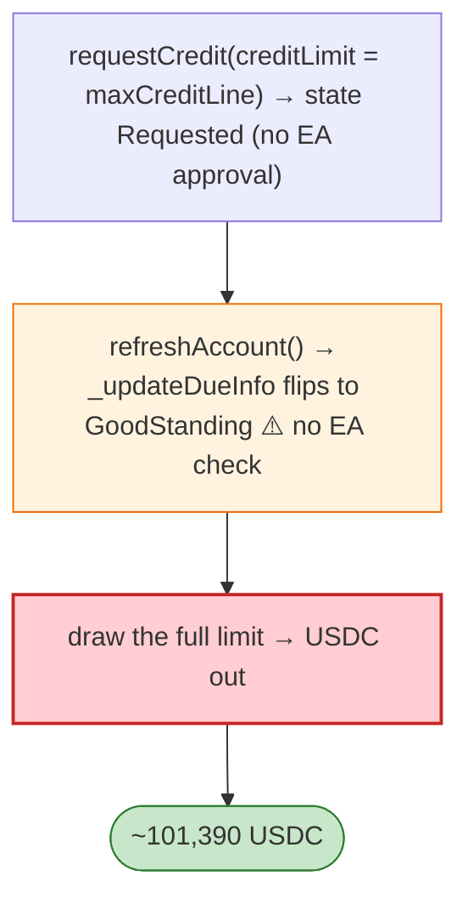

# Huma Finance BaseCreditPool Exploit — EA-Approval Bypass via `refreshAccount`

> **Reproduction:** the PoC compiles & runs in an isolated Foundry project at
> [this project folder](.). Full verbose trace: [output.txt](output.txt).
> Verified vulnerable source: [BaseCreditPool](sources/BaseCreditPool_57107d) + 3 proxies.

---

## Key info

| | |
|---|---|
| **Loss** | ~101,390 USDC; tx `0x7b8d641d…` |
| **Vulnerable contract** | Huma `BaseCreditPool` impl `0x57107d02…` (Polygon) |
| **Attacker** | `0x13B44e41…` (contract `0x44d4a434…`) |
| **Chain / block / date** | Polygon / May 2026 |
| **Bug class** | Access-control/state-machine — credit pools gate large credit lines behind the Evaluation Agent's `approveCredit()`, but `requestCredit()` and `refreshAccount()` are open to anyone, and `_updateDueInfo()` flips a line to `GoodStanding` after a billing period without checking EA approval. |

---

## TL;DR

Per the embedded analysis: Huma gates large credit lines behind the EA's `approveCredit()`. But both
`requestCredit()` and `refreshAccount()` are open to anyone, and `BaseCreditPool._updateDueInfo()`
**unconditionally sets a credit line to `GoodStanding`** when a billing period has passed and no payment
is missed — **without checking the line was ever EA-approved**. So an attacker: (1) `requestCredit()`
with `creditLimit` up to the pool's `maxCreditLine` (state = Requested), (2) `refreshAccount()` to flip
the un-approved line to `GoodStanding`, then (3) draw the full limit.

---

## Root cause

A **state-machine authorisation gap**: `_updateDueInfo()` promotes a credit line to `GoodStanding`
based only on billing/payment status, not on whether the EA ever approved it, so the `Requested`
(lines that were never EA-approved) become drawable.

---

## Diagrams



---

## Remediation

1. `_updateDueInfo` must only promote lines in an `Approved` state; reject `Requested`.
2. `draw`/`borrow` must require `state == Approved` independently of due status.
3. EA approval as a hard precondition encoded in the credit-line struct.

---

## How to reproduce

```bash
_shared/run_poc.sh 2026-05-HumaCreditApprovalBypass_exp -vvvvv
```

- RPC: Polygon archive. Result: `[PASS]` — un-approved credit line drawn.

---

*Reference: Huma Finance BaseCreditPool EA-approval bypass, Polygon, May 2026 (~101,390 USDC).*
