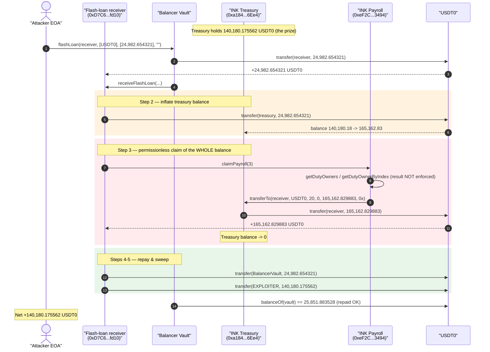
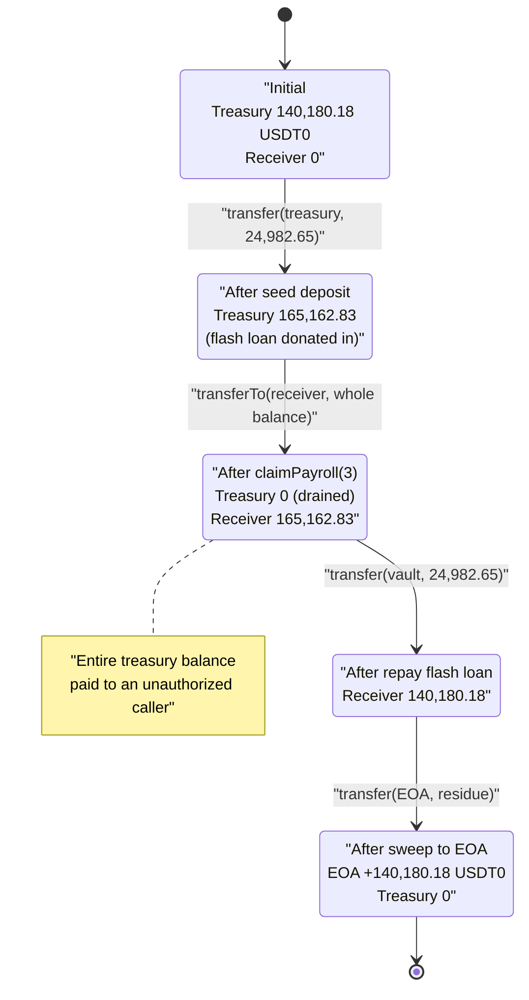
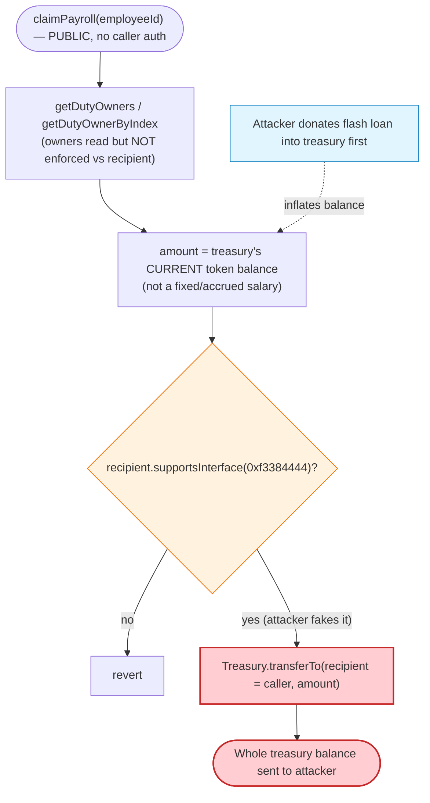

# INK Finance Exploit — Flash-Loan-Inflated, Permissionless `claimPayroll()` Treasury Drain

> **Vulnerability classes:** vuln/access-control/missing-auth · vuln/logic/missing-check · vuln/defi/slippage

> One-liner: anyone could call `Payroll.claimPayroll(employeeId)`, which paid out the **treasury's
> entire live token balance** to the caller; the attacker first donated a flash loan into the
> treasury to inflate that balance, then claimed it all and kept the original ~$140K.

> **Reproduction:** the PoC compiles & runs in this isolated Foundry project at
> [this folder](.). Full verbose trace: [output.txt](output.txt).
> **Sources note:** every in-scope INK Finance contract (payroll proxy + impl, treasury proxy + impl,
> duty manager proxy + impl) is **UNVERIFIED** on PolygonScan / Etherscan V2, so the "vulnerable code"
> section below is reconstructed from the live execution trace, decoded selectors, and decoded events
> rather than from verified source. Only the USDT0 token source was verifiable
> ([UChildERC20Proxy](sources/UChildERC20Proxy_c2132D/)).

---

## Key info

| | |
|---|---|
| **Loss** | **~$140,180** — 140,180.175562 USDT0 (the treasury's entire balance) |
| **Vulnerable contract** | INK Finance `Payroll` proxy — [`0xeF2C77f3B9b8aaa067239bc6B4588Bae26433494`](https://polygonscan.com/address/0xeF2C77f3B9b8aaa067239bc6B4588Bae26433494#code) (impl `0xc04813A6683F803c9Cf6c441357A11182b7E1153`) |
| **Victim / pool** | INK Finance `Treasury` (vault) — [`0xa184Af4B1c01815A4B57422A3419E4FB78a96Ee4`](https://polygonscan.com/address/0xa184Af4B1c01815A4B57422A3419E4FB78a96Ee4) (impl `0x72225ccbCB4b6530Bd5322A62aF5d777AFc89890`) |
| **Attacker EOA** | [`0x90b147592191388e955401af43842e19faa87ee2`](https://polygonscan.com/address/0x90b147592191388e955401af43842e19faa87ee2) |
| **Attacker contract** | [`0x74f28b9A35D72504E007C60803eF47f1A44b109e`](https://polygonscan.com/address/0x74f28b9A35D72504E007C60803eF47f1A44b109e) (the on-chain flash-loan receiver was at `0xD7C643517F98F58D3F9BA91De05d4f62620cFd10`) |
| **Attack tx** | [`0xb469a24ec737be16fe41367a7b5b315c7f03b4e0ff3af50b3a2db03b3066b982`](https://polygonscan.com/tx/0xb469a24ec737be16fe41367a7b5b315c7f03b4e0ff3af50b3a2db03b3066b982) |
| **Chain / block / date** | Polygon / 86,711,192 / 2026-05-11 07:24:54 UTC |
| **Flash-loan source** | Balancer Vault `0xBA12222222228d8Ba445958a75a0704d566BF2C8` (24,982.654321 USDT0, fee 0) |
| **Compiler** | PoC: Solidity ^0.8.13 (built with solc 0.8.34); target contracts unverified |
| **Bug class** | Missing access control + balance-derived payout amount (flash-loan-manipulable accounting) |

---

## TL;DR

INK Finance is a Polygon "on-chain payroll / DAO treasury" product. Employees are paid out of a shared
`Treasury` vault. The `Payroll` contract exposes **`claimPayroll(uint256 employeeId)`**, which —
based on the live trace — has two fatal properties:

1. **No caller authorization.** The function does not check that `msg.sender` is the employee, the
   employee's duty owner, or any authorized party. In the attack it was invoked by an arbitrary,
   freshly-`etch`ed contract that just happened to implement a payroll-receiver interface
   (`supportsInterface(0xf3384444) == true`), and the payout was sent to **that caller**, not to the
   real duty owners (`0xb391…1659`, `0xb624…9ae8`).
2. **The payout amount tracks the treasury's *current* token balance, not a fixed salary.** When
   `claimPayroll(3)` ran, the treasury was made to `transferTo(receiver, USDT0, …, amount = 165,162.829883 USDT0, …)`
   — **exactly the treasury's entire USDT0 balance at that instant**.

The attacker combines the two: they take a **Balancer flash loan of 24,982.654321 USDT0**, **send it
into the treasury** (inflating its balance from 140,180.18 → 165,162.83 USDT0), then call
`claimPayroll(3)`. The treasury pays out its whole 165,162.83 USDT0 balance to the attacker's receiver.
The attacker repays the 24,982.654321 flash loan and walks away with the **original 140,180.175562 USDT0**
that genuinely belonged to the treasury — to the wei.

---

## Background — what INK Finance does

INK Finance is a DAO/treasury + payroll suite. Relevant on-chain pieces, all behind transparent
proxies (each call in the trace first reads `implementation()` then `delegatecall`s):

| Role | Proxy | Implementation |
|---|---|---|
| **Payroll** (entry point `claimPayroll`) | `0xeF2C…3494` | `0xc04813…1153` |
| **Treasury / Vault** (`transferTo` moves funds out) | `0xa184Af…6Ee4` | `0x72225c…9890` |
| **Duty / group manager** (`getDutyOwners`, `getDutyOwnerByIndex`) | `0xBC9058…1c82` (via `0x171e2D…6540`) | `0xA7A5Eb…15E3` |
| Token paid out | `USDT0` `0xc2132D…58e8F` (canonical Polygon Tether, 6 decimals) | — |

The flow for a legitimate payroll claim (reconstructed from the trace, [output.txt:63-110](output.txt#L63-L110)):

```
Payroll.claimPayroll(employeeId)
  → DutyManager.getDutyOwners(dutyHash)            // how many owners on this "duty"
  → DutyManager.getDutyOwnerByIndex(dutyHash, i)   // who they are
  → Treasury.transferTo(recipient, token, vaultId, 0, amount, data)  // pays out
  → emit PayrollClaimed(...)                        // marks claim done
```

The treasury's `transferTo` is itself a generic vault-withdraw primitive
([output.txt:85-105](output.txt#L85-L105)): it does `USDT0.transfer(recipient, amount)` and then
notifies the recipient (the `supportsInterface(0xf3384444)` check + the inner `VaultDeposit` event
tagged with the string `"deposit"`).

---

## The vulnerable code

> The contracts are unverified; the following is decoded from the trace and from selector recovery.
> Selectors recovered with `cast sig`: `claimPayroll(uint256) = 0xcbdcb9ac`,
> `getDutyOwners(bytes32) = 0x21bd3834`, `getDutyOwnerByIndex(bytes32,uint256) = 0xff67cb0c`.

### 1. `claimPayroll` is callable by anyone and pays the caller

In the live tx, `claimPayroll(3)` is invoked **by the etched flash-loan receiver**
(`0xD7C6…fd10`) — not by employee #3, not by either duty owner. The call succeeds and the payout is
delivered to that receiver:

```
[148719] 0xeF2C…3494::claimPayroll(3)                       # Payroll proxy
  → implementation() => 0xc04813…1153
  → 0xc04813…1153::claimPayroll(3) [delegatecall]
      → 0xBC9058…1c82::getDutyOwners(0x461c…186f) => 2
      → getDutyOwnerByIndex(...,0) => 0xb39195…1659          # real owner #0 (NOT attacker)
      → getDutyOwnerByIndex(...,1) => 0xb624f0…9ae8          # real owner #1 (NOT attacker)
      → 0xa184Af…6Ee4::transferTo(
            0xD7C6…fd10,           # recipient = the CALLER, the attacker's receiver
            USDT0,                 # token
            20, 0,                 # vaultId = 0x14, flag = 0
            165162829883,          # amount = treasury's ENTIRE USDT0 balance
            0x)
      → emit PayrollClaimed(..., amount = 165162829883, ...)
```

([output.txt:63-110](output.txt#L63-L110)) The only "gate" exercised on the recipient is an interface
probe (`supportsInterface(0xf3384444) → true`, [output.txt:97-98](output.txt#L97-L98)), which the
attacker's contract trivially satisfies (see [test/INKFinance_exp.sol:98-100](test/INKFinance_exp.sol#L98-L100)).
There is no check binding `msg.sender` / `recipient` to the employee or the duty owners.

### 2. The payout equals the treasury's live token balance

The amount transferred out, `165,162,829,883` (= 165,162.829883 USDT0), is **not** a fixed salary —
it is precisely the treasury's USDT0 balance *after the attacker's seed deposit*:

| | USDT0 (raw) | USDT0 |
|---|---:|---:|
| Treasury balance before attack (read on-chain @ block 86,711,191) | 140,180,175,562 | 140,180.175562 |
| + flash-loaned seed deposited by attacker | 24,982,654,321 | 24,982.654321 |
| = treasury balance at claim time | **165,162,829,883** | **165,162.829883** |
| `transferTo` amount paid to attacker | **165,162,829,883** | **165,162.829883** |

The equality is exact: the payroll computed the claimable amount **from the treasury's current
balance**, so donating tokens into the treasury directly inflates the payout. (Confirmed by querying
the treasury USDT0 balance at the pre-exploit block: `0x20a363baca = 140,180,175,562`, and `0` right
after.)

### 3. The treasury `transferTo` is a generic, payroll-trusting withdraw

`Treasury.transferTo` ([output.txt:85-105](output.txt#L85-L105)) simply does
`USDT0.transfer(recipient, amount)` and emits a `VaultDeposit`/notification event. It trusts the
Payroll contract to have authorized the recipient and amount — but Payroll did neither.

---

## Root cause — why it was possible

Two independent flaws compose into a critical, fully-permissionless drain:

1. **Missing authorization on `claimPayroll`.** Anyone can call `claimPayroll(employeeId)` and have the
   funds sent to themselves (the caller / an arbitrary recipient). The duty-owner lookup
   (`getDutyOwners` / `getDutyOwnerByIndex`) is performed but its result is **not enforced** against the
   recipient — the trace shows the payout went to `0xD7C6…fd10`, which is neither owner. The only
   recipient check is an ERC-165-style `supportsInterface(0xf3384444)` probe, which is not authentication.

2. **Payout amount derived from the treasury's instantaneous balance.** Because the claim pays out the
   treasury's *current* token balance rather than a pre-funded, per-employee accrued salary, the amount
   is manipulable by anyone who can change that balance. A direct token transfer into the treasury (a
   "donation") is enough — and flash loans make arbitrarily large donations free and atomic.

Either flaw alone is severe; together they let an attacker with **zero capital** drain the entire
treasury:

> Flash-loan a large amount → push it into the treasury (balance inflates) → `claimPayroll` pays the
> whole inflated balance to the attacker → repay the flash loan → net profit = the treasury's original
> balance.

The flash-loaned seed is not even strictly required to steal *something* (the missing access control
alone lets anyone claim whatever the treasury holds); the seed is what makes the numbers come out so
that the attacker keeps the genuine treasury balance after repaying the loan. In effect the attacker
used the loan only to **route their own claim through the loan's repayment guarantee** and to make the
accounting net to "original treasury balance."

---

## Preconditions

- **Treasury holds tokens.** The vault must contain the token being claimed (140,180.18 USDT0 here);
  this is the prize and an obvious normal state.
- **A claimable `employeeId` exists** whose payout path resolves to a `transferTo` of the treasury
  balance. The attacker used `employeeId = 3`.
- **No caller authorization** on `claimPayroll` (the core bug) — true at the fork block.
- **Recipient passes the interface probe.** The attacker's receiver returns `true` for
  `supportsInterface(0xf3384444)` ([test/INKFinance_exp.sol:98-100](test/INKFinance_exp.sol#L98-L100)).
- **A flash-loan venue for USDT0** (Balancer Vault, 0% fee here) — used to inflate the treasury balance
  so the post-repayment profit equals the original treasury balance. Strictly optional for the theft
  itself, but it is how the live attack was structured.

---

## Step-by-step attack walkthrough (with on-chain numbers from the trace)

All figures are taken directly from the events / storage diffs in
[output.txt](output.txt). USDT0 has 6 decimals.

| # | Step | Trace ref | USDT0 moved | Treasury balance after | Receiver balance after |
|---|------|-----------|------------:|-----------------------:|-----------------------:|
| 0 | **Initial** treasury balance (read on-chain @ pre-exploit block) | — | — | 140,180.175562 | 0 |
| 1 | Attacker EOA calls `BalancerVault.flashLoan(receiver, [USDT0], [24,982.654321], "")`; vault sends loan to receiver | [output.txt:39-46](output.txt#L39-L46) | 24,982.654321 → receiver | 140,180.175562 | 24,982.654321 |
| 2 | In `receiveFlashLoan`, attacker **seeds the treasury**: `USDT0.transfer(treasury, 24,982.654321)` | [output.txt:55-62](output.txt#L55-L62) | 24,982.654321 → treasury | **165,162.829883** | 0 |
| 3 | Attacker calls `Payroll.claimPayroll(3)` → treasury `transferTo(receiver, USDT0, 20, 0, 165,162.829883, …)` pays the **entire treasury balance** to receiver | [output.txt:63-110](output.txt#L63-L110) | 165,162.829883 → receiver | **0** | 165,162.829883 |
| 4 | Attacker repays flash loan: `USDT0.transfer(BalancerVault, 24,982.654321)` | [output.txt:111-118](output.txt#L111-L118) | 24,982.654321 → vault | 0 | 140,180.175562 |
| 5 | Attacker sweeps profit: `USDT0.transfer(EXPLOITER, receiver.balance = 140,180.175562)` | [output.txt:119-130](output.txt#L119-L130) | 140,180.175562 → EOA | 0 | 0 |
| 6 | Balancer verifies repayment (`balanceOf(vault) == 25,851.883528`, unchanged) | [output.txt:132-136](output.txt#L132-L136) | — | 0 | 0 |

End state: attacker EOA holds **140,180.175562 USDT0**; treasury is empty; Balancer is made whole.

### Profit / loss accounting (USDT0)

| Direction | Amount |
|---|---:|
| Flash loan received (Balancer) | +24,982.654321 |
| Seed into treasury | −24,982.654321 |
| Treasury payout received (whole balance) | +165,162.829883 |
| Flash loan repaid | −24,982.654321 |
| **Net to attacker EOA** | **+140,180.175562** |
| **Treasury loss** | **−140,180.175562** |

The attacker's profit equals the treasury's original balance to the wei — the flash loan washed out
exactly, confirming the loan's only role was to make the post-repayment residue equal the genuine
treasury funds. PoC assertion: `assertEq(usdtProfit, 140_180_175_562)` ([test/INKFinance_exp.sol:61](test/INKFinance_exp.sol#L61)).

---

## Diagrams

### Sequence of the attack



### Treasury balance evolution



### Why it drains: balance-derived payout + missing auth



---

## Remediation

1. **Authenticate the claimant.** `claimPayroll` must verify that `msg.sender` (or the designated
   recipient) is an authorized party for that `employeeId`/duty — e.g., the employee address or a
   duty owner returned by `getDutyOwnerByIndex`. The owner list is already fetched; it must be
   *enforced*, not merely read. An interface probe is not authentication.
2. **Pay from pre-funded, per-employee accrued amounts, never from the treasury's live balance.**
   The claimable amount should be a discrete, recorded liability (accrued salary minus already-paid),
   not "whatever the vault currently holds." This removes the balance-manipulation surface entirely.
3. **Make the payout immune to donations / flash loans.** Track owed amounts in internal accounting;
   ignore raw `balanceOf` of the treasury when sizing a payout. Any function whose output depends on a
   contract's spot token balance is flash-loan-manipulable.
4. **Send funds only to the recorded payee.** The recipient of `transferTo` should be derived from the
   employee/duty record, never from an arbitrary caller-supplied or caller-implied address.
5. **Add per-claim and per-period caps.** Even with the above, cap any single `transferTo` to a sane
   maximum and bound total outflow per epoch, so a single mispriced claim cannot empty the vault.

---

## How to reproduce

```bash
_shared/run_poc.sh 2026-05-INKFinance_exp -vvvvv
```

- **RPC:** a **Polygon archive** endpoint is required (the fork pins the exploit tx at block
  86,711,192, May 2026). The default public RPCs in the shared template
  (`polygon-mainnet.public.blastapi.io`, `polygon.drpc.org`, `publicnode`, `1rpc.io`) either rate-limit
  (HTTP 403) or have pruned historical state and fail with `historical state … is not available`.
  `foundry.toml` here is set to **`https://polygon.gateway.tenderly.co`**, which serves historical
  state at that block. (`https://polygon.lava.build` also works as a fallback.)
- Forking + execution takes ~5 minutes over the public archive gateway.
- Result: `[PASS] testExploit()` with `Stolen USDT 140180175562`.

Expected tail:

```
Ran 1 test for test/INKFinance_exp.sol:INKFinanceTest
[PASS] testExploit() (gas: 241901)
Logs:
  Stolen USDT 140180175562

Suite result: ok. 1 passed; 0 failed; 0 skipped; finished in 334.29s
```

---

*References: CryptoTimes — "Ink Finance Exploited on Polygon, $140K USDT Drained in Flash Loan Attack"
(2026-05-11), https://www.cryptotimes.io/2026/05/11/ink-finance-exploited-on-polygon-140k-usdt-drained-in-flash-loan-attack/*
