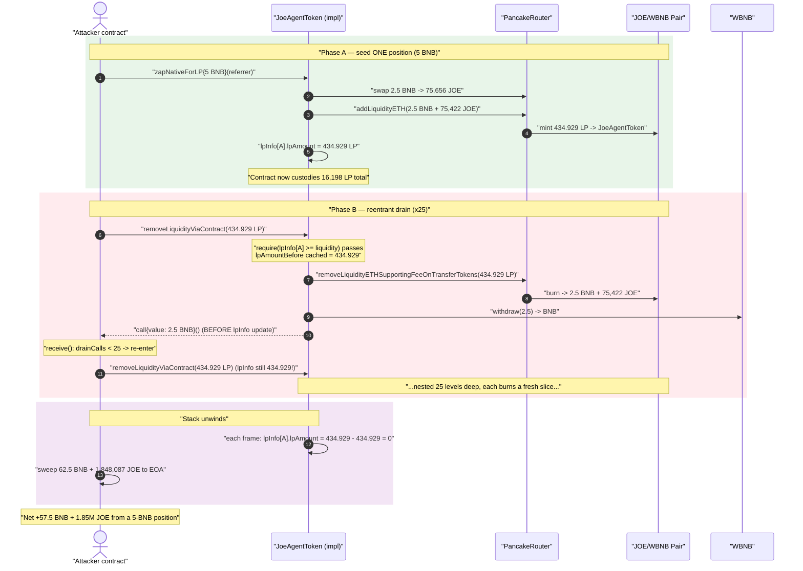
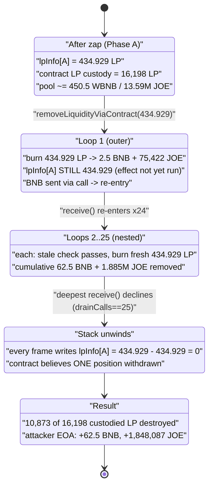
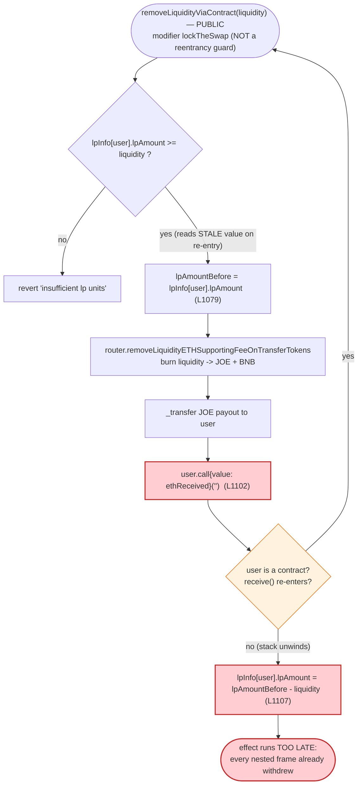

# Joe Agent (JOE) Exploit — `removeLiquidityViaContract` Reentrancy on Pooled LP Custody

> **Vulnerability classes:** vuln/reentrancy/single-function · vuln/logic/incorrect-order-of-operations · vuln/logic/state-update

> **Reproduction:** the PoC compiles & runs as `[PASS]` in an isolated Foundry project at
> [this project folder](.) (the umbrella DeFiHackLabs repo contains many unrelated PoCs that fail
> a whole-project `forge build`, so this one was extracted).
> Full verbose trace: [output.txt](output.txt).
> Verified vulnerable source: [contracts_JoeAgentToken.sol](sources/JoeAgentToken_b12ce0/contracts_JoeAgentToken.sol).

A single, paid-for ~434.9 LP position was withdrawn **25 times** because `lpInfo[user].lpAmount`
is decremented *after* the contract sends the unwrapped BNB to the user — re-entering the withdraw
before its own bookkeeping closes drains the whole pool of depositors' LP.

---

## Key info

| | |
|---|---|
| **Loss** | ~$45K — **62.5 BNB** + **1,848,087 JOE** drained from the protocol's pooled LP |
| **Vulnerable contract** | `JoeAgentToken` (impl) — [`0xb12Ce0a21f67a9fc3c8AD1C7DBC4B017B7E67319`](https://bscscan.com/address/0xb12ce0a21f67a9fc3c8ad1c7dbc4b017b7e67319#code) |
| **Proxy (entry point)** | `JOE` ERC1967 proxy — [`0xef0f12d08d66e76E1866e60F30a0DaA578e00c04`](https://bscscan.com/address/0xef0f12d08d66e76E1866e60F30a0DaA578e00c04) |
| **Victim pool** | JOE/WBNB PancakeSwap pair — `0x7e5396A6b56372D1Ee42ab6b199bc2d5A8540f9c` |
| **Attacker EOA** | `0xAA761779945dCC5f26064fC6dCb36FFaB6AC7610` |
| **Attacker contract** | `0x31F81FCD91025728F24bD6f0E4EfB156e345A4CF` |
| **Attack tx** | `0xd16a1c3dcd84427b2c7dcccbe1854c1c5bf65900460e1a44a95c1aaaf140c3a5` |
| **Chain / block / date** | BSC / 100,812,531 / May 27, 2026 |
| **Compiler** | Solidity v0.8.28, optimizer **200 runs** |
| **Bug class** | Reentrancy via checks-effects-interactions (CEI) violation on shared/custodial state |
| **Reference** | SlowMist: https://x.com/SlowMist_Team/status/2059887450663551352 |

---

## TL;DR

`JoeAgentToken` lets users "zap" native BNB into a JOE/WBNB LP position that is **custodied by the
token contract itself** and merely *credited* to the user via `lpInfo[user].lpAmount`
([struct LPInfo](sources/JoeAgentToken_b12ce0/contracts_JoeAgentToken.sol#L44-L47): *"protocol-held
LP units credited to the account"*). Many users' LP therefore pile up in **one** balance held by the
contract.

`removeLiquidityViaContract(liquidity, …)`
([:1045-1111](sources/JoeAgentToken_b12ce0/contracts_JoeAgentToken.sol#L1045-L1111)) pulls `liquidity`
LP out of PancakeSwap, receives the JOE + BNB, forwards the unwrapped **BNB to the user with a raw
`call`** — and only **after** that call decrements `lpInfo[user].lpAmount`:

```solidity
uint256 lpAmountBefore = lpInfo[user].lpAmount;     // L1079 — cached at the START
...
uniswapV2Router.removeLiquidityETHSupportingFeeOnTransferTokens(...);   // burns LP, gets JOE+BNB
...
if (ethReceived > 0) {
    (bool ok, ) = user.call{value: ethReceived}("");   // L1102 — EXTERNAL CALL (re-entry point)
    require(ok, "eth transfer failed");
}
...
lpInfo[user].lpAmount = lpAmountBefore - liquidity;    // L1107 — EFFECT, after the interaction
```

The function's only "guard" is the `lockTheSwap` modifier, which **does not revert on re-entry** —
it merely flips an `inSwap` flag used to skip fee/tax logic. There is **no `nonReentrant`** anywhere
in the contract.

So when the BNB lands in the attacker's `receive()`, `lpInfo[attacker].lpAmount` is still the full
434.9 LP. The attacker re-calls `removeLiquidityViaContract(434.9 LP, …)`, the
`require(lpInfo[user].lpAmount >= liquidity)` check still passes (it was never decremented), and a
**fresh** slice of LP — belonging to *other* depositors — is burned and paid out. Repeating this
25 times pulls 25 × ~2.5 BNB = **62.5 BNB** (plus 25 × ~75,422 JOE) out of a single position the
attacker only funded once with 5 BNB.

---

## Background — what Joe Agent does

`JoeAgentToken` is a UUPS-upgradeable ERC20 ("JOE") on BSC that bundles a referral/node system with a
**custodial LP-staking** product:

- **Zap-to-LP.** `zapNativeForLP(parent, …)`
  ([:746-754](sources/JoeAgentToken_b12ce0/contracts_JoeAgentToken.sol#L746-L754)) takes the user's
  BNB, swaps half to JOE through PancakeSwap, adds both sides as liquidity to the JOE/WBNB pair, and
  has the **token contract** receive the LP tokens. The user gets nothing transferable — they only
  get an internal credit `lpInfo[user].lpAmount += liquidity`
  ([:833-835](sources/JoeAgentToken_b12ce0/contracts_JoeAgentToken.sol#L833-L835)).
- **Custodial withdraw.** `removeLiquidityViaContract(liquidity, …)`
  ([:1045-1052](sources/JoeAgentToken_b12ce0/contracts_JoeAgentToken.sol#L1045-L1052)) lets the user
  redeem up to their credited `lpAmount`. The contract burns that LP on PancakeSwap, takes a ~2%
  `removeFee` on the JOE side, forwards the JOE and the unwrapped BNB back to the user.
- **Referral gating.** `_bindParentIfNeeded`
  ([:1113-1126](sources/JoeAgentToken_b12ce0/contracts_JoeAgentToken.sol#L1113-L1126)) requires a
  first-time zapper to name an LP-eligible referrer. The PoC re-uses the same on-chain referrer the
  real attacker used (`0x324344f20CEb0b58E0D35a06fb1B3892ac1A8d9D`).

On-chain facts at the fork block (read from the trace):

| Parameter | Value |
|---|---|
| `lpInfo[attacker].lpAmount` after 5-BNB zap | **434.929368…e18 LP** |
| JOE/WBNB LP held by the JOE contract (all depositors' custody) | **16,198.14e18 LP** |
| `removeFee` (taken on the JOE side of each withdraw) | ≈ **2%** (37,478 JOE of 1,885,565 gross) |
| BNB redeemed per LP burn | ≈ **2.5 BNB** |
| JOE redeemed per LP burn | ≈ **75,422.6 JOE** |

The decisive fact: each `removeLiquidityViaContract(434.9 LP)` redeems ~2.5 BNB, but the contract's
*total* custodied balance was 16,198 LP. The single-position check never limits how much of that
shared 16,198-LP pile the attacker can burn, because the check reads stale state.

---

## The vulnerable code

### 1. `lockTheSwap` is **not** a reentrancy guard

```solidity
bool private inSwap;
modifier lockTheSwap() {
    inSwap = true;
    _;
    inSwap = false;
}
```
[contracts_JoeAgentToken.sol:114-119](sources/JoeAgentToken_b12ce0/contracts_JoeAgentToken.sol#L114-L119)

There is **no `require(!inSwap)`**. The flag is only consulted in the transfer-tax path
(`if (whiteList[from] || whiteList[to] || inSwap)` at
[:303](sources/JoeAgentToken_b12ce0/contracts_JoeAgentToken.sol#L303)) to short-circuit fee
collection during swaps. Re-entering `removeLiquidityViaContract` while `inSwap == true` is perfectly
allowed. `grep -n "nonReentrant\|ReentrancyGuard"` over the contract returns nothing.

### 2. Effect happens after the interaction (CEI violation)

```solidity
function _removeLiquidityViaContract(address user, uint256 liquidity, ...) internal {
    require(liquidity > 0, "zero liquidity");
    require(lpInfo[user].lpAmount >= liquidity, "insufficient lp units");   // ← reads stale value
    require(lpInfo[user].lastAddLpTime != block.timestamp, "cannot add/remove in same block");

    IERC20(mainPair).approve(address(uniswapV2Router), liquidity);

    uint256 joeBefore     = balanceOf(address(this));
    uint256 ethBefore     = address(this).balance;
    uint256 lpAmountBefore = lpInfo[user].lpAmount;          // L1079 — cached BEFORE any external work

    uniswapV2Router.removeLiquidityETHSupportingFeeOnTransferTokens(
        address(this), liquidity, amountTokenMin, amountETHMin, address(this), deadline
    );

    uint256 joeReceived = balanceOf(address(this)) - joeBefore;
    uint256 ethReceived = address(this).balance - ethBefore;
    ...
    if (payout > 0)      { _transfer(address(this), user, payout); }   // JOE out
    if (ethReceived > 0) {
        (bool ok, ) = user.call{value: ethReceived}("");               // L1102 — RE-ENTRY POINT
        require(ok, "eth transfer failed");
    }

    uint256 principalReduction = lpAmountBefore == 0 ? 0 : (principalBefore * liquidity) / lpAmountBefore;
    lpInfo[user].lpAmount = lpAmountBefore - liquidity;                 // L1107 — EFFECT, too late
    ...
}
```
[contracts_JoeAgentToken.sol:1064-1111](sources/JoeAgentToken_b12ce0/contracts_JoeAgentToken.sol#L1064-L1111)

Two compounding mistakes:

1. **The external `call` at L1102 precedes the state write at L1107** — classic CEI violation.
2. **`lpAmountBefore` is cached at L1079 (function entry).** Even across re-entrant frames, the
   write `lpInfo[user].lpAmount = lpAmountBefore - liquidity` of an *inner* frame writes back the
   *full* original amount minus one `liquidity`. So no matter how the frames interleave, the balance
   never reflects the cumulative withdrawals — the contract believes the user removed exactly one
   position even after 25 redemptions.

---

## Root cause — why it was possible

Three design decisions compose into a critical reentrancy:

1. **LP is pooled in the contract, not held per-user.** `zapNativeForLP` deposits everyone's LP into
   one balance owned by `JoeAgentToken`, and `lpInfo[user].lpAmount` is only an *accounting credit*
   against that shared pile. Over-redeeming therefore steals **other depositors' principal**, not the
   attacker's own. This turns a self-harming double-spend into a profitable theft.
2. **No real reentrancy protection.** The look-alike `lockTheSwap` modifier sets a flag but never
   reverts on re-entry, and the contract imports no `ReentrancyGuard`. The author appears to have
   believed `lockTheSwap` was a lock; it is only a tax-bypass switch.
3. **CEI is violated on the one path that hands control to an arbitrary address.** The raw
   `user.call{value: ethReceived}("")` is the worst possible place to leave state un-updated: it
   gives a contract `user` a free callback while `lpInfo[user].lpAmount` is still at its pre-withdraw
   value. The `require(lpInfo[user].lpAmount >= liquidity)` admission check is consequently a no-op
   for re-entrant calls.

Because the per-loop redemption (~2.5 BNB) is a fixed slice of the position, and the contract's
custodied balance (16,198 LP) dwarfs the position (434.9 LP), the attacker can keep re-entering until
either the JOE contract's LP custody or the pool's WBNB reserve is exhausted. 25 loops was enough to
realise the headline 62.5 BNB.

---

## Preconditions

- A funded LP position credited to the attacker contract — created with one `zapNativeForLP` call
  (5 BNB in the PoC → 434.9 LP). The attacker contract has a `receive()` that re-enters.
- The position is **not in the same block** as the withdraw (the only guard that *does* work:
  `require(lpInfo[user].lastAddLpTime != block.timestamp)` at
  [:1073](sources/JoeAgentToken_b12ce0/contracts_JoeAgentToken.sol#L1073)). The PoC satisfies this
  with `vm.warp(block.timestamp + 1 hours); vm.roll(block.number + 1)`
  ([test/JoeAgent_exp.sol:107-108](test/JoeAgent_exp.sol#L107-L108)).
- A registered LP-eligible referrer for the first zap (PoC reuses the attacker's real referrer).
- Enough custodied LP / pool depth that the repeated burns keep returning value — satisfied here by
  the 16,198-LP custody backing other depositors.

No flash loan or price manipulation is needed; the only capital required is the single seed position.

---

## Attack walkthrough (with on-chain numbers from the trace)

All figures are pulled directly from the `Mint` / `Burn` / `Withdrawal` events and `lpInfo` returns in
[output.txt](output.txt). The pair's `token0 = WBNB`, `token1 = JOE`.

### Phase A — seed one position (`zapNativeForLP`, 5 BNB)

| Step | Action | Result |
|---|---|---|
| A0 | `seedPosition{value: 5 BNB}` → `zapNativeForLP(referrer,…)` | binds referrer; splits 5 BNB into 2.5 / 2.5 |
| A1 | swap 2.5 BNB → 75,656.2 JOE (sent to `tokenDistributor`, pulled back) | pool: 448.03 WBNB / 13,516,709 JOE |
| A2 | `addLiquidityETH(2.5 BNB + 75,422.6 JOE)` → mints **434.929 LP to the JOE contract** | pool: 450.53 WBNB / 13,592,132 JOE |
| A3 | `lpInfo[attacker].lpAmount = 434.929e18`; JOE contract LP custody = **16,198.14 LP** | position credited |

### Phase B — reentrant drain (`removeLiquidityViaContract` × 25)

Each outer/inner frame burns the **same** 434.929 LP, redeeming ~2.5 BNB + ~75,422.6 JOE, then the
unwrapped BNB hits `JoeAgentAttacker.receive()`, which re-enters before `lpInfo` is decremented.

| Loop `n` | `removeLiquidityViaContract(434.929 LP)` admitted? | BNB to attacker | JOE skimmed | Cumulative BNB |
|---:|---|---:|---:|---:|
| 1 | ✓ (`lpAmount` = 434.929, stale) | 2.499999…9 | 75,422.6 | 2.50 |
| 2 | ✓ (still 434.929 — not yet decremented) | 2.500000 | 75,422.6 | 5.00 |
| 3 | ✓ | 2.500000 | 75,422.6 | 7.50 |
| … | … (frames 4–24, each re-entered from the prior `receive()`) | 2.500000 | 75,422.6 | … |
| 25 | ✓ | 2.500000 | 75,422.6 | **62.50** |

After the 25th frame's `receive()` declines to re-enter (`drainCalls == targetLoops`), the call stack
unwinds. Each frame finally executes `lpInfo[user].lpAmount = lpAmountBefore - liquidity`, all writing
back `434.929 - 434.929 = 0`, so the final stored `lpInfo[attacker].lpAmount = 0` — the contract is
convinced the attacker withdrew exactly **one** position.

- Total BNB drained: **62.499999…e18 ≈ 62.5 BNB** (trace: `Attacker EOA BNB after drain : 62499999999999999999`).
- Total JOE burned out of the pool: 25 × 75,422.6 = **1,885,565 JOE** gross; after the ~2% `removeFee`,
  **1,848,087 JOE** lands on the attacker EOA (trace: `JOE skimmed to attacker EOA : 1848087`).
- Total LP burned from the contract's custody: 25 × 434.929 = **10,873 LP** out of the 16,198 LP it
  held — i.e. ~67% of *all* depositors' LP, against a position the attacker paid 5 BNB for once.

### Profit / loss accounting

| Item | Amount |
|---|---:|
| Seed capital spent (BNB) | 5.0 |
| BNB drained | 62.5 |
| **Net BNB profit** | **+57.5** |
| JOE skimmed to attacker EOA | 1,848,087 JOE |
| LP destroyed from shared custody | 10,873.2 LP (of 16,198.1) |
| Headline reported loss | ~$45K (62.5 BNB + ~1.19M JOE on-chain; PoC realises 1.85M JOE at the fork block) |

The 57.5 net BNB plus the JOE comes entirely from other depositors' pooled liquidity; the attacker's
own 434.9 LP only ever justified ~5 BNB of redemption.

---

## Diagrams

### Sequence of the attack



### Pool / state evolution



### The flaw inside `_removeLiquidityViaContract`



---

## Remediation

1. **Apply checks-effects-interactions.** Decrement `lpInfo[user].lpAmount` (and `lpPrincipalValue`)
   **before** the external `user.call{value:…}` — ideally even before the router burn, using the LP
   actually pulled. The admission `require` must read a value that has already been reduced by any
   in-flight withdrawal.
2. **Add a real reentrancy guard.** Inherit OpenZeppelin `ReentrancyGuard` and mark
   `removeLiquidityViaContract`, `removeLiquidityViaContractFor`, the zap/add functions, and any other
   externally-callable path that performs a value transfer with `nonReentrant`. Do **not** rely on
   `lockTheSwap`, which only toggles a tax-bypass flag and never reverts.
3. **Stop caching mutable balances across an external call.** `lpAmountBefore` is read once at L1079
   and reused at L1107; after the CEI fix it should be re-derived from current state, or the update
   should be `lpInfo[user].lpAmount -= liquidity` so concurrent (re-entrant) decrements compose
   correctly.
4. **Use a push-safe payout.** Prefer pulling BNB via a withdraw-pattern (credit a balance the user
   later claims) over a raw `call` that hands control to arbitrary `receive()` code mid-function. If a
   direct send is required, perform it strictly last, after all effects.
5. **Bound per-call withdrawals against custody, not just per-user credit.** Because LP is pooled in
   the contract, an additional invariant check (e.g. total redeemed in a tx ≤ user's credited share)
   would have capped the damage even if the reentrancy slipped through.

---

## How to reproduce

The PoC was extracted into a standalone Foundry project (the umbrella DeFiHackLabs repo has many
unrelated PoCs that fail a whole-project `forge build`):

```bash
_shared/run_poc.sh 2026-05-JoeAgent_exp -vvvvv
```

- RPC: a **BSC archive** endpoint is required (fork block 100,812,530). `foundry.toml` uses
  `https://bsc-mainnet.public.blastapi.io`, which serves historical state at that block; most public
  BSC RPCs prune it and fail with `header not found` / `missing trie node`.
- Result: `[PASS] testExploit()` draining 62.5 BNB from a 5-BNB seed.

Expected tail:

```
  === Result ===
  Total BNB drained (wei)      : 62499999999999999999
  Seed capital spent (wei)     : 5000000000000000000
  Net BNB profit (wei)         : 57499999999999999999
  JOE skimmed to attacker EOA  : 1848087

  Reentrancy confirmed: one ~437 LP position withdrawn 25x for 62.5 BNB.
Suite result: ok. 1 passed; 0 failed; 0 skipped
```

---

*Reference: SlowMist — https://x.com/SlowMist_Team/status/2059887450663551352 (Joe Agent / JOE, BSC, ~$45K).*
