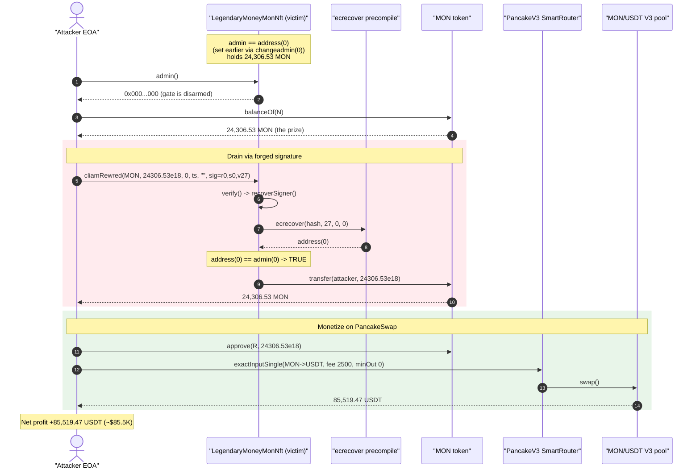
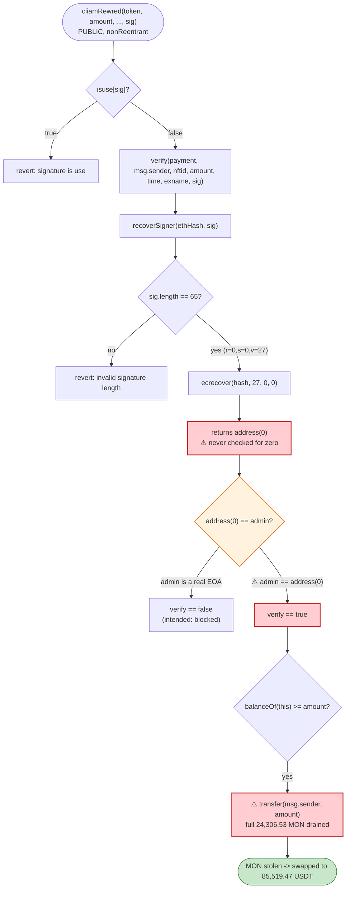

# LegendaryMoneyMonNft Exploit — `cliamRewred()` Signature Bypass via `ecrecover` → `address(0)` == `admin`

> **Vulnerability classes:** vuln/auth/signature-validation · vuln/logic/missing-check · vuln/access-control/missing-owner-check

> **Reproduction:** the PoC compiles & runs in an isolated Foundry project at
> [this project folder](.) (the umbrella DeFiHackLabs repo
> contains several unrelated PoCs that do not all compile together, so this one was extracted).
> Full verbose trace: [output.txt](output.txt).
> Verified vulnerable source: [LegendaryMoneyMonNft.sol](sources/LegendaryMoneyMonNft_92D606/LegendaryMoneyMonNft.sol).

---

## Key info

| | |
|---|---|
| **Loss** | ~$85,519 — **24,306.53 MON** drained from the NFT contract, swapped to **85,519.47 USDT** |
| **Vulnerable contract** | `LegendaryMoneyMonNft` ("Legendary MoneyMon NFTs") — [`0x92D60629FF5d53a0098B51E9b1D59546D1D8e5B6`](https://bscscan.com/address/0x92D60629FF5d53a0098B51E9b1D59546D1D8e5B6#code) |
| **Drained token** | `Moneymon` (MON) — [`0xA1C1A7341a1713F174D59926E49E4A1228924100`](https://bscscan.com/address/0xA1C1A7341a1713F174D59926E49E4A1228924100#code) |
| **Exit pool** | MON/USDT PancakeSwap V3 pool (fee 2500) — `0x20bDcd1387feE20e42c3B4d328c9D3ad2DEa9e1D` |
| **Attacker EOA** | `0xE1582248C593Df4B367e131922438Fec9D76E787` |
| **Attacker contract** | `0x157ba211f05dd2c83006be949e12b2f0f0a0c1d9` (EIP-7702 delegate of the EOA) |
| **Attack tx** | `0x15c835c070672948b3487d35254bce96831bec9f5212f78b04e683fed74bf4a2` |
| **Chain / block / date** | BSC / 100,937,039 / May 28, 2026 |
| **Compiler** | Solidity v0.8.14, optimizer 200 runs |
| **Bug class** | Missing `ecrecover` return-value (`address(0)`) check + admin misconfigured to zero address ⇒ signature-gated withdrawal fully bypassable |
| **Reference** | SlowMist: https://x.com/SlowMist_Team/status/2060205558687486441 |

---

## TL;DR

`LegendaryMoneyMonNft.cliamRewred()` lets any caller pull an arbitrary ERC20 amount out of the contract,
gated only by an off-chain `admin` signature checked through `verify()`
([LegendaryMoneyMonNft.sol:885-895](sources/LegendaryMoneyMonNft_92D606/LegendaryMoneyMonNft.sol#L885-L895)).
The signature check terminates in:

```solidity
return ecrecover(_ethSignedMessageHash, v, r, s);   // recoverSigner()
...
return recoverSigner(ethSignedMessageHash, signature) == admin;   // verify()
```

Two facts combine into a total bypass:

1. **`ecrecover` returns `address(0)` for a malformed signature** (e.g. `r = s = 0`). The contract never
   rejects that zero return — `recoverSigner` hands it straight back to `verify`, which compares it to
   `admin`.
2. **`admin` had been set to the zero address on-chain.** The owner had earlier called
   `changeadmin(address(0))` ([:629-631](sources/LegendaryMoneyMonNft_92D606/LegendaryMoneyMonNft.sol#L629-L631)),
   so `admin == address(0)` at the fork block (verified in the trace: `NFT.admin() → 0x000…000`).

So the equality `ecrecover(...) == admin` reduces to `address(0) == address(0)` → **always true**. The
attacker submitted `cliamRewred(MON, fullBalance, 0, block.timestamp, "", forgedSig)` with a 65-byte
signature of `(r = 0, s = 0, v = 27)`, `verify()` returned `true`, and the contract transferred its
**entire 24,306.53 MON balance** to the attacker. The attacker then dumped that MON into the MON/USDT
PancakeSwap V3 pool for **85,519.47 USDT** of profit.

> Note: on-chain the drain ran from the attacker EOA itself via an EIP-7702 SetCode (type-4) transaction
> that delegated the EOA's code to `0x157ba211…`. The PoC reproduces the same calls with `vm.startPrank`
> acting as the attacker EOA.

---

## Background — what the protocol does

`LegendaryMoneyMonNft` ([source](sources/LegendaryMoneyMonNft_92D606/LegendaryMoneyMonNft.sol)) is the NFT
contract for the "MoneyMon" game. Users buy/mint/upgrade NFTs by paying USDT or the project's own
`Moneymon` (MON) token, which the contract swaps and distributes
(`baseMint`, `ReMint`, `upgrade`, `swap`). It accumulates MON in its own balance as part of these flows
(`mainnft = address(this)`, [:615](sources/LegendaryMoneyMonNft_92D606/LegendaryMoneyMonNft.sol#L615);
`IERC20(men).transfer(mainnft, …)`, [:785](sources/LegendaryMoneyMonNft_92D606/LegendaryMoneyMonNft.sol#L785)).

To pay out off-chain-computed rewards, the team uses a **signed-voucher pattern**: a backend signs a
message authorizing a specific user to withdraw a specific token amount, and the user redeems it on-chain
via `cliamRewred()`. The signer is the `admin` address, and the on-chain check is `verify()` /
`recoverSigner()` (a hand-rolled `ecrecover` wrapper).

Relevant on-chain state at the fork block:

| Parameter | Value |
|---|---|
| `admin` (default in code) | `0xa8cf7AcC731b17e06a0b4c7CC79CE02cD51CfA59` ([:592](sources/LegendaryMoneyMonNft_92D606/LegendaryMoneyMonNft.sol#L592)) |
| `admin` (actual, on-chain) | **`0x0000000000000000000000000000000000000000`** (set via `changeadmin`) |
| MON held by the contract | **24,306.531592912736 MON** ← the prize |
| MON token | `0xA1C1A7341a1713F174D59926E49E4A1228924100` (Moneymon, 18 decimals) |
| Exit liquidity | MON/USDT PancakeSwap V3 pool, fee `2500`, addr `0x20bDcd…9e1D` |

The whole attack hinges on the last two-row pair: the contract held ~24.3K MON and the signature gate
guarding it had been silently disarmed.

---

## The vulnerable code

### 1. `cliamRewred()` — signature-gated, arbitrary-amount token withdrawal

[LegendaryMoneyMonNft.sol:885-895](sources/LegendaryMoneyMonNft_92D606/LegendaryMoneyMonNft.sol#L885-L895):

```solidity
function cliamRewred(address _paymentaddress,uint256 _amount,uint256 _nftid,uint256 _time,string memory _exname,bytes memory signature) public nonReentrant{
    require(!isuse[signature],"signature is use ");
    require(verify(_paymentaddress,msg.sender, _nftid, _amount, _time, _exname,signature),"Envalid_User");
    require(_paymentaddress != address(0x0),"paymentaddress_not_be_ZERO_Address");
    require(_amount > 0,"Amount_not_be_ZERO");
    require(IERC20(_paymentaddress).balanceOf(address(this)) >= _amount,"Add_Token_Balance_In_Contract");
    IERC20(_paymentaddress).transfer(msg.sender,_amount);   // ⚠️ pays out whatever amount the (bypassed) signature "authorized"
    isuse[signature] = true ;
    emit eventname("calimrewred",msg.sender,0,false,_time,_amount,block.timestamp);
}
```

The function trusts `verify()` completely: `_amount`, `_paymentaddress`, and the recipient (`msg.sender`)
are all attacker-chosen, with `verify()` being the only thing standing between the caller and the
contract's token balance.

### 2. `verify()` — compares the recovered signer to `admin`

[LegendaryMoneyMonNft.sol:928-933](sources/LegendaryMoneyMonNft_92D606/LegendaryMoneyMonNft.sol#L928-L933):

```solidity
function verify(address payment,address user,uint _nftid,uint amount,uint _time,string memory _exname,bytes memory signature) public view returns (bool) {
    bytes32 messageHash = keccak256(abi.encodePacked(payment,user,_nftid,amount,_time,_exname));
    bytes32 ethSignedMessageHash = getEthSignedMessageHash(messageHash);

    return recoverSigner(ethSignedMessageHash, signature) == admin;   // ⚠️ address(0) == admin(0) when admin is zeroed
}
```

### 3. `recoverSigner()` — raw `ecrecover`, no zero-address guard

[LegendaryMoneyMonNft.sol:935-943](sources/LegendaryMoneyMonNft_92D606/LegendaryMoneyMonNft.sol#L935-L943):

```solidity
function recoverSigner(bytes32 _ethSignedMessageHash, bytes memory _signature)
    private pure returns (address)
{
    (bytes32 r, bytes32 s, uint8 v) = splitSignature(_signature);
    return ecrecover(_ethSignedMessageHash, v, r, s);   // ⚠️ returns address(0) on malformed input — never checked
}
```

`splitSignature` only enforces `sig.length == 65`
([:954](sources/LegendaryMoneyMonNft_92D606/LegendaryMoneyMonNft.sol#L954)); it does not validate
`r`, `s`, or `v`. With `r = s = 0` and `v = 27`, the `ecrecover` precompile returns the empty word, i.e.
`address(0)` — visible in the trace as `PRECOMPILES::ecrecover(0x950f…, 27, 0, 0) → 0x`
([output.txt:1628-1629](output.txt#L1628)).

### 4. `changeadmin()` — owner can zero out the only authority

[LegendaryMoneyMonNft.sol:629-631](sources/LegendaryMoneyMonNft_92D606/LegendaryMoneyMonNft.sol#L629-L631):

```solidity
function changeadmin(address _admin) public onlyOwner{
    admin = _admin ;     // ⚠️ no `_admin != address(0)` guard
}
```

`changeadmin` accepts the zero address. Combined with the missing `ecrecover` check, setting
`admin = address(0)` is equivalent to **disabling signature verification entirely** — the gate now
accepts a forged all-zero signature.

---

## Root cause — why it was possible

The `ecrecover` precompile returns `address(0)` (not a revert) whenever it cannot recover a valid signer
— including for the trivially attacker-constructable input `(r, s) = (0, 0)`. Every safe signature
library (e.g. OpenZeppelin's `ECDSA.recover`) rejects this by either reverting or checking
`signer != address(0)`. `recoverSigner()` here does **neither**:

> `verify()` reduces to `ecrecover(...) == admin`. If an attacker can force `ecrecover(...) == address(0)`
> (trivial: pass a zero signature) **and** `admin` happens to be `address(0)`, the comparison is
> `address(0) == address(0)` → `true`, and the whole signature gate is bypassed.

The `admin == address(0)` condition was not a leftover constructor default — the deployed default was a
real EOA (`0xa8cf…fA59`). It became zero because someone called `changeadmin(address(0))`, and
`changeadmin` lacks a zero-address guard. Whether that was an operational mistake or an intentional
"disable" that the team forgot was a wide-open backdoor, the result is the same: any caller can mint a
withdrawal voucher for themselves.

Two independent defects had to coincide:

1. **No `address(0)` rejection after `ecrecover`** — the classic missing-signer-check bug
   (`recoverSigner`, [:942](sources/LegendaryMoneyMonNft_92D606/LegendaryMoneyMonNft.sol#L942)).
2. **`admin` set to `address(0)`** — enabled by an unguarded `changeadmin` setter
   ([:629-631](sources/LegendaryMoneyMonNft_92D606/LegendaryMoneyMonNft.sol#L629-L631)).

Either fix alone would have blocked the attack. The PoC asserts the precondition explicitly:
`require(NFT.admin() == address(0), …)` ([test/LegendaryMoneyMonNft_exp.sol:99](test/LegendaryMoneyMonNft_exp.sol#L99)).

---

## Preconditions

- `admin == address(0)` on-chain (true at the fork block — confirmed in the trace).
- The contract holds a non-zero balance of some ERC20 the attacker wants (`MON`, 24,306.53 here).
- A 65-byte signature is required by `splitSignature`; the attacker uses
  `abi.encodePacked(bytes32(0), bytes32(0), uint8(27))` so `ecrecover` returns `address(0)`.
- Each forged signature can only be used once (`isuse[signature]`), but the attacker just needs **one**
  call to drain the full balance (`_amount = contract balance`).
- No capital required: the drain is free; the only follow-on cost is the PancakeSwap fee on the
  MON → USDT exit swap.

---

## Attack walkthrough (with on-chain numbers from the trace)

All figures are taken directly from [output.txt](output.txt).

| # | Step | Call / value | Result |
|---|------|--------------|--------|
| 0 | **Read precondition** | `NFT.admin()` | `0x000…000` (admin is zeroed) — confirmed |
| 1 | **Read prize** | `MON.balanceOf(NFT)` | `24,306.531592912736 MON` held by victim |
| 2 | **Forge signature** | `abi.encodePacked(bytes32(0),bytes32(0),uint8(27))` | 65-byte `(r=0,s=0,v=27)` blob |
| 3 | **Drain call** | `cliamRewred(MON, 24306.53e18, 0, block.timestamp, "", forgedSig)` | see 3a-3c below |
| 3a | ↳ inside `verify` → `recoverSigner` | `ecrecover(0x950f…, 27, 0, 0)` | returns `address(0)` ([output.txt:1628](output.txt#L1628)) |
| 3b | ↳ `verify` returns | `address(0) == admin(0)` | `true` ([output.txt:1637](output.txt#L1637)) |
| 3c | ↳ payout | `MON.transfer(attacker, 24306.53e18)` | full balance moved to attacker ([output.txt:1632-1633](output.txt#L1632)) |
| 4 | **Approve router** | `MON.approve(PancakeV3SmartRouter, 24306.53e18)` | router can spend stolen MON |
| 5 | **Exit swap** | `exactInputSingle(MON→USDT, fee 2500, amountIn 24306.53e18, minOut 0)` | **85,519.468 USDT out** ([output.txt:1680](output.txt#L1680)) |
| 6 | **Result** | `USDT.balanceOf(attacker)` | `85,519.468029991188 USDT` profit |

Concrete pool math for the exit swap (MON/USDT V3, fee 2500): the attacker sold 24,306.53 MON into the
pool and received 85,519.47 USDT out
([`Swap` event, output.txt:1680](output.txt#L1680): `amount0 = -85,519.47 USDT`, `amount1 = +24,306.53 MON`).
The pool's MON-side balance rose to `35,657.350541127555 MON` (its prior ~11,350.82 MON reserve plus the
attacker's 24,306.53 MON input), and its USDT side fell by the 85,519.47 USDT paid out — exactly the
attacker's realized profit.

### Profit / loss accounting

| Party | Asset | Δ |
|---|---|---:|
| **Victim** (`LegendaryMoneyMonNft`) | MON | **−24,306.531592912736** |
| **Attacker** | MON (transient, swapped away) | +24,306.53 → 0 |
| **Attacker** | USDT (realized profit) | **+85,519.468029991188** |
| **Net attacker gain** | USD-denominated | **≈ +$85,519** (the headline ~$85.5K loss) |

The MON itself was the stolen asset; the attacker monetized it through the MON/USDT pool, so the
USDT figure (`85,519.47`) is the dollar value of the drained MON at the swap's execution price.

---

## Diagrams

### Sequence of the attack



### State / decision evolution



---

## Remediation

1. **Reject the zero address after `ecrecover`.** The single highest-leverage fix — in `recoverSigner`
   (or `verify`), require the recovered signer is non-zero:
   ```solidity
   address signer = ecrecover(_ethSignedMessageHash, v, r, s);
   require(signer != address(0), "invalid signature");
   return signer;
   ```
   Better: replace the hand-rolled recovery with OpenZeppelin's `ECDSA.recover`, which already reverts
   on `address(0)`, malformed length, and high-`s` malleability.
2. **Guard `changeadmin` against the zero address.**
   ```solidity
   function changeadmin(address _admin) public onlyOwner {
       require(_admin != address(0), "admin cannot be zero");
       admin = _admin;
   }
   ```
   This prevents the authority from being silently disarmed.
3. **Bind the signature to a domain + nonce + deadline.** The current message
   (`keccak256(abi.encodePacked(payment,user,nftid,amount,time,exname))`) has no chain-id / contract
   domain separator (EIP-712) and uses a caller-supplied `_time` with no expiry check. Add an EIP-712
   domain, an explicit per-user nonce, and `require(block.timestamp <= deadline)` so vouchers cannot be
   forged, replayed across deployments, or held indefinitely. (`isuse[signature]` is a weak replay guard
   that does nothing here because the forged signature is fresh.)
4. **Validate `s` / `v` ranges** in `splitSignature` (or drop it for `ECDSA`) to also close signature
   malleability.
5. **Avoid trusting a single off-chain signer for unbounded ERC20 withdrawals.** Consider a multisig
   signer, an on-chain accounting cap (max claimable per user), or pull-based rewards computed on-chain.

---

## How to reproduce

The PoC was extracted into a standalone Foundry project:

```bash
_shared/run_poc.sh 2026-05-LegendaryMoneyMonNft_exp -vvvvv
```

- RPC: a **BSC archive** endpoint is required (the fork block `100,937,038` is historical).
  `foundry.toml` is preconfigured with `https://bsc-mainnet.public.blastapi.io`, which serves state at
  that block; most pruned public BSC RPCs fail with `header not found` / `missing trie node`.
- Result: `[PASS] testExploit()`.

Expected tail:

```
NFT.admin()        : 0x0000000000000000000000000000000000000000
MON held by victim : 24306
...
=== After cliamRewred drain ===
MON drained to attacker: 24306
...
=== Result ===
MON swapped            : 24306
USDT out (this swap)   : 85519
Attacker USDT after    : 85519

Signature bypass confirmed: ecrecover(address(0)) == admin drained the MON treasury for ~$85.5K.

Suite result: ok. 1 passed; 0 failed; 0 skipped
```

---

*Reference: SlowMist — https://x.com/SlowMist_Team/status/2060205558687486441 (Legendary MoneyMon NFT, BSC, ~$85.5K).*
