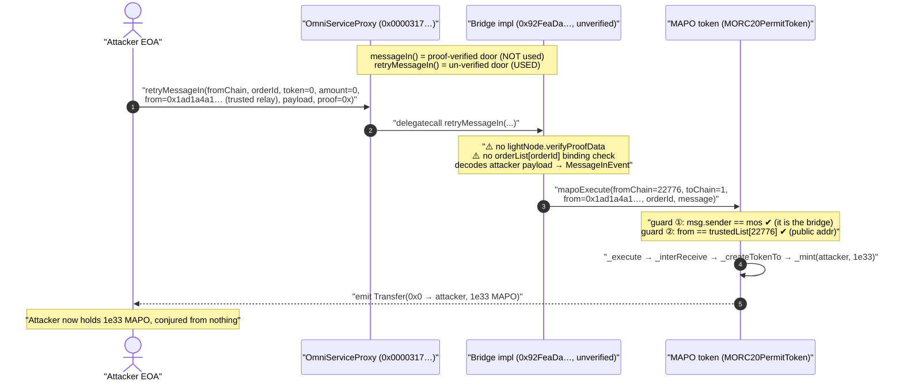
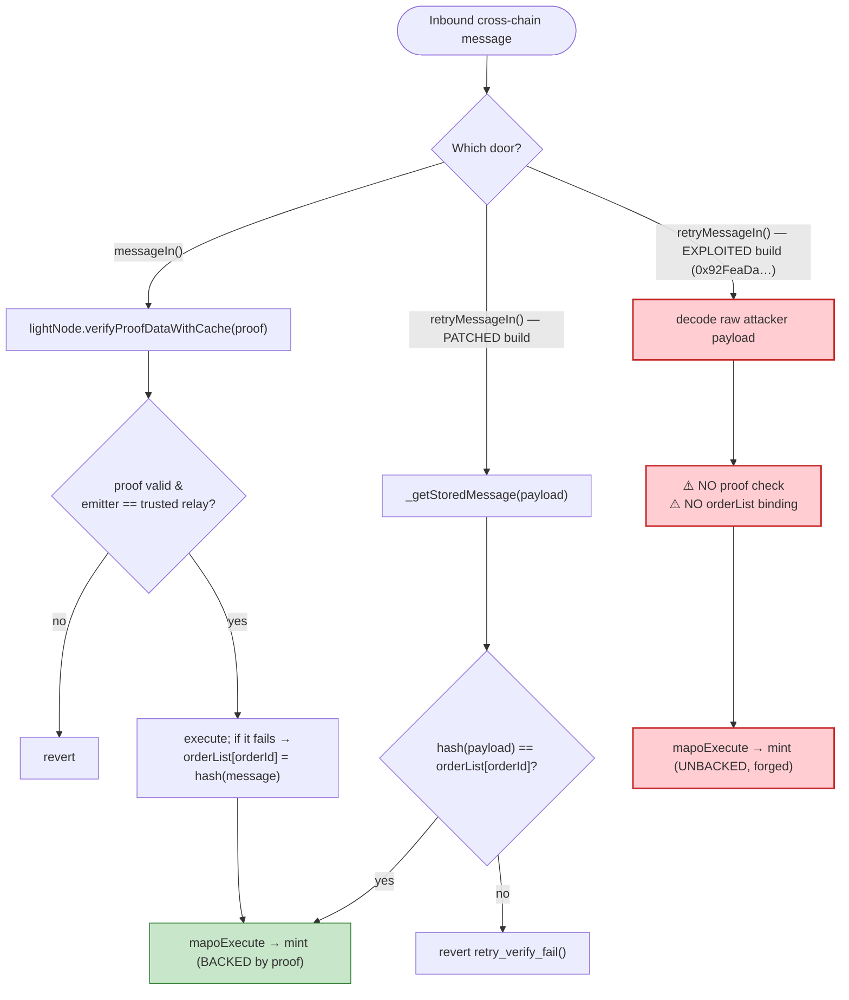
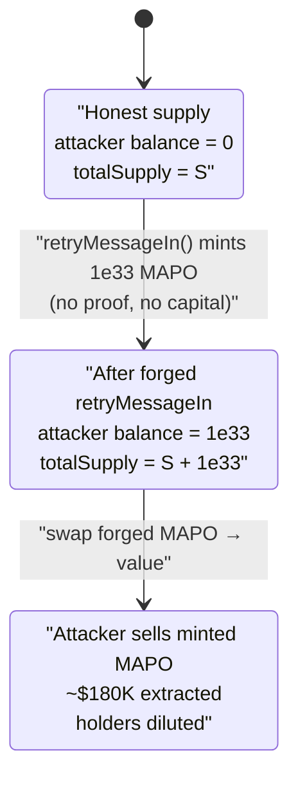

# MAP Protocol Exploit — Unverified `retryMessageIn` Forges a Cross-Chain Message to Mint 1e33 MAPO

> **Vulnerability classes:** vuln/bridge/missing-validation · vuln/bridge/replay · vuln/access-control/missing-auth

> **Reproduction:** the PoC compiles & runs in an isolated Foundry project at
> [this project folder](.) (the umbrella DeFiHackLabs repo contains many unrelated PoCs that
> do not all compile together, so this one was extracted).
> Full verbose trace: [output.txt](output.txt).
> The exploited bridge implementation (`0x92FeaDa…`) was **unverified** on Etherscan at the fork
> block; the analysis below uses the verified MAP Protocol bridge sources at the Etherscan-recorded
> implementation [`0x12bfb3b…`](sources/Bridge_12bfb3/contracts_Bridge.sol) (same `OmniService`/MOSV3
> codebase, but **patched** — see [Root cause](#root-cause--why-it-was-possible)) and the verified
> MAPO token [`MORC20PermitToken`](sources/MORC20PermitToken_66D79B/contracts_morc20_MORC20Token.sol).

---

## Key info

| | |
|---|---|
| **Loss** | ~$180K — **1,000,000,000,000,000 MAPO** (1e15 MAPO = `1e33` wei) minted out of thin air to the attacker |
| **Vulnerable contract** | MAP `OmniService`/MOSV3 bridge — proxy [`0x0000317Bec33Af037b5fAb2028f52d14658F6A56`](https://etherscan.io/address/0x0000317Bec33Af037b5fAb2028f52d14658F6A56#code), live impl at block `0x92FeaDa957bbeb17868F9F59Aed548e50191283D` (unverified) |
| **Victim token** | `MAPO` / `MORC20PermitToken` — [`0x66D79B8f60ec93Bfce0b56F5Ac14A2714E509a99`](https://etherscan.io/address/0x66D79B8f60ec93Bfce0b56F5Ac14A2714E509a99#code) |
| **Attacker EOA** | [`0x40592025392BD7d7463711c6E82Ed34241B64279`](https://etherscan.io/address/0x40592025392bd7d7463711c6e82ed34241b64279) |
| **Attacker contract** | [`0x2475396A308861559EF30dc46aad6136367a1C30`](https://etherscan.io/address/0x2475396a308861559ef30dc46aad6136367a1c30) |
| **Attack tx** | [`0x31e56b4737649e0acdb0ebb4eca44d16aeca25f60c022cbde85f092bde27664a`](https://etherscan.io/tx/0x31e56b4737649e0acdb0ebb4eca44d16aeca25f60c022cbde85f092bde27664a) |
| **Chain / block / date** | Ethereum mainnet / 25,137,571 / 2026-05-20 16:13:47 UTC |
| **Compiler** | bridge: Solidity v0.8.25 (optimizer, 200 runs); MAPO token: v0.8.20 |
| **Bug class** | Broken cross-chain message authentication — a "retry" path replays/forges an arbitrary, never-verified inbound message |
| **Post-mortem** | https://x.com/MapProtocol/status/2059587998409490510 |

---

## TL;DR

MAP Protocol's `OmniService` bridge (MOSV3) accepts inbound cross-chain messages through `messageIn(...)`,
which is gated by a **light-client proof** (`lightNode.verifyProofDataWithCache`). Messages that pass
verification but whose downstream execution *fails* are stored so they can be re-attempted later through a
separate `retryMessageIn(...)` entry point.

In the exploited implementation, `retryMessageIn` **did not bind the retried payload to any
previously-stored, previously-verified message.** It took the attacker's raw `_retryMessage` bytes,
decoded them straight into a `MessageInEvent`, and forwarded them to the internal executor
`_transferIn(...)` — which calls `mapoExecute(...)` on the destination contract. No light-client proof, no
"was this message ever stored?" check.

The destination contract here is the **MAPO token itself**. Its `mapoExecute` only checks that
(a) the caller is the trusted bridge (`mos`) and (b) the `fromAddress` equals the trusted relay address
for the claimed source chain. The attacker satisfied *both* simply by routing through the bridge and by
copying the publicly-known trusted relay address. The forged message decoded to an
`INTERCHAIN_TRANSFER` that **minted 1e33 MAPO directly to the attacker**.

One permissionless call → 1,000,000,000,000,000 MAPO created from nothing.

---

## Background — what MAP Protocol / `OmniService` does

MAP Protocol is a cross-chain interoperability layer. Its on-chain endpoint on each chain is the
`OmniService` bridge (interface `IMOSV3`), deployed behind an ERC-1967 proxy
([OmniServiceProxy.sol](sources/OmniServiceProxy_000031/contracts_OmniServiceProxy.sol)). The bridge:

- **Sends** messages with `transferOut` / `swapOutToken` (emits `MessageOut`, notifies the light client).
- **Receives** messages with `messageIn(chainId, logParam, orderId, receiptProof)`. This is the *only*
  trustworthy inbound path: it verifies a Merkle-Patricia receipt proof against the on-chain light node of
  the MAP **relay chain** (chainId `22776`), checks the emitting contract is the trusted relay MOS, decodes
  the relayed event into a `MessageInEvent`, and then dispatches it
  ([Bridge.sol:171-208](sources/Bridge_12bfb3/contracts_Bridge.sol#L171-L208)).
- **Retries** failed messages with `retryMessageIn(...)`. When a verified message's execution reverts (e.g.
  the receiver ran out of gas), `_storeMessageData` records a *commitment hash* of that message in
  `orderList[orderId]` so the user can re-attempt it later
  ([BridgeAbstract.sol:425-450](sources/Bridge_12bfb3/contracts_abstract_BridgeAbstract.sol#L425-L450)).

For an arbitrary-message receiver, `_transferIn` calls the destination's `mapoExecute`
([BridgeAbstract.sol:239-247](sources/Bridge_12bfb3/contracts_abstract_BridgeAbstract.sol#L239-L247)):

```solidity
try
    IMapoExecutor(to).mapoExecute{gas: gasLimit}(
        _inEvent.fromChain,
        _inEvent.toChain,
        _inEvent.from,
        _inEvent.orderId,
        _inEvent.swapData
    )
{ ... }
```

The MAPO token (`MORC20PermitToken`) is an omnichain ERC-20 that implements `mapoExecute`. On receiving a
verified `INTERCHAIN_TRANSFER` message it **mints** the bridged amount to the receiver
([MORC20Token.sol:42-57](sources/MORC20PermitToken_66D79B/contracts_morc20_MORC20Token.sol#L42-L57)):

```solidity
function _createTokenTo(address _receiverAddress, uint256, uint256 _fromAmount, uint256 _fromDecimals)
    internal virtual override returns (uint256 amount, uint256 decimals) {
    ...
    _mint(_receiverAddress, amount);   // ⚠️ supply created on the destination chain
    ...
}
```

So the entire economic safety of "minting MAPO on Ethereum" rests on **one** assumption: the bridge only
ever calls `mapoExecute` with messages it cryptographically proved originated on the relay chain.
`retryMessageIn` broke that assumption.

---

## The vulnerable code

### 1. The token side trusts the bridge unconditionally

`MapoExecutor.mapoExecute` ([MapoExecutor.sol:31-50](sources/MORC20PermitToken_66D79B/contracts_executor_MapoExecutor.sol#L31-L50)):

```solidity
function mapoExecute(
    uint256 _fromChain, uint256 _toChain,
    bytes calldata _fromAddress, bytes32 _orderId, bytes calldata _message
) external virtual override returns (bytes memory newMessage) {
    require(_msgSender() == address(mos), "MapoExecutor: invalid mos caller");      // ① caller must be the bridge

    bytes memory tempFromAddress = trustedList[_fromChain];
    require(
        _fromAddress.length == tempFromAddress.length &&
            tempFromAddress.length > 0 &&
            keccak256(_fromAddress) == keccak256(tempFromAddress),                  // ② from must equal trusted relay addr
        "MapoExecutor: invalid source chain address"
    );

    newMessage = _execute(_fromChain, _toChain, _fromAddress, _orderId, _message);
}
```

Both guards are **bridge-relative**, not proof-relative:

- **Guard ①** is satisfied because the call genuinely comes *through* the bridge proxy (`mos`). The bug is
  that the bridge itself fed in an unverified message.
- **Guard ②** compares `_fromAddress` to `trustedList[_fromChain]`. Verified on-chain at the fork block:
  `MAPO.getTrustedAddress(22776) == 0x1ad1a4a19bc9983a98f5d9ac8442c6dfc4276167` — exactly the
  `from` bytes the attacker supplied in the PoC (`hex"1ad1a4a1…4276167"`). This address is public, so it is
  no barrier.

`_execute` ([MORC20Core.sol:189-211](sources/MORC20PermitToken_66D79B/contracts_morc20_MORC20Core.sol#L189-L211))
then decodes the inner payload and runs `_interReceive → _createTokenTo → _mint`.

### 2. The bridge `retryMessageIn` — the un-trusted path

The **patched** version (verified at `0x12bfb3b…`) does bind the retry to a stored message
([Bridge.sol:210-229](sources/Bridge_12bfb3/contracts_Bridge.sol#L210-L229)):

```solidity
function retryMessageIn(
    uint256 _chainAndGas, bytes32 _orderId, address _token, uint256 _amount,
    bytes calldata _fromAddress, bytes calldata _payload, bytes calldata
) external override nonReentrant whenNotPaused {
    (, MessageInEvent memory outEvent) = _getStoredMessage(            // ← rebuilds + VERIFIES the message
        _chainAndGas, _orderId, _token, _amount, _fromAddress, _payload
    );
    _transferIn(outEvent, true, true);
}
```

and the binding check itself
([BridgeAbstract.sol:452-479](sources/Bridge_12bfb3/contracts_abstract_BridgeAbstract.sol#L452-L479)):

```solidity
function _getStoredMessage(...) internal returns (bytes memory initiator, MessageInEvent memory inEvent) {
    ...
    bytes32 retryHash = _getStoreMessageHash(initiator, inEvent);
    if (uint256(retryHash) != orderList[_orderId]) revert retry_verify_fail();   // ⚠️ THE check the exploited version lacked
    ...
    orderList[_orderId] = 0x01;   // consume the stored message
}
```

`orderList[_orderId]` is only set to a non-trivial commitment hash by `_storeMessageData`
([BridgeAbstract.sol:425-431](sources/Bridge_12bfb3/contracts_abstract_BridgeAbstract.sol#L425-L431)),
which runs **only after a `messageIn` light-client proof succeeds but its execution fails**. The exploited
implementation (`0x92FeaDa…`) skipped this `retryHash == orderList[orderId]` check (or never required a
prior store), so `retryMessageIn` accepted **any** `_payload` and forwarded it to `_transferIn`. The live
trace ([output.txt:1561-1571](output.txt#L1561)) shows precisely this: a `delegatecall` into `0x92FeaDa…`
goes straight to `MAPO::mapoExecute(...)` and emits `Transfer(0x0 → attacker, 1e33)` with **no
`verifyProofData` call anywhere in the trace.**

---

## Root cause — why it was possible

A cross-chain bridge must guarantee that *every* execution of a destination-side effect (here: minting
MAPO) is backed by a verified proof that the corresponding event happened on the source chain. MAP's
design split inbound handling into two doors:

| Door | Proof required? | Sets the mint in motion? |
|---|---|---|
| `messageIn` | **Yes** — `lightNode.verifyProofDataWithCache` + trusted-relay check | yes |
| `retryMessageIn` (exploited build) | **No** | yes |

`retryMessageIn` is supposed to be a *strictly weaker* operation than `messageIn`: it should only be able to
re-run something `messageIn` already verified and stored. The exploited build instead let `retryMessageIn`
**originate** an inbound message from raw caller-supplied bytes, with the same downstream power as a verified
one. The single missing line —

```solidity
if (uint256(retryHash) != orderList[_orderId]) revert retry_verify_fail();
```

— is what re-anchors retry to a previously-verified, previously-stored message. Without it:

1. **No proof.** The light node is never consulted on the retry path, so the "source chain event" is pure
   fiction supplied by the attacker.
2. **No store-binding.** `orderList[orderId]` is never compared, so the message need not have ever existed.
3. **Full minting authority.** The forged message reaches `mapoExecute`, whose only guards (caller = bridge,
   `from` = trusted relay) are automatically met by routing through the bridge with the public relay address.

The attacker therefore *forged an inbound message claiming "1e33 MAPO was bridged from the relay chain to me"*
and the bridge minted it. (MAP's post-mortem describes the same flaw: a retry/replay path that bypassed
message verification.)

---

## Preconditions

- The exploited bridge implementation exposes a `retryMessageIn` that does **not** verify the payload against
  a stored, proof-verified message (the core bug).
- The destination receiver mints on `INTERCHAIN_TRANSFER` (MAPO does). MAPO is registered to mint
  cross-chain, so `_createTokenTo` calls `_mint`.
- The attacker knows the public `trustedList[relayChain]` address on the MAPO token
  (`0x1ad1a4a1…4276167`) and the relay chainId (`22776`) — both readable on-chain.
- The bridge is not paused (`whenNotPaused`) and the orderId is unused.
- **No capital required.** The exploit mints from nothing; the only cost is gas. The PoC sends a single
  `retryMessageIn` call from the attacker EOA.

---

## Attack walkthrough (with on-chain values from the trace)

The PoC ([test/MAPProtocol_exp.sol](test/MAPProtocol_exp.sol)) builds two nested ABI blobs and makes one
call. The numbers below are taken directly from the trace in [output.txt](output.txt).

**Inner mint params** (decoded by MAPO's `_interReceive`):
`abi.encode( from=attacker, to=attacker, amount=1e33, decimals=18 )`.

**Outer `retryMessage` payload** (decoded by the bridge into a `MessageInEvent`):
`abi.encode( messageType=1, gasLimit=10_000, initiator/from = exploitContract×3, token = MAPO, swapData = abi.encode(MESSAGE_ROOT, mintParams) )`.

| # | Step | Concrete value from trace | Effect |
|---|------|---------------------------|--------|
| 0 | Read attacker MAPO balance | `MAPO.balanceOf(attacker) = 0` ([output.txt:1558](output.txt#L1558)) | baseline |
| 1 | Attacker EOA calls bridge proxy | `OmniServiceProxy.retryMessageIn(fromChain=0x1.429e62…, orderId=0xf2fb…d4a4, token=0, amount=0, from=0x1ad1a4a1…, payload=…, proof=0x)` ([output.txt:1560](output.txt#L1560)) | enters the un-trusted door |
| 2 | Proxy `delegatecall`s the live impl | `0x92FeaDa957…1283D::retryMessageIn(...) [delegatecall]` ([output.txt:1561](output.txt#L1561)) | runs unverified retry logic |
| 3 | Impl forwards forged message to executor | `MAPO::mapoExecute(fromChain=22776, toChain=1, from=0x1ad1a4a1…, orderId=0xf2fb…d4a4, message=…)` ([output.txt:1562](output.txt#L1562)) | guards ①/② pass (caller = bridge, from = trusted relay) |
| 4 | Token decodes `INTERCHAIN_TRANSFER`, mints | `emit Transfer(0x0 → attacker, 1e33)` and `emit InterReceive(amount = 1e33)` ([output.txt:1563-1564](output.txt#L1563)) | **1,000,000,000,000,000 MAPO created** |
| 5 | totalSupply storage bumps | slot `@7: …ac0c75…→…314dc6f0…` (totalSupply += 1e33) ([output.txt:1566](output.txt#L1566)) | supply inflated |
| 6 | Read attacker balance again | `MAPO.balanceOf(attacker) = 1e33` ([output.txt:1576](output.txt#L1576)) | `assertEq(minted, 1e33)` passes |

The decoded mint amount in the payload, `0x314dc6448d9338c15b0a00000000`, is exactly `1e33` — i.e.
`1_000_000_000_000_000 ether` (1e15 tokens at 18 decimals), matching the PoC's `MINTED_MAPO` constant and the
`Transfer`/`InterReceive` event values.

### Profit / loss accounting

| Item | Amount |
|---|---:|
| MAPO minted to attacker (out of nothing) | **1,000,000,000,000,000 MAPO** (`1e33` wei) |
| Capital spent by attacker | 0 (gas only) |
| MAPO supply inflation | +`1e33` wei (≈ +1e15 whole MAPO) |
| Reported USD loss (post-mortem) | **~$180,000** (the minted MAPO that was then dumped) |

The dollar figure reflects what the attacker realized by selling the forged MAPO into liquidity; the
*mechanical* harm proven on-chain is the unbacked mint of `1e33` MAPO. There is no per-tx fund outflow from
the bridge — the loss is dilution: every honest MAPO holder is diluted by the forged supply.

---

## Diagrams

### Sequence of the attack



### Inbound message authentication: intended vs. exploited



### MAPO supply state evolution



---

## Remediation

1. **Make retry strictly weaker than verified ingest.** `retryMessageIn` must re-anchor to a
   previously-verified, previously-stored message: recompute the commitment hash from the caller-supplied
   fields and require `keccak(...) == orderList[orderId]` (then consume it by setting
   `orderList[orderId] = 0x01`). This is exactly what the patched build's `_getStoredMessage` does
   ([BridgeAbstract.sol:452-479](sources/Bridge_12bfb3/contracts_abstract_BridgeAbstract.sol#L452-L479)).
   A retry must never be able to *originate* an inbound message.
2. **Only `messageIn` may create the `orderList` commitment.** Ensure `orderList[orderId]` is set to a
   real commitment hash *only* after a light-client proof succeeds (via `_storeMessageData`), and that
   `_checkOrder` prevents an orderId from being pre-seeded by any other path.
3. **Defense-in-depth on the token.** A mintable omnichain token should not treat "the bridge called me" as
   sufficient authority for unbounded minting. Consider per-message replay protection keyed on the proof, a
   mint rate/cap, or having the token independently consult the proof/commitment rather than trusting the
   bridge to have verified it.
4. **Treat all "admin/utility" entry points (`retry`, `redeem`, `recover`) as primary attack surface.**
   Every path that can reach `mapoExecute`/mint must carry the same verification burden as the main path;
   convenience functions are the classic place where that burden gets dropped.
5. **Invariant monitoring.** Alert on any mint not preceded by a verified `MessageRelay` proof, and on
   `totalSupply` jumps that exceed expected bridge inflows.

---

## How to reproduce

The PoC was extracted into a standalone Foundry project (the umbrella DeFiHackLabs repo has many unrelated
PoCs that do not build together under one `forge test`):

```bash
_shared/run_poc.sh 2026-05-MAPProtocol_exp -vvvvv
```

- RPC: an **Ethereum mainnet archive** endpoint is required (fork block 25,137,571).
  `foundry.toml` uses an Infura archive endpoint, which serves historical state at that block.
- Result: `[PASS] testExploit()` with `Stolen MAPO 1000000000000000000000000000000000`.

Expected tail:

```
Ran 1 test for test/MAPProtocol_exp.sol:MAPProtocolTest
[PASS] testExploit() (gas: 119171)
  Stolen MAPO 1000000000000000000000000000000000
Suite result: ok. 1 passed; 0 failed; 0 skipped
```

---

*Reference: MAP Protocol official post-mortem — https://x.com/MapProtocol/status/2059587998409490510*
