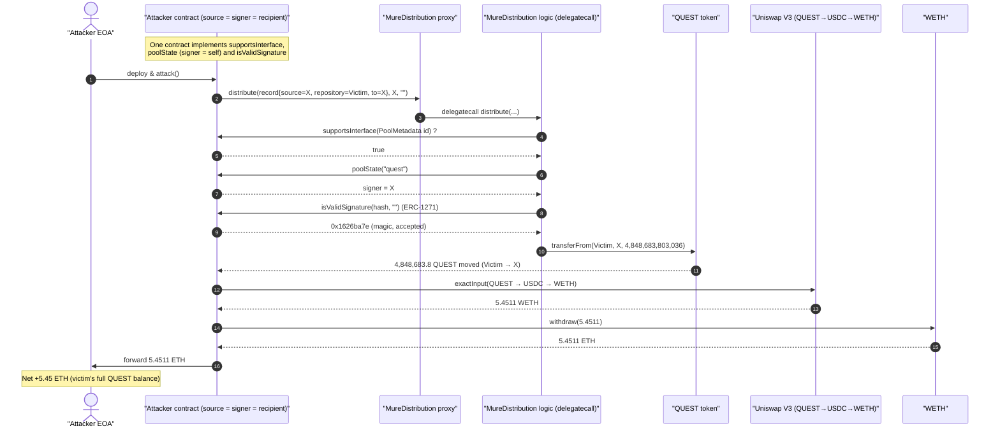
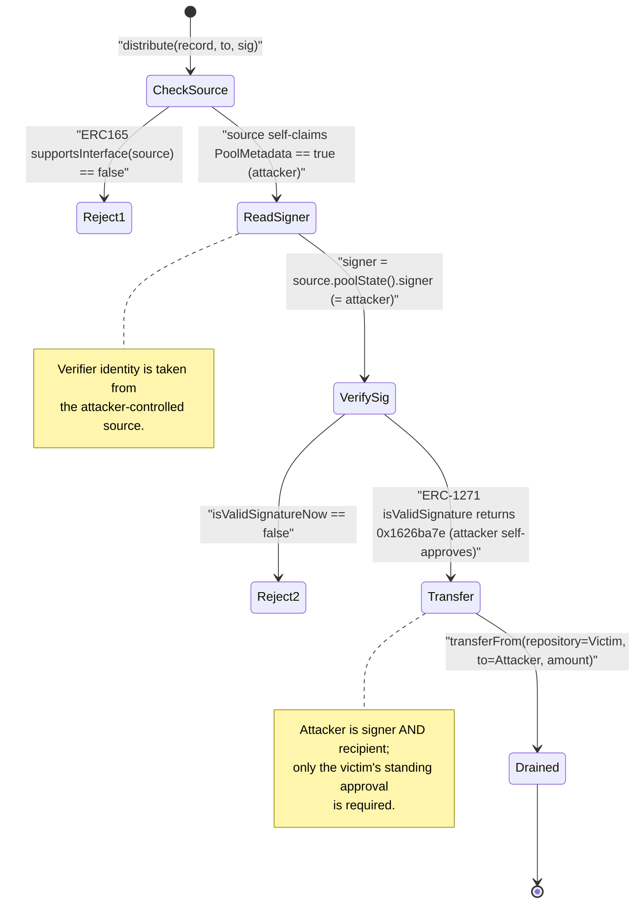
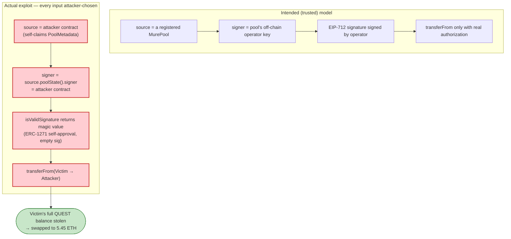

# Mure Distribution Exploit — Attacker-Controlled `source` Forges Both Verifier and Signature

> **Vulnerability classes:** vuln/access-control/missing-auth · vuln/auth/signature-validation · vuln/logic/missing-validation

> One-liner: `MureDistribution.distribute()` reads the signature verifier (`signer`) from a caller-supplied
> `source` contract and validates the signature against that same attacker-controlled contract via ERC-1271,
> so anyone can authorize a `transferFrom` out of any wallet that has approved the distributor.

> **Reproduction:** the PoC compiles & runs in an isolated Foundry project at
> [this project folder](.). Full verbose trace: [output.txt](output.txt).
> Verified vulnerable source: [src_MureDistribution.sol](sources/MureDistribution_Ec9C8e/src_MureDistribution.sol).

---

## Key info

| | |
|---|---|
| **Loss** | **~5.45 ETH** (≈ 4,848,683.8 QUEST drained from the victim, swapped to **5.4511 WETH**) |
| **Vulnerable contract** | `MureDistribution` (logic) — [`0xEc9C8e3B9CBE8888D9095dBC97B22c0Da6Cc4137`](https://etherscan.io/address/0xEc9C8e3B9CBE8888D9095dBC97B22c0Da6Cc4137#code), behind ERC1967 proxy [`0x365083717eFB17F3895290BA38f20F568C7A4D8a`](https://etherscan.io/address/0x365083717eFB17F3895290BA38f20F568C7A4D8a#code) |
| **Victim** | `0x29b0a315924E05aC0c898a63D96daA33CfD1cAc7` (had approved the distributor for QUEST) |
| **Stolen token** | `QUEST` (6 decimals) — [`0x1Fc122FE8b6Fa6b8598799baF687539b5D3B2783`](https://etherscan.io/address/0x1Fc122FE8b6Fa6b8598799baF687539b5D3B2783#code) |
| **Attacker EOA** | [`0x08096e9ae70D7C5F2707b203A7801b75d1412156`](https://etherscan.io/address/0x08096e9ae70d7c5f2707b203a7801b75d1412156) |
| **Attacker contract** | `0x2B896760f8ad2ecf58ef93bdf71aC5e85C2B7F63` (deploys the inner `MureSignerSource` at `0x26e5…cD467`) |
| **Attack tx** | [`0xb83040361a0ec72fa2d06ad69493226518a5f8b5d96c19b400626248f9c5b798`](https://etherscan.io/tx/0xb83040361a0ec72fa2d06ad69493226518a5f8b5d96c19b400626248f9c5b798) |
| **Chain / block / date** | Ethereum mainnet / 25,141,106 / May 2026 |
| **Compiler** | Solidity v0.8.22, optimizer **200 runs** |
| **Bug class** | Broken authorization — signature verifier sourced from attacker-controlled input + ERC-1271 self-attestation |

---

## TL;DR

`MureDistribution` is meant to let a user redeem a "distribution" of ERC-20 tokens that was authorized by a
trusted pool's signer. The flaw is that **nothing about the authorization is actually trusted**:

- The caller passes a `source` address inside the `DistributionRecord`. The contract only checks that `source`
  *claims* (via ERC-165) to implement the `PoolMetadata` interface — a check the attacker trivially passes by
  hard-coding `supportsInterface` to return `true`.
- The contract then calls `source.poolState(poolName)` to learn **who the signer is**. Because `source` is the
  attacker's own contract, it returns the **attacker's contract** as the `signer`.
- The signature is verified with `SignatureChecker.isValidSignatureNow(signer, …)`. Since `signer` is a contract,
  this becomes an **ERC-1271 `isValidSignature` call on the attacker's contract**, which simply returns the magic
  value `0x1626ba7e`.
- With "authorization" satisfied, `_transferAssets` executes
  `IERC20(token).transferFrom(repository, to, amount)` where `repository` = the **victim** and `to` = the
  **attacker**.

The only external precondition is that the victim has an outstanding ERC-20 approval to the distributor proxy.
The attacker built a single contract that *is simultaneously* the fake pool, the fake signer, and the recipient,
called `distribute(...)` once, and pulled the victim's full QUEST balance (4,848,683,803,036 base units), then
routed it QUEST → USDC → WETH on Uniswap V3 and unwrapped to **5.45 ETH**.

---

## Background — what MureDistribution does

`MureDistribution` ([src_MureDistribution.sol](sources/MureDistribution_Ec9C8e/src_MureDistribution.sol)) is an
upgradeable (UUPS / ERC-1967) distributor. The intended flow:

1. An off-chain operator computes a distribution for a depositor in some pool and produces an EIP-712 signature.
2. A user calls `distribute(distribution, to, signature)`.
3. The distributor looks up the pool's `signer` from the pool contract (`source.poolState(...)`),
   verifies the signature, then pulls `amount` of `token` from a `repository` to the recipient using a
   pre-existing ERC-20 allowance.

The `DistributionRecord` struct ([src_interfaces_Distributable.sol:5-13](sources/MureDistribution_Ec9C8e/src_interfaces_Distributable.sol#L5-L13)) is:

```solidity
struct DistributionRecord {
    address token;       // ERC-20 to move
    address source;      // pool-metadata contract (supplies the signer)
    address repository;  // wallet the tokens are pulled FROM  (the victim)
    address depositor;   // accounting key
    string  poolName;
    uint256 amount;
    uint256 deadline;
}
```

The `PoolState` returned by `source.poolState(...)`
([src_interfaces_PoolMetadata.sol:7-16](sources/MureDistribution_Ec9C8e/src_interfaces_PoolMetadata.sol#L7-L16)) ends
with an `address signer` field — and that is the value used to verify the signature.

> Note: the PoC's local interface names the fields `from`/`to`. These map onto the real struct as
> `from → repository` (tokens pulled from the victim) and the PoC's `to: address(this)` onto `depositor`,
> with the recipient being the explicit `to` parameter of the two-arg `distribute`. The trace confirms
> `transferFrom(Victim → attacker, 4,848,683,803,036)`.

---

## The vulnerable code

### 1. The `source` is only checked to *self-declare* an interface

```solidity
modifier distributable(DistributionRecord calldata distribution) {
    if (distribution.deadline < block.timestamp) {
        revert MureErrors.SignatureExpired();
    }
    if (!ERC165Checker.supportsInterface(distribution.source, type(PoolMetadata).interfaceId)) {
        revert UnsupportedSource();
    }
    _;
}
```
[src_MureDistribution.sol:60-68](sources/MureDistribution_Ec9C8e/src_MureDistribution.sol#L60-L68)

`distribution.source` is **fully caller-controlled**. `ERC165Checker.supportsInterface`
([ERC165Checker.sol:36-39](sources/MureDistribution_Ec9C8e/lib_openzeppelin-contracts_contracts_utils_introspection_ERC165Checker.sol#L36-L39))
just staticcalls `source.supportsInterface(...)`. The attacker's contract returns `true` for the ERC-165 probe
and for the `PoolMetadata` id (`0x10704b42`) and `false` for `0xffffffff` — exactly what the trace shows
([output.txt:1571-1576](output.txt#L1571)).

### 2. The signer is read FROM that same attacker-controlled `source`

```solidity
function _distribute(DistributionRecord calldata distribution, address to, bytes calldata signature)
    internal
    distributable(distribution)
    nonReentrant
{
    PoolMetadata source = PoolMetadata(distribution.source);
    PoolState memory poolState = source.poolState(distribution.poolName);

    _verifySignature(distribution, poolState.signer, to, signature);   // ⚠️ signer comes from attacker

    _transferAssets(distribution, to);
    ...
}
```
[src_MureDistribution.sol:162-182](sources/MureDistribution_Ec9C8e/src_MureDistribution.sol#L162-L182)

The verifier identity (`poolState.signer`) is whatever the attacker's `poolState()` returns. In the trace it
returns the attacker contract `0x26e5…cD467` as the signer
([output.txt:1577-1578](output.txt#L1577)).

### 3. Signature verification is an ERC-1271 call on the attacker

```solidity
function _verifySignature(DistributionRecord calldata distribution, address signer, address to, bytes calldata sig)
    private view
{
    if (!SignatureChecker.isValidSignatureNow(signer, _hashDistribution(distribution, to), sig)) {
        revert MureErrors.Unauthorized();
    }
}
```
[src_MureDistribution.sol:226-233](sources/MureDistribution_Ec9C8e/src_MureDistribution.sol#L226-L233)

With an empty `sig`, `ECDSA.tryRecover` fails, so `SignatureChecker` falls through to the ERC-1271 path
([SignatureChecker.sol:22-47](sources/MureDistribution_Ec9C8e/lib_openzeppelin-contracts_contracts_utils_cryptography_SignatureChecker.sol#L22-L47)),
staticcalling `signer.isValidSignature(hash, "")`. The attacker's `signer` (itself) returns the magic value
`0x1626ba7e` → check passes ([output.txt:1579-1580](output.txt#L1579)).

### 4. The unconditional asset transfer

```solidity
function _transferAssets(DistributionRecord calldata distribution, address to) internal {
    MureDistributionStorage storage $ = _getDistributionStorage();
    bytes32 distributionKey =
        _encodeDistributionKey(distribution.source, distribution.poolName, distribution.depositor);

    ++$.nonces[distribution.depositor];
    $.distributions[distributionKey].distributed += distribution.amount;

    IERC20(distribution.token).transferFrom(distribution.repository, to, distribution.amount); // ⚠️ victim → attacker
}
```
[src_MureDistribution.sol:207-216](sources/MureDistribution_Ec9C8e/src_MureDistribution.sol#L207-L216)

`repository` (the victim) and `to` (the attacker) and `amount` are all attacker-chosen, gated only by the
forged authorization above and by the victim's standing ERC-20 allowance to the distributor.

---

## Root cause — why it was possible

The distributor's entire trust model collapses into one mistake: **the signer used to authorize a transfer is
discovered from caller-supplied data, then asked to attest to itself.**

A correct design must anchor the verifier to something the protocol *already trusts*:
the pool/source contract must be looked up from a protocol-controlled registry (or `source` must be
role/permission-gated), and the signer must be an address whose authority is independently established. Here:

1. **`source` is unauthenticated.** The only gate is `ERC165Checker.supportsInterface`, which is a *self-claim*,
   not a proof of identity or registration. Any contract can answer `true`.
2. **The verifier is sourced from the thing being verified.** `poolState().signer` and the address whose
   `isValidSignature` is checked are the **same attacker contract**. ERC-1271 lets a contract approve any hash,
   so a signer the attacker controls authorizes anything.
3. **No binding to a registered pool/operator.** Contrast with `moveDistribution`, which at least uses the
   `validManager` modifier ([src_MureDistribution.sol:70-79](sources/MureDistribution_Ec9C8e/src_MureDistribution.sol#L70-L79))
   to require `POOL_OPERATOR_ROLE` on `source`. The `distribute` path has **no** equivalent — it never checks
   that `source` is a sanctioned pool nor that `signer` is a sanctioned operator.
4. **The pull target is also attacker-chosen.** `repository` is taken verbatim from the struct, so the attacker
   simply names a wallet that has an outstanding approval to the distributor and drains it.

In short: an attacker who builds one contract implementing `supportsInterface`, `poolState`, and
`isValidSignature` becomes simultaneously the *pool*, the *signer*, and the *recipient*, and the distributor
happily moves any approving user's tokens to them.

---

## Preconditions

- The victim (`repository`) has a **non-zero ERC-20 allowance** to the distributor proxy
  `0x3650…4D8a` for the target token (QUEST). This is the only external dependency; the trace's
  `transferFrom(Victim → attacker, 4,848,683,803,036)` succeeds, confirming the approval existed
  ([output.txt:1581-1587](output.txt#L1581)).
- `deadline >= block.timestamp` — trivially satisfied by the attacker (`deadline = block.timestamp + 1`).
- No special capital required: the attack is a single self-funded call; the only "cost" is gas. The attacker
  started with 0 ETH (`vm.deal(ATTACKER, 0)`) and ended with **+5.45 ETH**.

---

## Attack walkthrough (with on-chain numbers from the trace)

All figures are taken directly from [output.txt](output.txt). QUEST has 6 decimals; USDC has 6 decimals;
WETH/ETH have 18.

| # | Step | Call | Concrete numbers |
|---|------|------|------------------|
| 0 | **Victim balance pre-attack** | `QUEST.balanceOf(victim)` | 4,848,683,803,036 (≈ 4,848,683.8 QUEST) ([:1561-1562](output.txt#L1561)) |
| 1 | **Deploy attacker stack** | `new MureDistributionExploit` → `new MureSignerSource` | attacker contract `0x2B89…7F63`, inner source/signer `0x26e5…cD467` ([:1565-1567](output.txt#L1565)) |
| 2 | **Forge authorization & drain** | `distribute(record, to=self, sig="")` on proxy → delegatecall to logic | ERC-165 probe ✓, `poolState` returns `signer = self`, ERC-1271 ✓ ([:1569-1580](output.txt#L1569)) |
| 3 | **Pull victim's QUEST** | `QUEST.transferFrom(victim → 0x26e5…, 4,848,683,803,036)` | victim QUEST: 4,848,683,803,036 → **0**; allowance slot decremented ([:1581-1587](output.txt#L1581)) |
| 4 | **Approve router** | `QUEST.approve(UniV3Router, type(uint256).max)` | unlimited approval ([:1598-1602](output.txt#L1598)) |
| 5 | **Swap QUEST → USDC** | UniV3 QUEST/USDC 1% pool `0x31A4…ecF2` | in 4,848,683,803,036 QUEST → out **11,702,884,506** USDC (≈ 11,702.88 USDC) ([:1606-1633](output.txt#L1606)) |
| 6 | **Swap USDC → WETH** | UniV3 USDC/WETH 0.05% pool `0x88e6…5640` | in 11,702,884,506 USDC → out **5,451,073,450,641,245,522** WETH (5.4511 WETH) ([:1634-1665](output.txt#L1634)) |
| 7 | **Unwrap WETH** | `WETH.withdraw(5,451,073,450,641,245,522)` | 5.4511 WETH → 5.4511 ETH ([:1666-1672](output.txt#L1666)) |
| 8 | **Forward to attacker EOA** | `source → attacker contract → attacker EOA` | EOA receives 5,451,073,450,641,245,522 wei ([:1673-1677](output.txt#L1673)) |
| 9 | **Verify** | `QUEST.balanceOf(victim) == 0`; profit > 5 ETH | drain = 4,848,683,803,036; profit = 5,451,073,450,641,245,522 ([:1679-1688](output.txt#L1679)) |

The Uniswap V3 multi-hop is encoded as a single `exactInput` with path
`QUEST -(fee 10000)-> USDC -(fee 500)-> WETH`, which the trace shows executing as two nested pool `swap`s.

### Profit / loss accounting

| Party | Asset | Before | After | Delta |
|---|---|---:|---:|---:|
| Victim | QUEST | 4,848,683,803,036 | 0 | **−4,848,683,803,036** (≈ −4,848,683.8 QUEST) |
| Attacker EOA | ETH | 0 | 5,451,073,450,641,245,522 | **+5.4511 ETH** |

The attacker's ETH gain is the market value of the victim's entire QUEST balance after routing through Uniswap
V3 (QUEST → USDC → WETH), i.e. the realized proceeds of selling the stolen tokens.

---

## Diagrams

### Sequence of the attack



### Authorization state evolution (how the forged trust is built)



### Why it is theft — trusted vs. attacker-supplied inputs



---

## Remediation

1. **Authenticate `source` against a protocol-controlled registry.** Do not trust an `ERC165Checker`
   self-declaration as identity. The `distribute` path must require that `source` is a pool the protocol itself
   deployed/registered (e.g., created via a factory whose addresses are recorded on-chain), mirroring the
   `validManager` / `POOL_OPERATOR_ROLE` check already used by `moveDistribution`.
2. **Never derive the verifier from caller-supplied data.** The address whose signature authorizes a transfer
   must come from trusted storage (a registry of operator keys), not from `source.poolState().signer` where
   `source` is unauthenticated input.
3. **Bind the recipient/`repository` to authorization.** A transfer should only be possible from `repository` if
   `repository` itself (or a sanctioned operator on its behalf) signed the specific distribution — i.e., the
   EIP-712 payload and verifying key must be tied to the wallet whose tokens are being moved.
4. **Treat ERC-1271 signers with care.** ERC-1271 lets a contract approve any hash; combining it with an
   attacker-chosen signer is fatal. If contract signers are supported, the signer set must be an allow-list.
5. **Defense in depth for users/integrators.** The exploit only worked because the victim had an outstanding
   approval to the distributor. Use minimal / just-in-time approvals (or `permit`-style scoped allowances) so a
   compromised distributor cannot drain a full balance.

---

## How to reproduce

The PoC was extracted into a standalone Foundry project:

```bash
_shared/run_poc.sh 2026-05-MureDistribution_exp -vvvvv
```

- RPC: an **Ethereum mainnet archive** endpoint is required (fork block 25,141,106). `foundry.toml` uses the
  pre-configured Infura archive endpoint, which serves historical state at that block.
- Result: `[PASS] testExploit()` draining 4,848,683,803,036 QUEST for **5.45 ETH** profit.

Expected tail:

```
Ran 1 test for test/MureDistribution_exp.sol:MureDistributionTest
[PASS] testExploit() (gas: 1333448)
  Stolen QUEST 4848683803036
  Profit ETH 5451073450641245522
Suite result: ok. 1 passed; 0 failed; 0 skipped
```

---

*Source files: vulnerable logic [src_MureDistribution.sol](sources/MureDistribution_Ec9C8e/src_MureDistribution.sol);
proxy [ERC1967Proxy](sources/ERC1967Proxy_365083/); token [Quest](sources/Quest_1Fc122/contracts_Quest.sol).
PoC: [test/MureDistribution_exp.sol](test/MureDistribution_exp.sol). Reference: @DefimonAlerts.*
