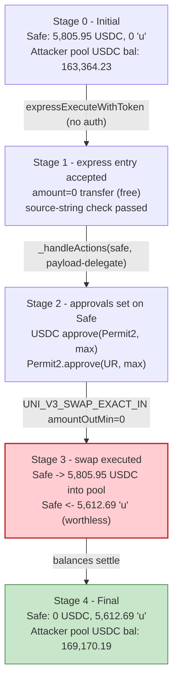
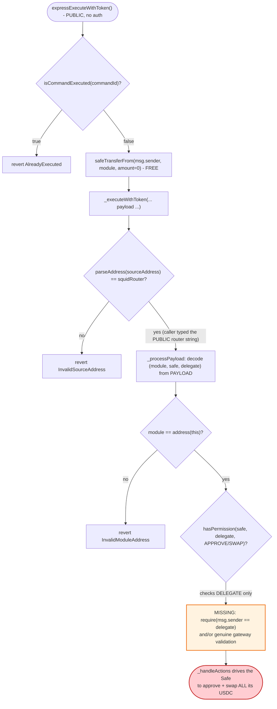

# New Market Trading Exploit — Payload-Forgery Drain via Axelar "Express" Path on a Gnosis Safe Module

> **Vulnerability classes:** vuln/access-control/missing-auth · vuln/bridge/message-spoofing · vuln/logic/missing-check

> **Reproduction:** the PoC compiles & runs in an isolated Foundry project at
> [this project folder](.) (the umbrella DeFiHackLabs repo
> contains several unrelated PoCs that do not compile together, so this one was extracted).
> Full verbose trace: [output.txt](output.txt).
> Verified vulnerable source: [contracts_modules_SquidRouterModule.sol](sources/SquidRouterModule_1f1d37/contracts_modules_SquidRouterModule.sol).

---

## Key info

| | |
|---|---|
| **Loss** | ~$3.98M total across **88 Gnosis Safes** on Ethereum / Base / Arbitrum. This PoC drains one Ethereum victim Safe: **5,805.95 USDC** (≈$5,806). |
| **Vulnerable contract** | `SquidRouterModule` (NMT Safe module) — [`0x1f1d37a3Bf840e35c6a860c7C2dA71Fe555123ca`](https://etherscan.io/address/0x1f1d37a3Bf840e35c6a860c7C2dA71Fe555123ca#code) (verified) |
| **Victim** | Gnosis Safe `0xa081B9F72d586624F2eaA1eaCf53C1A268810e4E` (this PoC's target; 88 Safes affected in total) |
| **Attacker EOA** | `0x7c82cB4b2909C50C7c0F2B696Eee7565e0a23BB8` (main operator), `0x9BDC730183821b6bb2B51BE30B77C964FA645b91` (co-operator, sent this tx) |
| **Attacker contract** | `0xe1d5FCfBba4d46F4937de369De415dD7E2D3265a` (Ethereum wrapper) |
| **Attacker-owned sink** | UniV3 USDC/"u" pool `0x151e90060D1c4d768f30db39b270F47df8A1fd94`; worthless "u" token `0xe6Ff0FE017D09D690493deC0F0f55E8f9Cdc3512` |
| **Attack tx** | `0x59d17fd31e31959b2d562508bf91c4fc1271682ba7d61a6209865e1151b69aea` |
| **Chain / block / date** | Ethereum / 25,170,513 / May 25, 2026 |
| **Compiler** | Solidity v0.8.30, optimizer (200 runs); requires **Cancun** EVM (Uniswap UniversalRouter uses EIP-1153 transient storage) |
| **Bug class** | Missing authentication / payload forgery — caller-supplied trust data on an unauthenticated Axelar "express" entry point |

---

## TL;DR

`SquidRouterModule` is a **Gnosis Safe module** that lets a Squid/Axelar cross-chain message drive
swap/approve actions on a Safe that has installed the module. It inherits Axelar's
`AxelarExpressExecutableWithToken`, which exposes a **permissionless** "express" fast path,
`expressExecuteWithToken(...)`
([AxelarExpressExecutableWithToken.sol:111-148](sources/SquidRouterModule_1f1d37/axelar-network_axelar-gmp-sdk-solidity_contracts_express_AxelarExpressExecutableWithToken.sol#L111-L148)).
The express path is meant for off-chain relayers to *front* the bridged tokens and be reimbursed
later once the real cross-chain message clears the Axelar gateway — so it deliberately performs
**no gateway / cryptographic validation** of the message.

The module's override of `_executeWithToken`
([SquidRouterModule.sol:142-157](sources/SquidRouterModule_1f1d37/contracts_modules_SquidRouterModule.sol#L142-L157))
"authenticates" the source only by parsing a **caller-supplied `sourceAddress` string** and comparing
it to the public `squidRouter` address. It then decodes the **`safe` and `delegate` straight out of the
caller-supplied `payload`** and executes the requested actions — checking only that `delegate` holds a
permission on `safe`, **never that `msg.sender == delegate`**
([SquidRouterModule.sol:159-193](sources/SquidRouterModule_1f1d37/contracts_modules_SquidRouterModule.sol#L159-L193),
[BaseModule.sol:133-149](sources/SquidRouterModule_1f1d37/contracts_modules_BaseModule.sol#L133-L149)).

So **anyone** can call `expressExecuteWithToken` with:

1. **`amount = 0`** → the relayer-fronting `safeTransferFrom(attacker, module, 0)` costs nothing.
2. **`sourceAddress` = the public Squid router address string** → passes the only "source" check.
3. **`payload` = `(module, victimSafe, realDelegate, actions)`** where `realDelegate` is a genuine,
   public NMT delegate (`0x0f7aAa84...`) that already holds `APPROVE` + `SWAP` permission on the Safe,
   and the actions are: `ERC20_APPROVE` (USDC→Permit2), `PERMIT2_APPROVE` (USDC→UniversalRouter),
   and `UNI_V3_SWAP_EXACT_IN` (USDC → worthless "u", `amountOutMin = 0`).

The module dutifully drives the victim Safe to approve and swap its **entire** USDC balance into the
**attacker-owned** Uniswap-V3 pool with zero slippage protection. In this PoC the Safe's
**5,805.95 USDC** is swapped for **5,612.69 worthless "u" tokens** — a 100% loss — with the attacker
fronting nothing and producing no genuine cross-chain message.

---

## Background — what the protocol does

New Market Trading (NMT) is a managed-trading product built on **Gnosis Safe modules**. A user's Safe
installs the `SquidRouterModule`; a set of NMT "delegates" are granted scoped permissions
(`APPROVE`, `SWAP`, `BRIDGE_DEPOSIT`, `WRAP`, …) on that Safe via a `PermissionsManager`. The module
then performs DeFi actions on behalf of the Safe in two ways:

- **Same-chain**, via `executeSameChainActions(safe, params)`
  ([SquidRouterModule.sol:51-56](sources/SquidRouterModule_1f1d37/contracts_modules_SquidRouterModule.sol#L51-L56)),
  where the delegate identity is **derived from `msg.sender`** (`_getDelegate()`,
  [BaseModule.sol:144-149](sources/SquidRouterModule_1f1d37/contracts_modules_BaseModule.sol#L144-L149)).
- **Cross-chain**, by inheriting Axelar's `AxelarExpressExecutableWithToken`. A Squid/Axelar bridge
  message lands in `executeWithToken`/`_executeWithToken`, which is supposed to be gated by the Axelar
  gateway, and the module then runs the bundled actions against the Safe.

The permission set used by this exploit (string constants from
[Permissions.sol](sources/SquidRouterModule_1f1d37/contracts_libs_Permissions.sol#L1-L16)):
`APPROVE = "APPROVE"`, `SWAP = "SWAP"`. The supported action bundle types are the
`ExecuteActionType` enum (UNI_V2/V3 swaps, ERC20_APPROVE, PERMIT2_APPROVE, NATIVE_WRAP/UNWRAP).

On-chain immutables at the fork block (from the trace):

| Parameter | Value |
|---|---|
| `squidRouter` (immutable) | `0xce16F69375520ab01377ce7B88f5BA8C48F8D666` |
| `permit2` (immutable) | `0x000000000022D473030F116dDEE9F6B43aC78BA3` |
| Whitelisted UniversalRouter | `0x66a9893cC07D91D95644AEDD05D03f95e1dBA8Af` (`isUniversalRouter == true`) |
| Axelar gateway proxy / impl | `0x4F4495243837681061C4743b74B3eEdf548D56A5` / `0x99B5FA03a5ea4315725c43346e55a6A6fbd94098` |
| `tokenAddresses("WETH")` | `0xC02aaA39b223FE8D0A0e5C4F27eAD9083C756Cc2` (real WETH) |
| Victim Safe USDC balance | **5,805,953,651** (= 5,805.95 USDC) |
| Delegate `0x0f7aAa84...` `hasPermission(APPROVE)` / `(SWAP)` on Safe | **true** / **true** |

---

## The vulnerable code

### 1. The permissionless Axelar "express" entry point (inherited, unauthenticated)

```solidity
// AxelarExpressExecutableWithToken.sol
function expressExecuteWithToken(
    bytes32 commandId,
    string calldata sourceChain,
    string calldata sourceAddress,
    bytes calldata payload,
    string calldata symbol,
    uint256 amount
) external payable virtual {                                   // ← ANYONE can call
    if (gatewayWithToken().isCommandExecuted(commandId)) revert AlreadyExecuted(); // only a replay guard

    address expressExecutor = msg.sender;
    address gatewayToken = gatewayWithToken().tokenAddresses(symbol);
    ...
    IERC20(gatewayToken).safeTransferFrom(expressExecutor, address(this), amount); // amount = 0 ⇒ free
    _executeWithToken(commandId, sourceChain, sourceAddress, payload, symbol, amount); // NO gateway validation
}
```
([AxelarExpressExecutableWithToken.sol:111-148](sources/SquidRouterModule_1f1d37/axelar-network_axelar-gmp-sdk-solidity_contracts_express_AxelarExpressExecutableWithToken.sol#L111-L148))

Compare the *authenticated* path `executeWithToken` (lines 45-91 of the same file) which **does** call
`gatewayWithToken().validateContractCallAndMint(...)` and reverts with `NotApprovedByGateway()`. The
express path is the intended relayer fast-lane: it skips validation by design, on the assumption that a
relayer who fronts real tokens is later reimbursed only if the message turns out to be valid. The bug
is that the NMT module turns this fast-lane into a fully-authorized command channel.

### 2. The module's "authentication" trusts caller-supplied strings & payload

```solidity
// SquidRouterModule.sol
function _executeWithToken(
    bytes32, string calldata, string calldata sourceAddress,
    bytes calldata payload, string calldata tokenSymbol, uint256 amount
) internal override {
    address srcAddress = Strings.parseAddress(sourceAddress);
    require(srcAddress == squidRouter, InvalidSourceAddress(srcAddress)); // ← compares a STRING the caller passed
    IERC20 token = IERC20(_getTokenAddress(tokenSymbol));
    _processPayload(token, amount, payload);
}

function _processPayload(IERC20 bridgedToken, uint256 bridgedTokenAmount, bytes calldata payload) internal {
    (address module, address safe, address delegate, ActionsExecutionParams memory params) =
        abi.decode(payload, (address, address, address, ActionsExecutionParams)); // ← safe & delegate from payload
    require(module == address(this), InvalidModuleAddress(module));
    bridgedToken.safeTransfer(safe, bridgedTokenAmount);   // sends `amount` (0) to the safe
    _handleActions(safe, delegate, params);                // ← executes attacker's actions
}
```
([SquidRouterModule.sol:142-175](sources/SquidRouterModule_1f1d37/contracts_modules_SquidRouterModule.sol#L142-L175))

### 3. The permission check validates the *delegate*, never the *caller*

```solidity
// BaseModule.sol
function _checkPermission(address safe, address delegate, string memory permissionName) internal view virtual {
    require(
        permissionsManager.hasPermission(safe, delegate, _getPermissionEntry(permissionName)),
        PermissionDenied(safe, delegate, permissionName)
    );   // ← asks "does `delegate` have permission?" — `msg.sender` is never compared to `delegate`
}
```
([BaseModule.sol:133-142](sources/SquidRouterModule_1f1d37/contracts_modules_BaseModule.sol#L133-L142))

Each action handler calls `_checkPermission(safe, delegate, …)` with the **payload-supplied** `delegate`
(e.g. `_handleUniV3SwapExactIn`,
[SquidRouterModule.sol:221-252](sources/SquidRouterModule_1f1d37/contracts_modules_SquidRouterModule.sol#L221-L252)).
Because the attacker names a *real* delegate that genuinely holds `APPROVE`+`SWAP`, every check returns
`true`. The Safe then executes the action via `execTransactionFromModule`
([BaseModule.sol:82-102](sources/SquidRouterModule_1f1d37/contracts_modules_BaseModule.sol#L82-L102)).

---

## Root cause — why it was possible

`_getDelegate()` ties the delegate to `msg.sender` **only** in the same-chain path
([BaseModule.sol:144-149](sources/SquidRouterModule_1f1d37/contracts_modules_BaseModule.sol#L144-L149)).
On the cross-chain path the module relies on the Axelar gateway to authenticate that the message truly
came from `squidRouter` on a real source chain. But by exposing the **express** path, the module accepts
a message that has had **zero gateway validation**, while still deriving every trust input
(`sourceAddress`, `safe`, `delegate`) from caller-controlled calldata.

Concretely, three composing flaws:

1. **An unauthenticated entry that grants full authority.** `expressExecuteWithToken` is
   `external payable virtual` with no `onlyRelayer`/`onlyGateway` guard, yet it reaches the same
   `_executeWithToken` → `_processPayload` → `_handleActions` pipeline as a validated bridge message. The
   express path was meant to *front tokens*, not to *issue authenticated commands*.

2. **String-compared "source address" is not authentication.** `require(parseAddress(sourceAddress) == squidRouter)`
   verifies nothing about the caller — the Squid router address is public, and the attacker simply types
   it in. There is no signature, no gateway approval, no `msg.sender` linkage.

3. **The permission model checks the wrong principal.** `_checkPermission` answers "does this *delegate*
   hold permission on this Safe?" The missing invariant is `msg.sender == delegate` (or genuine gateway
   validation). Since real delegate addresses and their permissions are public on-chain, the attacker
   borrows a legitimate delegate's authority without controlling its key.

The single missing line is, on the express/bridge path:
`require(msg.sender == delegate)` (and/or refusing to treat un-validated express messages as authorized
commands at all). With `amount = 0` the relayer-fronting transfer is free, so there is **no capital cost,
no flash loan, and no genuine cross-chain message** — the attacker just hands the module a fully-formed,
self-authorizing command.

---

## Preconditions

- The victim Safe has **installed `SquidRouterModule`** and granted a public NMT **delegate** the
  `APPROVE` and `SWAP` permissions (true for all 88 affected Safes; delegate `0x0f7aAa84...` here).
- The Safe holds a **liquid ERC20** (USDC here — 5,805.95 USDC at the fork block).
- A **whitelisted UniversalRouter** exists (`isUniversalRouter == true`) so the swap action routes.
- The attacker controls a **Uniswap-V3 pool** for `USDC → worthless token` (pool `0x151e90...`,
  token `0xe6Ff0FE...`) so the zero-`amountOutMin` swap dumps the USDC where the attacker can keep it.
  *Note:* the attacker's "u" token has an `only-tx.origin` guard protecting its poisoned pool from third
  parties — that guard lives in the **attacker's** token, not in the module, which is why the PoC pranks
  `tx.origin = ATTACKER`. The module itself never inspects `msg.sender` or `tx.origin`.
- A **fresh `commandId`** (so `isCommandExecuted == false`); any unused 32-byte value works.

No funds are fronted (`amount = 0`), no flash loan, no gateway message.

---

## Attack walkthrough (with on-chain numbers from the trace)

All figures below come directly from [output.txt](output.txt). USDC has 6 decimals; the "u" token has 18.

| # | Step | Call | Concrete numbers |
|---|------|------|------------------|
| 0 | **Read victim balance** | `USDC.balanceOf(Safe)` | **5,805,953,651** raw = **5,805.95 USDC** ([:48-51](output.txt#L48)) |
| 1 | **Call express entry** (as attacker EOA, `amount = 0`, symbol `"WETH"`) | `MODULE.expressExecuteWithToken(commandId, "", "0xce16F6…D666", payload, "WETH", 0)` | `isCommandExecuted` → `false`; `tokenAddresses("WETH")` → WETH ([:62-70](output.txt#L62)) |
| 2 | **Free fronting transfer** | `WETH.transferFrom(attacker, module, 0)` | value **0** — costs nothing ([:76-78](output.txt#L76)) |
| 3 | **Source-string check passes** + payload decoded | `_executeWithToken` / `_processPayload` | `srcAddress == squidRouter` ✓; `module == address(this)` ✓; `WETH.transfer(Safe, 0)` ([:83-85](output.txt#L83)) |
| 4 | **Action 0 — ERC20_APPROVE** USDC→Permit2 | `hasPermission(Safe, delegate, APPROVE)` → true; Safe `approve(Permit2, max)` | approve `0x0000…22D4` → `2^256-1` ([:86-109](output.txt#L86)) |
| 5 | **Action 1 — PERMIT2_APPROVE** USDC→UniversalRouter | Safe `Permit2.approve(USDC, UR, type(uint160).max, uint48.max)` | spender = UniversalRouter `0x66a9…8Af` ([:113-122](output.txt#L113)) |
| 6 | **Action 2 — UNI_V3_SWAP_EXACT_IN** dump entire USDC | `hasPermission(Safe, delegate, SWAP)` → true; Safe → `UniversalRouter.execute(V3_SWAP_EXACT_IN)` | amountIn = **5,805,953,651** USDC, `amountOutMin = 0`, path = USDC `0x0001f4` "u" ([:124-128](output.txt#L124)) |
| 7 | **Pool swap executes** in attacker pool `0x151e90…` | `pool.swap(...)`; `u.transfer(Safe, …)`; `Permit2.transferFrom(Safe → pool, 5,805,953,651 USDC)` | Safe receives **5,612,693,391,509,875,140,579** = **5,612.69 "u"** ([:129-162](output.txt#L129)) |
| 8 | **Final balances** | `USDC.balanceOf(Safe)` = **0**; `u.balanceOf(Safe)` = 5,612.69 | USDC drained: **5,805.95 USDC** ([:171-183](output.txt#L171)) |

Pool `0x151e90...` USDC balance went **163,364.23 → 169,170.19 USDC** (`+5,805.95`), confirming the
Safe's USDC landed in the attacker-controlled pool ([:138, :155](output.txt#L138)).

### Profit / loss accounting

| Item | Amount |
|---|---:|
| Victim Safe USDC **before** | 5,805.95 USDC |
| Victim Safe USDC **after** | 0 USDC |
| **USDC drained from Safe** | **5,805.95 USDC** |
| "u" tokens deposited to Safe (worthless) | 5,612.69 "u" (≈ $0) |
| Attacker capital fronted | **0** (no funds, no flash loan, no gateway message) |
| **Net attacker gain (this Safe)** | **≈ 5,806 USD** (USDC pooled in attacker-owned LP) |
| **Total campaign loss** | **~$3.98M across 88 Safes** (Ethereum / Base / Arbitrum) |

---

## Diagrams

### Sequence of the attack

```mermaid
sequenceDiagram
    autonumber
    actor A as "Attacker EOA"
    participant M as "SquidRouterModule"
    participant G as "Axelar Gateway"
    participant PM as "PermissionsManager"
    participant S as "Victim Gnosis Safe"
    participant P2 as "Permit2"
    participant UR as "UniversalRouter"
    participant Pool as "Attacker USDC/u V3 pool"

    Note over A,M: amount = 0, sourceAddress = public Squid router string, payload = (module, victimSafe, realDelegate, actions)

    A->>M: "expressExecuteWithToken(commandId, '', '0xce16F6..D666', payload, 'WETH', 0)"
    M->>G: "isCommandExecuted(commandId)?"
    G-->>M: "false (only replay guard)"
    M->>A: "WETH.transferFrom(attacker, module, 0) — costs nothing"
    Note over M: "_executeWithToken: parseAddress(sourceAddress) == squidRouter ✓ (string compare only)"
    Note over M: "_processPayload: decode (module, safe, delegate) from payload; module == this ✓"

    rect rgb(255,235,238)
    Note over M,S: "Action 0 — ERC20_APPROVE (USDC -> Permit2)"
    M->>PM: "hasPermission(safe, realDelegate, APPROVE)?"
    PM-->>M: "true (delegate is real; msg.sender never checked)"
    M->>S: "execTransactionFromModule: USDC.approve(Permit2, max)"
    end

    rect rgb(255,243,224)
    Note over M,S: "Action 1 — PERMIT2_APPROVE (USDC -> UniversalRouter)"
    M->>S: "execTransactionFromModule: Permit2.approve(USDC, UR, max)"
    end

    rect rgb(227,242,253)
    Note over M,Pool: "Action 2 — UNI_V3_SWAP_EXACT_IN, amountOutMin = 0"
    M->>PM: "hasPermission(safe, realDelegate, SWAP)?"
    PM-->>M: "true"
    M->>S: "execTransactionFromModule: UniversalRouter.execute(V3_SWAP_EXACT_IN, 5,805.95 USDC)"
    S->>UR: "swap entire USDC balance"
    UR->>Pool: "pool.swap()"
    Pool->>P2: "transferFrom(Safe -> Pool, 5,805,953,651 USDC)"
    Pool-->>S: "5,612.69 worthless 'u' tokens"
    end

    Note over A,Pool: "Safe USDC: 5,805.95 -> 0. Attacker pool gains the USDC. No funds fronted."
```

### Pool / Safe state evolution



### Where the authentication is missing



---

## Why each parameter

- **`amount = 0`, symbol `"WETH"`:** the express path's only mandatory transfer is
  `safeTransferFrom(msg.sender, module, amount)`. With `amount = 0` this is a no-op, so the attacker
  needs **no capital and no approval** for any bridged token. `"WETH"` is just a symbol the gateway
  resolves; its identity is irrelevant when the amount is zero.
- **`sourceAddress = "0xce16F6...D666"`:** the public Squid router address as a *string*. It's the only
  value the module compares, and it is not secret — anyone can read `squidRouter` (the PoC even asserts
  `MODULE.squidRouter() == SQUID_ROUTER` as a sanity check).
- **`delegate = 0x0f7aAa84...`:** a **real** NMT delegate that already holds `APPROVE`+`SWAP` on the
  victim Safe. The attacker doesn't need its key — the module only asks the `PermissionsManager` whether
  *that delegate* has the permission, never whether the *caller* is that delegate.
- **`amountOutMin = 0` + attacker-owned pool:** removes all slippage protection so the entire USDC
  balance is dumped into a pool whose other side ("u") is worthless and whose liquidity the attacker
  controls — they keep the USDC.
- **Fresh `commandId`:** `isCommandExecuted` is the express path's only stateful guard (a replay/
  double-spend check for relayers). Any unused 32-byte value passes it once.

---

## Remediation

1. **Authenticate the principal on every authorized action.** On any path that runs `_handleActions`
   with a payload-supplied `delegate`, enforce `require(msg.sender == delegate)` (mirroring the
   same-chain `_getDelegate()` semantics), or only accept a delegate proven by a validated gateway
   message — never a delegate freely chosen by an arbitrary caller.
2. **Do not expose the Axelar *express* path as a command channel.** The express fast-lane intentionally
   skips gateway validation; it should be limited to *fronting tokens* and reconciled against a later
   gateway-validated `executeWithToken`. Override/disable `expressExecuteWithToken` (and
   `expressExecute`) in the module, or route express messages through a holding state that only releases
   authority once `validateContractCallAndMint` confirms the message.
3. **Stop treating a string-equal `sourceAddress` as authentication.** Source-address verification is
   meaningful only when the gateway has cryptographically attested the message. A `parseAddress(...) ==
   squidRouter` string compare on an unauthenticated path proves nothing about the caller.
4. **Re-check permissions against the actual caller, not a borrowed identity.** The `PermissionsManager`
   model assumes the caller *is* the delegate. Either bind `msg.sender` to the delegate, or require the
   delegate to produce a signature/authorization for this specific Safe + action set.
5. **Add slippage / sink guards as defense-in-depth.** Reject swaps with `amountOutMin = 0` or into
   non-whitelisted pools/tokens, and bound the per-call fraction of a Safe's balance that a single module
   action can move. These would not fix the root auth bug but would have blunted the 100% drain.

---

## How to reproduce

The PoC was extracted into a standalone Foundry project (the umbrella DeFiHackLabs repo has several
unrelated PoCs that fail to compile under a single `forge test` build):

```bash
_shared/run_poc.sh 2026-05-NewMarketTrading_exp -vvvvv
```

- EVM version: **Cancun** is required (`foundry.toml` sets `evm_version = 'cancun'`) — the Uniswap
  UniversalRouter uses EIP-1153 transient storage.
- RPC: an **Ethereum archive** endpoint is required (fork block 25,170,512). The default Infura key in
  the registry template returned HTTP 401, so `foundry.toml`'s `mainnet` endpoint was switched to
  `https://eth.drpc.org`, which serves historical state at that block.
- Result: `[PASS] testExploit()` — the Safe's USDC is fully drained (5,805 → 0).

Expected tail:

```
Ran 1 test for test/NewMarketTrading_exp.sol:NewMarketTradingExploit
[PASS] testExploit() (gas: 324624)
Logs:
  Victim Safe USDC before : 5805 USDC
  Victim Safe USDC after  : 0 USDC
  Safe 'u' token after    : 5612693391509875140579
  USDC drained out of Safe: 5805 USDC

Suite result: ok. 1 passed; 0 failed; 0 skipped
```

---

*Verified sources downloaded under [sources/](sources/): `SquidRouterModule` (Ethereum, v0.8.30),
`AxelarGateway` impl (v0.8.9), `UniswapV3Pool` (attacker pool, v0.7.6). The worthless "u" token
`0xe6Ff0FE0...` is unverified on Etherscan. References: rekt.news — https://rekt.news/newmarkettrading-rekt*
