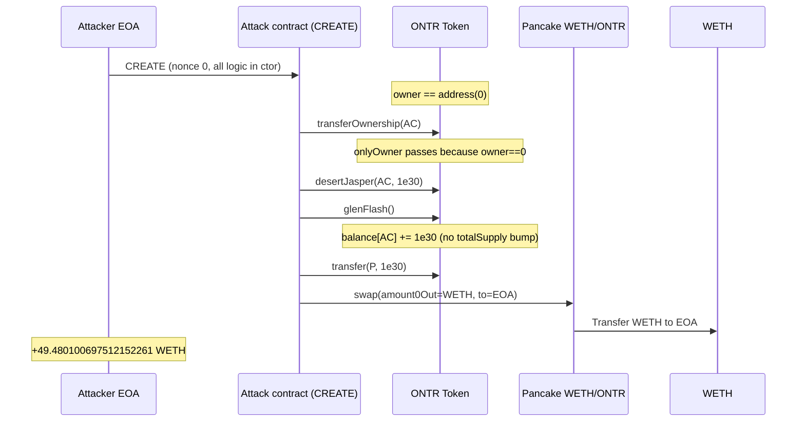

<!-- non-defihacklabs -->
# ONTR Token Zero-Owner `onlyOwner` Free Mint → Pancake WETH Drain

> **Vulnerability classes:** vuln/access-control/missing-owner-check · vuln/access-control/broken-logic · vuln/access-control/uninitialized-owner · vuln/logic/incorrect-state-transition

> **Reproduction:** the PoC compiles & runs in an isolated Foundry project at
> [this project folder](.). The fork is served offline from the bundled
> `anvil_state.json` (local anvil replays Ethereum state at block `25193099`), so no
> public RPC is required.
> Full verbose trace: [output.txt](output.txt).
> Verified vulnerable source: [Token.sol](sources/ontr/Token.sol),
> [Ownable.sol](sources/ontr/openzeppelin/contracts/access/Ownable.sol),
> [IERC20Metadata.sol](sources/ontr/openzeppelin/contracts/token/ERC20/extensions/IERC20Metadata.sol)
> (obfuscated custom ERC-20 stack verified on Etherscan as contract `Token`).

---

## Key info

| | |
|---|---|
| **Loss** | **49.480100697512152261 WETH** (exact wei: `49480100697512152261`) |
| **Vulnerable contract** | ONTR (`OpenTrade`) — [`0xf074865358b0dd039beee075831f8a2ae6b1f3f3`](https://etherscan.io/address/0xf074865358b0dd039beee075831f8a2ae6b1f3f3#code) |
| **Attacker EOA** | [`0xE806B37A9F965bd9D54AaDf9560C78957550b760`](https://etherscan.io/address/0xE806B37A9F965bd9D54AaDf9560C78957550b760) |
| **Attack contract** | [`0xD7A33e89aBC1Ac5b2497D9589c81784A2BC52491`](https://etherscan.io/address/0xD7A33e89aBC1Ac5b2497D9589c81784A2BC52491) (CREATE in attack tx, nonce 0) |
| **Victim pair** | [`0xd46D89f4675bc96328fBDEB443842cdB5Fcd83FD`](https://etherscan.io/address/0xd46D89f4675bc96328fBDEB443842cdB5Fcd83FD) (PancakeSwap V2 WETH/ONTR on Ethereum) |
| **Attack tx** | [`0x98f80eff…`](https://etherscan.io/tx/0x98f80eff0ce609606bb73cef3edfbb4c1d415ffc7676fec16f4d980c54903621) (entire drain in constructor) |
| **Chain / block / date** | Ethereum mainnet / fork `25193099` (attack in `25193100`) / ~2026-05-29 |
| **Compiler** | Solidity `0.8.20` |
| **Bug class** | Custom `onlyOwner` treats `owner == address(0)` as authorized → free ownership seize → free balance inflate |
| **Alert** | [SlowMist TI](https://x.com/SlowMist_Team/status/2060208317574906076) |

> **Chain note.** Early intake listed BSC. On-chain verification shows **Ethereum**:
> pair `token0` is mainnet WETH `0xC02a…`, factory is Pancake on ETH
> `0x1097053Fd2ea711dad45caCcc45EfF7548fCB362`. Do not conflate with
> `2026-05-SEAToken_exp` (different MetaSea protocol on Arbitrum).

---

## TL;DR

1. ONTR ships a **custom Ownable** whose `onlyOwner` is:
   ```solidity
   require(hazeDeer == address(0) || hazeDeer == _msgSender());
   ```
   When ownership has been renounced (`owner == 0`), **any caller** is treated as owner.

2. Pre-attack `owner()` was `address(0)`.

3. Attacker CREATE (nonce 0) constructor:
   - `transferOwnership(this)` — seize ownership
   - `desertJasper(this, 1e30)` — queue a hidden balance credit
   - `glenFlash()` → `ashBud` — `balance[this] += 1e30` **without** bumping `totalSupply`
   - `transfer(pair, 1e30)` + `swap` → **49.4801 WETH** to the EOA

---

## Background

`Token` (ONTR / OpenTrade) is an obfuscated ERC-20 with a custom ownership /
allowlist / “pending balance” subsystem nested under a fake OpenZeppelin path
(`openzeppelin/contracts/token/ERC20/extensions/IERC20Metadata.sol` is **not**
the real OZ interface — it is the attack surface).

Relevant pieces:

| Symbol (obfuscated) | Role |
|---------------------|------|
| `hazeDeer` | owner storage |
| `hawkDeck` | balances mapping |
| `loftQuilt` | totalSupply |
| `desertJasper` | onlyOwner: queue `(recipient, amount)` into `moorSouth` |
| `glenFlash` | **permissionless**: apply all queued credits via `ashBud` |
| `ashBud` | `hawkDeck[account] += amount` (no supply update) |

---

## The vulnerable code

### Broken `onlyOwner` (root cause)

```20:23:sources/ontr/openzeppelin/contracts/access/Ownable.sol
    modifier onlyOwner() {
        require(hazeDeer == address(0) || hazeDeer == _msgSender());
        _;
    }
```

Correct Ownable is `require(owner == msg.sender)`. The extra
`hazeDeer == address(0)` branch turns **renounced ownership into open admin**.

`transferOwnership` is gated only by this modifier:

```25:28:sources/ontr/openzeppelin/contracts/access/Ownable.sol
    function transferOwnership(address tideFlint) public virtual onlyOwner {
        require(tideFlint != address(0));
        smokeAxe(tideFlint);
    }
```

### Free balance inflate path

```134:146:sources/ontr/openzeppelin/contracts/token/ERC20/extensions/IERC20Metadata.sol
    function desertJasper(address starField, uint256 meadowWood) public onlyOwner {
        require(roseBanner(_msgSender()));
        // ...
        marchTree[harborCoil] = bufferMyrtle(address(0), starField, meadowWood, block.timestamp);
        if (meadowWood > 0) {
            moorSouth.push(harborCoil);
        }
        vortexMesa.push(harborCoil);
        harborCoil++;
    }
```

```178:189:sources/ontr/openzeppelin/contracts/token/ERC20/extensions/IERC20Metadata.sol
    function glenFlash() external {
        uint256 sandFern = moorSouth.length;
        for (uint256 storkWind = 0; storkWind < sandFern; storkWind++) {
            uint256 riverDawn = moorSouth[storkWind];
            bufferMyrtle storage mapleTusk = marchTree[riverDawn];
            ashBud(mapleTusk.starField, mapleTusk.meadowWood);
        }
        delete moorSouth;
    }
```

```49:51:sources/ontr/Token.sol
    function ashBud(address depthDock, uint256 meadowWood) internal virtual override {
        hawkDeck[depthDock] += meadowWood;
    }
```

`ashBud` is **not** a mint: it never increments `loftQuilt` (`totalSupply`). The
pair still prices the inflated ERC-20 balance as real supply when swapping.

---

## Root cause

Two bugs compose:

1. **Auth hole:** `onlyOwner` succeeds for everyone after renounce.
2. **Hidden mint:** owner-gated `desertJasper` + public `glenFlash`/`ashBud`
   increases spendable balance without updating `totalSupply` or emitting a
   proper mint event from `address(0)` via the normal `deltaPlume` path.

Either alone is dangerous; together they let an unprivileged CREATE drain the
only liquid market (WETH/ONTR Pancake pair).

---

## Preconditions

- ONTR `owner() == address(0)` (confirmed at block `25193099`).
- Live Pancake pair with ~50.03 WETH reserves.
- Attacker EOA with nonce 0 (historical CREATE address) and gas.

---

## Attack walkthrough

Historical attack is a **single CREATE** — no separate attack call.



On-chain log highlights (attack tx `0x98f80eff…`, block `25193100`):

1. `OwnershipTransferred(0x0 → 0xD7A33e89…)`
2. `Transfer(0xD7A33e89… → pair, 1e30)` (inflated ONTR)
3. `Transfer(pair → EOA, 49480100697512152261)` (WETH)
4. Pair Sync: WETH reserve collapses from ~50.03 → ~0.55

PoC assertions (offline `output.txt`):

- Attacker WETH profit = `49480100697512152261`
- `totalSupply` unchanged at `1e27`
- New owner = attack contract

---

## Remediation

1. **Fix `onlyOwner`:** `require(owner() == msg.sender)` only. Never treat
   `address(0)` as authorized.
2. **If renouncing, burn admin paths:** after renounce, `transferOwnership`,
   `desertJasper`, `recover`, etc. must permanently revert.
3. **No silent balance credits:** any balance increase must go through a real
   mint that updates `totalSupply` and is access-controlled with a non-zero owner
   or a timelocked governance role.
4. **Do not leave permissionless appliers** (`glenFlash`) sitting on top of
   owner-gated queues after ownership is gone.

---

## How to reproduce

```bash
# Offline (no RPC):
_shared/run_poc.sh 2026-05-ONTR_exp -vvvvv
# Expect: [PASS] testExploit — Attacker WETH profit 49.480100697512152261
```

Historical CREATE initcode is embedded in `test/ONTR_exp.sol` and replayed at
fork block `25193099`. A clean synthetic path lives in `test/2026-05-ONTR.sol`
for the site playground.

*Reference: [SlowMist TI alert](https://x.com/SlowMist_Team/status/2060208317574906076)*
